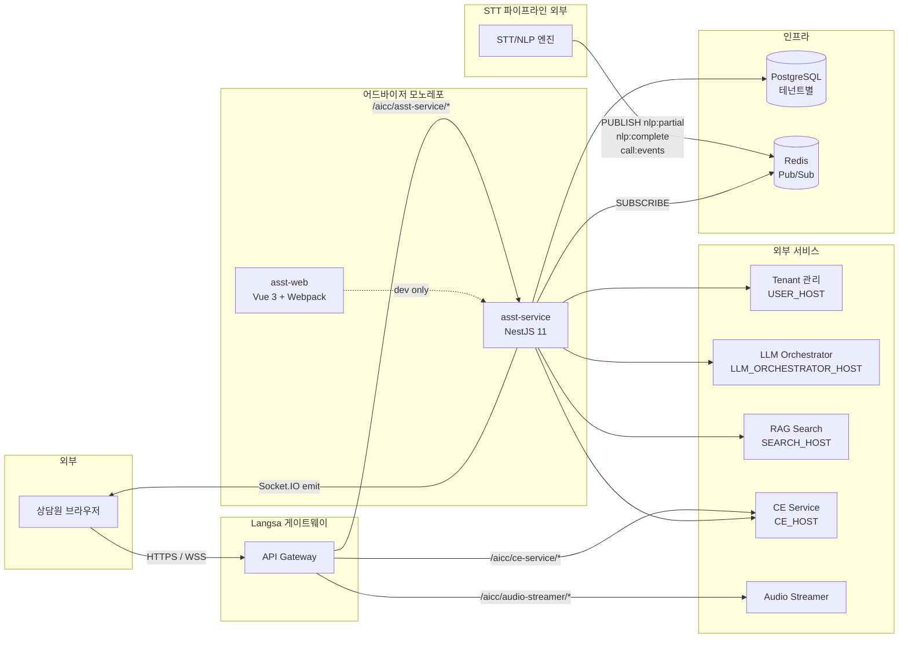

# 전체 아키텍처 개요

> 이 문서는 후임자가 Advisor 시스템 전체를 한눈에 파악하기 위한 진입점입니다.
> 세부 내용은 각 챕터([01-multi-tenant-db](01-multi-tenant-db.md), [02-realtime-streaming](02-realtime-streaming.md), [03-frontend](03-frontend.md), [04-data-model](04-data-model.md))로 이동하세요.
> Advisor 가 속한 **AICC 전체 시스템** 의 위치는 [aicc-system-context.md](aicc-system-context.md) (drawio 다이어그램 포함) 참조.

---

## 1. 시스템이 하는 일

**Advisor (상담 어시스트)** 는 콜센터 상담원이 통화 중·후에 활용하는 AI 보조 플랫폼입니다.

핵심 기능 4가지:

1. **실시간 발화 표시** — 외부 STT 엔진이 만든 텍스트를 발화 단위로 채팅 UI에 실시간 표시
2. **AI 상담 보조** — 고객 발화 확정 시 RAG 검색 + LLM 답변을 SSE로 스트리밍
3. **통화 후 요약/코칭** — LLM으로 통화 내용 요약, 키워드 추출, 관리자 코칭 메시지 전달
4. **부가 기능** — 즐겨찾기, 메모, 공지, 할일, 통화 통계, 키워드 감지, 사용자/그룹 관리

---

## 2. 컴포넌트 구성도



핵심 포인트:

- **모든 트래픽은 Langsa 게이트웨이 단일 진입점**을 거침. 브라우저가 asst-service에 직접 붙는 일은 없음(개발 환경 제외).
- **STT/NLP 엔진은 asst-service 외부**에 있으며, Redis Pub/Sub으로 발화 텍스트를 흘려보냄. asst-service는 이를 구독해서 Socket.IO로 클라이언트에 중계함.
- **DB는 테넌트별로 물리적으로 분리**됨. asst-service는 요청 토큰으로 어느 DB에 붙을지 동적으로 결정 ([01-multi-tenant-db.md](01-multi-tenant-db.md)).

---

## 3. 모노레포 구성

```
advisor/
├── asst-service/       # NestJS 11 백엔드 (Express 5, path-to-regexp v8)
│   ├── src/
│   │   ├── advisor/        # 17개 도메인 모듈 (Controller→Service→Entity)
│   │   ├── common/         # auth, guards, gateways, dynamic-db, proxy
│   │   └── config/         # DB/Redis/Winston/validation 설정
│   └── migrations/         # SQL 마이그레이션 19개 (수동 적용)
│
├── asst-web/           # Vue 3 + Pinia + Webpack 프론트엔드
│   └── src/
│       ├── view/advisor/   # admin / agent / consultant / manage
│       ├── stores/         # Pinia 모듈 30+
│       ├── api/            # apiPlugin, socketIOPlugin, config/path
│       └── utils/          # redisKey, SocketClient, AdvisorbotClient
│
├── asst-web-ui/        # UI 전용 mock 데모 (실제 서비스 아님 — 디자인 검증용)
├── adv_docs/           # 이 문서 디렉토리
└── docs/               # adv_docs 심볼릭 링크
```

> **⚠️ `asst-web-ui`는 별도 프로젝트** — 후임자가 헷갈리기 쉽습니다. UI 디자인 검증용 mock 데모이며 실제 운영 코드 아닙니다 ([asst-web-ui/PROJECT.md](../asst-web-ui/PROJECT.md)).

---

## 4. 핵심 데이터 흐름 3가지

### 4-1. 일반 HTTP API 요청

```
브라우저 ─(x-auth-token)→ 게이트웨이 ─(routing)→ asst-service
   └─ TraceIdMiddleware → AuthMiddleware (토큰→DB 동적 연결 부착)
   └─ Controller → Service → req.dbConnection 사용
   └─ ValidationPipe (whitelist + forbidNonWhitelisted)
   └─ DbCleanupInterceptor (연결 풀에 위임, 명시적 해제 X)
```

상세: [01-multi-tenant-db.md](01-multi-tenant-db.md)

### 4-2. 실시간 발화/이벤트 (Redis → Socket.IO)

```
[외부 STT/NLP] PUBLISH {env}:{tenantId}:{agentId}:call:nlp:partial
                                              :call:nlp:complete
                                              :call:events
                                              :call:orchestrator:persisted

asst-service: RedisService.subscribe(channel)
             → SocketGateway.broadcastToRedisMonitorRoom()
             → server.to(channel).emit('redis-message', {channel, message, ts})

브라우저: socket.emit('join-room', channel) 으로 채널별 room 가입
        socket.on('redis-message') → useChatMessageParser.parseMessageData()
```

상세: [02-realtime-streaming.md](02-realtime-streaming.md)

### 4-3. AI 상담 보조 (RAG/LLM SSE)

```
브라우저: handleAssistStream(customerQuery, ...)
   POST /api/asst/v1/assist-stream  (Accept: text/event-stream)
   ↓
asst-service: AssistStreamController → AssistStreamService.stream()
   fetch SEARCH_HOST/api/v1/rag/assist-stream
   upstream SSE → res.write() 그대로 relay
   클라이언트 abort 시 AbortController로 upstream도 함께 끊음
```

상세: [02-realtime-streaming.md#assist-stream-sse](02-realtime-streaming.md)

---

## 4-4. 전체 시스템 컨텍스트 (AICC)

Advisor 는 AICC(AI Contact Center) 플랫폼의 한 서비스입니다. 다른 서비스(Tenant, Call Gateway, Agent Builder/CE, QA, TA, KMS, LLM Orchestrator) 와의 관계는:

- 다이어그램(17페이지 C4 모델): [diagrams/aicc-architecture.drawio](diagrams/aicc-architecture.drawio)
- 텍스트 설명 + 페이지 가이드: [aicc-system-context.md](aicc-system-context.md)

→ 외부 서비스 장애나 인터페이스 변경 시 위 다이어그램으로 영향 범위 빠르게 확인.

---

## 5. 외부 서비스 의존성 맵

| 변수 | 서비스 | 용도 | 호출 방식 |
|------|--------|------|-----------|
| `USER_HOST` | User 서비스 | 사용자/상담원 정보, 테넌트 DB 설정(`db_config`) 조회 | HTTP (axios) |
| `TENANT_HOST` | Tenant 관리 | (validation에 등록되어 있으나 현재 코드에서는 `USER_HOST`로 db_config 조회) | HTTP |
| `LLM_ORCHESTRATOR_HOST` | LLM Orchestrator | 프롬프트 기반 LLM 호출(요약, 자동 todo) | HTTP |
| `SEARCH_HOST` | RAG Search | `/api/v1/rag/assist-stream` SSE 호출 | HTTP SSE |
| `CE_HOST` | Call Experience | 어드바이저봇(고객 응대 챗봇) Socket.IO | WSS (별도) |
| `KNOWLEDGE_API_URL` | Knowledge | KMS 프록시 (즐겨찾기/검색 위임) | HTTP 프록시 |
| `AUDIO_SERVICE_API_URL` | Audio Streamer | 통화 녹취 재생 | HTTP 프록시 |
| `QA_API_URL` | QA | QA 프록시 | HTTP 프록시 |
| `AUTH_SERVICE_API_URL` | Auth | 인증 프록시 | HTTP 프록시 |
| `REDIS_HOST` | Redis | Pub/Sub | 클라이언트 + 구독자 2개 연결 |

프록시 컨트롤러는 [src/common/proxy/](../../asst-service/src/common/proxy/)에 모여 있습니다 (`ce-proxy`, `qa-proxy`, `user-proxy`, `knowledge-proxy`, `audio-proxy`, `ta-proxy`).

---

## 6. 기술 스택 요약

### 백엔드 ([asst-service/package.json](../../asst-service/package.json))

| 영역 | 라이브러리 / 버전 |
|------|-----------------|
| 프레임워크 | NestJS 11.1, Express 5, path-to-regexp v8 |
| ORM | TypeORM 0.3.25 + pg 8.16 |
| 실시간 | @nestjs/platform-socket.io, socket.io 4.8 |
| 검증 | class-validator, class-transformer, Joi (env validation) |
| 로깅 | nest-winston, winston-daily-rotate-file |
| 관측성 | @opentelemetry/sdk-node (자동 트레이싱) |
| 보안 | (별도 인증 라이브러리 없음 — `x-auth-token`을 USER_HOST에 위임) |
| 테스트 | Jest 30 |

### 프론트엔드 ([asst-web/package.json](../../asst-web/package.json))

| 영역 | 라이브러리 / 버전 |
|------|-----------------|
| 프레임워크 | Vue 3.5, Pinia 2.2 (+ persistedstate), vue-router 4 |
| 빌드 | Webpack 5 (Vite 아님), webpack-dev-server |
| UI 키트 | Element Plus 2.9, Quasar 2.12, @timbel-aicc/ecp-ui-kit, devextreme 21.2 |
| 실시간 | socket.io-client 4.7, sockjs-client, webstomp-client |
| 에디터 | tiptap 3, @toast-ui/editor |
| 차트/플로우 | highcharts 11, @vue-flow/*, gojs |
| 모듈 페더레이션 | @originjs/vite-plugin-federation (ECP 호스트 통합용) |
| 테스트 | Vitest 4 |

> ⚠️ 프론트엔드의 `devextreme 21.2.5`는 레거시 버전 고정 — ECP 호스트와의 호환성 때문. 함부로 업그레이드하지 말 것.

---

## 7. 환경 분리

`NODE_ENV` 별로 다른 동작:

| 값 | 용도 | 주요 차이 |
|------|------|-----------|
| `local` | 로컬 개발 | `DB_DIRECT_CON=1` 권장, TypeORM `synchronize:true`, 콘솔 로깅 |
| `development` | 개발 환경 | `DB_DIRECT_CON=0` 동적 DB 연결, SSL 적용 가능 |
| `production` | 운영 | HTTPS는 보통 게이트웨이에서 처리, SSL `rejectUnauthorized:false` |

`.env.{NODE_ENV}` → `.env` 순으로 로드 ([app.module.ts:16-19](../../asst-service/src/app.module.ts#L16-L19)).

프론트엔드는 `MODE` 환경변수로 분리 (Webpack):

```bash
npm run dev       # MODE=development
npm run local     # MODE=local
npm run build:dev # MODE=dev
npm run build:prd # MODE=prd
npm run aws       # MODE=aws
npm run ncp       # MODE=ncp
```

---

## 8. 다음에 읽을 문서

후임자에게 권장하는 학습 순서:

1. 이 문서 (전체 그림)
2. [aicc-system-context.md](aicc-system-context.md) — AICC 전체 컨텍스트 + drawio 다이어그램
3. [05-backend.md](05-backend.md) — 백엔드 모듈 구조 + BFF 선택 배경
4. [01-multi-tenant-db.md](01-multi-tenant-db.md) — 모든 API 요청이 어떻게 DB와 연결되는가
5. [02-realtime-streaming.md](02-realtime-streaming.md) — Redis/Socket/SSE 3종 스트리밍
6. [03-frontend.md](03-frontend.md) — Vue 화면 구성, Pinia, 핵심 컴포저블
7. [04-data-model.md](04-data-model.md) — ERD 요약, 테이블 ↔ 엔티티 매핑
8. [../specs/domains-overview.md](../specs/domains-overview.md) — 도메인별 책임
9. [../flows/call-lifecycle.md](../flows/call-lifecycle.md) — 통화 한 건의 전체 라이프사이클
10. [../api/conventions.md](../api/conventions.md) — API 규약
11. [../operations/env-variables.md](../operations/env-variables.md) — 환경변수 전체
12. [../operations/handover-checklist.md](../operations/handover-checklist.md) — 후임자 체크리스트
