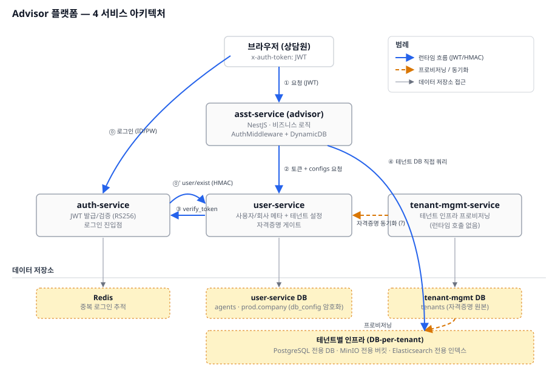
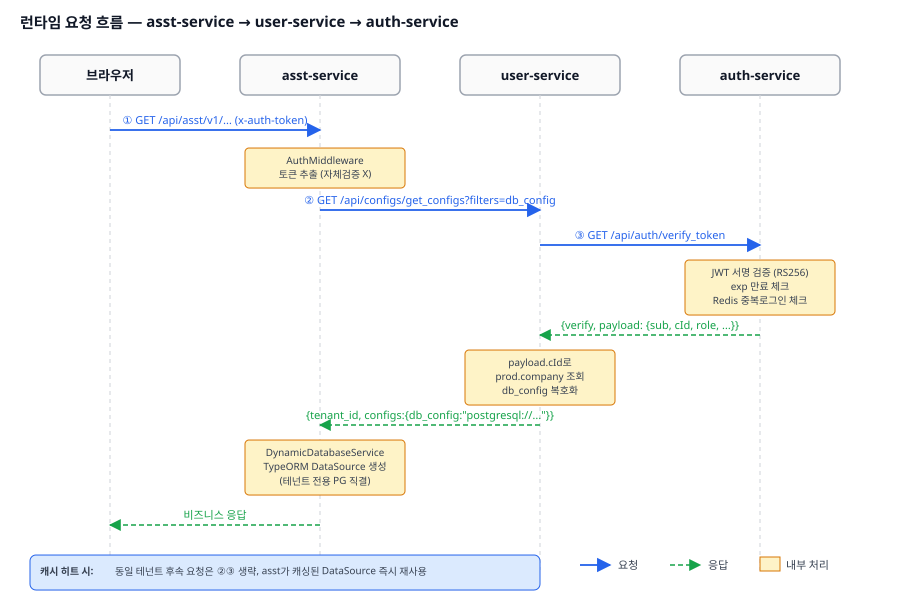
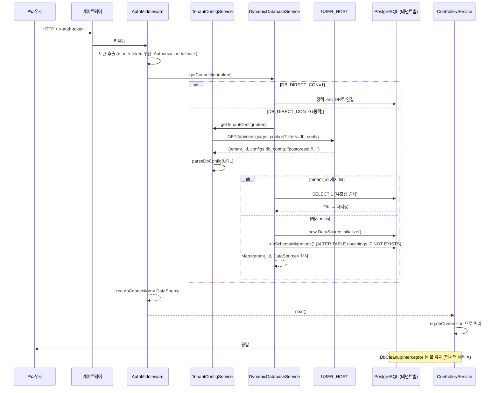

# 멀티테넌트 동적 DB 연결

> Advisor의 가장 중요한 인프라 패턴. 모든 API 요청의 진입점에서 동작합니다.

---

## 1. 왜 이렇게 설계했나

- **테넌트(고객사)마다 DB를 물리적으로 분리** — 데이터 격리 + 컴플라이언스
- 그렇지만 asst-service는 **단일 코드/단일 인스턴스**로 모든 테넌트를 서빙해야 함
- → 요청 시점에 토큰을 보고 동적으로 어느 DB에 붙을지 결정하는 패턴

---

## 📊 시각 자료 — auth / user / tenant-mgmt 서비스 흐름

> 인수인계 설명용 시각 자료입니다. asst-service가 인증(auth-service)·사용자/테넌트 설정(user-service)·인프라 프로비저닝(tenant-mgmt-service)과 어떻게 엮이는지를 보여줍니다. (GitHub/IDE에서 바로 렌더링됨)

### 4서비스 아키텍처



핵심 포인트:

- **auth-service** — 로그인 진입점. JWT 발급/검증(RS256). Redis로 중복 로그인 추적.
- **user-service** — 사용자/회사 메타 + 테넌트 설정(`db_config` 암호화 보관). 자격증명 게이트 역할.
- **tenant-mgmt-service** — 테넌트 인프라(DB-per-tenant: PostgreSQL/MinIO/Elasticsearch) **프로비저닝 전용**. **런타임 호출 없음** — user-service DB로 자격증명이 동기화되어 있고, asst-service는 그걸 통해 테넌트 DB에 직결.
- **asst-service** — `AuthMiddleware` + `DynamicDatabaseService`. 토큰을 자체 검증하지 않고 user-service 응답으로 간접 인증 + 테넌트 DB 연결.

### 런타임 요청 시퀀스



흐름 요약:

| # | 단계 | 주체 |
|---|------|------|
| ① | `GET /api/asst/v1/...` (`x-auth-token`) | 브라우저 → asst-service |
| - | `AuthMiddleware` 토큰 추출 (자체 검증 X) | asst-service |
| ② | `GET /api/configs/get_configs?filters=db_config` | asst-service → user-service |
| ③ | `GET /api/auth/verify_token` (JWT 서명/만료/중복로그인) | user-service → auth-service |
| - | `payload.cId` 로 `prod.company` 조회 + `db_config` 복호화 | user-service |
| ④ | `{tenant_id, configs:{db_config:"postgresql://..."}}` 응답 → 테넌트 DB 직결 | asst-service `DynamicDatabaseService` |
| - | 비즈니스 응답 | asst-service → 브라우저 |

> **캐시 히트 시**: 동일 테넌트의 후속 요청은 ②③ 생략, asst-service가 캐싱된 DataSource를 즉시 재사용 ([아래 5번 섹션](#5-동적-연결의-캐싱과-풀) 참조).

원본 파일: [diagrams/advisor-4service-architecture.svg](diagrams/advisor-4service-architecture.svg), [diagrams/advisor-runtime-sequence.svg](diagrams/advisor-runtime-sequence.svg)

---

## 2. 한 요청의 흐름



---

## 3. 핵심 파일

| 파일 | 역할 |
|------|------|
| [auth.middleware.ts](../../asst-service/src/common/middleware/auth.middleware.ts) | 토큰 추출 + DB 부착 (`req.dbConnection`) |
| [tenant-config.service.ts](../../asst-service/src/common/services/tenant-config.service.ts) | USER_HOST에서 db_config 조회 + URL 파싱 |
| [dynamic-database.service.ts](../../asst-service/src/common/services/dynamic-database.service.ts) | 테넌트별 DataSource 풀 관리 |
| [db-cleanup.interceptor.ts](../../asst-service/src/common/interceptors/db-cleanup.interceptor.ts) | 응답 후처리 (실제로는 no-op) |
| [database.config.ts](../../asst-service/src/config/database.config.ts) | 정적 DataSource 옵션 + 엔티티 등록 |

---

## 4. `DB_DIRECT_CON` 토글

가장 먼저 알아야 할 환경 스위치:

| 값 | 동작 | 사용처 |
|------|------|--------|
| `1` | 정적 연결 (`DB_HOST`/`DB_USERNAME` 등 env 사용) | 로컬 개발 |
| `0` | 테넌트별 동적 연결 (`USER_HOST`에서 db_config 조회) | dev/prod 배포 |

이 토글이 시스템 전체 동작을 가르는 가장 큰 분기입니다 ([dynamic-database.service.ts:53-58](../../asst-service/src/common/services/dynamic-database.service.ts#L53-L58)).

---

## 5. 동적 연결의 캐싱과 풀

```typescript
private readonly connections = new Map<string, DataSource>();
```

- key: `tenant_id` (USER_HOST 응답의 `tenant_id`)
- value: 초기화된 TypeORM `DataSource` (PG 연결 풀 max=20, min=2 포함)

캐시 hit 시 매 요청마다 `SELECT 1`로 유효성 검사 ([line 71-92](../../asst-service/src/common/services/dynamic-database.service.ts#L71-L92)). 연결이 죽어 있으면 destroy 후 재생성.

**PG 풀 설정** ([line 158-173](../../asst-service/src/common/services/dynamic-database.service.ts#L158-L173)):

```typescript
extra: {
  max: 20,                          // 테넌트당 최대 연결
  min: 2,
  idleTimeoutMillis: 30000,         // 30초 idle 후 회수
  connectionTimeoutMillis: 30000,
  statement_timeout: 60000,
  query_timeout: 60000,
  keepAlive: true,                  // TCP keepalive
  keepAliveInitialDelayMillis: 10000,
}
```

---

## 6. SSH 터널 프록시 (로컬 → prod DB)

`DB_PROXY_HOST` + `DB_PROXY_PORT`가 설정되면 테넌트의 host/port를 override ([line 104-113](../../asst-service/src/common/services/dynamic-database.service.ts#L104-L113)).

```
DB_PROXY_HOST=127.0.0.1
DB_PROXY_PORT=15432
```

이때 SSL은 자동으로 `rejectUnauthorized: false`로 강제됨.

---

## 7. 자동 스키마 마이그레이션 (⚠️ 주의)

매 연결 생성 시 `runSchemaMigrations()` 가 실행됩니다 ([line 410-444](../../asst-service/src/common/services/dynamic-database.service.ts#L410-L444)):

```typescript
// coachings 테이블에 누락된 컬럼이 있으면 자동으로 ALTER TABLE ADD COLUMN
await this.addColumnIfNotExists(ds, 'advisor', 'coachings', 'coaching_request_id', 'VARCHAR(64) NULL');
await this.addColumnIfNotExists(ds, 'advisor', 'coachings', 'sender_name', 'VARCHAR(100) NULL');
await this.addColumnIfNotExists(ds, 'advisor', 'coachings', 'customer_name', 'VARCHAR(100) NULL');
```

**즉, 마이그레이션 파일(`migrations/*.sql`)과 코드가 동시에 스키마를 건드리고 있습니다.** 새 컬럼 추가 시:

- 정식 마이그레이션으로만 처리 → 자동 마이그레이션 코드에서 제거
- 또는 자동 마이그레이션 유지 → 마이그레이션 파일과 중복 주의

**인수인계 시 합의 필요한 항목**.

---

## 8. 엔티티 등록 (두 곳 모두 수정 필수)

새 엔티티 추가 시 **반드시 두 곳에 등록**해야 합니다:

1. [src/config/database.config.ts](../../asst-service/src/config/database.config.ts) — 정적 연결용
2. [src/common/services/dynamic-database.service.ts](../../asst-service/src/common/services/dynamic-database.service.ts) — 동적 연결용 (import 추가 + entities 배열에 등록 — `getConnection`과 `getStaticConnection` 두 함수 모두에)

한쪽만 등록하면 `DB_DIRECT_CON` 토글에 따라 엔티티 인식 실패합니다.

---

## 9. 인증 동작의 진실

`AuthMiddleware`는 토큰을 **직접 검증하지 않습니다** ([auth.middleware.ts:135-136](../../asst-service/src/common/middleware/auth.middleware.ts#L135-L136)):

```typescript
// 토큰 검증은 더 이상 사용하지 않음
console.log(`[${requestId}] 🔍 토큰 검증 생략 (더 이상 사용하지 않음)`);
```

대신 **`TenantConfigService`가 `USER_HOST`에 호출한 결과가 200인지로 인증을 간접 검증**합니다. 토큰이 잘못되면 `USER_HOST`가 401을 반환 → `HttpException` 으로 변환되어 사용자에게 전달.

장점: 인증 로직 중앙 집중 (USER 서비스 단일 진실원)
단점: USER 서비스 장애 시 모든 요청이 실패. `USER_HOST` 다운타임은 곧 Advisor 다운타임.

---

## 10. 인증 우회 경로

`AppModule` 의 `configure()` 에서 일부 경로는 미들웨어 제외 ([app.module.ts:32-40](../../asst-service/src/app.module.ts#L32-L40)):

```typescript
consumer.apply(TraceIdMiddleware, AuthMiddleware)
  .exclude(
    'api/asst/v1/health/check',
    'api/asst/v1/assist-stream',          // ⚠️ SSE는 인증 우회
    'api/asst/v1/proxy/audio/stream/playback',
  )
  .forRoutes('*path');
```

**⚠️ `assist-stream` 엔드포인트가 인증 미들웨어를 우회**한다는 사실은 별도 검증 책임이 있음을 의미합니다. 현재 [assist-stream.service.ts:82-83](../../asst-service/src/advisor/assist-stream/services/assist-stream.service.ts#L82-L83)에 테넌트 ID가 하드코딩 (`X-Tenant-Id: 00000000-...`)되어 있는 것이 TODO로 남아 있습니다.

---

## 11. `DbCleanupInterceptor`의 진실

이름과 달리 **연결을 끊지 않습니다**. 응답 시점에 로그만 남기고 풀이 관리하도록 위임합니다 ([db-cleanup.interceptor.ts:33-37](../../asst-service/src/common/interceptors/db-cleanup.interceptor.ts#L33-L37)):

```typescript
next: () => {
  // 연결 풀 사용으로 인해 연결 해제하지 않음
  // 연결 풀이 자동으로 연결을 관리함
  this.logger.debug(`[${requestId}] 요청 완료 - DB 연결은 풀에서 자동 관리`);
},
```

→ 이름을 그대로 두면 후임자가 헷갈릴 수 있어서 **로깅용 인터셉터로 리네이밍 또는 제거 고려** 항목.

---

## 12. 알려진 리스크 / 인계 시 강조 포인트

1. **테넌트 수 = 메모리 증가** — 매핑된 모든 DataSource가 영구 보존됨. `closeConnection()`을 호출하는 코드가 없음. 테넌트 누적 시 메모리 누수 우려.
2. **USER_HOST 장애 → 전체 장애** — 캐시 hit가 되어 있는 동안은 동작하지만, 새 테넌트나 캐시 만료 후엔 무력화됨.
3. **자동 마이그레이션이 매번 실행** — `information_schema` 조회 비용. 안정화 시점에 제거 권장.
4. **엔티티 추가 시 2곳 수정 잊지 말 것** — 흔한 실수 포인트.
5. **`AuthMiddleware`에서 console.log 다수** — 토큰 일부가 로그에 남음. 운영 환경에서는 `TraceLogger`로 일원화 필요.
6. **`x-auth-token` vs `Authorization`** — 둘 다 받지만 `x-auth-token`이 우선. 게이트웨이가 어느 헤더로 넘기는지 환경별 확인.

---

## 13. 디버깅 팁

- **연결 상태 조회**: `DynamicDatabaseService.getConnectionDetails()` — 현재 캐싱된 테넌트 목록 반환
- **활성 연결 수**: `getActiveConnectionCount()` — 운영 모니터링에 활용
- **연결 강제 재생성**: 코드상에서 `closeConnection(tenantId)` 호출 후 다음 요청에서 자동 재생성

테스트는 [dynamic-database.service.spec.ts](../../asst-service/src/common/services/dynamic-database.service.spec.ts) 참고.
