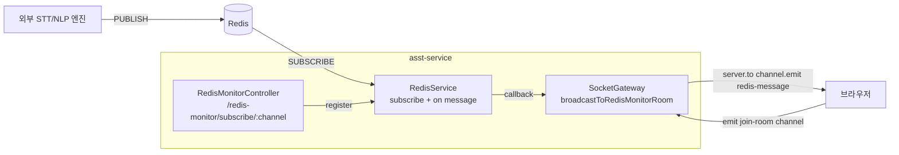
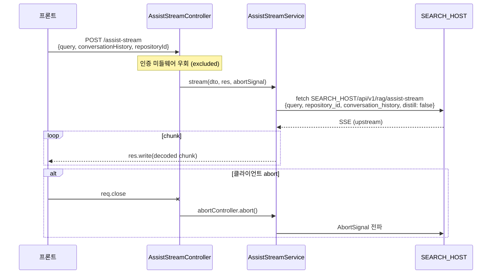

# 실시간 스트리밍 (Redis + Socket.IO + SSE)

> Advisor의 실시간 기능은 3가지 다른 메커니즘이 섞여 있습니다. **반드시 구분**해서 이해해야 합니다.

| 구분 | 용도 | 채널 | 출처 |
|------|------|------|------|
| **Redis Pub/Sub → Socket.IO** | STT 발화, 통화 이벤트 | `nlp:partial`, `nlp:complete`, `call:events`, `orchestrator:persisted` | 외부 STT/NLP 엔진 |
| **Socket.IO 직접 emit** | 코칭 메시지, 공지, 상담원 상태 | Socket 이벤트 (`coaching`, `notice`, `agent-status`) | asst-service 내부 트리거 |
| **HTTP SSE** | AI 상담 보조 (RAG/LLM 답변) | `POST /assist-stream` | asst-service → SEARCH_HOST relay |

---

## 1. Redis Pub/Sub → Socket.IO (메인 스트림)

### 1-1. 전체 구조



핵심: **백엔드는 어떤 채널을 구독할지 미리 알지 못한다**. 프론트가 `POST /redis-monitor/subscribe/{channel}`로 요청해야 백엔드가 구독을 시작.

### 1-2. Redis 채널 키 규칙

[asst-web/src/utils/redisKey.ts](../../asst-web/src/utils/redisKey.ts):

```typescript
export const getRedisKey = (tenantId, agentId, serviceName) => {
  const environment = process.env.VITE_USER_NODE_ENV;
  switch (serviceName) {
    case "nlp":     return `${env}:${tenantId}:${agentId}:call:nlp:complete`;
    case "partial": return `${env}:${tenantId}:${agentId}:call:nlp:partial`;
    case "events":  return `${env}:${tenantId}:${agentId}:call:events`;
    case "db":      return `${env}:${tenantId}:${agentId}:call:orchestrator:persisted`;
  }
};
```

| 채널 (suffix) | 페이로드 의미 |
|------|--------------|
| `:call:nlp:partial` | 발화 중 누적 텍스트 (`origin_text`, `masked_text=""`, `nlp=null`) |
| `:call:nlp:complete` | 발화 확정 (`masked_text`, `nlp={intent, keywords, search_query}`) |
| `:call:events` | 통화 시작/종료 (`type: "start" | "end"`, `call_id`, `customerNum`) |
| `:call:orchestrator:persisted` | DB 저장 완료 신호 (`callstats_id` 부여) |

> ⚠️ `environment` prefix가 빌드 모드별로 다름 (`dev`, `prod` 등). 채널명이 안 맞으면 메시지 자체가 도달 안 함. 환경별 빌드 시 반드시 확인.

### 1-3. 백엔드 구독 등록 흐름

[redis-monitor.controller.ts](../../asst-service/src/common/controllers/redis-monitor.controller.ts):

```
POST /redis-monitor/subscribe/{channel}
  ↓
RedisMonitorController.startMonitoring()
  ├─ ensureRedisConnected() (최대 3회 재연결 시도)
  ├─ RedisService.subscribe(channel, callback)
  │     └─ redis-client.subscribe → subscriber.on('message')
  ├─ SocketGateway.createRedisMonitorRoom(channel)
  └─ Response: { endpoint, room, event: 'redis-message' }
```

Redis 메시지 수신 → broadcast:

```typescript
// redis-monitor.controller.ts:411-443
private handleChannelMessage(message) {
  const broadcastData = {
    channel: message.channel,
    message: message.message,         // 원본 JSON string
    timestamp: message.timestamp.toISOString(),
    source: 'redis',
  };
  this.socketGateway.broadcastToRedisMonitorRoom(message.channel, broadcastData);
}
```

→ `SocketGateway.broadcastToRedisMonitorRoom()` ([socket.gateway.ts:561-622](../../asst-service/src/common/gateways/socket.gateway.ts#L561-L622)):

```typescript
this.server.to(channel).emit('redis-message', broadcastData);
```

### 1-4. 프론트엔드 수신 흐름

```
useChatSocket.ts
  ├─ socket = getSocket()  (싱글톤)
  ├─ socketChannels = [getRedisKey('nlp'), getRedisKey('partial'),
  │                    getRedisKey('events'), getRedisKey('db')]
  ├─ 각 채널마다 socket.emit('join-room', channel)
  └─ socket.on('redis-message', raw) → useChatMessageParser.parseMessageData(raw)
```

`parseMessageData()` 가 channel suffix로 분기:

```typescript
if (channel.includes(':call:events'))     → 통화 start/end 처리
else if (channel.includes('stt:final'))   → (현재 무처리, 향후용)
else if (channel.includes('nlp:partial')) → 스트리밍 버블 생성/갱신
else if (channel.includes('nlp:complete'))→ 버블 확정 + NLP 적용 + assist-stream 트리거
else if (channel.includes('orchestrator:persisted')) → callstats_id 저장
```

상세는 [useChatMessageParser.ts](../../asst-web/src/view/advisor/components/chat/composables/useChatMessageParser.ts) 참조.

### 1-5. 스트리밍 발화 표시 로직

발화자별로 진행 중인 버블 1개를 추적:

```typescript
const streamingBySpeaker: Record<"user" | "consultant", { id, turnIdx } | null> = {
  user: null,
  consultant: null,
};
```

**`nlp:partial` 수신 시** ([useChatMessageParser.ts:245-309](../../asst-web/src/view/advisor/components/chat/composables/useChatMessageParser.ts#L245-L309)):

| 상태 | 동작 |
|------|------|
| `streamingBySpeaker[sender]`가 같은 `turn_idx` | 버블 텍스트만 update (`updateChatMessage`) — 새 버블 생성 X |
| 다른 `turn_idx` 또는 null | 이전 스트리밍 버블이 있으면 강제 확정, 새 버블 추가 후 `streamingBySpeaker[sender] = { id, turnIdx }` 저장 |

**`nlp:complete` 수신 시**:

| 상태 | 동작 |
|------|------|
| 같은 `turn_idx` 스트리밍 버블 있음 | `isStreaming: false` + NLP(intent/keywords) 데이터 적용. 고객 발화면 `handleAssistStream()` 트리거 |
| 스트리밍 버블 없음 | 신규 버블 생성 (하위 호환 경로) |

**`call:events`**:

- `type: "start"` → `streamingBySpeaker` 초기화 + `clearChatContent()` + 상담원 상태 `ON_CALL`
- `type: "end"` → 진행 중인 모든 스트리밍 버블 강제 확정 + 상담원 상태 `AFTER_CALL`

### 1-6. Turn Merge 로직 (추가됨)

계획서에는 없지만 실제 코드엔 `pendingMergeBySpeker`가 추가되어 있습니다. 짧은 시간 안에 들어온 `nlp:complete` 직후 도착한 `nlp:partial`을 같은 버블에 합쳐서 한 발화로 처리하는 로직 — `TURN_MERGE_TIMEOUT_MS` 동안 대기 후 별도 발화로 분리.

이유: STT 엔진이 `complete`를 너무 빨리 끊는 경우(EOU 오판) 한 발화가 두 개로 쪼개지는 현상 방지. 자세한 배경은 [adv_docs/specs/nemo-turn-eou-mismatch-report.md](../specs/nemo-turn-eou-mismatch-report.md) 참조.

### 1-7. 성능 최적화 포인트

partial 메시지가 초당 수십 개씩 들어올 수 있어 다음과 같이 최적화되어 있음:

- **`chatContent` 배열 자체가 아니라 항목만 swap** — 배열 reference는 유지, 인덱스 위치의 객체만 교체 → reactive triggers 최소화
- **`clippedIds` 별도 ref 분리** — partial마다 발생하던 O(N) filter 비용 제거 ([index.vue:831-833](../../asst-web/src/view/advisor/components/chat/index.vue#L831-L833))
- **`.chat-item`에 CSS `contain`** + **`v-memo`** — 한 버블의 reflow가 형제로 전파 X

리팩토링 시 이 최적화들이 깨지지 않도록 주의 필요. 자세한 배경은 [adv_docs/plans/done/2026-05-08-virtual-scroll.md](../plans/done/2026-05-08-virtual-scroll.md), [2026-04-27-chat-index-refactor-plan.md](../plans/done/2026-04-27-chat-index-refactor-plan.md) 참조.

---

## 2. Socket.IO 직접 emit (코칭/공지/상담원 상태)

Redis 경유 없이 백엔드에서 직접 emit하는 경로. 핸들러는 `src/common/gateways/handlers/` 에 분리되어 있음.

| 핸들러 | 역할 | 위치 |
|------|------|------|
| `CoachingSocketHandler` | 코칭 메시지 실시간 전달 (Redis 코칭 채널 별도 구독) | [coaching-socket.handler.ts](../../asst-service/src/common/gateways/handlers/coaching-socket.handler.ts) |
| `NoticeSocketHandler` | 공지 푸시 | [notice-socket.handler.ts](../../asst-service/src/common/gateways/handlers/notice-socket.handler.ts) |
| `AgentStatusSocketHandler` | 상담원 상태 broadcast | [agent-status-socket.handler.ts](../../asst-service/src/common/gateways/handlers/agent-status-socket.handler.ts) |

`CoachingSocketHandler`는 Gateway 초기화 시점에 자체 채널 구독을 시작 ([socket.gateway.ts:128](../../asst-service/src/common/gateways/socket.gateway.ts#L128)):

```typescript
await this.coachingHandler.subscribeToChannels();
```

상세 메시지 형식은 [domain-coaching.md](../specs/domains-overview.md#coaching) 참고.

---

## 3. HTTP SSE (Assist Stream — RAG/LLM 답변)

고객 발화가 확정되면 → 관련 문서 검색 + LLM 답변을 SSE로 받는 별도 경로.

### 3-1. 흐름



### 3-2. 핵심 파일

| 파일 | 역할 |
|------|------|
| [assist-stream.controller.ts](../../asst-service/src/advisor/assist-stream/controllers/assist-stream.controller.ts) | 엔드포인트 진입 + AbortController 연결 |
| [assist-stream.service.ts](../../asst-service/src/advisor/assist-stream/services/assist-stream.service.ts) | upstream fetch + relay |
| [assist-snapshot.service.ts](../../asst-service/src/advisor/assist-stream/services/assist-snapshot.service.ts) | 검색 결과 + LLM 답변을 DB에 스냅샷 저장 |
| [conversation-history.util.ts](../../asst-service/src/advisor/assist-stream/services/conversation-history.util.ts) | 채팅 히스토리를 RAG가 받는 형식으로 변환 |

### 3-3. 인계 시 주의 포인트

1. **인증 미들웨어 우회** — `app.module.ts`에서 명시적 exclude 되어 있음. 별도 검증이 없으므로 인증 강화 필요 시 컨트롤러에 가드 추가.
2. **테넌트 ID 하드코딩 TODO** ([assist-stream.service.ts:82-83](../../asst-service/src/advisor/assist-stream/services/assist-stream.service.ts#L82-L83)):
   ```typescript
   'X-Tenant-Id': '00000000-0000-0000-0000-000000000000',
   ```
   멀티테넌트 환경 정식 가동 전 반드시 토큰→tenantId 연동 필요.
3. **SSE 헤더 설정**: `text/event-stream`, `no-cache`, `X-Accel-Buffering: no` (Nginx 버퍼링 방지)
4. **`SEARCH_HOST` 미설정 → 503** — env 누락 시 fail-fast
5. **자세한 설계 배경**: [adv_docs/plans/done/2026-04-18-assist-stream-sse-design.md](../plans/done/2026-04-18-assist-stream-sse-design.md)

---

## 4. Socket.IO 게이트웨이 경로

### 4-1. 클라이언트 → 서버 라우팅

[socket.gateway.ts:31-32](../../asst-service/src/common/gateways/socket.gateway.ts#L31-L32) 주석:

```
브라우저 path = /aicc/asst-service/socket.io
   ↓ (Langsa 게이트웨이 StripPrefix=2 + PrefixPath=/api/asst/v1)
asst-service /api/asst/v1/socket.io
```

### 4-2. 클라이언트 초기화

[asst-web/src/view/advisor/consultant/index.vue:49-52](../../asst-web/src/view/advisor/consultant/index.vue#L49-L52):

```typescript
initSocket({
  baseUrl: LANGSA_GATEWAY_URL,
  path: `${path.ADVISOR.API_PREFIX}/socket.io`,  // "/aicc/asst-service/socket.io"
});
```

### 4-3. K8s sticky session 주의

`SocketGateway.broadcastToRedisMonitorRoom()`에 K8s sticky session 경고 로직이 들어 있음 ([line 582-589](../../asst-service/src/common/gateways/socket.gateway.ts#L582-L589)):

```
⚠️ NO CLIENTS IN ROOM: Load Balancer sticky session 설정을 확인하세요
🔧 ALB target-group-attributes: stickiness.enabled=true 필요
```

같은 사용자가 다른 pod로 라우팅되면 룸이 비어 메시지 유실 발생. **AWS ALB / NCP Load Balancer 모두 sticky session 활성화 필수**.

---

## 5. 어드바이저봇 소켓 (별도)

상담원 화면의 챗봇(어드바이저봇 = 고객 응대용 LLM 봇)은 **asst-service가 아닌 CE 서비스**에 직접 연결됨:

[asst-web/src/composables/useAdvisorbot.ts:151-157](../../asst-web/src/composables/useAdvisorbot.ts#L151-L157):

```typescript
await store.initialize({
  baseUrl: LANGSA_GATEWAY_URL,
  path: `${path.CE.PREFIX}/socket.io`,  // "/api/ce/v1/socket.io"
});
```

→ 메인 소켓(asst-service)과는 별도 인스턴스. 헷갈리지 말 것.

---

## 6. 디버깅

| 도구 | 방법 |
|------|------|
| Redis 구독 상태 | `GET /redis-monitor/status` |
| Room 상태 | `GET /redis-monitor/debug/rooms` |
| 채널 모니터링 시작 | `POST /redis-monitor/subscribe/{channel}` |
| 채널 모니터링 중지 | `DELETE /redis-monitor/unsubscribe/{channel}` |
| 전체 중지 | `DELETE /redis-monitor/unsubscribe-all` |

브라우저 콘솔에서 `socket.on('redis-message', ...)` 로 raw 메시지 확인 가능.

`useChatMessageParser`의 `[stt-diag]` warn 로그 ([line 121-123](../../asst-web/src/view/advisor/components/chat/composables/useChatMessageParser.ts#L121-L123)): agent_id 불일치로 silent drop되는 케이스 추적용.

---

## 7. 자주 발생하는 이슈

| 증상 | 원인 후보 | 확인 |
|------|----------|------|
| STT 발화가 안 보임 | environment prefix 불일치 | `redisKey.ts`의 `VITE_USER_NODE_ENV` |
| 일부 메시지만 누락 | K8s sticky session 미설정 | LB 설정 |
| 통화 종료 후 버블 멈춤 | `streamingBySpeaker` 미해제 | `call:events end` 핸들러 확인 |
| Redis 재연결 안 됨 | `RedisService.reconnect()` 실패 | `/redis-monitor/status` |
| assist-stream 503 | `SEARCH_HOST` 미설정 | env 확인 |
| assist-stream 답변이 다른 테넌트 데이터 | `X-Tenant-Id` 하드코딩 TODO | [assist-stream.service.ts:82-83](../../asst-service/src/advisor/assist-stream/services/assist-stream.service.ts#L82-L83) |
