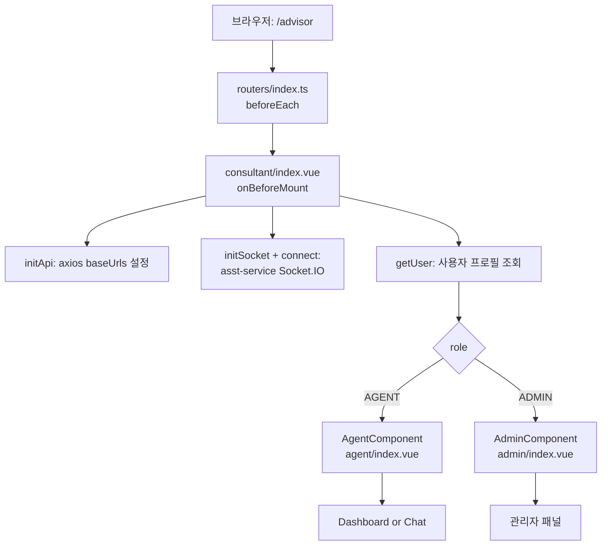

# 프론트엔드 아키텍처 (asst-web)

> Vue 3 + Pinia + Webpack 기반. ECP(ecs-cloud-portal) 호스트에 모듈 페더레이션으로 통합되는 구조.

---

## 1. 프로젝트 정체성

`package.json`의 이름이 `ecs-cloud-portal` 인 것에서 알 수 있듯, 본 프로젝트는 **ECP 호스트 앱과 통합되는 마이크로 프론트엔드**입니다.

[routers/index.ts:11-16](../../asst-web/src/routers/index.ts#L11-L16):

```typescript
const loadHostRoutes = async () => {
  const { default: hostRouter } = await import("host_app/router");
  return hostRouter.options.routes;
};
```

`@originjs/vite-plugin-federation` 으로 호스트의 라우터를 동적 import.

→ 단독 실행 시에는 host_app이 없어서 동작 제약이 있을 수 있음. 로컬 개발 시 `MODE=local` 사용.

---

## 2. 디렉토리 구조

```
asst-web/src/
├── api/                # apiPlugin (axios 인스턴스), socketIOPlugin, config/path
├── view/
│   └── advisor/        # 메인 상담사 화면
│       ├── consultant/     # 진입점 (role 분기)
│       ├── admin/          # 관리자 화면
│       ├── agent/          # 일반 상담원 화면
│       ├── manage/         # 그룹/역할 관리
│       └── components/     # chat, knowledge, CallHistoryView, ConsultantDrawer
├── stores/modules/     # Pinia 모듈 30+
├── composables/        # 글로벌 composables (useAdvisorbot 등)
├── api/                # axios 플러그인 + 도메인별 호출
├── routers/            # static/dynamic 라우터 + beforeEach 가드
├── layouts/            # 전체 레이아웃
├── components/         # 공용 컴포넌트
├── shared/, utils/, hooks/, typings/, languages/, styles/
└── config/             # nprogress, ROUTER_WHITE_LIST, HOME_URL
```

---

## 3. 진입점 흐름



핵심: **소켓 초기화는 `consultant/index.vue` 마운트 시점에 1번만 발생**. 이후 모든 화면이 같은 소켓 인스턴스(`socketIOPlugin.ts` 싱글톤)를 공유.

---

## 4. 화면 구조

### 4-1. 상담사 화면 (`view/advisor/agent/index.vue`)

```
ContentLayout
└─ if (isFirstMount): Dashboard
   └─ 위젯: 공지, 통화내역, 코칭, todo, 지식검색 등
└─ else: AdvancePage
   ├─ Chat (좌측 메인)
   │    └─ 채팅 버블 + 키워드 검색 결과 + 추천 답변
   ├─ ConsultantDrawer (우측 슬라이드)
   │    └─ 통화상세 / 코칭상세 / 메모 / 즐겨찾기 / 어드바이저봇
   └─ KnowledgePanel (선택적)
        └─ 검색 결과 / 문서 뷰어
```

### 4-2. 관리자 화면 (`view/advisor/admin/index.vue`)

- 상담원 리스트 모니터링
- 실시간 코칭 메시지 발송
- 통화 통계 대시보드
- 사용자/그룹/공지 관리

### 4-3. 디자인 대시보드

- `view/dBoard/dashBoard/` — 별도 대시보드 (전체 상담 현황)

---

## 5. Pinia 스토어 (30+개)

핵심 스토어와 책임:

| 스토어 | 책임 | 위치 |
|--------|------|------|
| `userProfile` | 로그인한 사용자 정보 (`agent`, `company`) | [userProfile.ts](../../asst-web/src/stores/modules/userProfile.ts) |
| `auth` | 인증 토큰, 권한 | [auth.ts](../../asst-web/src/stores/modules/auth.ts) |
| `agentStatus` | 상담원 상태 (IDLE/ON_CALL/AFTER_CALL) | [agentStatus.ts](../../asst-web/src/stores/modules/agentStatus.ts) |
| `userList` | 관리자가 보는 상담원 목록 + 상태 | [userList.ts](../../asst-web/src/stores/modules/userList.ts) |
| `callSummaryInfo` | 현재 통화 ID, callstats_id, 통화 시간 | [callSummaryInfo.ts](../../asst-web/src/stores/modules/callSummaryInfo.ts) |
| `customer` | 현재 통화 고객 정보 | [customer.ts](../../asst-web/src/stores/modules/customer.ts) |
| `socket` | 소켓 연결 상태 | [socket.ts](../../asst-web/src/stores/modules/socket.ts) |
| `advisorbot` | 어드바이저봇 소켓 + 세션 | [advisorbot.ts](../../asst-web/src/stores/modules/advisorbot.ts) |
| `intent` | 인텐트 마스터 데이터 | [intent.ts](../../asst-web/src/stores/modules/intent.ts) |
| `coaching` / `bookmark` / `memo` / `notice` / `todoList` / `favorites` / `callHistory` | 각 도메인 데이터 캐시 | 동명 파일 |
| `keepAlive` / `tabs` / `layout` / `settings` / `appStatus` | UI 상태 관리 | 동명 파일 |

> Persisted state는 `pinia-plugin-persistedstate` 사용. 일부 스토어는 새로고침 후 복원됨.

---

## 6. Chat 컴포넌트의 핵심 컴포저블

[components/chat/composables/](../../asst-web/src/view/advisor/components/chat/composables/) — 채팅 컴포넌트의 책임 분리:

| 컴포저블 | 책임 | 파일 |
|----------|------|------|
| `useChatSocket` | Redis 채널 4개 join-room, redis-message 이벤트 바인딩 | [useChatSocket.ts](../../asst-web/src/view/advisor/components/chat/composables/useChatSocket.ts) |
| **`useChatMessageParser`** | **Redis 메시지 분기 처리 (call:events, nlp:partial/complete, persisted)** | [useChatMessageParser.ts](../../asst-web/src/view/advisor/components/chat/composables/useChatMessageParser.ts) |
| `useChatAssist` | assist-stream SSE 호출 + 응답 스트리밍 표시 | [useChatAssist.ts](../../asst-web/src/view/advisor/components/chat/composables/useChatAssist.ts) |
| `useChatSearch` | 키워드 기반 문서 검색 | [useChatSearch.ts](../../asst-web/src/view/advisor/components/chat/composables/useChatSearch.ts) |
| `useChatKeywordInteraction` | NLP 키워드 버튼 클릭 → 검색 트리거 | [useChatKeywordInteraction.ts](../../asst-web/src/view/advisor/components/chat/composables/useChatKeywordInteraction.ts) |
| `useChatTodo` | 통화 종료 시 자동 todo 생성 | [useChatTodo.ts](../../asst-web/src/view/advisor/components/chat/composables/useChatTodo.ts) |
| `useChatPopoverDrag` | 채팅 버블 위 popover 드래그 처리 | [useChatPopoverDrag.ts](../../asst-web/src/view/advisor/components/chat/composables/useChatPopoverDrag.ts) |

**`useChatMessageParser`는 채팅 시스템의 두뇌**입니다. 후임자가 가장 먼저 깊게 읽어야 할 파일.

---

## 7. API 호출 패턴

[asst-web/src/api/config/path.ts](../../asst-web/src/api/config/path.ts) 가 모든 외부 호출의 prefix를 정의:

```typescript
export const LANGSA_GATEWAY_URL = process.env.LANGSA_GATEWAY_URL || "";

export const path = {
  ADVISOR: {
    PREFIX: `/asst/v1`,
    API_PREFIX: process.env.ASST_API_PREFIX ?? `/aicc/asst-service`,
    API: { CENTERS: `/centers`, ... }
  },
  CE: {
    PREFIX: process.env.CE_API_PREFIX || `/api/ce/v1`,
    API: { WORKSPACES: `/workspaces`, ... }
  },
  // ...
};
```

`api/apiPlugin.ts` 가 axios 인스턴스를 만들고 `baseUrls` 를 받아서 다중 인스턴스를 관리:

```typescript
initApi({
  baseUrls: {
    advisor: LANGSA_GATEWAY_URL,
    auth: AUTH_HOST,
    audio: AUDIO_HOST
  }
});
```

각 도메인 API 호출 모듈(`api/advisor/*`, `api/auth/*` 등)에서 적절한 인스턴스 선택.

### 인증 헤더

모든 axios 요청에 `x-auth-token` 헤더 자동 부착 (auth store에서 토큰 주입). 브라우저는 토큰이 만료되면 401 응답 → auth store에서 재로그인 유도.

---

## 8. Socket 클라이언트 패턴

### 메인 소켓 (asst-service)

[socketIOPlugin.ts](../../asst-web/src/api/socketIOPlugin.ts) — **싱글톤 패턴**:

```typescript
let socket: Socket | null = null;
let inited = false;

export function initSocket(opts: SocketInitOptions) {
  if (inited) return;
  socket = io(opts.baseUrl, { autoConnect: false, ... });
  inited = true;
}

export async function connect() { /* socket!.connect() + wait */ }
export function joinRoom(roomId, eventName = "join-room") { /* emit */ }
export function on(event, handler) { /* socket.on */ }
```

한 번 초기화되면 같은 모듈에서 import한 모든 컴포넌트가 동일 소켓 공유.

### 어드바이저봇 소켓 (CE 서비스)

[utils/AdvisorbotClient.ts](../../asst-web/src/utils/AdvisorbotClient.ts) + [composables/useAdvisorbot.ts](../../asst-web/src/composables/useAdvisorbot.ts) — 별도 클라이언트.

---

## 9. 라우팅 가드 흐름

[routers/index.ts:48-](../../asst-web/src/routers/index.ts#L48):

```
beforeEach
  ├─ NProgress.start()
  ├─ document.title 설정
  ├─ WHITE_LIST 검사 (login 등)
  ├─ Cookie에서 토큰 확인
  ├─ userStore에 토큰 없으면 → 토큰 주입 + 사용자 정보 조회
  ├─ initDynamicRouter (서버에서 메뉴 권한 가져와 라우터 동적 추가)
  ├─ 권한 검사
  └─ next()
```

동적 라우터 시스템 ([routers/modules/dynamicRouter.ts](../../asst-web/src/routers/modules/dynamicRouter.ts))은 서버에서 받은 메뉴 권한 트리를 라우터로 변환. 권한 없는 경로 접근 시 next('/403') 등으로 분기.

---

## 10. 빌드 모드

[asst-web/webpack.config.js](../../asst-web/webpack.config.js) (확인 필요) + `package.json`의 scripts:

| 명령 | 환경변수 | 용도 |
|------|-----------|------|
| `npm run dev` | `MODE=development` | 개발 서버 |
| `npm run local` | `MODE=local` | 로컬 (직접 백엔드 연결) |
| `npm run test` | `MODE=test` | 테스트 환경 |
| `npm run build:dev` | `MODE=dev` | dev 환경 빌드 |
| `npm run build:prd` | `MODE=prd` | 운영 빌드 |
| `npm run build:aws` / `:ncp` | `MODE=aws/ncp` | 클라우드 별 빌드 |

`.env.{MODE}` 파일이 빌드 시점에 주입됨. 핵심 변수:

| 변수 | 의미 |
|------|------|
| `LANGSA_GATEWAY_URL` | 게이트웨이 도메인 |
| `VITE_USER_NODE_ENV` | Redis 채널 prefix (`dev`, `prod` 등) |
| `ASST_API_PREFIX` | asst-service 게이트웨이 경로 |
| `CE_API_PREFIX` | CE 서비스 게이트웨이 경로 |

---

## 11. 테스트

Vitest 4 사용. 주요 테스트:

- [useChatMessageParser.spec.ts](../../asst-web/src/view/advisor/components/chat/composables/useChatMessageParser.spec.ts) — STT partial/complete 로직 검증
- [useChatSearch.spec.ts](../../asst-web/src/view/advisor/components/chat/composables/useChatSearch.spec.ts)
- [useChatKeywordInteraction.spec.ts](../../asst-web/src/view/advisor/components/chat/composables/useChatKeywordInteraction.spec.ts)

실행: `npm run test:unit`

---

## 12. 인계 시 주의 포인트

1. **`devextreme 21.2.5` 버전 고정** — ECP 호스트와의 호환성. 업그레이드 금지.
2. **`asst-web-ui`는 별도 프로젝트** — 디자인 검증용 mock. 운영 코드 아님.
3. **모듈 페더레이션** — `host_app`이 없으면 라우터 동적 로드 실패. 로컬에서 단독 실행 시 주의.
4. **소켓 싱글톤** — 한 번 `initSocket()` 호출 후 `disconnect()`해야 다시 초기화 가능. 페이지 이동 시점에 disconnect 안 시키면 leak 발생.
5. **`useChatMessageParser.ts` 800+줄** — 가장 복잡한 파일. 분리 시 [adv_docs/plans/done/2026-04-27-chat-index-refactor-plan.md](../plans/done/2026-04-27-chat-index-refactor-plan.md) 참고.
6. **Pinia persistedstate** — 일부 스토어가 localStorage에 저장됨. 디버깅 시 브라우저 storage 클리어 필요할 수 있음.
7. **Webpack** — Vite로 마이그레이션 검토했었지만 ECP 호스트의 빌드 시스템에 맞춰 webpack 유지.

---

## 13. 추가 조사가 필요한 영역

> 이 문서로 시작하되, 후임자가 직접 깊이 파고들어야 할 부분:

- `dynamicRouter.ts` — 서버 메뉴 권한 → 라우터 변환 로직
- `apiPlugin.ts` — axios 인터셉터 (401 처리, 재시도, trace ID)
- `webpack.config.js` — 빌드 설정, 모듈 페더레이션 remoteEntry
- ECP 호스트와의 통신 인터페이스 — `host_app` 노출 API
- `view/advisor/admin/` — 관리자 화면 컴포넌트 트리
- `useAdvisorbot.ts` — 어드바이저봇 세션 생명주기

### 디자인 참고 (구 기획 시안)

- **Figma — [\[AICC CCasS\] 상담어드바이저](https://www.figma.com/design/AaxtqK1yEx0aMSajYagBvm/-AICC-CCasS--%EC%83%81%EB%8B%B4%EC%96%B4%EB%93%9C%EB%B0%94%EC%9D%B4%EC%A0%80?node-id=2-2)** — 초기 화면 기획/디자인 시안.
  > ⚠️ **현재 구현과 다를 수 있음.** 디자인 의도/플로우 참고용. 실제 화면은 코드(`view/advisor/`)가 신뢰원. 접근 권한 필요.
