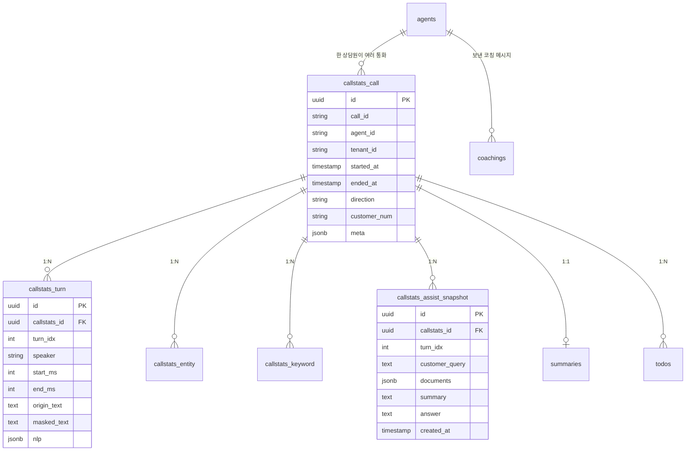
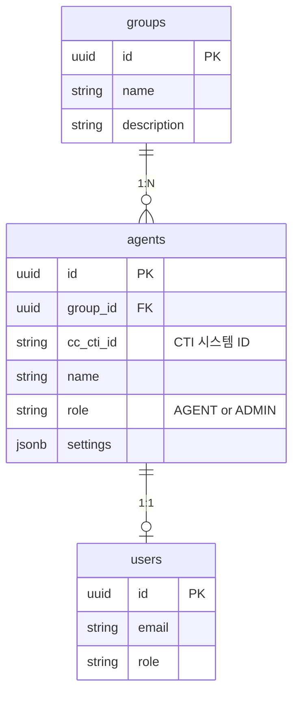
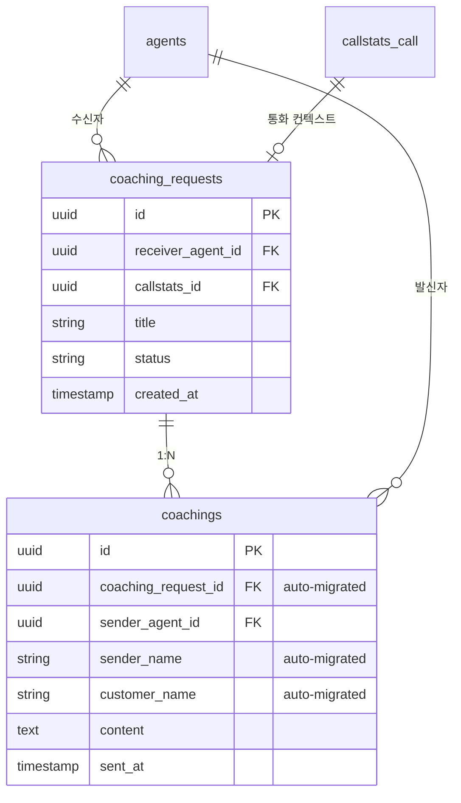
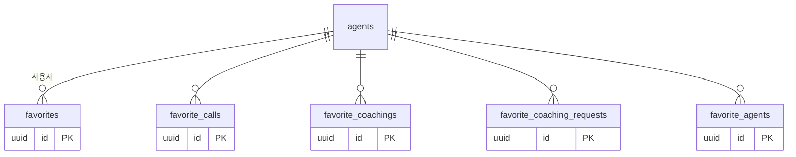
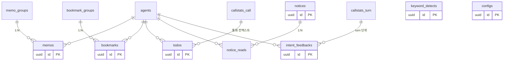

# 데이터 모델 (ERD 요약)

> Advisor 의 핵심 테이블 관계도. 정확한 컬럼은 entity 파일 참조.
> 두 스키마(`advisor`, `raw_call`)에 약 30개 테이블이 존재합니다.

---

## 1. 스키마 구조

```
PostgreSQL (테넌트별 분리)
├── advisor 스키마           # 업무 데이터 (Advisor가 read/write)
│   ├── agents
│   ├── groups
│   ├── coachings, coaching_requests
│   ├── summaries, todos
│   ├── memos, memo_groups
│   ├── bookmarks, bookmark_groups
│   ├── notices, notice_reads
│   ├── keyword_detects
│   ├── intent_feedbacks
│   ├── favorites, favorite_calls, favorite_coachings,
│   │   favorite_coaching_requests, favorite_agents
│   ├── call_categories, call_keywords
│   └── configs
│
└── raw_call 스키마          # 통화 통계 (외부 시스템이 write, Advisor read 위주)
    ├── callstats_call           # 통화 마스터
    ├── callstats_turn           # 발화 턴 (NLP partial/complete)
    ├── callstats_entity         # NER 엔티티
    ├── callstats_keyword        # 키워드 집계
    └── callstats_assist_snapshot  # ⚠️ 유일하게 Advisor가 write
```

---

## 2. 핵심 ERD: 통화 흐름



→ `callstats_id` 가 모든 통화 관련 테이블의 join key.

---

## 3. 핵심 ERD: 상담원 / 조직



→ `cc_cti_id` 가 STT 엔진과의 매핑 key (대소문자 주의).

---

## 4. 핵심 ERD: 코칭



⚠️ **`coaching_request_id`, `sender_name`, `customer_name` 컬럼은 자동 마이그레이션으로 추가**됨 — [dynamic-database.service.ts](../../asst-service/src/common/services/dynamic-database.service.ts)의 `runSchemaMigrations()` 가 매 연결 생성 시 `ALTER TABLE ... ADD COLUMN IF NOT EXISTS` 실행. SQL 파일(`asst-service/migrations/`)과 중복되므로 신규 컬럼 추가 시 주의.

---

## 5. 핵심 ERD: 즐겨찾기 5종



5개의 즐겨찾기 테이블이 분리되어 있는 이유:
- `Favorite` — 일반 (문서 등)
- `FavoriteCall` — 통화
- `FavoriteCoaching` — 코칭 메시지
- `FavoriteCoachingRequests` — 코칭 요청
- `FavoriteAgents` — 다른 상담원

→ 일반 문서 즐겨찾기는 **KMS에 위임**되어 있으므로 `Favorite` 테이블이 의미하는 것은 다른 즐겨찾기.

---

## 6. 핵심 ERD: 부가 도메인



---

## 7. 테이블 ↔ 엔티티 파일 매핑

| 테이블 | 엔티티 파일 |
|--------|-------------|
| `advisor.agents` | [agent.entity.ts](../../asst-service/src/advisor/agent/entities/agent.entity.ts) |
| `advisor.groups` | [group.entity.ts](../../asst-service/src/advisor/group/entities/group.entity.ts) |
| `advisor.coachings` | [coaching.entity.ts](../../asst-service/src/advisor/coaching/entities/coaching.entity.ts) |
| `advisor.coaching_requests` | [coaching-request.entity.ts](../../asst-service/src/advisor/coaching/entities/coaching-request.entity.ts) |
| `advisor.summaries` | [summary.entity.ts](../../asst-service/src/advisor/summary/entities/summary.entity.ts) |
| `advisor.todos` | [todo.entity.ts](../../asst-service/src/advisor/todo/entities/todo.entity.ts) |
| `advisor.memos` | [memo.entity.ts](../../asst-service/src/advisor/memo/entities/memo.entity.ts) |
| `advisor.memo_groups` | [memo-group.entity.ts](../../asst-service/src/advisor/memo/entities/memo-group.entity.ts) |
| `advisor.bookmarks` | [bookmark.entity.ts](../../asst-service/src/advisor/bookmark/entities/bookmark.entity.ts) |
| `advisor.bookmark_groups` | [bookmark-group.entity.ts](../../asst-service/src/advisor/bookmark/entities/bookmark-group.entity.ts) |
| `advisor.notices` | [notice.entity.ts](../../asst-service/src/advisor/notice/entities/notice.entity.ts) |
| `advisor.notice_reads` | [notice-read.entity.ts](../../asst-service/src/advisor/notice/entities/notice-read.entity.ts) |
| `advisor.keyword_detects` | [keyword-detect.entity.ts](../../asst-service/src/advisor/keyword-detect/entities/keyword-detect.entity.ts) |
| `advisor.intent_feedbacks` | (`intent-feedback/entities/`) |
| `advisor.favorites` | [favorite.entity.ts](../../asst-service/src/advisor/favorite/entities/favorite.entity.ts) |
| `advisor.favorite_*` (4종) | [favorite/entities/](../../asst-service/src/advisor/favorite/entities/) |
| `advisor.call_categories` | [call-category.entity.ts](../../asst-service/src/advisor/call/entities/call-category.entity.ts) |
| `advisor.call_keywords` | [call-keyword.entity.ts](../../asst-service/src/advisor/call/entities/call-keyword.entity.ts) |
| `advisor.configs` | [config.entity.ts](../../asst-service/src/advisor/config/entities/config.entity.ts) |
| `raw_call.callstats_call` | [callstat-call.entity.ts](../../asst-service/src/advisor/call/entities/callstat-call.entity.ts) |
| `raw_call.callstats_turn` | [callstat-turn.entity.ts](../../asst-service/src/advisor/call/entities/callstat-turn.entity.ts) |
| `raw_call.callstats_entity` | [callstat-entity.entity.ts](../../asst-service/src/advisor/call/entities/callstat-entity.entity.ts) |
| `raw_call.callstats_keyword` | [callstat-keyword.entity.ts](../../asst-service/src/advisor/call/entities/callstat-keyword.entity.ts) |
| `raw_call.callstats_assist_snapshot` | [callstat-assist-snapshot.entity.ts](../../asst-service/src/advisor/call/entities/callstat-assist-snapshot.entity.ts) |

---

## 8. 외래 키 / 참조 관계의 특수성

### 8-1. 스키마 간 join

`advisor.summaries` ↔ `raw_call.callstats_call` 처럼 **다른 스키마 간 join** 이 빈번. PostgreSQL은 같은 DB 내에서 스키마 간 join 가능 (cross-schema FK는 약함).

### 8-2. tenant_id

명시적 FK는 아니지만 **모든 테이블에 `tenant_id` 컬럼이 있다고 가정**. 테넌트 격리는 DB 분리로 처리되므로 컬럼 자체는 보조적.

### 8-3. UUID 사용

대부분 `id` 컬럼이 UUID. `call_id` 는 외부 시스템에서 발급 (string), `callstats_id` 는 Advisor 내부 UUID.

---

## 9. 자주 join 되는 쿼리 패턴

### 통화 1건의 요약 조회

```sql
SELECT c.*, t.intent, s.summary_text
FROM raw_call.callstats_call c
LEFT JOIN raw_call.callstats_turn t ON t.callstats_id = c.id
LEFT JOIN advisor.summaries s ON s.callstats_id = c.id
WHERE c.id = $1;
```

### 상담원의 오늘 통화 목록

```sql
SELECT c.*
FROM raw_call.callstats_call c
WHERE c.agent_id = $1
  AND c.started_at >= CURRENT_DATE
ORDER BY c.started_at DESC;
```

### 코칭 메시지 + 발신자 정보

```sql
SELECT co.*, cr.title as request_title, a.name as sender_name
FROM advisor.coachings co
LEFT JOIN advisor.coaching_requests cr ON cr.id = co.coaching_request_id
LEFT JOIN advisor.agents a ON a.id = co.sender_agent_id
WHERE co.receiver_agent_id = $1;
```

---

## 10. 인덱스 / 성능

핵심 인덱스 (마이그레이션 SQL 참고):

| 테이블 | 인덱스 |
|--------|--------|
| `callstats_call` | `agent_id`, `started_at`, `tenant_id` |
| `callstats_turn` | `callstats_id`, `turn_idx` (복합) |
| `coachings` | `receiver_agent_id`, `sent_at` |
| `notices` | `created_at` |

> 대용량 조회 (예: 통화 통계 페이지네이션) 시 **날짜 범위 + 인덱스** 사용 필수. 풀스캔 금지.

---

## 11. 인계 시 주의

1. **`raw_call` 스키마는 외부 시스템이 write** — Advisor는 거의 read-only. `callstats_assist_snapshot` 만 예외 (Advisor write).
2. **테넌트별 별도 DB** — 같은 SQL을 모든 테넌트에 적용 필요 (마이그레이션 SQL 원본: `asst-service/migrations/`, 수동 적용)
3. **자동 마이그레이션 컬럼 3개** — `coachings.coaching_request_id`, `sender_name`, `customer_name` ([01-multi-tenant-db.md#7](01-multi-tenant-db.md#7-자동-스키마-마이그레이션--주의))
4. **FK 제약 약함** — 일부 테이블은 application-level join만 사용. cascade 동작 의존 X.
5. **UUID 생성** — 신규 ID는 코드에서 `uuid` 라이브러리로 생성 (DB의 `gen_random_uuid()` 가능하지만 일관성 위해 코드에서).
