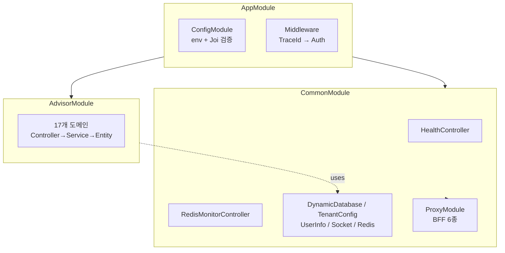
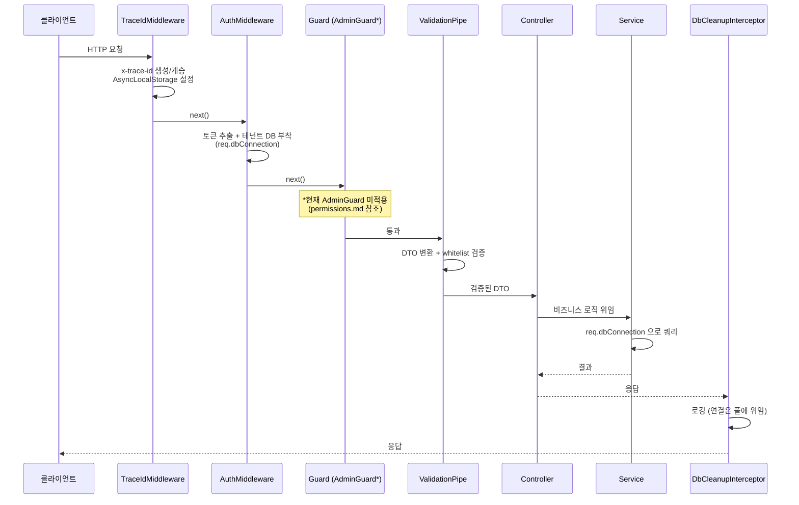

# 백엔드 아키텍처 (asst-service)

> NestJS 11 기반 백엔드의 모듈 구조, 요청 파이프라인, **BFF 패턴 선택 배경**.
> 프론트엔드는 [03-frontend.md](03-frontend.md), BFF 프록시 실무 명세는 [specs/proxy-controllers.md](../specs/proxy-controllers.md) 참조.

---

## 1. 한눈에 보는 구조



3개 루트 모듈:

| 모듈 | 책임 | 파일 |
|------|------|------|
| `AppModule` | 부트스트랩, env, 미들웨어 와이어링 | [app.module.ts](../../asst-service/src/app.module.ts) |
| `CommonModule` | 공통 인프라 (DB/Redis/Socket/BFF) | [common.module.ts](../../asst-service/src/common/common.module.ts) |
| `AdvisorModule` | 17개 비즈니스 도메인 | [advisor.module.ts](../../asst-service/src/advisor/advisor.module.ts) |

---

## 2. 요청 처리 파이프라인

NestJS 요청 1건이 거치는 단계:



### 단계별 위치

| 단계 | 구현 | 비고 |
|------|------|------|
| TraceIdMiddleware | [trace-id.middleware.ts](../../asst-service/src/common/middleware/trace-id.middleware.ts) | 분산 추적 ID |
| AuthMiddleware | [auth.middleware.ts](../../asst-service/src/common/middleware/auth.middleware.ts) | 토큰 → 테넌트 DB ([01-multi-tenant-db.md](01-multi-tenant-db.md)) |
| 미들웨어 와이어링 | [app.module.ts:32-40](../../asst-service/src/app.module.ts#L32-L40) | `.exclude()` 로 일부 경로 우회 |
| ValidationPipe | [main.ts:118-124](../../asst-service/src/main.ts#L118-L124) | `whitelist + forbidNonWhitelisted` |
| AdminGuard | [admin.guard.ts](../../asst-service/src/common/guards/admin.guard.ts) | ⚠️ 정의만, 미적용 ([permissions.md](../operations/permissions.md)) |
| DbCleanupInterceptor | [db-cleanup.interceptor.ts](../../asst-service/src/common/interceptors/db-cleanup.interceptor.ts) | 실제로는 로깅만 |

---

## 3. Controller → Service → Entity 패턴

모든 도메인이 동일한 3계층:

```
src/advisor/{domain}/
├── controllers/{domain}.controller.ts   # HTTP 라우팅 + Swagger + DTO 검증
├── services/{domain}.service.ts          # 비즈니스 로직 (req.dbConnection 사용)
├── entities/{domain}.entity.ts           # TypeORM 엔티티
└── dto/                                   # 요청/응답 DTO (class-validator)
```

**원칙**:
- Controller: 얇게 (라우팅 + 검증 + 위임만). 비즈니스 로직 금지.
- Service: 도메인 로직. DB 접근은 `req.dbConnection` 통해서만 (정적 import 금지 — 멀티테넌트)
- Entity: [database.config.ts](../../asst-service/src/config/database.config.ts) + [dynamic-database.service.ts](../../asst-service/src/common/services/dynamic-database.service.ts) **양쪽 등록 필수**

상세 도메인 목록: [specs/domains-overview.md](../specs/domains-overview.md)

---

## 4. BFF 패턴: 왜 선택했나

### 4-1. 전환 전 문제 (Before)

프론트엔드(`asst-web`)가 **8개의 axios 인스턴스**로 외부 서비스를 직접 호출했음:

```
asst-web ──▶ Advisor 백엔드
         ──▶ Knowledge 서비스
         ──▶ Auth 서비스
         ──▶ User 서비스
         ──▶ CE 서비스
         ──▶ Audio 서비스
         ──▶ TA 서비스
         ──▶ NLP 서비스 (미사용)
```

이 구조의 구체적 문제 (BFF 전환 계획서 기준):

| # | 문제 | 구체적 사례 |
|---|------|-----------|
| 1 | **토큰 헤더 불일치** | User 서비스: `X-auth-token` vs `X-Auth-token` 대소문자 혼재 |
| 2 | **중복 호출** | 같은 User 정보를 프론트/백엔드가 각자 조회 |
| 3 | **환경변수 노출** | `VITE_API_*` 로 모든 외부 서비스 URL이 프론트 빌드에 포함 |
| 4 | **CORS 복잡도** | 외부 서비스마다 CORS 허용 origin 관리 필요 |
| 5 | **응답 가공 불가** | 프론트가 외부 응답을 그대로 받아 필터링/변환 어려움 |
| 6 | **하드코딩 / 보안 이슈** | `request.ts` 에 `http://10.1.1.1:3030` 개발 URL 하드코딩, AES 키 하드코딩, 토큰 console.log 등 |

### 4-2. BFF 선택 이유 (Why BFF)

**BFF (Backend-For-Frontend)**: 프론트 전용 백엔드 레이어가 외부 서비스 호출을 중계.

선택 근거:

1. **토큰 관리 일원화** — 외부 서비스 토큰을 백엔드에서만 관리, 헤더 형식 통일
2. **보안 강화** — 외부 서비스 URL/자격증명이 프론트 빌드에 노출 안 됨
3. **단일 진입점** — 프론트는 `advisor` 인스턴스 1개만 사용 → CORS 단순화
4. **응답 가공 유연성** — 백엔드에서 외부 응답을 필터링/병합/변환 가능
5. **관측성** — 모든 외부 호출이 백엔드 trace ID 로 추적됨

### 4-3. 트레이드오프 (Cost)

BFF는 공짜가 아님. 인지하고 있어야 할 비용:

| 트레이드오프 | 영향 | 완화책 |
|-------------|------|--------|
| **레이턴시 증가** | 프론트→백엔드→외부 (1 hop 추가) | 목표: < 50ms 추가. 응답 캐싱, 연결 풀 |
| **단일 장애점** | 백엔드 다운 시 전체 영향 | 서킷 브레이커 (현재 미구현 — 인계 항목) |
| **백엔드 부하** | 대용량 파일 프록시 시 메모리 | 스트리밍 프록시 / presigned URL (미구현) |
| **버전 동기화** | 프론트/백엔드 동시 배포 필요 | Feature flag (계획서엔 있으나 실제 적용 확인 필요) |

### 4-4. 전환에서 제외한 것 (직접 연결 유지)

**모든 것을 BFF로 보내지 않음**. 실시간/스트리밍은 직접 연결 유지:

| 연결 | 프로토콜 | 유지 이유 |
|------|----------|----------|
| CE Advisorbot | Socket.IO | 실시간 양방향 스트리밍 — 프록시 시 레이턴시 |
| Call Audio Streamer | Native WebSocket | 바이너리 오디오 — 백엔드 불필요 부하 |
| CCAAS Gateway | SockJS/STOMP | 브로드캐스트 구독 — 프록시 비효율 |
| Advisor Socket.IO | Socket.IO | 자체 백엔드라 BFF 불필요 |

→ **REST는 BFF, 실시간은 직접**. 이 구분이 핵심 설계 결정.

상세 배경: [plans/done/2026-04-16-bff-transition-plan.md](../plans/done/2026-04-16-bff-transition-plan.md)

---

## 5. BFF 구성

### 5-1. ProxyModule

[proxy.module.ts](../../asst-service/src/common/proxy/proxy.module.ts):

```typescript
@Module({
  controllers: [
    AudioProxyController,
    UserProxyController,
    KnowledgeProxyController,
    // TaProxyController,        // ⚠️ TA 일시 주석
    QaProxyController,
    CeProxyController,
  ],
  providers: [HttpClientService],
  exports: [HttpClientService],
})
export class ProxyModule {}
```

→ `CommonModule` 이 import ([common.module.ts:19](../../asst-service/src/common/common.module.ts#L19)).

### 5-2. HttpClientService (BFF 핵심)

[http-client.service.ts](../../asst-service/src/common/services/http-client.service.ts) — 모든 프록시가 사용하는 공통 HTTP 클라이언트:

```typescript
@Injectable()
export class HttpClientService {
  private readonly defaultTimeout = 10000;   // 10초

  async get/post/put/patch/delete<T>(url, data?, options?): Promise<T>

  // 에러 매핑:
  //   외부 응답 4xx/5xx → HttpException(data, status)
  //   네트워크 에러     → HttpException('External service unavailable', 502)
}
```

특징:
- `Content-Type: application/json` 기본
- 요청/응답 debug 로깅 (`→ GET url`, `← GET url 200`)
- 외부 에러를 NestJS `HttpException` 으로 일관 변환

⚠️ **현재 없는 것**: 재시도, 서킷 브레이커, 응답 캐싱, 스트리밍 프록시. 계획서엔 있으나 미구현 — 인계 항목.

### 5-3. 프록시 컨트롤러 패턴

모든 프록시가 동일 패턴 (비즈니스 로직 없는 단순 전달):

```typescript
@Controller('proxy/knowledge')
export class KnowledgeProxyController {
  constructor(private readonly httpClient: HttpClientService,
              private readonly configService: ConfigService) {
    this.knowledgeHost = configService.get('KNOWLEDGE_API_URL') ?? '';
  }

  @Post('search/retrieve_doc')
  searchKnowledge(@Req() req: AuthRequest) {
    return this.httpClient.post(
      `${this.knowledgeHost}/api/search/retrieve_doc`,
      req.body,
      { headers: { 'X-Auth-token': req.token } },  // 헤더 형식 변환
    );
  }
}
```

6개 프록시별 상세 명세: [specs/proxy-controllers.md](../specs/proxy-controllers.md)

---

## 6. 공통 인프라 (`src/common/`)

| 디렉토리 | 내용 |
|----------|------|
| `middleware/` | TraceId, Auth |
| `guards/` | AdminGuard (미적용) |
| `interceptors/` | DbCleanup (로깅) |
| `decorators/` | `@AdminOnly`, `@UserRole`, `@CurrentUser` |
| `services/` | DynamicDatabase, TenantConfig, UserInfo, LlmOrchestrator, Redis, HttpClient |
| `gateways/` | SocketGateway + 3개 핸들러 (coaching/notice/agent-status) |
| `proxy/` | BFF 프록시 6종 |
| `controllers/` | Health, RedisMonitor |
| `constants/` `dto/` `types/` `utils/` | 공통 자산 |

서비스별 상세:
- DB: [01-multi-tenant-db.md](01-multi-tenant-db.md)
- 실시간: [02-realtime-streaming.md](02-realtime-streaming.md)
- LLM: [specs/llm-integration.md](../specs/llm-integration.md)
- 에러/로깅: [operations/error-logging.md](../operations/error-logging.md)

---

## 7. 의존성 주입 구조

```
AppModule
├── ConfigModule.forRoot (isGlobal: true)   ← 모든 모듈에서 ConfigService 주입 가능
├── CommonModule
│   ├── imports: RedisModule, ProxyModule
│   ├── exports: 대부분의 인프라 서비스
│   └── → AdvisorModule 이 이 서비스들을 주입받아 사용
└── AdvisorModule
    ├── 27개 컨트롤러
    └── providers: 도메인 서비스 + 공통 서비스 재등록
```

주의:
- `CommonModule` 이 인프라를 `exports` → `AdvisorModule` 에서 사용
- `ConfigModule` 은 `isGlobal: true` → 별도 import 불필요
- 순환 의존성 회피: `RedisService` ↔ `SocketGateway` 는 `ModuleRef` 로 지연 주입 ([socket.gateway.ts:93](../../asst-service/src/common/gateways/socket.gateway.ts#L93))

---

## 8. 부트스트랩 순서

[main.ts](../../asst-service/src/main.ts):

```
1. tracer.start()                    # OpenTelemetry (import 시점 자동)
2. WinstonModule 로거 생성
3. HTTPS 옵션 (SSL_KEY_PATH 있으면)
4. NestFactory.create(AppModule)
5. bodyParser (json/urlencoded, 10MB)
6. setGlobalPrefix('/api/asst/v1')
7. Swagger 설정 (/api/asst/v1/doc)
8. 정적 파일 서빙 (public/)
9. ValidationPipe 글로벌 적용
10. app.listen(PORT ?? 3000)
```

CORS는 게이트웨이가 처리하므로 백엔드에서 미설정 ([main.ts:59](../../asst-service/src/main.ts#L59)).

---

## 9. 새 기능 추가 절차

### 새 도메인 API

1. `src/advisor/{domain}/entities/` 엔티티 생성
2. `dto/` DTO + class-validator 데코레이터
3. `services/` 서비스 (`req.dbConnection` 사용)
4. `controllers/` 컨트롤러 (`@ApiTags`, `@ApiBearerAuth('bearer')`, `@UseInterceptors(DbCleanupInterceptor)`)
5. [advisor.module.ts](../../asst-service/src/advisor/advisor.module.ts) controllers/providers 등록
6. [database.config.ts](../../asst-service/src/config/database.config.ts) **+** [dynamic-database.service.ts](../../asst-service/src/common/services/dynamic-database.service.ts) entities 양쪽 등록
7. 마이그레이션 SQL 작성 → `asst-service/migrations/` 에 추가 (수동 적용. 자동 마이그레이션 `runSchemaMigrations` 과 중복 주의)

### 새 외부 서비스 (BFF 추가)

1. `validation.config.ts` 에 `XXX_HOST` env 추가
2. `src/common/proxy/xxx-proxy.controller.ts` 생성 (단순 전달)
3. [proxy.module.ts](../../asst-service/src/common/proxy/proxy.module.ts) controllers 등록
4. 헤더 형식 변환 확인 (외부 서비스가 요구하는 인증 헤더)
5. 프론트는 `advisor` 인스턴스로 `/proxy/xxx/*` 호출

---

## 10. 인계 시 강조

1. **REST = BFF, 실시간 = 직접 연결** — 핵심 설계 결정. 신규 연동 시 이 기준으로 판단.
2. **BFF 미완성 부분** — 서킷 브레이커, 재시도, 응답 캐싱, 스트리밍 프록시 모두 미구현 (계획서엔 있음)
3. **TA 프록시 주석 처리** — [proxy.module.ts:7-8, 17-18](../../asst-service/src/common/proxy/proxy.module.ts#L7-L8)
4. **엔티티 2곳 등록** — 가장 흔한 실수
5. **AdminGuard 미적용** — 백엔드 권한 검증 부재 ([permissions.md](../operations/permissions.md))
6. **단일 장애점** — BFF + USER_HOST 의존. 두 곳 중 하나라도 죽으면 전체 영향
7. **Controller 얇게 유지** — 비즈니스 로직이 컨트롤러에 새는지 리뷰 시 체크

---

## 11. 리팩토링 이력

백엔드 구조는 여러 차례 리팩토링됨. 의사결정 배경:

| 주제 | 문서 |
|------|------|
| BFF 전환 | [plans/done/2026-04-16-bff-transition-plan.md](../plans/done/2026-04-16-bff-transition-plan.md) |
| 백엔드 Phase 1 리팩토링 | [plans/done/2026-04-21-backend-phase1-refactor-plan.md](../plans/done/2026-04-21-backend-phase1-refactor-plan.md) |
| 전체 리팩토링 | [plans/done/2026-04-22-full-refactor-plan.md](../plans/done/2026-04-22-full-refactor-plan.md) |
| 리팩토링 후속 수정 | [plans/2026-04-27-post-refactor-functional-fixes.md](../plans/2026-04-27-post-refactor-functional-fixes.md) |

→ 현재 코드가 신뢰원. 계획서는 의사결정 맥락 참고용.
