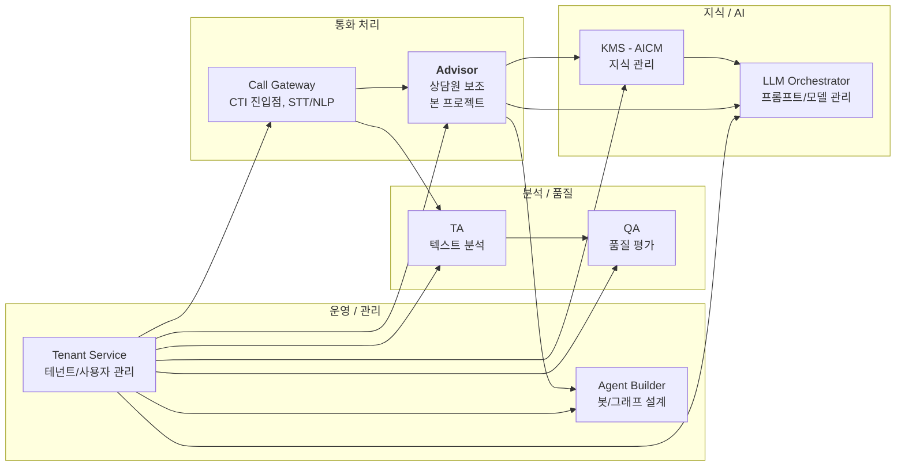

# AICC 전체 시스템 컨텍스트

> Advisor 가 속해 있는 **AICC (AI Contact Center) 전체 플랫폼** 의 조감도.
> 다이어그램 원본: [diagrams/aicc-architecture.drawio](diagrams/aicc-architecture.drawio)

---

## 1. 왜 이 문서가 필요한가

- Advisor 만 보면 외부 서비스(`LLM_ORCHESTRATOR_HOST`, `SEARCH_HOST`, `CE_HOST` 등)가 단순히 환경변수로만 보이지만, **실제로는 각자 독립적인 큰 서비스**입니다.
- 후임자가 장애를 만났을 때 "왜 이게 다른 팀과 협의해야 하는가" 를 빠르게 이해하려면 전체 그림이 필요합니다.
- 본 문서는 다이어그램의 **목차 + 각 서비스가 Advisor 와 어떻게 연결되는지**를 정리합니다.

---

## 2. 다이어그램 구성 (총 17 페이지)

drawio 파일은 [C4 모델](https://c4model.com/) 기반으로 작성되어 있습니다:
- **Context Diagram**: 서비스와 외부 사용자/시스템의 관계
- **Container Diagram**: 서비스 내부 컨테이너 구성

### 페이지 목록

| # | 페이지명 | 내용 |
|---|---------|------|
| 1 | **AICC Landscape** | 전체 시스템 조감도 (모든 서비스 한눈에) |
| 2 | Tenant Service Context | 테넌트 관리 서비스 외부 관계 |
| 3 | Tenant Service Container | 테넌트 관리 내부 구조 |
| 4 | Agent Builder Context | 에이전트(봇) 빌더 외부 관계 |
| 5 | Agent Builder Container | 에이전트 빌더 내부 구조 |
| 6 | Call Gateway Context | 콜 게이트웨이 외부 관계 |
| 7 | Call Gateway Container | 콜 게이트웨이 내부 구조 |
| 8 | **Advisor Context** | **상담 어시스트 외부 관계** ← 본 프로젝트 |
| 9 | **Advisor Container** | **상담 어시스트 내부 구조** ← 본 프로젝트 |
| 10 | QA Context | QA 서비스 외부 관계 |
| 11 | QA Container | QA 서비스 내부 구조 |
| 12 | TA Context | TA(Text Analytics) 외부 관계 |
| 13 | TA Container | TA 내부 구조 |
| 14 | KMS(AICM) Context | KMS 외부 관계 |
| 15 | KMS(AICM) Container | KMS 내부 구조 |
| 16 | LLM Orchestrator Context | LLM 오케스트레이터 외부 관계 |
| 17 | LLM Orchestrator Container | LLM 오케스트레이터 내부 구조 |

### 후임자 추천 학습 순서

1. **페이지 1 (AICC Landscape)** — 전체 그림 한 번 보기 (5분)
2. **페이지 8 (Advisor Context)** — Advisor가 누구와 통신하는지 (10분)
3. **페이지 9 (Advisor Container)** — Advisor 내부 구조 (15분)
4. 본인이 다룰 영역의 다른 서비스만 추가로 확인:
   - 통화 관련 → Call Gateway (6, 7)
   - 검색 / 지식 → KMS (14, 15)
   - LLM → LLM Orchestrator (16, 17)

---

## 3. AICC 전체 서비스 구성

다이어그램에서 식별되는 주요 서비스:

→ Advisor 는 거의 모든 서비스와 연결되는 **중심 컴포넌트** 중 하나.

---

## 4. 각 서비스 ↔ Advisor 연결 매핑

다이어그램 페이지 + Advisor의 env 변수 매핑:

| 서비스 | 다이어그램 페이지 | Advisor env | 연동 방식 | Advisor 측 문서 |
|--------|----------|-------------|----------|---------|
| **Tenant Service** | 2~3 | `USER_HOST` / `TENANT_HOST` | HTTP (axios) | [01-multi-tenant-db.md](01-multi-tenant-db.md) |
| **Call Gateway** | 6~7 | (Redis Pub/Sub 간접) | Redis 채널 (STT/NLP) | [02-realtime-streaming.md](02-realtime-streaming.md), [specs/stt-nlp-contract.md](../specs/stt-nlp-contract.md) |
| **Agent Builder / CE** | 4~5 | `CE_HOST` | HTTP + Socket.IO (별도) | [specs/advisorbot.md](../specs/advisorbot.md), [specs/proxy-controllers.md](../specs/proxy-controllers.md) |
| **QA** | 10~11 | `QA_API_URL` | HTTP 프록시 | [specs/proxy-controllers.md](../specs/proxy-controllers.md) |
| **TA** | 12~13 | `TA_HOST` (현재 주석) | HTTP 프록시 (비활성) | [specs/proxy-controllers.md](../specs/proxy-controllers.md) |
| **KMS (AICM)** | 14~15 | `KNOWLEDGE_API_URL` | HTTP 프록시 | [specs/proxy-controllers.md](../specs/proxy-controllers.md) |
| **LLM Orchestrator** | 16~17 | `LLM_ORCHESTRATOR_HOST` | HTTP | [specs/llm-integration.md](../specs/llm-integration.md) |

→ 각 서비스 박스를 클릭하면 어떤 다이어그램 페이지를 봐야 할지 + Advisor 측 코드 어디를 봐야 할지가 모두 연결됩니다.

---

## 5. 서비스별 짧은 설명

> 🔎 **auth-service / user-service / tenant-mgmt-service 의 런타임 흐름**은 시각 자료로 별도 정리되어 있습니다 → [01-multi-tenant-db.md#-시각-자료--auth--user--tenant-mgmt-서비스-흐름](01-multi-tenant-db.md) (4서비스 구조도 + 런타임 시퀀스 SVG 임베드). 인수인계 시 이 그림으로 설명하세요.

### 5-1. Tenant Service

**역할**: 사용자/조직/테넌트 정보 관리 + 토큰 검증.

**Advisor 와의 관계**:
- 모든 요청의 토큰 검증을 `USER_HOST` 에 위임
- 테넌트 DB 연결 정보(`db_config`) 응답으로 동적 DB 결정
- → [01-multi-tenant-db.md#5](01-multi-tenant-db.md#5-동적-연결의-캐싱과-풀)

**위치**: 본 다이어그램의 페이지 2~3

### 5-2. Call Gateway

**역할**: CTI 시스템과 통합. 통화 진입점. STT/NLP 엔진 호출.

**Advisor 와의 관계**:
- Advisor 는 Call Gateway 와 **직접 HTTP 통신 X**
- 대신 Call Gateway → Redis Pub/Sub → Advisor 가 구독
- 채널: `{env}:{tenant}:{agent}:call:events / nlp:partial / nlp:complete / orchestrator:persisted`
- → [specs/stt-nlp-contract.md](../specs/stt-nlp-contract.md)

**담당**: 콜 인프라 (이태희 / 김현철 수석님)

### 5-3. Agent Builder + CE Service

**역할**: 봇 그래프 워크플로우 설계 (Agent Builder) + 런타임 실행 (CE).

**Advisor 와의 관계**:
- 어드바이저봇 위젯이 CE 서비스에 Socket.IO **직접 연결** (Advisor 거치지 않음)
- CE 카탈로그(봇 목록, NLU 인텐트) 조회는 `/proxy/ce/*` 프록시 사용
- → [specs/advisorbot.md](../specs/advisorbot.md)

**담당**: 대화엔진 (도창록 책임님)

### 5-4. QA Service

**역할**: 통화 품질 평가 (스크립트 준수, 키워드 등).

**Advisor 와의 관계**:
- Advisor 는 `/proxy/qa/*` 로 위임만 (BFF 패턴)
- 현재 담당자 **공석** → [operations/contacts.md](../operations/contacts.md)

### 5-5. TA Service

**역할**: Text Analytics (감정 분석, 토픽 추출 등 통화 사후 분석).

**Advisor 와의 관계**:
- `TA_HOST` env가 [validation.config.ts:81-82](../../asst-service/src/config/validation.config.ts#L81-L82) 에서 **현재 주석 처리**
- → 비활성 상태. 재활성 시 컨트롤러도 함께 재활성 필요

### 5-6. KMS (AICM)

**역할**: 지식 관리 시스템. 상담원이 참조하는 문서/스크립트 저장.

**Advisor 와의 관계**:
- `/proxy/knowledge/*` 로 위임 (문서 검색, 인덱스, 섹션, 즐겨찾기)
- 일반 문서 즐겨찾기는 KMS에 위임, Advisor 내부 즐겨찾기 5종은 분리
- → [specs/proxy-controllers.md#4-kms-위임-정책-knowledge](../specs/proxy-controllers.md#4-kms-위임-정책-knowledge)

**담당**: 현재 임시 김현철 수석님 → 장기 공석

### 5-7. LLM Orchestrator

**역할**: 프롬프트 관리 + 모델 라우팅 + LLM 호출 추상화.

**Advisor 와의 관계**:
- 통화 요약, 키워드 추출, 자동 todo 생성 시 호출
- `complete()` (프롬프트 이름 기반) + `customComplete()` (provider/model 직접)
- → [specs/llm-integration.md](../specs/llm-integration.md)

**담당**: 프롬프트팀 (이영훈 과장 / 최혜연 대리) + 손영훈 이사님

---

## 6. 다이어그램에 없거나 추가 확인이 필요한 영역

다이어그램 검토 시 후임자가 별도로 파악해야 할 것들:

| 항목 | 확인 방법 |
|------|----------|
| **Langsa 게이트웨이** | 다이어그램에 명시 안 됨. 모든 외부 트래픽 진입점. → [00-overview.md#2](00-overview.md#2-컴포넌트-구성도) |
| **ECP (ecs-cloud-portal)** | 프론트엔드 호스트. Advisor 가 모듈 페더레이션으로 임베드 |
| **RAG (Search Service)** | 다이어그램에는 별도 페이지 없음. `SEARCH_HOST` 환경변수만 존재 |
| **Redis 인프라** | Call Gateway 다이어그램에 일부 포함 추정 |
| **SLLM** | (담당: 최문용 책임님) 다이어그램에 명시 여부 확인 필요 |
| **온프레미스 vs 클라우드 배포 차이** | 다이어그램은 논리 구조. 물리 배포는 별도 |

---

## 7. 갱신 정책

이 문서와 drawio 파일은 다음 시점에 갱신:

- AICC 에 신규 서비스 추가
- 서비스 간 통신 방식 변경 (HTTP ↔ 메시지큐 등)
- 서비스 이름 변경 / 통합 / 분리
- 인계 시점

**원본 파일 위치**: [diagrams/aicc-architecture.drawio](diagrams/aicc-architecture.drawio)

→ drawio 파일이 신뢰원. 이 문서가 drawio 와 불일치하면 drawio 를 따름.

---

## 8. 다이어그램을 보는 팁

### draw.io 다중 페이지 탐색

- 하단 페이지 탭으로 17개 페이지 전환
- 또는 메뉴 `Extras → Edit Diagram` 에서 XML 직접 보기

### 검색

draw.io 에서 `Ctrl+F` 로 박스/연결선 텍스트 검색 가능. 예: "Advisor" 입력 → 모든 페이지에서 Advisor 가 등장하는 위치 표시.

### Outline 패널

`View → Outline` 으로 다이어그램 전체 미니맵 보기.

---

## 9. 인계 시 강조

1. **Advisor 는 AICC 의 일부** — 다른 서비스 변경 시 영향 받음
2. **외부 서비스 담당자 확인 필수** — [operations/contacts.md](../operations/contacts.md)
3. **공석 영역 주의** — KMS, TA, QA 의 인계 우선순위
4. **drawio 파일은 git diff 추적됨** — 직접 편집 가능 (XML 기반)
