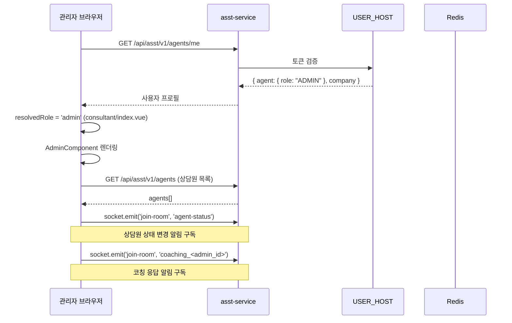
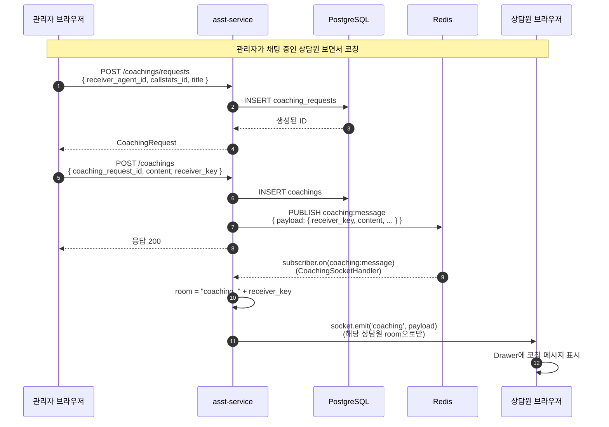
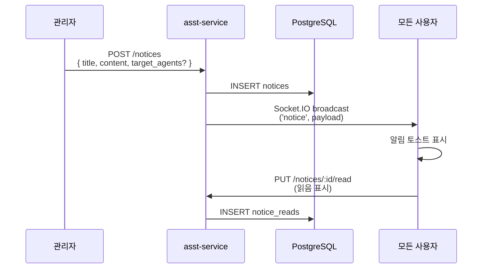

# 관리자 모니터링 플로우

> 관리자(ADMIN/VIEWER)가 상담원을 실시간으로 모니터링하고 코칭하는 흐름.
> 일반 통화 라이프사이클은 [call-lifecycle.md](call-lifecycle.md) 참조.

---

## 1. 관리자가 할 수 있는 일

| 기능 | 동작 | 권한 |
|------|------|------|
| 상담원 목록 / 상태 조회 | `agent-status` 채널 구독 | ADMIN, VIEWER |
| 특정 상담원 통화 실시간 보기 | 해당 agent의 Redis 채널 구독 | ADMIN, VIEWER |
| 통화 이력 / 통계 조회 | `/callstat/*` API | ADMIN, VIEWER |
| 코칭 요청 생성 | `POST /coachings/requests` | ADMIN |
| 코칭 메시지 발송 | `POST /coachings` → Redis publish → Socket | ADMIN |
| 공지 작성 | `POST /notices` → Socket broadcast | ADMIN |
| 사용자/그룹 관리 | `/agents`, `/groups` | ADMIN |

⚠️ **현재 백엔드에서 권한 강제 안 함** ([permissions.md#2-2](../operations/permissions.md#2-2-빠진-것-핵심-이슈)).

---

## 2. 관리자 화면 진입 플로우



---

## 3. 상담원 상태 실시간 추적

### 3-1. agent-status 채널

[agent-status-socket.handler.ts](../../asst-service/src/common/gateways/handlers/agent-status-socket.handler.ts):

- 모든 관리자가 `agent-status` 라는 단일 room 에 가입
- 상담원 상태 변경 시 broadcast (`agent-status-update` 이벤트)

```typescript
this.server.to('agent-status').emit('agent-status-update', {
  cc_cti_id: 'agent01',
  agent_id: 'uuid-...',
  status: 'ON_CALL',
  timestamp: '2026-05-15T14:30:00Z'
});
```

### 3-2. 상태 전이

```
IDLE  ──(통화 시작)──>  ON_CALL  ──(통화 종료)──>  AFTER_CALL  ──(작업 완료)──>  IDLE
```

| 상태 | 의미 | 전이 트리거 |
|------|------|-----------|
| `IDLE` | 대기 중 | 초기 / AFTER_CALL 종료 |
| `ON_CALL` | 통화 중 | STT `call:events start` |
| `AFTER_CALL` | 통화 후처리 (요약 등) | STT `call:events end` |

### 3-3. 프론트 처리

[useChatMessageParser.ts:131-142](../../asst-web/src/view/advisor/components/chat/composables/useChatMessageParser.ts#L131-L142):

```typescript
if (!isAdmin.value && !isViewer.value) {
  agentStatusStore.updateStatus(AgentStatus.ON_CALL);  // 본인 상태
} else {
  // 관리자: userList 의 해당 상담원만 업데이트
  const agents = userListStore.agents;
  const ctiId = messageData.agent_id || messageData.agentId;
  const targetIndex = agents.findIndex(a => a.cc_cti_id === ctiId);
  if (targetIndex !== -1) {
    agents[targetIndex]._agentStatus = AgentStatus.ON_CALL;
    userListStore.setAgents([...agents]);
  }
}
```

---

## 4. 특정 상담원 통화 실시간 보기

### 4-1. 선택 → 채널 구독

관리자가 상담원 리스트에서 특정 상담원을 클릭하면:

```typescript
// 해당 agent 의 Redis 채널 4개 구독
const channels = [
  getRedisKey(tenantId, agentId, "nlp"),       // 발화 확정
  getRedisKey(tenantId, agentId, "partial"),   // 발화 중 (스트리밍)
  getRedisKey(tenantId, agentId, "db")         // DB 저장 완료
  // ⚠️ events 는 구독 안 함 (관리자는 통화 시작/종료 직접 처리 X)
];

channels.forEach(ch => {
  api.post(`/redis-monitor/subscribe/${ch}`);
  socket.emit('join-room', ch);
});
```

### 4-2. 화면 동기화

상담원의 화면과 거의 동일하게 보이지만:
- 본인 통화 컨트롤 없음
- 어드바이저봇 액션 불가
- 검색/메모 등은 본인의 작업 영역

### 4-3. 다른 상담원으로 전환

```typescript
// 1. 이전 상담원 채널 unsubscribe
prevChannels.forEach(ch => {
  api.delete(`/redis-monitor/unsubscribe/${ch}`);
  socket.emit('leave-room', ch);
});

// 2. 새 상담원 채널 subscribe
// (위와 동일)

// 3. chatContent clear + 새 상담원 데이터 로드
```

→ **Redis 채널 누수 위험**: 전환 시 unsubscribe 누락하면 백엔드에 구독이 계속 쌓임. 자세히는 [02-realtime-streaming.md#6-디버깅](../architecture/02-realtime-streaming.md#6-디버깅) 참조.

---

## 5. 실시간 코칭 발송 플로우



### 5-1. 메시지 페이로드

[coaching.types.ts](../../asst-service/src/common/types/coaching.types.ts):

```typescript
interface CoachingMessage {
  payload: {
    id: string;
    call_id?: string;
    callstats_id?: string;
    coaching_request_id?: string;
    sender_key: string;       // 관리자 식별자
    receiver_key: string;     // 상담원 식별자
    sender_name: string;
    customer_name?: string;
    content: string;
    is_important: boolean;
    priority_type?: string;
    timestamp: string;
  };
}
```

### 5-2. Socket.IO room 명명

[coaching-socket.handler.ts:120, 201](../../asst-service/src/common/gateways/handlers/coaching-socket.handler.ts#L120):

```
coaching_<receiver_key>
```

→ 각 상담원은 `coaching_<본인_key>` room 에 가입해야 코칭 수신 가능.

### 5-3. 관리자 측 발송 검증

⚠️ 현재 `POST /coachings` 에는 `@AdminOnly()` 가드가 없음. 일반 상담원도 직접 호출하면 발송 가능. [permissions.md#3-2](../operations/permissions.md#3-2-admin-전용-컨트롤러에-adminonly-적용) 참조.

---

## 6. 공지 broadcast



[notice-socket.handler.ts](../../asst-service/src/common/gateways/handlers/notice-socket.handler.ts) — `'notice-broadcast'`, `'notice'` 이벤트로 emit.

---

## 7. 관리자 화면 권한 분기 (코드)

### 7-1. ConsultantPage → AdminComponent

[view/advisor/consultant/index.vue:10](../../asst-web/src/view/advisor/consultant/index.vue#L10):

```html
<AdminComponent v-else-if="resolvedRole === 'admin'" />
```

### 7-2. AdminComponent 내부

[view/advisor/admin/index.vue](../../asst-web/src/view/advisor/admin/index.vue) — 상담원 목록 + 선택 화면.

### 7-3. ChatAdminPanel

[view/advisor/components/chat/ChatAdminPanel.vue](../../asst-web/src/view/advisor/components/chat/ChatAdminPanel.vue) — 관리자가 상담원 통화를 보면서 코칭하는 패널.

핵심 메서드 추정:
- `startListening(agentId)` — 채널 구독 시작
- `stopListening()` — 통화 종료 시 호출 ([useChatMessageParser.ts:239-241](../../asst-web/src/view/advisor/components/chat/composables/useChatMessageParser.ts#L239-L241))

---

## 8. 권한 ↔ Socket.IO room 매핑

| Room 명 | 가입 권한 | 목적 |
|---------|-----------|------|
| `agent-status` | ADMIN, VIEWER | 모든 상담원 상태 broadcast |
| `coaching_<key>` | 해당 상담원 본인 | 본인에게 도착하는 코칭 |
| `{env}:{tenant}:{agent}:call:nlp:partial` | 본인 또는 관리자 | 발화 스트리밍 |
| `{env}:{tenant}:{agent}:call:nlp:complete` | 본인 또는 관리자 | 발화 확정 |
| `{env}:{tenant}:{agent}:call:events` | 본인 (관리자는 구독 X) | 통화 시작/종료 |
| `notice` (broadcast) | 모든 사용자 | 공지 푸시 |

→ Room 별 가입 권한이 코드에서 강제되지 않음. 클라이언트가 임의의 room 에 join 가능. **보안 강화 시 검증 필요**.

---

## 9. 알려진 함정

1. **K8s sticky session 필수** — 관리자/상담원이 다른 pod 라우팅 시 코칭 미전달
2. **`coaching_<receiver_key>` room 에 미가입** — 상담원이 새로고침 후 join 안 하면 코칭 누락
3. **Redis 채널 누수** — 관리자가 상담원 전환 시 unsubscribe 누락
4. **권한 미검증** — VIEWER가 코칭 발송 가능 (현재 코드)
5. **`sender_key`, `receiver_key` 매핑 일관성** — `cc_cti_id` 인지 `agent.id` 인지 컨벤션 확인 필요

---

## 10. 디버깅

| 도구 | 용도 |
|------|------|
| `GET /redis-monitor/debug/rooms` | 어느 사용자가 어느 room에 있는지 |
| `GET /redis-monitor/channels` | 백엔드가 구독 중인 Redis 채널 |
| Vue DevTools → `userListStore.agents` | 관리자가 보는 상담원 목록 + 상태 |
| 콘솔 `socket.on('coaching', console.log)` | 코칭 수신 실시간 관찰 |
| `redis-cli MONITOR` | 모든 Redis 명령 관찰 (운영 신중) |

---

## 11. 인계 시 강조

1. **관리자 권한이 백엔드에서 강제되지 않음** — 보안 보강 필요 ([permissions.md](../operations/permissions.md))
2. **`agent-status` room은 단일 글로벌** — 멀티테넌트라면 테넌트별 분리 검토
3. **코칭 room 명에 `receiver_key` 사용** — key 타입(uuid vs cc_cti_id) 일관성 검증
4. **상담원 전환 시 채널 정리 필요** — Redis 구독 누수 방지
