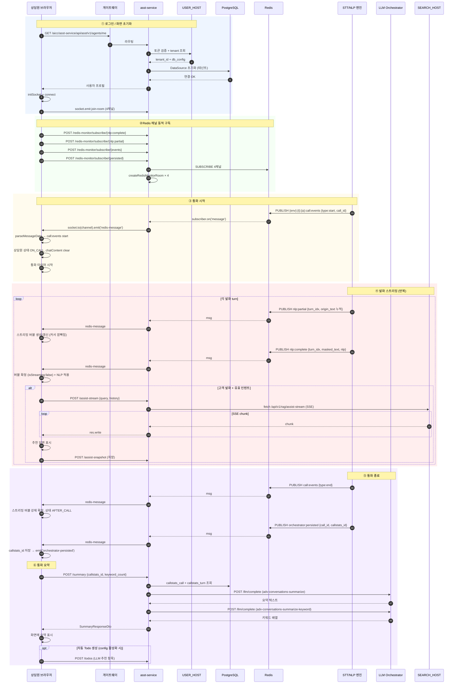

# 통화 라이프사이클 플로우

> 상담원이 로그인 → 통화 시작 → STT 발화 → 종료 → 요약 까지 한 건의 통화가 시스템 전체에서 어떻게 흐르는지.

---

## 1. 전체 플로우



---

## 2. 단계별 상세

### ① 로그인 / 화면 초기화

**진입 시점**: 상담원이 ECP에서 Advisor 메뉴 클릭 → `view/advisor/consultant/index.vue` 마운트

**핵심 동작** ([consultant/index.vue:41-64](../../asst-web/src/view/advisor/consultant/index.vue#L41-L64)):

```typescript
onBeforeMount(async () => {
  initApi({ baseUrls: { advisor, auth, audio } });
  initSocket({ baseUrl: LANGSA_GATEWAY_URL, path: '/aicc/asst-service/socket.io' });
  await connect();
  await setUserProfileInStore();
});
```

**결과**:
- axios 인스턴스 3개 생성 (advisor, auth, audio)
- 메인 Socket.IO 연결 수립 (싱글톤)
- `userProfileStore`에 `agent`, `company` 정보 저장
- `role`에 따라 AgentComponent / AdminComponent 분기

### ② Redis 채널 동적 구독

**왜 필요한가**: asst-service는 어떤 채널을 구독할지 모른다. 프론트가 알려줘야 함.

**호출자**: `useChatSocket.ts` 또는 chat 컴포넌트 초기화 시점

**채널 4개** ([chat/index.vue:1213-1223](../../asst-web/src/view/advisor/components/chat/index.vue#L1213-L1223)):

```typescript
const socketChannels = isAdmin.value
  ? [
      getRedisKey(tenantId, agentId, "nlp"),
      getRedisKey(tenantId, agentId, "partial"),
      getRedisKey(tenantId, agentId, "db")
    ]
  : [
      getRedisKey(tenantId, agentId, "events"),
      getRedisKey(tenantId, agentId, "nlp"),
      getRedisKey(tenantId, agentId, "partial"),
      getRedisKey(tenantId, agentId, "db")
    ];

socketChannels.forEach(ch => {
  // 1) 백엔드에 Redis 구독 시작 요청
  api.post(`/redis-monitor/subscribe/${ch}`);
  // 2) Socket.IO room 가입
  socket.emit('join-room', ch);
});
```

> 관리자는 본인이 통화를 받지 않으므로 `events` 채널 구독 X.

### ③ 통화 시작

**트리거**: STT/NLP 엔진이 통화 시작을 감지 → Redis `call:events` 채널에 `{type: "start", call_id, customerNum}` PUBLISH

**프론트 처리** ([useChatMessageParser.ts:127-194](../../asst-web/src/view/advisor/components/chat/composables/useChatMessageParser.ts#L127-L194)):

1. 상담원 상태 → `ON_CALL`
2. `streamingBySpeaker` 초기화 (이전 통화 잔여물 정리)
3. `chatContent` clear → "상담이 시작되었습니다." system 메시지 추가
4. `callSummaryInfoStore.callId` 설정
5. `customerStore.customer` 초기화 (phoneNumber만 채움)
6. `callStartTimestamp` 기록 + 1초 단위 타이머 시작 (`callStartTime` 갱신)

### ④ 발화 스트리밍

**가장 빈번한 부분**. 각 turn마다 다음 흐름:

**Step 1: `nlp:partial` (반복)** — 발화 중 누적 텍스트

```
{
  channel: "dev:tenantA:agent01:call:nlp:partial",
  message: { turn_idx: 5, speaker: "customer", origin_text: "안녕", masked_text: "", nlp: null }
}
```

처리 ([useChatMessageParser.ts:245-309](../../asst-web/src/view/advisor/components/chat/composables/useChatMessageParser.ts#L245-L309)):
- `streamingBySpeaker[sender]`에 같은 `turn_idx` 버블이 있으면 → 텍스트만 update
- 없으면 → 새 버블 생성 + `streamingBySpeaker` 등록
- UI: 깜빡이는 커서가 따라다님

**Step 2: `nlp:complete`** — 발화 확정

```
{
  message: {
    turn_idx: 5, speaker: "customer",
    origin_text: "안녕하세요, 환불 가능한가요?",
    masked_text: "안녕하세요, 환불 가능한가요?",
    nlp: {
      intent: [{intent: "REFUND_INQUIRY", score: 0.95}],
      keywords: ["환불"],
      search_query: "환불 정책"
    }
  }
}
```

처리:
- 동일 `turn_idx` 스트리밍 버블 확정 (`isStreaming: false`)
- NLP 데이터(intent badge, keyword 버튼) 적용
- **고객 발화 + 유효 인텐트** 면 `handleAssistStream()` 호출 → ⑤로 이어짐
- `callAnalyticsData.segments` 에 turn 정보 push

**Step 3: Assist Stream (선택적)** — 고객 발화에 한해

```
POST /assist-stream
Body: {
  query: "환불 정책 알려줘",
  conversationHistory: [...최근 N턴],
  repositoryId: "..." (default: SEARCH_REPOSITORY_ID)
}
Response: SSE stream
  event: stage     data: {stage: "documents", documents: [...]}
  event: stage     data: {stage: "summary", summary: "..."}
  event: stage     data: {stage: "answer", answer_chunk: "..."}  (반복)
  event: stage     data: {stage: "done"}
```

→ 화면에서 추천 답변 + 근거 문서 표시 + `assist-snapshot` 저장.

### ⑤ 통화 종료

**트리거**: STT가 통화 종료 감지 → `call:events {type: "end"}` PUBLISH

**프론트 처리** ([useChatMessageParser.ts:196-242](../../asst-web/src/view/advisor/components/chat/composables/useChatMessageParser.ts#L196-L242)):

1. 상담원 상태 → `AFTER_CALL`
2. 진행 중인 모든 스트리밍 버블 강제 확정 (`pendingMergeBySpeker`, `streamingBySpeaker` 둘 다)
3. `isCallEnded.value = true`
4. 타이머 중지 → `callTime` 저장
5. (관리자) `chatAdminPanelRef.stopListening()`

**`orchestrator:persisted` 수신** ([useChatMessageParser.ts:485-490](../../asst-web/src/view/advisor/components/chat/composables/useChatMessageParser.ts#L485-L490)):

```typescript
const callId = messageData.call_id || messageData.callId;
callSummaryInfoStore.setCallId(callId);
callSummaryInfoStore.setCallStatsId(messageData.callstats_id);
emit("orchestrator-persisted");
```

→ 외부 시스템이 DB에 통화 데이터 저장 완료. `callstats_id` 확보.

### ⑥ 통화 요약

**트리거**: `orchestrator-persisted` 이벤트 받은 후 자동 또는 사용자 클릭

**요청** ([summary.controller.ts](../../asst-service/src/advisor/summary/controllers/summary.controller.ts)):

```http
POST /api/asst/v1/summary
Content-Type: application/json
x-auth-token: ...

{
  "callstats_id": "019913cc-5a51-...",
  "keyword_count": 5
}
```

**처리 과정** ([summary.service.ts](../../asst-service/src/advisor/summary/services/summary.service.ts)):

1. `raw_call.callstats_call` 에서 통화 조회 (404 if 없음)
2. `raw_call.callstats_turn` 에서 턴 데이터 조회
3. turn 의 `intent` 필드 집계 → 상위 3개 추출
4. `LlmOrchestratorService.complete()` 호출:
   - 프롬프트: `adv-conversations-summarize` → 요약 텍스트
   - 프롬프트: `adv-conversations-summarize-keyword` → 키워드 배열
5. 응답: `SummaryResponseDto`

**에러 시**:
- 502 — LLM 응답 오류
- 503 — LLM 서비스 연결 불가

**프론트 후속 동작**:
- 화면에 요약/키워드 표시
- (config 활성화 시) `POST /todos` 로 자동 todo 생성
- 사용자가 편집 후 `POST /summary/data` upsert로 최종 저장

---

## 3. 데이터 저장 위치 요약

```
PostgreSQL (테넌트 DB)
├── advisor 스키마
│   ├── agents
│   ├── coachings, coaching_requests
│   ├── summaries
│   ├── todos
│   ├── memos, memo_groups
│   ├── bookmarks, bookmark_groups
│   ├── notices, notice_reads
│   ├── keyword_detects
│   ├── favorites, favorite_*  (5종)
│   ├── groups
│   ├── configs
│   └── call_categories, call_keywords
│
└── raw_call 스키마        (STT/NLP 엔진이 직접 write)
    ├── callstats_call         (통화 마스터)
    ├── callstats_turn         (발화 턴)
    ├── callstats_entity       (NER 엔티티)
    ├── callstats_keyword      (키워드 집계)
    └── callstats_assist_snapshot  (assist-stream 답변 스냅샷)
```

→ **`raw_call` 스키마는 외부 시스템(STT/NLP 엔진)이 직접 write**. asst-service는 read-only 가정. 다만 `callstats_assist_snapshot`은 asst-service가 write.

---

## 4. 자주 깨지는 부분

| 증상 | 원인 후보 | 대응 |
|------|----------|------|
| ②에서 구독 안 됨 | Redis 미연결 / 권한 / 채널명 prefix 불일치 | `/redis-monitor/status` 호출 |
| ③ 받았는데 화면 안 바뀜 | `agent_id` 불일치로 silent drop | console에서 `[stt-diag]` warn 확인 |
| ④ partial은 오는데 complete 안 옴 | STT 엔진 EOU 오판 / 네트워크 끊김 | 통화 종료 시 자동 확정 로직이 fallback |
| ④ assist-stream 답변이 다른 테넌트 | `X-Tenant-Id` 하드코딩 TODO | [02-realtime-streaming.md#3-3](../architecture/02-realtime-streaming.md#3-3-인계-시-주의-포인트) |
| ⑤ 종료됐는데 버블이 계속 스트리밍 | `streamingBySpeaker` 해제 누락 | call:events end 핸들러 확인 |
| ⑥ 요약 404 | `callstats_id` 잘못 / `orchestrator:persisted` 누락 | callId/callstatsId 매핑 확인 |
| ⑥ 요약 503 | `LLM_ORCHESTRATOR_HOST` 다운 | 외부 서비스 상태 확인 |

---

## 5. 관련 코드 한눈에

| 단계 | 백엔드 | 프론트엔드 |
|------|--------|-----------|
| ① | [auth.middleware.ts](../../asst-service/src/common/middleware/auth.middleware.ts) | [consultant/index.vue](../../asst-web/src/view/advisor/consultant/index.vue) |
| ② | [redis-monitor.controller.ts](../../asst-service/src/common/controllers/redis-monitor.controller.ts) | [chat/index.vue:1213-](../../asst-web/src/view/advisor/components/chat/index.vue#L1213) |
| ③ | (외부 STT/NLP 엔진) | [useChatMessageParser.ts:127-](../../asst-web/src/view/advisor/components/chat/composables/useChatMessageParser.ts#L127) |
| ④ partial/complete | (Redis 중계) | [useChatMessageParser.ts:245-](../../asst-web/src/view/advisor/components/chat/composables/useChatMessageParser.ts#L245), [311-](../../asst-web/src/view/advisor/components/chat/composables/useChatMessageParser.ts#L311) |
| ④ assist | [assist-stream.controller.ts](../../asst-service/src/advisor/assist-stream/controllers/assist-stream.controller.ts) | [useChatAssist.ts](../../asst-web/src/view/advisor/components/chat/composables/useChatAssist.ts) |
| ⑤ end | (Redis 중계) | [useChatMessageParser.ts:196-](../../asst-web/src/view/advisor/components/chat/composables/useChatMessageParser.ts#L196) |
| ⑤ persisted | (Redis 중계) | [useChatMessageParser.ts:485-](../../asst-web/src/view/advisor/components/chat/composables/useChatMessageParser.ts#L485) |
| ⑥ | [summary.controller.ts](../../asst-service/src/advisor/summary/controllers/summary.controller.ts) | (요약 API 호출 + 표시) |
