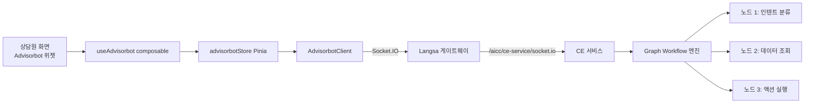

# 어드바이저봇 (Advisorbot)

> 상담원 화면에 표시되는 챗봇. 일반 LLM 챗봇과는 다른 **그래프 기반 워크플로우 봇**입니다.
> 자세한 통합 가이드: [asst-service/advisorbot-integration-guide.md](../../asst-service/advisorbot-integration-guide.md)

---

## 1. 어드바이저봇이란

**상담원 보조** vs **고객 응대**

| 구분 | Assist Stream (RAG/LLM) | Advisorbot (그래프 봇) |
|------|------------------------|----------------------|
| 입력 | 고객 발화 (STT 자동) | 상담원이 봇에게 질문 |
| 처리 | RAG 검색 + LLM 답변 | CE 서비스의 그래프 워크플로우 실행 |
| 출력 | 추천 답변 + 근거 문서 | 노드 실행 결과 + 알림 |
| 연결 | HTTP SSE (`/assist-stream`) | Socket.IO (CE 서비스 직결) |
| 호스트 | `SEARCH_HOST` | `CE_HOST` |
| 용도 | 통화 중 자동 답변 추천 | 상담원이 봇에게 명령 (예: "주문 취소") |

→ **둘은 완전히 다른 시스템**. 코드/소켓/스토어 모두 분리되어 있음.

---

## 2. 아키텍처



핵심: **asst-service를 거치지 않음**. 브라우저 ↔ Langsa 게이트웨이 ↔ CE 서비스 직접 통신.

---

## 3. 핵심 파일

### 프론트엔드

| 파일 | 역할 |
|------|------|
| [composables/useAdvisorbot.ts](../../asst-web/src/composables/useAdvisorbot.ts) | Vue Composable (가장 외부 API) |
| [stores/modules/advisorbot.ts](../../asst-web/src/stores/modules/advisorbot.ts) | Pinia 스토어 (세션 상태, 결과 누적) |
| [utils/AdvisorbotClient.ts](../../asst-web/src/utils/AdvisorbotClient.ts) | Socket.IO 클라이언트 + 메시지 직렬화 |

### 백엔드

- **asst-service에는 어드바이저봇 관련 코드가 없음**. CE 서비스가 단독 처리.

---

## 4. 동작 흐름

### 4-1. 세션 초기화

```typescript
const { isReady, sendCustomerMessage } = useAdvisorbot({
  autoConnect: true,
  botId: 'bot-xxx',
  graphId: 'graph-xxx',
  metadata: { agentId, callId },
});
```

내부 동작:
1. `AdvisorbotClient` 인스턴스 생성 → Socket.IO 연결 (`CE_HOST/socket.io`)
2. `session.initialize` 이벤트 emit → `{botId, graphId, metadata}`
3. CE 서비스 측에서 그래프 실행 컨텍스트 생성
4. `session.ready` 이벤트 수신 → `isReady = true`

### 4-2. 메시지 전송

```typescript
sendCustomerMessage('주문을 취소하고 싶어요');
```

내부:
1. `message.send` 이벤트 emit
2. CE 그래프가 노드별로 실행 (인텐트 분류 → 슬롯 채우기 → 액션)
3. 각 노드 실행 결과가 `node.execution` 이벤트로 도착 → `notifications` 배열 추가
4. 최종 결과가 `process.result` 이벤트로 도착 → `onExecutionResult` 콜백

### 4-3. 세션 정리

`disconnectOnUnmount: true`면 컴포넌트 언마운트 시 자동 disconnect.

---

## 5. 메시지 타입

[AdvisorbotClient.ts](../../asst-web/src/utils/AdvisorbotClient.ts) 참고:

| 타입 | 방향 | 내용 |
|------|------|------|
| `SessionInitializeRequest` | → CE | botId, graphId, metadata |
| `NodeExecutionInfo` | CE → | 노드 ID, 입출력, 실행 시간 |
| `AdvisorbotProcessResult` | CE → | 최종 답변, 추천 액션 |
| `NotificationAlert` | CE → | 중간 알림 (예: "처리 중...") |

---

## 6. 메인 소켓과의 분리

[03-frontend.md](../architecture/03-frontend.md) 참고:

| 구분 | 메인 소켓 | 어드바이저봇 소켓 |
|------|-----------|------------------|
| baseUrl | `LANGSA_GATEWAY_URL` | `LANGSA_GATEWAY_URL` (동일) |
| path | `/aicc/asst-service/socket.io` | `/api/ce/v1/socket.io` |
| 라이브러리 | `socket.io-client` | `socket.io-client` |
| 싱글톤 위치 | `socketIOPlugin.ts` | `AdvisorbotClient` 인스턴스 |
| 핵심 이벤트 | `redis-message`, `join-room` | `session.*`, `message.*`, `node.execution` |

**한 브라우저에 2개의 Socket.IO 연결이 동시에 존재**할 수 있다는 점이 후임자가 헷갈리기 쉬운 부분.

---

## 7. 인계 시 주의 포인트

1. **CE 서비스 의존성** — Advisor만 단독으로 어드바이저봇을 운영할 수 없음. CE 서비스가 그래프/봇/노드 모두 관리.
2. **`botId`/`graphId` 출처** — 보통 사용자/테넌트별로 발급된 ID. CE 서비스의 봇 카탈로그에서 조회 (`/proxy/ce/bots`).
3. **세션 누수** — 컴포넌트 언마운트 시 disconnect 안 시키면 leak. `disconnectOnUnmount: true` 권장.
4. **에러 처리** — CE 서비스 측 에러를 어드바이저봇 위젯에서 표시. `onError` 콜백.
5. **로컬 개발 시** — CE 서비스를 별도로 띄워야 함. `CE_HOST` 환경변수 + Mock CE 서버 또는 dev 환경 사용.
6. **이벤트 명 변경** — CE 서비스와 합의된 프로토콜. 한쪽만 바꾸면 동작 안 함.

---

## 8. 디버깅

| 도구 | 방법 |
|------|------|
| 소켓 연결 상태 | Vue DevTools → `advisorbotStore.isConnected` |
| 세션 ID | `advisorbotStore.sessionId` |
| 알림 누적 | `advisorbotStore.notifications` |
| 마지막 결과 | `advisorbotStore.lastExecutionResult` |
| 브라우저 콘솔 | `[AdvisorbotClient]` 로그 prefix |

---

## 9. 추가 학습 자료

- [asst-service/advisorbot-integration-guide.md](../../asst-service/advisorbot-integration-guide.md) — 통합 가이드 (Archive, 일부 outdated 가능)
- CE 서비스 측 그래프 워크플로우 문서 (별도 조달 필요)
- [adv_docs/specs/proxy-controllers.md#ce](proxy-controllers.md) — CE 프록시 컨트롤러
