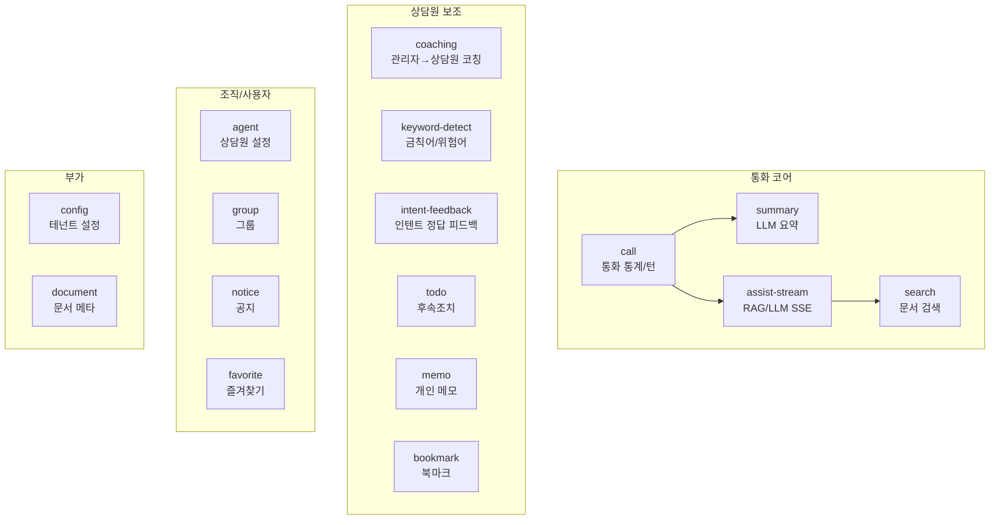

# 도메인 모듈 개요

> asst-service의 `src/advisor/` 아래 17개 도메인 모듈 한눈에 보기.
> 핵심 5개(call, summary, coaching, assist-stream, search)는 상세 섹션으로 다룹니다.

---

## 1. 전체 도메인 맵



각 도메인은 `Controller → Service → Entity` 패턴. 모든 컨트롤러는 `@UseInterceptors(DbCleanupInterceptor)` 적용.

---

## 2. 도메인 한 줄 요약

| 도메인 | 핵심 책임 | 컨트롤러 수 |
|--------|---------|------|
| **call** | 통화 통계(`callstats_call`), 턴(`callstats_turn`), 어시스트 스냅샷 | 2 |
| **summary** | 통화 내용 LLM 요약 + 키워드 추출 + Upsert 저장 | 1 |
| **coaching** | 코칭 요청 생성/조회, 실시간 코칭 메시지(Redis pub/sub) | 1 |
| **assist-stream** | RAG/LLM 답변 SSE 스트리밍 + 스냅샷 저장 | 2 |
| **search** | RAG 기반 문서 검색 | 1 |
| **agent** | 상담원 정보, 통화 설정 | 2 |
| **bookmark** | 북마크 + 북마크 그룹 | 2 |
| **memo** | 개인 메모 + 메모 그룹 | 2 |
| **notice** | 공지 + 읽음 상태 | 1 |
| **todo** | 후속조치 항목 (수동/자동 생성) | 1 |
| **keyword-detect** | 금칙어/위험어 감지 룰 | 1 |
| **intent-feedback** | NLP 인텐트에 대한 사용자 정답/오답 피드백 | 1 |
| **favorite** | 즐겨찾기 (콜/코칭/상담원/요청 5종) | 5 |
| **group** | 상담원 그룹 관리 | 1 |
| **config** | 테넌트별 환경 설정 | 1 |
| **document** | 문서 메타 (KMS 프록시 보조) | 1 |
| **shared** | 공통 DTO/유틸 (컨트롤러 없음) | - |

총 27개 컨트롤러, 166개 엔드포인트.

---

## 3. 핵심 도메인 상세

### 3-1. `call` (통화)

**책임**: 통화 단위(`call_id`)와 통계 단위(`callstats_id`) 데이터의 CRUD/조회.

**핵심 엔티티**:

| 엔티티 | 의미 |
|--------|------|
| `CallstatCall` | 통화 마스터 (`call_id`, 상담원, 시작/종료 시각, 방향, 고객정보) |
| `CallstatTurn` | 발화 턴 단위 (speaker, origin_text, masked_text, NLP 데이터, start_ms/end_ms) |
| `CallstatAssistSnapshot` | assist-stream 응답 스냅샷 (어떤 답변이 상담원에게 제공되었는지 기록) |
| `CallstatEntity` | 발화에서 추출된 엔티티 (인명/금액/날짜 등) |
| `CallstatKeyword` | 키워드 빈도 |
| `CallCategory` | 통화 분류 (콜타입) |
| `CallKeyword` | 마스터 키워드 |

**스키마 분리**: 일반 업무 데이터는 `advisor` 스키마, 통화 통계는 `raw_call` 스키마.

**주요 엔드포인트**:

- `GET /callstat/calls` — Pagination 통화 목록
- `GET /callstat/calls/by-call-id/:callId` — `call_id` 기준 조회
- `GET /call-stats/...` — 집계 데이터 (`CallStatsController`)

### 3-2. `summary` (통화 요약)

**책임**: 통화 종료 후 LLM으로 요약 + 키워드 추출.

**프롬프트** (LLM Orchestrator 호출):
- 요약: `adv-conversations-summarize`
- 키워드: `adv-conversations-summarize-keyword`

**처리 흐름**:
```
POST /summary { callstats_id, keyword_count }
  ├─ raw_call.callstats_call 에서 통화 조회
  ├─ raw_call.callstats_turn 에서 턴 데이터 조회
  ├─ intent 필드 집계 → 상위 3개 intent
  ├─ POST {LLM_ORCHESTRATOR_HOST}/llm/complete (요약)
  ├─ POST {LLM_ORCHESTRATOR_HOST}/llm/complete (키워드)
  └─ Response: SummaryResponseDto
```

**추가 엔드포인트**:
- `POST /summary/data` — Upsert (수동 편집 결과 저장)
- `GET/PUT/DELETE /summary/...` — CRUD

자세한 LLM 호출 패턴은 [LlmOrchestratorService](../../asst-service/src/common/services/llm-orchestrator.service.ts) 참조.

자세한 설계 배경: [adv_docs/plans/done/2026-04-17-counseling-type-llm-plan.md](../plans/done/2026-04-17-counseling-type-llm-plan.md)

### 3-3. `coaching` (코칭)

**책임**: 관리자가 상담원에게 실시간 코칭 메시지를 전달.

**핵심 엔티티**:
- `CoachingRequest` — 코칭 요청 (제목, 상태)
- `Coaching` — 코칭 메시지 (제목, 본문, 발신자, 수신자, 통화 컨텍스트)

**처리 흐름**:
```
관리자 → POST /coachings/requests (요청 생성)
관리자 → POST /coachings (메시지 작성)
  ↓
[asst-service] CoachingRedisService.publish() → Redis 코칭 채널
  ↓
[asst-service] CoachingSocketHandler 가 자체 구독 → 상담원 socket emit
  ↓
상담원 화면: Drawer에 코칭 메시지 표시
```

코칭은 **Redis Pub/Sub을 거치는 이유**: 다중 pod 환경에서 어느 pod에 상담원이 연결되어 있는지 모르므로 Redis로 fanout.

핵심 파일:
- [coaching.service.ts](../../asst-service/src/advisor/coaching/services/coaching.service.ts)
- [coaching-redis.service.ts](../../asst-service/src/advisor/coaching/services/coaching-redis.service.ts)
- [coaching-socket.handler.ts](../../asst-service/src/common/gateways/handlers/coaching-socket.handler.ts)

**자동 마이그레이션 컬럼**: `coaching_request_id`, `sender_name`, `customer_name` ([01-multi-tenant-db.md#7](../architecture/01-multi-tenant-db.md#7-자동-스키마-마이그레이션--주의) 참조)

### 3-4. `assist-stream` (AI 상담 보조)

**책임**: 고객 발화 확정 시 RAG/LLM 답변을 SSE 스트림으로 제공.

상세는 [02-realtime-streaming.md#3-http-sse-assist-stream--ragllm-답변](../architecture/02-realtime-streaming.md#3-http-sse-assist-stream--ragllm-답변) 참조.

**`assist-snapshot`** — 답변 스냅샷 저장 ([assist-snapshot.controller.ts](../../asst-service/src/advisor/assist-stream/controllers/assist-snapshot.controller.ts)):

- `POST /assist-snapshot` — 검색 결과 + LLM 답변을 `callstats_assist_snapshot`에 저장
- 통화별로 어떤 답변이 제공되었는지 사후 분석 가능

자세한 설계: [adv_docs/plans/done/2026-04-18-assist-stream-sse-design.md](../plans/done/2026-04-18-assist-stream-sse-design.md), [2026-04-20-assist-snapshot-design.md](../plans/done/2026-04-20-assist-snapshot-design.md)

### 3-5. `search` (문서 검색)

**책임**: 키워드 기반 문서 검색 (KMS/RAG 위임).

키워드 검색은 NLP partial/complete 발화에서 추출된 `nlp.keywords` 또는 사용자 직접 입력으로 트리거됨.

자세한 설계: [adv_docs/plans/done/2026-04-16-document-search-design.md](../plans/done/2026-04-16-document-search-design.md), [2026-04-17-search-split-design.md](../plans/done/2026-04-17-search-split-design.md)

> **KMS 연동 범위 (메모리 기록)**: 외부 KMS 클라이언트로 전환, 검색은 인텐트 기반, 즐겨찾기는 KMS 위임, 문서 다운로드는 제외.

---

## 4. 보조 도메인 요약

### `agent`
- `AgentController` — 상담원 CRUD
- `AgentCallSettingController` — 통화 관련 개인 설정 (자동 todo 활성화 등)

### `bookmark`
- 즐겨찾는 답변/문서 북마크 + 그룹 관리

### `memo`
- 개인 메모 + 그룹. 통화 컨텍스트와 연결 가능

### `notice`
- 공지 작성/조회 + 읽음 상태 추적 (`notice_read`)
- Socket으로 신규 공지 알림 (`NoticeSocketHandler`)

### `todo`
- 후속조치 (예: "고객에게 다시 전화하기")
- LLM이 통화 종료 시 자동 생성 가능 ([LlmOrchestratorService](../../asst-service/src/common/services/llm-orchestrator.service.ts))

### `keyword-detect`
- 금칙어/위험어 룰 (예: "환불", "취소" 같은 키워드가 발화에 등장하면 알림)
- NLP partial/complete 흐름에서 클라이언트 측이 검사

### `intent-feedback`
- 잘못 분류된 인텐트 피드백 수집
- 추후 모델 재학습 데이터로 활용

### `favorite`
- 5종류 즐겨찾기:
  1. `Favorite` — 일반 즐겨찾기
  2. `FavoriteCall` — 통화 즐겨찾기
  3. `FavoriteCoaching` — 코칭 메시지 즐겨찾기
  4. `FavoriteCoachingRequests` — 코칭 요청 즐겨찾기
  5. `FavoriteAgents` — 상담원 즐겨찾기

> KMS 연동 정책: **일반 문서 즐겨찾기는 KMS 위임**, 위 5종은 advisor 내부에서 관리.

### `group`
- 상담원 그룹 (팀/부서 단위 그루핑)

### `config`
- 테넌트별 환경 설정 (자동 todo on/off, LLM 프롬프트 키 등)

### `document`
- 문서 메타 관리 (실제 검색은 KMS 위임, document는 메타데이터 보조용)

---

## 5. 공통 인프라 서비스

`src/common/services/` — 모든 도메인이 사용:

| 서비스 | 책임 |
|--------|------|
| `LlmOrchestratorService` | LLM Orchestrator API 프록시. 프롬프트명 + 파라미터로 호출 |
| `DynamicDatabaseService` | 테넌트별 DataSource 풀 |
| `TenantConfigService` | 테넌트 메타 조회 |
| `UserInfoService` | 사용자/계정 정보 (USER_HOST 캐시) |
| `RedisService` | Redis 클라이언트 (publisher + subscriber 2개) |
| `HttpClientService` | 외부 서비스 호출 wrapper (axios 기반) |

`src/common/proxy/` — BFF 프록시 컨트롤러 (자세한 배경: [adv_docs/plans/done/2026-04-16-bff-transition-plan.md](../plans/done/2026-04-16-bff-transition-plan.md)):

| 컨트롤러 | 대상 | 용도 |
|----------|------|------|
| `CeProxyController` | `CE_HOST` | CE 서비스 위임 |
| `QaProxyController` | `QA_API_URL` | QA 서비스 |
| `UserProxyController` | `USER_HOST` | 사용자 정보 |
| `KnowledgeProxyController` | `KNOWLEDGE_API_URL` | KMS 위임 |
| `AudioProxyController` | `AUDIO_SERVICE_API_URL` | 통화 녹취 |
| `TaProxyController` | (`TA_HOST` 일시 주석) | TA 서비스 |

→ Advisor 코드를 거치지 않는 외부 서비스 호출은 모두 이 프록시 컨트롤러를 경유.

---

## 6. 후임자가 도메인 추가/수정 시 체크리스트

1. **새 엔티티 추가 시**:
   - `entities/` 에 엔티티 생성
   - [src/config/database.config.ts](../../asst-service/src/config/database.config.ts) entities 배열에 추가
   - [src/common/services/dynamic-database.service.ts](../../asst-service/src/common/services/dynamic-database.service.ts) 의 entities 배열 2곳에 추가 (`getConnection` + `getStaticConnection`)
   - 마이그레이션 SQL 작성 → `migrations/` 에 추가
   - **자동 마이그레이션 코드(`runSchemaMigrations`)와 중복 안 되도록 주의**

2. **새 컨트롤러 추가 시**:
   - `@ApiTags`, `@ApiBearerAuth('bearer')`, `@UseInterceptors(DbCleanupInterceptor)` 적용
   - [advisor.module.ts](../../asst-service/src/advisor/advisor.module.ts) controllers/providers 배열에 등록
   - 인증 미들웨어 우회가 필요하면 [app.module.ts:34-39](../../asst-service/src/app.module.ts#L34-L39) `.exclude()` 추가

3. **LLM 호출 시**:
   - `LlmOrchestratorService` 사용 (직접 fetch 금지)
   - 프롬프트명 컨벤션: `adv-{도메인}-{용도}` (예: `adv-conversations-summarize`)

4. **Redis Pub/Sub 활용 시**:
   - 채널 prefix 컨벤션 따르기 (`{env}:{tenant}:{agent}:...`)
   - `CoachingRedisService` 패턴 참고

5. **테스트**:
   - 컨트롤러: `.spec.ts` 동반 (HTTP 모킹)
   - 서비스: DataSource/외부 호출 모킹
   - `DbCleanupInterceptor` 적용 컨트롤러는 별도 인터셉터 모킹 필요
