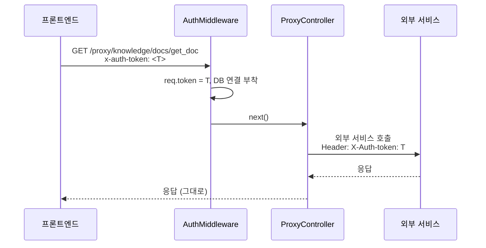

# BFF 프록시 컨트롤러

> 외부 서비스 호출을 asst-service가 중계하는 BFF(Backend-for-Frontend) 패턴.
> 자세한 전환 배경: [plans/done/2026-04-16-bff-transition-plan.md](../plans/done/2026-04-16-bff-transition-plan.md)

---

## 1. 왜 프록시인가

이전에는 프론트엔드가 외부 서비스에 직접 호출 → CORS, 인증, 환경별 도메인 관리 복잡.

BFF로 전환 후:
- 프론트는 asst-service 1곳만 호출
- asst-service가 인증 헤더 변환 + URL prefix 처리 + 환경 차이 흡수
- 외부 서비스 URL은 asst-service env에만 존재 (프론트 빌드에 노출 X)

---

## 2. 프록시 컨트롤러 6종

| 컨트롤러 | 경로 prefix | 대상 env | 위임 대상 |
|----------|------|------|------|
| [`CeProxyController`](../../asst-service/src/common/proxy/ce-proxy.controller.ts) | `/proxy/ce` | `CE_HOST` | Call Experience (봇, NLU 카탈로그) |
| [`QaProxyController`](../../asst-service/src/common/proxy/qa-proxy.controller.ts) | `/proxy/qa` | `QA_API_URL` | QA 서비스 |
| [`UserProxyController`](../../asst-service/src/common/proxy/user-proxy.controller.ts) | `/proxy/user` | `USER_HOST` | 사용자/조직 정보 |
| [`KnowledgeProxyController`](../../asst-service/src/common/proxy/knowledge-proxy.controller.ts) | `/proxy/knowledge` | `KNOWLEDGE_API_URL` | KMS (문서, 인덱스, 섹션) |
| [`AudioProxyController`](../../asst-service/src/common/proxy/audio-proxy.controller.ts) | `/proxy/audio` | `AUDIO_SERVICE_API_URL` | 통화 녹취 스트리밍 |
| [`TaProxyController`](../../asst-service/src/common/proxy/ta-proxy.controller.ts) | `/proxy/ta` | `TA_HOST` (현재 주석) | TA 서비스 (일시 비활성) |

모두 [`HttpClientService`](../../asst-service/src/common/services/http-client.service.ts) 를 사용해 axios 호출.

---

## 3. 공통 패턴

### 3-1. 요청 헤더 변환

각 외부 서비스가 받는 인증 헤더가 다름:

| 서비스 | 헤더 |
|--------|------|
| CE | `Authorization: Bearer <token>` |
| Knowledge | `X-Auth-token: <token>` |
| User | `x-auth-token: <token>` |
| QA | (서비스별 확인) |

→ Advisor 가 받는 `req.token`을 각 외부 서비스 형식으로 변환해서 전달.

### 3-2. URL prefix 처리

CE 서비스는 게이트웨이의 `/api/ce/v1` prefix를 코드에서 직접 추가:

```typescript
const CE_PREFIX = '/api/ce/v1';
this.httpClient.get(`${this.ceHost}${CE_PREFIX}/bots`, ...)
```

→ 외부 서비스의 게이트웨이 라우팅이 변경되면 이 prefix 상수만 수정.

### 3-3. 쿼리/바디 패스스루

```typescript
@Get('indexes/get_doc_idx')
getDocIndex(@Req() req: AuthRequest) {
  return this.httpClient.get(`${this.knowledgeHost}/api/indexes/get_doc_idx`, {
    headers: { 'X-Auth-token': req.token },
    params: req.query as Record<string, string>,
  });
}
```

→ DTO 검증 없이 쿼리스트링/바디를 그대로 전달. **외부 서비스 스펙이 변경되어도 Advisor 수정 불필요**.

단점: 잘못된 요청도 그대로 전달됨 → 외부 서비스 에러를 사용자가 받음. 필요 시 컨트롤러에서 검증 추가.

---

## 4. KMS 위임 정책 (Knowledge)

> 메모리 기록: 외부 KMS 클라이언트로 전환, 검색은 인텐트 기반, 즐겨찾기는 KMS 위임, 문서 다운로드는 제외.

`KnowledgeProxyController`가 다루는 영역:

| 엔드포인트 | 용도 | Advisor가 다루나? |
|-----------|------|------|
| `POST /search/retrieve_doc` | 문서 검색 (RAG) | KMS 위임 |
| `GET /indexes/get_doc_idx` | 문서 인덱스 | KMS 위임 |
| `GET /sections/get_section` | 섹션 조회 | KMS 위임 |
| `GET /docs/get_doc` | 문서 본문 | KMS 위임 |
| `POST /favorites/...` | 일반 문서 즐겨찾기 | KMS 위임 |

Advisor 내부에서 다루는 즐겨찾기 5종(`FavoriteCall`, `FavoriteCoaching` 등)과 **일반 문서 즐겨찾기는 분리**되어 있음. 일반 문서 즐겨찾기는 KMS에 위임.

→ `Document` 엔티티/도메인은 메타데이터 보조용 (검색/다운로드 본체는 KMS).

---

## 5. 인증 흐름



**중요**: 프록시 컨트롤러도 `AuthMiddleware` 를 거치므로 DB 연결이 부착됨. DB 사용 안 한다면 약간 비효율적이지만 인증 일관성을 위해 유지.

---

## 6. 인계 시 주의 포인트

1. **외부 서비스 URL 변경 시** — 해당 `.env` 변수만 수정. 코드 변경 불필요.
2. **인증 헤더 명 변경 시** — 컨트롤러에서 헤더 키만 수정.
3. **새 외부 서비스 추가 시**:
   - `validation.config.ts`에 env 추가
   - `src/common/proxy/` 에 컨트롤러 추가
   - [proxy.module.ts](../../asst-service/src/common/proxy/proxy.module.ts) 에 등록
4. **응답 변환 필요 시** — 컨트롤러에서 axios 응답을 받아 가공 후 반환. 현재는 대부분 패스스루.
5. **TA 서비스 주석 처리** — [validation.config.ts:81-82](../../asst-service/src/config/validation.config.ts#L81-L82). 활성화 시 주석 해제 + 컨트롤러도 재활성화.
6. **CE 서비스 prefix `/api/ce/v1` 하드코딩** — 게이트웨이 라우팅 변경 시 [ce-proxy.controller.ts:11](../../asst-service/src/common/proxy/ce-proxy.controller.ts#L11) 수정.

---

## 7. 알려진 함정

- **`/proxy/audio/stream/playback`은 인증 미들웨어 우회** ([app.module.ts:38](../../asst-service/src/app.module.ts#L38)). 통화 녹취 재생 SSE 또는 chunked 응답 때문. 별도 인증 검증 필요.
- **타임아웃 미설정** — `HttpClientService`의 기본 타임아웃에 의존. 느린 외부 서비스가 Advisor 요청을 잡아둘 수 있음.
- **응답 캐싱 없음** — 동일한 KMS 인덱스 조회가 반복되어도 매번 외부 호출. 트래픽 증가 시 캐싱 검토.
- **에러 응답 형식이 외부 서비스 그대로** — Advisor 표준 에러 형식과 다를 수 있음. 프론트에서 분기 처리.

---

## 8. 디버깅

| 도구 | 방법 |
|------|------|
| trace ID로 외부 호출 추적 | 로그에서 `x-trace-id` 검색 |
| 외부 서비스 응답 디버깅 | `HttpClientService`에 interceptor 임시 추가 |
| 환경별 호스트 확인 | `GET /redis-monitor/debug-auth` (인증 디버깅용 엔드포인트도 비슷한 패턴) |
