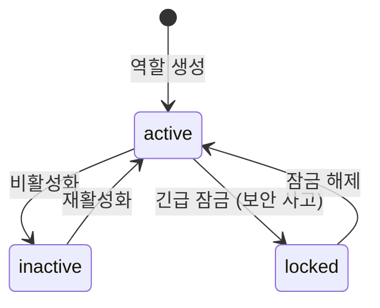
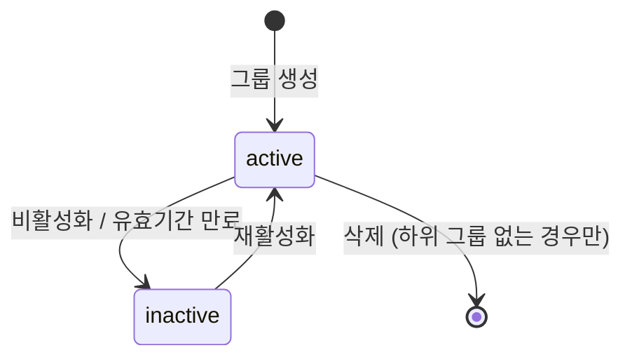
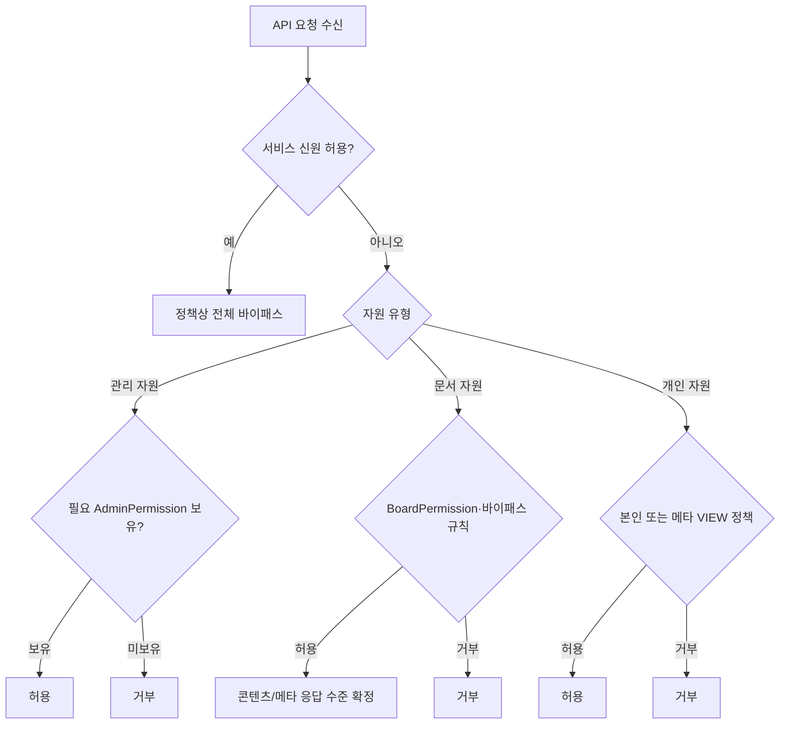
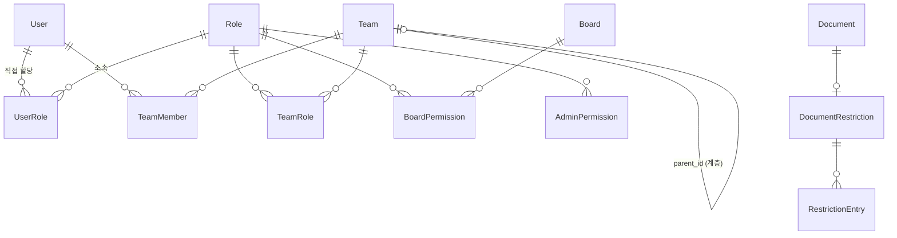

# 권한 체계 기능정의서

| 항목 | 값 |
|------|---|
| 제품 | AICM (KMS) |
| 문서 코드 | FD-ACL |
| 버전 | 1.3 |
| 작성일 | 2026-03-25 |
| 수정일 | 2026-04-02 |
| 기준 문서 | AICM 새 기능정의서 v1 §4 |

---

## 1. 자원 분류 및 권한 모델 개요

AICM의 모든 관리 대상 자원을 **문서 자원**, **관리 자원**, **개인 자원**으로 분류하며, 각 자원 유형에 맞는 별도 권한 체계를 적용한다.

| 자원 유형 | 설명 | 권한 체계 |
|-----------|------|----------|
| **문서 자원** (Board-scoped) | 게시판에 종속 — Document, Block, Comment, Like, Approval, DocumentVersion 등 | `BoardPermission`(VIEW/EDIT/APPROVE)으로 Role에 부여 |
| **관리 자원** (Admin-scoped) | 게시판 비종속 — Board, Template, SharedContent, Tag, ApprovalLineTemplate, SearchConfig, AuditLog, Team 등 | 해당 API에 정의된 `AdminPermission` 키만으로 제어 (외부 사용자 유형 라벨과 무관) |
| **개인 자원** (User-scoped) | 사용자에 귀속 — Bookmark, BookmarkFolder, Notification, NotificationSetting, Subscription | 소유자 확인으로 제어 |

- **BR-ACL-001**: 문서 자원은 게시판별로 세분화된 action(VIEW/EDIT/APPROVE)이 필요하고, 관리 자원은 "관리할 수 있는가/없는가"의 이진 판단만 필요, 개인 자원은 소유자 확인만으로 충분하여 별도의 권한 체계로 분리

---

## 2. 인가 원칙

AICM의 **접근 허용**은 (1) AICM **Role**에 매핑된 `BoardPermission`·`AdminPermission`, (2) 개인 자원의 소유자 일치, (3) 아래 §3~§7의 예외(메타정보 바이패스·내부 서비스 신원 등)로만 판단한다. 외부 IdP·user_service가 내려줄 수 있는 사용자 유형·라벨은 **인가에 사용하지 않으며**, 표시·감사·연동 **메타데이터**로만 쓸 수 있다.

**관리 자원**은 엔드포인트별로 요구하는 `AdminPermission`을 유효 역할 합산으로 보유하는지 **이것만** 검사한다. `AdminPermission`은 **외부 사용자 유형·포털 표시 라벨·Role 이름(프리셋 여부)과 무관하게** 해당 키가 유효 역할에 매핑되어 있으면 적용된다. "관리자 등급" 계정이 아니어도 `AdminPermission`만 부여되면 관리 API에 접근할 수 있다.

- **BR-ACL-002**: 내부 배치·M2M 등 **서비스 신원**(허용 목록에 등록된 토큰)은 정책에 따라 모든 자원에 대해 권한 평가를 스킵할 수 있다 — 일반 사용자 인가 경로와 분리하여 구성한다
- **BR-ACL-003**: 유효 역할에 **하나 이상의 `AdminPermission`이 매핑된 사용자**는, `BoardPermission(VIEW)`가 없는 게시판의 문서에 대해 **메타정보 수준** VIEW 바이패스를 적용할 수 있다(전체 콘텐츠 열람은 명시적 `BoardPermission(VIEW)` 필요). 부여받지 않은 관리 자원 API는 해당 키가 없으면 거부. 문서·개인 자원 메타정보 열람은 감사 로그에 남긴다
- **BR-ACL-004**: 문서 자원의 기본 경로는 **항상 `BoardPermission`** 평가이며, 외부 사용자 유형 라벨로 문서 접근을 열거나 막지 않는다

---

## 3. Role과 Group

### 3.1 Role — 단일 권한 경계

Role은 AICM의 유일한 권한 경계이다. 게시판 권한(`BoardPermission`)과 관리자 권한(`AdminPermission`)이 모두 Role에 부여된다.

```
Role "상담원"
  ├─ BoardPermission: 게시판A(VIEW), 게시판B(VIEW/EDIT)
  └─ AdminPermission: (없음)

Role "게시판 관리자"
  ├─ BoardPermission: 전체 게시판(VIEW/EDIT)
  └─ AdminPermission: manage_boards, manage_tags

Role "검색 관리자"
  ├─ BoardPermission: (필요한 만큼)
  └─ AdminPermission: manage_search
```

#### 시스템 프리셋 Role

시스템 초기화 시 아래 프리셋 Role이 자동 생성된다 (`is_system = true`). 관리자는 프리셋을 그대로 사용하거나, 복제·수정하여 커스텀 Role을 만들 수 있다.

| 프리셋 Role | AdminPermission | 용도 |
|------------|-----------------|------|
| 일반 사용자 | (없음) | 신규 사용자 기본 — BoardPermission만 부여해 문서 열람 |
| 콘텐츠 관리자 | `manage_boards`, `manage_templates`, `manage_tags`, `manage_shared_content` | 게시판 구조 + 콘텐츠 도구 통합 관리 |
| 조직 관리자 | `manage_roles`, `manage_teams`, `manage_policies` | 역할·그룹·승인 라인 템플릿 관리 |
| 검색 관리자 | `manage_search` | 검색 튜닝 전담 |
| 설정·감사 담당(프리셋) | `manage_system`, `view_audit_logs`, `manage_prompts` | 시스템 설정 + 감사 로그 + AI 프롬프트 관리 |

> 프리셋 Role 이름은 권한 묶음을 설명하는 표시일 뿐이며, 외부 계정 유형(`system` / `admin` / `normal` 등)이나 "관리자 승급"과 **대응하지 않는다**.

- **BR-ACL-005**: 프리셋 Role은 **삭제 불가**
- **BR-ACL-006**: 프리셋 Role의 핵심 권한 변경 범위 — **향후 결정** (UC-ADM-14는 "핵심 권한 변경 불가"로 기술하나, 어떤 권한이 "핵심"에 해당하는지 정의 필요)
- **BR-ACL-007**: 신규 사용자 온보딩 시 "일반 사용자" 프리셋 Role이 기본 할당된다
- AdminPermission 12개 키는 개별 자원 단위로 세분화 유지 — 그룹핑은 프리셋 Role이 담당하며, 별도 그룹 카탈로그(DB 테이블·코드 상수)를 두지 않는다
- 관리자가 "콘텐츠 관리자에서 태그 관리만 빼고 싶다"면 프리셋을 복제한 뒤 `manage_tags`를 해제

#### Role 생명주기

Role은 아래 상태를 가진다:

| 상태 | 설명 |
|------|------|
| `active` | 정상 운영 — 신규 부여 가능, 기존 사용자 권한 적용 |
| `inactive` | 비활성 — 신규 부여 목록에서 제외, 기존 사용자/그룹의 해당 Role 통한 권한 해제 |
| `locked` | 긴급 잠금 — 보안 사고 시 해당 역할 통한 모든 권한 즉시 정지, 잠금 사유 필수 |



- **BR-ACL-008**: Role 비활성화 시 기존에 부여된 사용자/그룹에서 권한이 해제된다 (Role 자체와 할당 이력은 보존)
- **BR-ACL-009**: Role 긴급 잠금 시 해당 역할을 통한 모든 권한이 즉시 정지된다. 잠금된 역할을 보유한 사용자에게 알림이 발송된다

### 3.2 Group — 조직 단위

그룹(Team)은 동일한 역할을 공유하는 사용자 그룹이다. 그룹 자체는 권한을 갖지 않으며, TeamRole을 통해 Role을 부여한다. 사용자는 복수의 그룹에 소속 가능.

#### 그룹 계층 구조

그룹은 **부모-자식 계층 구조**를 가질 수 있다. `parent_id`를 통해 상위 그룹을 지정하며, 상위 그룹에 부여된 역할은 하위 그룹 소속 멤버에게 자동 상속된다.

```
A사업부 (Role: "기본 열람자")
├── 가팀 (Role: "상담원")
│   ├── 가-1파트
│   └── 가-2파트
└── 나팀 (Role: "기술지원")
```

위 예시에서 "가-1파트" 소속 멤버는 자신의 그룹 역할 + "가팀" 역할("상담원") + "A사업부" 역할("기본 열람자")을 모두 상속받는다.

- **BR-ACL-010**: 상위 그룹에 부여된 역할은 하위 그룹 소속 멤버에게 자동 상속된다 (합산만 적용, 하위에서 상위 역할 차단 불가)
- **BR-ACL-011**: 그룹 계층 깊이 상한은 기본 10단계 — 초과 시 경고 표시 후 관리자 확인으로 진행 가능
- **BR-ACL-012**: 그룹 이동 시 순환 참조가 발생하면 시스템이 차단한다
- **BR-ACL-013**: 하위 그룹이 존재하는 그룹은 삭제할 수 없다

#### 배포 환경별 그룹 관리

- SaaS: ECP 조직과 매핑
- 온프렘: 자체 그룹 관리

#### Group 생명주기

| 상태 | 설명 |
|------|------|
| `active` | 정상 운영 — 구성원의 해당 그룹 권한 적용 |
| `inactive` | 비활성 — 구성원의 해당 그룹 통한 권한 해제, 그룹 구조와 이력 보존 |



- **BR-ACL-014**: Group 비활성화 시 구성원의 해당 그룹을 통한 권한이 해제되지만, 그룹 구조와 이력은 보존된다
- **BR-ACL-015**: 외부 협력사 임시 그룹은 유효기간(`expires_at`)을 설정할 수 있으며, 만료 시 시스템이 자동으로 비활성 처리한다

### 3.3 권한 부여 경로

권한은 모두 Role을 통해 부여되며, 사용자에게 Role을 할당하는 경로가 두 가지이다:

- **그룹을 통한 상속**: 그룹에 Role을 부여(TeamRole)하면 소속 멤버 전원이 해당 Role을 상속. 상위 그룹의 역할도 자동 상속
- **개인 직접 할당**: 특정 사용자에게 UserRole로 Role을 직접 할당 — "이 사람만 예외적으로 승인 권한이 필요해" 같은 상황 대응

### 3.4 유효 역할(Effective Roles)과 합집합 모델

사용자의 **유효 역할**:

```
유효 역할 = UserRole(직접 할당)
           ∪ TeamMember→Team→TeamRole(소속 그룹 상속)
           ∪ TeamMember→Team→상위 그룹 체인→TeamRole(상위 그룹 상속)
```

모든 유효 역할에서 받은 권한을 **합산**한다. deny(명시적 거부) 개념은 두지 않는다.

- **BR-ACL-016**: 유효 역할 계산 시 사용자의 소속 그룹뿐 아니라, 해당 그룹의 상위 그룹 전체 체인을 순회하여 부여된 Role을 합산한다
- **BR-ACL-017**: 합집합 모델에서는 "특정 사용자만 접근을 차단"하는 것이 불가능 — 해당 사용자를 그룹에서 제외하거나 Role을 회수하는 것으로 대응
- deny 개념을 도입하면 권한 디버깅 복잡도가 극단적으로 상승하므로 초기에는 합집합 모델로 운영
- **BR-ACL-018**: 비활성(`inactive`) 또는 잠금(`locked`) 상태의 Role은 유효 역할 합산에서 제외된다
- **BR-ACL-019**: 비활성(`inactive`) 상태의 Group을 통한 역할은 유효 역할 합산에서 제외된다
- **BR-ACL-034**: Role 삭제 시 해당 역할이 UserRole 또는 TeamRole에 부여된 상태이면 삭제를 차단한다 — 먼저 모든 할당을 해제해야 삭제 가능
- **BR-ACL-035**: Role·Team 수정 시 `version` 필드 기반 낙관적 동시성 제어를 적용한다. 요청 본문의 `version`과 DB 현재 `version` 불일치 시 `ACL_CONCURRENT_MODIFICATION`(409)을 반환한다

### 3.5 권한 평가 흐름 요약

모든 API 호출에 선행하는 권한 평가의 순서:



- **BR-ACL-020**: 관리 자원 API는 **해당 엔드포인트에 필요한 `AdminPermission`만** 평가한다. 외부 사용자 유형 라벨로 선행 거부하지 않는다. 미보유 시 `ACL_PERMISSION_DENIED`(403)
- **BR-ACL-021**: Restriction 평가는 BoardPermission 평가 이후에 추가로 수행된다 (Restriction 기능이 on인 경우만)

---

## 4. 게시판별 문서 자원 권한 (BoardPermission)

게시판에 소속되는 문서 자원은 `BoardPermission`의 action(VIEW/EDIT/APPROVE)으로 접근을 제어한다. **BR-ACL-022**: 게시판 A의 권한으로 게시판 B의 자원에 접근할 수 없다.

| Action | 의미 | 대상 자원 |
|--------|------|----------|
| **VIEW** | 게시판 내 문서/블록 열람 | Document, Block, Comment, Like, DocumentVersion 조회 |
| **EDIT** | 문서 작성/수정/삭제 | Document, Block, DocumentAttachment CRUD, Comment 작성, Report 접수 |
| **APPROVE** | 타인이 작성한 문서의 승인/반려 | Approval 처리, 문서 접근 제한(Restriction) 설정 |

- **BR-ACL-023**: 메타정보 VIEW 바이패스 — `BoardPermission(VIEW)`가 없어도 유효 역할에 **AdminPermission이 하나 이상** 있으면 동일하게 **메타정보 수준** 열람 가능. 전체 콘텐츠 열람은 명시적 `BoardPermission(VIEW)` 필요. EDIT/APPROVE는 BoardPermission 필요. 바이패스 열람 시 감사 로그 기록
- **BR-ACL-024**: 권한 상속 — Board → Document → Block/Comment/Like/Approval 순으로 권한 상속

### 4.1 메타정보 VIEW 바이패스 — 메타정보 응답 정의

`BoardPermission(VIEW)` 없이 §4의 바이패스 규칙으로 문서에 접근할 때, API는 **메타정보만** 응답하고 콘텐츠 필드를 제거한다. 권한 모델(`BoardPermission` action)은 변경하지 않으며, **API 응답 레이어에서 필드 필터링**으로 처리한다.

#### 접근 유형 판별

권한 평가 결과에 접근 출처를 구분한다:

| 접근 출처 (`view_source`) | 조건 | 응답 수준 |
|---|---|---|
| `permission` | 해당 게시판에 대한 `BoardPermission(VIEW)` 보유 | 전체 콘텐츠 |
| `bypass` | `BoardPermission(VIEW)` 미보유 + 유효 역할에 AdminPermission 1개 이상 | 메타정보만 |

#### 메타정보 응답에 포함되는 필드

| 포함 (메타정보) | 제거 (콘텐츠) |
|---|---|
| 문서 ID, 제목, 게시판 정보 | 블록 본문 (`blocks`, `content`) |
| 상태 (`status`, `is_suspended`) | 댓글 내용 (`comments[].content`) |
| 태그, 템플릿 ID, 템플릿명 | 버전 본문 (`versions[].content`) |
| 작성자, 담당자, 작성일, 수정일 | 첨부파일 다운로드 URL |
| 버전 번호, 버전 수 | 공통 컨텐츠 resolve 결과 |
| 댓글 수, 좋아요 수 | |
| 승인 상태, 유효기간, 보존기간 정보 | |
| 접근 제한 여부 (`restricted`) | |

#### 적용 API 및 동작

- **문서 상세 조회**: 메타정보 필드만 반환, 블록 본문·댓글 내용·첨부파일 URL 제거. 응답에 `view_source: 'bypass'` 포함하여 클라이언트가 "메타정보만 표시" UI를 렌더링할 수 있도록 함
- **문서 목록 조회**: 목록 자체는 메타정보 위주이므로 바이패스·퍼미션 무관하게 동일 응답. 단, 본문 미리보기(snippet) 필드는 바이패스 시 제거
- **검색 결과**: 바이패스 대상 문서는 제목·태그·게시판명만 표시, 본문 스니펫 제거 (상세: [FD-SCH](FD-SCH-검색.md) §1)
- **RAG 검색**: `BoardPermission(VIEW)` 미보유 게시판의 문서는 RAG 소스에서 제외 — 바이패스 메타정보로는 RAG 답변 생성 불가 (상세: [FD-SCH](FD-SCH-검색.md) §2)
- **블록 단위 링크 접근**: 바이패스 시 문서 상세 페이지로 이동하되 블록 본문은 표시되지 않음 — "전체 내용을 보려면 게시판 열람 권한이 필요합니다" 안내

---

## 5. 문서 접근 제한 (DocumentRestriction)

게시판 권한만으로 불충분한 경우, 문서 단위로 추가 접근 제한을 설정할 수 있다.

- **BR-ACL-025**: 기본 상태 (열림, `restricted = false`) — 상위(게시판) 권한 그대로 상속
- **BR-ACL-026**: 제한 상태 (`restricted = true`) — 화이트리스트에 지정된 User 또는 Group만 접근 가능, 나머지 차단
- **화이트리스트 대상**: User 개인 또는 Team 단위 — action(VIEW/EDIT/APPROVE)별 지정
  - `subject_type = 'USER'`이면 특정 사용자에게만 해당 action 허용
  - `subject_type = 'TEAM'`이면 해당 팀 소속 멤버 전원에게 해당 action 허용
- **BR-ACL-027**: 제한 설정 권한 — 해당 게시판 APPROVE 보유자 또는 `manage_boards` AdminPermission 보유자
- **BR-ACL-028**: 메타정보 VIEW 바이패스 (제한 문서) — 화이트리스트에 없어도 §4.1과 동일하게 **AdminPermission 보유자**는 메타정보 수준 VIEW 가능 (감사 로그). 본문 콘텐츠는 `BoardPermission(VIEW)` 또는 화이트리스트 규칙에 따름
- **BR-ACL-029**: 기능 on/off — 시스템 설정에서 "문서 레벨 접근 제한 기능"을 켜거나 끌 수 있음. off 시 모든 문서가 게시판 권한만 따름 (`restricted = false` 고정)

---

## 6. 관리 자원 권한 (AdminPermission)

게시판에 종속되지 않는 관리 자원은 **해당 API에 정의된 `AdminPermission`을 유효 역할 합산으로 보유한 경우에만** 접근 가능하다. 외부 역할 라벨은 검사하지 않는다.

| 관리 영역 | 권한 키 | 대상 |
|-----------|---------|------|
| 게시판 | `manage_boards` | Board, BoardConfig, Restriction, Report 처리 |
| 역할 | `manage_roles` | Role, UserRole, BoardPermission, AdminPermission (역할 CRUD 및 권한 구성) |
| 그룹 | `manage_teams` | Team, TeamMember, TeamRole |
| 승인 라인 템플릿 | `manage_policies` | ApprovalLineTemplate(단계는 JSONB 내 ApprovalLineTemplateStep 구조) |
| 템플릿 | `manage_templates` | Template |
| 태그 | `manage_tags` | Tag |
| 공통 컨텐츠 | `manage_shared_content` | SharedContent |
| 검색 튜닝 | `manage_search` | SearchConfig, Synonym, StopWord, BoostRule |
| AI 프롬프트 | `manage_prompts` | PromptSlot, PromptVersion (프롬프트 슬롯 편집/버전 관리/테스트) |
| 시스템 설정 | `manage_system` | SystemConfig |
| 감사 로그 | `view_audit_logs` | AuditLog (조회/내보내기) |
| 승인 우회 | `bypass_approval` | 긴급 발행 — 승인 절차 스킵 |

- **BR-ACL-030**: 관리 자원 권한은 VIEW/EDIT 개념이 아닌 "해당 영역을 관리할 수 있는가"의 이진 판단 — 권한이 있으면 CRUD 전체, 없으면 관리 화면 접근 불가
- **BR-ACL-031**: (폐기) 과거에는 외부 역할과 AdminPermission 동시 부여를 제한했으나, 인가는 `AdminPermission`만 사용하므로 **UserRole·TeamRole로 Role을 부여하는 것 자체는 외부 역할에 묶지 않는다.** 운영상 필요하면 UI에서 경고만 둘 수 있다
- **BR-ACL-032**: 마지막 역할 관리 권한 보호 — `manage_roles` AdminPermission을 유효 역할 합산으로 보유한 사용자가 최소 1명은 남아 있어야 한다(정책으로 보호 대상 키 집합을 조정할 수 있음). 마지막 보유자의 해당 권한 제거·역할 회수·그룹에서의 제거는 시스템이 차단한다
- **SYSTEM 전용 설정** (애플리케이션 권한·`manage_system`으로도 변경 불가): 배포 모드(SaaS/온프렘), 테넌트 전역 파라미터 등 인프라 수준 설정 — 자원이 아닌 환경변수·인프라 구성으로 관리

---

## 7. 개인 자원 접근

개인에게 귀속되는 자원(북마크, 알림 설정, 구독 등)은 **본인만** 접근 가능하다.

| 조건 | 접근 |
|------|------|
| **본인** | 전체 허용 |
| **타인 개인 자원·VIEW** | 유효 역할에 AdminPermission이 하나 이상 있으면 메타정보 수준 VIEW 허용(수정 불가) — 감사 로그 기록 |
| **서비스 신원** | 정책에 따른 바이패스 |

- **BR-ACL-033**: 타인의 개인 자원을 열람할 수 있는 경우는 **관리 목적의 메타정보 VIEW**로 한정하며, `AdminPermission` 보유 여부와 감사 로그로 근거를 남긴다

---

## 8. 배포 환경별 분기

- SaaS: ECP 포털 토큰으로 유저/조직 정보 수신
- 온프렘: 자체 유저/조직 관리 (UserProvider 추상화로 코드베이스 단일 유지)

---

## 9. 데이터 모델

### Role

| 필드 | 타입 | 제약 | 설명 |
|------|------|------|------|
| id | UUID | PK | |
| name | VARCHAR(100) | NOT NULL, UNIQUE | 역할 이름 |
| description | VARCHAR(500) | NULL | 역할 설명 |
| status | ENUM('active', 'inactive', 'locked') | NOT NULL, DEFAULT 'active' | 생명주기 상태 |
| is_system | BOOLEAN | NOT NULL, DEFAULT false | 시스템 프리셋 여부 (true면 삭제 불가) |
| lock_reason | VARCHAR(500) | NULL | 긴급 잠금 사유 (status='locked'일 때만) |
| created_by | UUID | FK(User), NOT NULL | |
| created_at | TIMESTAMP | NOT NULL | |
| updated_at | TIMESTAMP | NOT NULL | |
| version | INTEGER | NOT NULL, DEFAULT 1 | 낙관적 락킹용 버전 |

### Team (Group)

| 필드 | 타입 | 제약 | 설명 |
|------|------|------|------|
| id | UUID | PK | |
| name | VARCHAR(100) | NOT NULL | 그룹 이름 |
| description | VARCHAR(500) | NULL | 그룹 설명 |
| parent_id | UUID | FK(Team), NULL | 상위 그룹 (NULL이면 최상위) |
| status | ENUM('active', 'inactive') | NOT NULL, DEFAULT 'active' | 생명주기 상태 |
| expires_at | TIMESTAMP | NULL | 임시 그룹 유효기간 (NULL이면 무기한) |
| is_external | BOOLEAN | NOT NULL, DEFAULT false | 외부 인사 시스템 연동 그룹 여부 |
| created_by | UUID | FK(User), NOT NULL | |
| created_at | TIMESTAMP | NOT NULL | |
| updated_at | TIMESTAMP | NOT NULL | |
| version | INTEGER | NOT NULL, DEFAULT 1 | 낙관적 락킹용 버전 |

### TeamMember

| 필드 | 타입 | 제약 | 설명 |
|------|------|------|------|
| id | UUID | PK | |
| team_id | UUID | FK(Team), NOT NULL | |
| user_id | UUID | FK(User), NOT NULL | |
| created_at | TIMESTAMP | NOT NULL | |

- UNIQUE(team_id, user_id)

### TeamRole

| 필드 | 타입 | 제약 | 설명 |
|------|------|------|------|
| id | UUID | PK | |
| team_id | UUID | FK(Team), NOT NULL | |
| role_id | UUID | FK(Role), NOT NULL | |
| created_by | UUID | FK(User), NOT NULL | |
| created_at | TIMESTAMP | NOT NULL | |

- UNIQUE(team_id, role_id)

### UserRole

| 필드 | 타입 | 제약 | 설명 |
|------|------|------|------|
| id | UUID | PK | |
| user_id | UUID | FK(User), NOT NULL | |
| role_id | UUID | FK(Role), NOT NULL | |
| created_by | UUID | FK(User), NOT NULL | |
| created_at | TIMESTAMP | NOT NULL | |

- UNIQUE(user_id, role_id)

### BoardPermission

| 필드 | 타입 | 제약 | 설명 |
|------|------|------|------|
| id | UUID | PK | |
| role_id | UUID | FK(Role), NOT NULL | |
| board_id | UUID | FK(Board), NOT NULL | |
| action | ENUM('VIEW', 'EDIT', 'APPROVE') | NOT NULL | |
| created_at | TIMESTAMP | NOT NULL | |

- UNIQUE(role_id, board_id, action)

### AdminPermission

| 필드 | 타입 | 제약 | 설명 |
|------|------|------|------|
| id | UUID | PK | |
| role_id | UUID | FK(Role), NOT NULL | |
| permission_key | VARCHAR(50) | NOT NULL | §6의 12종 권한 키 |
| created_at | TIMESTAMP | NOT NULL | |

- UNIQUE(role_id, permission_key)

### DocumentRestriction

| 필드 | 타입 | 제약 | 설명 |
|------|------|------|------|
| id | UUID | PK | |
| document_id | UUID | FK(Document), NOT NULL, UNIQUE | |
| restricted | BOOLEAN | NOT NULL, DEFAULT false | |
| created_by | UUID | FK(User), NOT NULL | |
| created_at | TIMESTAMP | NOT NULL | |
| updated_at | TIMESTAMP | NOT NULL | |

### RestrictionEntry (화이트리스트)

| 필드 | 타입 | 제약 | 설명 |
|------|------|------|------|
| id | UUID | PK | |
| restriction_id | UUID | FK(DocumentRestriction), NOT NULL | DocumentRestriction ID |
| subject_type | ENUM('USER', 'TEAM') | NOT NULL | |
| subject_id | UUID | NOT NULL | User 또는 Team ID |
| action | ENUM('VIEW', 'EDIT', 'APPROVE') | NOT NULL | |
| created_at | TIMESTAMP | NOT NULL | |

- UNIQUE(restriction_id, subject_type, subject_id, action)

### 엔티티 관계도



### 9.5 API/DTO 스키마

관리자가 역할·그룹·권한을 관리하는 핵심 엔드포인트.

**역할(Role) 관리**

| 엔드포인트 | 메서드 | 설명 | 권한 |
|-----------|--------|------|------|
| `/admin/roles` | GET | 역할 목록 조회 (페이지네이션, 상태 필터) | `manage_roles` |
| `/admin/roles` | POST | 역할 생성 — 요청: `{ name, description }` | `manage_roles` |
| `/admin/roles/:id` | GET | 역할 상세 조회 (권한 목록 포함) | `manage_roles` |
| `/admin/roles/:id` | PUT | 역할 수정 — 요청: `{ name, description, version }` (OCC) | `manage_roles` |
| `/admin/roles/:id/status` | PATCH | 상태 변경 — 요청: `{ status, lock_reason? }` | `manage_roles` |
| `/admin/roles/:id/permissions` | PUT | 역할의 BoardPermission·AdminPermission 일괄 설정 | `manage_roles` |

**RoleDto**

| 필드 | 타입 | 설명 |
|------|------|------|
| `id` | UUID | 역할 ID |
| `name` | string | 역할 이름 |
| `description` | string, NULL | 역할 설명 |
| `status` | enum | `active` / `inactive` / `locked` |
| `isSystem` | boolean | 시스템 프리셋 여부 |
| `lockReason` | string, NULL | 잠금 사유 |
| `boardPermissions` | BoardPermissionDto[] | 게시판 권한 목록 |
| `adminPermissions` | string[] | AdminPermission 키 목록 |
| `version` | integer | OCC 버전 |
| `createdAt` | timestamp | 생성 시각 |
| `updatedAt` | timestamp | 수정 시각 |

**그룹(Team) 관리**

| 엔드포인트 | 메서드 | 설명 | 권한 |
|-----------|--------|------|------|
| `/admin/teams` | GET | 그룹 목록 조회 (계층 트리 또는 플랫) | `manage_teams` |
| `/admin/teams` | POST | 그룹 생성 — 요청: `{ name, description, parentId?, expiresAt? }` | `manage_teams` |
| `/admin/teams/:id` | PUT | 그룹 수정 — 요청: `{ name, description, parentId, version }` (OCC) | `manage_teams` |
| `/admin/teams/:id/status` | PATCH | 상태 변경 — 요청: `{ status }` | `manage_teams` |
| `/admin/teams/:id/members` | GET | 그룹 멤버 목록 조회 | `manage_teams` |
| `/admin/teams/:id/members` | PUT | 멤버 일괄 설정 — 요청: `{ addUserIds[], removeUserIds[] }` | `manage_teams` |
| `/admin/teams/:id/roles` | PUT | 그룹 역할 일괄 설정 — 요청: `{ roleIds[] }` | `manage_teams` |

**권한 조회**

| 엔드포인트 | 메서드 | 설명 | 권한 |
|-----------|--------|------|------|
| `/admin/users/:id/effective-roles` | GET | 사용자의 유효 역할 조회 (합산 결과) | `manage_roles` |
| `/admin/users/:id/permissions` | GET | 사용자의 최종 권한 평가 결과 조회 | `manage_roles` |
| `/me/permissions` | GET | 현재 로그인 사용자의 권한 조회 | 인증된 사용자 |

---

## 10. 에러 코드

| 코드 | 설명 | 관련 BR |
|------|------|---------|
| ACL_PERMISSION_DENIED | 해당 자원에 대한 권한 없음 — 관리 자원은 필요한 `AdminPermission` 미보유 포함 | BR-ACL-020, BR-ACL-022 등 |
| ACL_LAST_ADMIN_PROTECTION | 마지막 `manage_roles`(등 정책 정의 키) 보유자의 권한 제거·역할 회수·그룹 제거 차단 | BR-ACL-032 |
| ACL_ROLE_HAS_ASSIGNMENTS | 역할 삭제 시 해당 역할이 부여된 그룹/개인이 존재 | BR-ACL-034 |
| ACL_ROLE_LOCKED | 긴급 잠금 상태의 역할에 대한 권한 행사 시도 | BR-ACL-009 |
| ACL_PRESET_DELETE_FORBIDDEN | 시스템 프리셋 Role 삭제 시도 | BR-ACL-005 |
| ACL_GROUP_HAS_CHILDREN | 하위 그룹이 존재하는 그룹 삭제 시도 | BR-ACL-013 |
| ACL_CIRCULAR_REFERENCE | 그룹 이동 시 순환 참조 발생 | BR-ACL-012 |
| ACL_DEPTH_LIMIT_EXCEEDED | 그룹 계층 깊이 상한 초과 (경고, 관리자 확인 시 진행 가능) | BR-ACL-011 |
| ACL_CONCURRENT_MODIFICATION | 동일 역할/그룹에 대한 동시 수정 충돌 (§9 `version` 필드 OCC) | BR-ACL-035 |
| ACL_RESTRICTION_DENIED | 접근 제한(Restriction) 화이트리스트에 미포함 | BR-ACL-026 |
| ACL_EMERGENCY_BLOCK_ACTIVE | 비상 접근 차단 활성 상태에서 접근 시도 | OPEN-ACL-02 (범위 미확정) |

---

## 11. 이벤트 계약

권한 변경 시 다른 모듈에 영향을 전파하기 위한 이벤트를 발행한다. 이벤트는 발행측(ACL 모듈)에서 정의한다.

> **명명 규칙**: §9 데이터 모델은 DB 컬럼 기준 `snake_case`, §11 이벤트 페이로드와 §9.5 API/DTO는 NestJS/JSON 컨벤션 `camelCase`로 표기한다. DB↔API 간 변환은 ORM 직렬화 레이어에서 자동 처리한다.

| 이벤트명 | 트리거 | 페이로드 | 소비측 |
|----------|--------|---------|--------|
| `acl.role.permissions_updated` | Role의 BoardPermission 또는 AdminPermission 변경 | `{ schemaVersion: 1, roleId, changedPermissions[], affectedUserCount }` | 캐시 무효화, 영향 사용자 알림, 검색 가시성 재평가 |
| `acl.role.status_changed` | Role 비활성화/잠금/활성화 | `{ schemaVersion: 1, roleId, previousStatus, newStatus, reason? }` | 캐시 무효화, 영향 사용자 알림 |
| `acl.team.members_updated` | Group 멤버 추가/제거/일괄 변경 | `{ schemaVersion: 1, teamId, addedUserIds[], removedUserIds[] }` | 유효 역할 재계산, 캐시 무효화, 알림 |
| `acl.team.status_changed` | Group 비활성화/활성화 | `{ schemaVersion: 1, teamId, previousStatus, newStatus }` | 유효 역할 재계산, 캐시 무효화, 알림 |
| `acl.user_role.updated` | 사용자에게 직접 Role 할당/해제 | `{ schemaVersion: 1, userId, roleId, action: 'assigned' \| 'revoked' }` | 캐시 무효화, 알림 |
| `acl.board_permission.updated` | 게시판별 권한 변경 (BoardPermission CRUD) | `{ schemaVersion: 1, roleId, boardId, changes[] }` | 검색 가시성 재평가, 캐시 무효화 |
| `acl.restriction.updated` | 문서 접근 제한 설정/해제/화이트리스트 변경 | `{ schemaVersion: 1, resourceId, restricted, changes[] }` | 검색 가시성 재평가, 임베딩 필터 갱신 |

### 이벤트 전송 상세

| 항목 | 값 |
|------|---|
| 전송 채널 | BullMQ 큐 `acl.events` — [비동기 처리 아키텍처](../../02-architecture/05-async-event-architecture.md) §6.5 참조 |
| 재시도 정책 | 지수 백오프 최대 3회 (5s → 10s → 20s), 최종 실패 시 DLQ 이동 |
| DLQ | `acl.events-dlq` — 최종 실패 이벤트 적재, 관리자 모니터링 대시보드에서 재처리/폐기 |
| 멱등 키 | `{event_name}:{entityId}` — 소비자가 동일 이벤트 중복 수신 시 멱등 처리에 사용. 모든 이벤트 페이로드에 `traceId`(OpenTelemetry)를 포함하여 end-to-end 추적 |
| 이벤트 스키마 호환성 | 필드 추가는 자유, 필드 제거·타입 변경 시 새 이벤트명 도입 — [비동기 처리 아키텍처](../../02-architecture/05-async-event-architecture.md) §6.4 이벤트 버전 관리 참조 |

---

## 12. 비기능 요구사항

### 성능

| 항목 | 목표 | 비고 |
|------|------|------|
| 권한 평가 응답 시간 | < 50ms (캐시 히트), < 200ms (캐시 미스) | 모든 API에 선행하는 크로스커팅 관심사 |
| 유효 역할 계산 | < 100ms (10단계 계층) | 그룹 계층 순회 포함 |
| 대규모 권한 재계산 | 1,000명 이하 즉시, 초과 시 백그라운드 | UC-ADM-06 사후조건 기반 |

### 캐싱 전략

- **캐시 대상**: 사용자별 유효 역할 + 권한 평가 결과
- **캐시 저장소**: Redis
- **캐시 무효화 트리거**: 이벤트 기반 — §11의 모든 이벤트 발생 시 영향받는 사용자의 캐시를 무효화한다
- **TTL**: 유효 역할 캐시 5분, 재계산 실패 시 stale 캐시 30초 유지 후 폴백
- **대규모 변경 시**: 영향 사용자 수가 시스템 설정 기준을 초과하면 즉시 응답 후 백그라운드에서 일괄 무효화 + 재계산. 재계산 진행 상태를 관리자가 모니터링 가능

### 확장 고려

- **현재**: RBAC (Role-Based Access Control) 기반 합집합 모델
- **향후 ABAC 확장 시**: 권한 평가 체인에 조건 플러그인(Condition Evaluator)을 삽입하는 확장 포인트를 설계에 반영. IP 대역, 시간대, 디바이스 속성 등 속성 기반 조건은 ABAC 확장 시 추가

---

## 설정 가능 항목

| 설정 항목 | 필드명 | 타입 | 기본값 | 설명 |
|-----------|--------|------|--------|------|
| 문서 접근 제한 기능 | restriction_enabled | boolean | false | true면 문서 단위 Restriction 활성화 |
| 그룹 계층 깊이 상한 | group_max_depth | integer | 10 | 초과 시 경고, 관리자 확인 후 진행 |
| 유효 역할 캐시 TTL | effective_roles_cache_ttl | integer | 300 | 초 단위 |
| 대규모 재계산 기준 | bulk_recalc_threshold | integer | 1000 | 이 인원 수 초과 시 백그라운드 처리 |

---

## 결정사항

| 항목 | 결정 | 근거 | 날짜 |
|------|------|------|------|
| 권한 모델 | **자원 3분류**(문서/관리/개인) + **Role 기반 합집합 모델** | 각 자원 성격에 맞는 권한 체계 적용 | 2026-03-25 |
| 역할 구조 | **AICM Role** + BoardPermission/AdminPermission — 외부 사용자 유형 라벨은 **인가에 사용하지 않음** | 2026-04-13 정렬 |
| deny(명시적 거부) | **미지원** — 합집합 모델 | deny 도입 시 권한 디버깅 복잡도 극단적 상승 | 2026-03-25 |
| 메타정보 VIEW 바이패스 | **AdminPermission 보유자**에 대해 문서·개인 자원 **메타정보 수준 VIEW** — 전체 콘텐츠는 `BoardPermission(VIEW)` 등 명시 권한 필요. API 응답 레이어 필터링 | 관리 사각지대 방지 | 2026-04-13 정렬 |
| 문서 접근 제한(Restriction) | **시스템 설정으로 on/off** — User 또는 Group 단위 화이트리스트 | off 시 게시판 권한만 따름 | 2026-03-25 |
| BlockRestriction 제거 | ADR-012에 따라 블록 단위 접근 제한 제거, DocumentRestriction만 유지 | 블록=인덱싱 단위 제약 해소, 경쟁 제품 부재, 아키텍처 단순화 | 2026-04-01 |
| AdminPermission 그룹핑 | **별도 그룹 카탈로그 없음** — 프리셋 Role로 권한 묶음 제공 | 키 12개 수준에서 그룹 카탈로그는 과설계 | 2026-03-25 |
| 그룹 계층 상속 | **지원** — `parent_id` 기반 부모-자식 계층 + 상위 그룹 역할 자동 상속 | UC-ADM-06/14/16에서 계층 상속을 전제로 설계, 조직도 반영 필요 | 2026-03-31 |
| 프리셋 Role 핵심 권한 변경 | **향후 결정** — UC는 "핵심 권한 변경 불가"로 기술하나, "핵심 권한"의 정의가 미확정 | FD와 UC 정렬 후 결정 필요 | 2026-03-31 |
| 캐시 + 이벤트 무효화 | 유효 역할/권한 평가 결과를 Redis 캐싱, 설정 변경 시 이벤트 기반 무효화 | 매 API 호출마다 다단계 조인 방지 | 2026-03-31 |
| 이벤트 정의 위치 | **발행측(ACL 모듈)에서 정의** | 이벤트 계약의 소유권 명확화 | 2026-03-31 |

---

## 미결 사항

| ID | 항목 | 설명 | 블로킹 |
|----|------|------|--------|
| OPEN-ACL-01 | 프리셋 Role 핵심 권한 변경 범위 | UC-ADM-14는 "핵심 권한 변경 불가"로 기술하나, 어떤 권한이 "핵심"에 해당하는지 정의 필요. **현재 상태**: BR-ACL-005(삭제 불가)만 확정, 수정 범위는 BR-ACL-006으로 미결 유지. **후보안**: (A) `is_system` Role의 AdminPermission 키를 불변 고정, BoardPermission만 수정 허용 (B) 프리셋별 불변 키 집합을 별도 메타로 관리 | §3.1 프리셋 Role 관리 UI |
| OPEN-ACL-02 | 비상 접근 차단/복원 범위 | UC-ADM-14에서 기술하는 비상 접근 차단 기능이 FD-ACL의 범위인지, FD-SYS(시스템 설정)의 범위인지 확정 필요. **현재 상태**: §10에 `ACL_EMERGENCY_BLOCK_ACTIVE` 에러 코드만 선등록, 트리거 BR과 소유 모듈은 미확정. FD-SYS와 협의 후 확정 예정 | — |
| OPEN-ACL-03 | ABAC 이행 시점 | 금융권 고객의 IP/시간대 기반 접근 제어 요구 시 ABAC 확장 시점과 범위 | §12 확장 고려 |

---

## 관련 문서

| 문서 | 설명 |
|------|------|
| [FD-DOC-문서관리.md](FD-DOC-문서관리.md) | 문서 CRUD, 블록 에디터, 게시판 분류 — 문서 자원 정의 |
| [FD-APR-승인워크플로.md](FD-APR-승인워크플로.md) | 승인 라인 템플릿, APPROVE 권한 활용 |
| [FD-ADM-관리자.md](FD-ADM-관리자.md) | 관리자 기능 — AdminPermission 활용 영역 |
| [UC-ADM-조직접근.md](../usecases/admin/UC-ADM-조직접근.md) | UC-ADM-06/14/16 (그룹/역할/권한 관리 유즈케이스) |
| [resource-classification.md](../../02-architecture/resource-classification.md) | 문서/관리/개인 자원 분류 상세 설계 |
| [04-permission-architecture.md](../../02-architecture/04-permission-architecture.md) | 자원 분류, AdminPermission 카탈로그 |
| [승인/권한 흐름도 §4](../flows/approval-permission/04-permission-evaluation.md) | 권한 평가 다이어그램 |
