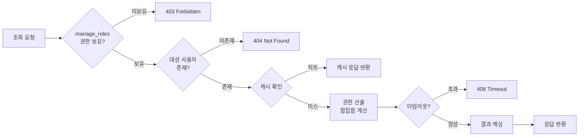

# 관리자 기능정의서

| 항목 | 값 |
|------|---|
| 제품 | AICM (KMS) |
| 문서 코드 | FD-ADM |
| 버전 | 1.4 |
| 작성일 | 2026-03-25 |
| 수정일 | 2026-04-02 |
| 기준 문서 | AICM 새 기능정의서 v1 §7 |

---

## 1. 관리 기능

### 관리 기능 요약 매트릭스

> 모든 관리 영역은 **해당 AdminPermission**으로만 제어된다. 외부 IdP의 사용자 유형 라벨과 묶지 않는다 ([FD-ACL](FD-ACL-권한체계.md) §6 참조).

| § | 관리 영역 | 상세 FD | 필요 권한 | 핵심 규칙 요약 | 주요 API 엔드포인트 |
|---|-----------|---------|----------|---------------|-------------------|
| 1.1 | 게시판 관리 | [FD-DOC](FD-DOC-문서관리.md) §1, §7 | `manage_boards` | `approval_required`·`versioning_enabled` 및 `mandatory_approval_config`·`default_approval_template_id`로 승인·버전 동작 결정 (BR-DOC-006) | `/admin/boards` |
| 1.3 | 템플릿 관리 | [FD-DOC](FD-DOC-문서관리.md) §1.5 | `manage_templates` | 불변 엔티티 + 복제(clone) 방식 수정 | `/admin/templates` |
| 1.4 | 승인 라인 템플릿 관리 | [FD-APR](FD-APR-승인워크플로.md) §2 | `manage_policies` | ApprovalLineTemplate — ANY/ALL/COUNT × 다단계(템플릿·JSONB 단계 구조) | `/admin/approval-policies` |
| 1.5 | 승인 관리 | [FD-APR](FD-APR-승인워크플로.md) §1~§9 | `manage_policies` | 최종 승인 = published + 임베딩, 반려 = draft 복귀 | `/admin/approvals` |
| 1.6 | 공통 컨텐츠 관리 | [FD-DOC](FD-DOC-문서관리.md) §1.6 | `manage_shared_content` | 수정 시 참조 문서 전체 재임베딩 트리거 | `/admin/shared-contents` |
| 1.7 | 임시저장 관리 | [FD-DOC](FD-DOC-문서관리.md) §1.3 | `manage_boards` | 자동 삭제 없음, 수동 정리만 | `/admin/drafts` |
| 1.8 | 임베딩 모니터링 | [FD-EMB](FD-EMB-임베딩파이프라인.md) §1.8 | `manage_system` | published 시에만 임베딩, content_hash 증분 | `/admin/embedding/dashboard` |
| 1.9 | 사용자/그룹 관리 | [FD-ACL](FD-ACL-권한체계.md) §4.3 | `manage_teams` | 합집합 모델, 상위 그룹 역할 자동 상속 | `/admin/users`, `/admin/groups` |
| 1.10 | 역할/권한 관리 | [FD-ACL](FD-ACL-권한체계.md) §4~§6 | `manage_roles` | 마지막 `manage_roles` 보유자 보호(BR-ACL-032) 등 | `/admin/roles` |
| 1.11 | 태그 관리 | [FD-DOC](FD-DOC-문서관리.md) §1.11 | `manage_tags` | 병합 시 소속 문서 태그 자동 교체 | `/admin/tags` |
| 1.12 | 신고 관리 | [FD-COM](FD-COM-커뮤니티.md) §5.4 | `manage_boards` | 사유 5종, 누적 시 자동 블라인드 | `/admin/reports` |
| 1.13 | 검색 튜닝 | [FD-SCH](FD-SCH-검색.md) §6 | `manage_search` | SearchConfig/ParsingConfig 분리, 이벤트 무효화 (BR-SCH-024) | `/admin/search/config` |
| 1.14 | 통계 대시보드 | [FD-AGG](FD-AGG-집계피드.md) §3 | `view_statistics`(또는 정책으로 정한 키) | 가중 스코어 랭킹, 배치/캐시 1시간 주기 | `/admin/aggregation/batch-history` |
| 1.15 | 감사 로그 관리 | [FD-AUD](FD-AUD-감사로그.md) §3 | `view_audit_logs` | 불변 — INSERT만, 보관 하한선 보호 (BR-AUD-003) | `/admin/audit` |
| 1.16 | 시스템 설정 | [FD-SYS](FD-SYS-시스템설정.md) | `manage_system` | SystemConfig·운영 파라미터 관리, 변경 감사 기록 | `/admin/system-config` |
| 1.17 | AI 어시스턴트 관리 | [FD-AI](FD-AI-AI어시스턴트.md) §3 | `manage_prompts` | AICM 직접 관리(PromptSlot/Version) | `/admin/prompt-slots` |
| 1.18 | 시스템 모니터링 | [FD-MON](FD-MON-시스템모니터링.md) | `manage_system` | 3단계 판정, 최악 등급 채택 (BR-MON-002) | `/admin/monitoring/health` |

### 1.1 게시판 관리

> **핵심 BR**: `approval_required`·`versioning_enabled` 및 게시판의 `mandatory_approval_config`·`default_approval_template_id`로 승인·버전 동작 결정 — [FD-DOC](FD-DOC-문서관리.md) BR-DOC-006
> **주요 에러**: 하위 게시판이 있는 게시판 삭제 시도 → 삭제 차단 (`DOC_BOARD_HAS_CHILDREN`)

- 생성, 수정, 삭제, 타입 설정(`knowledge`/`community`), 정렬 순서
- **승인 필요 여부 설정** — `approval_required` ON/OFF, `mandatory_approval_config`(필수 승인자), `default_approval_template_id` ([FD-APR](FD-APR-승인워크플로.md) §1.4.1 참조)
- **수정 시 승인 필요 여부 설정**(`require_approval_on_edit`, 기본값 `true`)
- **허용 템플릿 / 기본 템플릿 설정** — 템플릿 선택은 항상 선택적 ([FD-DOC](FD-DOC-문서관리.md) §1.5 참조)

### 1.3 템플릿 관리

> **핵심 BR**: 불변(immutable) 엔티티 — 수정은 복제(clone) 후 새 버전 생성 — [FD-DOC](FD-DOC-문서관리.md) §1.5

- 템플릿 생성(블록 에디터로 본문 직접 작성), 복제(clone), 비활성 처리
- 기본 본문/태그 편집, 게시판 연결 현황 조회
- 템플릿별 사용 통계(해당 템플릿으로 생성된 문서 수 등)
- 상세: [FD-DOC](FD-DOC-문서관리.md) §1.5 문서 템플릿

### 1.4 승인 라인 템플릿 관리

> ApprovalLineTemplate의 CRUD와 게시판의 `default_approval_template_id`·`mandatory_approval_config` 연계를 관리한다. 승인 건의 처리·이력은 §1.5에서 다룬다.

> **핵심 BR**: 코드 아닌 데이터(템플릿·JSONB 단계)로 제어 — `ANY`/`ALL`/`COUNT` × 다단계 순차 조합(ApprovalLineTemplateStep 구조) — [FD-APR](FD-APR-승인워크플로.md) §2
> **주요 에러**: 진행 중 승인 건이 있는 템플릿 비활성화 시 기존 건은 스냅샷 유지 (`APR_ALREADY_PENDING`)

- 승인 라인 템플릿 CRUD — 단계 구성(ApprovalLineTemplateStep), 승인 유형(`ANY`/`ALL`/`COUNT`)/승인자 설정
- 템플릿 활성/비활성 토글
- 게시판별 기본 템플릿·필수 승인 설정(`mandatory_approval_config`) 연계 관리
- 템플릿별 사용 현황 — 참조 게시판 수, 진행 중 승인 건 수
- 상세: [FD-APR](FD-APR-승인워크플로.md) §1.4.1 승인 엔진

### 1.5 승인 관리

> 승인 건의 조회·처리·이력을 관리한다. 승인 라인 템플릿 자체의 CRUD는 §1.4에서 다룬다.

> **핵심 BR**: 최종 승인 = 즉시 published + 임베딩 실행(BR-APR-013), 반려 = draft 복귀 + 1단계 재시작(BR-APR-011) — [FD-APR](FD-APR-승인워크플로.md)

- 승인 대기 문서 목록 — 단계별 진행 상태 표시
- 승인/반려 처리
- 승인 이력 조회 — 단계별 상세 포함
- 게시판별 승인권자 지정
- 미처리 승인 건 리마인더 설정
- **예약 배포 대기 목록 조회** 및 예약 취소/변경
- 긴급 발행 이력 조회
- 상세: [FD-APR](FD-APR-승인워크플로.md) §1.4

### 1.6 공통 컨텐츠 관리

> **핵심 BR**: 인라인 참조 항상 최신 버전, 수정 시 참조 문서 전체 재임베딩 트리거 — [FD-DOC](FD-DOC-문서관리.md) §1.6

- 공통 컨텐츠 CRUD, 분류별 관리
- 버전 히스토리
- 참조 문서 목록(영향도 분석) — 수정 전 "N개 문서에 영향됩니다" 경고
- 수정 시 재임베딩 상태 모니터링
- 비활성/대체 처리
- 상세: [FD-DOC](FD-DOC-문서관리.md) §1.6 공통 컨텐츠

### 1.7 임시저장 관리

> **핵심 BR**: 자동 삭제 없음 — 수동 정리만 허용, 방치 기준일(`lm:document.draft_stale_days`) 초과 시 알림 — [FD-DOC](FD-DOC-문서관리.md) §1.3

- 전체 드래프트 현황 조회
- 장기 방치 드래프트 목록 조회 및 알림 발송
- 방치 기준 기간 설정
- 자동 삭제 없음 — 수동 정리만
- 상세: [FD-DOC](FD-DOC-문서관리.md) §1.3 자동 저장과 드래프트

### 1.8 임베딩 파이프라인 모니터링

> **핵심 BR**: published 전환 시에만 임베딩 수행, `content_hash` 기반 증분 처리(변경 블록만 재임베딩) — [FD-EMB](FD-EMB-임베딩파이프라인.md) §1

- 임베딩 큐 현황 — 대기/처리중/완료/실패
- 실패 문서 목록 + 수동 재시도
- 대량 재임베딩 진행률
- 평균 처리 시간/큐 적체량 성능 지표
- 워커 수/우선순위 설정 — 유효 범위와 기본값은 [FD-SYS](FD-SYS-시스템설정.md) §3.7 참조
- 상세: [FD-EMB](FD-EMB-임베딩파이프라인.md) §1.8 임베딩 파이프라인 상태 관리

### 1.9 사용자/그룹 관리

> **핵심 BR**: Role이 유일한 권한 경계, Group은 부모-자식 계층 + 상위 역할 자동 상속(합집합, deny 없음) — [FD-ACL](FD-ACL-권한체계.md) §4.3

- **온프렘 환경**: 사용자 CRUD
- **SaaS 환경**: ECP 연동이므로 사용자 조회 위주
- 그룹 CRUD 및 멤버십 관리
- 그룹별 Role(`TeamRole`) 부여 — 그룹·역할 관리는 배포 환경 무관
- 상세: [FD-ACL](FD-ACL-권한체계.md) §4.3 Role과 Group

### 1.10 역할/권한 관리

> **핵심 BR**: 마지막 `manage_roles` 보유자 보호(BR-ACL-032) — [FD-ACL](FD-ACL-권한체계.md) §6. BR-ACL-031은 외부 역할과의 동시 부여 제한을 폐기함.
> **주요 에러**: 마지막 `manage_roles` 보유자의 권한 제거 시도 → `ACL_LAST_ADMIN_PROTECTION`(403)

- Role CRUD — `BoardPermission` + `AdminPermission` 구성
- 그룹별/개인별 Role 할당 관리
- 유효 역할 조회 — 요약 수준 (상세 권한 출처 추적·역조회·시뮬레이션은 §2 참조)
- 역할 할당 현황 대시보드
- Role·UserRole·TeamRole 부여는 [FD-ACL](FD-ACL-권한체계.md)에 따름 — 인가는 AdminPermission만 사용
- 상세: [FD-ACL](FD-ACL-권한체계.md) §4.2–4.6

### 1.11 태그 관리

> **핵심 BR**: 자유 입력 + 자동완성, 병합 시 소속 문서 태그 자동 교체, 문서당 최대 N개(`lm:document.max_tags`) — [FD-DOC](FD-DOC-문서관리.md) §1.11

- 태그 목록 조회 — 사용 건수/생성일, 정렬/검색
- **태그 병합**: 유사/중복 태그를 하나로 통합 (소속 문서 태그 자동 교체)
- 미사용 태그 정리
- 태그 이름 변경
- 상세: [FD-DOC](FD-DOC-문서관리.md) §1.11 태그 관리

### 1.12 신고 관리

> **핵심 BR**: 사유 5종(스팸/부적절/저작권/개인정보 노출/기타), 누적 시 자동 블라인드 — [FD-COM](FD-COM-커뮤니티.md) §5.4

- 접수된 신고 목록, 처리 상태
- 일괄 처리
- 상세: [FD-COM](FD-COM-커뮤니티.md) §5.4 문서 신고

### 1.13 검색 튜닝

> **핵심 BR**: SearchConfig/ParsingConfig 분리 관리, 설정 변경 시 `search.config.updated` 이벤트로 캐시 무효화(BR-SCH-024) — [FD-SCH](FD-SCH-검색.md) §6

- **검색 설정 (SearchConfig)**: 키워드 검색(동의어/불용어/부스팅/필드 가중치/형태소 분석기) + RAG 검색(하이브리드 가중치/리랭킹/유사도/게시판별 RAG 설정)
- **파싱 설정 (ParsingConfig)**: 청킹 전략, 청킹 사이즈, 파싱 파라미터
- **검색 테스트 환경 (Playground)**: 설정 A/B 비교, 배포 전 검증, 검색 로그 리플레이
- **검색 품질 모니터링**: 검색 로그 분석, RAG 품질 지표, 알림
- 상세: [FD-SCH](FD-SCH-검색.md) §2.6

### 1.14 통계 대시보드

> **핵심 BR**: 가중 스코어 기반 인기/트렌딩 랭킹(BR-AGG-001~003), 배치/캐시(Redis) 1시간 주기 갱신 — [FD-AGG](FD-AGG-집계피드.md)

- 일별/주별 문서 등록 수
- 활성 사용자 수
- 검색 키워드 트렌드
- RAG 사용 현황
- 상세: [FD-AGG](FD-AGG-집계피드.md) §3.1

#### 1.14.1 위젯 카탈로그 관리 (관리자)

- 홈 대시보드 위젯 카탈로그 관리 — 위젯 등록/수정/활성화/비활성화/정렬
- 위젯별 노출 조건(게시판 권한·AdminPermission 등 정책으로 정의), 데이터 원천 유형(실시간/배치) 설정
- 프리셋별 기본 위젯 구성 관리
- 비활성화 시 사용자 개인 레이아웃에 저장된 해당 위젯은 자동 미표시 처리
- 권한: `manage_system`
- 상세: [FD-AGG](FD-AGG-집계피드.md) §3.5

#### 1.14.2 위젯 커스터마이징 (개인)

- 사용자는 홈 대시보드 위젯 배치(드래그 앤 드롭), on/off를 개인 설정으로 저장
- 개인 설정은 사용자 귀속 데이터이며 브라우저/기기 간 동기화된다
- 관리자는 카탈로그(제공 가능 위젯)만 관리하며, 개인 레이아웃 값은 대리 변경하지 않는다
- 상세: [FD-AGG](FD-AGG-집계피드.md) §3.2–§3.3

### 1.15 감사 로그 관리

> **핵심 BR**: 불변(immutable) — INSERT만 허용, 보관 기간 컴플라이언스 하한선 이하 하향 불가(BR-AUD-003) — [FD-AUD](FD-AUD-감사로그.md)

- 감사 로그 뷰어 — 필터/검색
- 감사 로그 내보내기 — CSV/JSON
- 보관 정책 설정
- 이상 패턴 알림 설정
- 상세: [FD-AUD](FD-AUD-감사로그.md) §3 조회 및 관리

### 1.16 시스템 설정

> **핵심 BR**: 운영 가변 파라미터는 SystemConfig로 관리하며, 변경 시 before/after diff 감사 기록 — [FD-SYS](FD-SYS-시스템설정.md) §1
> **주요 에러**: 하한선·유효 범위 위반 → `SYS_INVALID_VALUE`(400), 존재하지 않는 `config_key` → `SYS_KEY_NOT_FOUND`(404)

- 서비스 전반의 운영 파라미터(SystemConfig) 관리 — 카테고리별 그룹핑 UI
- **변경 가능 항목**: 파일 업로드 제한, 드래프트 방치 기준일, 인기 스코어 가중치, 트렌딩 기준값, 감사 로그 보관 기간, 워터마크 텍스트, 임베딩 워커 수/재시도, 검색 가중치/파라미터, 청킹 사이즈 등
- **하한선 보호**: 감사 로그 보관 기간 등 컴플라이언스 관련 설정은 정책상 최소값 이하로 하향 불가
- **변경 이력**: 모든 설정 변경은 감사 로그에 before/after 기록 (감사 로그 화면에서 조회)
- 상세: [FD-SYS](FD-SYS-시스템설정.md)

### 1.17 AI 어시스턴트 관리

> **핵심 BR**: AICM이 직접 프롬프트 관리(PromptSlot/PromptVersion), LLM Orchestrator는 모델 라우팅만 담당 — [FD-AI](FD-AI-AI어시스턴트.md) §3

- 프롬프트 편집 — **AICM이 직접 관리** (PromptSlot/PromptVersion 엔티티). 기능별 슬롯 단위로 프롬프트 본문을 편집하고 버전을 관리한다. LLM Orchestrator는 LLM 호출(모델 라우팅)만 담당하며, 프롬프트 비즈니스 로직은 AICM이 소유한다.
- 프롬프트 테스트 — 관리자가 샘플 문서/텍스트로 수정한 프롬프트를 즉시 테스트, 결과 확인 후 저장/적용
- 프롬프트 버전 관리/롤백 — AICM 내부 PromptVersion 이력으로 관리, 이전 버전 롤백 가능
- AI 기능 사용 통계/비용 대시보드
- 테넌트별 AI 사용 쿼터·모델 선택은 **LLM Orchestrator가 관리**
- 상세: [FD-AI](FD-AI-AI어시스턴트.md) §3 프롬프트 관리

### 1.18 시스템 모니터링

> **핵심 BR**: 3단계 상태 판정(healthy/warning/critical), 전체 상태는 개별 서비스 중 최악 등급 채택(BR-MON-002) — [FD-MON](FD-MON-시스템모니터링.md)

- 서비스 헬스 체크(응답시간, 에러율), 큐 모니터링, 스토리지 현황, 동시접속 현황, AI 서비스 상태
- 상세: [FD-MON](FD-MON-시스템모니터링.md)

### 1.19 비기능 요구사항 (관리 영역 공통)

> FD-ADM은 허브 문서이므로, 관리 화면 공통으로 적용되는 비기능 항목을 아래에 정리한다. 도메인별 상세 비기능은 각 FD 문서를 참조한다.

| 항목 | 요구사항 | 참조 |
|------|----------|------|
| 관리 화면 조회 응답 | 목록 조회 2초 이내, 상세 1초 이내 (페이지네이션 기본 적용) | 각 도메인 FD |
| 복잡 산출 예외 | §2 권한 출처 조회 등 깊은 그룹 계층 산출은 별도 타임아웃 적용 — `ADM_PERM_CALC_TIMEOUT`(408) 허용, 2초 목표에서 제외 | §2.5 |
| 동시 수정 제어 | 관리 화면 OCC(낙관적 동시성 제어) 적용 — SystemConfig는 Last-Write-Wins 예외, 조회 전용 화면(§2 권한 출처 조회 등)은 제외 | 결정사항 OCC 행 |
| 감사 로그 | 모든 관리 동작은 감사 로그에 비동기 기록 | [FD-AUD](FD-AUD-감사로그.md) |
| 개인정보 마스킹 | 사용자 목록 조회 시 이메일·전화번호 부분 마스킹 적용 (`manage_teams` 등 정책으로 정한 권한만 전체 표시) | [FD-ACL](FD-ACL-권한체계.md) §6 |
| 페이지네이션 전략 | 커서 기반 페이지네이션 권장 — 대량 데이터 시 오프셋 방식 대비 일관된 성능. 페이지 크기 기본 20건, 최대 100건. 내보내기(CSV)는 제한 없음 | [FD-SYS](FD-SYS-시스템설정.md) |
| 캐싱 지침 | 권한 평가·집계 데이터 등 빈번 조회 결과는 Redis 캐싱 적용, 설정/권한 변경 시 이벤트 기반 무효화 | [FD-ACL](FD-ACL-권한체계.md) §12, [FD-AGG](FD-AGG-집계피드.md) |

### 1.20 관리 기능 관련 주요 이벤트 요약

> 관리자 동작으로 트리거되거나 관리자가 모니터링해야 하는 이벤트 인덱스. 이벤트 페이로드 상세는 각 발행측 FD를 참조한다.

| 관리 영역 | 이벤트명 | 발행 FD | 소비측 | 트리거 |
|-----------|---------|---------|--------|--------|
| 게시판/문서 | `document.published` | [FD-DOC](FD-DOC-문서관리.md) | EMB, SCH, NTF, AGG | 승인 완료 / 직접 게시 |
| 게시판/문서 | `document.suspended` | [FD-DOC](FD-DOC-문서관리.md) | SCH, NTF | 긴급 회수 |
| 게시판/문서 | `document.deleted` | [FD-DOC](FD-DOC-문서관리.md) | SCH, NTF, AGG | 소프트 딜리트 |
| 공통 컨텐츠 | `shared-content.updated` | [FD-DOC](FD-DOC-문서관리.md) | EMB | 공통 컨텐츠 수정 |
| 드래프트 | `draft.stale` | [FD-DOC](FD-DOC-문서관리.md) | NTF | 배치 방치 감지 |
| 사용자/권한 | `acl.role.permissions_updated` | [FD-ACL](FD-ACL-권한체계.md) | 캐시, NTF, SCH | Role 권한 구성 변경 |
| 사용자/권한 | `acl.role.status_changed` | [FD-ACL](FD-ACL-권한체계.md) | 캐시, NTF | Role 비활성화/잠금/활성화 |
| 사용자/권한 | `acl.team.members_updated` | [FD-ACL](FD-ACL-권한체계.md) | 캐시, NTF | 그룹 멤버 추가/제거 |
| 사용자/권한 | `acl.team.status_changed` | [FD-ACL](FD-ACL-권한체계.md) | 캐시, NTF | 그룹 비활성화/활성화 |
| 사용자/권한 | `acl.user_role.updated` | [FD-ACL](FD-ACL-권한체계.md) | 캐시, NTF | 사용자 Role 직접 할당/해제 |
| 사용자/권한 | `acl.board_permission.updated` | [FD-ACL](FD-ACL-권한체계.md) | SCH, 캐시 | 게시판별 권한 변경 |
| 사용자/권한 | `acl.restriction.updated` | [FD-ACL](FD-ACL-권한체계.md) | SCH, EMB | 접근 제한 설정/해제 |
| 검색 | `search.config.updated` | [FD-SCH](FD-SCH-검색.md) | retrieval-service | SearchConfig 저장 |
| 임베딩 | `embedding.completed` | [FD-EMB](FD-EMB-임베딩파이프라인.md) | NTF, AGG | 임베딩 성공 완료 |
| 임베딩 | `embedding.failed` | [FD-EMB](FD-EMB-임베딩파이프라인.md) | NTF, AGG | 임베딩 최종 실패 (DLQ) |
| 임베딩 | `embedding.progress` | [FD-EMB](FD-EMB-임베딩파이프라인.md) | NTF | 대량 재임베딩 진행률 변경 |

---

## 2. 권한 출처 조회

> **FD-ADM 고유 기능** — UC-ADM-16에서 정의된 관리자 전용 기능

### 2.1 기능 개요

특정 사용자의 유효 권한과 그 출처(어떤 Role, 어떤 Group을 통해 부여되었는지)를 한눈에 조회하는 관리자 기능이다. "이 사용자가 왜 이 게시판에 접근 가능한지"를 역추적하여 권한 감사, 디버깅, 조직 개편 시 영향 분석에 활용한다.

**조회 유형**:

| 조회 유형 | 설명 | UC 참조 |
|-----------|------|---------|
| 사용자 기준 권한 출처 | 특정 사용자의 유효 역할·권한과 부여 경로를 조회 | UC-ADM-16 기본 흐름 |
| 게시판 기준 역조회 | 특정 게시판에 접근 가능한 사용자 목록과 권한 수준·출처를 조회 | UC-ADM-16 대안 흐름 |
| 부서 전체 권한 현황 | 특정 그룹(부서) 및 하위 그룹 전체 멤버의 권한 분포를 요약 | UC-ADM-16 대안 흐름 |
| 권한 변경 시뮬레이션 | 역할 제거·그룹 변경 시 영향받는 사용자와 권한 변동을 사전 확인 | UC-ADM-16 대안 흐름 |
| 비정상 권한 감지 | 퇴사자 잔존 권한, 미사용 권한, 과잉 권한 자동 감지·경고 | UC-ADM-16 대안 흐름 |
| 권한 감사 보고서 | 사용자·그룹·게시판 단위 권한 현황을 보고서로 생성·내보내기 | UC-ADM-16 대안 흐름 |

**조회 처리 흐름**:



> **캐싱 전략**: 유효 역할·권한 평가 결과를 Redis에 캐싱한다. TTL은 5분이며, `acl.*` 이벤트(§1.20 참조) 발생 시 영향 사용자의 캐시를 즉시 무효화한다 ([FD-ACL](FD-ACL-권한체계.md) §12 캐싱 전략 참조).

### 2.2 비즈니스 규칙

**[BR-ADM-001] 합집합 산출**
- 사용자의 최종 권한은 `UserRole(직접 할당) ∪ TeamRole(소속 그룹) ∪ TeamRole(상위 그룹 상속)`의 합집합으로 산출한다
- deny(차감) 규칙은 존재하지 않는다 — [FD-ACL](FD-ACL-권한체계.md) §3.4 합집합 모델

**[BR-ADM-002] 비활성 그룹 제외**
- 비활성 그룹을 통한 역할은 최종 권한 합산에서 제외한다
- 출처 목록에 "(비활성)" 표시로 구분하여 참고용으로만 표시한다

**[BR-ADM-003] 비활성 사용자 조회**
- 비활성(퇴사·휴직) 계정 조회 시, 현재 모든 권한이 정지된 상태임을 안내한다
- 마지막 활성 시점의 권한 출처를 참고용으로 표시한다

**[BR-ADM-004] 중복 경로 전체 표시**
- 동일 권한이 여러 경로(개인 할당 + 그룹 상속)를 통해 부여된 경우, 모든 경로를 개별 표시한다
- "이 경로를 제거해도 다른 경로를 통해 권한이 유지됩니다" 안내를 함께 제공한다

**[BR-ADM-005] 대량 결과 요약 처리**
- 게시판 역조회 시 접근 가능 사용자가 시스템 설정 기준을 초과하면, 그룹별 요약을 표시한다
- 전체 목록은 내보내기(CSV)로 제공한다

**[BR-ADM-006] 조회 전용**
- 이 화면에서 직접 권한을 변경할 수 없다
- 변경이 필요하면 그룹 관리(UC-ADM-06) 또는 역할/권한 관리(UC-ADM-14)로 이동한다

### 2.3 API 개요

> REST 엔드포인트와 주요 DTO를 정의한다. 상세 필드·유효성 규칙은 모듈 스펙에서 확정한다.

| 메서드 | 경로 | 요청 | 응답 | 설명 | 관련 조회 유형 |
|--------|------|------|------|------|---------------|
| GET | `/api/admin/users/{userId}/effective-permissions` | — | `EffectivePermissionResponse` | 사용자 기준 권한 출처 조회 | §2.1 사용자 기준 |
| GET | `/api/admin/boards/{boardId}/accessible-users` | `page`, `size` | `BoardAccessibleUsersResponse` | 게시판 기준 역조회 | §2.1 게시판 기준 |
| GET | `/api/admin/groups/{groupId}/permissions-summary` | `includeSubGroups` (boolean) | `GroupPermissionSummaryResponse` | 부서 전체 권한 현황 | §2.1 부서 전체 |
| POST | `/api/admin/permissions/simulate` | `SimulatePermissionChangeRequest` | `SimulationResultResponse` | 권한 변경 시뮬레이션 | §2.1 변경 시뮬레이션 |
| GET | `/api/admin/permissions/anomalies` | `page`, `size` | `AnomalyListResponse` | 비정상 권한 감지 목록 | §2.1 비정상 감지 |
| POST | `/api/admin/permissions/audit-report` | `AuditReportRequest` | `AuditReportJobResponse` | 권한 감사 보고서 생성 (비동기) | §2.1 감사 보고서 |
| GET | `/api/admin/permissions/audit-report/{jobId}` | — | 파일 다운로드 | 보고서 파일 다운로드 | §2.1 감사 보고서 |

**주요 요청/응답 DTO**:

```
[SimulatePermissionChangeRequest]
- targetUserId: UUID — 시뮬레이션 대상 사용자
- changes: PermissionChange[] — 변경 목록
  - action: ENUM('ADD_ROLE', 'REMOVE_ROLE', 'CHANGE_GROUP') — 변경 유형
  - roleId: UUID, NULL — 대상 역할
  - groupId: UUID, NULL — 대상 그룹

[SimulationResultResponse]
- targetUserId: UUID — 대상 사용자
- affectedBoardCount: INTEGER — 권한이 변동되는 게시판 수
- affectedDocumentCount: INTEGER — 영향받는 문서 수 (변동 게시판에 속한 published 문서 총수)
- permissionsAdded: BoardPermissionSummary[] — 새로 부여되는 게시판 권한
- permissionsRemoved: BoardPermissionSummary[] — 제거되는 게시판 권한
- adminPermissionsAdded: string[] — 새로 부여되는 AdminPermission
- adminPermissionsRemoved: string[] — 제거되는 AdminPermission
- warnings: string[] — 경고 메시지 (예: "마지막 역할 관리 권한 제거 시도")

[BoardAccessibleUsersResponse]
- boardId: UUID — 조회 대상 게시판
- totalCount: INTEGER — 접근 가능 사용자 수
- isSummaryMode: BOOLEAN — 대량 결과 그룹 요약 모드 여부 (BR-ADM-005)
- users: AccessibleUser[] | GroupSummary[] — 사용자 목록 또는 그룹 요약
```

### 2.4 데이터 모델

> 아래는 조회 전용 응답 DTO이며 별도 DB 테이블이 아니다. 기반 엔티티(Role, Group, BoardPermission)는 [FD-ACL](FD-ACL-권한체계.md) §3–4에 정의되어 있다.

```
[EffectivePermissionResponse]
- userId: UUID — 조회 대상 사용자
- userStatus: ENUM('active', 'inactive') — 계정 상태
- effectiveRoles: EffectiveRole[] — 유효 역할 목록
- boardPermissions: BoardPermissionSummary[] — 게시판별 최종 권한
- adminPermissions: string[] — 보유 AdminPermission 키 목록

[EffectiveRole]
- roleId: UUID — 역할 ID
- roleName: VARCHAR(100) — 역할 이름
- source: ENUM('USER_ROLE', 'TEAM_ROLE') — 부여 유형
- sourceGroupId: UUID, NULL — TEAM_ROLE인 경우 출처 그룹 ID
- sourceGroupPath: VARCHAR[], NULL — 그룹 계층 경로 (예: ["A사업부", "가팀", "가-1파트"])
- isFromInactiveGroup: BOOLEAN — 비활성 그룹 경유 여부 (BR-ADM-002)

[BoardPermissionSummary]
- boardId: UUID — 게시판 ID
- boardName: VARCHAR(200) — 게시판 이름
- actions: ENUM('VIEW', 'EDIT', 'APPROVE')[] — 보유 권한 목록
- grantedVia: PermissionGrant[] — 권한별 부여 경로 상세

[PermissionGrant]
- roleId: UUID — 권한을 부여한 역할 ID
- roleName: VARCHAR(100) — 역할 이름
- source: ENUM('USER_ROLE', 'TEAM_ROLE') — 부여 유형
- sourceGroupPath: VARCHAR[], NULL — TEAM_ROLE인 경우 그룹 계층 경로
```

### 2.5 에러 코드

| 에러 코드 | HTTP | 트리거 | 사용자 메시지 |
|-----------|------|--------|-------------|
| `ADM_PERM_FORBIDDEN` | 403 | `manage_roles` AdminPermission 미보유 | 권한 출처 조회 권한이 없습니다 |
| `ADM_PERM_USER_NOT_FOUND` | 404 | 존재하지 않는 사용자 ID | 대상 사용자를 찾을 수 없습니다 |
| `ADM_PERM_CALC_TIMEOUT` | 408 | 권한 산출 시간 초과 (깊은 그룹 계층 등) | 권한 정보를 계산 중입니다. 잠시 후 다시 확인하세요 |
| `ADM_PERM_INACTIVE_USER` | 200 | 비활성 계정 조회 (경고, 정상 응답) | 비활성 계정입니다. 참고용 권한 정보입니다 |
| `ADM_PERM_BOARD_OVERFLOW` | 200 | 게시판 역조회 결과가 상한 초과 (경고, 정상 응답) | 결과가 많아 그룹별 요약으로 표시됩니다. 전체 목록은 내보내기를 이용하세요 |

### 2.6 BR↔에러/경고 매핑

| BR-ID | 에러/경고 | HTTP | 코드 | 비고 |
|-------|----------|------|------|------|
| BR-ADM-001 | — | — | — | 합집합 산출 — 응답 `effectiveRoles` 필드에 반영 |
| BR-ADM-002 | — | 200 | — | 비활성 그룹 경유 역할은 `isFromInactiveGroup = true`로 구분, 출처 목록에 "(비활성)" 표시 |
| BR-ADM-003 | 경고 | 200 | `ADM_PERM_INACTIVE_USER` | 비활성 계정 조회 시 참고용 권한 정보 안내 |
| BR-ADM-004 | — | 200 | — | 중복 경로 전체 표시 — 응답 `grantedVia[]` 배열에 개별 경로로 반영 |
| BR-ADM-005 | 경고 | 200 | `ADM_PERM_BOARD_OVERFLOW` | 대량 결과 시 그룹 요약 전환, 전체 목록은 CSV 내보내기 |
| BR-ADM-006 | — | — | — | 조회 전용 — 변경 API 미제공, 관련 화면 링크만 제공 |
| — | 에러 | 403 | `ADM_PERM_FORBIDDEN` | `manage_roles` AdminPermission 미보유 |
| — | 에러 | 404 | `ADM_PERM_USER_NOT_FOUND` | 존재하지 않는 사용자 ID |
| — | 에러 | 408 | `ADM_PERM_CALC_TIMEOUT` | 권한 산출 시간 초과 (깊은 그룹 계층 등) |

### 2.7 필요 권한

- `manage_roles` AdminPermission

### 2.8 관련 문서

| 문서 | 참조 내용 |
|------|----------|
| [FD-ACL](FD-ACL-권한체계.md) §3.4 | 유효 역할과 합집합 모델 |
| [FD-ACL](FD-ACL-권한체계.md) §4 | BoardPermission 구조 |
| [FD-ACL](FD-ACL-권한체계.md) §6 | AdminPermission 키 목록 |
| [UC-ADM-16](../usecases/admin/UC-ADM-조직접근.md#uc-adm-16-권한-출처-조회) | 권한 출처 조회 유즈케이스 |

---

## 결정사항

| 항목 | 결정 | 근거 |
|------|------|------|
| FD-ADM 구조 | 허브(인덱스) 문서로 유지 | 관리 기능이 10+ 도메인 FD에 분산되어 있으므로, FD-ADM은 참조 진입점 역할. 상세 규칙은 각 도메인 FD에서 관리하여 SSoT 유지 |
| 권한 모델 | 합집합(Union) 모델, deny 없음 | 권한 디버깅 복잡도 억제. "왜 접근 가능한지"만 추적하면 되므로 역추적이 단순 — [FD-ACL](FD-ACL-권한체계.md) §3.4 |
| 동시성 제어 | 관리 화면 OCC(낙관적 동시성 제어) 적용 — SystemConfig는 예외(LWW) | UC-ADM 전반에서 "동시 수정 충돌" 처리 공통 적용. SystemConfig는 변경 빈도·관리자 수가 극히 적어 LWW로 단순화 |
| 시스템 모니터링 분리 | FD-MON으로 별도 FD 생성 | UC-ADM-18의 서비스 헬스/큐/스토리지/AI 등 독립 도메인 성격. FD-ADM 허브 취지와 일관 |
| 이벤트 발행 책임 | 발행측 FD에서 정의 | 관리자 동작에서 트리거되는 이벤트(권한 재계산, 재임베딩 등)는 소비 모듈이 아닌 발행 모듈의 FD에서 계약 관리 |
| 감사 로그 기록 방식 | 비동기 처리 | 관리 화면 응답 지연 방지. 감사 이벤트는 큐를 통해 비동기 기록 |
| 공통 페이지네이션 전략 | **커서 기반 페이지네이션** — `cursor_id` + `limit` | 대량 데이터 시 오프셋 방식 대비 일관된 성능. 페이지 크기 기본 20건, 최대 100건. 내보내기(CSV)는 제한 없음 |

---

## 관련 문서

| 문서 | 참조 내용 |
|------|----------|
| [FD-DOC](FD-DOC-문서관리.md) | 게시판, 템플릿, 공통 컨텐츠, 태그, 드래프트 |
| [FD-APR](FD-APR-승인워크플로.md) | 승인 라인 템플릿, 승인 워크플로우, 긴급 발행 |
| [FD-ACL](FD-ACL-권한체계.md) | 역할/권한, 그룹, 유효 역할, AdminPermission |
| [FD-SCH](FD-SCH-검색.md) | 검색 튜닝, RAG 튜닝, Playground |
| [FD-EMB](FD-EMB-임베딩파이프라인.md) | 임베딩 파이프라인 모니터링 |
| [FD-COM](FD-COM-커뮤니티.md) | 신고 관리 |
| [FD-AI](FD-AI-AI어시스턴트.md) | AI 프롬프트 관리, 사용 통계 |
| [FD-AGG](FD-AGG-집계피드.md) | 통계 대시보드, 위젯 카탈로그 |
| [FD-SYS](FD-SYS-시스템설정.md) | SystemConfig 데이터 모델, 10개 설정 카테고리(system~monitoring), 변경 규칙, 하한선 보호 |
| [FD-AUD](FD-AUD-감사로그.md) | 감사 로그 뷰어, 보관 정책 |
| [FD-MON](FD-MON-시스템모니터링.md) | 시스템 헬스, 큐 모니터링, 스토리지, AI 서비스 상태 |
| [FD-EXP](FD-EXP-내보내기.md) | 문서 내보내기(PDF/DOCX/HTML/Markdown), 워터마크 |
| [UC-ADM](../usecases/admin/README.md) | UC-ADM-01 ~ UC-ADM-18 |
