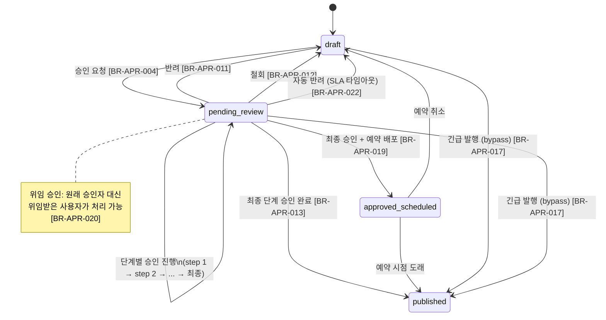

# FD-APR — 승인 워크플로

| 항목 | 값 |
|------|---|
| 제품 | AICM (KMS) |
| 문서코드 | FD-APR |
| 버전 | 1.5 |
| 작성일 | 2026-04-07 |
| 기준 문서 | AICM 새 기능정의서 v1 §1.4 |

---

## 1. 승인 프로세스 개요

작성자가 문서 작성 완료 후 승인 요청 → 승인 정책에 따라 단계별 검토 → 전체 단계 승인 완료 → **승인 = 배포** (검색/RAG 반영 + 임베딩 실행)

승인 모듈은 게시판별 `approval_required`·`mandatory_approval_config` 및 본 문서의 비즈니스 규칙에 따라 동작한다. 다단계 승인, 긴급 발행, 예약 배포, 위임 등은 **표준 기능**으로 제공되며, 게시판 정책(예: `delegation_allowed`, SLA)과 승인 건별 설정으로 세부 동작이 결정된다.

**승인 관점 상태 흐름** — 문서 상태 모델 전체는 [FD-DOC](FD-DOC-문서관리.md) §1(status 5단계)을 참조하며, 여기서는 승인 흐름에 관련된 핵심 전이만 기술한다. 다단계 승인은 `pending_review` 내부에서 진행한다.



---

## 2. 하이브리드 승인 모델 (게시판 필수 설정 + 기안자 주도 결재라인)

### 2.1 개요

**기안자가 결재라인을 자유롭게 구성**하되, **게시판 관리자가 필수 승인자를 지정**하여 조직 통제를 보장하는 하이브리드 모델이다. 승인 ON/OFF와 버전 관리는 게시판별 독립 설정이며, 모든 게시판(루트·하위)에서 개별 설정이 가능하다.

- **기안자 주도**: 기안자가 승인 요청 시 1~N단계 결재라인을 직접 구성하고, 각 단계의 승인자를 특정 개인·역할·팀으로 자유롭게 지정
- **게시판 필수 승인자**: 게시판 관리자가 반드시 포함해야 하는 승인자/단계를 사전 설정 — 기안자가 이를 제거할 수 없음
- **결재라인 템플릿**: 자주 사용하는 결재라인을 템플릿으로 저장하여 재사용 — 기안자가 템플릿을 선택한 뒤 수정 가능
- **상속 + 오버라이드**: 하위 게시판은 상위 게시판의 설정을 상속하되, 필요 시 오버라이드 가능

### 2.2 결재라인 템플릿 (ApprovalLineTemplate)

자주 사용하는 결재라인 패턴을 템플릿으로 저장하여 재사용한다.

- 템플릿에 이름, 설명을 부여하고 활성/비활성 토글 관리
- 게시판에 기본 템플릿을 연결하여 기안자의 초기 결재라인으로 제공 가능
- 기안자는 템플릿을 선택한 뒤 단계 추가·삭제·승인자 변경이 자유로움 (게시판 필수 승인자 제외)
- 템플릿 없이 빈 상태에서 결재라인을 처음부터 구성하는 것도 가능
- **[BR-APR-003]** 템플릿 수정 시 진행 중인 승인 건은 요청 시점의 스냅샷으로 유지 — 템플릿 변경이 진행 중 건에 소급 적용되지 않음
- 템플릿의 SLA/자기승인차단/위임허용 등 정책 옵션은 게시판 설정(`mandatory_approval_config`)으로 이동

### 2.3 기안자 정의 결재 단계

기안자가 승인 요청 시 결재라인을 자유롭게 구성한다.

- 단계별로 이름(예: "팀장 검수", "QA 검토"), 순서, 승인 유형, 승인자를 설정
- **승인 유형 (approval_type)** — **[BR-APR-001]**:
  - `ANY`: 지정된 승인자 중 **1명**이 승인하면 통과
  - `ALL`: 지정된 승인자 **전원**이 승인해야 통과
  - `COUNT`: 지정된 승인자 중 **N명 이상** 승인 시 통과 (정족수)
- **단계 수 제한**: 게시판 설정(`mandatory_approval_config.min_steps`, `max_steps`)으로 최소·최대 단계 수를 제한할 수 있음

### 2.4 승인자 지정 방식 (approver_source)

기안자가 각 단계의 승인자를 지정할 때 3가지 방식을 사용할 수 있다.

| approver_source | 설명 | 예시 |
|----------------|------|------|
| `USER` | **특정 개인을 직접 지정** — 사용자 UUID를 명시 | 김팀장, 이부장 |
| `ROLE` | AICM 내부 역할로 지정 — 해당 역할 + 게시판 APPROVE 권한 보유자가 승인 대상 | `team_leader`, `qa_manager` |
| `TEAM` | 사용자 그룹(팀)으로 지정 — 해당 팀 소속 + 게시판 APPROVE 권한 보유자가 승인 대상 | 운영팀, QA팀 |

- `USER`로 지정 시 해당 사용자가 게시판 `APPROVE` 권한을 보유해야 함 — 미보유 시 승인 요청 시 검증 오류
- `ROLE`/`TEAM`으로 지정 시 해당 역할/팀 + 게시판 `APPROVE` 권한의 교집합이 승인 대상자 풀이 됨
- **`ROLE`/`TEAM` 승인 대상자는 승인 처리 시점에 실시간으로 해결한다** — 승인 요청 시점의 멤버십·역할 스냅샷을 고정하지 않는다. 권한·역할·팀 소속 변경은 다음 승인/반려 액션에 즉시 반영된다.

### 2.5 게시판별 승인 설정

각 게시판(루트·하위 모두)에서 승인과 버전 관리를 독립적으로 설정한다.

| 설정 | 타입 | 기본값 | 설명 |
|------|------|--------|------|
| `approval_required` | BOOLEAN | false | 승인 필요 여부 (yes/no) |
| `versioning_enabled` | BOOLEAN | false | 문서 버전 관리 활성화 여부 (DocumentVersion/BlockSnapshot 생성, Diff 비교) |
| `mandatory_approval_config` | JSONB | null | 게시판 필수 승인자 설정 (§2.6 참조) |
| `default_approval_template_id` | UUID | null | 기본 결재라인 템플릿 — 기안자가 승인 요청 시 초기 결재라인으로 제공 ([board/data.md](../../03-module-design/board/data.md) 명칭과 동일. 문서 본문용 `default_template_id`와 혼동 금지) |

- **`approval_required = true`**: 해당 게시판의 문서는 발행·재발행·삭제 시 승인 절차 필요
- **`approval_required = false`**: 자유 모드 — 승인 없이 직접 발행
- **`versioning_enabled`는 승인과 독립**: 승인 없이 버전 이력만 쌓거나, 승인만 켜고 버전 이력 없이 운영 가능
- `board_type`은 에디터 프로파일에만 영향을 주며, 승인·버전은 위 설정으로 독립 제어한다

| approval_required | versioning_enabled | 모드 | 유즈케이스 |
|:---:|:---:|------|------|
| true | true | 승인 + 버전 관리 | 금융권 규정문서 등 엄격한 관리 |
| true | false | 승인만 (게이트 역할) | 일반 공지 관리자 검수, 커뮤니티 검수 |
| false | true | 자유 발행 + 버전 이력 | 위키형 지식베이스 |
| false | false | 완전 자유 | 자유 게시판, 커뮤니티 |

### 2.6 게시판 필수 승인자 (Mandatory Approval Config)

게시판 관리자가 해당 게시판의 모든 승인 건에 반드시 포함되어야 하는 승인자/단계를 사전 설정한다. **기안자는 필수 승인자를 제거하거나 변경할 수 없다.**

```jsonc
{
  "mandatory_steps": [
    {
      "name": "팀장 승인",
      "approver_source": "ROLE",          // USER, ROLE, TEAM
      "approver_target": "team_leader",   // 역할명, 팀ID, 또는 사용자 UUID 배열
      "approval_type": "ANY",
      "position": "FIRST"                 // FIRST: 반드시 첫 단계, LAST: 반드시 마지막, ANY: 위치 자유(기안자가 배치)
    },
    {
      "name": "준법감시 승인",
      "approver_source": "USER",
      "approver_target": ["uuid-준법감시관"],
      "approval_type": "ALL",
      "position": "LAST"
    }
  ],
  "self_approve_blocked": true,           // 자기 승인 차단 (기본: true)
  "delegation_allowed": true,             // 위임 허용 (기본: true)
  "sla_hours": null,                      // 승인 처리 기한 (null이면 기한 없음)
  "auto_reject_grace_hours": 24,          // SLA 초과 유예 시간
  "min_steps": 1,                         // 기안자 결재라인 최소 단계 수
  "max_steps": 5                          // 기안자 결재라인 최대 단계 수 (null이면 무제한)
}
```

- `position = FIRST`: 기안자가 구성하는 결재라인 맨 앞에 강제 삽입
- `position = LAST`: 기안자 결재라인 맨 뒤에 강제 삽입
- `position = ANY`: 기안자 결재라인 내 임의 위치에 자동 포함 — 기안자가 위치를 조정할 수 있으나 제거는 불가
- 필수 단계가 2개 이상이면 기안자는 그 사이에 추가 단계를 삽입할 수 있음
- `mandatory_approval_config = null`이면 필수 승인자 없음 — 기안자가 완전 자유롭게 결재라인 구성
- **[BR-APR-032]** `mandatory_steps`로 정의된 필수 단계 **개수**가 `max_steps`를 초과하면 게시판 설정 저장 시 검증 오류로 저장을 거부한다 — 기안자가 `min_steps`~`max_steps` 안에 필수 단계를 모두 포함할 수 없는 구성은 허용되지 않는다

### 2.7 상속 및 오버라이드

하위 게시판은 상위 게시판(루트)의 승인 설정을 **상속**하되, 필요 시 **오버라이드**할 수 있다.

- **기본 상속**: 하위 게시판 생성 시 상위의 `approval_required`, `versioning_enabled`, `mandatory_approval_config`를 초기값으로 복사
- **오버라이드**: 하위 게시판 관리자가 자체 설정을 명시적으로 변경 가능
  - 예: 루트는 `approval_required = true` + 2단계 필수, 하위 A는 `approval_required = true` + 3단계 필수, 하위 B는 `approval_required = false`(오버라이드)
- **오버라이드 표시**: 상위와 다른 설정이 있으면 UI에 "상위 설정과 다름" 표시 — 관리자가 일괄 초기화(상위 설정으로 복원) 가능
- **필수 승인자 병합**: 하위 게시판의 `mandatory_approval_config`는 상위를 대체(replace)하며, 상위와 하위의 필수 승인자를 합산(merge)하지 않음 — 오버라이드 시 하위의 설정이 전체를 대체

```
function getApprovalConfig(boardId):
  board = Board.find(boardId)
  if board.approval_required is not null:
    return board                         // 자체 설정 있음 (오버라이드)
  parent = Board.find(board.parent_id)
  return getApprovalConfig(parent.id)    // 상위 설정 상속
```

### 2.8 지원하는 승인 조합 예시

| 게시판 설정 | 기안자 결재라인 | 결과 |
|------------|---------------|------|
| `approval_required = false` | — | 승인 불필요, 바로 발행 |
| 필수 승인자 없음, 기안자 1단계 ANY | 김팀장 1명 | 단일 승인 |
| 필수(팀장, FIRST) + 기안자 1단계 추가 | 팀장 → QA 매니저 | 2단계 순차 |
| 필수(준법감시, LAST) + 기안자 2단계 | 팀장 → QA → 준법감시 | 3단계 순차 |
| 필수 없음, 기안자 1단계 ALL + 3명 지정 | 3명 전원 승인 | 다인 전원 승인 |
| 필수 없음, 기안자 1단계 COUNT(2) + 3명 | 3명 중 2명 | 정족수 |
| 필수(팀장, FIRST) + 필수(부서장, LAST) | 팀장 → 기안자 추가 → 부서장 | 양끝 필수 + 중간 자유 |

### 2.9 자기 승인 차단

게시판의 `mandatory_approval_config.self_approve_blocked` 옵션으로 자기 승인 차단 여부를 제어한다.

- **기본값: `true`(차단)** — 문서 작성자 본인이 승인자 목록에 포함되어 있어도 해당 건에서 자동으로 제외
- `false`로 설정 시 자기 승인이 허용됨 (비규제 환경의 간이 승인용)
- 동작 상세는 §3.3 자기 승인 제외 참조

### 2.10 SLA 및 자동 반려 설정

게시판의 `mandatory_approval_config`에서 승인 처리 기한과 자동 반려를 설정한다.

| 설정 항목 | 필드명 | 타입 | 기본값 | 설명 |
|-----------|--------|------|--------|------|
| 승인 처리 기한 | sla_hours | integer | NULL | NULL이면 기한 없이 승인 대기 유지. 설정 시 해당 시간 내 미처리 건에 자동 반려 적용 |
| 자동 반려 유예 기간 | auto_reject_grace_hours | integer | 24 | SLA 초과 후 추가 유예 시간. 유예 기간 경과 후 자동 반려 실행 |

- SLA를 설정하지 않으면(`NULL`) 자동 반려가 발동하지 않음
- SLA가 설정되면 `sla_hours + auto_reject_grace_hours` 경과 시 자동 반려 (§4.4 참조)
- 리마인더 비율별 단계적 알림(50%, 75%, 100%) 및 상위 에스컬레이션은 향후 확장 (§12 참조)

---

## 3. 승인 요청

- 작성자가 "승인 요청"(발행 제출) 시 **Document API** `POST /documents/:id/submit`으로 제출하고, Document 모듈이 검증 후 **내부적으로** Approval 모듈에 승인 건 생성을 위임한다 — 공개 REST는 [approval/api.md](../../03-module-design/approval/api.md) §연동 계약 참조
- 제출이 성공하면 **직접 구성한 결재라인**(또는 템플릿 기반 결재라인)에 따라 **1단계 승인권자**에게 알림 발송
- **[BR-APR-028]** 승인 요청 시 게시판의 `mandatory_approval_config`에 설정된 **필수 승인자가 결재라인에 포함되었는지 검증** — 누락 시 승인 요청 차단
- **[BR-APR-004]** 승인 요청 시 게시판의 `versioning_enabled = true`이면 **제출 버전**(document_versions, trigger='approval_request') 자동 생성 — 승인권자가 검토할 시점의 문서 내용을 확정 ([FD-DOC](FD-DOC-문서관리.md) §1.1 버전 관리 참조). `versioning_enabled = false`이면 DocumentVersion 미생성
- 승인 요청 시 코멘트(요청 사유, 변경 요약 등) 첨부 가능
- **[BR-APR-005]** 승인 요청 후 작성자는 해당 문서 수정 불가 (수정 필요 시 승인 요청 철회 후 재편집)
- **[BR-APR-006]** `pending_review` 상태에서도 검색/RAG 대상에서 제외 — 승인 전 문서는 외부에 노출되지 않음
- **[BR-APR-007]** **승인 건(Approval) 일회성**: 반려 또는 철회된 승인 건은 확정 상태로 보존, 재요청 시 새 승인 건이 생성됨 — 기존 건의 수정/재사용 없음 (감사 추적 완전성 보장). **일반 제출 경로**에서 문서가 이미 `pending_review`인데 `POST /documents/:id/submit` 등으로 중복 제출을 시도하면 Document Controller가 `APR_ALREADY_PENDING`(409)로 거절한다 — 승인 라이프사이클과 문서 상태의 일관성 유지.
- **[BR-APR-035]** **문서당 활성 승인 건 1건(일반 경로)**: 동일 문서에 대해 `status = pending`인 Approval은 **항상 1건만** 허용한다. **일반 승인·삭제 결재 생성**(Submit 등) 시 기존 pending 건이 있으면 유형(`PUBLISH`/`DELETE`)을 불문하고 신규 건 생성을 차단한다 — ApprovalService(또는 동등 계층)가 `APR_ACTIVE_APPROVAL_EXISTS`(409)를 반환한다. **예외: 긴급 발행(bypass, §7.3)** 은 BR-APR-035를 적용하지 않고, 기존 pending 건을 먼저 시스템에 의해 확정 종료한 뒤 `bypassed` 건을 생성한다(아래 §7.3).
- 위임 설정이 되어 있는 승인자가 있으면, 위임받은 사용자에게도 알림 발송 (§8 참조)

### 3.1 기안자 결재라인 구성

기안자가 승인 요청 시 결재라인을 자유롭게 구성한다.

- **템플릿 사용**: 게시판에 `default_approval_template_id`가 설정되어 있으면 해당 템플릿의 결재라인이 초기값으로 제공됨. 기안자는 이를 수정하여 사용
- **빈 상태 시작**: 템플릿 없이 빈 결재라인에서 직접 단계를 추가하며 구성
- **단계별 설정**: 각 단계에 이름, 승인 유형(ANY/ALL/COUNT), 승인자(USER/ROLE/TEAM)를 지정
- **필수 승인자 자동 포함**: 게시판의 `mandatory_steps`가 있으면 `position` 규칙에 따라 자동 삽입됨 — 기안자 UI에 고정 표시, 삭제/변경 불가
- **단계 수 제약**: `min_steps`~`max_steps` 범위 내에서 단계 수 조정 가능

### 3.2 참조라인 (CC)

승인 요청 시 참조자를 0~N명 추가 가능하다.

- **[BR-APR-009]** CC 대상자는 승인 건의 알림을 받고, 승인 건 내용을 열람하고, 비구속적 코멘트를 남길 수 있음
- CC 대상자에게는 승인/반려 권한 없음 — 의견 참고용으로만 사용
- CC는 승인 건 전체에 대해 걸림 (단계별이 아님) — 모든 단계의 진행 상황을 열람 가능
- 승인/반려/철회 시 CC 대상자에게도 상태 변경 알림 발송
- CC 대상자의 열람 여부(`read_at`) 추적 가능

### 3.3 자기 승인 제외

**[BR-APR-008]** 게시판의 `mandatory_approval_config.self_approve_blocked = true`(기본값)인 경우:

- 승인 요청 시 시스템이 승인자 목록에서 요청자 본인을 자동으로 제외한다
- 요청자 본인이 해당 단계의 **유일한 승인 대상**인 경우, "승인 가능한 승인자가 없습니다" 안내를 표시하고 승인 요청을 진행할 수 없다
- 요청자 제외 후 남은 승인 가능자가 모두 비활성 상태이면, "현재 승인 가능한 승인자가 없습니다. 관리자에게 문의하세요" 안내를 표시하고 운영 관리자에게 "승인자 부재" 알림 발송
- `self_approve_blocked = false`이면 자기 승인이 허용됨

---

## 4. 다단계 승인 흐름

- **단계별 진행**: 1단계 승인 통과 → 자동으로 2단계 승인권자에게 알림 → 2단계 통과 → ... → 최종 단계 통과 → `published`
- **단계별 알림**: 각 단계 통과 시 요청자에게 "N단계 승인 완료" 알림, 다음 단계 승인권자에게 "승인 요청 도착" 알림
- **어느 단계에서든 반려 가능**: 반려 시 전체 승인 건이 반려됨 → `draft` 복귀 → 작성자가 수정 후 1단계부터 재요청

### 4.1 승인 유형별 반려 판정 규칙

**[BR-APR-002]**:

- `ANY`: 지정된 승인자 전원이 반려하면 해당 단계 반려
- `ALL`: 1명이라도 반려하면 해당 단계 즉시 반려
- `COUNT`: 남은 미처리 인원을 모두 합산해도 필요 정족수에 미달하면 즉시 반려 (예: 3명 중 2명 필요, 2명 반려 시 → 최대 승인 가능 수 < 정족수이므로 즉시 반려)

### 4.2 재요청 시 1단계부터 재시작

**[BR-APR-011]** 반려 후 문서 수정·재요청 시 이전 단계 승인이 무효화되어 1단계부터 다시 진행 — 문서 변경으로 이전 단계 검토도 다시 필요하다.

### 4.3 승인 진행 상태 UI

승인 대기 화면에서 "현재 2/3단계 진행 중" 등 진행률을 표시한다.

### 4.4 자동 반려 (타임아웃)

**[BR-APR-022]** 정책에 SLA(`sla_hours`)가 설정된 경우, 승인 처리 기한 초과 시 자동 반려를 실행한다.

- **타임아웃 계산**: **승인 요청 시점(Approval.created_at) 기준** — 건 전체에 단일 SLA를 적용한다. `sla_hours` 경과 후, 추가 유예 기간(`auto_reject_grace_hours`, 기본 24시간) 내에도 미처리 시 자동 반려. 단계별 SLA(단계 진입 시점 기산)는 향후 확장 (§12 참조)
- **자동 반려 실행**: 시스템이 해당 승인 건을 `auto_rejected` 상태로 전환 → 문서 `draft` 복귀
- **알림**: 작성자에게 "승인 기한 초과로 자동 반려되었습니다" 알림 발송, 해당 단계 승인권자에게도 "미처리로 자동 반려됨" 알림 발송
- **감사 로그**: 자동 반려 시 감사 로그에 `approval.auto_rejected` 액션 기록 (반려 사유: "SLA 타임아웃")
- **재요청**: 작성자는 문서를 확인한 뒤 재요청 가능 (1단계부터 재시작)
- **시스템 점검/장애 시**: 시스템 점검(유지보수 모드) 기간 동안 SLA 타이머 일시 정지 — 점검 시간이 SLA에 산입되지 않음. 장애 복구 후 미처리 자동 반려 건을 일괄 처리 — 상세는 **[BR-APR-027]**

---

## 5. 승인 요청 철회

- **[BR-APR-012]** 작성자는 **`pending` 상태의 승인 건**에 한해, 진행 중인 **어느 단계에서든** 승인 요청을 철회할 수 있다 — 승인권자가 이미 검토 중이어도 철회 허용. 이미 승인 완료·반려·자동 반려·긴급 발행(`bypassed`) 등 **확정된 건**은 철회 불가
- 다단계 승인 도중 철회 시: 진행된 단계의 승인 기록은 이력에 보존, 전체 건이 철회 상태로 전환
- 철회 시 승인권자에게 인앱 알림 발송 ("작성자가 승인 요청을 철회했습니다")
- 철회 이력은 승인 이력 테이블에 전부 기록 (감사 추적) — UI에서는 기본 뷰에 최종 승인/반려만 표시, "전체 이력 보기" 토글로 철회 이력 확인
- 철회 시 `pending_review` → `draft` 상태로 복귀 → 작성자가 수정 후 재요청
- 설계 원칙: 금융권 규제는 **기록을 남기는 것**으로 충족 — 행동을 제한하는 것이 아님

---

## 6. 승인/반려 처리

- **[BR-APR-013]** **승인**: 해당 단계 승인권자가 "승인" 처리 → 다음 단계가 있으면 다음 단계로 진행, 최종 단계이면 즉시 `published` 상태 전환 + 정식 버전(document_versions, trigger='approved') 생성 + [FD-EMB](FD-EMB-임베딩파이프라인.md) 임베딩 파이프라인 실행
- **CC `read_at` 갱신**: 도메인 이벤트가 아니라 **Approval API 처리**로 갱신한다. Phase 1 계약은 [approval/api.md](../../03-module-design/approval/api.md) `GET /approvals/:approvalId`(승인 건 상세)에서, 호출자가 해당 건의 CC 대상이고 `read_at`이 비어 있으면 응답 생성 전에 1회 설정하는 방식을 기본으로 한다(멱등). 전용 열람 확인 API를 도입하면 api.md와 동기화한다 — 저장 구조는 [approval/data.md](../../03-module-design/approval/data.md) §2.2 `cc_list`.
- **반려**: 승인권자가 반려 사유 작성 → `draft` 상태로 복귀 → 작성자에게 알림 → 작성자가 수정 후 재요청
- 반려된 문서는 검색에서 제외 상태 유지 (draft이므로)
- 재요청 시 새 제출 버전 생성 — 승인권자가 **이전 제출본 vs 현재 제출본** diff 비교 가능 ("지난번 반려 이후 뭐가 바뀌었는지" 확인)
- 승인/반려 시 코멘트 필수 여부 설정 가능 (반려 시 사유 필수 권장)

### 6.1 관리자 오버라이드

**[BR-APR-014]** 해당 게시판에 대한 충분한 BoardPermission(및 정책으로 정한 AdminPermission) 보유 시 정책 단계의 승인자 지정(approver_target)을 무시하고 모든 단계에서 승인 가능 — 지정된 승인자 부재 시 운영자가 흐름을 진행시키는 비상 수단이다. 오버라이드 사용 시 감사 로그에 별도 기록한다.

**[BR-APR-034]** **관리자 오버라이드와 자기승인 차단**: `mandatory_approval_config.self_approve_blocked = true`(기본)인 게시판에서는 **관리자 오버라이드(BR-APR-014)를 쓰더라도** 관리자가 **본인이 작성(요청)한 문서**를 직접 최종 승인하는 것은 허용하지 않는다. 관리자는 승인 권한을 다른 사용자에게 **위임**하거나, 다른 승인 대상자가 처리하도록 하는 방식으로 흐름을 마무리한다.

### 6.2 일괄 승인/반려

**[BR-APR-016]** 승인권자가 승인 대기 목록에서 여러 건을 선택하여 일괄 처리할 수 있다.

- **일괄 승인**: 대기 목록에서 복수 문서를 선택 → 공통 코멘트 입력(선택) → "일괄 승인" 실행
- **일괄 반려**: 반려 사유를 공통 입력하거나 건별로 다르게 입력 가능
- **순차 처리**: 시스템이 선택된 문서를 순차적으로 승인/반려 처리
- **부분 실패 분리**: 처리 결과를 요약 — 성공 건수, 실패 건수(이미 철회된 건 등), 다음 단계로 넘어간 건수. 실패 건은 개별 재처리 가능
- 각 문서의 작성자에게 개별적으로 알림 발송

### 6.3 동시 처리 규칙

**[BR-APR-015]** 같은 단계를 두 승인권자가 동시에 처리하는 경우:

- 먼저 처리한 쪽의 결과가 반영되고, 나중에 처리한 쪽에는 "이미 처리된 건입니다" 안내 표시
- DB 수준의 optimistic locking으로 정확한 처리 결과를 보장
- 철회와 승인이 동시에 발생하는 경우에도 동일 원칙 적용 — 먼저 완료된 쪽 반영

---

## 7. 긴급 발행 (Bypass)

### 7.1 개요

장애 공지, 긴급 상품 변경 등 승인 절차를 기다릴 수 없는 상황에서 특정 권한자가 승인을 우회하여 즉시 발행한다.

### 7.2 권한

**[BR-APR-017]** `bypass_approval` AdminPermission을 가진 사용자만 수행 가능 — 일반적으로 운영 책임자에게만 부여한다. ([FD-ACL](FD-ACL-권한체계.md) §6 AdminPermission 참조)

### 7.3 긴급 발행 흐름

- 승인 대기 중인 문서 또는 새 문서에 대해 "긴급 발행" 실행
- **[BR-APR-018]** 긴급 발행 사유(bypass_reason) 필수 입력 — **최소 10자 이상** (단순 입력 방지)
- 승인 정책을 우회하여 즉시 `published` 전환 + [FD-EMB](FD-EMB-임베딩파이프라인.md) 임베딩 파이프라인 실행
- 승인 건은 **`status = 'bypassed'`**로 기록하고 **`bypass_reason`**에 사유를 남긴다 (ADR-011: 별도 `is_bypass` 플래그 없음)
- **기존 pending 승인 건이 있는 경우(BR-APR-035 예외)**: 긴급 발행은 **먼저** 해당 pending 건을 시스템에 의해 확정 종료한다 — 전환 상태는 **`cancelled`**로 단정한다(작성자 철회 `withdrawn`과 구분). 감사·이력에 시스템 취소 사유(예: 긴급 발행에 의한 대체)를 남기고, 관련 승인권자에게 알림을 발송한 뒤 **새** 긴급 발행 건을 `bypassed`로 생성한다. 동일 트랜잭션에서 문서 `published` 전환과 정합을 맞춘다.
- **일반 Submit과의 관계**: 문서당 활성 pending 1건 규칙은 **[BR-APR-035]** 가 **일반** 승인·삭제 결재 생성에만 적용된다. Bypass는 긴급 UX를 위해 **기존 pending을 자동 취소**하는 예외 경로이며, 이 경로에서는 `APR_ACTIVE_APPROVAL_EXISTS`로 거절하지 않는다. [approval/api.md](../../03-module-design/approval/api.md) `POST /approvals/bypass` 등 bypass 진입점의 에러·트랜잭션 서술은 본 절과 정합되도록 갱신한다(현재 스펙이 기존 pending 시 `APR_ALREADY_PENDING` 등으로 막는 형태라면 폐기·수정 대상).

**Approval 상태 전이(요약 — bypass 대체)**

| 현재 상태 | 트리거 | 다음 상태 | 설명 |
|-----------|--------|-----------|------|
| pending | bypass 요청 | cancelled | 시스템이 기존 건을 자동 취소한 뒤 새 `bypassed` 건 생성 |

### 7.4 감사 추적

긴급 발행은 감사 로그에 별도 액션(`approval.bypassed`)으로 기록 — 사후 감사에서 빠짐없이 추적 가능하다.

### 7.5 알림

긴급 발행 수행 시 관리자 전원에게 알림 발송 ("OO 문서가 승인 우회로 긴급 발행되었습니다")

### 7.6 사후 검토 (향후 확장)

긴급 발행된 문서에 대한 사후 승인 검토 절차 — 데이터 모델 선설계, 기능 구현은 향후 확장이다.

- **사후 검토 기한**: 긴급 발행 후 N일 이내 사후 승인 완료 요구 — Phase 2에서 `Approval.post_review_deadline`(TIMESTAMPTZ, nullable)를 [approval/data.md](../../03-module-design/approval/data.md) §2.2·§3.2 `Approval`에 **추가**하는 것을 전제로 한 선설계다. **Phase 1 RDB 스키마에는 해당 컬럼이 없으며**, FD 본 문서의 향후 확장 설명과 data.md 현행 정의는 이 점에서 정합된다.
- **사후 승인/반려**: 승인권자가 긴급 발행 문서를 사후 검토하여 승인 또는 반려 처리. 사후 반려 시 문서 `is_suspended` 전환 (FD-DOC 운영 플래그 활용)
- **미완료 알림**: 사후 검토 기한 내 미완료 시 관리자에게 단계별 알림 발송
- Phase 1에서는 긴급 발행 감사 로그 기록까지만 지원하며, 사후 검토 워크플로 자동화는 향후 확장 범위

---

## 8. 승인 위임

### 8.1 개요

**[BR-APR-020]** 승인권자가 부재(휴가, 출장 등) 시 다른 승인 가능자에게 승인 처리를 위임한다. 정책의 `delegation_allowed = true`(기본값)인 경우에만 위임 설정이 가능하다.

### 8.2 위임 설정

- **게시판별 위임**: 승인 권한을 가진 게시판 중 위임할 게시판을 1개 이상 선택 가능 (예: "상품 게시판만 위임, 규정 게시판은 직접 처리")
- **위임 대상자**: 선택한 게시판에 승인 권한(APPROVE)을 가진 사용자 중에서 선택
- **위임 기간**: 시작일 ~ 종료일 지정 필수
- **위임 사유**: 사유 입력 (예: 휴가, 출장)
- **즉시 적용**: 위임 설정 시 해당 게시판에서 이미 대기 중인 승인 건에도 즉시 적용 — 위임 대상자에게 기존 대기 건 알림 발송
- **알림**: 위임 대상자에게 "OO님이 승인 권한을 위임했습니다 (게시판: OO / 기간: YYYY-MM-DD ~ YYYY-MM-DD)" 알림 발송
- **권한 공유**: 위임은 권한 이전이 아닌 **권한 공유** — 위임 기간 중에도 원래 승인권자가 직접 처리 가능

### 8.3 위임 해제

- **[BR-APR-021]** **자동 해제**: 위임 기간 만료 시 시스템이 자동으로 위임 해제 + 원래 승인권자에게 알림
- **조기 해제**: 승인권자가 위임 기간 만료 전에 직접 해제 가능 + 위임 대상자에게 알림
- **대상자 비활성화**: 위임 기간 중 위임 대상자가 퇴사/비활성화되면 위임 자동 해제 + 원래 승인권자에게 알림
- **중복 위임 방지**: 같은 게시판에 이미 유효한 위임이 있는 경우 중복 위임 불가 — 기존 위임 해제 후 재설정 필요

### 8.4 제약 사항

- **재위임 금지**: 위임받은 사용자는 해당 건을 다시 다른 사용자에게 재위임할 수 없다 — 내부통제 체인의 복잡화와 감사 추적 난이도 증가 방지
- **감사 기록**: 위임 설정/해제 이력은 감사 로그에 기록. 위임 대상자가 처리한 승인 건은 "OO(위임자)이 OO(원래 승인자) 대신 처리함"으로 구분 기록
- **독립 관리**: 같은 게시판에 복수 승인자가 동시에 위임 설정 가능 — 각 승인자의 위임은 독립적으로 관리 (A→C, B→D이면 C는 A의 건만, D는 B의 건만 처리)

### 8.5 위임과 자기승인 차단의 교차

**[BR-APR-033]** `mandatory_approval_config.self_approve_blocked = true`(기본)인 게시판에서, **`decide`(승인/반려) 시점**에 **위임받은 사용자가 해당 승인 건의 문서 작성자(요청자)인 경우**, 그 사용자에 대한 **위임은 해당 단계에서 효력이 없다(위임 무효)**. 승인 처리 권한은 **원래 지정된 승인자**(위임자)에게 귀속되며, 원래 승인자가 직접 처리하거나(§8.2 권한 공유), 동일 단계에 다른 유효 승인 대상이 있으면 그 주체가 처리한다. 작성자에게 위임된 권한으로는 해당 건을 승인·반려할 수 없다 — 위반 시 **`APR_DELEGATION_INVALID_SELF_AUTHOR`**. **위임 레코드 생성** 시에는 게시판 단위라 특정 건의 작성자 검증은 하지 않는다([approval/rules.md](../../03-module-design/approval/rules.md) BR-APR-033). 구현 세부는 [approval/data.md](../../03-module-design/approval/data.md)·[approval/api.md](../../03-module-design/approval/api.md)와 맞춘다.

---

## 9. 문서 Diff 비교 UI

- **비교 대상**: 제출 버전(document_versions) 간 비교 — 이전 제출본 vs 현재 제출본, 현재 운영 버전 vs 수정 제출본
- **비교 단위**: 블록 단위 diff — [FD-DOC](FD-DOC-문서관리.md) §2 블록 에디터의 블록 JSON 구조를 활용하여 블록별 추가/삭제/수정 감지
- **표시 모드 (사용자 전환 가능)**:
  - **좌우 비교 (Side-by-side)**: 이전 버전과 현재 버전을 나란히 표시 — 변경된 블록이 시각적으로 정렬, 동기 스크롤
  - **인라인 Diff**: 단일 뷰에서 변경 부분만 하이라이트 — 삭제된 내용은 빨간색 취소선, 추가된 내용은 초록색 배경, 수정된 내용은 노란색 배경
- **변경 요약**: diff 상단에 변경 통계 표시 — "블록 N개 추가, M개 삭제, K개 수정"
- **변경 블록 네비게이션**: "다음 변경" / "이전 변경" 버튼으로 변경된 블록 간 빠른 이동
- ~~**AI 수정 블록 강조**~~: [FD-AI](FD-AI-AI어시스턴트.md) 결정사항에 의해 AI 수정 추적(ai_touched) 기능은 미지원 — 승인 워크플로의 버전 diff로 충분하며, 별도 추적은 과잉으로 판단. 향후 필요 시 확장 검토
- **텍스트 레벨 diff**: 블록 내부 텍스트 변경은 단어/문장 단위로 세밀하게 하이라이트 (블록 구조 변경과 텍스트 변경을 구분)
- **접근 경로**: 승인 검토 화면에서 "변경사항 비교" 버튼 → diff 뷰 진입, 문서 버전 히스토리에서 임의의 두 버전 선택 → 비교
- 관리 모드(PUBLISH 바인딩 존재) 게시판에서만 Diff 비교 가능. 자유 모드에서는 버전 이력이 없으므로 Diff 기능이 비활성화된다.

---

## 10. 승인 이력 관리

- 문서별 승인 요청/승인/반려 이력 전체 추적 — 누가, 언제, 어떤 액션을, 어떤 코멘트와 함께 수행했는지
- 문서 버전(document_versions)과 승인 이력 연동 — 어떤 제출 버전이 승인/반려/철회되었는지 추적 가능
- 위임 승인·관리자 오버라이드·긴급 발행 건은 별도 구분하여 감사 시 식별 용이

---

## 11. 배포 및 운영 문서 수정

### 11.1 배포 (Publish) = 승인 완료

- 승인 즉시 `published` 상태 전환 + 검색 인덱스 갱신(동기) + 벡터 DB 임베딩 작업 큐 발행(비동기)
- 키워드 검색은 즉시 반영, RAG 검색은 임베딩 완료 후 반영 ([FD-EMB](FD-EMB-임베딩파이프라인.md) 참조)

### 11.2 기존 운영 문서 수정 시 승인

- 이미 `published` 상태인 문서를 수정하면 수정본이 별도 `draft` 상태로 생성
- 현재 운영 버전은 그대로 유지 — 승인 완료 시 새 버전으로 교체 (운영 중단 없음)
- 수정 승인 전까지 기존 버전이 검색/RAG에 노출
- **게시판별 수정 시 승인**: `Board.approval_required = true`인 게시판에서는 수정 후 재발행 시에도 승인 절차가 적용된다

### 11.3 예약 배포 (Scheduled Publish)

- **[BR-APR-019]** **개요**: 승인 완료된 문서의 `published` 전환 시점을 미래 특정 일시로 예약 — "승인 = 배포" 원칙의 시간축 확장
- **트리거**: 승인권자가 승인 시 "즉시 배포" 또는 "예약 배포" 선택 → 예약 배포 선택 시 배포 일시(날짜 + 시간) 지정
- **예약 상태**: 승인 완료 + 배포 예약 시 문서 상태는 `published`가 아닌 **`approved_scheduled`** (내부 상태) — 검색/RAG 대상 제외 상태 유지, 예약 시점 도달 시 `published`로 전환
  - `approved_scheduled`는 UI에 "승인됨 · YYYY-MM-DD HH:mm 배포 예정"으로 표시
  - Document.status ENUM의 정규 상태 — `pending_review`와 `published` 사이에서 예약 대기를 표현
- **예약 실행**: 스케줄러(Bull 지연 작업 또는 cron)가 예약 시점에 `published` 전환 + [FD-EMB](FD-EMB-임베딩파이프라인.md) 임베딩 파이프라인 발행
- **예약 취소/변경**: 승인권자 또는 관리자가 예약 배포를 취소하거나 배포 일시를 변경 가능
  - 취소 시 `approved_scheduled` → `draft`로 복귀 (작성자에게 알림)
  - 변경 시 새 배포 일시로 스케줄러 재등록
- **실패 처리**: 스케줄러 장애 등으로 예약 시점에 배포 실패 시 재시도(최대 3회) + 최종 실패 시 관리자에게 알림
- **활용 시나리오**: 규정 변경 시행일에 맞춘 문서 배포, 업무 시간 외 배포 방지 (관리자가 원하는 시점에 배포), 공휴일 전날 사전 승인 후 시행일 자동 배포
- **승인 없는 게시판과의 관계**: `approval_required = false` 게시판에서의 예약 게시는 승인 워크플로를 거치지 않으며, `Document.scheduled_publish_at` 필드로 처리한다 ([FD-DOC](FD-DOC-문서관리.md) §1 참조). DocumentModule이 `scheduled-publish` 큐에 직접 delayed job을 등록하며, 실패 처리(재시도·관리자 알림)는 본 §11.3과 동일한 정책을 적용한다

### 11.4 삭제 요청 결재 (type = DELETE)

**[BR-APR-031]** `Board.approval_required = true`인 게시판에서 **이미 `published`인 문서**를 삭제하려 할 때, 즉시 소프트 딜리트하지 않고 **삭제 요청 결재**를 진행한다.

- 시스템은 `Approval.type = 'DELETE'`인 승인 건을 생성하고, 발행 승인(`PUBLISH`)과 동일한 다단계·다인 승인 정책을 재사용할 수 있다.
- 삭제 요청이 **`pending`인 동안 문서는 `published`를 유지**하며 검색·RAG에 노출된다 — 별도 `pending_delete` 문서 상태는 두지 않고, 진행 중인 DELETE 승인 건 존재 여부로 삭제 요청 상태를 판단한다 ([approval/data.md](../../03-module-design/approval/data.md) §2.2).
- **최종 승인** 시 문서에 소프트 딜리트(`deleted_at` 설정)가 적용된다. **반려** 시 문서는 현상 유지. **철회** 시에도 문서는 현상 유지.
- 작성자는 결재라인 구성·참조(CC)·위임 등 발행 승인과 동일한 UX 흐름으로 삭제 요청을 제출한다 — HTTP 진입점은 문서 삭제 요청 API가 Document 모듈에서 오케스트레이션하고, 내부적으로 Approval 생성을 호출하는 패턴으로 [approval/api.md](../../03-module-design/approval/api.md)와 맞춘다.
- **[BR-APR-035]** 발행 승인(`PUBLISH`)이 이미 `pending`인 동안 동일 문서에 삭제 승인(`DELETE`)을 동시에 둘 수 없다(역도 마찬가지). 문서당 활성 pending은 1건만 허용된다.

---

## 12. 에스컬레이션 및 SLA 고도화 (향후 확장)

Phase 1에서는 SLA 타임아웃 기반 자동 반려(§4.4)까지만 지원한다. 아래 기능은 데이터 모델 선설계 후 향후 확장한다.

### 12.1 단계별 리마인더

SLA 기한의 일정 비율(50%, 75%, 100%) 경과 시 승인권자에게 자동 리마인더 발송 — 리마인더 비율은 관리자가 정책별 또는 시스템 전체로 설정 가능.

### 12.2 상위 에스컬레이션

SLA 100% 경과 시 해당 게시판의 운영 관리자에게 자동 이관 알림 발송 — 관리자가 대리 승인 또는 승인자 독려 조치 수행.

### 12.3 수동 리마인더

작성자가 승인 대기 중인 문서에서 "승인 촉구" 버튼으로 승인권자에게 수동 리마인더 발송 — 같은 단계에서 최소 간격(예: 1일) 제한.

---

## 엔티티 통합 스키마

승인 도메인 RDB 엔티티·필드·제약의 **단일 출처(SSoT)**는 [approval/data.md](../../03-module-design/approval/data.md)이다. FD에서는 비기능·시나리오 맥락용으로 엔티티명과 data.md와 동일한 **핵심 필드명**만 요약한다. DDL·JSONB 상세·인덱스는 data.md §2·§3 및 [rdb.md](../../02-architecture/data/aicm/rdb.md)를 참조한다.

| 엔티티 | 역할 | 핵심 필드 (data.md와 동일 명칭) |
|--------|------|----------------------------------|
| **ApprovalLineTemplate** | 결재라인 템플릿 | `name`, `description`, `steps`(JSONB), `is_active`, `created_by` |
| **Approval** | 승인 건(발행·삭제 요청 공통) | `document_id`, `document_version_id`, `template_id`, **`type`** (`PUBLISH` \| `DELETE`), `current_step`, `total_steps`, `requester_id`, **`status`** (`pending`, `approved`, `rejected`, `withdrawn`, `auto_rejected`, **`cancelled`** — 기존 pending을 긴급 발행이 대체할 때 시스템 확정, `bypassed` — 긴급 발행 건 본문은 **`bypassed` + `bypass_reason`**, ADR-011에 따라 **`is_bypass` 없음**), `comment`, **`cc_list`**(JSONB), `scheduled_at`, `bull_job_id` — **Phase 2** 사후 검토용 `post_review_deadline`은 §7.6·data.md 반영 시점에 추가 |
| **ApprovalStepResult** | 요청 시점 결재라인 스냅샷(단계) | `approval_id`, `step_order`, `name`, `approval_type`, `required_count`, `approver_source`, `approver_target`, `is_mandatory`, `status`, `completed_at` |
| **ApprovalDecision** | 단계별 승인자 개별 판단 | `step_result_id`, `approver_id`, `decision`, `comment`, `is_delegated`, `delegated_from_id`, `is_override` |
| **ApprovalHistory** | 건 단위 감사 이력(append-only) | `approval_id`, `actor_id`, `action`, `step_order`, `comment` — `submitted`, `step_approved`, `bypassed`, `delete_submitted` 등 ([data.md](../../03-module-design/approval/data.md) §2.5) |
| **ApprovalDelegation** | 게시판 단위 위임 | `delegator_id`, `delegate_id`, `board_id`, `start_date`, `end_date`, `reason`, `is_active` |

**CC(참조라인)**는 별도 테이블이 아니라 **`Approval.cc_list` JSONB**에 저장한다 (`user_id`, `comment`, `read_at` 등 — data.md §2.2).

---

## 비즈니스 규칙 카탈로그

**번호 관리**: BR-APR-001~035가 아래 표에서 **번호 순**으로 배열되어 있다. **BR-APR-010**만 역사적 이유로 규칙 본문이 "(삭제)" 행으로 남아 있으며, 실질 내용은 기안자 주도 결재라인 모델에 흡수되었다(번호 공백·예약).

| BR-ID | 규칙명 | 트리거 | 조건 → 동작 | 참조 섹션 |
|-------|--------|--------|-------------|-----------|
| BR-APR-001 | 승인 유형별 통과 판정 | 승인 액션 발생 | ANY: 1명 승인 → 통과 / ALL: 전원 승인 → 통과 / COUNT: N명 이상 → 통과 | §2.3 |
| BR-APR-002 | 승인 유형별 반려 판정 | 반려 액션 발생 | ANY: 전원 반려 → 반려 / ALL: 1명 반려 → 즉시 반려 / COUNT: 최대 승인 가능 < N → 즉시 반려 | §4.1 |
| BR-APR-003 | 템플릿 변경 비소급 | 템플릿 수정 | 진행 중 건은 요청 시점 결재라인으로 유지, 소급 적용 금지 | §2.2 |
| BR-APR-004 | 제출 버전 자동 생성 | 승인 요청 | versioning_enabled=true → document_versions 자동 생성 (trigger='approval_request') | §3 |
| BR-APR-005 | 승인 대기 문서 수정 잠금 | 승인 요청 후 | pending_review 상태 → 문서 수정 불가, 철회 후 재편집 | §3 |
| BR-APR-006 | 승인 전 문서 검색 제외 | 상태 조회 | pending_review → 검색/RAG 대상 제외 | §3 |
| BR-APR-007 | Approval 일회성 | 반려/철회 후 재요청 | 기존 건 확정 보존, 새 Approval 생성. 문서가 이미 `pending_review`인데 제출 재시도 시 `APR_ALREADY_PENDING` | §3 |
| BR-APR-008 | 자기 승인 제외 | 승인 요청 | mandatory_approval_config.self_approve_blocked=true → 요청자 본인 자동 제외. 유일 승인자이면 요청 차단 | §3.3 |
| BR-APR-009 | CC 권한 제한 | CC 대상자 액션 | 열람 + 비구속적 코멘트만 가능, 승인/반려 불가 | §3.2 |
| BR-APR-010 | (삭제 — 기안자 주도 모델로 통합) | — | 기안자가 결재라인 전체를 자유 구성하므로 별도 승인자 선택 제어 불필요 | §3.1 |
| BR-APR-011 | 재요청 시 1단계 재시작 | 반려 후 재요청 | 이전 단계 승인 무효 → 1단계부터 재진행 | §4.2 |
| BR-APR-012 | 철회 허용 범위 | 작성자 철회 요청 | `pending` 상태의 어느 단계에서든 철회 가능(검토 중이어도 허용). 이미 승인 완료·반려·자동 반려·`bypassed` 등 확정된 건은 철회 불가. 이력 보존 | §5 |
| BR-APR-013 | 최종 승인 = 배포 | 최종 단계 승인 완료 | 즉시 published + 정식 버전 생성 + 임베딩 파이프라인 실행 | §6 |
| BR-APR-014 | 관리자 오버라이드 | 관리자 승인 | 해당 게시판에 대한 충분한 BoardPermission(및 정책으로 정한 AdminPermission) 보유 시 approver_target 무시하고 전 단계 승인 가능, 감사 기록. 자기승인 차단과의 관계는 BR-APR-034 | §6.1 |
| BR-APR-015 | 동시 처리 충돌 | 동시 승인/반려 | 먼저 처리한 쪽 반영 (optimistic locking) | §6.3 |
| BR-APR-016 | 일괄 승인/반려 | 복수 건 선택 | 순차 처리, 부분 실패 분리, 개별 알림 | §6.2 |
| BR-APR-017 | 긴급 발행 권한 | 긴급 발행 실행 | `bypass_approval` AdminPermission 필수 | §7.2 |
| BR-APR-018 | 긴급 발행 사유 검증 | 사유 입력 | 최소 10자 이상 필수 | §7.3 |
| BR-APR-019 | 예약 배포 | 승인 시 예약 선택 | approved_scheduled 중간 상태 → 예약 시점에 published 전환 | §11.3 |
| BR-APR-020 | 승인 위임 | 위임 설정 | 게시판별 위임, 기간 지정, delegation_allowed=true인 정책에서만 가능 | §8 |
| BR-APR-021 | 위임 자동 해제 | 기간 만료/비활성화 | 기간 만료 또는 대상자 비활성 시 자동 해제 + 알림 | §8.3 |
| BR-APR-022 | 자동 반려 (타임아웃) | SLA 초과 | sla_hours + auto_reject_grace_hours 경과 → 자동 반려 | §4.4 |
| BR-APR-023 | 승인 필요 여부 판별 | 게시판 설정 조회 | `Board.approval_required == true` → 승인 필요. 모든 게시판(루트·하위)에서 개별 설정, 하위는 상위 상속 + 오버라이드 가능 | §2.5 |
| BR-APR-024 | 승인 요청 필수 필드 검증 | 승인 요청 | 문서 제목·본문 등 필수 항목 미입력 → 승인 요청 차단. 검증 대상은 게시판별 필수 필드 설정에 따름 | §3 |
| BR-APR-025 | 승인 권한 검증 | 승인/반려 액션 | 해당 단계의 승인 대상자(approver_target 역할 + 게시판 APPROVE 권한) 또는 관리자 오버라이드(BR-APR-014) 외 사용자 → 액션 차단 | §6 |
| BR-APR-026 | 상태 전제 조건 검증 | 승인/반려 액션 | Approval.status가 pending이 아니거나, 해당 단계가 현재 활성 단계가 아니면 → 액션 차단 | §4 |
| BR-APR-027 | 유지보수 모드 SLA 정지 | 시스템 점검(유지보수 모드) | 점검 기간 동안 SLA 타이머 일시 정지 — 점검 시간이 SLA에 산입되지 않음 | §4.4 |
| BR-APR-028 | 필수 승인자 검증 | 승인 요청 | 기안자 결재라인에 게시판 mandatory_steps 전체가 포함되었는지 검증. 누락 시 요청 차단 | §2.6 |
| BR-APR-029 | 결재라인 단계 수 검증 | 승인 요청 | 기안자 결재라인 단계 수가 min_steps~max_steps 범위 내인지 검증 | §2.6 |
| BR-APR-030 | 승인자 권한 사전 검증 | 승인 요청 | USER 지정 승인자가 해당 게시판 APPROVE 권한을 보유하는지 검증. 미보유 시 요청 차단 | §2.4 |
| BR-APR-031 | 삭제 요청 결재 | published 문서 삭제(승인 필수 게시판) | `Approval.type = DELETE`로 결재 진행. pending 중 문서는 published 유지. 최종 승인 시 소프트 딜리트 | §11.4 |
| BR-APR-032 | 필수 단계 수 vs max_steps | 게시판 설정 저장 | `mandatory_steps` 개수가 `max_steps`를 초과하면 저장 검증 오류 | §2.6 |
| BR-APR-033 | 위임·작성자 교차 시 위임 무효 | **`decide` 경로** 승인 대상 판별 | 위임받은 사용자가 해당 건의 문서 작성자(요청자)이면 해당 단계에서 위임 무효 → 원래 지정 승인자가 처리. 위임 **생성** 시에는 건별 작성자 검증 없음. 위반 시 `APR_DELEGATION_INVALID_SELF_AUTHOR` | §8.5 |
| BR-APR-034 | 관리자 오버라이드와 자기승인 차단 | 관리자 승인 | self_approve_blocked=true여도 관리자가 본인 작성 문서를 직접 최종 승인하는 것은 불가(`APR_SELF_APPROVE_BLOCKED`). 위임 등으로 다른 주체가 처리 | §6.1 |
| BR-APR-035 | 문서당 활성 승인 건 유일 | 승인/삭제 승인 요청 생성 | 동일 document에 pending Approval이 있으면 유형(PUBLISH/DELETE) 불문 신규 요청 차단. **긴급 발행(bypass)은 예외**(§7.3) | §3, §7.3, §11.4 |

---

## 에러 코드 카탈로그

**409 중복·활성 건 계층**: `APR_ALREADY_PENDING`과 `APR_ACTIVE_APPROVAL_EXISTS`는 통합하지 않고 **검증 계층**으로 구분한다. (1) 문서 상태가 이미 `pending_review`인데 제출 API가 다시 호출되면 Document Controller가 `APR_ALREADY_PENDING`을 반환한다. (2) DB·도메인 관점에서 동일 문서에 `pending` Approval이 존재하는데 신규 건 생성이 시도되면 ApprovalService(또는 동등 계층)가 `APR_ACTIVE_APPROVAL_EXISTS`를 반환한다. 실무에서는 (1) 이후 (2)가 호출되지 않도록 오케스트레이션하는 것이 일반적이다.

| 에러 코드 | HTTP | 설명 | 관련 BR |
|-----------|------|------|---------|
| APR_ALREADY_PENDING | 409 | 문서가 이미 `pending_review`인데 승인 제출(Submit 등) 재시도 — Document Controller | BR-APR-007 |
| APR_ACTIVE_APPROVAL_EXISTS | 409 | 동일 문서에 활성(`pending`) 승인 건이 이미 있어 **일반 경로**에서 신규 건 생성 불가 — ApprovalService(유형 PUBLISH/DELETE 불문). Bypass(§7.3)는 예외 | BR-APR-035 |
| APR_SELF_APPROVE_BLOCKED | 403 | 자기 승인 차단으로 승인 요청·최종 승인 불가(유일 승인자 등). **관리자 오버라이드(BR-APR-014)를 써도 본인 작성 문서를 직접 최종 승인하는 것은 허용하지 않음(BR-APR-034)** | BR-APR-008, BR-APR-034 |
| APR_NO_ELIGIBLE_APPROVER | 422 | 해당 단계에 승인 가능한 승인자 없음 | BR-APR-008 |
| APR_ALREADY_PROCESSED | 409 | 이미 처리된 승인 건에 중복 처리 시도 | BR-APR-015 |
| APR_ALREADY_COMPLETED | 409 | 이미 승인 완료된 건에 철회 시도 | BR-APR-012 |
| APR_DOCUMENT_LOCKED | 423 | 승인 대기 중인 문서 수정 시도 | BR-APR-005 |
| APR_REQUIRED_FIELDS_MISSING | 422 | 문서 필수 항목 미입력 상태에서 승인 요청 | BR-APR-024 |
| APR_NO_APPROVE_PERMISSION | 403 | 승인 권한 없는 사용자의 승인/반려 시도 | BR-APR-025 |
| APR_BYPASS_NO_PERMISSION | 403 | 긴급 발행 권한 없는 사용자의 긴급 발행 시도 | BR-APR-017 |
| APR_BYPASS_REASON_TOO_SHORT | 422 | 긴급 발행 사유 10자 미만 | BR-APR-018 |
| APR_SCHEDULE_PAST_TIME | 422 | 예약 배포 시간이 현재 시각 이전 | BR-APR-019 |
| APR_DELEGATION_DUPLICATE | 409 | 같은 게시판에 이미 유효한 위임 존재 | BR-APR-020 |
| APR_REDELEGATION_BLOCKED | 403 | 위임받은 사용자의 재위임 시도 | BR-APR-020 |
| APR_DELEGATION_NOT_ALLOWED | 403 | 정책에서 위임 미허용 (delegation_allowed=false) | BR-APR-020 |
| APR_DELEGATION_INVALID_SELF_AUTHOR | 403 | 위임받은 사용자가 해당 건의 문서 작성자(요청자)인 경우 해당 단계에서 위임 무효 — 승인/반려 시도 차단 | BR-APR-033 |
| APR_NOT_IN_REVIEW | 422 | 검토 대기 상태가 아닌 문서에 승인/반려 시도 | BR-APR-026 |
| APR_MANDATORY_STEPS_MISSING | 422 | 게시판 필수 승인자(mandatory_steps)가 결재라인에 누락 | BR-APR-028 |
| APR_STEP_COUNT_OUT_OF_RANGE | 422 | 결재라인 단계 수가 min_steps~max_steps 범위를 벗어남 | BR-APR-029 |
| APR_APPROVER_NO_PERMISSION | 422 | USER 지정 승인자가 게시판 APPROVE 권한 미보유 | BR-APR-030 |

---

## 이벤트 계약

approval 모듈이 발행하는 도메인 이벤트 목록이다. 이벤트는 발행측(approval)에서 정의하며, 소비 모듈은 이벤트를 구독하여 후속 처리를 수행한다. 감사 로그는 이벤트를 비동기로 수집한다.

| 이벤트명 | 발행 조건 | 주요 페이로드 | 소비 모듈 | 동기/비동기 |
|----------|-----------|--------------|-----------|-------------|
| `approval.submitted` | 승인 요청 생성 | **schemaVersion: 1**, approval_id, document_id, requester_id, policy_snapshot, step_count | NTF (알림), AUD (감사) | 비동기 |
| `approval.step.approved` | 중간 단계 승인 완료 | **schemaVersion: 1**, approval_id, step_order, actor_id, is_delegated, next_step_order | NTF (알림), AUD (감사) | 비동기 |
| `approval.step.rejected` | 단계 반려 | **schemaVersion: 1**, approval_id, step_order, actor_id, comment | NTF (알림), AUD (감사) | 비동기 |
| `approval.approved` | 최종 승인 완료 | **schemaVersion: 1**, approval_id, document_id, document_version_id, actor_id | EMB (임베딩 큐 발행), NTF (알림), AUD (감사) | 비동기 (임베딩은 별도 큐) |
| `approval.rejected` | 최종 반려 확정 | **schemaVersion: 1**, approval_id, document_id, requester_id, comment | NTF (알림), AUD (감사) | 비동기 |
| `approval.withdrawn` | 작성자 철회 | **schemaVersion: 1**, approval_id, document_id, requester_id | NTF (알림), AUD (감사) | 비동기 |
| `approval.auto_rejected` | SLA 타임아웃 자동 반려 | **schemaVersion: 1**, approval_id, document_id, sla_hours, grace_hours | NTF (알림), AUD (감사) | 비동기 |
| `approval.bypassed` | 긴급 발행 | **schemaVersion: 1**, approval_id, document_id, actor_id, bypass_reason | EMB (임베딩 큐 발행), NTF (알림), AUD (감사) | 비동기 (임베딩은 별도 큐) |
| `approval.cancelled` | bypass 시 기존 pending 시스템 취소 | **schemaVersion: 1**, approval_id, document_id, cancelled_by(`system`), reason(`bypass`), new_bypass_approval_id, trace_id | NTF (알림), AUD (감사) | 비동기 |
| `approval.scheduled` | 예약 배포 설정 | **schemaVersion: 1**, approval_id, document_id, scheduled_publish_at | NTF (알림), AUD (감사) | 비동기 |
| `approval.delegated` | 위임 설정 | **schemaVersion: 1**, delegation_id, delegator_id, delegate_id, board_id, period | NTF (알림), AUD (감사) | 비동기 |
| `approval.delegation.released` | 위임 해제 | **schemaVersion: 1**, delegation_id, release_reason (만료/수동/비활성화) | NTF (알림), AUD (감사) | 비동기 |

### 이벤트 전송 상세

| 항목 | 값 |
|------|---|
| 전송 채널 | NestJS EventEmitter (Best-effort 티어) — [비동기 처리 아키텍처](../../02-architecture/05-async-event-architecture.md) §6.5 참조 |
| 임베딩 큐 | `embedding` (BullMQ) — `approval.approved`, `approval.bypassed` 시 DocumentModule이 `embedding` 큐에 Job 등록 |
| 예약 배포 큐 | `scheduled-publish` (BullMQ) — `approval.scheduled` 시 지연 Job 등록 |
| 알림 큐 | NTF 모듈이 EventBus 이벤트를 수신 후 내부 `notification` 큐(BullMQ)에 발송 Job 등록 |
| 재시도 정책 | BullMQ 큐: 지수 백오프 최대 3회 (5s → 10s → 20s), 최종 실패 시 DLQ 이동. EventBus 이벤트: best-effort (재시도 없음, 소비자 측 보상) |
| 멱등 키 | `{event_name}:{approval_id}:{step_order}` — 소비자가 동일 이벤트 중복 수신 시 멱등 처리에 사용. 모든 이벤트 페이로드에 `traceId`(OpenTelemetry)를 포함하여 end-to-end 추적 |
| 이벤트 스키마 호환성 | 필드 추가는 자유, 필드 제거·타입 변경 시 새 이벤트명 도입 — [비동기 처리 아키텍처](../../02-architecture/05-async-event-architecture.md) §6.4 이벤트 버전 관리 참조 |

---

## API DTO 스키마

FD 수준의 REST API 요청/응답 DTO 개요이다. 필드 검증 상세·페이지네이션·에러 코드 전체는 [approval/api.md](../../03-module-design/approval/api.md)를 참조한다 (NestJS 글로벌 프리픽스 적용 시 경로에 `/api` 접두).

### 문서 제출(승인 요청 생성) — Document API 소관

**기안자가 승인 요청(발행 제출)을 시작하는 공개 HTTP 진입점은 Approval 모듈이 아니라 Document 모듈이다.** 클라이언트는 **`POST /documents/:id/submit`**(실제 배포 시 `/api` 접두)을 호출하고, **Document Controller**가 요청 본문·문서 상태·권한을 검증한 뒤 **내부적으로** `ApprovalService.createApproval(...)`(또는 동등한 애플리케이션 서비스)를 호출하여 승인 건을 생성한다 — ADR-011 A-2, [approval/api.md](../../03-module-design/approval/api.md) §연동 계약(Document ↔ Approval).

**Request Body** 의미(요약 — 필드명·검증은 [document/api.md](../../03-module-design/document/api.md) Submit 및 api.md `CreateApprovalInternalDto`와 동일):

| 필드 | 타입 | 필수 | 설명 |
|------|------|:----:|------|
| comment | string | ○ | 요청 코멘트 (변경 요약 등) |
| ccUserIds | string[] | ○ | 참조라인 대상자(0~N) — 내부 매핑 후 `Approval.cc_list` |
| templateId | string | ○ | 사용한 결재라인 템플릿 ID |
| steps | object[] | ● | 기안자가 구성한 결재라인(필수 승인자 단계 포함) |
| steps[].name | string | ● | 단계 이름 |
| steps[].approvalType | enum | ● | `ANY`, `ALL`, `COUNT` |
| steps[].requiredCount | integer | ○ | COUNT 유형 시 정족수 |
| steps[].approvers | object[] | ● | 승인자 목록 |
| steps[].approvers[].type | enum | ● | `USER`, `ROLE`, `TEAM` |
| steps[].approvers[].id | string | ● | 사용자 UUID, 역할명, 또는 팀 ID |

**Response** (`201 Created` — Submit 응답; api.md `CreateApprovalInternalResult`와 정합):

| 필드 | 타입 | 설명 |
|------|------|------|
| approvalId | string | 생성된 승인 건 ID |
| status | string | `pending` |
| currentStepOrder | number | 1 |
| documentVersionId | string \| null | versioning_enabled 시 제출 버전 ID |

### 승인/반려 처리 (Decide)

`POST /api/approvals/:approvalId/steps/:stepOrder/decide`

**Request Body**:

| 필드 | 타입 | 필수 | 설명 |
|------|------|:----:|------|
| action | enum | ● | `approve` 또는 `reject` |
| comment | string | 반려 시 ● | 승인/반려 코멘트. 반려 시 필수 여부는 정책 설정에 따름 |

**Response** (`200 OK`):

| 필드 | 타입 | 설명 |
|------|------|------|
| approval_id | UUID | 승인 건 ID |
| step_order | integer | 처리한 단계 |
| step_status | string | 단계 결과 (`approved`, `rejected`, `pending`) |
| approval_status | string | 건 전체 상태 (`pending`, `approved`, `rejected`) |
| next_step_order | integer \| null | 다음 단계 (최종 승인 또는 반려 시 null) |
| scheduled_publish_at | string \| null | 예약 배포 시 ISO 8601 일시 |

### 철회 (Withdraw)

`POST /api/approvals/:approvalId/withdraw`

**Request Body**:

| 필드 | 타입 | 필수 | 설명 |
|------|------|:----:|------|
| comment | string | ○ | 철회 사유 |

**Response** (`200 OK`):

| 필드 | 타입 | 설명 |
|------|------|------|
| approval_id | UUID | 철회된 승인 건 ID |
| status | string | `withdrawn` |

### 긴급 발행 (Bypass)

`POST /api/approvals/bypass`

**Request Body**:

| 필드 | 타입 | 필수 | 설명 |
|------|------|:----:|------|
| document_id | UUID | ● | 대상 문서 |
| bypass_reason | string | ● | 긴급 발행 사유 (최소 10자, BR-APR-018) |

**Response** (`201 Created`):

| 필드 | 타입 | 설명 |
|------|------|------|
| approval_id | UUID | 생성된 bypass 승인 건 ID |
| status | string | `bypassed` |
| document_status | string | `published` |

### 일괄 승인/반려 (Batch Decide)

`POST /api/approvals/batch-decide`

**Request Body**:

| 필드 | 타입 | 필수 | 설명 |
|------|------|:----:|------|
| action | enum | ● | `approve` 또는 `reject` |
| approval_ids | UUID[] | ● | 대상 승인 건 목록 (최대 50건, BR-APR-016) |
| comment | string | ○ | 공통 코멘트 |

**Response** (`200 OK`):

| 필드 | 타입 | 설명 |
|------|------|------|
| total | integer | 요청 건수 |
| succeeded | integer | 성공 건수 |
| failed | integer | 실패 건수 |
| results | object[] | 건별 결과 `{ approval_id, success, error_code? }` |

### 위임 설정 (Delegate)

`POST /api/approval-delegations`

**Request Body**:

| 필드 | 타입 | 필수 | 설명 |
|------|------|:----:|------|
| delegate_id | UUID | ● | 위임 대상자 |
| board_id | UUID | ● | 위임 게시판 |
| start_date | date | ● | 위임 시작일 (ISO 8601) |
| end_date | date | ● | 위임 종료일 (ISO 8601) |
| reason | string | ○ | 위임 사유 |

**Response** (`201 Created`):

| 필드 | 타입 | 설명 |
|------|------|------|
| delegation_id | UUID | 생성된 위임 ID |
| is_active | boolean | `true` |

### 위임 해제 (Release Delegation)

`DELETE /api/approval-delegations/:delegationId`

**Response** (`200 OK`):

| 필드 | 타입 | 설명 |
|------|------|------|
| delegation_id | UUID | 해제된 위임 ID |
| is_active | boolean | `false` |
| release_reason | string | `manual` |

### 예약 배포 설정 (Schedule Publish)

`POST /api/approvals/:approvalId/schedule`

**Request Body**:

| 필드 | 타입 | 필수 | 설명 |
|------|------|:----:|------|
| scheduled_publish_at | string | ● | 배포 예정 일시 (ISO 8601, 미래 시점만 허용) |

**Response** (`200 OK`):

| 필드 | 타입 | 설명 |
|------|------|------|
| approval_id | UUID | 승인 건 ID |
| scheduled_publish_at | string | 설정된 배포 일시 |
| document_status | string | `approved_scheduled` |

---

## 비기능 요구사항

| 항목 | 요구사항 | 비고 |
|------|---------|------|
| 서비스 가용성 | 승인 모듈(승인 요청·처리·조회 API 및 배치) **월간 99.9%** 가용 목표 | 인프라·다중 AZ 배포 전제 |
| 승인 처리량 | 승인/반려 등 **초당 100건 이상**의 동시 처리(처리 완료)를 목표 처리량으로 설계 | 부하 시 수평 확장·큐 분리와 정합 |
| 동시 처리 | 동시 승인/반려 충돌 시 optimistic locking으로 first-wins 보장 | BR-APR-015 |
| 감사 로그 | 승인 관련 모든 액션 비동기 수집 — 이벤트 기반 비동기 기록 | T3 |
| 임베딩 큐 분리 | 승인 완료/긴급 발행 시 임베딩 작업은 별도 큐(`embedding-queue`)로 발행 | T5 |
| 예약 스케줄러 정밀도 | Bull 지연 작업 또는 cron 기반 — **분 단위** 정밀도 | |
| 자동 반려 스케줄러 | SLA 타임아웃 체크를 주기적으로 수행 (cron 또는 지연 작업) — 최대 지연 허용치 5분 | |
| 승인 API 응답시간 | 승인 요청/승인/반려/철회 API 응답시간 p95 < 500ms | |
| 일괄 승인 처리량 | 단일 일괄 요청으로 최대 50건 동시 처리 지원 | |
| 감사 로그 보관 | 승인 관련 감사 로그 보관 기간은 [FD-AUD](FD-AUD-감사로그.md) 보관 정책 준수 (기본 1년, 금융권 5년) | |

---

## 결정 사항

| 항목 | 결정 | 근거 |
|------|------|------|
| 승인 후 배포 방식 | **승인 = 배포** (자동) | 3단계 모델에서 승인 완료 시 즉시 published 전환 |
| 반려 시 상태 | `draft`로 복귀, 검색 제외 | 미검증 문서의 검색 노출 방지 (금융권 컴플라이언스) |
| 문서 결재 프로세스 | **하이브리드 승인 모델** — 기안자 주도 결재라인 + 게시판 필수 승인자 | 기안자가 결재라인을 자유 구성하되, 게시판 관리자가 필수 승인자를 강제 |
| 긴급 발행 (Bypass) | **1차 지원** — `BYPASS_APPROVAL` 권한자가 승인 우회, 사유 필수, 감사 로그 기록 | 콜센터 장애 공지 등 긴급 상황 대응 필수 |
| 긴급 발행 사후 검토 | **향후 확장** — Phase 1은 감사 로그 기록까지, 사후 검토 워크플로 자동화는 Phase 2 | DB 선설계 후 점진적 확장 (S3) |
| 승인 위임 | **Phase 1 정식 기능** — 게시판별 위임, 기간 지정, 재위임 금지 | 금융권 교대 근무·부재 대응 필수 (S1) |
| SLA/에스컬레이션 | **타임아웃 기반 자동 반려만 Phase 1**, 리마인더·상위 에스컬레이션은 향후 확장 | 자동 반려로 최소한의 SLA 보장, 단계별 알림은 점진적 확장 (S2) |
| 승인 요청 철회 | **`pending` 건에 한해 단계 무관 허용** + 인앱 알림 + 전체 이력 기록. 확정된 건은 철회 불가 | 금융권 규제는 기록을 남기는 것으로 충족 |
| 기존 운영문서 수정 시 승인 | approval_required=true 게시판에서는 모든 변경에 승인 절차 적용 | 발행·재발행·삭제 모두 기안자가 결재라인 구성 |
| 승인/버전 독립 설정 | `approval_required`와 `versioning_enabled`를 독립 설정. 4가지 조합 모두 유효 | 승인만 켜기(게이트 역할), 버전만 켜기(위키형) 등 다양한 운영 모드 지원 |
| 예약 배포 트리거 | **승인 완료 후 예약** — 승인권자가 승인 시 배포 일시 지정 | "승인 = 배포" 원칙의 시간축 확장 |
| 예약 배포 복수 문서 | **초기엔 개별 문서만**, 추후 배포 그룹 확장 | 점진적 접근 |
| Diff 표시 모드 | **좌우 비교 + 인라인 Diff** — 사용자 전환 가능 | 사용 맥락에 따라 적합한 모드 선택 지원 |
| 승인 유형별 반려 판정 | **COUNT**: 최대 승인 가능 수 < 정족수 시 즉시 반려 / **ALL**: 1명 반려 = 즉시 반려 / **ANY**: 전원 반려 시 반려 | 불필요한 대기 방지 |
| Approval 일회성 | **반려/철회 후 재요청 시 새 Approval 생성** — 기존 건은 확정 보존 | 감사 추적 완전성 보장 |
| 다단계 재요청 시작점 | **1단계부터 재시작** | 문서 변경 시 이전 단계 검토도 다시 필요 |
| 관리자 오버라이드 | BR-APR-014 조건 충족 시 **approver_target을 무시**하고 모든 단계 승인 가능 | 승인자 부재 시 비상 수단 |
| 참조라인(CC) | **승인 건 단위 CC** — 기안자가 0~N명 참조자 추가 | 경량 참조 |
| 기안자 결재라인 구성 | **기안자가 1~N단계 결재라인을 자유 구성**, USER/ROLE/TEAM으로 승인자 직접 지정 | 기안자 주도 + 게시판 필수 승인자로 통제 |
| 긴급 발행 사유 길이 | **최소 10자 이상** 필수 | 단순 입력 방지, 사후 감사 시 실질적 사유 확보 |
| 자기 승인 차단 | **게시판 설정 옵션 (기본: 차단)** — mandatory_approval_config.self_approve_blocked로 게시판별 제어 | 금융권 직무 분리 원칙 충족 |
| 일괄 승인/반려 | **지원** — 복수 건 선택, 공통 코멘트, 부분 실패 분리 | 금융권 분기 약관 개정 등 대량 승인 필수 |
| 동시 처리 충돌 | **먼저 처리한 쪽 반영** (optimistic locking) | 정합성 보장 + 불필요한 락 대기 방지 |
| 이벤트 발행 | **approval 모듈이 발행측** — 이벤트명·페이로드를 FD에서 정의 | 모듈 간 계약의 시작점 (B5) |
| 감사 로그 수집 | **비동기** — 이벤트 기반 수집 | 승인 API 응답시간에 영향 없음 (T3) |
| 임베딩 큐 | **별도 큐** — AI/임베딩 작업은 전용 큐로 분리 | 승인 처리와 임베딩 처리 격리 (T5) |
| SLA 기산 시점 | **승인 요청 시점(건 전체 SLA)** — `Approval.created_at` 기준으로 `sla_hours` 계산 | Phase 1은 단일 SLA로 단순화. 단계별 SLA(단계 진입 시점 기산)는 향후 확장 |
| API DTO 정의 위치 | **FD에 요청/응답 DTO 개요 포함**; 승인 건 **생성**은 Document Submit + 내부 Approval 연동, 필드 검증 상세는 [document/api.md](../../03-module-design/document/api.md)·[approval/api.md](../../03-module-design/approval/api.md) | FD↔모듈 스펙 간 DTO 이중 추적 비용 최소화 |

---

## 관련 문서

| 문서 | 관계 |
|------|------|
| [approval/data.md](../../03-module-design/approval/data.md) | 승인 RDB 엔티티 SSoT |
| [approval/api.md](../../03-module-design/approval/api.md) | 승인 모듈 API·Document Submit 연동 |
| [FD-DOC-문서관리](FD-DOC-문서관리.md) | 문서 CRUD, 상태 모델, 버전 관리 |
| [FD-EMB-임베딩파이프라인](FD-EMB-임베딩파이프라인.md) | 승인 완료 시 임베딩 트리거 |
| [FD-ACL-권한체계](FD-ACL-권한체계.md) | BoardPermission APPROVE, AdminPermission bypass_approval |
| [UC-APR-승인워크플로](../usecases/user/UC-APR-승인워크플로.md) | 대응 유즈케이스 (UC-APR-01~06) |
| [UC-ADM-승인정책](../usecases/admin/UC-ADM-승인정책.md) | 관리자 승인 정책 관리 (UC-ADM-03) |
| [승인/권한 흐름도](../flows/approval-permission/) | 승인 시나리오 다이어그램 |
