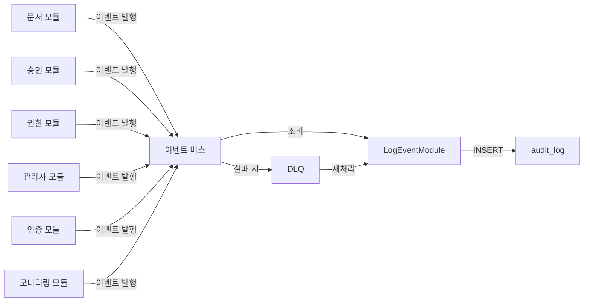
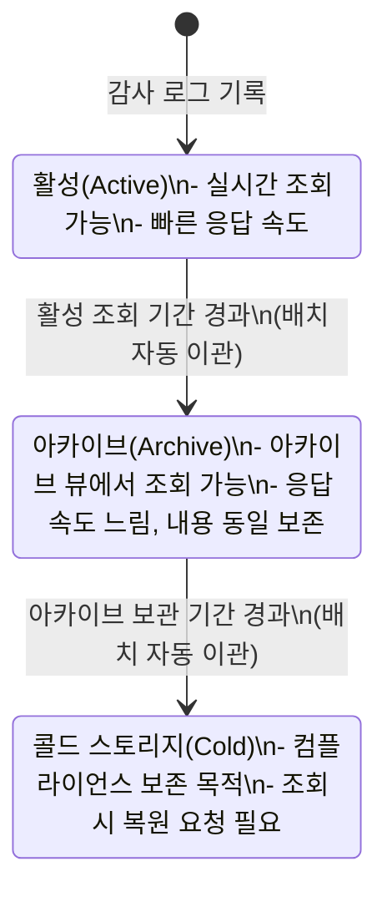

# 감사 로그 기능정의서

| 항목 | 값 |
|------|---|
| 제품 | AICM (KMS) |
| 문서 코드 | FD-AUD |
| 버전 | 1.3 |
| 작성일 | 2026-03-31 |
| 수정일 | 2026-04-02 |
| 기준 문서 | AICM 새 기능정의서 v1 §9 |

---

## 1. 개요

금융권 컴플라이언스 요건 충족을 위한 시스템 전체 감사 추적 체계이다.

### 1.1 핵심 원칙

- 모든 감사 로그는 **불변(immutable)** — 수정/삭제 불가, 보관 기간 경과 후에만 아카이빙
- 감사 로그는 **별도 저장소**(`audit_logs` 테이블)에 기록 — 운영 데이터와 분리하여 성능 영향 최소화
- 감사 대상 액션의 **단일 진실 원천(SSoT)** — 모든 감사 대상 액션 코드는 이 문서(§2)에서 집중 관리한다

### 1.2 비즈니스 규칙

| ID | 규칙 | 비고 |
|----|------|------|
| BR-AUD-001 | 감사 로그는 **불변(immutable)**이다 — INSERT만 허용, UPDATE/DELETE 불가 | 금융권 컴플라이언스 필수 |
| BR-AUD-002 | 감사 로그는 운영 데이터와 **물리적으로 분리된 저장소**(`audit_logs` 테이블)에 기록한다 | 운영 성능 영향 최소화 |
| BR-AUD-003 | 감사 로그 활성 조회 기간은 [FD-SYS](FD-SYS-시스템설정.md)에서 정한 **최소값 이하로 줄일 수 없다** | 하한선 보호, [UC-ADM-15](../usecases/admin/UC-ADM-시스템운영.md#uc-adm-15-시스템-운영-설정-관리) 참조 |
| BR-AUD-004 | 활성 조회 기간 경과 시 **삭제 없이 아카이브로 자동 이관**한다 | [UC-ADM-08](../usecases/admin/UC-ADM-시스템운영.md#uc-adm-08-감사-로그-조회내보내기) 참조 |
| BR-AUD-005 | 감사 시스템 자체의 활동(내보내기, 패키지 생성, 보고서 생성)도 **감사 기록**한다 | [UC-ADM-08](../usecases/admin/UC-ADM-시스템운영.md#uc-adm-08-감사-로그-조회내보내기) 사후 조건 |
| BR-AUD-006 | 감사 로그는 **비동기 이벤트 소비 방식**으로 수집한다 — 각 모듈이 도메인 이벤트를 발행하면 감사 모듈이 소비하여 기록 | 결정사항 참조 |
| BR-AUD-007 | 감사 대상 액션 카탈로그는 **FD-AUD(이 문서)에서 집중 관리**한다 (SSoT) | 결정사항 참조 |

### 1.3 AuditLog 엔티티

> DB-per-tenant 구조이므로 `tenant_id` 컬럼은 불필요하다. 각 테넌트 DB 안에 해당 테넌트의 데이터만 존재한다 ([데이터 아키텍처](../../02-architecture/data/README.md) §2 참조).

```
[AuditLog 엔티티]
- id: UUID, PK
- actor_id: UUID, FK(User), NOT NULL — 행위자
- actor_role: VARCHAR(100), NOT NULL — 기록 시점의 역할명 스냅샷
- action: VARCHAR(100), NOT NULL — `{resource_type}.{verb}` 형식 (예: `document.created`)
- resource_type: VARCHAR(50), NOT NULL — 대상 자원 유형
- resource_id: UUID, NOT NULL — 대상 자원 ID
- details: JSONB, NULL — 액션별 가변 데이터 (§2 각 액션 테이블의 details 주요 필드 참조)
- ip_address: INET, NOT NULL — 요청 IP
- user_agent: TEXT, NULL — 브라우저/클라이언트 정보
- created_at: TIMESTAMPTZ, NOT NULL, DEFAULT NOW() — 기록 시각 (UTC)
```

- `actor_role`은 기록 시점의 역할명을 스냅샷으로 저장한다 — 역할명이 이후 변경되더라도 과거 로그의 값은 기록 당시 기준으로 유지되어 불변성이 보장된다
- `details(JSONB)`는 액션별 가변 데이터를 수용한다 — 각 액션의 details 스키마는 §2 테이블에 정의
- `resource_type`/`resource_id` **채움 규칙**: 시스템 전역 이벤트(로그인, 세션 만료 등)처럼 특정 도메인 자원이 없는 액션은 `resource_type = 'system'`, `resource_id = 00000000-0000-0000-0000-000000000000` (고정 NIL UUID)으로 기록한다. 더미 UUID 남발을 방지하고 리포트 쿼리에서 `resource_type = 'system'` 필터로 분리한다
- `action` 컬럼의 **canonical 저장 형식**: DB에는 `{resource_type}.{verb}` 형식의 전체 문자열(예: `document.created`)을 단일 컬럼에 저장한다. `resource_type` 컬럼은 별도 인덱싱·필터용이며, `action` 값에서 파생 가능하나 조회 성능을 위해 중복 저장한다

### 1.4 수집 아키텍처

감사 로그는 **비동기 이벤트 소비 방식**(BR-AUD-006)으로 수집한다.



**수집 원칙**:
- 각 모듈이 도메인 이벤트를 발행하고, 이벤트 페이로드 스키마는 **발행측 모듈에서 정의**한다
- LogEventModule은 이벤트를 소비하여 AuditLog 엔티티로 변환·저장한다
- 원본 API 응답에 지연을 추가하지 않으며, LogEventModule 장애 시에도 원본 트랜잭션에 영향 없음

**실패 처리**:
- 감사 이벤트 소비 실패 시 **DLQ(Dead Letter Queue)**로 이동
- DLQ 메시지는 자동 재시도(최대 3회, 지수 백오프)
- 재시도 소진 시 운영 관리자에게 알림 발송, 수동 재처리 가능 ([UC-ADM-18](../usecases/admin/UC-ADM-시스템모니터링.md#uc-adm-18-시스템-모니터링) 수동 조치 참조)

### 1.5 감사 공통 이벤트 계약 (AuditEventPayload)

감사 모듈이 소비하는 모든 도메인 이벤트는 발행측 모듈에서 페이로드를 정의하되, 아래 **최소 공통 필드**를 반드시 포함해야 한다. 이 계약이 누락되면 감사 모듈이 소비 시 스키마 불일치로 드롭할 수 있다.

| 필드 | 타입 | 필수 | 설명 |
|------|------|:---:|------|
| `actorId` | UUID | Y | 행위자 ID |
| `actorRole` | string | Y | 행위자의 기록 시점 역할명 |
| `resourceType` | string | Y | 대상 자원 유형 (예: `document`, `system`) |
| `resourceId` | UUID | Y | 대상 자원 ID (시스템 이벤트는 NIL UUID) |
| `action` | string | Y | `{resource_type}.{verb}` 형식의 액션 코드 |
| `ipAddress` | string | Y | 요청 IP |
| `userAgent` | string | N | 브라우저/클라이언트 정보 |
| `details` | object | N | 액션별 가변 데이터 (§2 테이블 참조) |
| `occurredAt` | ISO8601 | Y | 이벤트 발생 시각 (UTC) |

> 각 발행 모듈의 events.md(모듈 스펙)에서 위 필드를 포함한 전체 페이로드를 정의한다. 이 최소 계약은 감사 모듈과 발행 모듈 간의 **인터페이스 계약**으로, 모듈 스펙 작성 시 준수를 검증한다.

**소비 이벤트 매핑**:

| 발행 모듈 | 이벤트 패턴 | 대응 액션 섹션 |
|----------|-----------|--------------|
| document | `document.*`, `attachment.*`, `schedule.*` | §2.1 문서 변경 |
| approval | `approval.*` | §2.1 승인 워크플로 |
| community | `comment.*`, `like.*`, `report.*` | §2.2 커뮤니티 |
| acl | `role.*`, `group.*`, `restriction.*` | §2.3 권한 변경 |
| admin | `board.*`, `template.*`, `shared_content.*`, `tag.*`, `approval_template.*`, `search_config.*`, `parsing_config.*`, `system_config.*`, `prompt.*` | §2.4 관리자 액션 |
| aggregation | `widget_catalog.changed` | §2.4 관리자 액션 (위젯 카탈로그) |
| auth | `auth.*` | §2.5 인증 |
| monitoring | `operation.*`, `monitoring_config.*`, `maintenance.*`, `dashboard.*`, `emergency_contact.*`, `feature_limit.*`, `monitoring_report.*`, `service_notice.*` | §2.6 모니터링/운영 조치 |
| audit | `audit_log.*` | §2.7 메타 감사 |

---

## 2. 감사 로그 유형 및 액션 코드

> **날리지큐브 참조**: 고객사 기존 KMS(날리지큐브)의 지식 통계 항목을 참조하여 AICM 시스템에 맞게 재설계한 액션 코드 체계이다. 날리지큐브의 (+)/(−) 이중 기록(행위자/대상자 관점)은 AICM에서 단일 이벤트 + `details` JSON으로 통합한다.

### 2.1 문서 변경 로그

- **추적 대상**: 문서 생성, 수정, 삭제(소프트 딜리트), 복구, 상태 변경(`draft` → `pending_review` → `published`), 긴급 회수(`suspended`), 아카이빙
- **승인 이력 포함**: 승인 요청, 승인, 반려, 철회 — 기존 승인 이력([FD-APR](FD-APR-승인워크플로.md))과 연동하되 감사 로그에도 중복 기록 (전체 시스템 이벤트를 단일 저장소에서 조회하기 위한 목적)
- **버전 변경 추적**: 어떤 버전에서 어떤 버전으로 변경되었는지, `content_hash` 변경 여부
- **예약 배포 이력**: 예약 설정, 예약 변경, 예약 취소, 예약 실행 완료/실패
- **공통 컨텐츠 변경**: 공통 컨텐츠 수정, 비활성 처리, 영향 문서 재임베딩 트리거

#### 문서 라이프사이클 액션

| resource_type | action | 설명 | details 주요 필드 | 날리지큐브 참조 |
|---------------|--------|------|-------------------|----------------|
| `document` | `document.created` | 문서 최초 생성 (draft) | `board_id`, `template_id` | 최초작성(3001) |
| `document` | `document.updated` | 문서 내용 수정 | `content_hash_before`, `content_hash_after` | 기본정보수정(3010) |
| `document` | `document.deleted` | 문서 삭제 (소프트 딜리트) | `board_id`, `title` | 삭제(1009) |
| `document` | `document.restored` | 삭제된 문서 복구 | `board_id` | 복원(1034) |
| `document` | `document.published` | 문서 배포 (published 전환) | `version_number` | 등록(1039) |
| `document` | `document.suspended` | 긴급 회수 (is_suspended=true) | `reason` | 폐기(1047) |
| `document` | `document.unsuspended` | 회수 해제 (is_suspended=false) | — | — |
| `document` | `document.archived` | 이전 버전 아카이빙 | `new_version_number` | — |
| `document` | `document.expired` | 유효기간 만료 자동 처리 | `expires_at` | 기간만료(1021) |
| `document` | `document.extended` | 유효기간 연장 | `expires_at_before`, `expires_at_after` | 기간연장(1022) |
| `document` | `document.assignee_changed` | 담당자 변경 | `assignee_before`, `assignee_after` | 담당자변경(3015) |
| `document` | `document.version_created` | 새 버전 생성 | `version_number`, `trigger` | 버전업(3012) |
| `document` | `document.exported` | 문서 내보내기 | `format` (PDF/DOCX/HTML/MD) | — |
| `document` | `document.draft_deleted` | 드래프트 삭제 (미등록 문서 폐기) | — | 최초작성폐기(3014) |
| `attachment` | `attachment.viewed` | 첨부파일 조회/다운로드 | `attachment_id`, `filename` | 첨부조회(1013) |

#### 승인 워크플로 액션

| resource_type | action | 설명 | details 주요 필드 | 날리지큐브 참조 |
|---------------|--------|------|-------------------|----------------|
| `approval` | `approval.requested` | 승인 요청 (제출) | `step_count`, `comment`, `picked_approvers` | 시행요청(3101) |
| `approval` | `approval.step_approved` | 단계별 승인 처리 | `step_number`, `approval_type`, `comment` | 1차승인(3111), 2차승인(3121) |
| `approval` | `approval.step_rejected` | 단계별 반려 처리 | `step_number`, `reason` | 1차반려(3112), 2차반려(3122) |
| `approval` | `approval.completed` | 최종 승인 완료 (전 단계 통과) | `total_steps` | — |
| `approval` | `approval.withdrawn` | 승인 요청 철회 | `step_at_withdrawal` | 요청 취소(3180) |
| `approval` | `approval.bypassed` | 긴급 발행 (승인 우회) | `bypass_reason` | — |
| `approval` | `approval.overridden` | 관리자 오버라이드 승인 | `step_number`, `comment` | — |
| `approval` | `approval.delete_requested` | 삭제 승인 요청 | `reason` | 삭제요청(3151) |
| `approval` | `approval.delete_approved` | 삭제 승인 처리 | `step_number` | 삭제요청승인(3161/3171) |
| `approval` | `approval.delete_rejected` | 삭제 반려 처리 | `step_number`, `reason` | 삭제요청반려(3162/3172) |

#### 예약 배포 액션

| resource_type | action | 설명 | details 주요 필드 |
|---------------|--------|------|-------------------|
| `schedule` | `schedule.created` | 예약 배포 설정 | `scheduled_at` |
| `schedule` | `schedule.changed` | 예약 배포 일시 변경 | `scheduled_at_before`, `scheduled_at_after` |
| `schedule` | `schedule.cancelled` | 예약 배포 취소 | `reason` |
| `schedule` | `schedule.executed` | 예약 배포 실행 완료 | — |
| `schedule` | `schedule.failed` | 예약 배포 실행 실패 | `error`, `retry_count` |

### 2.2 커뮤니티 로그

- **추적 대상**: 댓글 CRUD, 좋아요 토글, 문서 신고

| resource_type | action | 설명 | details 주요 필드 | 날리지큐브 참조 |
|---------------|--------|------|-------------------|----------------|
| `comment` | `comment.created` | 댓글 작성 | `parent_comment_id` (대댓글 시) | 의견추가(1025) |
| `comment` | `comment.updated` | 댓글 수정 | `content_before`, `content_after` | 의견수정(1029) |
| `comment` | `comment.deleted` | 댓글 삭제 | — | 의견삭제(1027) |
| `like` | `like.added` | 좋아요 추가 | `document_id` | 공감추가(1054) |
| `like` | `like.removed` | 좋아요 삭제 | `document_id` | 공감삭제(1056) |
| `report` | `report.created` | 문서/댓글 신고 접수 | `reason_type`, `description` | — |
| `report` | `report.resolved` | 신고 처리 완료 | `resolution` (삭제/반려/경고) | — |

### 2.3 권한 변경 로그

- **추적 대상**: 역할 CRUD, 역할 할당/해제, 그룹 CRUD, 그룹 멤버십 변경, 문서 접근 제한 변경, 긴급 접근 제한, 관리자 접근 제한 문서 열람
- **상세 기록**: 변경 전(`before`) → 변경 후(`after`) 스냅샷을 `details` 필드에 JSON으로 저장
- 관련: [FD-ACL](FD-ACL-권한체계.md)

| resource_type | action | 설명 | details 주요 필드 |
|---------------|--------|------|-------------------|
| `role` | `role.created` | 역할 생성 | `permissions` |
| `role` | `role.updated` | 역할 수정 (퍼미션 변경) | `permissions_before`, `permissions_after` |
| `role` | `role.deleted` | 역할 삭제 | `affected_users_count` |
| `role` | `role.assigned` | 사용자에게 역할 직접 할당 (UserRole) | `user_id`, `role_id` |
| `role` | `role.unassigned` | 사용자 역할 해제 | `user_id`, `role_id` |
| `group` | `group.created` | 그룹 생성 | `group_name` |
| `group` | `group.updated` | 그룹 수정 | `before`, `after` |
| `group` | `group.deleted` | 그룹 삭제 | `member_count` |
| `group` | `group.member_added` | 그룹 멤버 추가 | `user_id` |
| `group` | `group.member_removed` | 그룹 멤버 제거 | `user_id` |
| `group` | `group.role_assigned` | 그룹에 역할 부여 (TeamRole) | `role_id` |
| `group` | `group.role_unassigned` | 그룹 역할 해제 | `role_id` |
| `restriction` | `restriction.enabled` | 문서 접근 제한 활성화 | `target_id` |
| `restriction` | `restriction.disabled` | 문서 접근 제한 해제 | `target_id` |
| `restriction` | `restriction.whitelist_changed` | 화이트리스트 변경 | `added`, `removed` |
| `restriction` | `restriction.admin_viewed` | 운영 관리자 접근 제한 문서 열람 | `viewer_role` |
| `restriction` | `restriction.emergency_enabled` | 긴급 접근 제한 활성화 (복수 문서 일괄) | `reason`, `document_ids`, `document_count` |
| `restriction` | `restriction.emergency_disabled` | 긴급 접근 제한 해제 | `document_ids`, `document_count` |

> `restriction.admin_viewed`: 운영 관리자는 접근 제한 문서를 열람할 수 있으나, 이 접근은 반드시 감사 기록된다 ([UC-ADM-13](../usecases/admin/UC-ADM-시스템운영.md#uc-adm-13-문서블록-접근-제한-설정) 대안 흐름).
> `restriction.emergency_*`: 보안 사고 시 운영 관리자가 복수 문서에 대해 한 번에 접근 제한을 설정/해제하는 긴급 조치 ([UC-ADM-13](../usecases/admin/UC-ADM-시스템운영.md#uc-adm-13-문서블록-접근-제한-설정) 대안 흐름).

### 2.4 관리자 액션 로그

- **추적 대상**: 게시판, 템플릿, 공통 컨텐츠, 태그, 승인 라인 템플릿(ApprovalLineTemplate), 검색 튜닝, 시스템 설정, AI 프롬프트
- **설정 변경 diff**: 변경 전/후 값을 기록하여 "누가 언제 어떤 설정을 어떻게 바꿨는지" 추적
- 관련: [FD-ADM](FD-ADM-관리자.md)

| resource_type | action | 설명 | details 주요 필드 |
|---------------|--------|------|-------------------|
| `board` | `board.created` | 게시판 생성 | `board_type`, `parent_id` |
| `board` | `board.updated` | 게시판 수정 | `before`, `after` |
| `board` | `board.deleted` | 게시판 삭제 | `board_name` |
| `board` | `board.moved` | 게시판 트리 위치 변경 | `parent_before`, `parent_after` |
| `template` | `template.created` | 템플릿 생성 | `category` |
| `template` | `template.cloned` | 템플릿 복제 | — |
| `template` | `template.deactivated` | 템플릿 비활성 처리 | — |
| `shared_content` | `shared_content.created` | 공통 컨텐츠 생성 | `category` |
| `shared_content` | `shared_content.updated` | 공통 컨텐츠 수정 | `affected_documents_count` |
| `shared_content` | `shared_content.deactivated` | 공통 컨텐츠 비활성 처리 | `affected_documents_count` |
| `tag` | `tag.merged` | 태그 병합 | `source_tags`, `target_tag` |
| `tag` | `tag.deleted` | 태그 삭제 | `affected_documents_count` |
| `tag` | `tag.renamed` | 태그 이름 변경 | `name_before`, `name_after` |
| `approval_template` | `approval_template.created` | 승인 라인 템플릿 생성 | `steps` |
| `approval_template` | `approval_template.updated` | 승인 라인 템플릿 수정 | `before`, `after` |
| `approval_template` | `approval_template.deleted` | 승인 라인 템플릿 삭제 | `linked_boards_count` |
| `search_config` | `search_config.changed` | 검색 튜닝 설정 변경 | `config_key`, `before`, `after` |
| `parsing_config` | `parsing_config.changed` | 파싱/청킹 설정 변경 | `config_key`, `before`, `after` |
| `system_config` | `system_config.changed` | 시스템 설정 변경 | `config_key`, `before`, `after` |
| `prompt` | `prompt.updated` | AI 프롬프트 설정 변경 | `slot_key`, `before`, `after` |
| `widget` | `widget.created` | 위젯 카탈로그 등록 | `widget_key`, `target_roles` |
| `widget` | `widget.updated` | 위젯 카탈로그 수정 | `widget_key`, `before`, `after` |
| `widget` | `widget.activated` | 위젯 활성화 | `widget_key` |
| `widget` | `widget.deactivated` | 위젯 비활성화 | `widget_key`, `affected_users_count` |
| `widget` | `widget.deleted` | 위젯 삭제 (논리) | `widget_key`, `affected_users_count` |

### 2.5 인증 로그

- **추적 대상**: 로그인 성공/실패, 로그아웃, 세션 만료, 비정상 접근 시도
- **SaaS**: ECP 포털 인증 이벤트를 수신하여 기록
- **온프렘**: 자체 인증 시스템의 이벤트 직접 기록
- **보안 이벤트**: 연속 로그인 실패(브루트포스 감지), 비정상 IP에서의 접근 등 이상 징후 감지 시 관리자 알림

| resource_type | action | 설명 | details 주요 필드 |
|---------------|--------|------|-------------------|
| `auth` | `auth.login_success` | 로그인 성공 | `method` (ECP/자체) |
| `auth` | `auth.login_failed` | 로그인 실패 | `reason`, `attempt_count` |
| `auth` | `auth.logout` | 로그아웃 | — |
| `auth` | `auth.session_expired` | 세션 만료 | `session_duration` |
| `auth` | `auth.suspicious_access` | 비정상 접근 감지 | `detection_type`, `details` |

### 2.6 모니터링/운영 조치 로그

- **추적 대상**: 수동/자동 운영 조치, 모니터링 설정 변경, 유지보수 모드, 대시보드 공유, 비상 연락 체계, 기능 제한
- 관련: [UC-ADM-18](../usecases/admin/UC-ADM-시스템모니터링.md#uc-adm-18-시스템-모니터링)

#### 운영 조치 액션

| resource_type | action | 설명 | details 주요 필드 |
|---------------|--------|------|-------------------|
| `operation` | `operation.manual_executed` | 수동 조치 실행 (캐시 초기화, 큐 재처리 등) | `action_type`, `target`, `result` |
| `operation` | `operation.auto_executed` | 자동 조치 규칙 실행 | `rule_id`, `action_type`, `trigger_metric`, `result` |

#### 모니터링 설정 액션

| resource_type | action | 설명 | details 주요 필드 |
|---------------|--------|------|-------------------|
| `monitoring_config` | `monitoring_config.threshold_changed` | 임계치 설정 변경 | `metric`, `before`, `after` |
| `monitoring_config` | `monitoring_config.escalation_changed` | 에스컬레이션 대상 설정 변경 | `metric_area`, `before`, `after` |
| `emergency_contact` | `emergency_contact.changed` | 비상 연락 체계 변경 | `before`, `after` |

#### 유지보수 모드 액션

| resource_type | action | 설명 | details 주요 필드 |
|---------------|--------|------|-------------------|
| `maintenance` | `maintenance.entered` | 유지보수 모드 진입 | `scheduled_start`, `scheduled_end`, `reason` |
| `maintenance` | `maintenance.exited` | 유지보수 모드 해제 | `actual_duration`, `suppressed_alerts_count` |

#### UC-ADM-11 사후 조건 대응

> [UC-ADM-11](../usecases/admin/UC-ADM-시스템운영.md#uc-adm-11-통계-대시보드-조회) 사후 조건에서 감사 기록이 필요한 활동과 §2.6 액션의 대응 관계:
>
> | UC-ADM-11 사후 조건 | 대응 §2.6 액션 | 비고 |
> |---|---|---|
> | 통계 데이터 내보내기 | `monitoring_report.exported` | CSV 내보내기 |
> | 정기 보고서 설정 변경 | `monitoring_config.threshold_changed` 또는 `monitoring_config.escalation_changed` | 설정 카테고리에 따라 분기 |
> | 집계 데이터 수동 갱신 요청 | `operation.manual_executed` (`action_type: 'aggregation_refresh'`) | |
> | 용량 계획 알림 발송 | `operation.auto_executed` (`trigger_metric: 'storage_capacity'`) | 자동 조치 |
> | KPI 보고서 내보내기 | `monitoring_report.exported` (`report_type: 'kpi_handover'`) | |
> | 감사 로그 자동 보고서 생성 | `monitoring_report.generated` | |
> | 이상값 감지 알림 발송 | `operation.auto_executed` (`trigger_metric: 'anomaly_detection'`) | |
> | 체크리스트 완료/미완료 | `operation.manual_executed` (`action_type: 'checklist_update'`) | |
> | 비상 연락 체계 변경 | `emergency_contact.changed` | |

#### 대시보드/보고서/기능 제한 액션

| resource_type | action | 설명 | details 주요 필드 |
|---------------|--------|------|-------------------|
| `dashboard` | `dashboard.layout_shared` | 대시보드 레이아웃 공유 | `layout_name` |
| `dashboard` | `dashboard.preset_changed` | 대시보드 역할별 프리셋 변경 | `role`, `before`, `after` |
| `monitoring_report` | `monitoring_report.generated` | 트렌드 보고서 자동 생성 | `report_type`, `period`, `recipients` |
| `monitoring_report` | `monitoring_report.exported` | 용량 계획 보고서 내보내기 | `report_type`, `format` |
| `service_notice` | `service_notice.sent` | 장애 시 사용자 안내 발송 | `notice_type`, `target_scope`, `content_summary` |
| `feature_limit` | `feature_limit.enabled` | 비필수 기능 일시 제한 | `limited_features`, `reason` |
| `feature_limit` | `feature_limit.disabled` | 비필수 기능 제한 해제 | `restored_features` |

### 2.7 메타 감사 로그

- **추적 대상**: 감사 시스템 자체의 활동 — 내보내기, 감사 대응 패키지, 보고서 생성 (BR-AUD-005)
- 관련: [UC-ADM-08](../usecases/admin/UC-ADM-시스템운영.md#uc-adm-08-감사-로그-조회내보내기)

| resource_type | action | 설명 | details 주요 필드 |
|---------------|--------|------|-------------------|
| `audit_log` | `audit_log.exported` | 감사 로그 내보내기 (CSV/JSON) | `format`, `filter_criteria`, `record_count` |
| `audit_log` | `audit_log.package_exported` | 정기 감사 대응 패키지 내보내기 | `audit_period`, `scope`, `masking_applied` |
| `audit_log` | `audit_log.report_generated` | 감사 로그 자동 보고서 생성 | `report_period`, `log_types`, `recipients` |

### 2.8 날리지큐브 항목 미반영 사유

| 날리지큐브 항목 | 미반영 사유 |
|----------------|------------|
| 조회(1031) / 피조회(-1031) | 열람 로그는 감사 로그 범위에서 제외 (§결정사항 참조) — 핵심 변경 이력 추적에 집중 |
| 저장(3011) | 자동 저장(5~10초 간격)은 감사 대상이 아님 — 노이즈 과다, 버전 생성 시점에만 기록 |
| 의견멘션(1059) | AICM에 댓글 멘션 기능 없음 |
| (+)/(−) 이중 기록 | 단일 이벤트로 통합 — `actor_id`(행위자)와 `resource_id`(대상)로 양방향 조회 가능 |
| 1차/2차 승인요청 분리 (3110/3120) | AICM은 다단계 승인을 `step_number`로 통합 관리 — 정책에 따라 N단계 유연 확장 |

---

## 3. 조회 및 관리

### 3.1 관리자 감사 로그 뷰어

- 필터링: 기간, 액터, 액션 유형, 리소스
- 검색 + 페이지네이션

```
[AuditLogQueryFilter]
- date_from: DATE, NULL — 조회 시작일
- date_to: DATE, NULL — 조회 종료일
- actor_id: UUID, NULL — 특정 수행자
- action: VARCHAR, NULL — 액션 코드 필터 (와일드카드 지원: `document.*`)
- resource_type: VARCHAR, NULL — 자원 유형
- resource_id: UUID, NULL — 특정 자원 ID
- keyword: VARCHAR, NULL — details 내 텍스트 검색
- include_archive: BOOLEAN, DEFAULT false — 아카이브 데이터 포함 여부
```

```
[AuditLogListResponse]
- items: AuditLog[] — 감사 로그 목록
- total: INTEGER — 전체 건수 (필터 적용 후)
- page: INTEGER — 현재 페이지 (1-based)
- page_size: INTEGER — 페이지당 건수 (기본 50)
```

- 정렬: `created_at DESC` 기본, 오름차순 전환 가능
- 아카이브 데이터 포함 시 응답 시간이 증가할 수 있으며, UI에서 예상 소요 시간을 안내한다 ([UC-ADM-08](../usecases/admin/UC-ADM-시스템운영.md#uc-adm-08-감사-로그-조회내보내기) 예외 흐름)

### 3.2 감사 로그 내보내기

- CSV/JSON 형식으로 다운로드
- 외부 감사(컴플라이언스 검토) 대응

### 3.3 보관 정책

- 보관 기간은 관리자 설정 — **기본 1년, 금융권 권장 5년** (BR-AUD-003)
- 기간 경과 후 콜드 스토리지로 아카이빙 — 즉시 삭제하지 않음 (BR-AUD-004)

### 3.4 보관 라이프사이클



- **활성 → 아카이브**: 활성 조회 기간(§4 설정 가능 항목) 경과 시 배치 처리로 자동 이관
- **아카이브 → 콜드 스토리지**: 전체 보관 기간 경과 시 배치 처리로 자동 이관
- 모든 단계에서 데이터 **무결성은 동일하게 보존** — 조회 성능만 차이 ([UC-ADM-08](../usecases/admin/UC-ADM-시스템운영.md#uc-adm-08-감사-로그-조회내보내기) 대안 흐름)
- 콜드 스토리지 데이터의 최종 삭제 정책은 고객사 규제 요건에 따라 결정

### 3.5 감사 패키지 내보내기 API

> 정기 감사 대응 패키지를 생성·다운로드하는 엔드포인트이다 ([UC-ADM-08](../usecases/admin/UC-ADM-시스템운영.md#uc-adm-08-감사-로그-조회내보내기) 참조).

**패키지 생성 — `POST /api/admin/audit/packages`**

| 요청 필드 | 타입 | 필수 | 설명 |
|-----------|------|------|------|
| `audit_period_from` | date | Y | 감사 대상 시작일 |
| `audit_period_to` | date | Y | 감사 대상 종료일 |
| `scope` | enum | Y | `'full'` \| `'document'` \| `'permission'` \| `'auth'` — 포함 범위 |
| `masking_applied` | boolean | Y | 민감 정보 마스킹 적용 여부 |
| `format` | enum | Y | `'csv'` \| `'json'` — 출력 형식 |

- 응답: `{ packageId: UUID, status: 'processing', estimatedCompletionSeconds: integer }`
- 대량 데이터 시 비동기 처리 (`AUD_EXPORT_LIMIT_EXCEEDED` — 202 Accepted)

**패키지 상태 조회 — `GET /api/admin/audit/packages/:packageId`**

| 응답 필드 | 타입 | 설명 |
|-----------|------|------|
| `packageId` | UUID | 패키지 ID |
| `status` | enum | `'processing'` \| `'completed'` \| `'failed'` |
| `downloadUrl` | string, NULL | 완료 시 다운로드 URL |
| `fileSizeBytes` | bigint, NULL | 파일 크기 |
| `recordCount` | integer, NULL | 포함된 감사 로그 건수 |
| `createdAt` | timestamp | 요청 시각 |
| `completedAt` | timestamp, NULL | 완료 시각 |

**패키지 다운로드 — `GET /api/admin/audit/packages/:packageId/download`**

- 응답: 302 (프리사인드 URL 리다이렉트)

### 3.6 보관 라이프사이클 전이 API

> 보관 라이프사이클(§3.4) 배치의 수동 트리거 및 현황 조회용 엔드포인트이다.

**아카이브 현황 조회 — `GET /api/admin/audit/archive/status`**

| 응답 필드 | 타입 | 설명 |
|-----------|------|------|
| `active_count` | integer | 활성 영역 감사 로그 수 |
| `archive_count` | integer | 아카이브 영역 감사 로그 수 |
| `cold_count` | integer | 콜드 스토리지 감사 로그 수 |
| `oldest_active_date` | date | 활성 영역 가장 오래된 로그 날짜 |
| `next_archive_date` | date | 다음 아카이브 이관 예정일 |
| `last_archive_run_at` | timestamp, NULL | 마지막 아카이브 배치 실행 시각 |
| `last_archive_result` | enum, NULL | `'success'` \| `'failed'` \| `'skipped'` |

**수동 아카이브 트리거 — `POST /api/admin/audit/archive/trigger`**

| 요청 필드 | 타입 | 필수 | 설명 |
|-----------|------|------|------|
| `target_date` | date | Y | 이 날짜 이전의 활성 로그를 아카이브로 이관 |

- 응답: `{ jobId: UUID, estimatedRecordCount: integer, status: 'processing' }`

**아카이브 배치 규칙**:
- 배치 실행 주기: 일 1회 (새벽 시간대, `pm:audit.archive_batch_hour`로 설정 가능, 기본 03:00)
- 배치 단위: 1만 건씩 트랜잭션 분할 처리하여 락 경합 방지
- 실패 시 최대 3회 재시도 (지수 백오프), 최종 실패 시 운영 관리자 알림 발송
- 아카이브 이관 중에도 활성 영역 감사 로그 기록(INSERT)은 차단하지 않는다

### 3.7 실시간 모니터링 연동

- 이상 패턴 감지 시 관리자 알림:
  - 대량 삭제
  - 권한 일괄 변경
  - 기타 비정상 패턴

---

## 4. 설정 가능 항목

| 설정 항목 | 필드명 | 타입 | 기본값 | 설명 |
|-----------|--------|------|--------|------|
| 감사 로그 활성 조회 기간 | `audit_active_period_days` | integer | 365 | 활성 뷰에서 조회 가능한 기간(일). 초과 시 아카이브 이관. FD-SYS 하한선 보호 (BR-AUD-003) |
| 엄격 감사 모드 | `strict_audit_mode` | boolean | false | true 시 비정상 접근 패턴 감지 강화 + 관리자 알림 활성화 ([UC-ADM-08](../usecases/admin/UC-ADM-시스템운영.md#uc-adm-08-감사-로그-조회내보내기) 대안 흐름) |

> 시스템 설정 카테고리 `audit`에 등록된다 ([FD-SYS](FD-SYS-시스템설정.md) 참조). 설정 변경 시 캐시 무효화 이벤트가 발행되어 감사 모듈이 최신 설정을 즉시 반영한다.

---

## 5. 에러 코드

| 에러 코드 | HTTP | 설명 | 트리거 |
|-----------|------|------|--------|
| `AUD_IMMUTABLE` | 403 | 감사 로그 수정/삭제 시도 | BR-AUD-001 위반 |
| `AUD_RETENTION_MIN` | 400 | 보관 기간 하한선 미만 설정 시도 | BR-AUD-003 위반 |
| `AUD_EXPORT_LIMIT_EXCEEDED` | 202 | 내보내기 대상 건수 초과 — 백그라운드 처리로 전환 | [UC-ADM-08](../usecases/admin/UC-ADM-시스템운영.md#uc-adm-08-감사-로그-조회내보내기) 예외 흐름 |
| `AUD_FORBIDDEN` | 403 | 감사 로그 조회/내보내기 권한 부족 | 감사 로그 조회 AdminPermission 미보유 |
| `AUD_FILTER_INVALID` | 400 | 조회 필터 조건 유효성 실패 | 날짜 범위 오류, 잘못된 action 패턴 등 |
| `AUD_ARCHIVE_TIMEOUT` | 504 | 아카이브 데이터 조회 타임아웃 | [UC-ADM-08](../usecases/admin/UC-ADM-시스템운영.md#uc-adm-08-감사-로그-조회내보내기) 예외 흐름 |

> **비동기 소비 경로의 실패**: 이벤트 소비 실패(파싱 오류, DB 장애 등)는 HTTP 에러 코드로 표현되지 않는다. 이 경로의 실패는 §1.4 DLQ + 운영 관리자 알림으로 처리되며, [UC-ADM-18](../usecases/admin/UC-ADM-시스템모니터링.md#uc-adm-18-시스템-모니터링) 모니터링 대시보드에서 확인한다.

---

## 6. 비기능 요구사항

### 6.1 성능

- 비동기 수집 방식이므로 원본 API 응답에 **추가 지연 없음**
- 이벤트 발행 → 감사 로그 기록 완료: 정상 부하 시 **5초 이내**
- 활성 데이터 조회 응답: 필터 조건 포함 **2초 이내**
- 아카이브 데이터 조회 응답: **10초 이내** (초과 시 `AUD_ARCHIVE_TIMEOUT` + 조건 축소 안내)

### 6.2 보안

- BR-AUD-001에 따라 INSERT만 허용 — 물리적 차단 방법은 미결 사항 참조
- 감사 로그 조회 권한은 `view_audit_logs` AdminPermission(또는 FD·정책으로 정한 동등 키) 필요
- 내보내기 시 민감 정보 마스킹 옵션 제공 ([UC-ADM-08](../usecases/admin/UC-ADM-시스템운영.md#uc-adm-08-감사-로그-조회내보내기) 정기 감사 대응 패키지)

### 6.3 용량

- 감사 로그 발생량은 테넌트 규모 및 액션 분포에 따라 상이
- 금융권 5년 보관 기준, `created_at` 기반 **범위 파티셔닝** 적용 권장
- 파티셔닝 전략 및 인덱스 설계는 모듈 설계 단계에서 상세화

---

## 결정사항

| 항목 | 결정 | 근거 |
|------|------|------|
| 감사 로그 범위 | **문서 변경 + 승인 워크플로 + 커뮤니티(댓글/좋아요/신고) + 권한 변경 + 관리자 액션 + 인증 + 모니터링/운영 조치 + 메타 감사** — 열람/검색/자동저장 로그 제외 | 핵심 변경 이력 추적에 집중, 자동저장은 노이즈 과다 |
| 액션 코드 체계 | `{resource_type}.{action}` 형식 (예: `document.created`) — 설정 변경 동사는 `.changed`로 통일 | 일관된 네이밍 + 필터링 용이 |
| 날리지큐브 (+)/(−) 이중 기록 | **단일 이벤트로 통합** — `actor_id` + `resource_id`로 양방향 조회 | AICM은 감사 뷰어에서 필터링으로 대응, 이중 기록 불필요 |
| 감사 로그 보관 기간 | **기본 1년, 금융권 권장 5년** | 금융권 규제 대응 + 스토리지 비용 관리 |
| 감사 로그 불변성 | **수정/삭제 불가** — append-only | 감사 로그 자체의 무결성 보장 |
| 수집 방식 | **비동기 이벤트 소비** — 각 모듈이 도메인 이벤트 발행 → 감사 모듈이 소비하여 기록 | 원본 API 응답 무영향, 감사 모듈 장애 시 원본 트랜잭션 보호, DLQ 기반 유실 방지 |
| 액션 카탈로그 SSoT | **FD-AUD에서 집중 관리** — 모든 감사 대상 액션 코드는 이 문서의 §2에 등록 | 누락/중복 방지, 감사 범위 일원화 |
| 이벤트 페이로드 정의 | **발행측 모듈에서 정의** — 감사 모듈은 소비만 담당 | 도메인 지식은 발행측에, 감사 모듈은 범용 소비자 |
| 설정 변경 반영 | **캐시 + 이벤트 무효화** — 시스템 설정 변경 시 캐시 무효화 이벤트 발행, 감사 모듈이 최신 설정 즉시 반영 | 설정 변경 즉시 반영 + 조회 성능 유지 |
| actor_role 저장 방식 | **기록 시점의 역할명 스냅샷** 저장 | 역할명 변경 후에도 과거 로그의 정합성 유지, 불변성 원칙 부합 |

---

## 미결 사항

| 항목 | 내용 | 관련 |
|------|------|------|
| DB 레벨 불변성 보장 방법 | 감사 로그 테이블에서 UPDATE/DELETE를 물리적으로 차단하는 구체적 방법 (PostgreSQL RLS + 전용 role, 트리거, 애플리케이션 레벨 제어 등) | BR-AUD-001 |
| 추적 필드 추가 여부 | `session_id`, `correlation_id` 등 세션/트랜잭션 그룹핑용 필드 추가 여부 — 추가 시 동일 세션·비즈니스 트랜잭션의 감사 로그 연결 가능 | §1.3 AuditLog 엔티티 |

---

## 관련 문서

| 문서 | 참조 내용 |
|------|----------|
| [FD-DOC](FD-DOC-문서관리.md) | 문서 상태 변경, 버전 변경, 공통 컨텐츠 변경 |
| [FD-APR](FD-APR-승인워크플로.md) | 승인 이력 연동, 긴급 발행 감사 |
| [FD-ACL](FD-ACL-권한체계.md) | 권한 변경 추적, 메타정보 VIEW 바이패스 감사 |
| [FD-ADM](FD-ADM-관리자.md) | 관리자 액션 추적, 감사 로그 뷰어 |
| [FD-SYS](FD-SYS-시스템설정.md) | 시스템 설정 카테고리 `audit`, 하한선 보호 |
| [UC-ADM-08](../usecases/admin/UC-ADM-시스템운영.md#uc-adm-08-감사-로그-조회내보내기) | 감사 로그 조회/내보내기, 정기 감사 대응, 아카이브 조회 |
| [UC-ADM-13](../usecases/admin/UC-ADM-시스템운영.md#uc-adm-13-문서블록-접근-제한-설정) | 긴급 접근 제한, 관리자 접근 제한 문서 열람 |
| [UC-ADM-11](../usecases/admin/UC-ADM-시스템운영.md#uc-adm-11-통계-대시보드-조회) | 통계 대시보드 — 내보내기·수동 갱신·체크리스트 등 사후 조건 감사 (§2.6 매핑 참조) |
| [UC-ADM-17](../usecases/admin/UC-ADM-시스템운영.md#uc-adm-17-위젯-카탈로그-관리) | 위젯 카탈로그 관리 — 등록/수정/삭제 감사 (§2.4 `widget.*`) |
| [UC-ADM-18](../usecases/admin/UC-ADM-시스템모니터링.md#uc-adm-18-시스템-모니터링) | 수동/자동 조치 감사, 유지보수 모드, 모니터링 설정 변경 |
| [FD-AGG](FD-AGG-집계피드.md) | `widget_catalog.changed` 이벤트 발행측 — 위젯 카탈로그 감사 |
