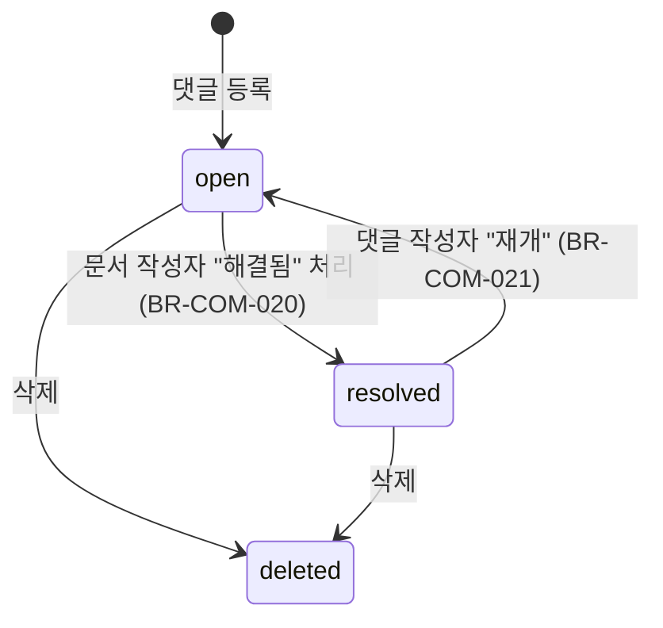
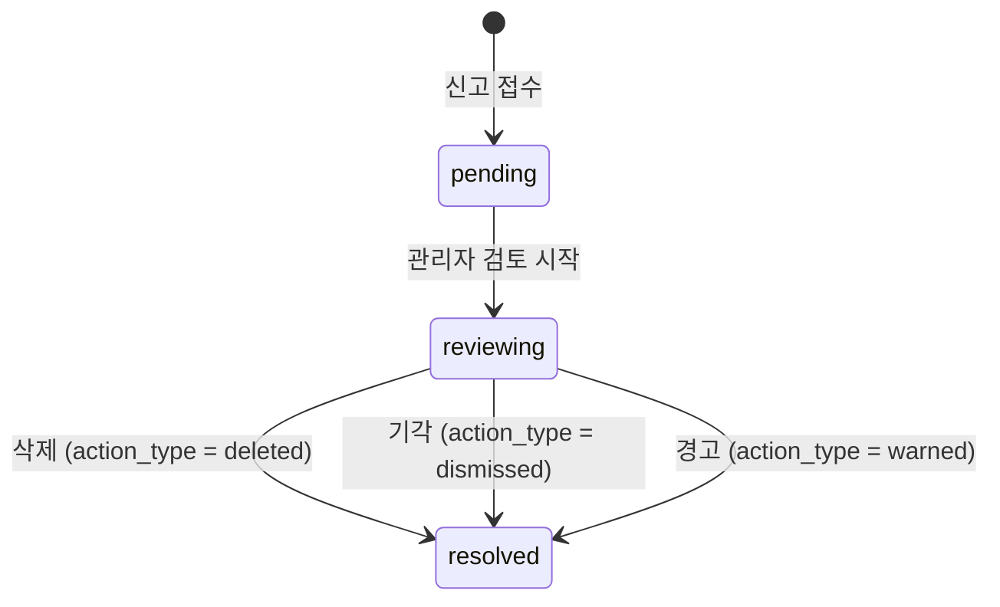

# 커뮤니티 기능정의서

| 항목 | 값 |
|------|---|
| 제품 | AICM (KMS) |
| 문서 코드 | FD-COM |
| 버전 | 3.0 |
| 작성일 | 2026-03-25 |
| 수정일 | 2026-03-31 |
| 기준 문서 | AICM 새 기능정의서 v1 §5 |

---

## 1. 자유게시판

KMS 문서로 등록되지 않는 일반 게시글 — RAG 대상에서 제외된다. 별도 게시판 타입으로 구분하며(`knowledge` vs `community`), community 타입 게시판도 관리자가 `Board.approval_required`·`Board.versioning_enabled` 및 `mandatory_approval_config`·`default_approval_template_id`를 설정하면 승인·버전 조합을 지식 게시판과 동일하게 켤 수 있다.

### 1.1 비즈니스 규칙

| BR-ID | 규칙 |
|-------|------|
| BR-COM-001 | `board_type = 'community'`인 게시판의 문서는 청킹/임베딩 파이프라인을 타지 않는다 — RAG 대상 제외, 키워드 검색에는 포함 |
| BR-COM-002 | `board_type`은 에디터 프로파일(사용 가능 블록, 태그 수)에만 영향을 주며, 운영 모드(승인/버전)는 `Board.approval_required`·`versioning_enabled` 및 게시판의 `mandatory_approval_config`·`default_approval_template_id`로 독립 제어한다 |
| BR-COM-003 | 자유게시판 글 최대 길이는 `lm:community.post_max_length` 설정값으로 제한한다 |
| BR-COM-004 | 자유게시판 글은 AI 답변 검색(RAG)에서 제외하되, 키워드 검색에는 포함한다 |
| BR-COM-005 | 관리자가 자유게시판 글을 "공지"로 지정하면 해당 게시판 상단에 고정 표시된다. 공지 수는 `lm:community.pinned_post_max_count` 이내로 제한한다 |

> 자유게시판 글은 기존 Document 엔티티를 그대로 사용한다 — 별도 CommunityPost 엔티티 없이 `Board.board_type = 'community'`로 구분하며, 문서 CRUD·블록 에디터·자동 저장 등 [FD-DOC](FD-DOC-문서관리.md) 규칙이 동일하게 적용된다.

---

## 2. 문서 댓글

문서/게시글 하단 댓글 작성, 수정, 삭제. 대댓글 1depth 지원(슬랙 스레드와 유사한 평탄 구조). 댓글에 대한 좋아요는 **미지원**한다.

### 2.1 비즈니스 규칙

| BR-ID | 규칙 |
|-------|------|
| BR-COM-010 | 대댓글은 1단계 깊이만 허용한다. 답글에 대한 답글은 원 댓글의 답글로 등록된다 (`parent_comment_id`는 항상 최상위 댓글을 가리킨다) |
| BR-COM-011 | 댓글 내용이 비어 있으면 등록을 거부한다 |
| BR-COM-012 | 댓글 내용이 `lm:community.comment_max_length` 글자를 초과하면 등록을 거부한다 |
| BR-COM-013 | "등록" 버튼 클릭 후 응답 수신 전까지 추가 클릭을 무시하여 중복 등록을 방지한다 |
| BR-COM-014 | **스팸/도배 방지**: 동일 사용자가 `lm:community.comment_rate_limit_seconds` 이내에 연속 댓글을 등록하면 등록을 제한한다 |
| BR-COM-015 | **민감정보 감지**: 댓글 내용에서 전화번호, 계좌번호, 주민등록번호 등 민감정보 패턴을 감지하면 경고를 표시한다. 사용자 확인 후 등록 가능하며, 감사 로그에 민감정보 포함 경고 이력을 기록한다 |
| BR-COM-016 | **부적절 콘텐츠 감지**: 금칙어 목록/패턴 기반으로 댓글 내용을 분석하여 부적절 표현을 사전 감지한다. **경고 수준**은 사용자 확인 후 등록 허용, **차단 수준**은 등록 거부. 감지 기준(금칙어, 패턴)은 시스템 운영 설정(UC-ADM-15)에서 관리한다 |
| BR-COM-017 | 댓글 수정은 작성자 본인만 가능하며, 등록 후 `lm:community.comment_edit_window_hours` 이내에만 허용한다. 수정된 댓글에는 "(수정됨)" 표시가 붙는다 |
| BR-COM-018 | 대댓글이 있는 댓글 삭제 시, 내용을 "삭제된 댓글입니다"로 대체하고 구조(`parent_comment_id` 참조)를 유지한다 |
| BR-COM-019 | 운영 관리자는 신고 처리(UC-ADM-12) 경로를 통해 타인의 댓글을 삭제할 수 있다. 문서 작성자(지식 관리자)는 자기 문서의 댓글을 직접 삭제할 수 없으며 신고(UC-COM-03)를 통해 요청한다 |
| BR-COM-020 | **댓글 해결**: 문서 작성자(지식 관리자)가 댓글의 지적 사항을 문서에 반영한 후 해당 댓글에 "해결됨" 표시를 할 수 있다. 해결된 댓글은 시각적으로 구분(흐린 글씨, 줄긋기 등)되며, 댓글 작성자에게 알림이 발송된다 |
| BR-COM-021 | **댓글 재개**: 댓글 작성자가 해결 처리에 동의하지 않으면 "재개" 버튼으로 미해결 상태로 되돌리고 추가 의견을 남길 수 있다 |
| BR-COM-022 | 문서 상세 페이지에서 "미해결 댓글만 보기" 필터를 지원한다 |
| BR-COM-023 | 미해결 댓글이 `lm:community.unresolved_comment_reminder_days` 이상 방치되면 문서 담당자(`assignee_id`)에게 리마인더를 발송한다 |
| BR-COM-024 | 관리자가 자유게시판별로 댓글 허용 여부를 개별 설정할 수 있다. 비활성화 시 댓글 영역이 표시되지 않는다 |
| BR-COM-025 | 퇴사한 사용자의 댓글은 작성자명이 "(알 수 없는 사용자)"로 익명화되며, 내용은 보존된다. 수정/삭제는 운영 관리자만 가능하다 |
| BR-COM-026 | 내 문서에 댓글이 달리면 문서 작성자에게 알림 발송 ([FD-NTF](FD-NTF-알림.md) §1 참조). 대댓글 시 원 댓글 작성자에게도 알림 발송 |

### 2.2 데이터 모델

**Comment 엔티티**:

| 필드 | 타입 | 제약 | 설명 |
|------|------|------|------|
| `id` | UUID | PK | 댓글 고유 식별자 |
| `document_id` | UUID | FK(Document), NOT NULL | 소속 문서 |
| `parent_comment_id` | UUID | FK(Comment), NULL | 대댓글 시 원 댓글 ID. NULL이면 최상위 댓글 |
| `author_id` | UUID | FK(User), NOT NULL | 작성자 |
| `content` | TEXT | NOT NULL | 댓글 내용 |
| `is_resolved` | BOOLEAN | NOT NULL, DEFAULT false | 해결 표시 여부 |
| `resolved_by` | UUID | FK(User), NULL | 해결 처리자 |
| `resolved_at` | TIMESTAMP | NULL | 해결 처리 시각 |
| `created_at` | TIMESTAMP | NOT NULL | 작성 시각 |
| `updated_at` | TIMESTAMP | NOT NULL | 최종 수정 시각 |
| `deleted_at` | TIMESTAMP | NULL | 소프트 딜리트 |

**제약 조건**:
- `parent_comment_id`는 동일 `document_id`에 속한 댓글만 참조 가능
- `parent_comment_id`가 가리키는 댓글의 `parent_comment_id`는 반드시 NULL이어야 한다 (1depth 강제)
- `is_resolved = true`이면 `resolved_by`, `resolved_at`이 NOT NULL
- `content` 최대 길이: `lm:community.comment_max_length`

### 2.3 댓글 해결 상태 전이

| 상태 | 조건 | 설명 |
|------|------|------|
| **open** | `is_resolved = false`, `deleted_at IS NULL` | 미해결 — 피드백 반영 필요 |
| **resolved** | `is_resolved = true`, `deleted_at IS NULL` | 해결됨 — 문서에 반영 완료 |
| **deleted** | `deleted_at IS NOT NULL` | 삭제됨 — 소프트 딜리트 |

---

## 3. 문서 좋아요

문서별 좋아요 토글(중복 불가, 1인 1좋아요). 좋아요 수 집계가 인기 문서 랭킹에 반영된다 ([FD-AGG](FD-AGG-집계피드.md) §1 참조).

### 3.1 비즈니스 규칙

| BR-ID | 규칙 |
|-------|------|
| BR-COM-030 | 동일 사용자가 동일 문서에 좋아요를 1번만 등록할 수 있다 (`document_id` + `user_id` UNIQUE 제약) |
| BR-COM-031 | 좋아요 상태에서 다시 클릭하면 좋아요가 취소(토글)된다. 취소 시 레코드를 물리 삭제한다 |
| BR-COM-032 | 빠른 연속 클릭 시 첫 번째 요청만 처리하고 이후 요청은 무시한다 |
| BR-COM-033 | 좋아요 수는 인기 문서 랭킹 산정에 반영된다 (가중치: `pm:aggregation.popular_weights.like`) |
| BR-COM-034 | 본인 문서에 좋아요를 누를 수 있다. 인기 순위 산정 시 자기 좋아요의 가중치 반영 여부는 시스템 운영 설정에서 관리한다 |
| BR-COM-035 | 좋아요 알림은 **미지원**한다 — 업무 직결 알림이 우선이며, 알림 피로도를 감소시킨다 |
| BR-COM-036 | 관리자가 좋아요 수 노출을 비활성화할 수 있다. 비활성화 시 버튼은 제공하되 좋아요 수는 표시하지 않는다. 내부 집계는 유지한다 |
| BR-COM-037 | 문서가 비공개/삭제 처리되면 좋아요 집계가 인기 순위에서 제외된다. 기록 자체는 보존되며 문서 복원 시 집계도 복원된다 |
| BR-COM-038 | 퇴사한 사용자의 좋아요 기록은 집계에 유지된다 — 좋아요 수가 감소하지 않는다 |

> **좋아요 알림 미지원 (결정사항 참조)**: BR-COM-035에 따라 좋아요 알림은 미지원한다. FD-NTF 18종에도 좋아요 알림은 미포함. UC-COM-02 기본 흐름 4·사후 조건에 "좋아요 알림 발송" 문구가 남아 있으므로 UC 측 정합이 필요하다 → [OPEN-COM-01](#미결-사항)

### 3.2 데이터 모델

**Like 엔티티**:

| 필드 | 타입 | 제약 | 설명 |
|------|------|------|------|
| `id` | UUID | PK | 좋아요 고유 식별자 |
| `document_id` | UUID | FK(Document), NOT NULL | 대상 문서 |
| `user_id` | UUID | FK(User), NOT NULL | 좋아요 사용자 |
| `created_at` | TIMESTAMP | NOT NULL | 좋아요 등록 시각 |

**제약 조건**:
- UNIQUE(`document_id`, `user_id`) — 1인 1좋아요 보장
- 좋아요 취소 시 레코드를 물리 삭제한다 (토글 방식, 소프트 딜리트 미적용)

---

## 4. 문서 신고

부적절한 문서/댓글 신고 기능. 신고 사유 **5종** 선택, 누적 시 자동 블라인드 처리.

### 4.1 비즈니스 규칙

| BR-ID | 규칙 |
|-------|------|
| BR-COM-040 | 신고 사유는 5종이다: 스팸(`spam`), 부적절한 내용(`inappropriate`), 저작권 침해(`copyright`), 개인정보 노출(`privacy`), 기타(`other`) |
| BR-COM-041 | "기타" 사유 선택 시 상세 설명(`reason_detail`) 입력이 필수이다 |
| BR-COM-042 | 같은 사용자가 같은 대상에 대해 중복 신고를 할 수 없다 (`target_type` + `target_id` + `reporter_id` UNIQUE 제약) |
| BR-COM-043 | **자동 블라인드**: 같은 대상에 대한 신고가 `lm:community.report_auto_hide_threshold` 이상 누적되면 해당 콘텐츠를 자동 블라인드(비공개) 처리하고 관리자에게 알림을 발송한다 |
| BR-COM-044 | 댓글 신고 시 자동 블라인드 임계치에 도달하면 해당 댓글만 블라인드 처리하며, 원본 문서에는 영향을 주지 않는다 |
| BR-COM-045 | **신고 남용 방지**: `lm:community.report_abuse_period_hours` 이내에 `lm:community.report_abuse_max_count`를 초과하는 신고를 등록하면 신고 기능을 일시 제한한다 |
| BR-COM-046 | 신고 사유는 열거형(ENUM)으로 고정한다 — 관리자가 사유를 추가하려면 코드 변경이 필요하며, "기타(직접 입력)"로 예외 대응 |
| BR-COM-047 | 신고 처리 결과는 신고자에게 별도 통보되지 않는다 (익명성 보호). 시스템 운영 설정에서 결과 통보를 활성화할 수 있다 |

### 4.2 데이터 모델

**Report 엔티티**:

| 필드 | 타입 | 제약 | 설명 |
|------|------|------|------|
| `id` | UUID | PK | 신고 고유 식별자 |
| `target_type` | ENUM(`'document'`, `'comment'`) | NOT NULL | 신고 대상 유형 |
| `target_id` | UUID | NOT NULL | 신고 대상 ID |
| `reporter_id` | UUID | FK(User), NOT NULL | 신고자 |
| `reason_type` | ENUM(`'spam'`, `'inappropriate'`, `'copyright'`, `'privacy'`, `'other'`) | NOT NULL | 신고 사유 |
| `reason_detail` | TEXT | NULL | 상세 사유 (`reason_type = 'other'`일 때 필수) |
| `status` | ENUM(`'pending'`, `'reviewing'`, `'resolved'`) | NOT NULL, DEFAULT `'pending'` | 처리 상태 |
| `action_type` | ENUM(`'deleted'`, `'dismissed'`, `'warned'`) | NULL | 조치 유형 (`resolved` 시 필수) |
| `action_reason` | TEXT | NULL | 조치 사유 |
| `reviewed_by` | UUID | FK(User), NULL | 검토 관리자 |
| `reviewed_at` | TIMESTAMP | NULL | 검토 완료 시각 |
| `created_at` | TIMESTAMP | NOT NULL | 신고 접수 시각 |

**제약 조건**:
- UNIQUE(`target_type`, `target_id`, `reporter_id`) — 동일 대상 중복 신고 방지
- `status = 'resolved'`이면 `action_type`, `reviewed_by`, `reviewed_at`이 NOT NULL
- `reason_type = 'other'`이면 `reason_detail`이 NOT NULL

### 4.3 신고 처리 상태 전이

| 상태 | 조건 | 설명 |
|------|------|------|
| **pending** | `status = 'pending'` | 접수됨 — 관리자 검토 대기 |
| **reviewing** | `status = 'reviewing'` | 검토 중 — 관리자가 내용을 확인하는 단계 |
| **resolved** | `status = 'resolved'` | 처리 완료 — `action_type`으로 세분화 |

> **자동 블라인드는 Report 상태와 독립적으로 동작한다.** 동일 대상에 대한 `pending`/`reviewing` 상태 신고 수가 `lm:community.report_auto_hide_threshold`에 도달하면 대상 콘텐츠를 즉시 블라인드 처리한다. 이때 개별 Report의 `status`는 변경되지 않으며, 관리자가 순차 검토하여 최종 처리한다. 기각(`dismissed`) 시 블라인드를 해제한다.

---

## 5. 북마크 (즐겨찾기)

사용자가 자주 참조하는 문서를 개인 북마크로 저장 — 좋아요(문서 평가)와 별개의 **개인 빠른 접근** 용도.

### 5.1 비즈니스 규칙

| BR-ID | 규칙 |
|-------|------|
| BR-COM-050 | 문서 상세 페이지에서 북마크 토글 — 추가 시 폴더 선택 또는 "미분류" 자동 저장 |
| BR-COM-051 | 폴더 간 북마크 이동/복제 가능. 복제된 북마크는 각 폴더에서 독립 관리 — 한 폴더에서 삭제해도 다른 폴더에 영향 없음 |
| BR-COM-052 | 기본 폴더("미분류", `is_default = true`)는 삭제 불가 |
| BR-COM-053 | 폴더 삭제 시 해당 폴더에 속한 북마크는 "미분류" 폴더로 자동 이동 |
| BR-COM-054 | 사용자당 최대 북마크 수: `lm:community.bookmark_max_count` |
| BR-COM-055 | 사용자당 최대 폴더 수: `lm:community.bookmark_folder_max_count` |
| BR-COM-056 | 폴더 순서는 드래그 앤 드롭 정렬 가능 (`sort_order` 필드) |
| BR-COM-057 | 북마크한 문서가 수정/재배포되면 "업데이트됨" 배지 표시 — `last_seen_version`과 현재 버전을 비교 |
| BR-COM-058 | 북마크한 문서가 삭제/비공개/접근 불가 상태가 되면 북마크 목록에 상태 표시 ("삭제된 문서", "비공개 문서", "접근 불가") |
| BR-COM-059 | 검색 시 "내 북마크에서만 검색" 필터 옵션 제공 ([FD-SCH](FD-SCH-검색.md) §6.1 참조) |
| BR-COM-060 | 퇴사한 사용자의 북마크 데이터는 계정 정리 시 함께 삭제한다 (개인 데이터이므로 보존하지 않음) |

### 5.2 데이터 모델

**Bookmark 엔티티**:

| 필드 | 타입 | 제약 | 설명 |
|------|------|------|------|
| `id` | UUID | PK | 북마크 고유 식별자 |
| `document_id` | UUID | FK(Document), NOT NULL | 대상 문서 |
| `user_id` | UUID | FK(User), NOT NULL | 소유 사용자 |
| `folder_id` | UUID | FK(BookmarkFolder), NOT NULL | 소속 폴더 |
| `last_seen_version` | INTEGER | NULL | 마지막 확인 문서 버전 번호 — "업데이트됨" 배지 판단 기준 |
| `created_at` | TIMESTAMP | NOT NULL | 북마크 등록 시각 |

**제약 조건**:
- UNIQUE(`document_id`, `user_id`, `folder_id`) — 동일 문서를 같은 폴더에 중복 저장 방지
- 동일 문서를 다른 폴더에는 저장 가능 (복제)
- 사용자당 총 북마크 수 ≤ `lm:community.bookmark_max_count`

**BookmarkFolder 엔티티**:

| 필드 | 타입 | 제약 | 설명 |
|------|------|------|------|
| `id` | UUID | PK | 폴더 고유 식별자 |
| `user_id` | UUID | FK(User), NOT NULL | 소유 사용자 |
| `name` | VARCHAR(100) | NOT NULL | 폴더명 |
| `sort_order` | INTEGER | NOT NULL, DEFAULT 0 | 표시 순서 |
| `is_default` | BOOLEAN | NOT NULL, DEFAULT false | 기본 "미분류" 폴더 여부 |
| `created_at` | TIMESTAMP | NOT NULL | 생성 시각 |
| `updated_at` | TIMESTAMP | NOT NULL | 최종 수정 시각 |

**제약 조건**:
- 사용자당 `is_default = true`인 폴더는 정확히 1개
- 사용자당 폴더 수 ≤ `lm:community.bookmark_folder_max_count`
- `is_default = true`인 폴더는 DELETE 차단

---

## 6. 마이페이지 (개인 영역)

개인과 관련된 기능을 한 곳에서 접근할 수 있는 통합 페이지 — 각 기능은 해당 섹션에서 상세 정의, 마이페이지는 진입점 역할.

### 6.1 비즈니스 규칙

| BR-ID | 규칙 |
|-------|------|
| BR-COM-070 | **내 문서 관리**: 내 드래프트 목록(제목, 게시판, 마지막 수정 시간), 내가 작성한 문서 목록(상태별 필터), 승인 대기 중인 내 문서 목록 — [FD-DOC](FD-DOC-문서관리.md) §3 참조 |
| BR-COM-071 | **북마크**: 북마크 폴더 및 문서 목록 관리 — §5 참조 |
| BR-COM-072 | **좋아요한 문서**: 내가 좋아요 누른 문서 목록 — §3 참조 |
| BR-COM-073 | **활동 이력**: 내 댓글 목록, 최근 열람한 문서 이력 |
| BR-COM-074 | **개인 설정**: 검색 선호([FD-SCH](FD-SCH-검색.md) §6.1), 알림 설정([FD-NTF](FD-NTF-알림.md) §1), AI 개인 프롬프트([FD-AI](FD-AI-AI어시스턴트.md) §3), 프로필(표시 이름, 프로필 이미지) |

---

## 7. 문서 내보내기 (Export)

> **상세: [FD-EXP-내보내기.md](FD-EXP-내보내기.md) 참조**

문서 내보내기 기능은 별도 기능정의서(FD-EXP)로 분리되었다. PDF, DOCX, HTML, Markdown 포맷 지원, 공통 컨텐츠 인라인 치환, 숨김 블록 제외, 워터마크(PDF) 등의 상세 규칙은 해당 문서를 참조한다.

---

## 8. 에러 코드

커뮤니티 모듈의 비즈니스 규칙 위반 시 반환하는 에러 코드 카탈로그. 접두사 `COM_`.

| 에러 코드 | 대응 BR | HTTP | 설명 |
|-----------|---------|------|------|
| `COM_COMMENT_EMPTY` | BR-COM-011 | 400 | 댓글 내용이 비어 있음 |
| `COM_COMMENT_TOO_LONG` | BR-COM-012 | 400 | 댓글 길이 초과 |
| `COM_COMMENT_EDIT_EXPIRED` | BR-COM-017 | 403 | 댓글 수정 허용 시간 초과 |
| `COM_COMMENT_RATE_LIMITED` | BR-COM-014 | 429 | 댓글 연속 등록 제한 (스팸/도배 방지) |
| `COM_COMMENT_SENSITIVE_INFO` | BR-COM-015 | 200 | 민감정보 포함 감지 — 경고 응답, 사용자 확인 필요 |
| `COM_COMMENT_BLOCKED_CONTENT` | BR-COM-016 | 403 | 부적절 콘텐츠 차단 수준 감지 — 등록 거부 |
| `COM_COMMENT_DOCUMENT_GONE` | — | 404 | 댓글 대상 문서가 삭제/비공개 상태 |
| `COM_LIKE_ALREADY_EXISTS` | BR-COM-030 | 409 | 이미 좋아요를 누른 문서 (토글 실패 시) |
| `COM_REPORT_DUPLICATE` | BR-COM-042 | 409 | 동일 대상 중복 신고 |
| `COM_REPORT_ABUSE_LIMITED` | BR-COM-045 | 429 | 신고 남용 제한 |
| `COM_REPORT_TARGET_GONE` | — | 404 | 신고 대상이 이미 삭제됨 |
| `COM_REPORT_REASON_REQUIRED` | BR-COM-041 | 400 | "기타" 사유 선택 시 상세 사유 미입력 |
| `COM_BOOKMARK_LIMIT_EXCEEDED` | BR-COM-054 | 403 | 북마크 최대 수 초과 |
| `COM_BOOKMARK_FOLDER_LIMIT` | BR-COM-055 | 403 | 북마크 폴더 최대 수 초과 |
| `COM_BOOKMARK_DEFAULT_FOLDER_DELETE` | BR-COM-052 | 403 | 기본 폴더("미분류") 삭제 시도 |
| `COM_POST_TOO_LONG` | BR-COM-003 | 400 | 자유게시판 글 길이 초과 |
| `COM_COMMENT_NOT_OWNER` | BR-COM-017 | 403 | 본인이 아닌 댓글 수정 시도 |
| `COM_COMMENT_DEPTH_EXCEEDED` | BR-COM-010 | 400 | 대댓글의 대댓글 시도 — 1depth 초과 |
| `COM_BOOKMARK_DUPLICATE` | §5.2 UNIQUE | 409 | 동일 문서를 같은 폴더에 중복 북마크 |
| `COM_REPORT_INVALID_TARGET` | BR-COM-040 | 400 | 지원하지 않는 신고 대상 유형 |

> 게시판·문서 수준 접근 권한(RBAC/ACL) 거절은 [FD-ACL](FD-ACL-권한체계.md) 공통 에러 체계(`ACL_*`)를 사용한다. 커뮤니티 전용 `COM_*` 코드는 비즈니스 규칙 위반에 한정한다.

---

## 9. 이벤트 계약

커뮤니티 모듈이 발행하는 도메인 이벤트. BullMQ 큐(`community.events`)로 전달하며, 지수 백오프 재시도 및 DLQ를 통해 안정적 처리를 보장한다 ([비동기 처리 아키텍처 §6.5](../../02-architecture/05-async-event-architecture.md) 참조).

| 이벤트 | 발행 시점 | 페이로드 주요 필드 | 멱등 키 | 소비자 |
|--------|----------|-------------------|---------|--------|
| `community.comment.created` | 댓글 등록 | `commentId`, `documentId`, `authorId`, `parentCommentId?` | `commentId` | notification, audit, aggregation |
| `community.comment.updated` | 댓글 수정 | `commentId`, `documentId`, `authorId` | `commentId` | audit |
| `community.comment.deleted` | 댓글 삭제 | `commentId`, `documentId`, `deletedBy`, `reason?` | `commentId` | audit, aggregation |
| `community.comment.resolved` | 댓글 해결 처리 | `commentId`, `documentId`, `resolvedBy` | `commentId` | notification, audit |
| `community.comment.reopened` | 댓글 재개 처리 | `commentId`, `documentId`, `reopenedBy` | `commentId` | notification, audit |
| `community.like.toggled` | 좋아요 등록/취소 | `documentId`, `userId`, `action`(`liked`\|`unliked`) | `documentId:userId` | aggregation, audit |
| `community.report.created` | 신고 접수 | `reportId`, `targetType`, `targetId`, `reporterId`, `reasonType` | `reportId` | notification(관리자), audit |
| `community.report.auto_blinded` | 자동 블라인드 발동 | `targetType`, `targetId`, `reportCount`, `threshold` | `targetType:targetId` | notification(관리자), audit |
| `community.report.resolved` | 신고 처리 완료 | `reportId`, `actionType`, `reviewedBy` | `reportId` | audit |
| `community.bookmark.created` | 북마크 추가 | `bookmarkId`, `documentId`, `userId`, `folderId` | `bookmarkId` | audit |
| `community.bookmark.removed` | 북마크 해제 | `documentId`, `userId`, `folderId` | `documentId:userId:folderId` | audit |

### 9.1 운영 정책

| 항목 | 정책 |
|------|------|
| 전달 채널 | BullMQ 큐 `community.events` — [비동기 처리 아키텍처 §6.5](../../02-architecture/05-async-event-architecture.md) 참조 |
| 재시도 | 지수 백오프 최대 3회 (5s → 10s → 20s), 최종 실패 시 DLQ 이동 |
| DLQ | `community.events-dlq` — 최종 실패 이벤트 적재, 관리자 모니터링 대시보드에서 재처리/폐기. 소비자 모듈별 DLQ 정책 추가 적용 — [비동기 처리 아키텍처 §6.6](../../02-architecture/05-async-event-architecture.md) 참조 |
| 멱등성 | 소비자는 멱등 키 기준으로 중복 처리를 방지한다. 멱등 키는 페이로드의 엔티티 식별자 조합 |
| 페이로드 컨텍스트 | 모든 이벤트에 `schemaVersion: 1`, `actorId`, `orgId`, `traceId`, `triggeredAt` 공통 필드를 포함한다 ([비동기 처리 아키텍처 §6.5](../../02-architecture/05-async-event-architecture.md) 참조) |
| 이벤트 스키마 호환성 | 필드 추가는 자유, 필드 제거·타입 변경 시 새 이벤트명 도입 — [비동기 처리 아키텍처 §6.4](../../02-architecture/05-async-event-architecture.md) 이벤트 버전 관리 참조 |

> 상세 이벤트 계약(TypeScript 페이로드 인터페이스, job name 등)은 모듈 스펙 [`docs/03-module-design/community/events.md`](../../03-module-design/community/events.md)에서 정의한다.

---

## 10. 비기능 요구사항

### 10.1 성능

| 항목 | 요구사항 |
|------|---------|
| 댓글 목록 조회 | 페이지네이션 적용 (기본 20건), 문서당 최대 댓글 수 제한 없음 |
| 좋아요 토글 응답 | ≤ 200ms — 동시 요청 시 UNIQUE 제약으로 정합성 보장 |
| 좋아요 수 집계 | Redis 캐시 기반 — 쓰기 시 캐시 무효화, 읽기 시 캐시 히트 |
| 댓글 수 집계 | Redis 캐시 기반 — 좋아요 수와 동일 전략 |
| 신고 자동 블라인드 | 신고 등록 시 동기 처리 — 임계치 도달 여부 즉시 판정 |

### 10.2 보안

| 항목 | 요구사항 |
|------|---------|
| 댓글 XSS 방지 | 댓글 내용 저장/렌더링 시 HTML 새니타이징 필수 (DOMPurify 또는 서버사이드 sanitizer) |
| 민감정보 감지 | 정규식 기반 패턴 매칭 (전화번호, 계좌번호, 주민등록번호 등) — 감지 시 감사 로그 기록 |
| 신고자 익명성 | 신고자 정보는 관리자에게만 노출, 콘텐츠 작성자에게는 비공개 |

### 10.3 감사 로그 연동

커뮤니티 모듈의 모든 쓰기 작업은 [FD-AUD](FD-AUD-감사로그.md) 감사 로그에 기록한다:

- **댓글**: 작성, 수정, 삭제, 해결, 재개
- **좋아요**: 등록, 취소
- **신고**: 접수, 자동 블라인드, 관리자 조치(삭제/기각/경고)
- **북마크**: 추가, 해제, 폴더 생성/삭제
- **민감정보 감지 경고 이력**: 경고 발생 및 사용자 확인 후 등록 이력

---

## 11. 설정 가능 항목

[FD-SYS](FD-SYS-시스템설정.md) §3.10 커뮤니티 카테고리에 등록하는 설정 키 목록.

| 설정 항목 | config_key | 타입 | 기본값 | 설명 |
|-----------|------------|------|--------|------|
| 댓글 최대 글자 수 | `lm:community.comment_max_length` | number | 2000 | 댓글 내용 최대 길이 |
| 댓글 수정 허용 시간 | `lm:community.comment_edit_window_hours` | number | 24 | 등록 후 수정 가능 시간(시간) |
| 댓글 연속 등록 제한 간격 | `lm:community.comment_rate_limit_seconds` | number | 10 | 동일 사용자 연속 댓글 최소 간격(초) |
| 미해결 댓글 리마인더 | `lm:community.unresolved_comment_reminder_days` | number | 7 | 미해결 상태 N일 초과 시 담당자 리마인더 |
| 신고 자동 블라인드 임계값 | `lm:community.report_auto_hide_threshold` | number | 5 | 신고 N건 누적 시 자동 비공개 (FD-SYS §3.10 참조) |
| 신고 남용 판단 기간 | `lm:community.report_abuse_period_hours` | number | 24 | 남용 판단 시간 윈도우(시간) |
| 신고 남용 최대 건수 | `lm:community.report_abuse_max_count` | number | 20 | 판단 기간 내 최대 신고 건수 |
| 북마크 최대 수 | `lm:community.bookmark_max_count` | number | 500 | 사용자당 최대 북마크 수 |
| 북마크 폴더 최대 수 | `lm:community.bookmark_folder_max_count` | number | 20 | 사용자당 최대 폴더 수 |
| 자유게시판 글 최대 길이 | `lm:community.post_max_length` | number | 50000 | 자유게시판 게시글 최대 글자 수 |
| 공지 최대 수 | `lm:community.pinned_post_max_count` | number | 5 | 게시판당 공지 고정 최대 수 |

---

## 부록 A. API 엔드포인트 및 DTO 개요

FD 수준의 최소 API/DTO 요약이다. 상세 요청/응답 스키마와 Swagger 정의는 모듈 스펙 [`docs/03-module-design/community/api.md`](../../03-module-design/community/api.md)에서 정의한다.

### A.0 게시글 API

| 메서드 | 엔드포인트 | 설명 | 주요 BR |
|--------|-----------|------|---------|
| GET | `/api/boards/:boardId/posts` | 게시글 목록 조회 (페이지네이션) | BR-COM-001 |
| POST | `/api/boards/:boardId/posts` | 게시글 작성 | BR-COM-003, 005 |
| GET | `/api/posts/:postId` | 게시글 상세 조회 | — |
| PATCH | `/api/posts/:postId` | 게시글 수정 | — |
| DELETE | `/api/posts/:postId` | 게시글 삭제 | — |
| POST | `/api/posts/:postId/pin` | 게시글 공지 고정 (관리자) | BR-COM-005 |
| DELETE | `/api/posts/:postId/pin` | 게시글 공지 해제 (관리자) | BR-COM-005 |

**CreatePostDto**:

| 필드 | 타입 | 필수 | 제약 | 매핑 |
|------|------|:----:|------|------|
| `title` | string | ● | ≤ 200자 | Document.title |
| `content` | object | ● | Tiptap JSON, ≤ `lm:community.post_max_length` | Document.content |
| `tagIds` | UUID[] | ○ | ≤ `lm:document.max_tags` | DocumentTag |

**UpdatePostDto**:

| 필드 | 타입 | 필수 | 제약 | 매핑 |
|------|------|:----:|------|------|
| `title` | string | ○ | ≤ 200자 | Document.title |
| `content` | object | ○ | Tiptap JSON, ≤ `lm:community.post_max_length` | Document.content |
| `tagIds` | UUID[] | ○ | ≤ `lm:document.max_tags` | DocumentTag |

**PostListResponseDto**:

| 필드 | 타입 | 설명 |
|------|------|------|
| `items` | PostSummaryDto[] | 게시글 목록 |
| `total` | integer | 전체 건수 |
| `page` | integer | 현재 페이지 |

**PostSummaryDto**: `id`, `title`, `authorName`, `isPinned`, `commentCount`, `likeCount`, `viewCount`, `createdAt`, `updatedAt`

### A.1 댓글 API

| 메서드 | 엔드포인트 | 설명 | 주요 BR |
|--------|-----------|------|---------|
| GET | `/api/documents/:documentId/comments` | 댓글 목록 조회 (페이지네이션) | BR-COM-022 |
| POST | `/api/documents/:documentId/comments` | 댓글 등록 | BR-COM-010~016 |
| PATCH | `/api/comments/:commentId` | 댓글 수정 | BR-COM-017 |
| DELETE | `/api/comments/:commentId` | 댓글 삭제 | BR-COM-018, 019 |
| POST | `/api/comments/:commentId/resolve` | 댓글 해결 | BR-COM-020 |
| POST | `/api/comments/:commentId/reopen` | 댓글 재개 | BR-COM-021 |

**CreateCommentDto**:

| 필드 | 타입 | 필수 | 제약 | 매핑 |
|------|------|:----:|------|------|
| `content` | string | ● | ≤ `lm:community.comment_max_length` | Comment.content |
| `parentCommentId` | UUID | ○ | 최상위 댓글만 참조 (1depth) | Comment.parent_comment_id |

**UpdateCommentDto**:

| 필드 | 타입 | 필수 | 제약 | 매핑 |
|------|------|:----:|------|------|
| `content` | string | ● | ≤ `lm:community.comment_max_length` | Comment.content |

### A.2 좋아요 API

| 메서드 | 엔드포인트 | 설명 | 주요 BR |
|--------|-----------|------|---------|
| POST | `/api/documents/:documentId/like` | 좋아요 토글 | BR-COM-030~032 |
| GET | `/api/documents/:documentId/like/status` | 좋아요 상태 조회 | — |

**LikeStatusResponseDto**:

| 필드 | 타입 | 설명 |
|------|------|------|
| `liked` | boolean | 현재 사용자의 좋아요 여부 |
| `count` | number | 총 좋아요 수 |

### A.3 신고 API

| 메서드 | 엔드포인트 | 설명 | 주요 BR |
|--------|-----------|------|---------|
| POST | `/api/reports` | 신고 접수 | BR-COM-040~046 |
| GET | `/api/admin/reports` | 신고 목록 조회 (관리자) | — |
| PATCH | `/api/admin/reports/:reportId/review` | 신고 처리 | §4.3 상태 전이 |

**CreateReportDto**:

| 필드 | 타입 | 필수 | 제약 | 매핑 |
|------|------|:----:|------|------|
| `targetType` | `'document'` \| `'comment'` | ● | — | Report.target_type |
| `targetId` | UUID | ● | 존재하는 대상 | Report.target_id |
| `reasonType` | `'spam'` \| `'inappropriate'` \| `'copyright'` \| `'privacy'` \| `'other'` | ● | — | Report.reason_type |
| `reasonDetail` | string | ○ | `reasonType = 'other'` 시 필수 | Report.reason_detail |

**ResolveReportDto**:

| 필드 | 타입 | 필수 | 제약 | 매핑 |
|------|------|:----:|------|------|
| `actionType` | `'deleted'` \| `'dismissed'` \| `'warned'` | ● | — | Report.action_type |
| `actionReason` | string | ○ | — | Report.action_reason |

### A.4 북마크 API

| 메서드 | 엔드포인트 | 설명 | 주요 BR |
|--------|-----------|------|---------|
| POST | `/api/bookmarks` | 북마크 추가 | BR-COM-050, 054 |
| DELETE | `/api/bookmarks/:bookmarkId` | 북마크 해제 | — |
| PATCH | `/api/bookmarks/:bookmarkId/move` | 북마크 폴더 이동 | BR-COM-051 |
| GET | `/api/bookmarks` | 북마크 목록 조회 | — |
| POST | `/api/bookmark-folders` | 폴더 생성 | BR-COM-055 |
| PATCH | `/api/bookmark-folders/:folderId` | 폴더 수정 | BR-COM-056 |
| DELETE | `/api/bookmark-folders/:folderId` | 폴더 삭제 | BR-COM-052, 053 |
| GET | `/api/bookmark-folders` | 폴더 목록 조회 | — |

**CreateBookmarkDto**:

| 필드 | 타입 | 필수 | 제약 | 매핑 |
|------|------|:----:|------|------|
| `documentId` | UUID | ● | 존재하는 문서 | Bookmark.document_id |
| `folderId` | UUID | ○ | 미지정 시 기본 "미분류" 폴더 | Bookmark.folder_id |

**CreateBookmarkFolderDto**:

| 필드 | 타입 | 필수 | 제약 | 매핑 |
|------|------|:----:|------|------|
| `name` | string | ● | ≤ 100자 | BookmarkFolder.name |

**UpdateBookmarkFolderDto**:

| 필드 | 타입 | 필수 | 제약 | 매핑 |
|------|------|:----:|------|------|
| `name` | string | ○ | ≤ 100자 | BookmarkFolder.name |
| `sortOrder` | number | ○ | — | BookmarkFolder.sort_order |

---

## 결정사항

| 항목 | 결정 | 근거 | 일자 |
|------|------|------|------|
| 대댓글 지원 | **1depth** | 복잡도 대비 실효성, KMS 댓글은 질의응답/피드백 용도 | 2026-03-25 |
| 댓글 좋아요 | **미지원** | 댓글은 순수 피드백/질문 용도, 구현 단순화 | 2026-03-25 |
| 좋아요 알림 | **미지원** | 업무 직결 알림이 우선, 알림 피로도 감소. FD-NTF 18종에도 좋아요 알림 미포함. UC-COM-02의 좋아요 알림 흐름과 상이하나, FD 결정이 최종이며 UC에 "미지원" 반영 필요 | 2026-03-31 |
| 북마크 구조 | **폴더 분류** | 업무 맥락별 정리 용이, 상담사 실무 효용 | 2026-03-25 |
| 신고 사유 종류 | **5종** (스팸, 부적절, 저작권, 개인정보 노출, 기타) | 금융권 KMS 컴플라이언스 요건 — 개인정보 노출 사유 필수 | 2026-03-31 |
| 신고 사유 확장 방식 | **열거형 고정** | 신고 사유는 법적/운영 판단 기준으로 코드 변경이 적절. "기타(직접 입력)"로 예외 대응 | 2026-03-31 |
| 문서 내보내기 분리 | **별도 FD-EXP로 분리** | 내보내기 기능의 규모/복잡도가 독립 FD 수준이며, 커뮤니티와 직접적 연관 낮음 | 2026-03-31 |
| 좋아요 취소 방식 | **물리 삭제 (토글)** | 소프트 딜리트 대비 구현 단순, 좋아요 이력 추적 불필요 | 2026-03-31 |
| 좋아요 수 캐싱 | **Redis 캐시** | 동시성 높은 좋아요 집계를 매번 COUNT 쿼리하면 DB 부하, Redis 카운터로 대응 | 2026-03-31 |

---

## 미결 사항

| ID | 항목 | 설명 |
|----|------|------|
| ~~OPEN-COM-01~~ | ~~UC-COM-02 좋아요 알림 정합성~~ | **해결됨** — FD 결정(미지원) 확정. BR-COM-035에 따라 좋아요 알림은 미지원이며, UC-COM-02 측 정합 반영 완료 |
| OPEN-COM-02 | FD-EXP 작성 | §7 문서 내보내기가 FD-EXP로 분리 결정되었으나, FD-EXP 문서가 아직 미작성 |
| OPEN-COM-03 | FD-SYS 설정 키 동기화 | §11 설정 가능 항목 중 FD-SYS §3.10에 미등록 키 존재 — FD-SYS 갱신 필요 |

---

## 관련 문서

| 문서 | 설명 |
|------|------|
| [FD-DOC-문서관리.md](FD-DOC-문서관리.md) | 문서 CRUD, 블록 에디터, 자동저장, 드래프트 |
| [FD-NTF-알림.md](FD-NTF-알림.md) | 댓글/신고 알림 유형 |
| [FD-ACL-권한체계.md](FD-ACL-권한체계.md) | 게시판 권한(BoardPermission) |
| [FD-AGG-집계피드.md](FD-AGG-집계피드.md) | 좋아요 가중치, 인기 문서 랭킹 |
| [FD-SYS-시스템설정.md](FD-SYS-시스템설정.md) | 커뮤니티 설정 키 (`lm:community.*`) |
| [FD-AUD-감사로그.md](FD-AUD-감사로그.md) | 감사 로그 연동 |
| [FD-EXP-내보내기.md](FD-EXP-내보내기.md) | 문서 내보내기 (별도 FD로 분리) |
| [UC-COM-커뮤니티.md](../usecases/user/UC-COM-커뮤니티.md) | UC-COM-01~05 커뮤니티 유즈케이스 |
| [UC-PER-개인영역.md](../usecases/user/UC-PER-개인영역.md) | UC-PER 마이페이지/북마크/알림 유즈케이스 |
