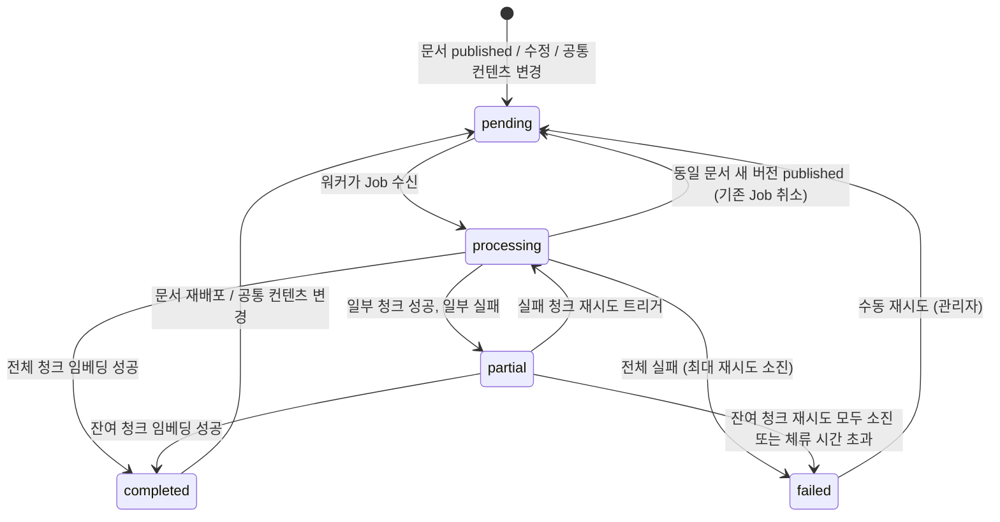

# 임베딩 파이프라인 기능정의서

| 항목 | 값 |
|------|---|
| 제품 | AICM (KMS) |
| 문서 코드 | FD-EMB |
| 버전 | 1.2 |
| 작성일 | 2026-03-25 |
| 최종 수정일 | 2026-03-31 |
| 기준 문서 | AICM 새 기능정의서 v1 §1.8~1.9 |

---

## 1. 임베딩 파이프라인 상태 관리

- **개요**: 문서가 `published` 되어도 청킹/임베딩은 비동기로 처리되므로, 임베딩 완료 전까지 해당 문서는 키워드 검색에는 노출되나 RAG(시맨틱 검색)에는 반영되지 않을 수 있음 — 이 갭을 사용자에게 명시적으로 안내

### 1.1 임베딩 상태 필드

- 문서별 임베딩 처리 상태를 별도 필드로 관리
  - `embedding_status`: `pending` → `processing` → `completed` / `failed` / `partial`
  - `pending`: 임베딩 큐 대기 중 (문서 배포/수정 직후)
  - `processing`: 청킹 + 임베딩 진행 중
  - `completed`: 전체 청크 임베딩 완료 — RAG 검색 정상 반영
  - `failed`: 임베딩 실패 — 재시도 대기 또는 수동 개입 필요
  - `partial`: 일부 청크만 임베딩 완료 (대용량 문서 분할 처리 중, 또는 일부 실패)

#### 상태 전이 다이어그램



#### 비즈니스 규칙

- **BR-EMB-001**: `embedding_status`는 Document 엔티티의 컬럼으로 관리한다. 동시 Job 관리는 별도 `EmbeddingTask` 엔티티(§3.1)로 추적한다.
- **BR-EMB-002**: `partial` 상태는 최대 1시간 체류 가능하다. 체류 시간 초과 시 시스템이 자동으로 `failed`로 전이하고 관리자에게 알린다.
- **BR-EMB-003**: `partial` → `completed` 전이 조건 — EmbeddingTask의 모든 청크 상태가 `completed`일 때 자동 전이한다.
- **BR-EMB-004**: `processing` 중 동일 문서의 새 버전이 `published`되면, 기존 Job을 취소(`cancelled`)하고 새 Job을 `pending`으로 생성한다. 취소된 Job이 이미 처리한 벡터는 새 Job이 덮어쓴다.
- **BR-EMB-005**: `processing` 중 원본 문서가 삭제(soft delete)되면, 진행 중인 Job을 취소하고 기존 벡터를 물리 삭제한다.

### 1.2 UI 표시

- 문서 상세 페이지에 임베딩 상태 배지 표시
- 문서 목록에서도 아이콘/라벨로 임베딩 미완료 문서 시각적 구분
- [FD-SCH](FD-SCH-검색.md) 검색 결과에서 임베딩 미완료 문서가 노출될 경우 (키워드 검색) 상태 표시 부착

#### UI 상태 매핑

| embedding_status | UI 배지 | 툴팁 |
|------------------|---------|------|
| `pending` | 🔄 검색 반영 대기 | 이 문서는 아직 AI 검색(RAG)에 반영되지 않았습니다. 키워드 검색은 가능합니다. |
| `processing` | 🔄 검색 반영 중 | AI 검색 반영을 처리하고 있습니다. 키워드 검색은 가능합니다. |
| `completed` | ✅ 검색 반영 완료 | AI 검색에 정상 반영되었습니다. |
| `failed` | ⚠️ 검색 반영 실패 | AI 검색 반영에 실패했습니다. 관리자에게 문의하세요. |
| `partial` | 🔄 검색 반영 중(일부) | 일부 내용이 AI 검색에 반영되었습니다. 나머지를 처리 중입니다. |

### 1.3 완료 알림

- **BR-EMB-006**: 임베딩 완료/실패 알림은 **묶음 알림** 방식으로 발송한다.
  - 묶음 윈도우: 동일 사용자에 대해 5분 이내 발생한 알림을 하나로 병합
  - 최대 묶음 건수: 20건 — 초과 시 "외 N건" 형태로 요약
  - 묶음 알림 문구 예시: "문서 3건의 검색 반영이 완료되었습니다: 'OO', 'XX', 'YY'"
- 임베딩 실패 시 작성자 + 관리자에게 알림: "문서 'OO'의 검색 반영에 실패했습니다. 재시도하거나 관리자에게 문의하세요"
- [FD-DOC](FD-DOC-문서관리.md) §5(공통 컨텐츠) 수정으로 인한 대량 재임베딩 시 관리자에게 진행률 알림: "공통 컨텐츠 'OO' 수정으로 인한 재임베딩 진행 중 (32/128건 완료)"

### 1.4 비동기 처리

- **BR-EMB-007**: 임베딩 작업은 **Bull(Redis)** 메시지 큐로 비동기 처리 (NestJS 생태계 호환)
- **BR-EMB-008**: 큐는 목적별로 분리한다:
  - `embedding` 큐: 문서 임베딩 전용 (청킹 + 벡터 생성)
  - `ai-summary` 큐: AI 요약 생성 전용 ([FD-AI](FD-AI-AI어시스턴트.md) §1)
  - 두 큐는 독립 워커로 처리하여 상호 영향을 방지한다
- **BR-EMB-009**: 우선순위 큐 — 신규 배포(priority 1) > 문서 수정(priority 2) > 공통 컨텐츠 재임베딩(priority 3)
- **BR-EMB-010**: 재시도 정책 — 지수 백오프, 초기 딜레이 1초, 최대 딜레이 60초, 최대 재시도 3회. 최종 실패 시 `failed` 상태로 마킹 + DLQ 이동 + 알림
- **BR-EMB-011**: DLQ(Dead Letter Queue) — 최대 재시도 소진 후 `embedding-dlq` 큐로 이동. 관리자가 DLQ 목록 조회 후 원인 조치 후 수동 재투입 가능
- **BR-EMB-012**: 멱등성 보장 — 동일 `documentId + version` 조합의 중복 Job이 큐에 존재하면 후행 Job을 무시한다 (Bull의 `jobId` 유니크 키 활용)
- 동시 처리 워커 수 설정 가능 — 서버 리소스/외부 API 호출 제한 고려

### 1.5 관리자 모니터링

- 임베딩 큐 대시보드: 대기 중/처리 중/완료/실패 건수 실시간 표시
- 실패 목록: 실패한 문서 목록 + 에러 코드(§1.7) + 실패 사유 + 수동 재시도 버튼
- DLQ 목록: DLQ에 적재된 Job 목록 + 실패 횟수 + 최종 에러 코드 + 수동 재투입 버튼
- 대량 재임베딩 진행률 표시 ([FD-DOC](FD-DOC-문서관리.md) §5 공통 컨텐츠 수정, 임베딩 모델 변경 시)
- 평균 임베딩 처리 시간, 큐 적체량 등 성능 지표

### 1.6 이벤트 계약

임베딩 모듈이 발행하고 소비하는 이벤트를 정의한다. 이벤트 페이로드는 발행측에서 정의한다.

#### 소비 이벤트 (다른 모듈에서 발행 → embedding 모듈 소비)

| 이벤트명 | 발행 모듈 | 설명 | 트리거 |
|----------|----------|------|--------|
| `document.published` | document | 문서가 published 전환됨 | 승인 완료 / 직접 게시 |
| `document.deleted` | document | 문서가 soft delete됨 | 사용자 삭제 |
| `document.suspended` | document | 문서가 긴급 회수됨 | 긴급 회수 |
| `document.unsuspended` | document | 문서 회수가 해제됨 | 회수 해제 |
| `shared-content.updated` | document | 공통 컨텐츠 수정됨 | 공통 컨텐츠 수정 |

**소비 이벤트 처리 규칙:**

- **BR-EMB-024**: `document.suspended` 소비 시 — Milvus에서 해당 문서의 `is_suspended`를 `true`로 갱신한다. 벡터 물리 삭제 없이 스칼라 필터로 검색 제외. 갱신 실패 시 3회 재시도 후 `EMB_E002`로 에스컬레이션. 멱등 — 이미 `true`이면 무시.
- **BR-EMB-025**: `document.unsuspended` 소비 시 — Milvus `is_suspended`를 `false`로 복원한다. 문서 내용 변경 여부는 `content_hash` 비교(§2.3)로 판단하여, 불일치 시 변경 블록만 재임베딩을 트리거한다.

#### 발행 이벤트 (embedding 모듈 → 다른 모듈 소비)

| 이벤트명 | 소비 모듈 | 설명 |
|----------|----------|------|
| `embedding.completed` | notification, aggregation | 임베딩 성공 완료 |
| `embedding.failed` | notification, aggregation | 임베딩 최종 실패 (DLQ 이동) |
| `embedding.progress` | notification | 대량 재임베딩 진행률 변경 |

#### Job 페이로드 (Bull Queue — `embedding` 큐)

```
EmbeddingJobPayload {
  documentId: UUID         — 대상 문서 ID
  version: number          — 문서 버전
  tenantId: UUID           — 테넌트 ID
  triggerType: enum        — 'publish' | 'update' | 'shared_content' | 'manual_retry'
  priority: number         — 1(신규 배포) / 2(수정) / 3(공통 컨텐츠)
  previousTaskId?: UUID    — 취소해야 할 이전 Task ID (재배포 시)
}
```

#### 완료/실패 이벤트 페이로드

```
EmbeddingResultPayload {
  documentId: UUID
  version: number
  tenantId: UUID
  taskId: UUID
  status: 'completed' | 'failed'
  totalChunks: number
  processedChunks: number
  failedChunks: number
  errorCode?: string       — 실패 시 에러 코드 (§1.7)
  durationMs: number       — 처리 소요 시간
}
```

### 1.7 에러 코드 체계

| 에러 코드 | 설명 | 재시도 가능 | DLQ 이동 조건 |
|----------|------|-----------|-------------|
| `EMB_E001` | 외부 임베딩 API 호출 실패 (타임아웃, rate limit) | O | 3회 재시도 소진 |
| `EMB_E002` | 벡터 DB 쓰기 실패 (Milvus 연결 실패, 용량 초과) | O | 3회 재시도 소진 |
| `EMB_E003` | 청킹 실패 (비정상 블록 데이터, 토큰 초과) | X | 즉시 DLQ 이동 |
| `EMB_E004` | 원본 문서 조회 실패 (삭제됨, 권한 변경) | X | Job 폐기 (DLQ 미적재) |
| `EMB_E005` | content_hash 비교 실패 (기존 벡터 메타데이터 손상) | O | 3회 재시도 소진 |
| `EMB_E006` | Bull 큐 연결 실패 (Redis 장애) | O (인프라 복구 후) | 자동 복구 대기 — Redis 복구 시 Bull이 stalled Job을 자동 감지하여 재시도. Job 상태는 `active`(stalled)로 유지되며 DLQ에 이동하지 않음 |

- **BR-EMB-013**: 재시도 불가(X) 에러의 처리 분기:
  - **DLQ 적재 대상** — 수동 재투입이 필요한 경우: `EMB_E003`(비정상 블록 데이터) 등. 즉시 DLQ로 이동하고 관리자에게 알린다.
  - **Job 폐기 (DLQ 미적재)** — 정상 종료로 간주하는 경우: `EMB_E004`(원본 문서 삭제됨). 문서가 이미 삭제되었으므로 임베딩이 불필요하며 Job을 조용히 폐기한다.
- **BR-EMB-014**: 모든 실패에 에러 코드 + 상세 메시지를 EmbeddingTask에 기록하여 관리자 모니터링 화면의 "실패 사유"로 표시한다.

### 1.8 API/DTO 스키마

관리자가 임베딩 파이프라인 현황을 조회하고 재처리를 요청하는 엔드포인트.

**임베딩 현황 대시보드 — `GET /admin/embedding/dashboard`**

| 응답 필드 | 타입 | 설명 |
|-----------|------|------|
| `queue_status.waiting` | integer | 대기 중 Job 수 |
| `queue_status.active` | integer | 처리 중 Job 수 |
| `queue_status.completed` | integer | 완료 Job 수 (최근 24시간) |
| `queue_status.failed` | integer | 실패 Job 수 (최근 24시간) |
| `queue_status.dlq` | integer | DLQ 적재 Job 수 |
| `avg_processing_time_ms` | integer | 평균 처리 시간 (최근 24시간) |
| `recent_failures` | EmbeddingTaskSummaryDto[] | 최근 실패 Task 요약 목록 |

**문서별 임베딩 상태 조회 — `GET /admin/embedding/documents/:documentId`**

| 응답 필드 | 타입 | 설명 |
|-----------|------|------|
| `document_id` | UUID | 문서 ID |
| `embedding_status` | enum | 문서 수준 상태 (`pending`/`processing`/`completed`/`failed`/`partial`) |
| `current_task` | EmbeddingTaskDto, NULL | 현재 진행 중인 Task |
| `recent_tasks` | EmbeddingTaskDto[] | 최근 Task 이력 (최대 10건) |

**수동 재처리 요청 — `POST /admin/embedding/retry`**

| 요청 필드 | 타입 | 필수 | 설명 |
|-----------|------|------|------|
| `document_ids` | UUID[] | O | 재처리 대상 문서 ID 목록 |
| `priority` | integer | — | 우선순위 오버라이드 (기본: 2) |

- 응답: `{ accepted_count, skipped_count, skipped_reasons[] }`
- 이미 `processing` 중인 문서는 스킵하고 `skipped_reasons`에 포함

**DLQ 재투입 — `POST /admin/embedding/dlq/requeue`**

| 요청 필드 | 타입 | 필수 | 설명 |
|-----------|------|------|------|
| `task_ids` | UUID[] | O | DLQ에서 재투입할 Task ID 목록 |

- 응답: `{ requeued_count, failed_count }`

**일괄 재임베딩 요청 — `POST /admin/embedding/bulk-reembed`**

| 요청 필드 | 타입 | 필수 | 설명 |
|-----------|------|------|------|
| `scope` | enum | O | 재임베딩 범위: `'all'` \| `'board'` \| `'template'` |
| `board_id` | UUID | — | `scope='board'`일 때 대상 게시판 ID |
| `template_id` | UUID | — | `scope='template'`일 때 대상 템플릿 ID |
| `priority` | integer | — | 우선순위 (기본: 3 — 공통 컨텐츠/대량 재처리 수준) |
| `reason` | string | O | 재임베딩 사유 (감사 로그 기록용) |

- 응답: `{ batch_id: UUID, estimated_document_count: integer, accepted: boolean }`
- 대량 재임베딩 중 진행률은 `embedding.progress` 이벤트로 알림 (§1.3 참조)
- `scope='all'`은 전체 `published` 문서 대상이므로, 확인 대화 상자(confirm)를 거쳐야 한다

---

## 2. 문서 상태 변경 시 임베딩 전략

- **BR-EMB-015**: 임베딩은 문서가 `published` 상태가 되는 시점에만 수행 — `draft`, `pending_review`, `approved` 등 중간 상태에서는 RDB에만 저장하고 벡터 DB는 건드리지 않음
- **핵심 분리**: 문서 상태(status) 변경과 임베딩(content) 변경은 **독립적인 두 축**으로 관리
  - **status 변경** → 벡터 DB 메타데이터 필터로 제어 (비용 0, 즉시 반영)
  - **content 변경** → 변경된 블록만 재임베딩 (published 시점에만 실행)

### 2.1 상태별 임베딩 동작 매트릭스

| # | 시나리오 | RDB 처리 | 벡터 DB 처리 | 임베딩 발생 |
|---|----------|----------|-------------|------------|
| 1 | 최초 작성 → 임시저장 | `draft` 상태로 저장 | 변화 없음 | X |
| 2 | 최초 작성 → 저장(승인 요청) | `pending_review` 상태로 저장 | 변화 없음 | X |
| 3 | 최초 작성 → 저장 → [승인](FD-APR-승인워크플로.md) → 배포 | `published` 상태로 전환 | 신규 벡터 삽입 | **O (최초 1회)** |
| 4 | 운영 문서 수정 중 (승인 전) | 새 버전 `draft` 생성, 기존 `published`(v2) 유지 | v2 벡터 그대로 유지 | X |
| 5 | 운영 문서 임시저장 | 새 버전 `draft` 업데이트, 기존 `published`(v2) 유지 | v2 벡터 그대로 유지 | X |
| 6 | 운영 문서 수정 → [승인](FD-APR-승인워크플로.md) → 배포 | v3 `published`, v2 `archived` | v2 벡터 필터 제외, v3 신규 임베딩 | **O (교체 1회)** |
| 7 | 운영 문서 수정 → 승인 거절 | v3 → `rejected`/`draft`로 복귀 | v2 벡터 그대로 유지 | X |
| 8 | 문서 삭제 (soft delete) | `deleted_at` 설정 | Milvus 벡터 물리 삭제 + ES `aicm_chunks` 삭제 | X (삭제만) |
| 9 | 삭제된 문서 복구 (관리자) | `deleted_at` = NULL, `draft`로 복귀 | 벡터 없음 — 재승인 후 재임베딩 필요 | X (복구 시점) |

- **BR-EMB-016**: 문서 삭제(soft delete) 시 해당 문서의 벡터를 Milvus와 ES `aicm_chunks`에서 물리 삭제한다. 삭제 처리는 `document.deleted` 이벤트를 소비하여 비동기로 수행하되, 검색 필터(`deleted_at IS NOT NULL`)로 즉시 제외하여 사용자에게는 즉시 반영된다.
- **BR-EMB-017**: 삭제된 문서가 관리자에 의해 복구되면 `draft` 상태로 돌아가므로, 벡터는 재승인 → `published` 시점에 새로 생성한다.

### 2.2 긴급 회수 처리

- **BR-EMB-018**: **긴급 회수(내용 오류)**: 문서 status를 `suspended`로 변경([FD-DOC](FD-DOC-문서관리.md) §1 `is_suspended` 플래그) → 벡터 DB에서 물리적으로 삭제하지 않고 **검색 시 status 필터로 즉시 제외**
  - 벡터 삭제/재생성 불필요 — 메타데이터 필터만 변경하므로 즉시 적용
  - 수정 완료 후 재승인 → 내용 변경 여부에 따라 분기 처리
- **일반 수정(내용 개선)**: 기존 `published` 버전은 RAG에서 계속 서비스, 새 버전을 별도 `draft`로 작업 → 새 버전 [승인](FD-APR-승인워크플로.md) 시 교체 (서비스 공백 없음)

```
긴급 회수 → 재승인 시:
  ├── 내용 변경 있음 → content_hash 불일치 → 변경 블록만 재임베딩
  └── 내용 변경 없음 → content_hash 일치 → status만 published로 복원 (임베딩 스킵)
```

### 2.3 content_hash 기반 재임베딩 판단

- **BR-EMB-019**: [FD-DOC](FD-DOC-문서관리.md) §2(블록 에디터) 블록 저장 시 `embedding_text`의 SHA-256 해시를 `content_hash`로 저장. `embedding_text`는 [FD-SCH](FD-SCH-검색.md) §3의 블록 타입별 텍스트 추출 로직과 동일한 로직으로 생성한다.
- **BR-EMB-020**: `published` 전환 시점에 기존 벡터 DB의 `content_hash`와 비교 → 불일치 블록만 재임베딩
- **BR-EMB-021**: 블록 단위 변경 감지 후, 변경된 블록을 포함하는 청크를 역추적하여 해당 청크 전체를 재생성한다. 블록→청크 매핑은 EmbeddingChunk 엔티티(§3.2)의 `block_ids` 필드로 추적한다.
- 해시 비교로 전체 텍스트 비교 대비 성능 최적화

```
published 전환 이벤트 발생
    │
    ├── 벡터 DB에 기존 벡터 없음 (최초 배포)
    │     └── 전체 블록 임베딩 (신규 삽입)
    │
    └── 벡터 DB에 기존 벡터 있음 (수정 후 재배포)
          └── 블록별 content_hash 비교
                ├── 불일치 → 해당 블록이 속한 청크 전체 재임베딩
                ├── 일치 → 스킵
                └── 삭제된 블록 → 해당 블록이 속한 청크 재생성 또는 벡터 삭제
```

### 2.4 검색 시 이중 필터링

- **BR-EMB-022**: Milvus에는 `published` 상태의 청크만 인덱싱되므로 별도 `status` 필드가 불필요하다 (구조적 보장). 이에 더해 **검색 쿼리 시점에 `is_suspended == false` 필터를 필수 적용**하여 이중 안전장치를 구성한다
  - 일시 정지(`is_suspended`)된 문서의 청크는 Milvus에서 물리 삭제 없이 스칼라 필터로 즉시 제외
  - `archived`/삭제 시에는 Milvus에서 데이터를 물리 삭제하므로 별도 필터 불필요
  - ES `aicm_chunks`에도 동일하게 `is_suspended` 필터를 적용하여 하이브리드 검색 양쪽에서 일관된 필터링 보장

### 2.5 이전 버전 벡터 정리

- **BR-EMB-023**: 새 버전 발행 시 이전 발행본의 벡터는 **즉시 교체** — 현재 발행본만 유지
- 롤백(Copy-forward) 시 새 발행을 거치므로 재임베딩으로 벡터 복원 — 이전 벡터 보관 불필요
- 변경된 블록만 `content_hash` 비교로 감지하여 해당 청크만 재처리

---

## 3. 데이터 모델

### 3.1 EmbeddingTask 엔티티

문서 수준의 `embedding_status`와 별도로, 개별 임베딩 Job의 실행 이력을 추적한다. 하나의 문서에 대해 동시에 여러 Task가 존재할 수 있다 (예: 이전 Task 취소 후 새 Task 생성).

| 필드 | 타입 | 설명 |
|------|------|------|
| `id` | UUID, PK | Task 고유 식별자 |
| `document_id` | UUID, FK(Document), NOT NULL | 대상 문서 |
| `version` | INTEGER, NOT NULL | 대상 문서 버전 |
| `tenant_id` | UUID, NOT NULL | 테넌트 ID |
| `status` | ENUM('pending', 'processing', 'completed', 'failed', 'cancelled', 'partial'), NOT NULL | Task 상태 — `partial`은 일부 청크만 성공 시 설정되며, 문서 수준 `embedding_status=partial`과 동기화 |
| `trigger_type` | ENUM('publish', 'update', 'shared_content', 'manual_retry'), NOT NULL | 트리거 유형 |
| `priority` | INTEGER, NOT NULL | 우선순위 (1=최고) |
| `total_chunks` | INTEGER, NULL | 전체 청크 수 (processing 진입 후 설정) |
| `processed_chunks` | INTEGER, DEFAULT 0 | 처리 완료 청크 수 |
| `failed_chunks` | INTEGER, DEFAULT 0 | 실패 청크 수 |
| `error_code` | VARCHAR(20), NULL | 최종 에러 코드 (§1.7) |
| `error_message` | TEXT, NULL | 상세 에러 메시지 |
| `started_at` | TIMESTAMP, NULL | 처리 시작 시각 |
| `completed_at` | TIMESTAMP, NULL | 처리 완료 시각 |
| `created_at` | TIMESTAMP, NOT NULL | 생성 시각 |

### 3.2 EmbeddingChunk 엔티티

청크별 임베딩 상태를 추적하여 partial 재시도를 지원한다.

| 필드 | 타입 | 설명 |
|------|------|------|
| `id` | UUID, PK | 청크 고유 식별자 |
| `task_id` | UUID, FK(EmbeddingTask), NOT NULL | 소속 Task |
| `document_id` | UUID, FK(Document), NOT NULL | 소속 문서 |
| `block_ids` | UUID[], NOT NULL | 이 청크를 구성하는 블록 ID 목록 (블록→청크 역추적용) |
| `content_hash` | VARCHAR(64), NOT NULL | 청크 텍스트의 SHA-256 해시 |
| `status` | ENUM('pending', 'completed', 'failed'), NOT NULL | 청크 임베딩 상태 |
| `error_code` | VARCHAR(20), NULL | 실패 시 에러 코드 |
| `vector_id` | VARCHAR(100), NULL | Milvus에 저장된 벡터 ID |
| `created_at` | TIMESTAMP, NOT NULL | 생성 시각 |

### 3.3 Milvus Collection 스키마

**BR-EMB-026 — UUID↔INT64 변환 규칙**: AICM RDB의 식별자는 UUID이나, Milvus는 스칼라 인덱스·파티션 키에 INT64를 요구한다. 변환은 임베딩 워커의 Milvus Adapter 레이어에서 수행한다.

| RDB 필드 | RDB 타입 | Milvus 필드 | Milvus 타입 | 변환 방식 |
|----------|----------|-------------|-------------|-----------|
| `Document.id` | UUID | `document_id` | INT64 | `Document.numeric_id` (auto-increment surrogate) |
| `Tenant.id` | UUID | `tenant_id` | INT64 | `Tenant.numeric_id` (auto-increment surrogate) |

- `numeric_id`는 Document·Tenant 엔티티에 `BIGINT AUTO_INCREMENT UNIQUE` 컬럼으로 추가 — UUID PK와 병존, Milvus 전용 정수 키로만 사용
- 벡터 삭제·조회 시에도 동일 Adapter를 경유하여 UUID↔INT64 변환 수행
- `vector_id`, `chunk_id`, `block_ids`는 VARCHAR 유지 (인덱스 불필요, 역추적용)

| 필드 | 타입 | 인덱스 | 설명 |
|------|------|--------|------|
| `vector_id` | VARCHAR(100), PK | — | 벡터 고유 ID |
| `document_id` | INT64 | 스칼라 인덱스 | 소속 문서 ID |
| `chunk_id` | VARCHAR(100) | — | EmbeddingChunk ID |
| `block_ids` | VARCHAR(500) | — | 소속 블록 ID 목록 (JSON) |
| `version` | INT32 | 스칼라 인덱스 | 문서 버전 |
| `content_hash` | VARCHAR(64) | — | 청크 해시 (재임베딩 판단용) |
| `tenant_id` | INT64 | 파티션 키 | 테넌트 ID |
| `is_suspended` | BOOL | 스칼라 인덱스 | 긴급 회수 여부 |
| `embedding` | FLOAT_VECTOR[dim] | IVF_FLAT | 임베딩 벡터 |

---

## 4. 비기능 요구사항

| 항목 | 목표 | 비고 |
|------|------|------|
| 문서 1건 임베딩 처리 시간 | 평균 30초 이내 (50블록 기준) | OPS-DOC-03 "30분 경고" 기준 내 처리 보장 |
| 큐 적체 임계치 | 대기 Job 100건 초과 시 관리자 경고 | 설정: `pm:embedding.queue_alert_threshold` |
| 임베딩 실패율 | 월간 1% 미만 | DLQ 적재율 모니터링 |
| 벡터 DB 가용성 | 99.5% 이상 | Milvus 클러스터 HA 구성 |
| 큐 깊이 모니터링 | 실시간 대시보드 + 임계치 알림 | Bull Board 또는 커스텀 대시보드 |

---

## 5. 설정 가능 항목

| 설정 항목 | 필드명 | 타입 | 기본값 | 설명 |
|-----------|--------|------|--------|------|
| 최대 재시도 횟수 | `pm:embedding.max_retries` | integer | 3 | 실패 시 최대 재시도 횟수 |
| 재시도 초기 딜레이 | `pm:embedding.retry_initial_delay_ms` | integer | 1000 | 지수 백오프 초기 딜레이 (ms) |
| 재시도 최대 딜레이 | `pm:embedding.retry_max_delay_ms` | integer | 60000 | 지수 백오프 최대 딜레이 (ms) |
| 동시 워커 수 | `pm:embedding.concurrency` | integer | 3 | 임베딩 큐 동시 처리 워커 수 |
| 배치 분할 블록 수 | `pm:embedding.ingest_batch_size` | integer | 50 | `POST /ingest/embed` 호출 시 배치당 블록 수. BullMQ Flow의 Child Job 분할 단위. 온프레미스(sLLM)에서 임베딩 속도가 느리면 줄이고, GPU 서버 충분 시 늘릴 수 있다 |
| partial 최대 체류 시간 | `pm:embedding.partial_max_duration_min` | integer | 60 | partial 상태 최대 체류 시간 (분) |
| 큐 적체 경고 임계치 | `pm:embedding.queue_alert_threshold` | integer | 100 | 대기 Job 수 경고 임계치 |
| 묶음 알림 윈도우 | `pm:embedding.notification_batch_window_min` | integer | 5 | 묶음 알림 병합 윈도우 (분) |

---

## 결정 사항

| 항목 | 결정 | 근거 |
|------|------|------|
| 임베딩 시점 | **published 시점에만** | 미검증 문서의 RAG 노출 방지 |
| 임베딩 완료 알림 | **묶음 알림 (5분 윈도우)** | 알림 피로도 감소, 묶음 기준은 §1.3 참조 |
| 임베딩 실패 시 검색 노출 | **키워드 검색 노출 + 상태 배지** | 문서 접근성 유지 |
| 임베딩 큐 기술 스택 | **Bull (Redis)** | NestJS 생태계 호환 |
| 큐 분리 전략 | **embedding 큐와 ai-summary 큐 분리** | 임베딩/요약 간 상호 영향 방지, 독립 스케일링 |
| 이벤트 정의 주체 | **발행측에서 페이로드 정의** | 이벤트 소유권 명확화, 소비자 결합도 최소화 |
| 설정 변경 전파 | **캐시 + 이벤트 무효화** | 설정 변경 시 워커가 이벤트를 수신하여 캐시 무효화, 런타임 재시작 불필요 |
| embedding_status 위치 | **Document 엔티티 컬럼 + 별도 EmbeddingTask** | 문서 수준 상태는 빠른 조회, Job 수준 이력은 별도 추적 |

---

## 미결 사항

| ID | 항목 | 설명 | 관련 |
|----|------|------|------|
| OPEN-EMB-01 | 멀티테넌트 큐 격리 | SaaS 환경에서 대형 테넌트의 대량 재임베딩이 소형 테넌트 신규 임베딩을 지연시키는 문제. 테넌트별 큐 분리 또는 동시 처리 상한 전략 결정 필요 | P3 |
| OPEN-EMB-02 | 임베딩 모델 교체 전략 | 전체 문서 재임베딩 시 검색 서비스 가용성 유지 방법 — 이중 인덱스(블루-그린) 또는 점진적 마이그레이션 전략 | P3 |
| OPEN-EMB-03 | 벡터 DB 장애 복구 | Milvus 데이터 유실 시 RDB 기반 재구축 전략 | P3 |

---

## 관련 문서

| 문서 | 설명 |
|------|------|
| [FD-DOC](FD-DOC-문서관리.md) | 문서 상태 관리(§1), 블록 에디터(§2), 공통 컨텐츠 수정 시 재임베딩 트리거(§5) |
| [FD-SCH](FD-SCH-검색.md) | 검색 시 이중 필터링, RAG 검색 파이프라인, 청킹 전략(§3) — content_hash 텍스트 추출 로직 공유 |
| [FD-APR](FD-APR-승인워크플로.md) | 승인 완료 → published 전환 트리거 |
| [FD-AI](FD-AI-AI어시스턴트.md) | AI 요약 생성 (ai-summary 큐 분리 대상, §1) |
| [UC-DOC](../usecases/user/UC-DOC-문서관리.md) | 문서 관리 유즈케이스 (UC-DOC-04 문서 삭제 → 벡터 정리) |
| [UC-SCH](../usecases/user/UC-SCH-검색.md) | 검색 유즈케이스 |
| [검색/RAG 흐름도](../flows/search-rag/) | 파싱→청킹→임베딩→검색 파이프라인 |
