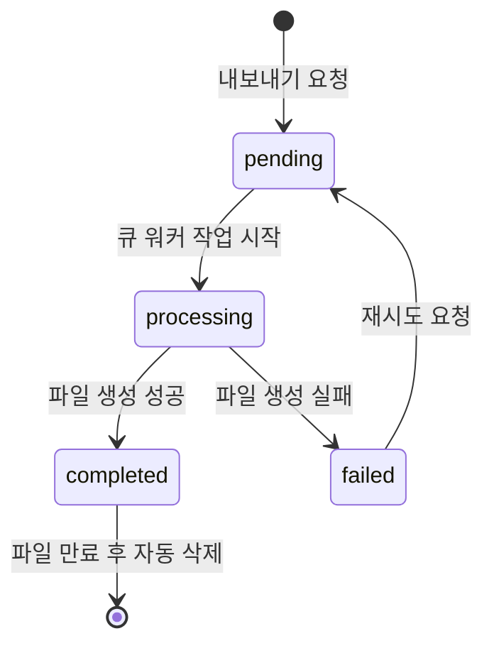

# 문서 내보내기 기능정의서

| 항목 | 값 |
|------|---|
| 제품 | AICM (KMS) |
| 문서 코드 | FD-EXP |
| 버전 | 1.1 |
| 작성일 | 2026-03-31 |
| 기준 문서 | FD-COM §7 (분리 전 원본), FD-DOC §2 블록 에디터, FD-DOC §5 공통 컨텐츠 |

---

## 1. 기능 개요

문서 상세 페이지에서 현재 열람 중인 `published` 문서를 외부 파일 형식으로 변환·다운로드하는 기능이다. 블록 에디터(Tiptap JSON)로 저장된 문서 본문을 대상 포맷으로 렌더링하며, 공통 컨텐츠 인라인 치환·숨김 블록 제외·접근 제한 블록 처리·워터마크 삽입 등 변환 전처리를 수행한다.

**지원 포맷**:

| 포맷 | MIME 타입 | 확장자 | 활성화 조건 |
|------|----------|--------|------------|
| PDF | `application/pdf` | `.pdf` | `lm:export.enabled_formats`에 `'pdf'` 포함 (기본 제공) |
| DOCX | `application/vnd.openxmlformats-officedocument.wordprocessingml.document` | `.docx` | `lm:export.enabled_formats`에 `'docx'` 포함 (기본 제공) |
| HTML | `text/html` | `.html` | `lm:export.enabled_formats`에 `'html'` 포함 (기본 제공) |
| Markdown | `text/markdown` | `.md` | `lm:export.enabled_formats`에 `'markdown'` 포함 (기본 제공) |

---

## 2. 비즈니스 규칙

### 2.1 내보내기 대상 및 권한

| BR-ID | 규칙 |
|-------|------|
| BR-EXP-001 | `published` 상태이며 `is_suspended = false`, `deleted_at IS NULL`인 문서만 내보내기 가능하다 |
| BR-EXP-002 | 내보내기 요청자는 해당 문서의 게시판에 대한 `VIEW` 권한을 보유해야 한다 ([FD-ACL](FD-ACL-권한체계.md) BoardPermission 참조) |
| BR-EXP-003 | 게시판 설정에서 내보내기 허용 여부를 개별 지정할 수 있다. 비허용 게시판의 문서는 내보내기 버튼이 비활성화된다 |
| BR-EXP-004 | `lm:export.enabled_formats`에 포함된 포맷만 선택 가능하다. 비활성 포맷은 UI에 표시하지 않는다 |

### 2.2 블록 타입별 변환 규칙

| BR-ID | 규칙 |
|-------|------|
| BR-EXP-010 | **텍스트 블록**: 인라인 서식(굵게, 기울임, 밑줄, 취소선, 코드, 하이라이트, 링크)을 대상 포맷의 동등한 서식으로 변환한다. 지원하지 않는 서식은 일반 텍스트로 폴백한다 |
| BR-EXP-011 | **헤딩 블록**: H1~H3을 대상 포맷의 헤딩 수준으로 변환한다. PDF/DOCX에서는 목차(TOC) 생성에 활용 가능하다 |
| BR-EXP-012 | **리스트 블록**: 순서 있는 목록(ol), 순서 없는 목록(ul), 체크리스트를 대상 포맷으로 변환한다. 체크리스트는 체크 상태(☑/☐)를 텍스트 또는 아이콘으로 표현한다 |
| BR-EXP-013 | **이미지 블록**: 이미지 URL을 참조하여 파일에 인라인 삽입한다. PDF/DOCX는 이미지를 임베드하고, HTML은 `` 태그로 삽입한다. Markdown은 `` 형식으로 변환한다. 캡션이 있으면 이미지 하단에 표시한다 |
| BR-EXP-014 | **테이블 블록**: 행/열 구조, 셀 병합, 헤더 행/열을 대상 포맷의 테이블로 변환한다. Markdown 셀 병합 미지원 시 병합 셀을 반복 출력한다 |
| BR-EXP-015 | **코드 블록**: 코드 내용과 언어 정보를 보존한다. PDF/DOCX에서는 고정폭 폰트 + 배경색으로 표시, HTML에서는 `<pre><code>` 태그, Markdown에서는 펜스드 코드 블록으로 변환한다 |
| BR-EXP-016 | **인용 블록**: 대상 포맷의 인용 스타일로 변환한다 (PDF/DOCX: 들여쓰기 + 좌측 테두리, HTML: `<blockquote>`, Markdown: `>`) |
| BR-EXP-017 | **구분선 블록**: 수평선으로 변환한다 (PDF/DOCX: 선 도형, HTML: `<hr>`, Markdown: `---`) |
| BR-EXP-018 | **파일 첨부 블록**: 첨부 파일명과 다운로드 URL을 텍스트 링크로 변환한다. 파일 바이너리는 내보내기 파일에 포함하지 않는다 |
| BR-EXP-019 | **임베드 블록**: 외부 URL을 텍스트 링크로 변환한다. YouTube 등 임베드 콘텐츠는 URL만 표시한다 |
| BR-EXP-020 | **콜아웃/알림 블록**: 유형(info, warning, danger, tip)에 따라 시각적 구분을 유지한다. PDF/DOCX에서는 배경색 + 아이콘 텍스트로 표현, HTML에서는 `<div class="callout-{type}">`, Markdown에서는 `> **{TYPE}**: ...` 형식으로 변환한다 |
| BR-EXP-021 | **접기(토글) 블록**: 내보내기 시 **펼친 상태**로 변환한다 — 접힌 콘텐츠도 내보내기 결과에 포함된다. HTML에서는 `<details><summary>` 태그로 변환하여 접기/펼치기를 유지할 수 있다 |
| BR-EXP-022 | **수학 수식 블록**: PDF/HTML에서는 렌더링된 수식 이미지 또는 MathML로 변환한다. DOCX에서는 OMML 수식으로 변환한다. Markdown에서는 LaTeX 원본(`$...$` 또는 `$$...$$`)을 유지한다 |

### 2.3 공통 컨텐츠 처리

| BR-ID | 규칙 |
|-------|------|
| BR-EXP-030 | 문서 본문에 삽입된 **공통 컨텐츠 인라인 참조**는 내보내기 시점의 **최신 본문으로 치환**(인라인 확장)하여 출력한다 — 참조 ID가 아닌 실제 내용이 파일에 포함된다 ([FD-DOC](FD-DOC-문서관리.md) §5 참조) |
| BR-EXP-031 | 공통 컨텐츠가 비활성(`is_active = false`) 상태인 경우, 비활성 시점의 마지막 본문으로 치환하되 `[비활성 공통 컨텐츠]` 경고 라벨을 함께 출력한다 |
| BR-EXP-032 | 공통 컨텐츠 조회 실패 시(삭제됨 등) 해당 위치에 `[공통 컨텐츠를 불러올 수 없습니다]` 플레이스홀더를 삽입하고, 내보내기는 중단하지 않는다 |

### 2.4 숨김 블록 및 접근 제한 블록 처리

| BR-ID | 규칙 |
|-------|------|
| BR-EXP-040 | `visible = false`인 블록(숨김 블록)은 내보내기 출력에서 **완전히 제외**한다 — 인쇄 동작([FD-DOC](FD-DOC-문서관리.md) §1.6)과 동일 |
| BR-EXP-041 | `Document.is_restricted = true`인 접근 제한 문서([FD-ACL](FD-ACL-권한체계.md) 문서 접근 제한 참조)는 내보내기 요청 시 요청자의 접근 권한을 확인한다. 문서 전체에 대한 접근이 불가하면 내보내기를 거부한다. 블록 단위 접근 제한은 ADR-012에서 제거되었다 |
| BR-EXP-042 | `embeddable = false`인 블록은 내보내기 대상에 포함한다 — `embeddable`은 RAG 임베딩 제어 플래그이며 내보내기와는 무관하다 |

### 2.5 워터마크

| BR-ID | 규칙 |
|-------|------|
| BR-EXP-050 | `lm:export.watermark_enabled = true`(기본)인 경우 PDF 내보내기 시 **워터마크를 자동 삽입**한다 |
| BR-EXP-051 | 워터마크 텍스트 기본값은 `pm:export.watermark_text`이며, 관리자가 [FD-SYS](FD-SYS-시스템설정.md) §3.6에서 변경할 수 있다 |
| BR-EXP-052 | 워터마크에는 텍스트와 함께 **요청자 이름**, **내보내기 일시**(YYYY-MM-DD HH:mm)가 자동으로 포함된다 — 인쇄 워터마크([FD-DOC](FD-DOC-문서관리.md) §1.6 BR-DOC-017)와 동일한 정보 구성 |
| BR-EXP-053 | 워터마크는 각 페이지에 대각선 방향으로 반투명하게 표시한다 |
| BR-EXP-054 | DOCX, HTML, Markdown 포맷에는 워터마크를 적용하지 않는다 |

### 2.6 내보내기 처리 방식

| BR-ID | 규칙 |
|-------|------|
| BR-EXP-060 | 블록 수가 `lm:export.async_threshold` 이하인 문서는 **동기 처리**하여 즉시 파일을 다운로드한다 |
| BR-EXP-061 | 블록 수가 `lm:export.async_threshold`를 초과하는 문서는 **비동기 처리**한다. ExportJob을 생성하고 BullMQ 큐에 등록하여 백그라운드에서 파일을 생성한다 |
| BR-EXP-062 | 비동기 처리 시 사용자에게 "내보내기를 준비 중입니다" 안내를 표시하고, 완료 시 인앱 알림으로 다운로드 링크를 제공한다 |
| BR-EXP-063 | 생성된 내보내기 파일은 오브젝트 스토리지(S3/MinIO)에 임시 저장하며, `lm:export.file_ttl_hours` 경과 후 자동 삭제한다 |
| BR-EXP-064 | 동일 사용자가 동일 문서에 대해 동일 포맷으로 처리 중인 ExportJob이 존재하면 중복 요청을 거부한다 |
| BR-EXP-065 | 내보내기 파일 크기가 `lm:export.max_file_size_mb`를 초과할 것으로 예상되면 내보내기를 거부하고 사유를 안내한다 |

### 2.7 비동기 큐 운영 규칙

| BR-ID | 규칙 |
|-------|------|
| BR-EXP-070 | 비동기 내보내기는 BullMQ 전용 큐(`export`)에서 처리한다. 큐명 접두사: `export.` |
| BR-EXP-071 | 워커 실패 시 **최대 3회** 자동 재시도한다. 재시도 간격은 지수 백오프(30초, 60초, 120초)를 적용한다 |
| BR-EXP-072 | 3회 재시도 후에도 실패하면 `status = 'failed'`로 전환하고, 해당 Job은 **DLQ(Dead Letter Queue)**로 이동한다. DLQ Job은 관리자가 모니터링 대시보드에서 확인할 수 있다 |
| BR-EXP-073 | `pending` 상태에서 `lm:export.job_max_wait_minutes`(기본 30분)이 경과하면 자동으로 `failed`로 전환하고 "처리 시간 초과" 사유를 기록한다 |
| BR-EXP-074 | 사용자 재시도 요청(failed → pending) 시 **새 ExportJob 행을 생성**한다. 기존 failed Job 행은 감사 추적을 위해 보존한다 |
| BR-EXP-075 | `completed` 상태의 ExportJob 행은 파일 만료(`expires_at`) 후에도 **삭제하지 않는다** — 파일(스토리지 객체)만 삭제하고 Job 행은 감사 이력으로 보관한다. Job 행 보관 기간은 감사 로그 보관 정책([FD-AUD](FD-AUD-감사로그.md))을 따른다 |

---

## 3. 데이터 모델

### 3.1 ExportJob 엔티티

비동기 내보내기 작업의 상태 추적을 위한 엔티티이다.

| 필드 | 타입 | 제약 | 설명 |
|------|------|------|------|
| `id` | UUID | PK | 내보내기 작업 고유 식별자 |
| `document_id` | UUID | FK(Document), NOT NULL | 대상 문서 |
| `document_version_number` | INTEGER | NOT NULL | 내보내기 시점의 문서 버전 번호 |
| `requested_by` | UUID | FK(User), NOT NULL | 요청자 |
| `format` | VARCHAR | NOT NULL | 내보내기 포맷: `'pdf'` \| `'docx'` \| `'html'` \| `'markdown'` |
| `status` | VARCHAR | NOT NULL, DEFAULT `'pending'` | 작업 상태: `'pending'` \| `'processing'` \| `'completed'` \| `'failed'` |
| `file_url` | VARCHAR | NULL | 생성된 파일의 스토리지 URL (`completed` 시 NOT NULL) |
| `file_size_bytes` | BIGINT | NULL | 생성된 파일 크기 |
| `error_message` | TEXT | NULL | 실패 사유 (`failed` 시 NOT NULL) |
| `expires_at` | TIMESTAMP | NULL | 파일 만료 시각 (`completed` 시 NOT NULL) |
| `created_at` | TIMESTAMP | NOT NULL | 요청 시각 |
| `completed_at` | TIMESTAMP | NULL | 완료 시각 |

**제약 조건**:
- `status = 'completed'`이면 `file_url`, `file_size_bytes`, `expires_at`이 NOT NULL
- `status = 'failed'`이면 `error_message`가 NOT NULL
- UNIQUE(`document_id`, `requested_by`, `format`) WHERE `status IN ('pending', 'processing')` — 동일 작업 중복 방지

### 3.2 ExportJob 상태 전이



| 상태 | 조건 | 설명 |
|------|------|------|
| **pending** | `status = 'pending'` | 큐 대기 중 — BullMQ에 등록된 상태 |
| **processing** | `status = 'processing'` | 변환 처리 중 — 워커가 블록 렌더링 수행 중 |
| **completed** | `status = 'completed'` | 완료 — 파일 다운로드 가능 |
| **failed** | `status = 'failed'` | 실패 — 에러 메시지와 함께 재시도 가능 |

---

## 4. 설정 가능 항목

[FD-SYS](FD-SYS-시스템설정.md) §3.6 내보내기 카테고리에 등록하는 설정 키 목록.

| 설정 항목 | config_key | 타입 | 기본값 | 설명 |
|-----------|------------|------|--------|------|
| 워터마크 기본 텍스트 | `pm:export.watermark_text` | string | `'대외비'` | PDF 워터마크 기본 텍스트 ([FD-SYS](FD-SYS-시스템설정.md) §3.6) |
| 비동기 처리 임계 블록 수 | `lm:export.async_threshold` | number | 100 | 이 값 초과 시 비동기 처리로 전환 |
| 내보내기 파일 보관 시간 | `lm:export.file_ttl_hours` | number | 24 | 생성된 파일의 스토리지 보관 시간(시간) |
| 최대 파일 크기 | `lm:export.max_file_size_mb` | number | 50 | 내보내기 결과 파일 최대 크기(MB) |
| Job 최대 대기 시간 | `lm:export.job_max_wait_minutes` | number | 30 | pending 상태 최대 대기 시간(분), 초과 시 자동 failed |
| 워터마크 활성화 | `lm:export.watermark_enabled` | boolean | true | PDF 워터마크 삽입 여부 |
| 활성 내보내기 포맷 | `lm:export.enabled_formats` | string[] | pdf, docx, html, markdown | 선택 가능한 포맷 목록 |

---

## 5. API 개요

> 주요 REST 엔드포인트와 요청/응답 형태를 정의한다. 상세 필드·유효성 규칙은 모듈 스펙에서 확정한다.

| 메서드 | 경로 | 요청/파라미터 | 응답 | 설명 |
|--------|------|--------------|------|------|
| POST | `/api/documents/{documentId}/export` | `ExportRequest` | 동기: 파일 스트림 / 비동기: `ExportJobResponse` | 내보내기 요청 (블록 수에 따라 동기/비동기 분기) |
| GET | `/api/export-jobs/{jobId}` | — | `ExportJobResponse` | 비동기 내보내기 작업 상태 조회 |
| GET | `/api/export-jobs/{jobId}/download` | — | 302 (프리사인드 URL 리다이렉트) | 완료된 내보내기 파일 다운로드 |

**주요 요청/응답 DTO**:

```
[ExportRequest]
- format: ENUM('pdf', 'docx', 'html', 'markdown') — 내보내기 포맷

[ExportJobResponse]
- jobId: UUID — 내보내기 작업 ID
- documentId: UUID — 대상 문서 ID
- format: VARCHAR — 요청 포맷
- status: ENUM('pending', 'processing', 'completed', 'failed')
- fileUrl: VARCHAR, NULL — 완료 시 다운로드 URL
- fileSizeBytes: BIGINT, NULL — 파일 크기
- errorMessage: TEXT, NULL — 실패 사유
- expiresAt: TIMESTAMP, NULL — 파일 만료 시각
- createdAt: TIMESTAMP — 요청 시각
- completedAt: TIMESTAMP, NULL — 완료 시각
```

**동기/비동기 분기 동작**:
- 동기(블록 수 ≤ `lm:export.async_threshold`): `POST` 응답으로 파일 스트림 즉시 반환 (`Content-Disposition: attachment`)
- 비동기(블록 수 > 임계치): `POST` 응답 `202 Accepted` + `ExportJobResponse`(status=`pending`). 완료 시 인앱 알림 발송

### 5.1 내보내기 이력 조회 API

| 메서드 | 경로 | 요청/파라미터 | 응답 | 설명 |
|--------|------|--------------|------|------|
| GET | `/api/export-jobs` | `page`, `size`, `status`, `format`, `from`, `to` | `Page<ExportJobResponse>` | 내 내보내기 이력 조회 |
| GET | `/api/admin/export-jobs` | `page`, `size`, `status`, `format`, `user_id`, `from`, `to` | `Page<ExportJobResponse>` | 전체 내보내기 이력 조회 (관리자) |

### 5.2 관리자 일괄 내보내기 API

| 메서드 | 경로 | 요청/파라미터 | 응답 | 설명 |
|--------|------|--------------|------|------|
| POST | `/api/admin/documents/bulk-export` | `BulkExportRequest` | `BulkExportJobResponse` | 여러 문서 일괄 내보내기 (ZIP) |

```
[BulkExportRequest]
- documentIds: UUID[] — 내보내기 대상 문서 ID 목록 (최대 50건)
- format: ENUM('pdf', 'docx', 'html', 'markdown') — 내보내기 포맷

[BulkExportJobResponse]
- jobId: UUID — 일괄 내보내기 작업 ID
- totalDocuments: integer — 대상 문서 수
- status: ENUM('pending', 'processing', 'completed', 'failed')
- createdAt: TIMESTAMP — 요청 시각
```

- 일괄 내보내기는 항상 비동기 처리하며, 완료 시 ZIP 파일로 인앱 알림 발송
- 한 건이라도 실패한 경우 성공 파일만 ZIP에 포함하고, 실패 목록을 별도 `errors.json`에 첨부

---

## 6. 에러 코드

내보내기 모듈의 비즈니스 규칙 위반 시 반환하는 에러 코드 카탈로그. 접두사 `EXP_`.

| 에러 코드 | 대응 BR | HTTP | 설명 |
|-----------|---------|------|------|
| `EXP_DOCUMENT_NOT_EXPORTABLE` | BR-EXP-001 | 403 | 내보내기 불가 상태의 문서 (비공개/삭제/회수) |
| `EXP_PERMISSION_DENIED` | BR-EXP-002 | 403 | 해당 게시판 VIEW 권한 없음 |
| `EXP_BOARD_EXPORT_DISABLED` | BR-EXP-003 | 403 | 게시판 내보내기 비허용 |
| `EXP_FORMAT_NOT_AVAILABLE` | BR-EXP-004 | 400 | 요청 포맷이 활성 포맷 목록에 없음 |
| `EXP_JOB_DUPLICATE` | BR-EXP-064 | 409 | 동일 문서·포맷의 내보내기 작업이 이미 진행 중 |
| `EXP_FILE_SIZE_EXCEEDED` | BR-EXP-065 | 413 | 예상 파일 크기 초과 |
| `EXP_JOB_NOT_FOUND` | — | 404 | 내보내기 작업을 찾을 수 없음 |
| `EXP_FILE_EXPIRED` | — | 410 | 다운로드 파일이 만료됨 (TTL 초과) |
| `EXP_RENDER_FAILED` | — | 500 | 블록 렌더링 중 내부 오류 |

---

## 7. 이벤트 계약

내보내기 모듈이 **발행**하는 도메인 이벤트. BullMQ 큐명 접두사 `export.`. 전달 보장: at-least-once (소비 측 멱등 필수). 이벤트 발행측에서 정의 (B5).

| 이벤트 | 발행 시점 | 페이로드 주요 필드 | 소비자 |
|--------|----------|-------------------|--------|
| `export.job.created` | 내보내기 요청 접수 | `jobId`, `documentId`, `requestedBy`, `format` | audit |
| `export.job.completed` | 파일 생성 완료 | `jobId`, `documentId`, `requestedBy`, `format`, `fileUrl`, `fileSizeBytes` | notification, audit |
| `export.job.failed` | 파일 생성 실패 | `jobId`, `documentId`, `requestedBy`, `format`, `errorMessage` | notification, audit |
| `export.file.expired` | 파일 만료 자동 삭제 | `jobId`, `documentId`, `fileUrl` | audit |

**소비하는 이벤트**:

내보내기 모듈은 외부 이벤트를 직접 소비하지 않는다 — 내보내기는 사용자 요청에 의해서만 트리거된다.

---

## 8. 비기능 요구사항

### 8.1 성능

| 항목 | 요구사항 |
|------|---------|
| 동기 내보내기 응답 | ≤ 5초 (블록 100개 이하 문서 기준) |
| 비동기 내보내기 완료 SLA | 요청 후 60초 이내 (블록 300개 기준) |
| 내보내기 큐 동시 처리 | 워커 수 `lm:embedding.worker_count` 설정과 별도로 내보내기 전용 큐에서 처리 |
| 파일 다운로드 | 생성된 파일은 오브젝트 스토리지에서 직접 다운로드(프리사인드 URL) — 애플리케이션 서버 부하 방지 |

### 8.2 보안

| 항목 | 요구사항 |
|------|---------|
| 다운로드 URL 보안 | 프리사인드 URL(서명된 임시 URL)로 제공하여 인증 없이도 만료 전까지 다운로드 가능. URL 만료 시간은 `lm:export.file_ttl_hours`와 동기화 |
| XSS 방지 | HTML 내보내기 시 사용자 입력 콘텐츠에 대한 새니타이징 적용 |
| 접근 제한 문서 | 요청자의 문서 접근 권한을 검증하여, 권한 없는 문서의 내보내기를 차단 |

### 8.3 감사 로그 연동

내보내기 모듈의 작업은 [FD-AUD](FD-AUD-감사로그.md) 감사 로그에 기록한다 (T3: 감사 비동기):

- **내보내기 요청**: 대상 문서 ID, 포맷, 요청자 — action: `document.exported`
- **파일 다운로드**: 다운로드 시점, 다운로드 사용자
- **파일 만료 삭제**: 자동 삭제 시점, 대상 파일

감사 이벤트는 `export.job.*` 도메인 이벤트를 audit 모듈이 소비하여 비동기로 기록한다.

---

## 9. 변환 파이프라인 개요

내보내기 요청 시 다음 순서로 블록을 전처리·변환한다:

```
1. 대상 문서 블록 목록 조회
2. 전처리
   ├── 숨김 블록 제외 (visible = false) [BR-EXP-040]
   ├── 접근 제한 문서 검증 [BR-EXP-041]
   └── 공통 컨텐츠 인라인 치환 [BR-EXP-030~032]
3. 블록 타입별 포맷 변환 [BR-EXP-010~022]
4. 후처리
   ├── 워터마크 삽입 (PDF + `lm:export.watermark_enabled`) [BR-EXP-050~054]
   └── 메타데이터 삽입 (문서 제목, 작성자, 내보내기 일시)
5. 파일 생성 및 저장
```

---

## 결정 사항

| 항목 | 결정 | 근거 | 일자 |
|------|------|------|------|
| FD-COM에서 분리 | **별도 FD-EXP로 독립** | 내보내기는 커뮤니티와 직접적 연관이 낮고, 블록 변환·파일 생성의 규모/복잡도가 독립 FD 수준 (B3 결정) | 2026-03-31 |
| 이벤트 정의 위치 | **발행측(export 모듈)에서 정의** | 이벤트 계약의 소유권을 발행 모듈에 부여하여 변경 영향 범위를 명확히 한다 (B5 결정) | 2026-03-31 |
| 감사 로그 처리 | **비동기 기록** | 내보내기 작업 성능에 영향을 주지 않도록 이벤트 기반 비동기 감사 처리 (T3 결정) | 2026-03-31 |
| 동기/비동기 분기 | **블록 수 기반 임계치로 분기** | 소규모 문서는 즉시 다운로드 UX 제공, 대규모 문서는 비동기로 서버 부하 방지 | 2026-03-31 |
| 워터마크 포맷 범위 | **PDF 전용** | DOCX/HTML/Markdown은 편집 가능 포맷이므로 워터마크 효력이 낮음 | 2026-03-31 |
| 접기 블록 내보내기 | **펼친 상태로 출력** | 내보내기 파일은 완전한 문서 사본이어야 하며, 접힌 콘텐츠가 누락되면 정보 유실 | 2026-03-31 |
| 파일 첨부 바이너리 | **미포함 — 링크만 제공** | 내보내기 파일 크기 폭증 방지, 첨부 파일은 별도 다운로드 | 2026-03-31 |
| 내보내기 파일 보관 | **TTL 기반 자동 삭제** | 스토리지 비용 억제, 보안상 장기 보관 불필요 | 2026-03-31 |

---

## 미결 사항

| ID | 항목 | 설명 |
|----|------|------|
| OPEN-EXP-01 | PDF 렌더링 엔진 | Puppeteer(Headless Chrome) vs wkhtmltopdf vs 전용 라이브러리 — 성능/품질/라이선스 비교 필요 |
| OPEN-EXP-02 | DOCX 변환 라이브러리 | docx(npm) vs Pandoc — Tiptap JSON → DOCX 변환 파이프라인 기술 선정 필요 |
| OPEN-EXP-03 | FD-SYS 설정 키 동기화 | `lm:export.async_threshold`, `lm:export.file_ttl_hours`, `lm:export.max_file_size_mb`, `lm:export.job_max_wait_minutes`가 FD-SYS §3.6에 미등록 — FD-SYS 갱신 필요 |
| OPEN-EXP-04 | 일괄 내보내기 | 여러 문서를 한 번에 내보내는 기능의 필요성 검토 (ZIP 묶음 등) |

---

## 관련 문서

| 문서 | 설명 |
|------|------|
| [FD-DOC-문서관리.md](FD-DOC-문서관리.md) | 블록 에디터(§2) — 14종 블록 타입 정의가 §2.2 변환 규칙(BR-EXP-010~022)의 입력 소스, 공통 컨텐츠(§5), 인쇄(§1.6) — 워터마크 구성(BR-DOC-017) 동일 |
| [FD-COM-커뮤니티.md](FD-COM-커뮤니티.md) | §7 문서 내보내기 — FD-EXP 분리 전 원본 |
| [FD-ACL-권한체계.md](FD-ACL-권한체계.md) | BoardPermission VIEW 권한, 블록 접근 제한 |
| [FD-SYS-시스템설정.md](FD-SYS-시스템설정.md) | §3.6 내보내기 설정 키 |
| [FD-AUD-감사로그.md](FD-AUD-감사로그.md) | `document.exported` 감사 액션 |
| [FD-NTF-알림.md](FD-NTF-알림.md) | 비동기 내보내기 완료 알림 |
