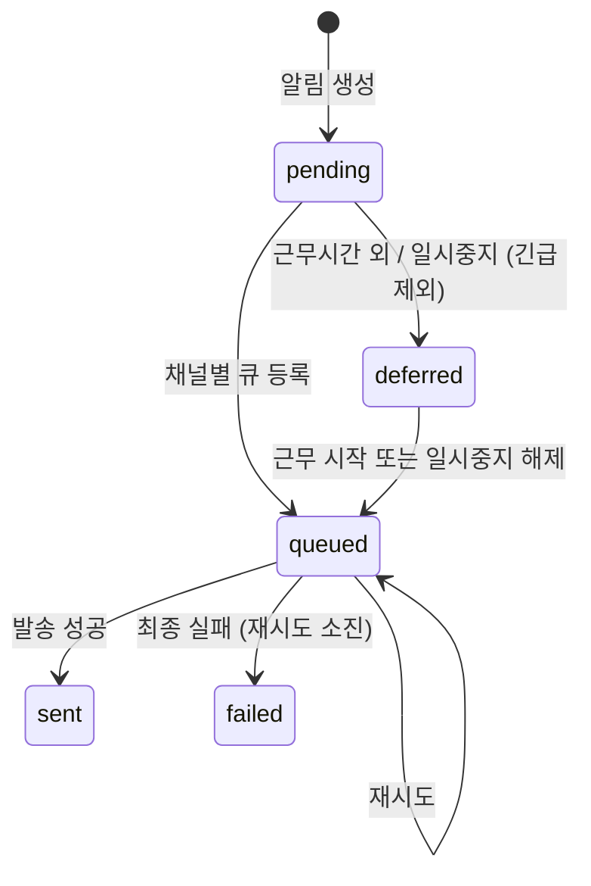

# 알림 기능정의서

| 항목 | 값 |
|------|---|
| 제품 | AICM (KMS) |
| 문서 코드 | FD-NTF |
| 버전 | 3.1 |
| 작성일 | 2026-03-31 |
| 기준 문서 | AICM 새 기능정의서 v1 §6, UC-PER-02 |

---

## 1. 알림 유형 및 채널

### 1.1 알림 유형

| # | 알림 유형 | 관련 도메인 | 기본 우선순위 |
|---|----------|------------|:----------:|
| 1 | 내 문서에 댓글이 달림 | [FD-COM](FD-COM-커뮤니티.md) §2 | 일반 |
| 2 | 내 댓글에 대댓글이 달림 | [FD-COM](FD-COM-커뮤니티.md) §2 | 일반 |
| 3 | 내 문서가 신고 처리됨 | [FD-COM](FD-COM-커뮤니티.md) §4 | 긴급 |
| 4 | 관심 게시판에 새 문서 등록 | [FD-DOC](FD-DOC-문서관리.md) §7 | 정보 |
| 5 | 시스템 공지사항 | — | 긴급/일반 (관리자 지정) |
| 6 | **[승인]** 새 승인 요청 도착 | [FD-APR](FD-APR-승인워크플로.md) §2 | 일반 |
| 7 | **[승인]** 승인됨 / 반려됨 (반려 사유 포함) | [FD-APR](FD-APR-승인워크플로.md) §5 | 일반 |
| 8 | **[승인]** N일 경과 미처리 리마인더 | [FD-APR](FD-APR-승인워크플로.md) §3 | 일반 |
| 9 | **[승인]** 철회 알림 | [FD-APR](FD-APR-승인워크플로.md) §4 | 일반 |
| 10 | **[승인]** CC 지정 / 상태 변경 | [FD-APR](FD-APR-승인워크플로.md) §2 | 정보 |
| 11 | **[예약배포]** 완료 / 실패 | [FD-APR](FD-APR-승인워크플로.md) §7 | 일반 |
| 12 | **[공통컨텐츠]** 수정 / 비활성 알림 | [FD-DOC](FD-DOC-문서관리.md) §5 | 일반 |
| 13 | **[임베딩]** 완료 묶음 알림 ("N건 검색 반영 완료") | [FD-EMB](FD-EMB-임베딩파이프라인.md) | 정보 |
| 14 | **[임베딩]** 실패 — 재시도 안내 | [FD-EMB](FD-EMB-임베딩파이프라인.md) | 일반 |
| 15 | **[임베딩]** 대량 재임베딩 현황 (관리자) | [FD-EMB](FD-EMB-임베딩파이프라인.md) | 정보 |
| 16 | **[드래프트]** 장기 방치 알림 | [FD-DOC](FD-DOC-문서관리.md) §3 | 정보 |
| 17 | **[AI]** 요약 완료 / 실패 | [FD-AI](FD-AI-AI어시스턴트.md) §1 | 정보 |
| 18 | **[AI]** 쿼터 임박 / 초과 (관리자) | [FD-AI](FD-AI-AI어시스턴트.md) §3 | 긴급 |
| 19 | **[유효기간]** 문서 유효기간 만료 임박 / 만료 | [FD-DOC](FD-DOC-문서관리.md) §1.3 | 일반 |
| 20 | **[모니터링]** 지표 임계치 초과 (경고/위험) | [FD-MON](FD-MON-시스템모니터링.md) §2.2 | 일반/긴급 (severity에 따라) |
| 21 | **[모니터링]** 서비스 상태 변경 — 장애/unreachable | [FD-MON](FD-MON-시스템모니터링.md) §2.1 | 긴급 |
| 22 | **[모니터링]** 지표 정상 복귀 | [FD-MON](FD-MON-시스템모니터링.md) §2.2 | 정보 |
| 23 | **[모니터링]** 미조치 에스컬레이션 | [FD-MON](FD-MON-시스템모니터링.md) §2.3 | 긴급 |
| 24 | **[모니터링]** 자동 조치 실패 | [FD-MON](FD-MON-시스템모니터링.md) §2.5 | 긴급 |
| 25 | **[모니터링]** 용량 소진 사전 경고 | [FD-MON](FD-MON-시스템모니터링.md) §2.10 | 일반 |
| 26 | **[모니터링]** 유지보수 모드 사전 안내 / 시작 | [FD-MON](FD-MON-시스템모니터링.md) §2.6 | 정보 |
| 27 | **[모니터링]** 유지보수 모드 종료 | [FD-MON](FD-MON-시스템모니터링.md) §2.6 | 정보 |
| 28 | **[모니터링]** 과다 알림 자동 억제 경고 | [FD-MON](FD-MON-시스템모니터링.md) §2.2 | 일반 |
| 29 | **[공지]** 공지 게시 | [FD-NTC](FD-NTC-공지사항.md) §2 | 긴급/일반 (관리자 지정) |
| 30 | **[공지]** 공지 수정 재게시 | [FD-NTC](FD-NTC-공지사항.md) §2.3 | 일반 |
| 31 | **[공지]** 읽음 확인 요청/리마인더 | [FD-NTC](FD-NTC-공지사항.md) §4 | 일반 |

### 1.2 알림 채널

| 채널 | 구분 | 설명 | 사용자 비활성화 |
|------|------|------|:---:|
| **인앱 알림** | 필수 | 앱 내 알림 센터, SSE 기반 실시간 푸시 | ✗ |
| **이메일** | 선택 | 사용자 등록 이메일로 알림 내용 발송 | ✓ (유형별) |
| **Web Push** | 선택 | 브라우저 알림 — 화면을 보고 있지 않을 때도 수신 | ✓ (유형별) |
| **웹훅** | 확장 | 외부 시스템 연동 (Slack, Teams, 커스텀 URL 등) | ✓ (유형별) |

- 인앱 알림은 항상 활성화되며 사용자가 끌 수 없다
- 이메일, Web Push, 웹훅은 유형별로 수신 여부를 설정할 수 있다
- 채널 추가 시 기존 코드 변경을 최소화하도록 채널 인터페이스를 추상화한다 (`NotificationChannel.send(notification)`)

### 1.3 알림 우선순위

| 우선순위 | 아이콘 | 적용 유형 | 동작 특성 |
|---------|--------|----------|----------|
| **긴급** | 붉은색 | #3 신고 처리, #5 시스템 공지(관리자 지정 시), #18 AI 쿼터 초과, #20 임계치 초과(critical), #21 서비스 장애, #23 에스컬레이션, #24 자동 조치 실패, #29 공지 게시(관리자 지정 시), 긴급 회수 알림, SLA 초과 승인, 보안 관련 | 목록 최상단 고정, 근무 시간대 무시하고 항상 발송, 야간에도 소리 알림 |
| **일반** | 파란색 | #1~2 댓글, #6~9 승인, #11 예약배포, #12 공통컨텐츠, #14 임베딩 실패, #19 유효기간, #20 임계치 초과(warning), #25 용량 소진 경고, #28 과다 알림 경고, #29 공지 게시(기본), #30 공지 수정, #31 읽음 확인 요청/리마인더 | 근무 시간대 내 발송, 야간 무음 적용 |
| **정보** | 회색 | #4 구독 새 문서, #10 CC 지정, #13 임베딩 완료, #15 재임베딩 현황, #16 드래프트 방치, #17 AI 요약 완료, #22 정상 복귀, #26 유지보수 시작, #27 유지보수 종료 | 근무 시간대 내 발송, 야간 무음 적용, 묶음 처리 우선 대상 |

- 관리자가 특정 알림 유형의 우선순위를 조정할 수 있다 (예: #5 시스템 공지를 긴급으로 지정)
- 읽지 않은 알림은 시각적으로 구분(굵은 글씨, 배경색 등)되며, 긴급 알림은 항상 목록 최상단에 고정 표시

---

## 2. 비즈니스 규칙

### [BR-NTF-001] 알림 우선순위 분류 규칙

- 19종 알림 유형은 각각 기본 우선순위(긴급/일반/정보)가 지정된다 (§1.3 참조)
- 긴급 알림은 알림 패널에서 항상 최상단에 고정 표시된다
- 관리자가 시스템 설정에서 특정 유형의 우선순위를 재지정할 수 있다
- 사용자는 우선순위를 변경할 수 없다

### [BR-NTF-002] 알림 묶음(배칭) 처리 규칙

- 10분 이내에 동일 유형 알림이 다수 발생하면 시스템이 하나의 묶음 알림으로 합산한다
- 묶음 판정 기준: **동일 수신자 + 동일 알림 유형 + 10분 시간 창**
- 묶음 알림 표시 형태: "○○ 게시판에 새 문서 10건이 게시되었습니다"
- 묶음 알림 클릭 시 해당 목록 페이지로 이동
- 긴급 우선순위 알림은 묶음 처리하지 않고 항상 개별 발송한다
- 묶음 대기 중인 알림은 시간 창이 종료되면 묶음으로 확정하여 발송한다

### [BR-NTF-003] 채널별 발송 규칙

- **인앱**: 모든 알림에 대해 항상 발송, 사용자 비활성화 불가
- **이메일**: 사용자 설정에서 유형별 on/off 제어
- **Web Push**: 사용자 설정에서 유형별 on/off 제어
- **웹훅**: 테넌트/사용자 단위로 웹훅 URL 설정 시에만 발송, 유형별 on/off 제어
- 관리자 강제 설정(BR-NTF-006)이 적용된 유형은 개인 설정과 관계없이 강제 발송

### [BR-NTF-004] 근무 시간대 발송 제어 규칙

- 사용자가 근무 시간대(예: 09:00~18:00, 22:00~06:00)를 지정할 수 있다
- 설정된 시간 외에는 이메일·Web Push 알림 발송을 보류하고, 인앱 알림만 누적한다
- **긴급 예외**: 긴급 우선순위 알림은 근무 시간대와 관계없이 항상 모든 채널로 발송한다
- **야간 무음 모드**: 관리자가 설정한 야간 시간대(예: 23:00~07:00)에는 Web Push 알림 소리가 자동 무음 처리된다. 긴급 알림만 소리와 함께 표시
- **근무 시작 시 요약 알림**: 근무 시작 시간에 "비근무 시간 중 N건의 알림이 도착했습니다" 요약 알림을 1건으로 발송한다. 요약 내 긴급 건은 별도 강조
- **관리자 일괄 설정**: 운영 관리자가 교대 근무 조별로 알림 수신 시간대를 일괄 설정할 수 있다

### [BR-NTF-005] 장기 부재 알림 일시 중지 규칙

- 사용자가 "알림 일시 중지"를 활성화하면 이메일·Web Push 발송이 보류된다
- 인앱 알림은 일시 중지 중에도 계속 누적된다
- 일시 중지 해제 시 중지 기간 중 누적된 알림을 "부재 중 알림" 묶음으로 제공한다
- 긴급 우선순위 알림은 일시 중지 중에도 이메일·Web Push로 발송된다

### [BR-NTF-006] 관리자 강제 설정 규칙

- 운영 관리자가 특정 알림 유형(예: 보안 공지, 긴급 시스템 알림)을 전체 사용자에 대해 강제 활성화할 수 있다
- 관리자 강제 설정은 사용자 개인 설정보다 우선 적용된다
- 강제 설정된 유형의 설정 항목에는 "관리자에 의해 설정됨" 표시가 나타나며, 사용자가 변경할 수 없다
- 관리자가 강제 설정을 변경하면 "관리자가 알림 설정을 변경했습니다" 알림이 대상 사용자에게 발송된다
- 강제 설정 가능 범위: 채널별 활성화/비활성화, 우선순위 재지정

### [BR-NTF-007] 알림 보관 및 삭제 규칙

- 인앱 알림은 90일 보관 후 자동 삭제된다
- 이메일·Web Push 알림은 발송 후 별도 보관하지 않는다 (발송 기록은 시스템 내부 로그로만 관리)
- 웹훅 전송 기록은 시스템 내부 로그로 관리하며, 재시도 이력을 포함한다
- 삭제된 알림은 복구할 수 없다

### [BR-NTF-008] 알림 대상 리소스 삭제 시 처리 규칙

- 알림이 참조하는 문서·승인 건이 삭제된 경우, 알림 클릭 시 "이 문서는 삭제되었습니다" 또는 "비공개 처리됨" 안내를 표시한다
- 알림 목록에서 해당 알림에 대상 상태("삭제됨", "비공개")를 표시한다
- 대상이 삭제되었다고 해서 알림 자체를 삭제하지는 않는다 — 알림 이력 보존

### [BR-NTF-009] 전체 읽음 처리 규칙

- "전체 읽음 처리" 시점 이전의 모든 미읽은 알림이 읽음으로 전환된다
- 전체 읽음 처리 시점 이후 도착한 알림은 미읽은 상태를 유지한다
- 개별 알림 클릭 시 해당 알림만 읽음 처리되며 대상 페이지로 이동한다

### [BR-NTF-010] 알림 발송 재시도 규칙

- **이메일**: 발송 실패 시 지수 백오프로 최대 3회 재시도 (1분, 5분, 15분)
- **Web Push**: 전송 실패 시 최대 2회 재시도 (1분, 5분)
- **웹훅**: 전송 실패 시 지수 백오프로 최대 5회 재시도 (1분, 5분, 15분, 60분, 240분)
- 최종 실패 시 해당 알림의 채널별 발송 상태를 `failed`로 기록한다
- 인앱 알림은 서버에서 직접 생성하므로 재시도 대상이 아니다

### [BR-NTF-011] 알림 멱등성 규칙

- 동일 이벤트의 중복 수신 시 알림 중복 생성을 방지한다
- 멱등성 키: `{eventType}:{eventId}:{recipientId}` 조합으로 중복 판별
- 중복 이벤트 수신 시 기존 알림을 반환하고 새 알림을 생성하지 않는다

---

## 3. 데이터 모델

### 3.1 Notification 엔티티

| 필드 | 타입 | 제약 | 설명 |
|------|------|------|------|
| `id` | UUID | PK | 알림 고유 식별자 |
| `recipient_id` | UUID | FK(User), NOT NULL | 수신자 |
| `type` | VARCHAR | NOT NULL, CHECK(19종) | 알림 유형 (§1.1 참조) |
| `priority` | ENUM('urgent', 'normal', 'info') | NOT NULL | 우선순위 |
| `title` | VARCHAR(200) | NOT NULL | 알림 제목 |
| `body` | TEXT | NULL | 알림 본문 |
| `target_type` | VARCHAR(50) | NULL | 대상 엔티티 유형 (document, approval, board 등) |
| `target_id` | UUID | NULL | 대상 엔티티 ID |
| `metadata` | JSONB | NULL | 추가 데이터 (발신자 정보, 컨텍스트 등) |
| `idempotency_key` | VARCHAR(255) | UNIQUE | 멱등성 키 — 중복 알림 방지 |
| `bundle_id` | UUID | FK(Notification), NULL | 묶음 알림인 경우 부모 알림 ID |
| `bundle_count` | INTEGER | DEFAULT 0 | 묶음에 포함된 개별 알림 수 |
| `is_read` | BOOLEAN | DEFAULT false | 읽음 여부 |
| `read_at` | TIMESTAMP | NULL | 읽음 시각 |
| `created_at` | TIMESTAMP | NOT NULL | 생성 시각 |
| `expires_at` | TIMESTAMP | NOT NULL | 자동 삭제 예정 시각 (created_at + 90일) |

### 3.2 NotificationDispatch 엔티티

채널별 발송 상태를 독립 추적한다.

| 필드 | 타입 | 제약 | 설명 |
|------|------|------|------|
| `id` | UUID | PK | 발송 기록 고유 식별자 |
| `notification_id` | UUID | FK(Notification), NOT NULL | 대상 알림 |
| `channel` | ENUM('in_app', 'email', 'web_push', 'webhook') | NOT NULL | 발송 채널 |
| `status` | ENUM('pending', 'deferred', 'queued', 'sent', 'failed') | NOT NULL, DEFAULT 'pending' | 발송 상태 |
| `deferred_until` | TIMESTAMP | NULL | 보류 해제 예정 시각 — status='deferred' 시 근무 시작 시간 또는 일시중지 종료 시각 |
| `retry_count` | INTEGER | DEFAULT 0 | 재시도 횟수 |
| `last_error` | TEXT | NULL | 마지막 실패 사유 |
| `sent_at` | TIMESTAMP | NULL | 발송 완료 시각 |
| `created_at` | TIMESTAMP | NOT NULL | 생성 시각 |

### 3.3 NotificationPreference 엔티티

사용자별 알림 유형-채널 설정.

| 필드 | 타입 | 제약 | 설명 |
|------|------|------|------|
| `id` | UUID | PK | 설정 고유 식별자 |
| `user_id` | UUID | FK(User), NOT NULL | 사용자 |
| `notification_type` | VARCHAR | NOT NULL | 알림 유형 |
| `email_enabled` | BOOLEAN | DEFAULT true | 이메일 수신 여부 |
| `web_push_enabled` | BOOLEAN | DEFAULT true | Web Push 수신 여부 |
| `webhook_enabled` | BOOLEAN | DEFAULT false | 웹훅 수신 여부 |
| `webhook_url` | VARCHAR(2048) | NULL | 웹훅 수신 URL — webhook_enabled=true 시 필수, 테넌트 공용 URL은 TenantSetting에서 상속 |
| `is_admin_forced` | BOOLEAN | DEFAULT false | 관리자 강제 설정 여부 |
| `updated_at` | TIMESTAMP | NOT NULL | 마지막 변경 시각 |

- UNIQUE(`user_id`, `notification_type`)
- `in_app_enabled` 필드 없음 — 인앱은 항상 활성이므로 설정 불필요

### 3.4 NotificationSchedule 엔티티

사용자별 근무 시간대 및 일시 중지 설정.

| 필드 | 타입 | 제약 | 설명 |
|------|------|------|------|
| `id` | UUID | PK | 설정 고유 식별자 |
| `user_id` | UUID | FK(User), UNIQUE | 사용자 (1인 1건) |
| `work_start_time` | TIME | NULL | 근무 시작 시간 (NULL이면 시간대 제한 없음) |
| `work_end_time` | TIME | NULL | 근무 종료 시간 |
| `timezone` | VARCHAR(50) | DEFAULT 'Asia/Seoul' | 시간대 |
| `is_paused` | BOOLEAN | DEFAULT false | 알림 일시 중지 여부 |
| `pause_start_at` | TIMESTAMP | NULL | 일시 중지 시작 시각 |
| `pause_end_at` | TIMESTAMP | NULL | 일시 중지 종료 예정 시각 |
| `updated_at` | TIMESTAMP | NOT NULL | 마지막 변경 시각 |

### 3.5 API/DTO 스키마

알림 모듈의 주요 API 요청·응답 DTO를 정의한다. 상세 엔드포인트 설계는 모듈 스펙(`docs/03-module-design/notification/api.md`)에서 정의한다.

#### 알림 목록 조회

```
[Request] GET /api/notifications
- Query Parameters:
  - page: integer (DEFAULT 1) — 페이지 번호
  - limit: integer (DEFAULT 20, MAX 100) — 페이지당 항목 수
  - is_read: boolean | null — 읽음 필터 (null이면 전체)
  - priority: 'urgent' | 'normal' | 'info' | null — 우선순위 필터
  - type: string | null — 알림 유형 필터

[Response] 200 OK
- items: NotificationDto[]
- total: integer — 전체 건수
- unread_count: integer — 미읽은 알림 수
```

```
[NotificationDto]
- id: UUID
- type: string — 알림 유형 (§1.1)
- priority: 'urgent' | 'normal' | 'info'
- title: string
- body: string | null
- target_type: string | null
- target_id: UUID | null
- is_read: boolean
- read_at: ISO8601 | null
- bundle_count: integer — 0이면 개별 알림, 1 이상이면 묶음
- created_at: ISO8601
```

#### 읽음 처리

```
[Request] PATCH /api/notifications/:id/read

[Response] 200 OK
- id: UUID
- is_read: true
- read_at: ISO8601
```

```
[Request] POST /api/notifications/read-all

[Response] 200 OK
- updated_count: integer — 읽음 전환된 알림 수
```

#### 알림 설정 조회·변경

```
[Request] GET /api/notifications/preferences

[Response] 200 OK
- preferences: NotificationPreferenceDto[]
- schedule: NotificationScheduleDto
```

```
[NotificationPreferenceDto]
- notification_type: string
- email_enabled: boolean
- web_push_enabled: boolean
- webhook_enabled: boolean
- webhook_url: string | null
- is_admin_forced: boolean — true이면 사용자 변경 불가
```

```
[Request] PUT /api/notifications/preferences
- preferences: { notification_type: string, email_enabled?: boolean, web_push_enabled?: boolean, webhook_enabled?: boolean, webhook_url?: string }[]
※ is_admin_forced=true인 유형 변경 시 NTF-004 에러 반환

[Response] 200 OK
- updated: NotificationPreferenceDto[]
```

```
[NotificationScheduleDto]
- work_start_time: 'HH:mm' | null
- work_end_time: 'HH:mm' | null
- timezone: string
- is_paused: boolean
- pause_end_at: ISO8601 | null
```

```
[Request] PUT /api/notifications/schedule
- work_start_time?: 'HH:mm' | null
- work_end_time?: 'HH:mm' | null
- timezone?: string
- is_paused?: boolean
- pause_end_at?: ISO8601 | null

[Response] 200 OK
- NotificationScheduleDto
```

#### 웹훅 설정 관리

```
[Request] GET /api/notifications/webhooks
[Response] 200 OK
- webhooks: WebhookConfigDto[]
```

```
[WebhookConfigDto]
- id: UUID
- notification_type: string — 알림 유형
- webhook_url: string — 웹훅 수신 URL
- is_active: boolean — 활성 여부
- secret: string | null — 서명 검증용 시크릿 (마스킹 표시)
- created_at: ISO8601
- updated_at: ISO8601
```

```
[Request] POST /api/notifications/webhooks
- notification_type: string — 알림 유형
- webhook_url: string — 웹훅 수신 URL (HTTPS 필수)
- secret?: string — 서명 검증용 시크릿
※ webhook_url이 유효하지 않으면 NTF-007 에러 반환

[Response] 201 Created
- WebhookConfigDto
```

```
[Request] PUT /api/notifications/webhooks/:id
- webhook_url?: string — 웹훅 수신 URL
- is_active?: boolean — 활성 여부
- secret?: string — 시크릿 변경

[Response] 200 OK
- WebhookConfigDto
```

```
[Request] DELETE /api/notifications/webhooks/:id
[Response] 204 No Content
```

```
[Request] POST /api/notifications/webhooks/:id/test
[Response] 200 OK
- status: 'success' | 'failed'
- response_code: integer | null — 대상 서버 HTTP 응답 코드
- response_time_ms: integer — 응답 시간
- error_message: string | null — 실패 시 사유
```

#### SSE 연결

```
[Request] GET /api/notifications/stream
- Headers: Accept: text/event-stream
- Query: last_event_id?: string — 재연결 시 마지막 수신 이벤트 ID

[SSE Event Format]
- event: notification
- id: {notificationId}
- data: NotificationDto (JSON)

- event: heartbeat
- data: { timestamp: ISO8601 }
```

- SSE 연결 수 초과 시 NTF-009 에러 반환 (§7 참조)
- 연결 끊김 시 클라이언트가 `last_event_id`를 포함하여 재연결하면 미수신 알림을 보충 전송한다

---

## 4. 알림 상태 모델

### 4.1 발송 상태 (NotificationDispatch.status)



| 상태 | 설명 | 전이 조건 |
|------|------|----------|
| `pending` | 알림 생성됨, 채널별 발송 대기 | 알림 생성 시 |
| `deferred` | 근무 시간대 외 또는 일시 중지로 보류됨 | 수신자가 근무 시간대 밖이거나 알림 일시 중지 중일 때 (긴급 알림 제외) |
| `queued` | BullMQ 큐에 등록됨, 발송 처리 중 | 즉시 발송 대상이거나, deferred 해제 시 |
| `sent` | 발송 성공 | 채널별 발송 완료 시 |
| `failed` | 최종 발송 실패 | 최대 재시도 횟수 소진 시 |

- `deferred` → `queued` 전이 시 `deferred_until` 값을 기준으로 BullMQ delayed job으로 스케줄한다
- 근무 시작 시 deferred 건이 다수이면 요약 알림(BR-NTF-004)으로 묶어 발송한다
- 긴급 우선순위 알림은 `deferred`를 거치지 않고 항상 `pending` → `queued`로 즉시 전이한다

### 4.2 읽음 상태 (Notification.is_read)

| 상태 | 설명 | 전이 조건 |
|------|------|----------|
| `unread` (is_read=false) | 미읽음 | 알림 생성 시 기본값 |
| `read` (is_read=true) | 읽음 | 사용자 알림 클릭 시, 또는 전체 읽음 처리 시 |

- 읽음 → 미읽음 역전이는 없다 (한번 읽으면 영구)
- 읽음 처리 시 `read_at` 타임스탬프가 기록된다

### 4.3 알림 생명주기

```
이벤트 수신 → 멱등성 검사 → Notification 생성
  → 묶음 대기 판정(BR-NTF-002)
    → [묶음 대상] → 묶음 집계 큐 → 시간 창 종료 시 묶음 확정
    → [개별 발송] → 채널 분기
  → 근무 시간대/일시 중지 판정(BR-NTF-004, BR-NTF-005)
    → [보류 대상] → Dispatch.status='deferred' → deferred_until 시각에 큐 전이 → 근무 시작 시 요약 발송
    → [즉시 발송] → 채널별 발송
      → 인앱: SSE 실시간 푸시 + DB 저장
      → 이메일: 이메일 큐 → 발송 → 성공/실패(재시도)
      → Web Push: 푸시 큐 → 발송 → 성공/실패(재시도)
      → 웹훅: 웹훅 큐 → 전송 → 성공/실패(재시도)
  → 사용자 클릭 → 읽음 전환
  → 90일 경과 → 자동 삭제(BR-NTF-007)
```

---

## 5. 설정 가능 항목

| 설정 항목 | 필드명 | 타입 | 기본값 | 설명 |
|-----------|--------|------|--------|------|
| 알림 묶음 시간 창 | `notification_bundle_window_minutes` | integer | 10 | 동일 유형 알림 묶음 판정 시간(분) |
| 인앱 알림 보관 기간 | `notification_retention_days` | integer | 90 | 인앱 알림 자동 삭제 기간(일) |
| 야간 무음 시작 | `notification_quiet_start` | time | 23:00 | 야간 무음 모드 시작 시간 |
| 야간 무음 종료 | `notification_quiet_end` | time | 07:00 | 야간 무음 모드 종료 시간 |
| 이메일 재시도 최대 횟수 | `notification_email_max_retry` | integer | 3 | 이메일 발송 실패 시 최대 재시도 |
| Web Push 재시도 최대 횟수 | `notification_webpush_max_retry` | integer | 2 | Web Push 전송 실패 시 최대 재시도 |
| 웹훅 재시도 최대 횟수 | `notification_webhook_max_retry` | integer | 5 | 웹훅 전송 실패 시 최대 재시도 |
| 근무 시작 요약 알림 | `notification_work_summary_enabled` | boolean | true | 근무 시작 시 비근무 시간 알림 요약 발송 여부 |

---

## 6. 이벤트 계약

알림 모듈은 본질적으로 **이벤트 소비자**이다. 다른 도메인에서 발행한 이벤트를 수신하여 알림을 생성·발송한다. 이벤트는 발행측 모듈에서 정의하며, 알림 모듈은 해당 이벤트를 구독한다.

### 6.1 소비하는 이벤트

| 알림 # | 트리거 이벤트 | 발행 모듈 | 페이로드 핵심 필드 |
|:------:|-------------|----------|-----------------|
| #1 | `comment.created` | CommunityModule | documentId, commentId, authorId, documentOwnerId |
| #2 | `comment.reply.created` | CommunityModule | commentId, replyId, authorId, parentCommentAuthorId |
| #3 | `report.processed` | CommunityModule | reportId, documentId, documentOwnerId, action |
| #4 | `document.published` | DocumentModule | documentId, boardId, title |
| #5 | `system.announcement.created` | AdminModule | announcementId, title, priority |
| #6 | `approval.requested` | ApprovalModule | approvalId, documentId, requesterId, approverIds |
| #7 | `approval.decided` | ApprovalModule | approvalId, documentId, decision(approved/rejected), reason |
| #8 | `approval.reminder` | ApprovalModule | approvalId, documentId, approverIds, daysPending |
| #9 | `approval.withdrawn` | ApprovalModule | approvalId, documentId, requesterId, approverIds |
| #10 | `approval.cc.assigned` | ApprovalModule | approvalId, documentId, ccUserIds |
| #11 | `scheduled-publish.completed` / `.failed` | ApprovalModule | documentId, scheduledAt, result |
| #12 | `shared-content.updated` / `.deactivated` | SharedContentModule | sharedContentId, affectedDocumentIds |
| #13 | `embedding.batch.completed` | AI AssistantModule | documentIds[], count |
| #14 | `embedding.failed` | AI AssistantModule | documentId, error |
| #15 | `embedding.bulk.progress` | AI AssistantModule | batchId, progress, total |
| #16 | `document.draft.stale` | DocumentModule | documentId, authorId, daysSinceLastEdit |
| #17 | `ai.summary.completed` / `.failed` | AI AssistantModule | documentId, result |
| #18 | `ai.quota.warning` / `.exceeded` | AI AssistantModule | tenantId, usage, limit |
| #19 | `document.expiry.warning` / `.expired` | DocumentModule | documentId, assigneeId, expiresAt |

- #4(구독 새 문서)는 `document.published` 이벤트 수신 후 해당 게시판 구독자 목록을 조회하여 수신자를 결정한다
- 이벤트 스키마의 소유권은 발행측 모듈에 있다 — 알림 모듈이 이벤트 구조를 변경할 수 없다

**발행측 이벤트 스펙 참조 문서** (큐명·DLQ·스키마 버전은 각 모듈이 정의):
- CommunityModule: `docs/03-module-design/community/events.md`
- DocumentModule: `docs/03-module-design/document/events.md`
- ApprovalModule: `docs/03-module-design/approval/events.md`
- AI AssistantModule: `docs/03-module-design/ai-assistant/events.md`
- AdminModule: `docs/03-module-design/admin/events.md`
- SharedContentModule: `docs/03-module-design/shared-content/events.md`

### 6.2 발행하는 이벤트

| 이벤트명 | 페이로드 핵심 필드 | 소비자 | 설명 |
|---------|-----------------|--------|------|
| `notification.created` | notificationId, recipientId, type, priority | LogEventModule | 알림 생성 시 감사 로그 수집용 |
| `notification.sent` | notificationId, channel, status | — | 채널별 발송 완료 (모니터링용) |
| `notification.bulk.read` | userId, count | — | 전체 읽음 처리 (모니터링용) |

### 6.3 이벤트 처리 규칙

| 항목 | 규칙 |
|------|------|
| 큐명 규칙 | 알림 모듈 내부 큐: `notification.dispatch.{channel}` (예: `notification.dispatch.email`). 소비 큐는 발행측 모듈 events.md에서 정의한 큐명을 그대로 구독 |
| DLQ | 각 채널 큐에 `{큐명}.dlq`를 설정하여 최종 실패 메시지를 보존 (예: `notification.dispatch.email.dlq`) |
| 재시도 정책 | 채널별 BR-NTF-010에 정의된 횟수·간격을 BullMQ job options로 설정 — 이메일 3회, Web Push 2회, 웹훅 5회 |
| 멱등성 키 | 소비 이벤트 수신 시 `{eventType}:{eventId}:{recipientId}` 키로 UNIQUE 제약 체크 (BR-NTF-011). 중복 시 기존 알림 ID를 로깅하고 무시 |
| 스키마 버전 | 이벤트 페이로드에 `schemaVersion` 필드가 포함된 경우, 알림 모듈은 지원하는 버전 범위를 검증하고 미지원 버전은 DLQ로 이동 |

---

## 7. 에러 코드

| 코드 | 설명 | HTTP 상태 | 관련 규칙 |
|------|------|----------|----------|
| `NTF-001` | 알림 목록 조회 실패 — 알림 서비스 일시 장애 | 503 | — |
| `NTF-002` | 알림 대상 리소스가 삭제됨 | 200 (알림 본문에 안내) | BR-NTF-008 |
| `NTF-003` | 알림 설정 저장 실패 | 500 | — |
| `NTF-004` | 관리자 강제 설정으로 변경 불가 | 403 | BR-NTF-006 |
| `NTF-005` | 이메일 발송 최종 실패 | — (내부) | BR-NTF-010 |
| `NTF-006` | Web Push 구독 등록 실패 | 400 | — |
| `NTF-007` | 웹훅 URL 유효성 검증 실패 | 400 | — |
| `NTF-008` | 웹훅 전송 최종 실패 | — (내부) | BR-NTF-010 |
| `NTF-009` | SSE 연결 수 초과 | 429 | — |
| `NTF-010` | 알림 ID 미존재 | 404 | — |
| `NTF-011` | 멱등성 키 충돌 — 동일 이벤트 중복 수신 | 200 (기존 알림 반환) | BR-NTF-011 |
| `NTF-012` | 묶음 집계 실패 — 묶음 시간 창 내 집계 장애 | — (내부) | BR-NTF-002 |
| `NTF-013` | 보류 큐 스케줄링 실패 — deferred 전이 또는 해제 오류 | — (내부) | BR-NTF-004, BR-NTF-005 |
| `NTF-014` | 보관 배치 삭제 실패 — 만료 알림 정리 배치 장애 | — (내부) | BR-NTF-007 |
| `NTF-015` | 전체 읽음 처리 실패 | 500 | BR-NTF-009 |
| `NTF-016` | Web Push 발송 최종 실패 | — (내부) | BR-NTF-010 |

---

## 8. 비기능 요구사항

### 8.1 실시간 전송

- 인앱 알림은 **SSE(Server-Sent Events)** 기반으로 실시간 전달한다
- 사용자가 앱에 접속하면 SSE 연결을 수립하고, 새 알림 발생 시 즉시 푸시한다
- SSE 연결이 끊어지면 클라이언트가 자동 재연결하고, 끊어진 동안의 미수신 알림을 보충 조회한다
- 사용자당 SSE 연결 수 제한: 최대 3개 (다중 탭 허용, 초과 시 가장 오래된 연결 종료)

### 8.2 이메일 발송 SLA

- 이벤트 발생 시점부터 이메일 발송 완료까지 허용 지연시간: 일반 알림 5분 이내, 긴급 알림 1분 이내
- 발송 실패 시 재시도 정책(BR-NTF-010)에 따라 처리
- 이메일 발송 인프라는 배포 환경에 따라 분기한다 (SaaS: 외부 이메일 서비스, 온프레미스: 고객사 SMTP)

### 8.3 보관 정책

- 인앱 알림: 90일 보관 후 BullMQ cron 배치로 자동 삭제
- 발송 기록(NotificationDispatch): 발송 후 30일 보관 (모니터링 및 디버깅용)
- 알림 테이블 무한 증가 방지를 위해 보관 기간 경과 데이터를 주기적으로 정리한다

### 8.4 감사 로그 연동

- 알림 생성/발송 이벤트는 **비동기**로 감사 로그에 수집된다 ([FD-AUD](FD-AUD-감사로그.md) 참조)
- 관리자의 알림 강제 설정 변경은 감사 로그에 before/after diff로 기록된다
- 감사 로그 수집 실패가 알림 발송을 차단하지 않는다

---

## 결정 사항

| 항목 | 결정 | 근거 |
|------|------|------|
| 인앱 알림 실시간 방식 | **SSE (Server-Sent Events)** | 알림은 서버→클라이언트 단방향 전달이므로 WebSocket의 양방향 오버헤드가 불필요. NestJS 네이티브 지원, 연결 비용 낮음 |
| 알림 채널 수 | **4채널** (인앱 + 이메일 + Web Push + 웹훅) | UC-PER-02의 "브라우저 알림"과 기존 "웹훅(확장)"을 모두 수용 |
| 이메일 발송 인프라 | **배포 환경별 분기** (Provider 패턴) | SaaS는 외부 이메일 서비스(SES, SendGrid 등), 온프레미스는 고객사 SMTP 서버 |
| 이벤트 정의 주체 | **발행측 모듈이 정의** | 알림 모듈은 이벤트 소비자 — 발행측이 이벤트 스키마를 소유하고 알림 모듈은 구독만 수행 |
| 알림 묶음 시간 창 | **10분** | UC-PER-02에서 명시한 규칙 기반. 관리자 설정으로 변경 가능 |
| 감사 로그 수집 방식 | **비동기** | 알림 발송 경로의 지연 방지 — 감사 로그 수집 실패가 알림 발송을 차단하지 않도록 |
| 웹훅 재시도 정책 | **지수 백오프 × 최대 5회** | 외부 시스템 장애 시 과부하 방지 + 장시간 장애에도 최종 전달 보장 |
| 채널 추상화 | **NotificationChannel 인터페이스** | 채널 추가 시(카카오톡, SMS 등) 기존 코드 변경 최소화 |
| 좋아요 알림 | **v1 미지원** | UC-PER-02에 '정보' 우선순위 예시로 언급되나, FD-COM에 좋아요 기능 자체가 미정의. 좋아요 기능 확정 시 §1.1에 유형 추가 예정 |
| 구독 일간 요약 | **v1 미지원** | UC-PER-03 대안 3c에서 '일간 요약' 빈도가 언급되나, 현재 묶음(10분 창, BR-NTF-002)으로 대응. 일간 배치 트리거·집계 규칙의 추가 복잡도 대비 효용이 낮아 후속 버전으로 연기 |
| 보류(deferred) 구현 방식 | **NotificationDispatch.status='deferred'** | 별도 엔티티 대신 기존 Dispatch 행에 상태를 추가하여 단일 테이블로 생명주기 추적. deferred_until + BullMQ delayed job으로 스케줄링 |

---

## 관련 문서

| 문서 | 설명 |
|------|------|
| [FD-APR-승인워크플로.md](FD-APR-승인워크플로.md) | 승인 관련 알림 (#6~#11) 트리거 |
| [FD-DOC-문서관리.md](FD-DOC-문서관리.md) | 구독/공통컨텐츠/드래프트/유효기간 알림 트리거 |
| [FD-EMB-임베딩파이프라인.md](FD-EMB-임베딩파이프라인.md) | 임베딩 완료/실패/진행 알림 트리거 |
| [FD-AI-AI어시스턴트.md](FD-AI-AI어시스턴트.md) | AI 요약/쿼터 알림 트리거 |
| [FD-AUD-감사로그.md](FD-AUD-감사로그.md) | 알림 관련 감사 로그 수집 |
| [UC-PER-개인영역.md](../usecases/user/UC-PER-개인영역.md) | UC-PER-02 (알림 확인 및 설정 관리) |
