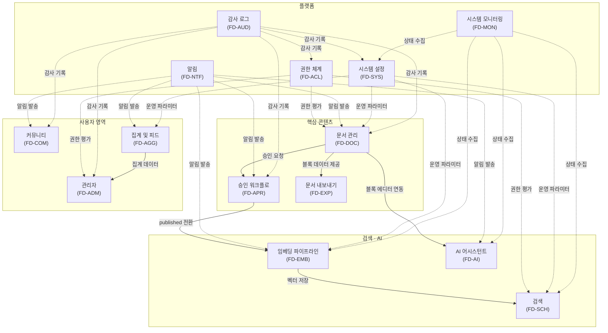

# AICM (KMS) 기능정의서

| 항목 | 값 |
|------|---|
| 제품 | AICM (KMS) |
| 버전 | 1.4 |
| 작성일 | 2026-03-31 |
| 수정일 | 2026-03-31 |
| 기준 문서 | AICM 새 기능정의서 v1 |

---

## 프로젝트 개요

### 솔루션 성격

AICM은 **AI 기반 지식 관리 시스템(KMS)**으로, AICC(AI Contact Center) 통합 패키지의 핵심 모듈이자 독립 운영 가능한 솔루션이다. 블록 에디터 기반 문서 작성, 승인 라인 템플릿 기반 승인 워크플로, 키워드/RAG 하이브리드 검색, AI 글쓰기 개선 등을 통해 정확하고 일관된 고객 응대를 지원한다.

- **AICC 통합 패키지**: 컨택센터 운영에 필요한 AI 상담, 지식 관리, 품질 관리 등을 통합 제공하는 패키지의 KMS 모듈로 동작
- **KMS 단독 운영**: AICC 없이 KMS만 독립적으로 도입·운영 가능 — 사내 지식 관리, 문서 관리, RAG 검색이 필요한 모든 조직에서 활용

### 대상 시장

| 구분 | 설명 |
|------|------|
| 비즈니스 모델 | **B2B** — 기업 고객 대상 납품/구독 |
| 대상 산업 | **산업 비한정** — 금융권, 공공기관, 제조, 유통, IT 등 KMS/AICC가 필요한 모든 산업군 |
| 주요 사용자 | 상담사, 지식 관리자, 운영 관리자, 팀 리더 등 |

### 배포 형태

두 가지 배포 환경을 **단일 코드베이스**로 지원한다.

| 배포 형태 | 설명 |
|-----------|------|
| **SaaS (클라우드)** | 멀티 테넌트 구조로 클라우드에서 서비스 제공. ECP 포털 연동으로 사용자/조직 관리, 테넌트별 격리 |
| **온프레미스 (폐쇄망)** | 고객사 인프라에 직접 설치. 외부 네트워크 차단 환경 대응, 자체 사용자/조직 관리 |

- 배포 환경에 따라 달라지는 부분(인증, 사용자 관리, LLM 프로바이더 등)은 **추상화 레이어(Provider 패턴)**로 분기 처리하여 코드베이스를 단일로 유지
- 온프레미스 환경에서는 외부 API 의존 없이 자체 LLM 모델(vLLM 등) 또는 고객사 허용 프로바이더를 사용할 수 있도록 LLM Orchestrator가 프로바이더 분기 담당

### 제품 구성

```
AICC 통합 패키지
├── AICM (KMS) ← 이 문서의 범위
│   ├── 문서 관리 (블록 에디터, 승인 워크플로우, 템플릿)
│   ├── 검색 (키워드 + RAG)
│   ├── AI 어시스턴트 (요약, 글쓰기 개선)
│   └── 관리자 도구
├── AI 상담 모듈 (별도)
├── 품질 관리 모듈 (별도)
└── LLM Orchestrator (공통 AI 인프라)
```

> **이 문서군은 AICM(KMS) 모듈의 기능 요구사항을 정의한다.** KMS 단독 도입 시에도 모든 기능이 적용되며, AICC 통합 패키지 내에서는 다른 모듈과 연동하여 확장된다.

---

## 도메인 전체 개요



---

## 기능정의서 문서 목록

| 파일 | 도메인 | 범위 |
|------|--------|------|
| [FD-DOC-문서관리.md](FD-DOC-문서관리.md) | 문서 관리 | CRUD, 블록 에디터, 자동저장, 템플릿, 공통 컨텐츠, URL, 게시판 트리, 태그, 담당자, 유효기간 |
| [FD-APR-승인워크플로.md](FD-APR-승인워크플로.md) | 승인 워크플로 | 승인 라인 템플릿 엔진, 다단계 승인, 철회, 긴급 발행, 예약 배포, Diff 비교 |
| [FD-EMB-임베딩파이프라인.md](FD-EMB-임베딩파이프라인.md) | 임베딩 파이프라인 | 임베딩 상태 관리, 상태별 전략, content_hash 기반 판단, 벡터 정리 |
| [FD-SCH-검색.md](FD-SCH-검색.md) | 검색 | 키워드 검색, RAG, 자동 청킹, 가시성 제어, RAG 고도화, 검색 튜닝 |
| [FD-AGG-집계피드.md](FD-AGG-집계피드.md) | 집계 및 피드 | 문서 집계, 트렌딩, 피드/구독, 홈 대시보드 |
| [FD-ACL-권한체계.md](FD-ACL-권한체계.md) | 권한 체계 | 자원 분류, 유효 역할·권한 합산, Role/Group, BoardPermission, AdminPermission, Restriction |
| [FD-COM-커뮤니티.md](FD-COM-커뮤니티.md) | 커뮤니티 | 자유게시판, 댓글, 좋아요, 신고, 북마크, 마이페이지 |
| [FD-NTF-알림.md](FD-NTF-알림.md) | 알림 | 알림 유형, 채널, 설정 |
| [FD-ADM-관리자.md](FD-ADM-관리자.md) | 관리자 | 관리 기능 목록, 권한 출처 조회 |
| [FD-SYS-시스템설정.md](FD-SYS-시스템설정.md) | 시스템 설정 | SystemConfig 데이터 모델, 카테고리별 설정 항목, 변경 규칙, DB 시딩 |
| [FD-AI-AI어시스턴트.md](FD-AI-AI어시스턴트.md) | AI 어시스턴트 | 문서 요약, 글쓰기 개선, 프롬프트 관리, 사용 이력/통계 |
| [FD-AUD-감사로그.md](FD-AUD-감사로그.md) | 감사 로그 | 감사 로그 유형, 조회/관리 |
| [FD-EXP-내보내기.md](FD-EXP-내보내기.md) | 문서 내보내기 | PDF, DOCX, HTML, Markdown 변환, 공통 컨텐츠 인라인 치환, 워터마크 |
| [FD-MON-시스템모니터링.md](FD-MON-시스템모니터링.md) | 시스템 모니터링 | 서비스 헬스, 큐 모니터링, 스토리지, AI 서비스, 알림/에스컬레이션, 유지보수 모드, 장애 분석 |

> **전체 규모**: 14개 FD, 약 240+ 비즈니스 규칙(BR), 약 120+ 에러 코드, 10개 설정 카테고리(FD-SYS), 60+ 이벤트 계약

---

## 도메인별 기능 요약

### 1. 문서 관리 (FD-DOC)

> 문서의 전체 생명주기 — CRUD, 블록 에디터, 자동 저장, 템플릿, 공통 컨텐츠, URL, 게시판 트리, 태그를 정의한다.

| 영역 | 핵심 규칙 요약 |
|------|--------------|
| 문서 상태 모델 | status 5단계(`draft`, `pending_review`, `approved_scheduled`, `published`, `archived`) + 운영 플래그(`is_suspended`, `deleted_at`) 분리 |
| 버전 관리 | `approval_required`·`versioning_enabled` 독립 설정 — 승인 필요 여부와 버전 이력 유지를 게시판별로 조합 |
| 블록 에디터 | Tiptap(ProseMirror 기반), 슬래시 명령, 14종 블록 타입, 드래그 앤 드롭, 점진적 로딩 |
| 자동 저장 | 노션 스타일 — 5~10초 유휴 감지 저장, 비관적 락킹으로 동시 편집 충돌 방지 |
| 템플릿 | 불변(immutable) 엔티티, 복제(clone) 방식 수정, 게시판별 기본 템플릿 지정 (허용 목록 제한 없음) |
| 공통 컨텐츠 | 인라인 참조, 항상 최신 버전, 수정 시 참조 문서 전체 재임베딩 트리거 |
| 게시판 트리 | 재귀 트리(parent_id) 무한 뎁스, 게시판 간 권한 비상속, 크로스보드 검색 지원 |
| 태그 | 자유 입력 + 자동완성, 문서당 최대 N개(시스템 설정 `lm:document.max_tags`(기본 10)), 관리자 병합/정리 |
| 문서 유효기간 | `expires_at` 만료 시 자동 `is_suspended` 전환 + 담당자 알림 |
| 법정 보존기간 관리 | RetentionPolicy 엔티티, `retention_expires_at` 미래 문서 삭제 차단, 폐기 승인 워크플로, 관리자가 활성화 가능 |

> 상세: [FD-DOC-문서관리.md](FD-DOC-문서관리.md)

### 2. 승인 워크플로 (FD-APR)

> 승인 라인 템플릿(ApprovalLineTemplate) 기반 다단계 승인 엔진 — 승인 요청, 다단계 승인/반려, 철회, 긴급 발행, 예약 배포, 승인 위임, 자동 반려를 정의한다.

| 영역 | 핵심 규칙 요약 |
|------|--------------|
| 승인 라인 엔진 | 코드 아닌 데이터(ApprovalLineTemplate·JSONB 단계)로 제어 — `ANY`/`ALL`/`COUNT` 유형 × 다단계 순차 조합 |
| 게시판 연결 | `Board.approval_required`로 승인 ON/OFF, `mandatory_approval_config`(JSONB)로 필수 승인자, `default_approval_template_id`로 기본 ApprovalLineTemplate 지정. 발행·재발행·삭제 동일 승인 규칙 적용. community 타입도 설정 가능 |
| 승인/반려 | 최종 단계 승인 = 즉시 `published` + 임베딩 실행, 반려 = `draft` 복귀 + 1단계부터 재시작 |
| 철회 | 상태 무관 항상 허용, 인앱 알림 + 전체 이력 기록 |
| 참조라인(CC) | 승인 건 단위 0~N명 참조자, 열람 + 비구속적 코멘트만 가능 |
| 긴급 발행 | `bypass_approval` AdminPermission, 사유 최소 10자 필수, 감사 로그 별도 기록 |
| 예약 배포 | 승인 시 배포 일시 지정 → `approved_scheduled` 중간 상태 → 스케줄러 실행 |
| 승인 위임 | 게시판별 위임, 기간 지정 필수, 재위임 금지, Phase 1 정식 기능 |
| 자동 반려 | SLA 타임아웃(`sla_hours` + `auto_reject_grace_hours`) 경과 시 자동 반려 |
| Diff 비교 | 블록 단위 diff — 좌우 비교 + 인라인 diff 전환, 변경 블록 네비게이션 |

> 상세: [FD-APR-승인워크플로.md](FD-APR-승인워크플로.md)

### 3. 임베딩 파이프라인 (FD-EMB)

> 문서 배포 시 비동기 청킹/임베딩 처리 — 상태 관리, content_hash 기반 증분 임베딩, 긴급 회수 전략을 정의한다.

| 영역 | 핵심 규칙 요약 |
|------|--------------|
| 임베딩 시점 | `published` 전환 시에만 수행 — `draft`/`pending_review`에서는 벡터 DB 미접근 |
| 상태 관리 | `embedding_status`: `pending` → `processing` → `completed`/`failed`/`partial` |
| 비동기 처리 | Bull(Redis) 큐, 우선순위: 신규 배포 > 문서 수정 > 공통 컨텐츠 대량 재임베딩 |
| content_hash | 블록별 SHA-256 해시 비교 → 변경 블록만 재임베딩, 전체 재처리 방지 |
| 긴급 회수 | 벡터 물리 삭제 없이 검색 시 메타데이터 필터로 즉시 제외 (비용 0, 즉시 반영) |
| 이중 필터링 | 벡터 DB 삽입 시점 + 검색 쿼리 시점 모두 status 필터 적용 (이중 안전장치) |
| 이전 버전 벡터 | 현재 발행본만 유지, 이전 발행본 벡터는 즉시 교체 (롤백 시 재임베딩) |

> 상세: [FD-EMB-임베딩파이프라인.md](FD-EMB-임베딩파이프라인.md)

### 4. 검색 (FD-SCH)

> 키워드 검색과 RAG AI 검색의 하이브리드 검색 — 자동 청킹, 가시성 제어, 검색 튜닝을 정의한다.

| 영역 | 핵심 규칙 요약 |
|------|--------------|
| 키워드 검색 | Elasticsearch/OpenSearch 기반, nori 형태소 분석, 자동완성/오타 교정/필터링 |
| RAG 검색 | 벡터 DB(Milvus) 시맨틱 검색 + BM25 키워드 검색 가중합산(RRF), LLM 답변 생성 + 출처 인용 |
| 자동 청킹 | 블록 타입별 최적 청킹 — 텍스트(의미 단위), 테이블(행 그룹), 이미지(멀티모달 분석), 코드(인접 설명 결합) |
| 템플릿 기반 청킹 | `template_id`에 따라 전략 분기 — FAQ는 Q&A 쌍 단위, SOP는 스텝 단위 |
| 가시성 제어 | 블록별 `embeddable`/`visible` 플래그, "임베딩O + 가시성X" 조합은 미허용(출처 검증 원칙) |
| RAG 고도화 | 표 구조 파싱(셀 병합 처리), 중첩 표 2depth 제한, 이미지 멀티모달 분석 |
| 검색 튜닝 | 관리자: 동의어/불용어/부스팅/RAG 파라미터, 사용자: 필터 프리셋/답변 스타일, Playground A/B 비교 |

> 상세: [FD-SCH-검색.md](FD-SCH-검색.md)

### 5. 집계 및 피드 (FD-AGG)

> 문서 집계 데이터, 트렌딩, 피드/구독, 홈 대시보드를 정의한다.

| 영역 | 핵심 규칙 요약 |
|------|--------------|
| 인기 문서 | 가중 스코어(`조회수 × W1 + 좋아요 × W2 + 댓글 × W3`), 일간/주간/월간 |
| 트렌딩 | 최근 7일(168시간, `lm:aggregation.trending_window_hours`) 조회수 증가율 200% 이상 + 최소 조회수 10건 이상 |

> FD-SYS §3.4 `lm:aggregation.trending_window_hours` 기본값이 168시간(7일)으로 정합 완료.
| 구독/피드 | 게시판 구독 → 새 문서 알림, 구독 게시판 통합 뉴스피드 |
| 홈 대시보드 | 11종 위젯(드래프트, 승인 대기, 최근 열람, 인기, 트렌딩, 구독, 자주 찾는 문서, 미해결 댓글, 만료 예정, 온보딩 가이드, 임베딩 현황) |
| 위젯 커스터마이징 | 드래그 앤 드롭 배치, on/off 토글, 역할별 기본 프리셋(열람 중심/승인권자/운영 등) |
| 집계 처리 | 배치/캐시 기반 — 트렌딩/인기 1시간, 통계 일 1회, Redis 캐시 |

> 상세: [FD-AGG-집계피드.md](FD-AGG-집계피드.md)

### 6. 권한 체계 (FD-ACL)

> 자원 3분류 기반 권한 모델 — Role, Group, BoardPermission, AdminPermission, 접근 제한을 정의한다.

| 영역 | 핵심 규칙 요약 |
|------|--------------|
| 자원 분류 | 문서 자원(Board-scoped), 관리 자원(Admin-scoped), 개인 자원(User-scoped) 3분류 |
| 인가 기준 | `BoardPermission`·`AdminPermission`·소유자·예외 규칙만 사용 — 외부 사용자 유형(system/admin/normal 등)은 인가에 사용하지 않음 |
| Role/Group | Role이 유일한 권한 경계, Group은 부모-자식 계층 구조 + 상위 그룹 역할 자동 상속, 합집합 모델(deny 없음) |
| BoardPermission | 게시판별 VIEW/EDIT/APPROVE 3가지 action, 게시판 간 권한 독립 |
| AdminPermission | 관리 영역별 이진 권한(`manage_boards`, `manage_teams` 등). Role에 매핑되면 외부 사용자 유형과 무관하게 적용 |
| 문서/블록 접근 제한 | `restricted = true` 시 화이트리스트(User/Group) 기반 제한, 시스템 설정 on/off |
| 개인 자원 | 본인만 접근; 타인 데이터는 정책상 `AdminPermission` 보유 시 메타정보만 VIEW(감사 로그). 서비스 신원 바이패스는 별도 정책 |

> 상세: [FD-ACL-권한체계.md](FD-ACL-권한체계.md)

### 7. 커뮤니티 (FD-COM)

> 자유게시판, 댓글, 좋아요, 신고, 북마크, 마이페이지를 정의한다. 문서 내보내기는 [FD-EXP](FD-EXP-내보내기.md)로 분리.

| 영역 | 핵심 규칙 요약 |
|------|--------------|
| 자유게시판 | `community` 타입 게시판, RAG 대상 제외, 기본값은 `approval_required = false`(필요 시 승인·버전 설정 가능) |
| 댓글 | 대댓글 1depth, 댓글 좋아요 미지원, 내 문서/댓글에 알림 |
| 좋아요 | 1인 1좋아요 토글, 인기 문서 랭킹 반영 |
| 신고 | 사유 5종(스팸/부적절/저작권/개인정보 노출/기타), 누적 시 자동 블라인드 |
| 북마크 | 폴더 분류(생성/이동/정렬), 문서 상태 추적(업데이트/삭제 표시) |
| 마이페이지 | 드래프트, 작성 문서, 승인 대기, 북마크, 좋아요, 열람 이력, 개인 설정 통합 |

> 상세: [FD-COM-커뮤니티.md](FD-COM-커뮤니티.md)

### 8. 알림 (FD-NTF)

> 시스템 전반의 알림 유형, 채널, 설정을 정의한다.

| 영역 | 핵심 규칙 요약 |
|------|--------------|
| 알림 유형 | 19종+α — 댓글(2), 신고(1), 구독(1), 공지(1), 승인(5), 참조(1), 예약배포(1), 공통컨텐츠(1), 임베딩(3), 드래프트(1), AI(2), 유효기간(1) |
| 알림 채널 | 4채널 — 인앱 알림(필수), 이메일(선택), Web Push(선택), 웹훅(확장) |
| 상태 관리 | 읽음/안읽음 상태, 안읽음 건수 배지, 개별/일괄 읽음 처리 |
| 사용자 설정 | 유형별 on/off, 채널별(인앱/이메일) 개별 설정 |

> 상세: [FD-NTF-알림.md](FD-NTF-알림.md)

### 9. 관리자 (FD-ADM)

> 시스템 전반의 관리 기능 목록과 권한 출처 조회를 정의한다.

| 영역 | 관리 대상 | 주요 기능 |
|------|----------|----------|
| 콘텐츠 인프라 | 게시판, 게시판 트리, 템플릿, 공통 컨텐츠, 태그 | CRUD, 계층 편집, 복제, 비활성, 병합 |
| 워크플로 | 승인 라인 템플릿, 승인 건, 예약 배포 | 단계 구성, 긴급 발행 이력, 예약 취소/변경 |
| 사용자/접근 | 사용자, 그룹, 역할/권한 | 그룹 CRUD, Role 할당, 유효 역할 조회, 권한 출처 역추적 |
| 검색/AI | 검색 튜닝, 임베딩 모니터링, AI 프롬프트 | Playground A/B, 큐 대시보드, 프롬프트 관리/통계 |
| 시스템 운영 | 시스템 설정, 감사 로그, 통계, 신고 | 업로드 제한, 보관 정책, 대시보드, 일괄 처리 |

> 상세: [FD-ADM-관리자.md](FD-ADM-관리자.md)

### 9-1. 시스템 설정 (FD-SYS)

> 서비스 전반의 운영 파라미터를 관리 — SystemConfig 데이터 모델, 카테고리별 설정 항목, 변경 규칙을 정의한다.

| 영역 | 핵심 규칙 요약 |
|------|--------------|
| SystemConfig | 운영 중 변경 — 수치 제한(`lm:`)/파라미터(`pm:`) 등 |
| 설정 카테고리 | 10개 카테고리 — system, document, approval, aggregation, audit, export, embedding, community, monitoring, ai (검색/파싱은 전용 엔티티 SearchConfig, ParsingConfig으로 관리) |
| 변경 권한 | `manage_system` AdminPermission |
| 하한선 보호 | 감사 로그 보관 기간 등 컴플라이언스 설정은 시스템이 정한 최소값 이하 하향 불가 |
| 감사 연동 | 모든 설정 변경은 before/after diff로 감사 로그 기록 |
| DB 시딩 | 앱 배포 시 SystemConfig 초기값 시딩, 기존 관리자 변경값은 미덮어쓰기 |

> `monitoring` 카테고리(FD-MON)와 `export` 추가 키(FD-EXP), `community` 추가 키(FD-COM)가 FD-SYS에 정합 완료되었다. `ai` 카테고리(FD-AI §13)도 포함.

> 상세: [FD-SYS-시스템설정.md](FD-SYS-시스템설정.md)

### 10. AI 어시스턴트 (FD-AI)

> AI 문서 요약, 글쓰기 개선, 프롬프트 관리, 사용 이력/통계를 정의한다.

| 영역 | 핵심 규칙 요약 |
|------|--------------|
| 자동 요약 | `published` 시점 백그라운드 생성, 요약 실패해도 게시 차단 안 함, `content_hash` 비교로 재생성 스킵 |
| 수동 요약 | 한줄 요약, 핵심 포인트, 섹션별 요약, 맞춤 요약 — 실시간 스트리밍 + 캐싱 |
| 글쓰기 개선 | 6종(문장 다듬기, 톤 변경, 간결/상세, 번역, 자유 지시), 단일/다중/전체 문서 적용 범위 |
| AI 수정 추적 | 미지원 — 승인 워크플로의 버전 diff로 충분, 별도 추적은 과잉 |
| 프롬프트 관리 | AICM 직접 관리(PromptSlot/PromptVersion), LLM 호출만 Orchestrator 경유 |
| 사용 이력 | Langfuse 트레이스, 👍/👎 피드백, 테넌트별 토큰 사용량/비용 집계 |

> 상세: [FD-AI-AI어시스턴트.md](FD-AI-AI어시스턴트.md)

### 11. 감사 로그 (FD-AUD)

> 금융권 컴플라이언스 대응 — 감사 로그 유형, 조회/내보내기, 보관 정책을 정의한다.

| 영역 | 핵심 규칙 요약 |
|------|--------------|
| 핵심 원칙 | 불변(immutable) — 수정/삭제 불가, 별도 저장소(`audit_logs`)에 기록 |
| 문서 변경 로그 | 생성/수정/삭제/복구/상태 변경, 승인 이력, 버전 변경, 예약 배포, 공통 컨텐츠 변경 |
| 권한 변경 로그 | 역할 할당/변경/해제, 퍼미션 수정, 그룹 구성원 변경 — before/after 스냅샷 |
| 관리자 액션 로그 | 게시판/템플릿/검색 튜닝/시스템 설정/AI 프롬프트 변경 — 설정 변경 diff 기록 |
| 인증 로그 | 로그인 성공/실패, 로그아웃, 세션 만료, 비정상 접근(브루트포스) 감지 |
| 보관 정책 | 기본 1년, 금융권 권장 5년, 콜드 스토리지 아카이빙 |

> 상세: [FD-AUD-감사로그.md](FD-AUD-감사로그.md)

### 12. 시스템 모니터링 (FD-MON)

> 애플리케이션 레벨 서비스의 가동 상태와 성능 지표를 수집·모니터링하여 장애를 선제적으로 감지하고 대응하는 기능을 정의한다. FD-ADM에서 분리.

| 영역 | 핵심 규칙 요약 |
|------|--------------|
| 서비스 헬스 | 3단계 상태 판정(healthy/warning/critical), 지표별 경고·위험 임계치 설정 |
| 큐 모니터링 | 전체 큐(임베딩, 승인, 알림 등)의 대기/처리중/실패 건수, 평균 처리 시간 |
| 알림 체계 | 임계치 초과 알림, 정상 복귀 알림, 반복 알림 방지(쿨다운), 과다 알림 자동 억제 |
| 에스컬레이션 | 미조치 시 재알림, 근무/비근무 시간대 별도 경로, 장애 등급별 대응 절차서 연동 |
| 자동 조치 | 관리자 등록 규칙 기반 자동 실행(캐시 초기화, 큐 재처리), 실패 시 수동 전환 |
| 유지보수 모드 | 알림 일시 중지, 사전 안내, SLA 일시 정지/재개, 사후 요약 |
| 장애 분석 | 포스트모템 보고서, MTTD/MTTR 자동 산출, 장애 패턴 분석, 용량 예측 |
| 대시보드 | SSE 기반 실시간 갱신, 개인 레이아웃, 역할별 프리셋, 팀 공유 |

> 상세: [FD-MON-시스템모니터링.md](FD-MON-시스템모니터링.md)

### 13. 문서 내보내기 (FD-EXP)

> 문서를 외부 포맷으로 변환·다운로드하는 기능을 정의한다. FD-DOC/FD-COM에서 분리.

| 영역 | 핵심 규칙 요약 |
|------|--------------|
| 지원 포맷 | PDF, DOCX, HTML, Markdown — 4종 |
| 공통 컨텐츠 처리 | 인라인 참조를 최신 본문으로 치환하여 내보내기 |
| 숨김 블록 처리 | `visible = false` 블록은 내보내기 출력에서 제외 |
| 워터마크 | PDF 내보내기 시 관리자 설정 워터마크(사용자명, 일시) 자동 삽입 |
| 감사 로그 | 내보내기 이력 감사 로그 기록 ([FD-AUD](FD-AUD-감사로그.md) 연동) |

> 상세: [FD-EXP-내보내기.md](FD-EXP-내보내기.md)

---

## 주요 결정 사항 요약

| 도메인 | 결정 | 근거 |
|--------|------|------|
| 문서 관리 | status 5단계 + 운영 플래그 분리 + 게시판별 `approval_required`·`versioning_enabled` 독립 설정 | 상태 상호 배타적으로 명확, 복합 상태 방지 |
| 문서 관리 | Tiptap 블록 에디터 + 비관적 락킹 | 1인 작성 후 승인 흐름, 동시 편집 불필요 |
| 문서 관리 | 템플릿 불변 + 복제 방식 | 버전 관리 대신 clone이 개념적으로 정확 |
| 승인 | 승인 라인 템플릿 기반 유연 승인 엔진 (ANY/ALL/COUNT × 다단계) | 고객사별 운영 규칙 자유 구성 |
| 승인 | 승인 = 배포 (자동) | 3단계 모델의 일관성 |
| 임베딩 | published 시점에만 임베딩 | 미검증 문서 RAG 노출 방지 |
| 검색 | 한국어 전용 + HWP 이중 파이프라인 | 금융권 컨택센터 KMS 대응 |
| 권한 | 자원 3분류 + Role 기반 합집합 모델 (deny 없음) | 권한 디버깅 복잡도 억제 |
| 문서 관리 | 법정 보존기간 관리 — 관리자가 활성화 가능 | 금융권 도입 등 규제 대응(투자권유 10년, 내부통제 5년)에 활용 |
| 문서 내보내기 | 별도 FD-EXP로 분리 | 내보내기는 문서 관리와 독립적인 변환/렌더링 로직 |
| AI | AI 수정 추적 미지원 — 버전 diff로 대체 | 승인 워크플로의 버전 diff가 변경 추적에 충분, 별도 ai_touched 플래그는 과잉 ([FD-AI](FD-AI-AI어시스턴트.md) BR-AI-008) |
| 감사 로그 | 불변(immutable) + 기본 1년/금융권 5년 보관 | 감사 로그 무결성 + 규제 대응 |
| 모니터링 | FD-ADM에서 FD-MON 분리 + SSE 기반 실시간 대시보드 | UC-ADM-18 독립 도메인 성격, 단방향 데이터 흐름에 적합 |
| 시스템 설정 | SystemConfig + 캐시+이벤트 무효화 | 운영 파라미터는 런타임 변경 |
| 알림 | SSE 인앱 알림 + 4채널 + NotificationChannel 추상화 | 서버→클라이언트 단방향, 채널 확장성 |
| 커뮤니티 | 좋아요 알림 미지원 + 신고 사유 5종 열거형 고정 | 업무 직결 알림 우선, 금융 KMS 컴플라이언스 |
| 집계 | 트렌딩 7일 윈도우 + config.changed 이벤트 캐시 무효화 | AICC 컨택센터 환경 + 설정 변경 즉시 반영 |

---

## 도메인 전체 비기능 요구사항 요약

> 각 도메인 FD에서 정의한 주요 비기능 요구사항을 인덱스 목적으로 요약한다. 정확한 수치와 조건은 각 FD를 참조.

| 도메인 | 항목 | 목표 | 참조 |
|--------|------|------|------|
| 관리 공통 | API 응답 시간 | 목록 2초, 상세 1초 (페이지네이션 적용) | [FD-ADM](FD-ADM-관리자.md) §1.19 |
| 관리 공통 | 동시 수정 제어 | OCC(낙관적 동시성 제어) 전체 적용 | [FD-ADM](FD-ADM-관리자.md) 결정사항 |
| 권한 | 권한 평가 응답 | 캐시 히트 < 50ms, 미스 < 200ms | [FD-ACL](FD-ACL-권한체계.md) §12 |
| 권한 | 유효 역할 계산 | < 100ms (10단계 계층) | [FD-ACL](FD-ACL-권한체계.md) §12 |
| 문서 | 자동 저장 간격 | 5~10초 유휴 감지 | [FD-DOC](FD-DOC-문서관리.md) §1.3 |
| 문서 | 동시 편집 제어 | 비관적 락킹 (1인 편집) | [FD-DOC](FD-DOC-문서관리.md) 결정사항 |
| 임베딩 | 파이프라인 처리 | 비동기, Bull(Redis) 큐, 우선순위 3단계 | [FD-EMB](FD-EMB-임베딩파이프라인.md) §1.6 |
| 감사 | 로그 기록 방식 | 비동기 — 운영 응답 지연 방지 | [FD-AUD](FD-AUD-감사로그.md) §1 |
| 감사 | 보관 기간 | 기본 1년, 금융권 5년, 하한선 보호 | [FD-AUD](FD-AUD-감사로그.md) §3 |
| 모니터링 | 데이터 수집 주기 | 30초 (설정 가능) | [FD-MON](FD-MON-시스템모니터링.md) §9 |
| 모니터링 | 대시보드 초기 로딩 | 3초 이내 | [FD-MON](FD-MON-시스템모니터링.md) §9 |
| 모니터링 | 알림 발송 지연 | 임계치 초과 후 5초 이내 | [FD-MON](FD-MON-시스템모니터링.md) §9 |

---

## 도메인 교차 참조

### 기능정의서(FD) ↔ 유즈케이스(UC) ↔ 프로세스 흐름도 매핑

| 기능정의서 | 유즈케이스 | 프로세스 흐름도 | 주요 BR 수 |
|-----------|-----------|----------------|:---------:|
| [FD-DOC](FD-DOC-문서관리.md) | [UC-DOC](../usecases/user/UC-DOC-문서관리.md) (UC-DOC-01~10) | [flows/document-lifecycle/](../flows/document-lifecycle/) | 40+ |
| [FD-APR](FD-APR-승인워크플로.md) | [UC-APR](../usecases/user/UC-APR-승인워크플로.md) (UC-APR-01~06) | [flows/approval-permission/](../flows/approval-permission/) | 30+ |
| [FD-EMB](FD-EMB-임베딩파이프라인.md) | UC-DOC, UC-SCH 일부 | [flows/search-rag/](../flows/search-rag/) | 26 |
| [FD-SCH](FD-SCH-검색.md) | [UC-SCH](../usecases/user/UC-SCH-검색.md) (UC-SCH-01~03) | [flows/search-rag/](../flows/search-rag/) | 31 |
| [FD-AGG](FD-AGG-집계피드.md) | [UC-PER](../usecases/user/UC-PER-개인영역.md) 일부 (UC-PER-05) | [flows/aggregation-feed/](../flows/aggregation-feed/) | 21 |
| [FD-ACL](FD-ACL-권한체계.md) | 전 도메인 교차 | [flows/approval-permission/04](../flows/approval-permission/04-permission-evaluation.md) | 35+ |
| [FD-COM](FD-COM-커뮤니티.md) | [UC-COM](../usecases/user/UC-COM-커뮤니티.md) (UC-COM-01~05) | — | 38 |
| [FD-NTF](FD-NTF-알림.md) | [UC-PER](../usecases/user/UC-PER-개인영역.md) 일부 (UC-PER-02) | [flows/notification/](../flows/notification/) | 11 |
| [FD-ADM](FD-ADM-관리자.md) | [UC-ADM](../usecases/admin/README.md) (UC-ADM-01~17) | [flows/admin-settings/](../flows/admin-settings/) | 6 |
| [FD-EXP](FD-EXP-내보내기.md) | [UC-DOC](../usecases/user/UC-DOC-문서관리.md) 일부 (UC-DOC-08) | — | 22 |
| [FD-MON](FD-MON-시스템모니터링.md) | [UC-ADM](../usecases/admin/UC-ADM-시스템모니터링.md) (UC-ADM-18) | — | 26 |
| [FD-AI](FD-AI-AI어시스턴트.md) | [UC-AI](../usecases/user/UC-AI-AI어시스턴트.md) (UC-AI-01~04) | [flows/ai-assistant/](../flows/ai-assistant/) | 36 |
| [FD-SYS](FD-SYS-시스템설정.md) | [UC-ADM](../usecases/admin/UC-ADM-시스템운영.md) 일부 (UC-ADM-15) | [flows/admin-settings/](../flows/admin-settings/) | 13 |
| [FD-AUD](FD-AUD-감사로그.md) | [UC-ADM](../usecases/admin/UC-ADM-시스템운영.md) 일부 (UC-ADM-08) | [flows/log-event/](../flows/log-event/) | 7 |

### 원본 섹션 번호 → 분리 파일 매핑

| 원본 섹션 | 분리 파일 |
|-----------|----------|
| §0 프로젝트 개요 | README.md (이 파일) |
| §1.1~1.3 문서 CRUD/에디터/자동저장 | [FD-DOC](FD-DOC-문서관리.md) §1~3 |
| §1.4 승인 워크플로우 | [FD-APR](FD-APR-승인워크플로.md) §1~8 |
| §1.5~1.7 템플릿/공통컨텐츠/URL | [FD-DOC](FD-DOC-문서관리.md) §4~6 |
| §1.8~1.9 임베딩 파이프라인 | [FD-EMB](FD-EMB-임베딩파이프라인.md) §1~2 |
| §1.10~1.11 게시판트리/태그 | [FD-DOC](FD-DOC-문서관리.md) §7~8 |
| §2 검색 | [FD-SCH](FD-SCH-검색.md) §1~6 |
| §3 집계 및 피드 | [FD-AGG](FD-AGG-집계피드.md) §1~2 |
| §4 권한 체계 | [FD-ACL](FD-ACL-권한체계.md) §1~8 |
| §5 커뮤니티 기능 | [FD-COM](FD-COM-커뮤니티.md) §1~6, 내보내기는 [FD-EXP](FD-EXP-내보내기.md)로 분리 |
| §6 알림 | [FD-NTF](FD-NTF-알림.md) §1 |
| §7 관리자 페이지 | [FD-ADM](FD-ADM-관리자.md) §1~2, [FD-SYS](FD-SYS-시스템설정.md) §1~7 |
| §8 AI 어시스턴트 | [FD-AI](FD-AI-AI어시스턴트.md) §1~4 |
| §9 감사 로그 | [FD-AUD](FD-AUD-감사로그.md) §1~3 |
| — (FD-DOC §10에서 분리) | [FD-EXP](FD-EXP-내보내기.md) — 문서 내보내기 |
| — (신규 UC-ADM-18) | [FD-MON](FD-MON-시스템모니터링.md) — 시스템 모니터링 |
| 결정 사항 | 각 도메인 파일 말미에 분산 배치 |

---

## 관련 문서

| 문서 | 설명 |
|------|------|
| [유즈케이스 문서](../usecases/README.md) | 51개 UC 매트릭스, 역할 정의, 도메인별 요약 |
| [유즈케이스 권한 요약](../usecases/usecase-permissions-summary.md) | UC별 필요 권한 매트릭스 |
| [모듈별 상세 설계](../../03-module-design/) | 모듈 단위 API 스펙, 비즈니스 규칙, 이벤트/큐 연동 상세 |
| [자원 분류 설계](../../02-architecture/resource-classification.md) | 문서/관리/개인 자원 분류, 권한 평가 흐름 |
| [인가 아키텍처](../../02-architecture/04-permission-architecture.md) | 자원 분류, AdminPermission 카탈로그, 권한 평가 흐름 |
| [승인/권한 흐름도](../flows/approval-permission/) | 승인 시나리오, 권한 평가 다이어그램 |
| [검색/RAG 흐름도](../flows/search-rag/) | 파싱→청킹→임베딩→검색 파이프라인 |
| [문서 생명주기 흐름도](../flows/document-lifecycle/) | 문서 상태 전이, 버전 관리, 유효기간, 회수, 삭제 |
| [알림 디스패치 흐름도](../flows/notification/) | 알림 파이프라인, 채널 분기, 사용자 설정 |
| [AI 어시스턴트 흐름도](../flows/ai-assistant/) | 요약/개선/태그추천 파이프라인, 쿼터 관리 |
| [집계/피드 흐름도](../flows/aggregation-feed/) | 인기/트렌딩 계산, 위젯, 구독 피드 |
| [감사·접근 로그 흐름도](../flows/log-event/) | 감사 로그 수집, 불변성 보장, 조회/내보내기 |
| [관리자 설정 흐름도](../flows/admin-settings/) | 설정 변경 전파, SearchConfig 동기화, nori 배포 |
