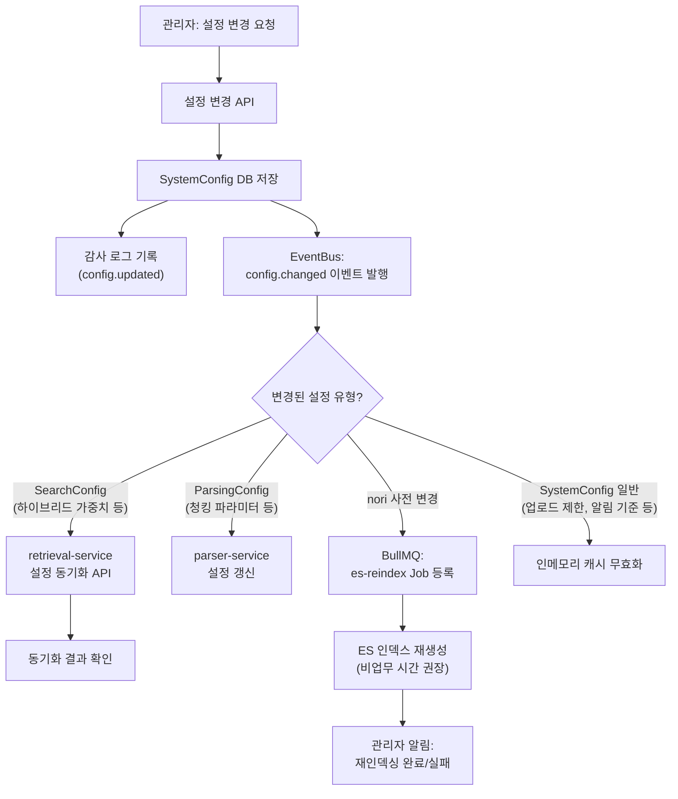
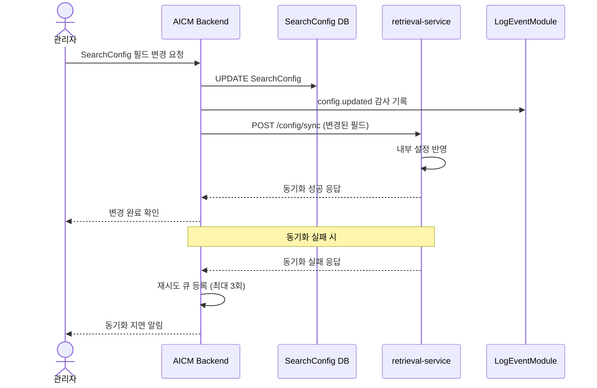
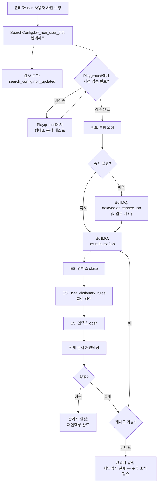

> **문서 상태**
> | 항목 | 값 |
> |------|-----|
> | 상태 | `draft` |
> | 검수 | `unreviewed` |
> | 작성일 | 2026-03-26 |
> | 최종 수정 | 2026-03-26 |

# 관리자 설정 변경 전파 흐름

## 범위

SystemConfig 변경 시 영향받는 서비스로의 전파 흐름, 검색 설정(SearchConfig) 동기화, 파싱 설정(ParsingConfig) 반영, nori 사전 배포 등 연쇄 효과를 다룬다. 설정 엔티티의 필드 정의는 [데이터 아키텍처 — SystemConfigModule](../../../03-module-design/system-config/data.md)에서 정의하며, 이 문서는 **"설정이 변경되면 어떤 흐름으로 전파되는가"**에 집중한다.

## 기능정의서 참조

| 참조 | 범위 |
|------|------|
| [FD-SYS](../../features/FD-SYS-시스템설정.md) §1~7 | SystemConfig 데이터 모델, 카테고리별 설정 항목, 변경 규칙 |
| [FD-ADM](../../features/FD-ADM-관리자.md) §1 | 관리 기능 목록, 설정 관리 UI |
| [FD-SCH](../../features/FD-SCH-검색.md) §6 | 검색 튜닝 — SearchConfig 연동 |

---

## 1. 설정 변경 전파 조감도

---

## 2. SearchConfig 변경 동기화 상세

### 동기화 대상 필드

| SearchConfig 컬럼 | retrieval-service 매핑 | 설명 |
|-------------------|----------------------|------|
| `rag_hybrid_bm25_weight` | `hybrid_weight_bm25` | 하이브리드 BM25 가중치 |
| `rag_hybrid_vector_weight` | `hybrid_weight_vector` | 하이브리드 벡터 가중치 |
| `rag_rrf_k` | `rrf_k` | RRF 상수 |
| `rag_rerank_enabled` | `reranking_enabled` | 리랭킹 활성화 |
| `rag_rerank_model` | `reranking_model` | 리랭킹 모델 식별자 |
| `rag_top_k` | `retrieval_top_k` | 1차 검색 top-K |
| `rag_similarity_threshold` | `similarity_threshold` | 유사도 임계값 |

---

## 3. nori 사전 배포 흐름

> **nori 사전 변경의 비용**: 사용자 사전은 ES 인덱스 타임에 적용되므로, 기존 인덱싱된 문서에는 새 사전이 반영되지 않는다. 사전 변경 후 전체 문서 재인덱싱이 필수이며, 문서 규모에 따라 수십 분~수 시간이 소요될 수 있다. — [04-search-tuning.md](../search-rag/04-search-tuning.md) §3 참조

---

## 4. 설정 카테고리별 영향 범위

| 설정 카테고리 | 설정 키 예시 | 영향받는 모듈 | 전파 방식 |
|-------------|------------|-------------|----------|
| 파일 업로드 제한 | `lm:system.max_file_size_mb` | DocumentModule | 인메모리 캐시 무효화 |
| 알림 기준 | `pm:notification.approval_reminder_days` | NotificationModule | 인메모리 캐시 무효화 |
| 인기 스코어 가중치 | `pm:aggregation.popularity_weight_*` | AggregationModule | Redis 캐시 재계산 트리거 |
| 드래프트 방치 기준 | `pm:document.draft_stale_days` | NotificationModule | 인메모리 캐시 무효화 |
| 감사 로그 보관 | `pm:audit.retention_days` | LogEventModule | 아카이빙 배치 Job 주기 갱신 |
| 검색 파라미터 | SearchConfig 전용 테이블 | retrieval-service | REST API 동기화 |
| 파싱 파라미터 | ParsingConfig 전용 테이블 | parser-service | REST API 동기화 |
| nori 사전 | `SearchConfig.kw_nori_user_dict` | ES 인덱스 | 재인덱싱 Job |

---

## 5. 설정 변경 감사 기록

모든 설정 변경은 감사 로그에 기록된다.

| resource_type | action | details 주요 필드 |
|---------------|--------|------------------|
| `system_config` | `config.updated` | `config_key`, `old_value`, `new_value`, `category` |
| `search_config` | `search_config.updated` | `changed_fields[]`, `old_values`, `new_values` |
| `search_config` | `search_config.nori_updated` | `added_words[]`, `removed_words[]` |
| `parsing_config` | `parsing_config.updated` | `changed_fields[]`, `old_values`, `new_values` |

---

## 관련 문서

| 문서 | 이 도메인과의 관계 |
|------|------------------|
| [FD-SYS-시스템설정.md](../../features/FD-SYS-시스템설정.md) | SystemConfig 데이터 모델, 카테고리별 설정 정의 |
| [FD-ADM-관리자.md](../../features/FD-ADM-관리자.md) | 관리자 설정 UI, 권한 |
| [UC-ADM-시스템운영.md](../../usecases/admin/UC-ADM-시스템운영.md) | UC-ADM-15 시스템 운영 설정 관리 |
| [검색 튜닝 전략](../search-rag/04-search-tuning.md) | SearchConfig 동기화 상세, nori 사전 배포 체크리스트 |
| [데이터 아키텍처 — SystemConfigModule](../../../03-module-design/system-config/data.md) | SystemConfig 엔티티 DDL |
| [데이터 아키텍처 — SearchConfigModule](../../../03-module-design/search-config/data.md) | SearchConfig/ParsingConfig 엔티티 DDL |
| [비동기 이벤트 아키텍처](../../../02-architecture/04-async-event-architecture.md) | BullMQ es-reindex Job 설계 |
