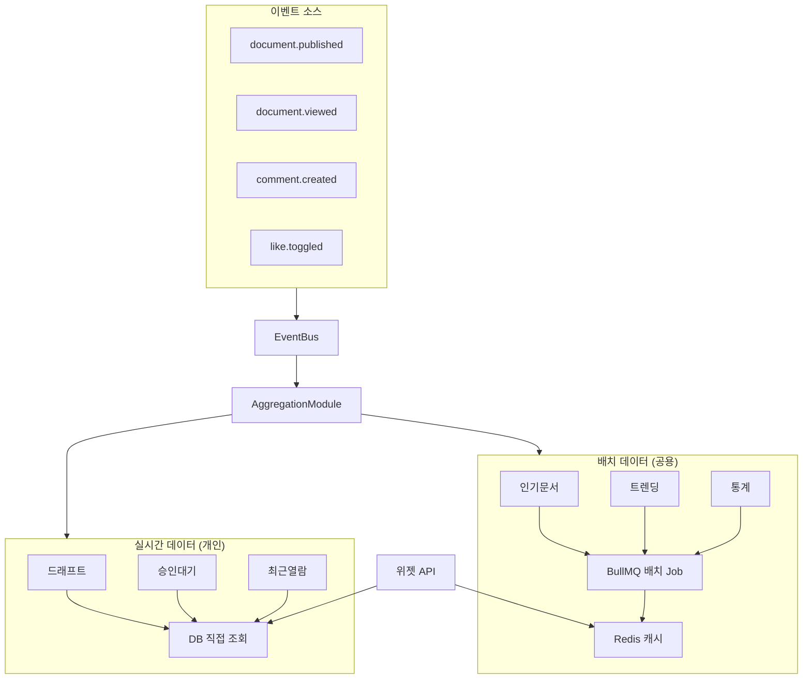
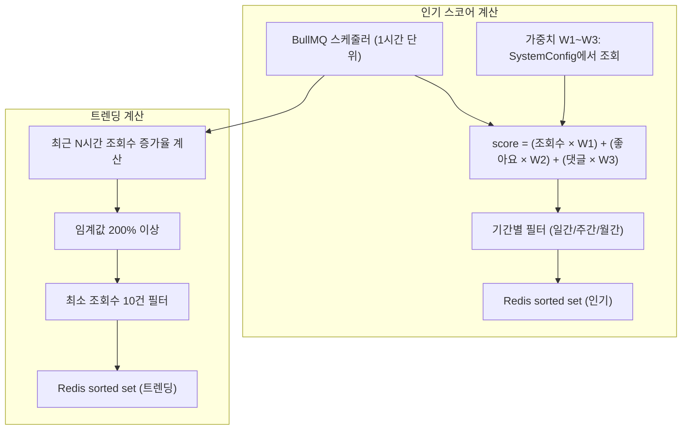
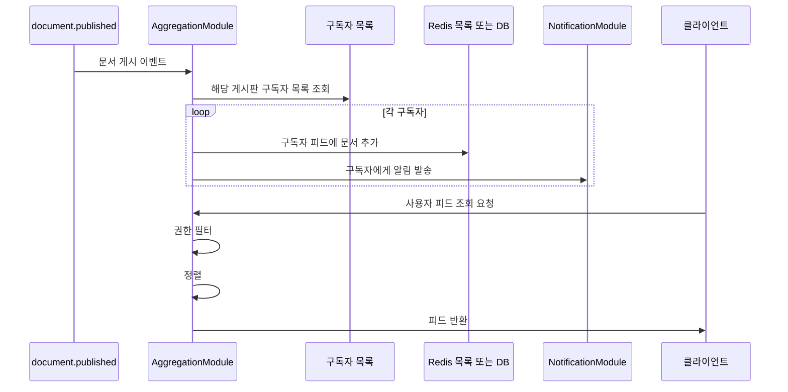
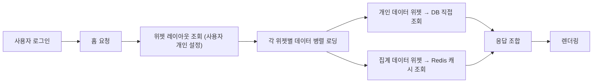

> **문서 상태**
> | 항목 | 값 |
> |------|-----|
> | 상태 | `draft` |
> | 검수 | `unreviewed` |
> | 작성일 | 2026-03-26 |
> | 최종 수정 | 2026-03-26 |

# 집계 및 피드 흐름

## 1. 범위

홈 대시보드 위젯 데이터 수집, 인기·트렌딩 문서 계산, 피드 구독 갱신의 흐름을 다룬다.

## 2. 기능정의서 참조

- [FD-AGG](../../features/FD-AGG-집계피드.md) §1: 문서 집계 데이터
- [FD-AGG](../../features/FD-AGG-집계피드.md) §2: 피드 및 구독
- [FD-AGG](../../features/FD-AGG-집계피드.md) §3: 홈 대시보드 위젯

## 3. 집계 파이프라인 조감도

## 4. 인기·트렌딩 문서 계산 흐름

## 5. 피드·구독 갱신 흐름

## 6. 홈 대시보드 위젯 로딩 흐름

## 7. 관련 문서

| 문서 | 설명 |
|------|------|
| [FD-AGG-집계피드.md](../../features/FD-AGG-집계피드.md) | 집계·피드 기능 정의 |
| [UC-PER-개인영역.md](../../usecases/user/UC-PER-개인영역.md) | UC-PER-05 홈 대시보드 |
| [UC-ADM-시스템운영.md](../../usecases/admin/UC-ADM-시스템운영.md) | UC-ADM-11 통계, UC-ADM-17 위젯 카탈로그 |
| [비동기 이벤트 아키텍처](../../../02-architecture/04-async-event-architecture.md) | 이벤트 버스·비동기 처리 |
| [데이터 아키텍처 — AggregationModule](../../../03-module-design/aggregation/data.md) | RDB 집계 모듈 |
| [데이터 아키텍처 — Redis](../../../02-architecture/data/aicm/redis.md) | Redis 캐시·구조 |
