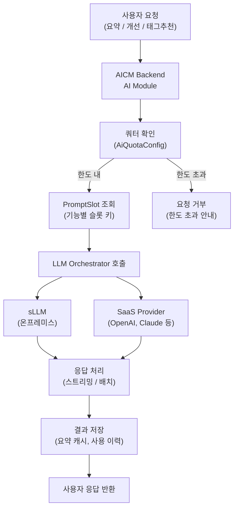
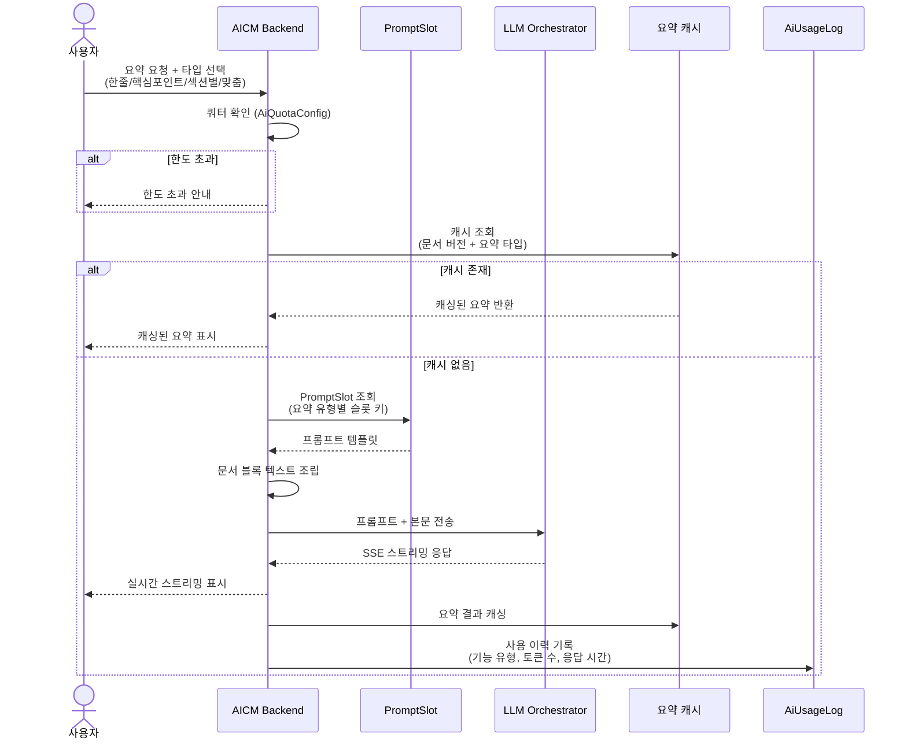
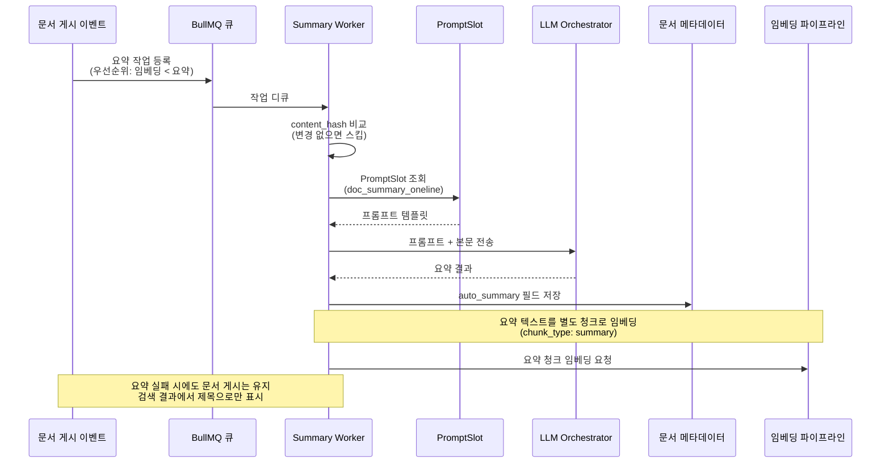
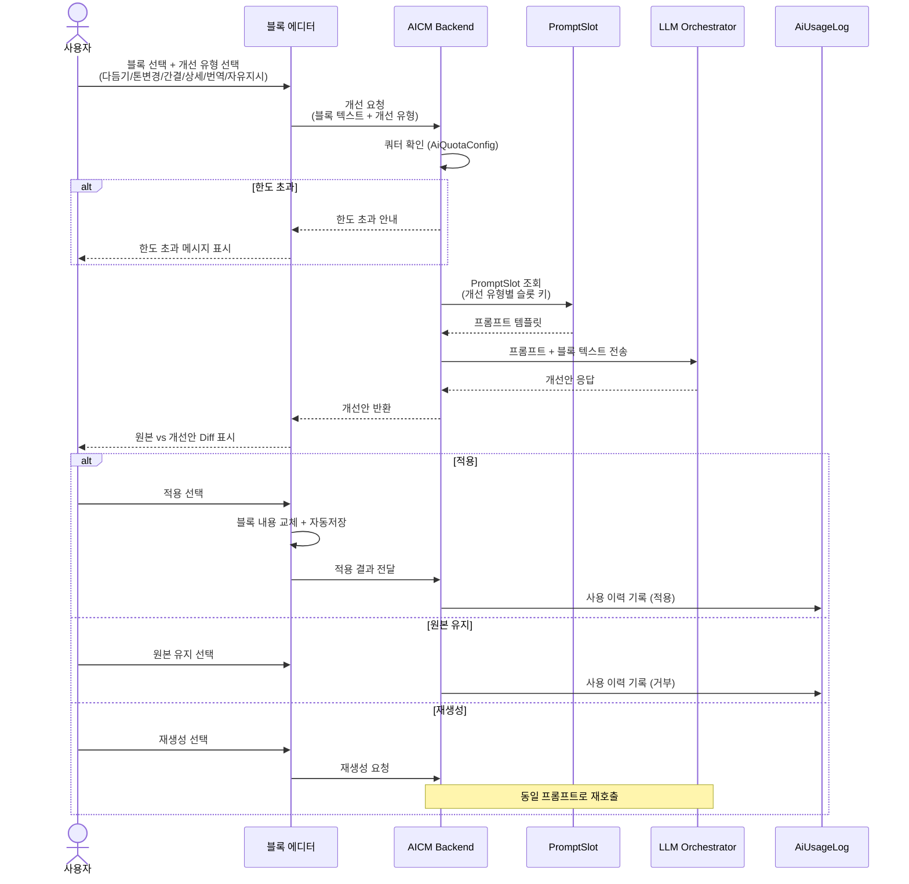
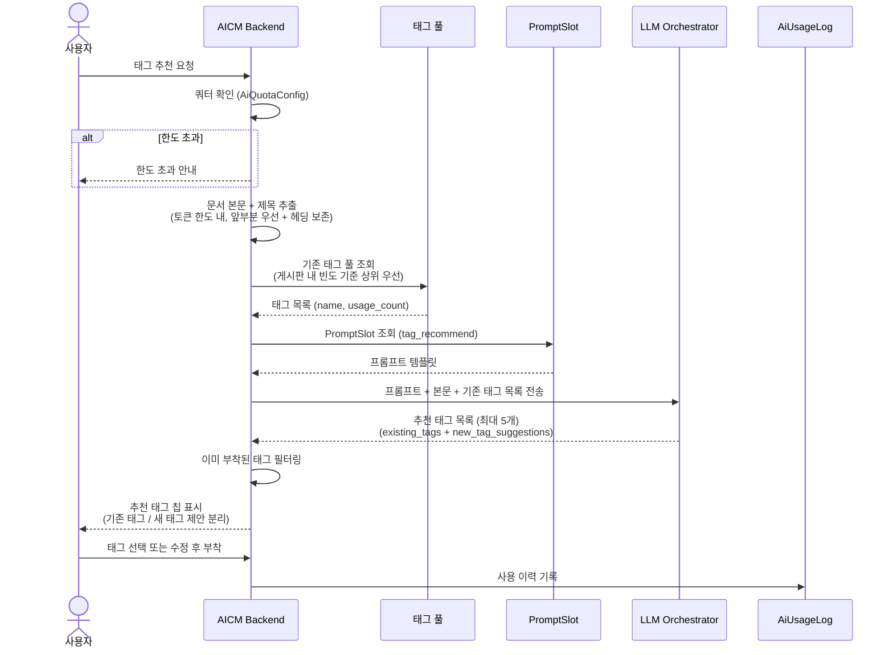
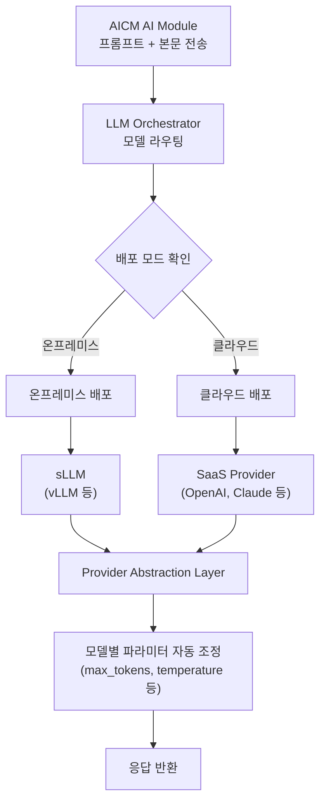
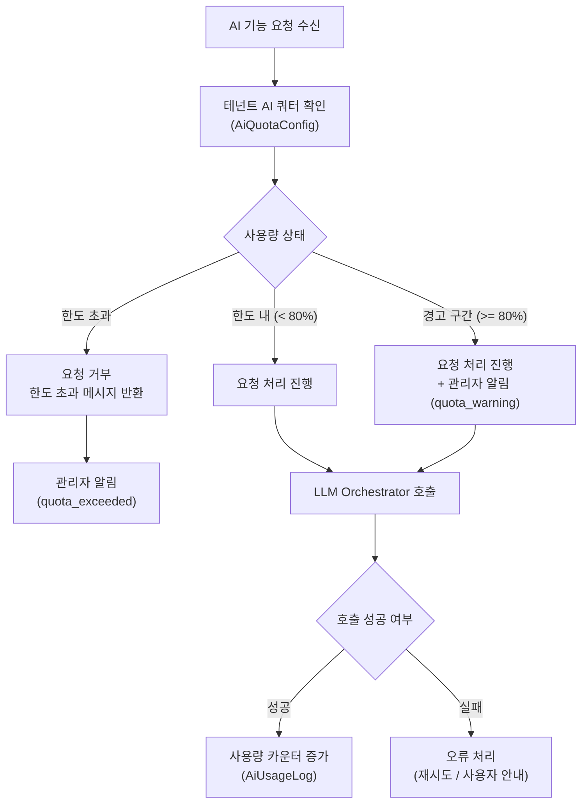

# AI 어시스턴트 파이프라인 흐름

> **문서 상태**
> | 항목 | 값 |
> |------|-----|
> | 상태 | `draft` |
> | 검수 | `unreviewed` |
> | 작성일 | 2026-03-26 |
> | 최종 수정 | 2026-03-26 |

---

## 1. 범위

이 문서는 AICM KMS의 AI 어시스턴트 파이프라인 흐름을 정의한다. 사용자의 요청이 LLM 응답으로 전달되기까지의 전체 E2E 흐름을 다루며, 다음 기능을 대상으로 한다.

- **문서 요약**: 자동 요약(Published 시점) 및 수동 요약(온디맨드)
- **글쓰기 개선**: 블록 단위 인라인 AI 어시스턴트
- **AI 태그 추천**: 기존 태그 풀 기반 태그 제안
- **프롬프트 관리**: 기능별 PromptSlot 조회 및 버전 관리

각 흐름은 쿼터 확인, PromptSlot 조회, LLM Orchestrator 호출, 응답 처리, 사용 이력 기록의 공통 단계를 거친다.

---

## 2. 기능정의서 참조

| 참조 | 설명 |
|------|------|
| FD-AI 1 | 문서 요약 (자동/수동, 요약 캐싱, RAG 연동) |
| FD-AI 2 | 단락별 AI 글쓰기 개선 (개선 유형, Diff 표시, 적용) |
| FD-AI 3 | 프롬프트 관리 (슬롯 기반, 버전 관리, 테스트) |
| FD-AI 6 | AI 태그 추천 (UC-AI-04, 기존 태그 재사용 우선) |

---

## 3. 조감도

AI 어시스턴트 기능의 전체 아키텍처를 나타낸다. 사용자 요청이 AICM 백엔드의 AI 모듈을 거쳐 LLM Orchestrator에 전달되고, 응답이 사용자에게 반환되기까지의 상위 흐름이다.

---

## 4. 문서 요약 E2E 흐름 (UC-AI-01)

### 4.1 수동 요약 (온디맨드)

사용자가 문서 열람 화면에서 "AI 요약" 버튼을 눌러 실시간으로 요약을 생성하는 흐름이다. 요약 타입은 한줄/핵심포인트/섹션별/맞춤 중 선택한다.

**프롬프트 슬롯 매핑**

| 요약 타입 | 슬롯 키 |
|-----------|---------|
| 한줄 요약 | `doc_summary_oneline` |
| 핵심 포인트 | `doc_summary_keypoints` |
| 섹션별 요약 | `doc_summary_section` |
| 맞춤 요약 | 사용자 입력 컨텍스트를 시스템 프롬프트에 병합 |

### 4.2 자동 요약 (Published 시점)

문서가 `published` 상태로 전환될 때 백그라운드에서 자동으로 요약을 생성하는 흐름이다. 임베딩 파이프라인과 동일한 BullMQ 큐를 사용하며, 우선순위는 임베딩보다 낮다.

**자동 요약 활용처**

- 검색 결과 미리보기 카드
- 문서 목록 썸네일
- RAG 답변의 문서 요약 컨텍스트

---

## 5. 글쓰기 개선 흐름 (UC-AI-02)

사용자가 블록 에디터에서 텍스트를 선택한 후 AI 개선을 요청하고, 원본과 개선안을 비교하여 적용하는 흐름이다.

**개선 유형별 프롬프트 슬롯 매핑**

| 개선 유형 | 슬롯 키 |
|-----------|---------|
| 문장 다듬기 | `writing_polish` |
| 격식체 변환 | `writing_tone_formal` |
| 비격식체 변환 | `writing_tone_casual` |
| 간결하게 | `writing_concise` |
| 상세하게 | `writing_elaborate` |
| 번역 | `writing_translate` |
| 자유 지시 | 사용자 입력을 시스템 프롬프트에 병합 |

**결과 표시 방식**

| 적용 범위 | 표시 방식 |
|-----------|----------|
| 단일/다중 블록 | 인라인 Diff (편집 위치에서 변경 부분 하이라이트) |
| 전체 문서 | 사이드바 비교 (좌우 나란히 원본/개선안) |

---

## 6. AI 태그 추천 흐름 (UC-AI-04)

문서 본문을 분석하여 기존 태그 풀에서 적합한 태그를 추천하는 흐름이다. 핵심 원칙은 새 태그를 만들기보다 기존 태그를 재사용하도록 유도하는 것이다.

**추천 우선순위**

1. 문서 내용과의 의미적 관련성
2. 현재 게시판 내 사용 빈도
3. 전체 사용 빈도

**제약 사항**

- 문서당 최대 태그 수(기본 10개)에 도달한 경우 추천 버튼 비활성화
- 본문이 일정 분량 미만이면 "본문을 좀 더 작성한 후 다시 시도해 주세요" 안내
- 기존 태그 중 적합한 것이 부족한 경우에만 새 태그 후보를 별도 영역에 제안

---

## 7. sLLM vs SaaS 프로바이더 분기

LLM Orchestrator가 **배포 모드(온프레미스/클라우드)**에 따라 sLLM 또는 SaaS 프로바이더로 요청을 분기하는 흐름이다. AICM은 LLM을 직접 호출하지 않고 반드시 LLM Orchestrator를 경유한다.

**프로바이더 분기 기준**

| 배포 모드 | 대상 프로바이더 | 특징 |
|---------------|----------------|------|
| 온프레미스 | sLLM (vLLM 등) | 데이터 외부 유출 없음, 자체 GPU 필요 |
| 클라우드 | SaaS (OpenAI, Claude 등) | 인프라 부담 없음, API 비용 발생 |

**Provider Abstraction Layer 역할**

- 프로바이더별 API 차이를 추상화하여 AICM에 통일된 인터페이스 제공
- 모델별 파라미터(`max_tokens`, `temperature`, `top_p` 등) 자동 조정
- 응답 형식 정규화 (스트리밍/배치 통일)

---

## 8. 쿼터 관리 흐름

모든 AI 기능 호출 전에 테넌트별 AI 사용량을 확인하고, 한도 초과 시 요청을 거부하는 쿼터 관리 흐름이다.

**쿼터 상태별 동작**

| 사용량 구간 | 동작 | 관리자 알림 |
|-------------|------|------------|
| 한도 내 (80% 미만) | 정상 처리 | 없음 |
| 경고 구간 (80% 이상) | 정상 처리 + 알림 | `quota_warning` 이벤트 |
| 한도 초과 | 요청 거부 + "한도 초과" 안내 | `quota_exceeded` 이벤트 |

---

## 9. 관련 문서

| 문서 | 설명 |
|------|------|
| [FD-AI-AI어시스턴트](../../features/FD-AI-AI어시스턴트.md) | AI 어시스턴트 기능정의서 (요약, 글쓰기 개선, 프롬프트 관리, 태그 추천) |
| [UC-AI-AI어시스턴트](../../usecases/user/UC-AI-AI어시스턴트.md) | AI 어시스턴트 유즈케이스 (UC-AI-01 ~ UC-AI-04) |
| [외부 연동 아키텍처](../../../02-architecture/05-external-integration.md) | LLM Orchestrator 연동 구조 |
| [데이터 아키텍처 - AI AssistantModule](../../../03-module-design/ai-assistant/data.md) | PromptSlot, PromptVersion 등 프롬프트 데이터 모델 |
| [비동기 이벤트 아키텍처](../../../02-architecture/04-async-event-architecture.md) | BullMQ 큐, 자동 요약 이벤트 처리 |
