> **문서 상태**
> | 항목 | 값 |
> |------|-----|
> | 상태 | `draft` |
> | 검수 | `unreviewed` |
> | 작성일 | 2026-03-20 |
> | 최종 수정 | 2026-03-20 |

# 승인 흐름 다이어그램

> 승인 요청부터 발행까지의 엔드투엔드 흐름을 시각화한다. 각 시나리오의 상세 전략·설계 근거는 [단일 승인](./01-single-approval.md), [다단계 승인](./02-multi-step-approval.md), [긴급 발행](./03-bypass-emergency.md)에서 다룬다.

---

## 1. 승인 상태 전이도

### 1.1 Approval 상태 전이 (전체)

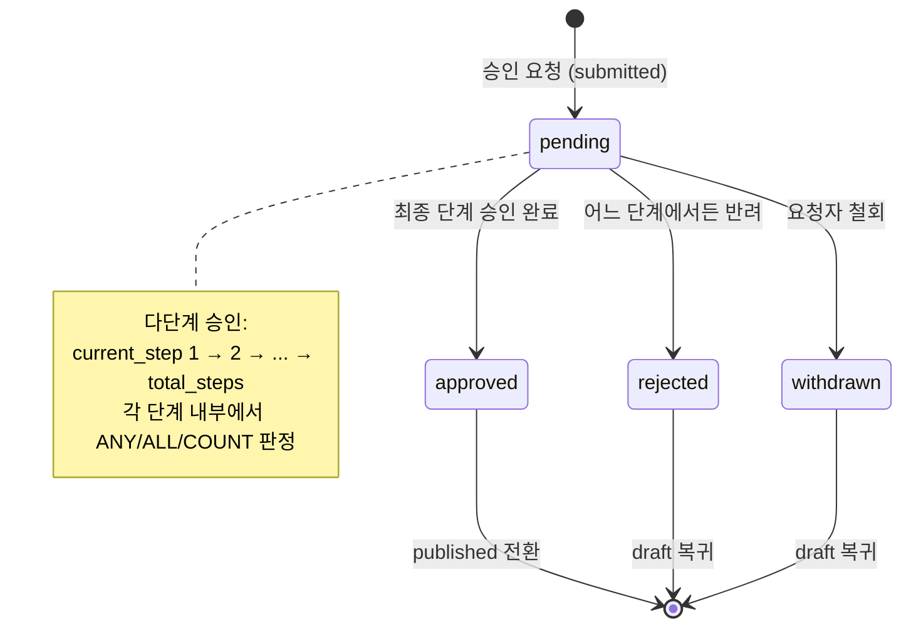

### 1.2 ApprovalStepResult 상태 전이 (단계별)

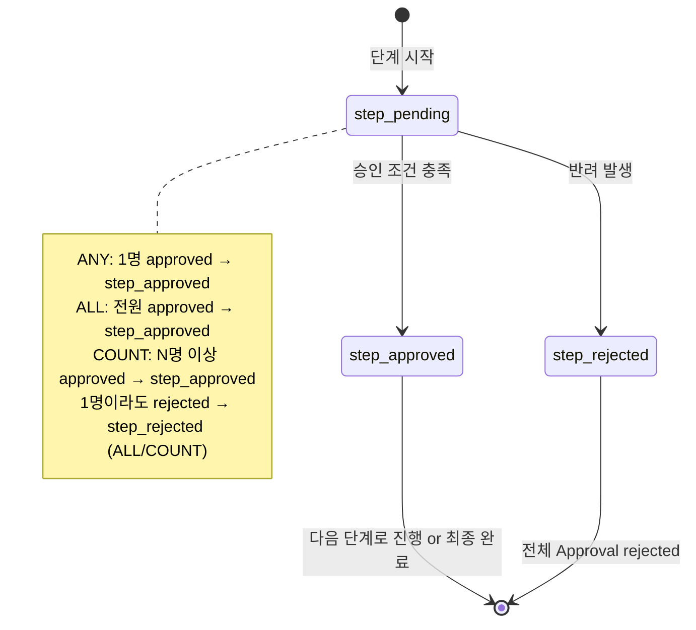

### 1.3 Document 상태와 Approval 상태의 매핑

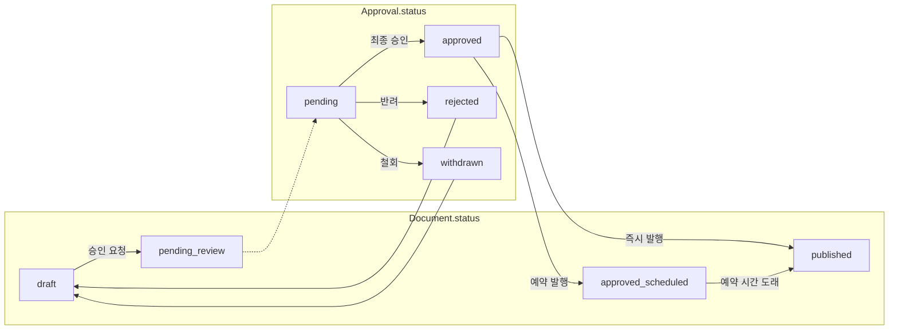

---

## 2. 시퀀스 다이어그램

### 2.1 단일 승인 (1단계/ANY) — 승인 성공

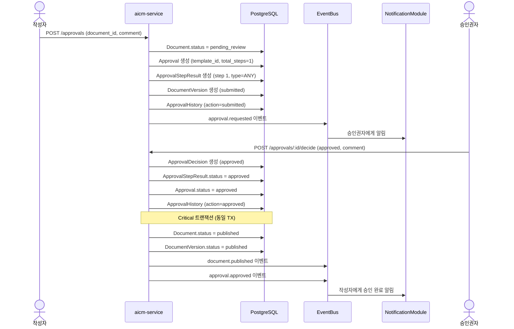

### 2.2 다단계 승인 (2단계) — 승인 성공

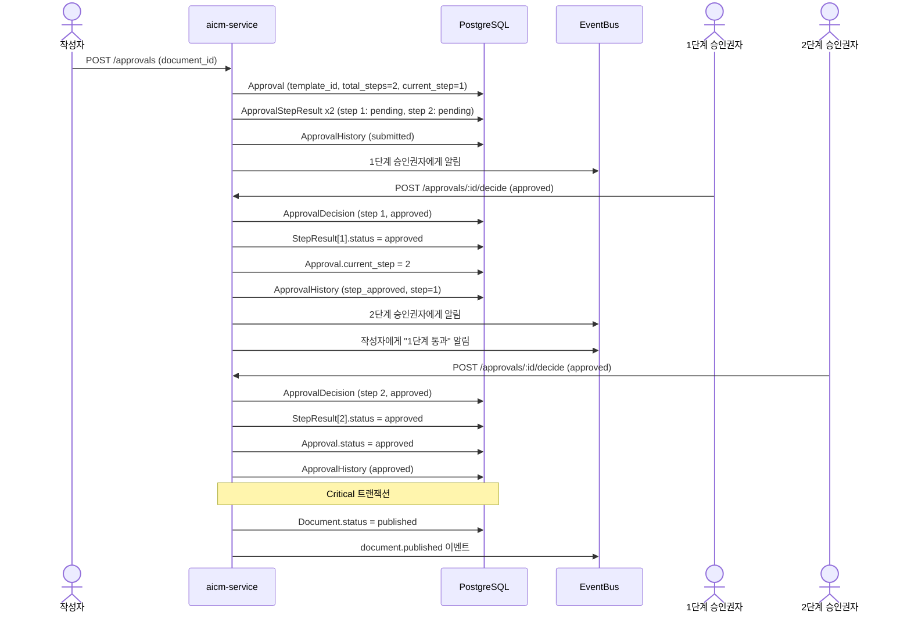

### 2.3 다단계 승인 — 2단계에서 반려

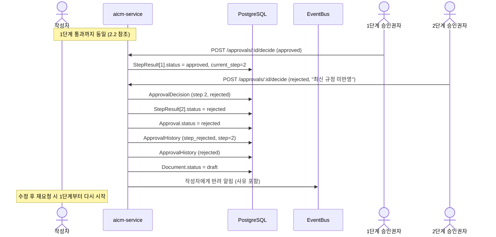

### 2.4 긴급 발행 (Bypass)

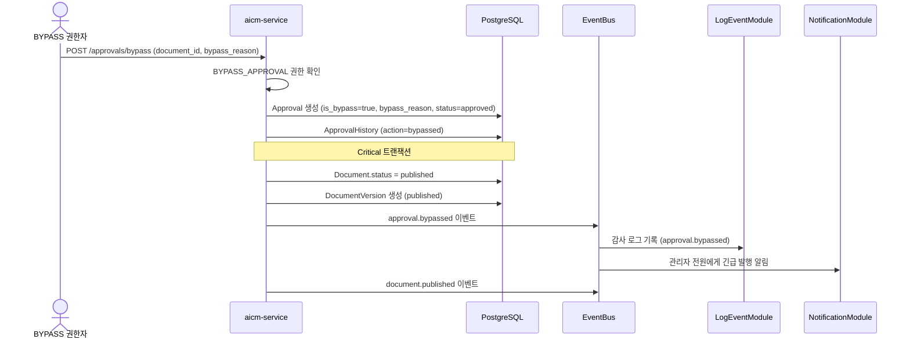

### 2.5 승인 요청 철회

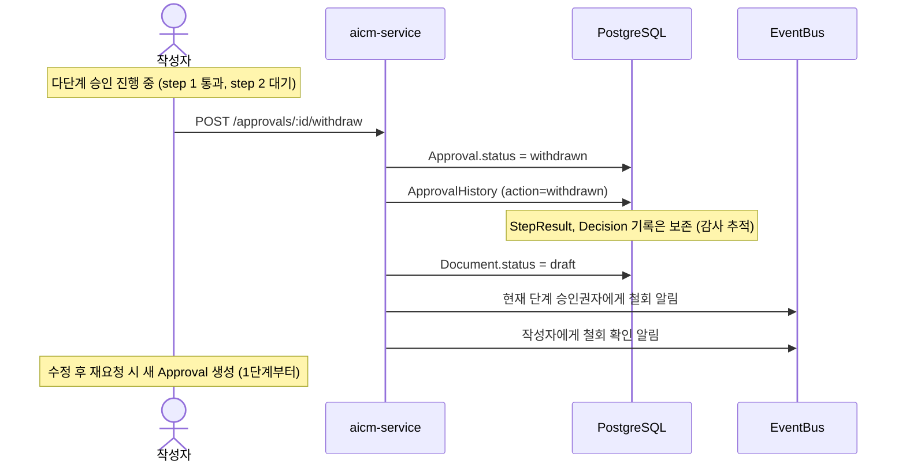

---

## 3. 승인 유형별 판정 로직 다이어그램

### 3.1 ANY (1명 승인 → 통과)

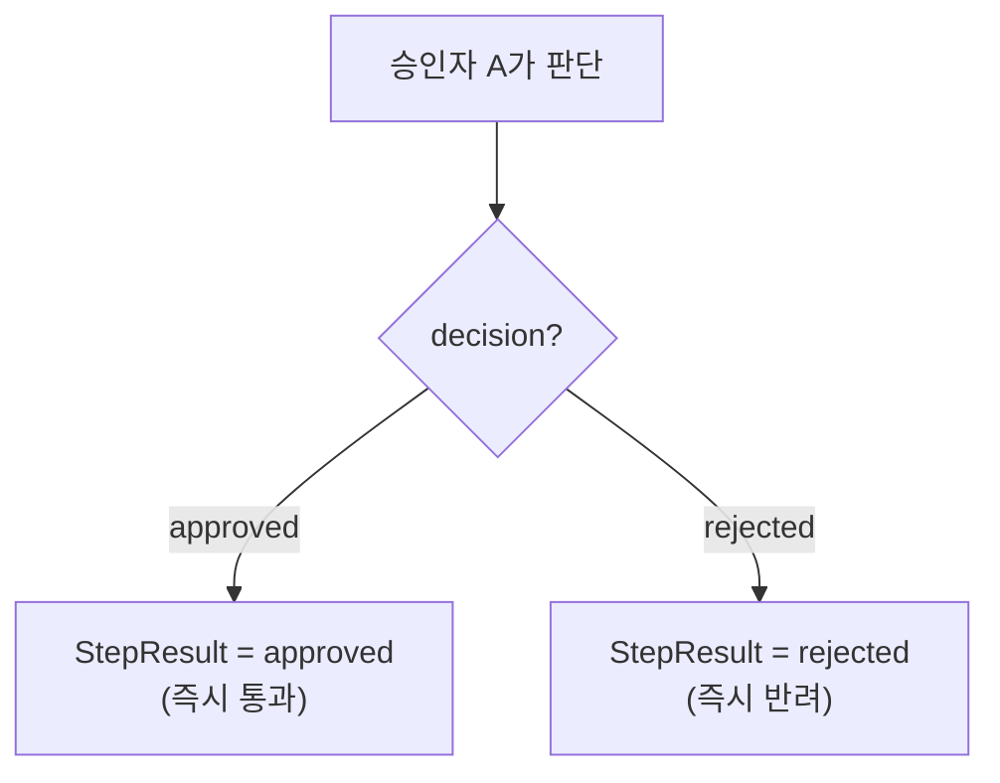

### 3.2 ALL (전원 승인 → 통과)

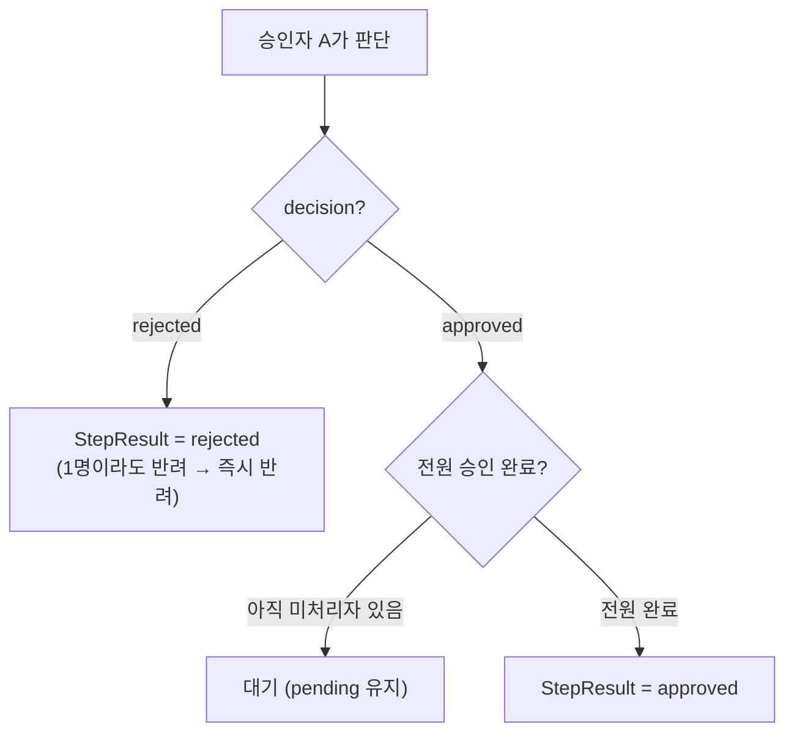

### 3.3 COUNT (정족수 N명 → 통과)

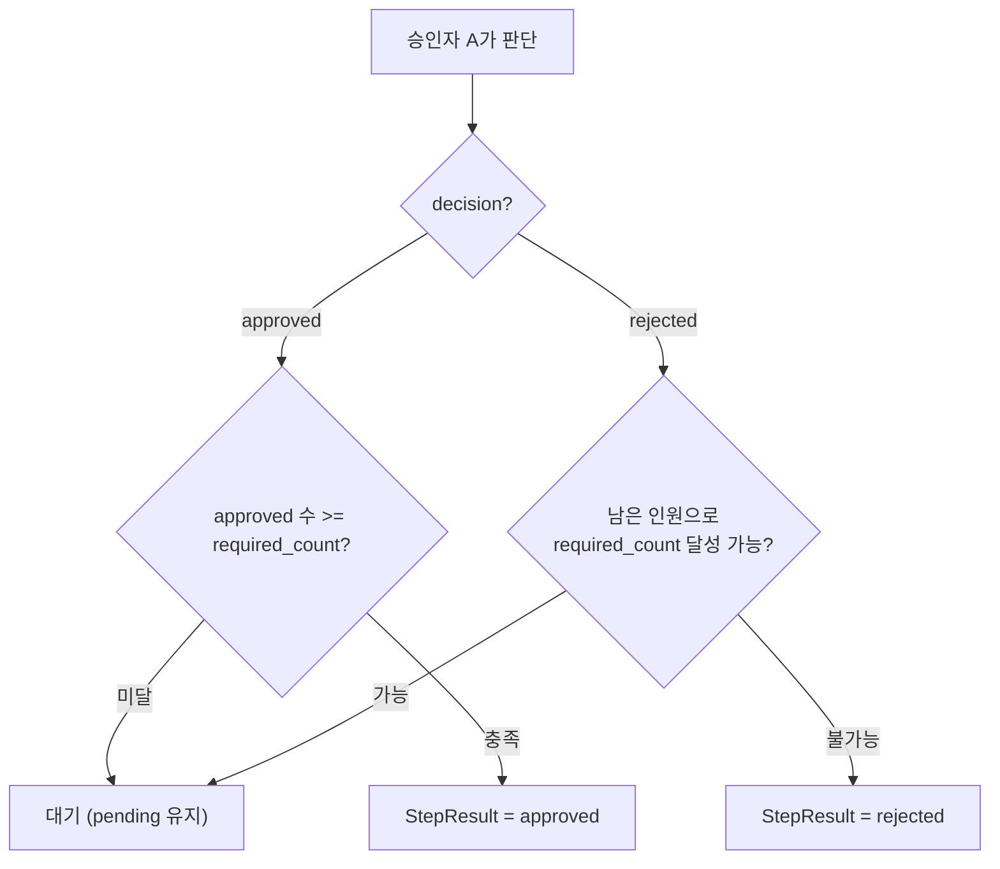

---

## 관련 문서

- [README](./README.md) — 문서군 개요
- [단일 승인 시나리오](./01-single-approval.md)
- [다단계 승인 시나리오](./02-multi-step-approval.md)
- [긴급 발행 시나리오](./03-bypass-emergency.md)
- [승인 권한 평가](./04-permission-evaluation.md)
