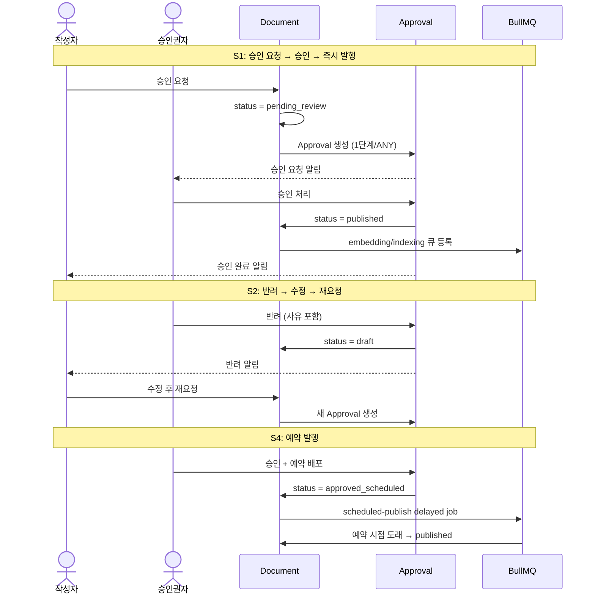
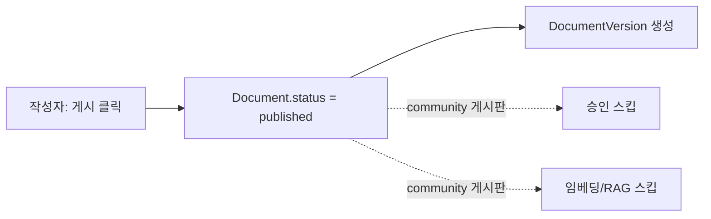

> **문서 상태**
> | 항목 | 값 |
> |------|-----|
> | 상태 | `draft` |
> | 검수 | `unreviewed` |
> | 작성일 | 2026-03-20 |
> | 최종 수정 | 2026-03-20 |

# 단일 승인 시나리오 (1단계/ANY)

> 가장 기본적인 승인 흐름. "복수 승인권자 중 1명이 처리하면 완료"되는 1단계/ANY 정책의 동작을 다룬다.

---

## 1. 적용 조건

- `Board.default_approval_template_id` → ApprovalLineTemplate, 템플릿 `steps`(JSONB) 내 ApprovalLineTemplateStep **1건**, `approval_type = ANY`
- 또는 승인 불필요 게시판(`approval_required = false`)이면서 knowledge 게시판의 레거시 모드

## 2. 시나리오 목록

| # | 시나리오 | 결과 |
|---|---------|------|
| S1 | 승인 요청 → 승인 → 즉시 발행 | published |
| S2 | 승인 요청 → 반려 → 수정 → 재요청 → 승인 | published |
| S3 | 승인 요청 → 철회 → 수정 → 재요청 | pending_review |
| S4 | 승인 요청 → 승인 → 예약 발행 | approved_scheduled → published |
| S5 | community 게시판 → 승인 없이 직접 발행 | published (승인 불필요) |

---



---

## 3. S1: 승인 요청 → 승인 → 즉시 발행

### 전제 조건

- 게시판 "금융상품 안내"에 1단계/ANY 정책이 연결됨
- 작성자 김상담(Role: 상담원, 게시판 EDIT 권한)
- 승인자 이팀장, 박관리(Role: 팀장, 게시판 APPROVE 권한 + 정책 step.approver_target = '팀장')

### 흐름

```
[1] 작성자 김상담: 문서 작성 완료, "승인 요청" 클릭
    ├── Document.status = pending_review
    ├── Approval 생성
    │     template_id = '1단계ANY템플릿'
    │     current_step = 1, total_steps = 1
    │     requester_id = 김상담
    │     status = pending
    ├── ApprovalStepResult 생성
    │     step_order = 1, approval_type = ANY
    │     status = pending
    ├── DocumentVersion 생성 (submitted)
    ├── ApprovalHistory { action: submitted, actor: 김상담 }
    └── 알림: 이팀장, 박관리에게 "승인 요청 도착"

[2] 승인자 이팀장: 승인 대기함에서 문서 검토
    ├── 제출 버전(DocumentVersion)의 BlockSnapshot으로 내용 확인
    ├── 이전 버전이 있다면 Diff 비교 가능
    └── "승인" 클릭 + 코멘트 "검토 완료"

[3] 승인 처리 (트랜잭션)
    ├── ApprovalDecision 생성
    │     step_result_id = step1, approver = 이팀장, decision = approved
    ├── ApprovalStepResult.status = approved (ANY: 1명 → 즉시 통과)
    ├── Approval.status = approved
    ├── ApprovalHistory { action: approved, actor: 이팀장 }
    │
    ├── [Critical TX] Document.status = published
    ├── DocumentVersion.status = published
    │
    ├── BullMQ: embedding 큐 등록
    ├── BullMQ: es-indexing 큐 등록
    ├── BullMQ: summary 큐 등록
    └── 알림: 김상담에게 "승인 완료"
```

### 데이터 스냅샷

```
Approval:
  status=approved, current_step=1, total_steps=1, is_bypass=false

ApprovalStepResult:
  [step 1] type=ANY, status=approved, completed_at=2026-03-20T10:30:00Z

ApprovalDecision:
  [step 1] 이팀장: approved "검토 완료"

ApprovalHistory:
  10:00 submitted (김상담)
  10:30 approved (이팀장)
```

---

## 4. S2: 승인 요청 → 반려 → 수정 → 재요청 → 승인

### 흐름

```
[1] 작성자 김상담: 승인 요청
    └── (S1과 동일) Approval #1 생성

[2] 승인자 이팀장: "반려" + 사유 "금리 정보가 구 버전입니다"
    ├── ApprovalDecision { step 1, rejected, "금리 정보가 구 버전입니다" }
    ├── ApprovalStepResult.status = rejected
    ├── Approval #1 status = rejected
    ├── ApprovalHistory { action: rejected, actor: 이팀장 }
    ├── Document.status = draft
    └── 알림: 김상담에게 "반려됨 — 금리 정보가 구 버전입니다"

[3] 작성자 김상담: 금리 정보 수정 후 재요청
    ├── Document 내용 수정 (Block 테이블)
    ├── "승인 요청" 클릭
    ├── Approval #2 생성 (새 레코드)
    │     template_id 동일, status = pending
    ├── DocumentVersion 생성 (submitted, 새 제출 버전)
    └── 승인권자에게 알림 (Diff: "제출본 v1 vs v2" 비교 가능)

[4] 승인자 이팀장: Diff 확인 → "승인"
    ├── 이전 제출본과 현재 제출본 블록 단위 변경 확인
    └── (S1 [3]과 동일) → published
```

### 핵심 포인트

- 반려 시 **Approval #1은 rejected로 확정**, 수정이 불가능
- 재요청은 **새 Approval #2**를 생성 — Approval은 일회성 레코드
- 승인권자는 두 제출 버전(DocumentVersion) 간 **Diff 비교** 가능

---

## 5. S3: 승인 요청 → 철회 → 수정 → 재요청

### 흐름

```
[1] 작성자 김상담: 승인 요청
    └── Approval #1 생성, status = pending

[2] 작성자 김상담: 실수 발견, "승인 요청 철회"
    ├── Approval #1 status = withdrawn
    ├── ApprovalHistory { action: withdrawn, actor: 김상담 }
    ├── Document.status = draft
    └── 알림: 승인권자에게 "작성자가 승인 요청을 철회했습니다"

[3] 작성자 김상담: 수정 후 재요청
    └── Approval #2 생성 (새 레코드)
```

### 핵심 포인트

- 철회는 **어느 시점에서든** 가능 (승인권자가 검토 중이어도)
- 철회된 건의 ApprovalStepResult/ApprovalDecision **기록은 보존** (감사 추적)
- UI 기본 뷰에는 최종 승인/반려만 표시, "전체 이력" 토글로 철회 이력 확인

---

## 6. S4: 승인 요청 → 승인 → 예약 발행

### 흐름

```
[1~2] (S1과 동일) 승인 요청 → 승인권자 검토

[3] 승인자 이팀장: "승인 + 예약 배포" 선택, 배포일시 = 2026-04-01 09:00
    ├── ApprovalDecision { approved }
    ├── ApprovalStepResult.status = approved
    ├── Approval.status = approved
    ├── ApprovalHistory { action: approved }
    ├── ApprovalHistory { action: scheduled, comment: "2026-04-01 09:00 예약" }
    │
    ├── Document.status = approved_scheduled (published가 아님)
    ├── ScheduledPublish 생성
    │     scheduled_at = 2026-04-01T09:00:00Z
    │     bull_job_id = 'scheduled-publish:xxx'
    └── BullMQ: scheduled-publish 큐에 delayed job 등록

[4] 예약 시간 도래 (2026-04-01 09:00)
    ├── BullMQ job 실행
    ├── Document.status = published
    ├── ScheduledPublish 레코드 삭제
    ├── 임베딩/인덱싱 파이프라인 실행
    └── 알림: 김상담에게 "예약 배포 완료"

[4-alt] 예약 취소 (배포 전)
    ├── 관리자/승인권자: 예약 취소
    ├── BullMQ job 삭제 (bull_job_id)
    ├── Document.status = draft
    ├── ScheduledPublish 삭제
    └── 알림: 김상담에게 "예약 배포가 취소되었습니다"
```

---

## 7. S5: community 게시판 — 승인 없이 직접 발행



### 전제 조건

- 게시판 "자유게시판" — `board_type = community`, `approval_required = false`

### 흐름

```
[1] 작성자 김상담: 문서 작성 완료, "게시" 클릭
    ├── Document.status = published (draft → published 직행)
    ├── DocumentVersion 생성 (submitted + published 동시)
    └── 승인 Approval 미생성 — 승인 워크플로우 완전 스킵

    ※ community 게시판은 임베딩/RAG 파이프라인도 스킵
```

---

## 관련 문서

- [다이어그램 조감도](./00-approval-flow-diagrams.md) — 시퀀스 다이어그램
- [다단계 승인 시나리오](./02-multi-step-approval.md) — 2단계 이상 승인
- [ApprovalModule 엔티티](../../../03-module-design/approval/data.md) — 데이터 모델
