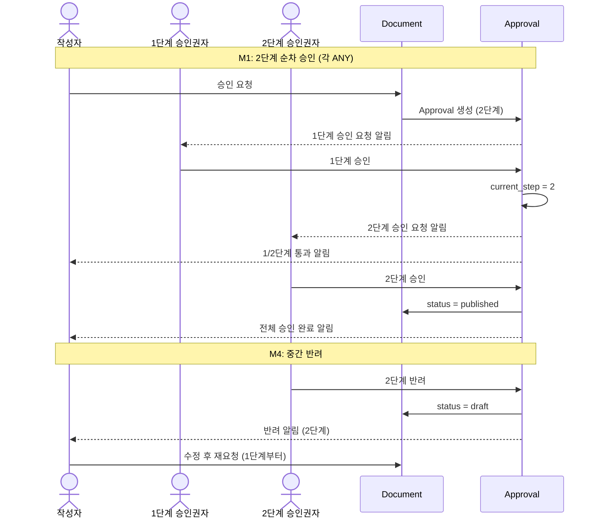
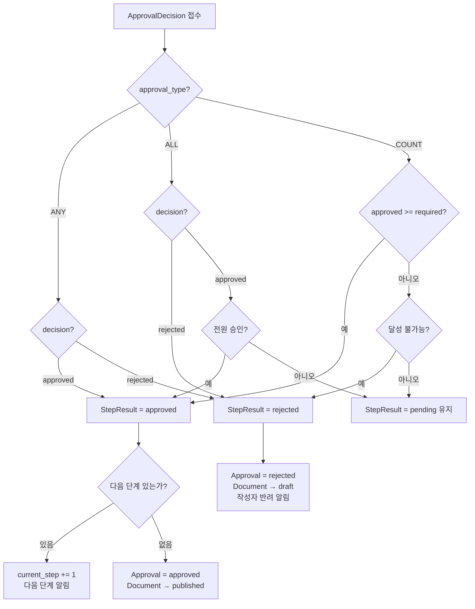

> **문서 상태**
> | 항목 | 값 |
> |------|-----|
> | 상태 | `draft` |
> | 검수 | `unreviewed` |
> | 작성일 | 2026-03-20 |
> | 최종 수정 | 2026-03-20 |

# 다단계 승인 시나리오

> 2단계 이상의 순차 승인과 다인 승인(ALL/COUNT) 조합을 다룬다. 단일 승인(1단계/ANY)의 확장이므로, [01-single-approval.md](./01-single-approval.md)를 먼저 읽는 것을 권장한다.

---

## 1. 적용 조건

- `Board.default_approval_template_id` → ApprovalLineTemplate, 템플릿 `steps`(JSONB) 내 ApprovalLineTemplateStep **2건 이상**
- 또는 1건이라도 `approval_type = ALL` 또는 `COUNT`인 경우

## 2. 시나리오 목록

| # | 정책 구성 | 시나리오 | 결과 |
|---|----------|---------|------|
| M1 | 2단계 순차 (각 ANY) | 팀장 → QA 순차 승인 | published |
| M2 | 2단계 순차 (1단계 ALL) | 법무+보안 전원 → 임원 1명 | published |
| M3 | 1단계 COUNT(2) | 3명 중 2명 정족수 | published |
| M4 | 2단계 순차 — 중간 반려 | 팀장 통과 → QA 반려 | draft (1단계부터 재시작) |
| M5 | 다단계 진행 중 철회 | 1단계 통과 후 작성자 철회 | draft (기록 보존) |

---



---

## 3. M1: 2단계 순차 승인 (각 ANY)

### 정책 구성

```
ApprovalLineTemplate: "금융상품 2단계"
  Step 1: name="팀장 검수", type=ANY, approver_source=ROLE, approver_target="team_leader"
  Step 2: name="QA 검토",  type=ANY, approver_source=ROLE, approver_target="qa_manager"
```

### 흐름

```
[1] 작성자 김상담: 승인 요청
    ├── Approval 생성
    │     template_id = '금융상품 2단계'
    │     current_step = 1, total_steps = 2
    │     status = pending
    ├── ApprovalStepResult 2건 생성
    │     [step 1] type=ANY, status=pending
    │     [step 2] type=ANY, status=pending
    ├── DocumentVersion 생성 (submitted)
    └── 알림: team_leader 역할 사용자에게 "1단계 승인 요청"

[2] 1단계: 이팀장(team_leader) 승인
    ├── ApprovalDecision { step 1, 이팀장, approved }
    ├── StepResult[1].status = approved (ANY: 1명 → 통과)
    ├── Approval.current_step = 2
    ├── ApprovalHistory { step_approved, step=1 }
    ├── 알림: 김상담에게 "1/2단계 통과"
    └── 알림: qa_manager 역할 사용자에게 "2단계 승인 요청"

[3] 2단계: 박QA(qa_manager) 승인
    ├── ApprovalDecision { step 2, 박QA, approved }
    ├── StepResult[2].status = approved (ANY: 1명 → 통과)
    ├── Approval.status = approved (current_step > total_steps)
    ├── ApprovalHistory { step_approved, step=2 }
    ├── ApprovalHistory { approved }
    │
    ├── [Critical TX] Document.status = published
    └── 알림: 김상담에게 "전체 승인 완료, 발행됨"
```

### 데이터 스냅샷

```
Approval:
  status=approved, current_step=2, total_steps=2

ApprovalStepResult:
  [step 1] type=ANY, status=approved, completed_at=10:30
  [step 2] type=ANY, status=approved, completed_at=11:15

ApprovalDecision:
  [step 1] 이팀장: approved
  [step 2] 박QA: approved

ApprovalHistory:
  10:00 submitted (김상담)
  10:30 step_approved, step=1 (이팀장)
  11:15 step_approved, step=2 (박QA)
  11:15 approved (박QA)
```

### UI 표시

```
승인 진행 상태:
  [✓ 1단계: 팀장 검수] ── [✓ 2단계: QA 검토] ── [발행 완료]

타임라인:
  10:00  김상담이 승인 요청
  10:30  이팀장이 1단계 승인 ✓
  11:15  박QA가 2단계 승인 ✓ → 발행
```

---

## 4. M2: 2단계 (1단계 ALL + 2단계 ANY)

### 정책 구성

```
ApprovalLineTemplate: "규제 문서 2단계"
  Step 1: name="법무+보안 합의", type=ALL, approver_source=ROLE, approver_target="compliance"
  Step 2: name="임원 최종",      type=ANY, approver_source=ROLE, approver_target="executive"
```

### 흐름

```
[1] 작성자: 승인 요청
    ├── StepResult[1] type=ALL, status=pending
    ├── StepResult[2] type=ANY, status=pending
    └── 알림: compliance 역할 전원에게 "1단계 합의 요청"

[2] 1단계: 최법무(compliance) 승인
    ├── ApprovalDecision { step 1, 최법무, approved }
    ├── StepResult[1]: 아직 pending (ALL이므로 전원 필요)
    └── UI: "1단계: 1/2명 승인 완료"

[3] 1단계: 강보안(compliance) 승인
    ├── ApprovalDecision { step 1, 강보안, approved }
    ├── StepResult[1].status = approved (ALL: 전원 완료)
    ├── Approval.current_step = 2
    ├── ApprovalHistory { step_approved, step=1 }
    └── 알림: executive 역할에게 "2단계 최종 승인 요청"

[4] 2단계: 김임원(executive) 승인
    ├── ApprovalDecision { step 2, 김임원, approved }
    ├── StepResult[2].status = approved (ANY: 1명 → 통과)
    ├── Approval.status = approved
    └── [Critical TX] Document.status = published
```

### ALL 유형 반려 케이스

```
[2-alt] 1단계: 최법무(compliance) 반려
    ├── ApprovalDecision { step 1, 최법무, rejected, "법적 문제 있음" }
    ├── StepResult[1].status = rejected (ALL: 1명 반려 → 즉시 실패)
    ├── Approval.status = rejected
    ├── Document.status = draft
    └── 알림: 작성자에게 "1단계에서 반려 — 법적 문제 있음"

    ※ 강보안이 아직 판단하지 않았더라도 1단계는 즉시 rejected
```

---

## 5. M3: 1단계 COUNT(2) — 정족수 승인

### 정책 구성

```
ApprovalLineTemplate: "위원회 정족수"
  Step 1: name="위원 심사", type=COUNT, required_count=2,
          approver_source=ROLE, approver_target="committee_member"
```

### 전제: committee_member 역할 사용자 = 김위원, 이위원, 박위원 (3명)

### 흐름 — 정족수 충족

```
[1] 승인 요청
    └── StepResult[1] type=COUNT, required_count=2, status=pending

[2] 김위원: approved
    ├── ApprovalDecision { 김위원, approved }
    └── approved 수 = 1 < 2 → pending 유지

[3] 이위원: approved
    ├── ApprovalDecision { 이위원, approved }
    ├── approved 수 = 2 >= required_count(2) → 통과
    ├── StepResult[1].status = approved
    └── Approval.status = approved → published

    ※ 박위원은 아직 판단하지 않았지만 정족수 충족으로 통과
```

### 흐름 — 정족수 불가능으로 반려

```
[2] 김위원: rejected
    └── approved=0, rejected=1, 미처리=2 → 아직 2명 가능 → pending

[3] 이위원: rejected
    └── approved=0, rejected=2, 미처리=1
        남은 1명이 전부 approved해도 approved=1 < required_count(2)
        → 달성 불가능 → StepResult[1].status = rejected
        → Approval.status = rejected
```

### 핵심: COUNT 반려 판정 공식

```
가능한_최대_approved = 현재_approved + 미처리_인원
가능한_최대_approved < required_count → 달성 불가능 → rejected
```

---

## 6. M4: 다단계 중간 반려

### 정책: 2단계 순차 (각 ANY)

```
[1] 승인 요청 → StepResult[1] pending, StepResult[2] pending

[2] 1단계: 이팀장 승인 ✓
    ├── StepResult[1] approved
    ├── current_step = 2
    └── 2단계 승인권자에게 알림

[3] 2단계: 박QA 반려 ✗ "테스트 시나리오 누락"
    ├── StepResult[2] rejected
    ├── Approval.status = rejected
    ├── Document.status = draft
    └── 알림: 작성자에게 "2단계에서 반려 — 테스트 시나리오 누락"

[4] 작성자: 수정 후 재요청
    ├── 새 Approval 생성 (1단계부터 다시 시작)
    └── 1단계 승인권자에게 다시 알림
```

### 핵심 포인트

- **반려 시 전체 건이 rejected** — 통과한 이전 단계의 기록은 보존되나, 재요청은 1단계부터 다시 시작
- 이유: 1단계 통과 후 문서 내용이 변경되었으므로 1단계 검토도 다시 필요
- 재요청 시 **이전 Approval과 현재 Approval의 제출 버전 간 Diff** 제공으로 재검토 부담 완화

---

## 7. M5: 다단계 진행 중 철회

### 정책: 2단계 순차 (각 ANY)

```
[1] 승인 요청 → 1단계 pending

[2] 1단계: 이팀장 승인 ✓ → current_step = 2

[3] 작성자: "심각한 오류 발견, 철회합니다"
    ├── Approval.status = withdrawn
    ├── ApprovalHistory { withdrawn, comment: "심각한 오류 발견" }
    ├── Document.status = draft
    │
    │   보존되는 기록:
    │   ├── StepResult[1] approved (이팀장의 1단계 승인 기록)
    │   ├── StepResult[2] pending (미처리 상태 그대로)
    │   └── ApprovalDecision (이팀장의 판단 기록)
    │
    └── 알림: 2단계 승인권자에게 "작성자가 철회했습니다"
```

### 핵심 포인트

- 철회 시 **진행된 단계의 모든 기록을 보존** (감사 추적)
- StepResult, ApprovalDecision은 수정/삭제하지 않음 (Append-only 원칙)
- UI에서 해당 Approval을 열면 "1단계 통과 → 2단계 대기 중 → 작성자 철회" 타임라인 확인 가능

---

## 8. 단계 진행 엔진 의사코드

```
function processDecision(approval, stepResult, decision):
    ApprovalDecision 생성

    if stepResult.approval_type == 'ANY':
        if decision == 'approved':
            stepResult.status = 'approved'
        else:
            stepResult.status = 'rejected'

    elif stepResult.approval_type == 'ALL':
        if decision == 'rejected':
            stepResult.status = 'rejected'
        elif 모든_대상_승인자가_approved:
            stepResult.status = 'approved'

    elif stepResult.approval_type == 'COUNT':
        if approved_count >= stepResult.required_count:
            stepResult.status = 'approved'
        elif 달성_불가능:
            stepResult.status = 'rejected'

    if stepResult.status == 'approved':
        if approval.current_step < approval.total_steps:
            approval.current_step += 1
            다음_단계_승인권자에게_알림()
        else:
            approval.status = 'approved'
            Document.transitionToPublished()  // Critical TX

    elif stepResult.status == 'rejected':
        approval.status = 'rejected'
        Document.status = 'draft'
        작성자에게_반려_알림()
```



---

## 관련 문서

- [다이어그램 조감도](./00-approval-flow-diagrams.md) — 상태 전이도, 판정 로직
- [단일 승인 시나리오](./01-single-approval.md) — 기본 흐름
- [긴급 발행 시나리오](./03-bypass-emergency.md) — 정책 우회
- [ApprovalModule 엔티티](../../../03-module-design/approval/data.md)
