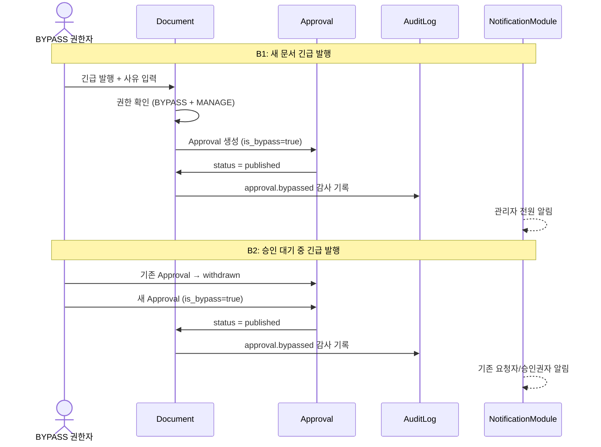

> **문서 상태**
> | 항목 | 값 |
> |------|-----|
> | 상태 | `draft` |
> | 검수 | `unreviewed` |
> | 작성일 | 2026-03-20 |
> | 최종 수정 | 2026-03-20 |

# 긴급 발행 (Bypass) 시나리오

> 장애 공지, 긴급 상품 변경 등 승인 절차를 기다릴 수 없는 상황에서 특정 권한자가 승인을 우회하여 즉시 발행하는 흐름을 다룬다.

---

## 1. 적용 조건

- 수행자가 유효 역할에 `bypass_approval` **AdminPermission**을 보유
- 수행자가 해당 게시판에 `MANAGE`(또는 정책이 정한) 게시판 권한을 보유
- 두 조건 AND — `bypass_approval`만으로는 불충분, 게시판 접근 권한도 필요

## 2. 시나리오 목록

| # | 시나리오 | 대상 문서 상태 | 결과 |
|---|---------|--------------|------|
| B1 | 새 문서 긴급 발행 (draft) | draft | published |
| B2 | 승인 대기 중 문서 긴급 발행 | pending_review | published (기존 Approval 무효화) |
| B3 | BYPASS 권한 없는 사용자 시도 | any | 403 거부 |

---



---

## 3. B1: 새 문서 긴급 발행

### 상황

- 시스템 장애 발생, "긴급 장애 공지" 문서를 즉시 배포해야 함
- 운영 책임자 정관리(`bypass_approval` AdminPermission + 해당 게시판 MANAGE 보유)

### 흐름

```
[1] 정관리: 문서 작성 완료 → "긴급 발행" 버튼 클릭
    ├── UI: 긴급 발행 사유 입력 모달 표시 (필수)
    └── 사유 입력: "시스템 장애 긴급 공지 — 고객 안내 즉시 필요"

[2] 서버: 권한 확인
    ├── bypass_approval AdminPermission 확인 ✓
    ├── 게시판 MANAGE 권한 확인 ✓
    └── 두 조건 AND 충족 → 진행

[3] 서버: Bypass 승인 처리 (단일 트랜잭션)
    ├── Approval 생성
    │     template_id = null (템플릿 우회)
    │     status = approved
    │     is_bypass = true
    │     bypass_reason = "시스템 장애 긴급 공지 — 고객 안내 즉시 필요"
    │     requester_id = 정관리
    │     current_step = 1, total_steps = 1
    │
    ├── ApprovalHistory { action: bypassed, actor: 정관리,
    │     comment: "시스템 장애 긴급 공지 — 고객 안내 즉시 필요" }
    │
    ├── [Critical TX] Document.status = published
    ├── DocumentVersion 생성 (submitted + published 동시)
    │
    ├── BullMQ: embedding, es-indexing, summary 큐 등록
    │
    ├── EventBus: approval.bypassed 이벤트
    │     → AuditLog 기록 { action: approval.bypassed,
    │         details: { bypass_reason, document_id, bypasser } }
    │     → NotificationModule: 관리자 전원에게 알림
    │
    └── EventBus: document.published 이벤트
```

### 알림 대상

| 대상 | 알림 내용 | 목적 |
|------|----------|------|
| 관리자 전원 | "정관리님이 '긴급 장애 공지' 문서를 승인 우회로 긴급 발행했습니다" | 사후 감사, 이상 감지 |
| 해당 게시판 승인권자 | 동일 알림 | 승인 우회 인지 |

### 감사 추적 기록

```
ApprovalHistory:
  09:00 bypassed (정관리) "시스템 장애 긴급 공지 — 고객 안내 즉시 필요"

AuditLog:
  09:00 approval.bypassed
    actor: 정관리
    resource_type: approval
    resource_id: (approval UUID)
    details: {
      document_id: "...",
      bypass_reason: "시스템 장애 긴급 공지 — 고객 안내 즉시 필요",
      board_id: "...",
      board_name: "고객안내"
    }
```

---

## 4. B2: 승인 대기 중 문서 긴급 발행

### 상황

- 문서가 이미 승인 요청된 상태 (pending_review, 2단계 승인 중 1단계 통과)
- 긴급하게 즉시 발행해야 하는 상황 발생

### 흐름

```
[현재 상태]
  Document.status = pending_review
  Approval #1: status=pending, current_step=2 (1단계 통과, 2단계 대기)

[1] 정관리: "긴급 발행" 실행 + 사유 입력

[2] 서버: 기존 Approval 처리
    ├── Approval #1.status = withdrawn (기존 승인 프로세스 종료)
    ├── ApprovalHistory { withdrawn, actor: 정관리,
    │     comment: "긴급 발행으로 인한 자동 철회" }
    └── ※ StepResult, Decision 기록은 보존

[3] 서버: Bypass 승인 생성
    ├── Approval #2 생성
    │     status = approved, is_bypass = true
    │     bypass_reason = "..."
    ├── ApprovalHistory { bypassed, actor: 정관리 }
    │
    ├── [Critical TX] Document.status = published
    └── (이후 B1과 동일)

[알림]
  ├── 관리자 전원에게 긴급 발행 알림
  ├── 기존 Approval #1의 요청자에게 "승인 요청이 긴급 발행으로 대체되었습니다" 알림
  └── 2단계 대기 중이던 승인권자에게 "해당 승인 건이 종료되었습니다" 알림
```

### 핵심 포인트

- 기존 진행 중인 Approval은 **withdrawn 처리** (rejected가 아님 — 반려가 아니라 우회)
- 새 Approval을 bypass로 생성 — 기존 건과 분리하여 감사 추적 명확화
- 기존 건의 StepResult/Decision 기록은 **삭제하지 않고 보존**

---

## 5. B3: 권한 없는 사용자의 시도

### 흐름

```
[1] 일반 상담원 김상담: "긴급 발행" 시도

[2] 서버: 권한 확인
    ├── bypass_approval AdminPermission 확인 → 없음 ✗
    └── 403 Forbidden 반환

[3] UI: "긴급 발행 권한이 없습니다. 관리자에게 문의하세요."

[감사 로그]
    AuditLog: auth.access_denied
      actor: 김상담
      details: { attempted_action: "bypass_approval", document_id: "..." }
```

---

## 6. 긴급 발행 UI/UX 가이드

### 진입점

```
[문서 상세 페이지] 또는 [승인 대기함]

  일반 사용자:     [승인 요청]  [승인]  [반려]
  BYPASS 권한자:   [승인 요청]  [승인]  [반려]  [⚡ 긴급 발행]
                                                    ↑ 붉은색 강조
```

### 긴급 발행 모달

```
┌──────────────────────────────────────┐
│  ⚡ 긴급 발행                         │
│                                      │
│  이 문서를 승인 절차 없이 즉시 발행합니다.  │
│  긴급 발행 사유를 반드시 입력해주세요.      │
│                                      │
│  사유: [________________________]     │ ← 필수, 최소 10자
│        [________________________]     │
│                                      │
│  ⚠ 긴급 발행은 감사 로그에 기록되며,       │
│    모든 관리자에게 알림이 발송됩니다.       │
│                                      │
│         [취소]  [긴급 발행 실행]         │
│                  ↑ 빨간색 버튼          │
└──────────────────────────────────────┘
```

### 이력 표시

```
문서 승인 이력에서:
  ⚡ 긴급 발행 — 정관리 (2026-03-20 09:00)
     사유: 시스템 장애 긴급 공지 — 고객 안내 즉시 필요

  일반 승인과 시각적 구분 (아이콘, 배경색 등)
```

---

## 7. 운영 고려사항

### 남용 방지

| 방어 수단 | 설명 |
|----------|------|
| 권한 최소 부여 | BYPASS_APPROVAL은 운영 책임자급에만 부여, 일반 관리자에게도 미부여 권장 |
| 사유 필수 + 최소 길이 | bypass_reason 빈 값 / 짧은 값 차단 |
| 관리자 전원 알림 | 긴급 발행 시 관리자 전원에게 즉시 알림 → 이상 감지 |
| 감사 로그 이중 기록 | ApprovalHistory + AuditLog 모두 기록 |
| 모니터링 대시보드 | 기간별 긴급 발행 횟수 추이, 빈도 급증 시 알림 |

### 긴급 발행 후 사후 프로세스

```
긴급 발행 완료
  │
  ├── 문서 내용이 정확한 경우: 완료 (추가 조치 없음)
  │
  └── 문서 내용 수정 필요 시:
        ├── 문서 수정 → 정상 승인 프로세스로 재발행
        └── require_approval_on_edit = true이면 수정본도 승인 필요
```

---

## 관련 문서

- [다이어그램 조감도](./00-approval-flow-diagrams.md) — Bypass 시퀀스 다이어그램
- [승인 권한 평가](./04-permission-evaluation.md) — BYPASS_APPROVAL 권한 판정
- [ApprovalModule 엔티티](../../../03-module-design/approval/data.md) — is_bypass, bypass_reason
- [LogEventModule](../../../03-module-design/log-event/data.md) — approval.bypassed 감사 로그
