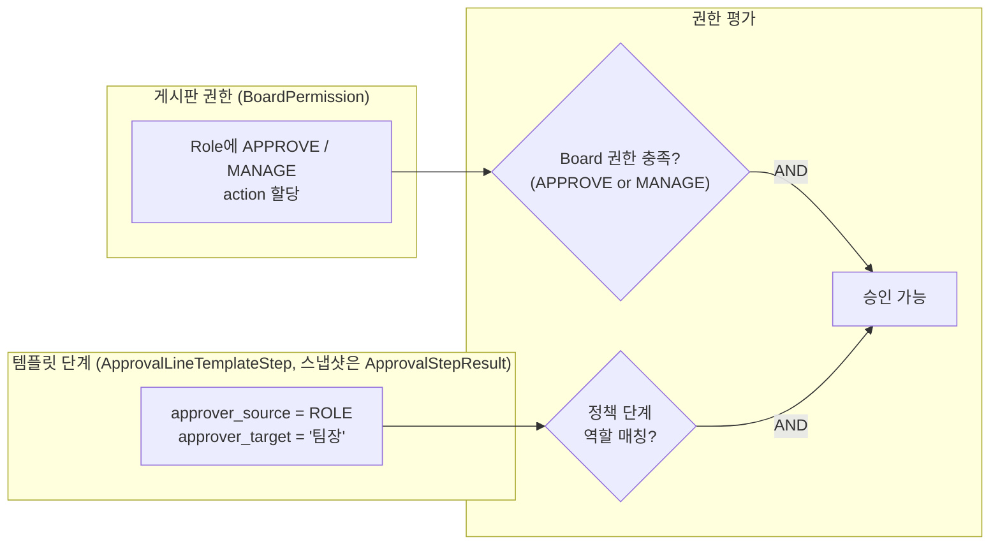
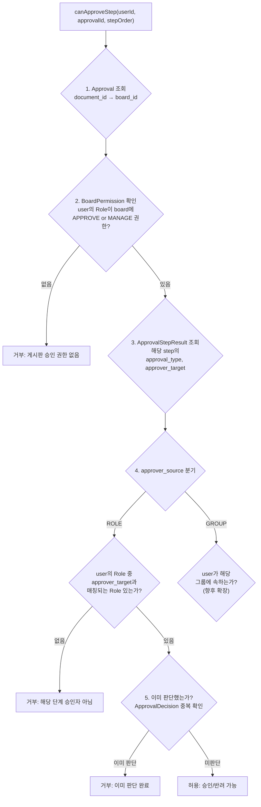
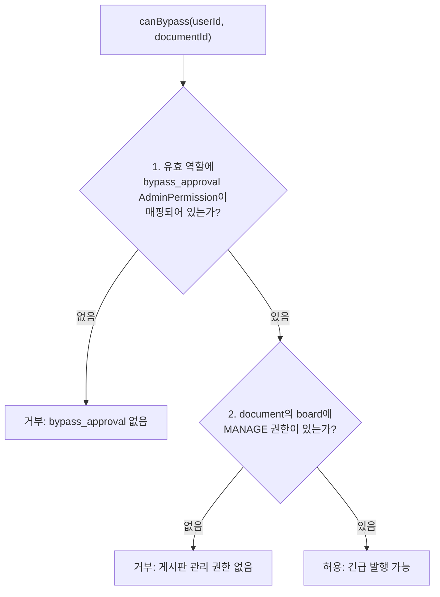
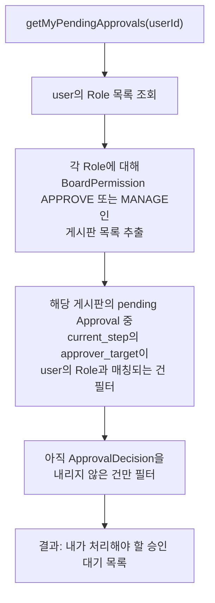

> **문서 상태**
> | 항목 | 값 |
> |------|-----|
> | 상태 | `draft` |
> | 검수 | `unreviewed` |
> | 작성일 | 2026-03-20 |
> | 최종 수정 | 2026-03-20 |

# 승인 관련 권한 평가

> 정책 기반 승인 엔진에서 "누가 승인할 수 있는가", "누가 긴급 발행할 수 있는가"를 판정하는 로직을 다룬다. 기본 권한 모델(3계층: Board Grant + Document/Block Restriction)은 [인증/인가 아키텍처](../../../02-architecture/03-auth-architecture.md)에서 정의하며, 이 문서는 승인 도메인에 특화된 권한 흐름에 집중한다.

---

## 1. 권한의 이원 구조

정책 기반 승인 도입 후, "승인 가능 여부"는 두 가지 출처에서 결정된다.



| 출처 | 결정 내용 | 없으면 |
|------|----------|--------|
| **BoardPermission** | "이 게시판의 문서를 승인할 접근 권한이 있는가" | 게시판 자체에 접근 불가 → 승인 불가 |
| **ApprovalLineTemplateStep / 스냅샷** | "이 단계에서 내 역할이 승인자로 지정되어 있는가" | 템플릿·스냅샷에 미포함 → 해당 단계 승인 불가 |

두 조건이 **AND**로 결합 — 둘 다 충족해야 승인 가능.

---

## 2. BoardPermission Action 확장 제안

현재 설계의 action 3종(`VIEW`, `EDIT`, `MANAGE`)에서 승인 관련 action을 분리하는 방향을 제안한다.

### 현재 vs 제안

| 현재 | 제안 | 변경 이유 |
|------|------|----------|
| `VIEW` | `VIEW` (유지) | 열람 |
| `EDIT` | `EDIT` (유지) | 작성/수정/삭제 |
| `MANAGE` (승인+설정+제한) | `APPROVE` (신규) | 승인/반려 처리를 MANAGE에서 분리 |
| | `MANAGE` (축소) | 게시판 설정, 제한 설정 관리 |

### APPROVE 분리의 장점

```
기존 (MANAGE = 모든 관리):
  팀장에게 MANAGE 부여 → 팀장이 게시판 설정도 변경 가능 (의도하지 않은 권한)

분리 후 (APPROVE + MANAGE):
  팀장에게 APPROVE만 부여 → 승인만 가능, 게시판 설정은 못 건드림
  관리자에게 MANAGE 부여 → 설정 변경 가능
```

### 하위 호환 마이그레이션

```
기존 MANAGE 보유자 → APPROVE + MANAGE 둘 다 부여 (기존 동작 유지)
이후 운영자가 필요에 따라 APPROVE만 / MANAGE만 분리 할당
```

---

## 3. 승인 권한 평가 로직

### 3.1 "이 사용자가 이 단계를 승인할 수 있는가?"



### 3.2 의사코드

```
function canApproveStep(userId, approvalId, stepOrder):
    approval = getApproval(approvalId)
    if approval.status != 'pending': return DENIED("승인 건이 종료됨")
    if approval.current_step != stepOrder: return DENIED("현재 진행 단계가 아님")

    board = getBoard(approval.document_id)

    // 1단계: 게시판 승인 권한
    userRoles = getUserRoles(userId)
    boardPerms = getBoardPermissions(board.id, userRoles)
    if not boardPerms.has('APPROVE') and not boardPerms.has('MANAGE'):
        return DENIED("게시판 승인 권한 없음")

    // 2단계: 템플릿 단계(또는 제출 시 스냅샷) 역할 매칭
    stepResult = getStepResult(approvalId, stepOrder)
    templateStep = getTemplateStep(approval.template_id, stepOrder)
    // 구현체는 ApprovalStepResult에 스냅샷된 approver_source/target을 우선 사용할 수 있음

    if templateStep.approver_source == 'ROLE':
        if not userRoles.any(r => r.name == templateStep.approver_target):
            return DENIED("해당 단계 승인자 역할 아님")

    // 3단계: 중복 판단 확인
    existingDecision = getDecision(stepResult.id, userId)
    if existingDecision != null:
        return DENIED("이미 판단 완료")

    return ALLOWED
```

---

## 4. 긴급 발행 (Bypass) 권한 평가

### 4.1 `bypass_approval` AdminPermission

긴급 발행은 게시판 단위 action과 별도로, 유효 역할에 매핑된 **`bypass_approval` AdminPermission**으로 판단한다(외부 계정 등급과 무관). 구현에서는 `AdminPermission` 테이블(또는 동등 모델)의 키로 관리한다.

```
예시 Role 구성 (개념):
  Role "운영책임자":
    AdminPermission: bypass_approval, manage_policies

  Role "승인 정책 담당":
    AdminPermission: manage_policies

  Role "팀장(일반)":
    AdminPermission: (없음) — 게시판 권한만
```

### 4.2 Bypass 권한 평가 로직



### 4.3 의사코드

```
function canBypass(userId, documentId):
    userRoles = getUserRoles(userId)

    // 1단계: bypass_approval AdminPermission
    hasBypass = userRoles.any(r => r.adminPermissions.includes('bypass_approval'))
    if not hasBypass:
        return DENIED("bypass_approval 없음")

    // 2단계: 게시판 관리 권한
    board = getBoard(documentId)
    boardPerms = getBoardPermissions(board.id, userRoles)
    if not boardPerms.has('MANAGE'):
        return DENIED("게시판 관리 권한 없음")

    return ALLOWED
```

---

## 5. 결재라인 템플릿 관리 권한

### 5.1 누가 결재라인 템플릿을 관리할 수 있는가?

승인 결재라인 템플릿(ApprovalLineTemplate)은 게시판 단위가 아닌 **전역(테넌트) 관리 자원**이다. 따라서 게시판 BoardPermission이 아닌 **`manage_policies` AdminPermission**으로 관리한다.

```
manage_policies AdminPermission:
  ├── ApprovalLineTemplate CRUD
  ├── ApprovalLineTemplateStep 구성 (템플릿 JSONB steps)
  ├── Board에 default_approval_template_id / mandatory_approval_config 연결·해제
  └── 템플릿 활성/비활성 처리
```

### 5.2 템플릿 관리 권한 평가

```
function canManagePolicies(userId):
    userRoles = getUserRoles(userId)
    return userRoles.any(r => r.adminPermissions.includes('manage_policies'))
```

---

## 6. 승인 대기함 — 누구에게 무엇을 보여줄 것인가

### 6.1 승인 대기 목록 조회 로직



### 6.2 SQL 의사코드

```sql
-- 현재 단계의 approver_source/target은 제출 시 스냅샷(approval_step_result)에 저장된 값을 사용한다.
-- (과거 approval_policy_step 테이블 JOIN은 제거 — 단계 정의는 approval_line_template.steps JSONB)
SELECT a.*, d.title, b.name as board_name,
       asr.step_order, asr.approval_type, asr.approver_source, asr.approver_target
FROM approval a
JOIN document d ON d.id = a.document_id
JOIN board b ON b.id = d.board_id
JOIN approval_step_result asr
  ON asr.approval_id = a.id
  AND asr.step_order = a.current_step
  AND asr.status = 'pending'
WHERE a.status = 'pending'
  AND b.id IN (
    SELECT bp.board_id
    FROM board_permission bp
    JOIN user_role ur ON ur.role_id = bp.role_id
    WHERE ur.user_id = :userId
      AND bp.action IN ('APPROVE', 'MANAGE')
  )
  AND asr.approver_target IN (
    SELECT r.name
    FROM role r
    JOIN user_role ur ON ur.role_id = r.id
    WHERE ur.user_id = :userId
  )
  AND NOT EXISTS (
    SELECT 1 FROM approval_decision ad
    WHERE ad.step_result_id = asr.id
      AND ad.approver_id = :userId
  )
ORDER BY a.created_at ASC;
```

---

## 7. 권한 시나리오 종합 예시

### 7.1 조직 구성

```
역할(Role):
  상담원      permissions: {}
  팀장        permissions: {}
  QA담당자    permissions: {}
  관리자      permissions: { manage_policies: true }
  운영책임자  permissions: { bypass_approval: true, manage_policies: true }

게시판 "금융상품 안내":
  상담원     → VIEW, EDIT
  팀장       → VIEW, EDIT, APPROVE
  QA담당자   → VIEW, APPROVE
  관리자     → VIEW, EDIT, APPROVE, MANAGE
  운영책임자 → VIEW, EDIT, APPROVE, MANAGE

결재라인 템플릿 "금융상품 2단계":
  Step 1: type=ANY, approver_target="팀장"
  Step 2: type=ANY, approver_target="QA담당자"
```

### 7.2 권한 판정 매트릭스

| 사용자 | 역할 | 1단계 승인 | 2단계 승인 | 긴급 발행 | 템플릿 관리 |
|--------|------|-----------|-----------|----------|----------|
| 김상담 | 상담원 | X (APPROVE 없음) | X | X | X |
| 이팀장 | 팀장 | O (APPROVE + 정책 매칭) | X (정책 미매칭) | X | X |
| 박QA | QA담당자 | X (정책 미매칭) | O (APPROVE + 정책 매칭) | X | X |
| 최관리 | 관리자 | O (MANAGE 포함) | O (MANAGE 포함) | X (bypass 없음) | O |
| 정운영 | 운영책임자 | O (MANAGE 포함) | O (MANAGE 포함) | O (bypass + MANAGE) | O |

### 판정 근거 설명

- **이팀장**: 게시판 APPROVE 권한 O + 정책 1단계 approver_target="팀장" 매칭 O → 1단계 승인 가능. 2단계는 approver_target="QA담당자"이므로 역할 미매칭 → 2단계 불가
- **최관리**: MANAGE는 APPROVE를 포함하므로 게시판 권한 O. 정책 단계의 approver_target과 역할이 매칭되지 않지만, **MANAGE 보유자는 모든 단계에 대해 승인 가능** (관리자 오버라이드)
- **정운영**: `bypass_approval` AdminPermission + 게시판 MANAGE → 긴급 발행 가능

---

## 8. MANAGE의 관리자 오버라이드 규칙

`MANAGE` 권한은 게시판의 전체 관리 권한이므로, **정책 단계의 역할 매칭과 무관하게 모든 승인 단계를 처리할 수 있다**. 이는 관리자가 승인 병목을 해소하기 위한 안전장치이다.

```
승인 가능 판정:
  if boardPerms.has('MANAGE'):
      return ALLOWED  // 정책 역할 매칭 스킵 (관리자 오버라이드)

  if boardPerms.has('APPROVE'):
      return 정책_역할_매칭_확인()  // 정책 단계의 approver_target 확인 필요
```

### 관리자 오버라이드의 감사 추적

관리자 오버라이드로 승인할 때 ApprovalHistory에 별도 표기:

```
ApprovalHistory:
  action: step_approved
  step_order: 2
  actor: 최관리
  comment: "[관리자 오버라이드] 승인 처리"
```

---

## 관련 문서

- [인증/인가 아키텍처](../../../02-architecture/03-auth-architecture.md) — 3계층 권한 모델, PermissionService
- [AuthModule 엔티티](../../../03-module-design/auth/data.md) — Role, UserRole
- [BoardModule 엔티티](../../../03-module-design/board/data.md) — BoardPermission
- [ApprovalModule 엔티티](../../../03-module-design/approval/data.md) — ApprovalLineTemplateStep(JSONB)·스냅샷의 approver_source/target
- [긴급 발행 시나리오](./03-bypass-emergency.md)
