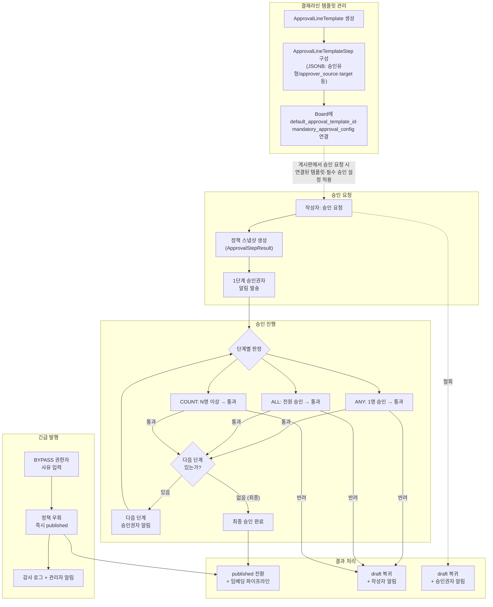

# 승인 워크플로우 및 권한 흐름

> **문서 상태**
> | 항목 | 값 |
> |------|-----|
> | 상태 | `draft` |
> | 검수 | `unreviewed` |
> | 작성일 | 2026-03-20 |
> | 최종 수정 | 2026-03-20 |

## 범위

정책 기반 승인 엔진의 시나리오별 흐름과 승인 관련 권한 평가 로직을 다룬다. 엔티티 정의·스키마는 [데이터 아키텍처](../../../03-module-design/approval/data.md)에서 정의하며, 이 문서군은 **"어떤 시나리오에서 어떤 흐름으로 동작하는가"와 "권한은 어떻게 평가되는가"**에 집중한다.

## 핵심 설계 전제

### 1. 정책 기반 승인 (Policy-driven)

- 승인 로직을 코드에 박지 않고 **데이터(정책)**로 제어
- 운영자가 관리 화면에서 정책을 구성하면 모든 승인 조합(단일/다인/다단계/정족수)을 지원
- 기존 단일 승인은 "1단계/ANY" 정책의 특수 케이스로 하위 호환

### 2. 외부 상태는 단순, 내부는 유연

- 문서의 외부 상태는 기존과 동일: `draft` → `pending_review` → `published`
- `pending_review` 내부에서 다단계 승인이 진행됨 — 외부 인터페이스 변경 최소화
- 승인 진행 상태는 `Approval.current_step` + `ApprovalStepResult`로 추적

### 3. 감사 추적 완전성

- 모든 승인 행위(요청/단계별 승인/반려/철회/긴급 발행)는 `ApprovalHistory`에 불변 기록
- 긴급 발행(Bypass)은 별도 감사 로그(`approval.bypassed`)로 이중 기록
- 금융권 컴플라이언스: "기록을 남기는 것"으로 충족, 행동을 제한하는 것이 아님

---

## 조감도

## 문서 구성

| 순서 | 문서 | 범위 | 기능정의서 참조 |
|------|------|------|---------------|
| 0 | [승인 흐름 다이어그램](./00-approval-flow-diagrams.md) | 승인 엔드투엔드 흐름 시각화 (시퀀스 다이어그램, 상태 전이도) | — |
| 1 | [단일 승인 시나리오](./01-single-approval.md) | 1단계/ANY 승인 — 요청, 승인, 반려, 철회, 예약 배포 | [FD-APR](../../features/FD-APR-승인워크플로.md) §1.4.2~§1.4.5 |
| 2 | [다단계 승인 시나리오](./02-multi-step-approval.md) | 다단계/다인(ALL/COUNT) 승인 — 단계 진행, 반려, 철회 | [FD-APR](../../features/FD-APR-승인워크플로.md) §1.4.1, §1.4.3 |
| 3 | [긴급 발행 시나리오](./03-bypass-emergency.md) | Bypass 승인 우회 — 흐름, 감사 추적, 알림 | [FD-APR](../../features/FD-APR-승인워크플로.md) §1.4.6 |
| 4 | [승인 권한 평가](./04-permission-evaluation.md) | 승인 권한 판정 로직, BoardPermission과 정책의 관계, BYPASS 권한 | [FD-ACL](../../features/FD-ACL-권한체계.md) §4.1 |

### 관련 유즈케이스

| 유즈케이스 | 흐름도 관련 범위 |
|-----------|----------------|
| [UC-APR-01 승인 요청](../../usecases/user/UC-APR-승인워크플로.md) | 01-single: S1, S2 / 02-multi: M1~M3 |
| [UC-APR-02 승인/반려 처리](../../usecases/user/UC-APR-승인워크플로.md) | 01-single: S1, S2 / 02-multi: M2, M4 |
| [UC-APR-03 승인 요청 철회](../../usecases/user/UC-APR-승인워크플로.md) | 01-single: S3 / 02-multi: M5 |
| [UC-APR-04 긴급 발행](../../usecases/user/UC-APR-승인워크플로.md) | 03-bypass: B1, B2 |
| [UC-APR-05 예약 배포](../../usecases/user/UC-APR-승인워크플로.md) | 01-single: S4 |
| [UC-ADM-03 승인 정책 관리](../../usecases/admin/UC-ADM-승인정책.md) | README 조감도, 04-permission |

읽는 순서: 전체 흐름 파악을 위해 0(다이어그램)을 먼저 본 뒤, 기본 시나리오인 1(단일)을 이해하고, 2(다단계)로 확장, 3(긴급)은 예외 흐름, 4(권한)는 횡단 관심사로 읽는다.

---

## 관련 시스템 레벨 문서

| 문서 | 이 도메인과의 관계 |
|------|------------------|
| [데이터 아키텍처 — ApprovalModule](../../../03-module-design/approval/data.md) | Approval, ApprovalLineTemplate, ApprovalStepResult 등 엔티티·DDL 정의 |
| [데이터 아키텍처 — BoardModule](../../../03-module-design/board/data.md) | Board.default_approval_template_id, mandatory_approval_config, approval_required, versioning_enabled |
| [인증/인가 아키텍처](../../../02-architecture/03-auth-architecture.md) | 3계층 권한 모델, BoardPermission, PermissionService |
| [모듈 아키텍처](../../../02-architecture/02-module-architecture.md) | ApprovalModule 책임, 모듈 간 의존성 |
| [비동기 처리 아키텍처](../../../02-architecture/04-async-event-architecture.md) | BullMQ scheduled-publish 큐, EventBus 알림 |

---

## 기존 문서와의 경계 원칙

| 시스템 레벨 문서 | 이미 다루는 것 | 이 도메인 문서에서 하지 않는 것 |
|---|---|---|
| `approval-module.md` | 엔티티 필드, DDL, 인덱스, CHECK 제약 | 스키마·DDL 재기술 |
| `03-auth-architecture.md` | 3계층 권한 모델, PermissionService 인터페이스 | 권한 모델 전체 재기술 |
| `02-module-architecture.md` | 모듈 간 DI/이벤트 의존성 매트릭스 | 의존성 매트릭스 재기술 |

이 도메인 문서는 위 문서들이 정의한 엔티티와 구조를 바탕으로, **"실제 시나리오에서 어떻게 동작하는가"와 "승인 권한은 어떻게 판정되는가"**를 흐름 중심으로 기술한다.
