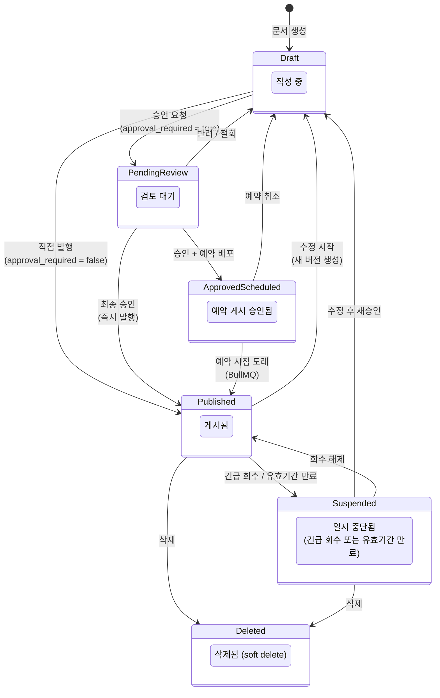
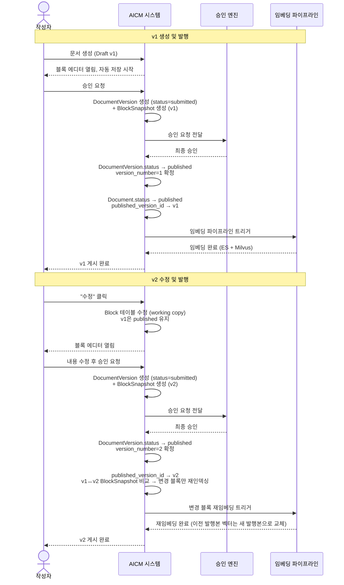
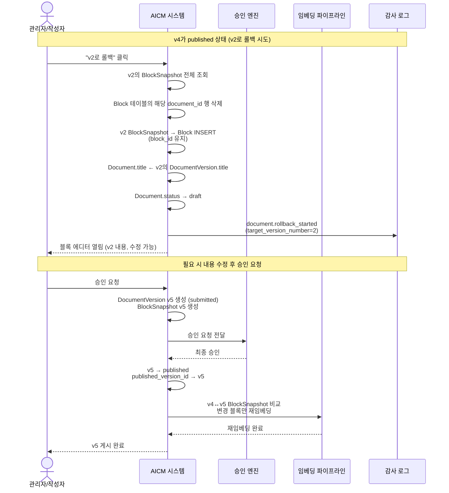
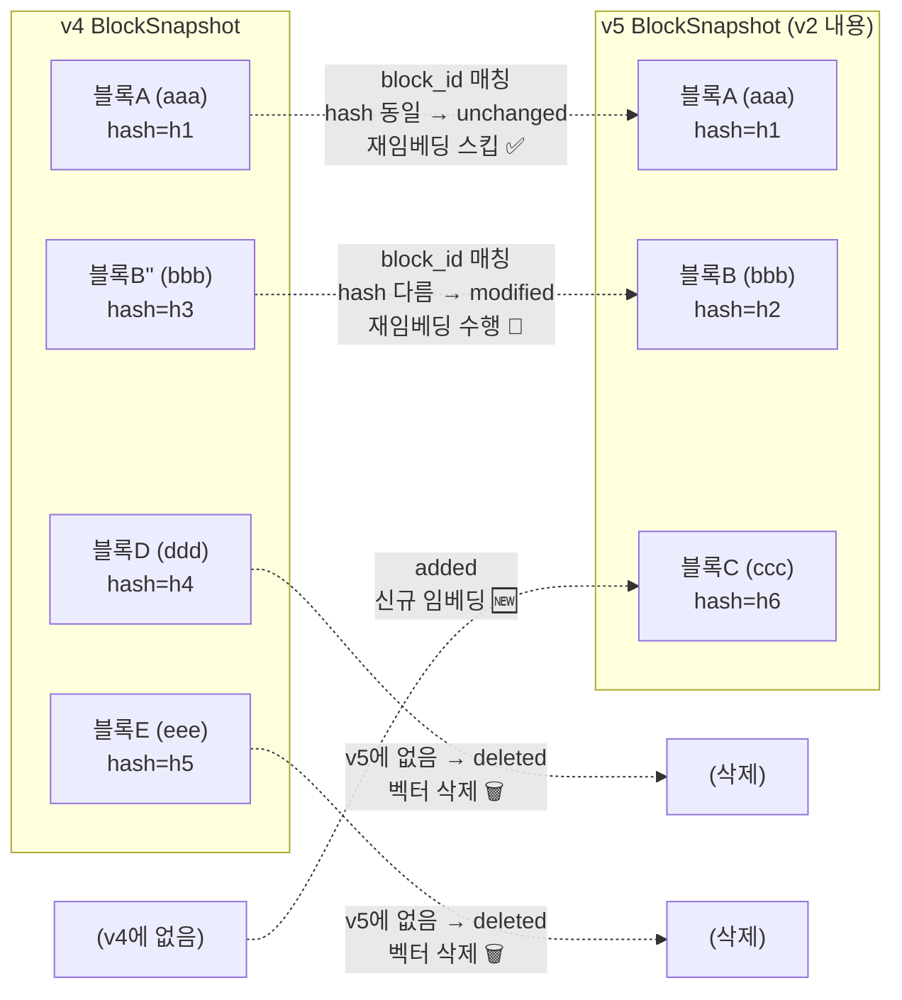
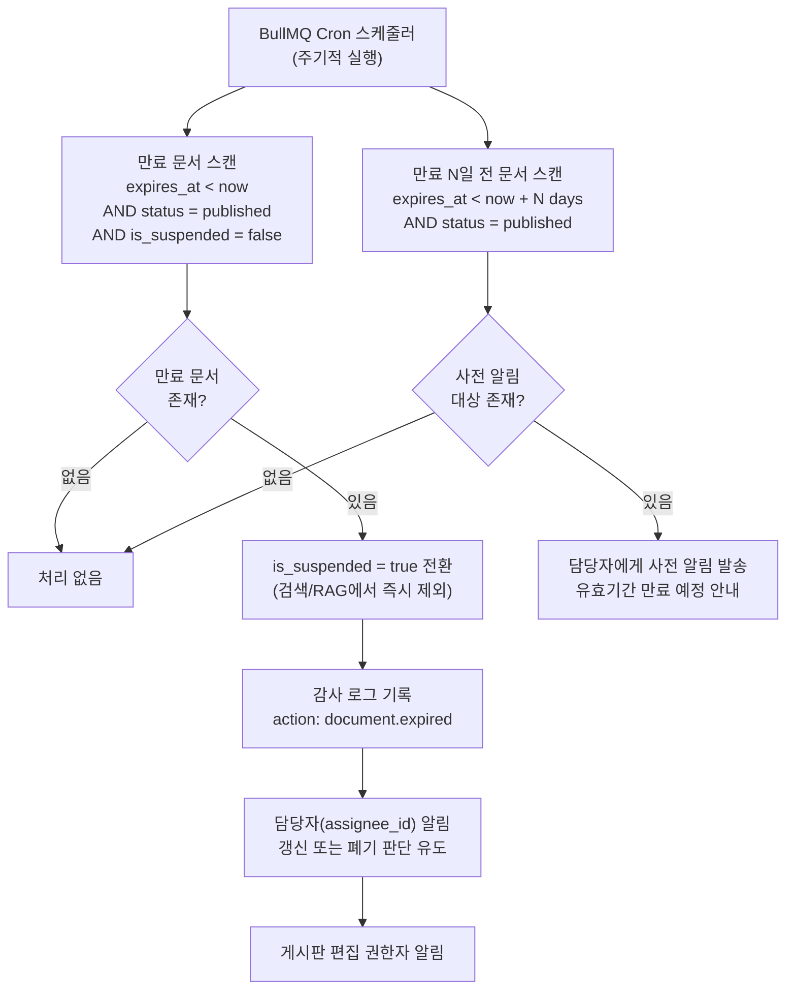
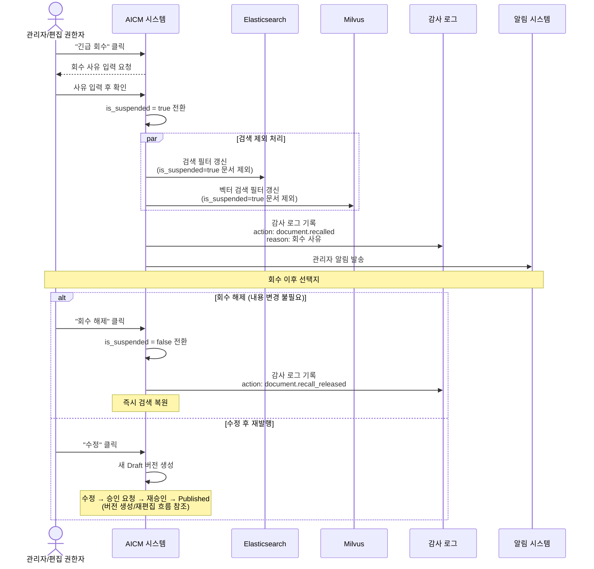
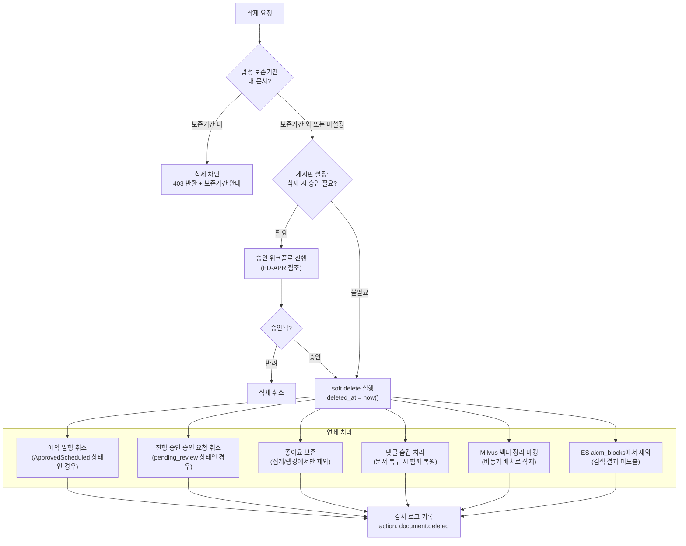
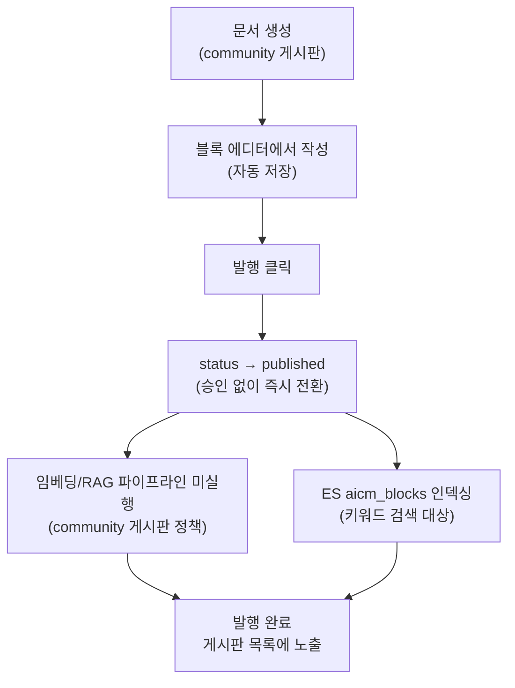

# 문서 라이프사이클 흐름

> **문서 상태**
> | 항목 | 값 |
> |------|-----|
> | 상태 | `draft` |
> | 검수 | `unreviewed` |
> | 작성일 | 2026-03-26 |
> | 최종 수정 | 2026-03-26 |

## 범위

문서의 상태 전이, 버전 생성/재편집, 유효기간 만료, 긴급 회수, 삭제 연쇄 처리를 포함한 **문서 라이프사이클 전체 흐름**을 다룬다. 엔티티 정의·스키마는 [데이터 아키텍처](../../../02-architecture/data/README.md)에서 정의하며, 이 문서는 **"문서가 생성부터 삭제까지 어떤 상태를 거치는가"와 "각 전이에서 어떤 처리가 발생하는가"**에 집중한다.

## 핵심 설계 전제

### 1. 블록 기반 편집기

- 문서 본문은 Tiptap(ProseMirror 기반) 블록 에디터로 작성되며, 블록 배열을 JSON 구조로 저장
- 각 블록이 독립적인 콘텐츠 단위이므로, 임베딩·검색·버전 비교 모두 블록 단위로 동작

### 2. 버전 관리는 DocumentVersion 단위

- DocumentVersion(메타데이터) + BlockSnapshot(블록 단위 스냅샷) 분리 구조로 운영
- 버전 생성 시점: **제출(승인 요청) 시점에 1회만 생성**, 이후 status 전이(`submitted` → `published`/`rejected`)로 관리
- 운영 중 수정 시 새 버전(Draft)이 생성되고, 기존 Published 버전은 유지
- 버전 관리는 **`versioning_enabled = true`**인 게시판에서만 활성화된다. **`versioning_enabled = false`**(및 승인 불필요 경로) 게시판에서는 DocumentVersion/BlockSnapshot을 생성하지 않고, 발행 시 Block을 직접 덮어쓴다. 승인 필요 여부는 **`approval_required`**로 별도 제어한다.

### 3. 상태 전이는 승인 워크플로와 연동

- **`approval_required = true`** 게시판은 승인 워크플로 적용 — `draft` → `pending_review` → `published`
- **`approval_required = false`** 게시판은 승인 불필요 — `draft` → `published` 직행
- 운영 플래그(`is_suspended`, `deleted_at`)는 핵심 라이프사이클과 독립적으로 동작

---

## 상태 전이 조감도

문서가 생성부터 삭제까지 거칠 수 있는 모든 상태와 전이를 보여준다.



> **상태 용어 설명**
>
> | 상태 | 설명 | 검색/RAG 노출 |
> |------|------|:---:|
> | Draft (작성 중) | 작성자만 조회/수정 가능. 임베딩 미수행 | X |
> | PendingReview (검토 대기) | 승인권자 검토 대기. 임베딩 미수행 | X |
> | ApprovedScheduled (예약 게시 승인됨) | 승인 완료, 지정 시점까지 발행 보류. 임베딩 미수행 | X |
> | Published (게시됨) | 열람/검색/RAG 대상. 이 시점에 임베딩 실행 | O |
> | Suspended (일시 중단됨) | 긴급 회수 또는 유효기간 만료. 검색 필터로 즉시 제외 | X |
> | Deleted (삭제됨) | soft delete. 관리자만 복구 가능 | X |

---

## 버전 생성/재편집 흐름

게시된 문서를 수정할 때 새 버전이 생성되고, 기존 게시 버전은 유지되는 흐름을 보여준다.



**핵심 동작 정리**:

- 수정 시작 시 기존 Published 버전은 그대로 검색/RAG에 노출 유지
- 새 버전이 승인·발행되면 `published_version_id`가 새 버전으로 갱신, 이전 버전은 DocumentVersion 이력에 보존
- ES/Milvus는 현재 발행본만 유지 — 이전 발행본의 벡터/인덱스는 새 발행본으로 교체 (롤백 시 재임베딩으로 대체)
- 재임베딩은 변경된 블록만 감지하여 해당 블록의 청크만 재처리

---

## 버전 롤백 흐름

게시된 문서를 이전 발행 버전으로 되돌리는 흐름을 보여준다. Copy-forward 패턴으로, 대상 버전의 BlockSnapshot을 Working Copy에 복사하여 새 Draft를 만든 뒤 기존 승인 워크플로를 거친다.



**핵심 동작 정리**:

- 롤백 대상 버전의 BlockSnapshot이 Working Copy(Block)에 복원됨
- 기존 모든 버전(v1, v2, v3, v4)은 삭제하지 않고 보존 (append-only)
- 롤백 후에도 승인 워크플로를 거쳐야 발행됨 — 무승인 콘텐츠 변경 불가
- 재임베딩은 기존 diff 로직(content_hash/caption 비교)으로 직전 발행본(v4)과 새 발행본(v5)의 변경 블록만 처리
- 감사 로그에 `document.rollback_started` 액션이 기록됨 (대상 버전 정보 포함)
- 롤백 후 에디터에서 추가 수정도 가능 — 롤백은 "이전 내용으로 Working Copy를 초기화"하는 것

### Copy-forward 패턴 상세

#### "Copy-forward"가 의미하는 것

Copy-forward는 **버전 레벨**의 개념이다. "되돌리기(revert)"가 아니라, 이전 내용을 **새 버전으로 앞으로 밀어서** 만든다.

```
v1(published) → v2(published) → v3(rejected) → v4(published, 현재)
                                                       │
                         "v2로 롤백" = v2 내용을 복사하여 ──→ v5(submitted → published)
```

- v1~v4는 **절대 삭제하지 않는다** (append-only). 히스토리 변조 없음.
- v5는 v2의 내용을 가진 **새로운 버전**이다. 버전 번호는 순방향으로만 증가한다.
- 롤백도 승인 워크플로를 거쳐야 하므로, 무승인 콘텐츠 변경이 불가능하다.

#### 블록 레벨에서의 동작: block_id 보존

Copy-forward는 버전 레벨의 개념이지만, **블록 레벨에서는 block_id를 보존**하는 구현 결정을 채택했다. 이는 차분 재임베딩 효율을 위한 의도적 선택이다.

**구체적 예시** — v4가 Published 상태이고 v2로 롤백하는 경우:

```
v2 시점의 블록:  블록A(id=aaa), 블록B(id=bbb), 블록C(id=ccc)
v4 시점의 블록:  블록A(id=aaa), 블록B''(id=bbb, 내용 수정됨), 블록D(id=ddd, 신규), 블록E(id=eee, 신규)
                 (블록C는 v3에서 삭제됨)
```

롤백 실행 시:

1. Block 테이블에서 현재 블록(A, B'', D, E) **전체 삭제**
2. v2의 BlockSnapshot에서 블록 A, B, C를 Block 테이블에 INSERT — **이때 block_id(aaa, bbb, ccc)를 그대로 사용**

```
롤백 후 Block 테이블:  블록A(id=aaa), 블록B(id=bbb), 블록C(id=ccc)
                       ↑ v2 시점과 동일한 block_id + 동일한 내용
```

#### block_id 보존이 재임베딩에 미치는 영향

롤백 후 승인 요청 시 v5가 생성되고, 발행 시 직전 발행본(v4)과 diff 비교가 수행된다.



| 블록 | v4 block_id | v5 block_id | 비교 결과 | 재임베딩 |
|------|:-----------:|:-----------:|-----------|:--------:|
| 블록A | aaa | aaa | hash 동일 → **unchanged** | ❌ 스킵 |
| 블록B | bbb | bbb | hash 다름 → **modified** | ✅ 수행 |
| 블록C | — | ccc | v4에 없음 → **added** | ✅ 수행 |
| 블록D | ddd | — | v5에 없음 → **deleted** | 🗑️ 벡터 삭제 |
| 블록E | eee | — | v5에 없음 → **deleted** | 🗑️ 벡터 삭제 |

→ 블록A는 v2에서도 v4에서도 동일한 내용이었으므로 **재임베딩을 건너뛴다**. block_id가 보존되었기에 이 최적화가 가능하다.

#### 만약 block_id를 새로 채번했다면?

block_id를 보존하지 않고 새 UUID를 생성하는 방식도 가능하다. 이 경우:

```
롤백 후 Block 테이블:  블록A(id=xxx, 신규), 블록B(id=yyy, 신규), 블록C(id=zzz, 신규)
                       ↑ 내용은 v2와 동일하지만 block_id가 전부 다름
```

v4↔v5 diff 시 **매칭되는 block_id가 0건**이므로:
- v5의 xxx, yyy, zzz → 전부 `added` 판정 → **전체 신규 임베딩**
- v4의 aaa, bbb, ddd, eee → 전부 `deleted` 판정 → **전체 벡터 삭제**

내용이 동일한 블록A도 재임베딩 대상이 되어, 블록 수 × 2배의 불필요한 처리가 발생한다.

#### 왜 block_id를 재사용하는가

block_id 보존은 단순한 편의가 아니라, 시스템 전반에서 **블록을 식별자 기반으로 참조**하고 있기 때문에 필요하다.

**① 차분 재임베딩의 전제 조건**

버전 간 블록 비교 SQL은 `v_new.block_id = v_old.block_id`로 JOIN한다. block_id가 달라지면 매칭 자체가 불가능하여, 내용이 동일한 블록도 전부 삭제+재생성 대상이 된다. 100개 블록 중 2개만 바뀐 롤백에서도 100개 전체를 재임베딩해야 하는 비효율이 생긴다.

**② Chunk 테이블의 block_ids 참조**

Chunk(청크) 테이블은 `block_ids UUID[]` 필드로 "이 청크가 어떤 블록들에서 생성되었는가"를 추적한다. block_id가 달라지면 기존 Chunk의 `block_ids`가 더 이상 유효하지 않게 되어, 청크 전체를 폐기하고 재생성해야 한다. block_id를 보존하면 변경되지 않은 블록의 기존 청크를 그대로 유지할 수 있다.

```
Chunk.block_ids = [aaa, bbb]  ← 블록A + 블록B로 만든 청크
                                       롤백 후에도 aaa, bbb가 존재하므로 매핑 유효
```

**③ 블록 변경 이력의 연속성**

BlockSnapshot은 `block_id`를 키로 버전 간 동일 블록을 추적한다. block_id가 보존되면, 특정 블록의 전체 이력을 버전을 넘어 추적할 수 있다.

```sql
-- "블록 aaa는 어느 버전에서 어떻게 변했는가?"
SELECT version_id, content_hash, caption
FROM block_snapshot
WHERE block_id = 'aaa'
ORDER BY created_at;
```

block_id를 새로 채번하면 롤백 이후의 블록은 이전 버전과의 연결이 끊어져, "이 블록이 원래 어떤 블록이었는가"를 추적할 수 없다.

**④ 검색 인덱스의 블록 참조 안정성**

ES `aicm_blocks` 인덱스와 Milvus 벡터는 `block_id`를 문서 ID 또는 메타데이터로 보유한다. block_id가 보존되면 롤백 후에도 변경되지 않은 블록의 인덱스 엔트리를 그대로 유지할 수 있고, 변경된 블록만 선별 업데이트하면 된다. 새 id로 채번하면 기존 인덱스 전체를 삭제하고 새 id로 재인덱싱해야 한다.

#### 설계 결정 요약

| 항목 | block_id 보존 (채택) | block_id 새로 채번 |
|------|:---:|:---:|
| 롤백 후 재임베딩 | 변경된 블록만 차분 처리 | **전체 재임베딩** (매칭 불가) |
| 의미론적 명확성 | Block.id가 버전을 넘어 추적됨 | 새 블록은 새 id로 깔끔 |
| Copy-forward의 범위 | 버전 레벨에서만 forward | 버전+블록 모두 forward |
| 채택 근거 | **재임베딩 비용 최적화** | — |

> **Copy-forward는 버전 레벨에서의 전진 원칙**(v4를 삭제하지 않고 v5를 새로 만듦)이고, **block_id 보존은 블록 레벨에서의 추적 최적화**이다. 두 개념은 독립적이며, block_id 보존은 블록 단위 diff 기반 재임베딩의 효율을 위해 채택한 것이다.

---

## 유효기간 만료 처리 흐름

`Document.expires_at`이 설정된 문서의 만료 처리 과정을 보여준다.



**만료 후 복원 경로**:

- 담당자 또는 관리자가 `expires_at`을 미래 날짜로 연장 + `is_suspended` 해제 → 즉시 검색 복원
- 내용 수정이 필요하면 수정 시작 → 새 Draft 생성 → 재승인 후 Published로 복원

---

## 긴급 회수 (UC-DOC-09) 흐름

내용 오류, 규정 위반 등으로 게시된 문서를 즉시 검색에서 제외하는 흐름을 보여준다.



**핵심 동작 정리**:

- 벡터 DB에서 물리 삭제 없이 검색 시 필터(`is_suspended = true`)로 즉시 제외
- 회수 해제 시 플래그만 변경하면 즉시 검색 복원 — 재임베딩 불필요
- 수정이 필요한 경우 새 Draft 버전을 생성하여 재승인 흐름을 거침

---

## 문서 삭제 시 연쇄 처리

문서 삭제(soft delete) 시 연관 리소스에 대한 연쇄 처리를 보여준다.



**핵심 동작 정리**:

- 법정 보존기간 내 문서는 삭제 자체가 차단됨 (보존 정책이 적용되는 경우)
- 댓글은 숨김 처리하되 물리 삭제하지 않음 — 문서 복구 시 함께 복원
- 좋아요 데이터는 보존하되, 집계/랭킹 계산에서 해당 문서를 제외
- Milvus 벡터는 마킹 후 비동기 배치로 정리 — 삭제 시점에 동기 삭제하지 않음

---

## 승인 불필요 게시판 직접 발행

`approval_required = false` 게시판은 승인 워크플로 없이 바로 발행되며, 임베딩/RAG 파이프라인 대상에서 제외되는 간소화된 경로를 따른다.



**승인 필요 게시판과의 차이**:

| 항목 | approval_required = true | approval_required = false |
|------|:---:|:---:|
| 승인 워크플로 | 필수 | 없음 |
| 임베딩/RAG 파이프라인 | 실행 | 미실행 |
| 시맨틱 검색 대상 | O | X |
| 키워드 검색 대상 | O | O |
| 유효기간 관리 | O | X (일반적) |

> `board_type`은 에디터 프로파일에만 영향을 주며, **승인 필요 여부**는 `Board.approval_required`, **버전 관리 여부**는 `Board.versioning_enabled`로 각각 결정된다. `default_approval_template_id`·`mandatory_approval_config`는 결재라인·필수 승인 규칙을 정의한다. community 타입 게시판도 `approval_required = true`로 두면 승인 워크플로를 적용할 수 있다.

---

## 관련 문서

| 문서 | 이 문서와의 관계 |
|------|------------------|
| [FD-DOC-문서관리](../../features/FD-DOC-문서관리.md) | 문서 상태 모델, 버전 관리, 유효기간 등 기능 정의 |
| [UC-DOC-문서관리](../../usecases/user/UC-DOC-문서관리.md) | 문서 생성/수정/삭제/회수/만료 유즈케이스 |
| [승인 워크플로 흐름도](../approval-permission/) | 승인 정책 기반 상태 전이 흐름 (단일/다단계/긴급 발행) |
| [검색/RAG 파이프라인](../search-rag/) | 파싱→청킹→임베딩→검색 파이프라인 전체 흐름 |
| [데이터 아키텍처 개요](../../../02-architecture/data/README.md) | Block/Chunk/ES/Milvus 엔티티·스키마 정의 |
| [비동기 이벤트 아키텍처](../../../02-architecture/04-async-event-architecture.md) | BullMQ 큐 설계, 예약 발행/만료 처리 이벤트 흐름 |
