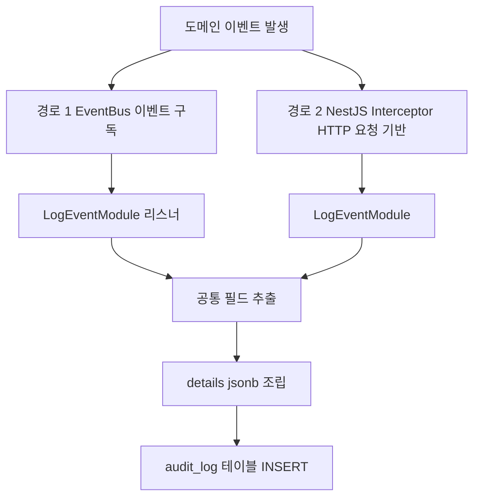
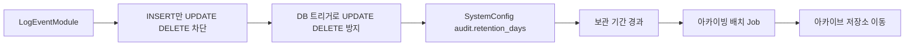
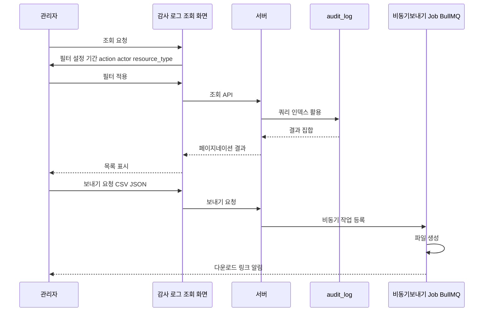

> **문서 상태**
> | 항목 | 값 |
> |------|-----|
> | 상태 | `draft` |
> | 검수 | `unreviewed` |
> | 작성일 | 2026-03-26 |
> | 최종 수정 | 2026-04-13 |

# 감사·접근 이벤트 로그 수집 흐름

## 1. 범위

금융권 컴플라이언스 필수 요건인 감사 로그의 수집, 저장, 보관, 조회·보내기 파이프라인을 다룬다. RDB 원장은 `audit_log`(감사)와 `access_event_log`(접근)로 분리되며, NestJS 모듈은 **LogEventModule**이 통합 소유한다.

## 2. 기능정의서 참조

- [FD-AUD](../../features/FD-AUD-감사로그.md) §1: 개요 및 핵심 원칙
- [FD-AUD](../../features/FD-AUD-감사로그.md) §2: 감사 로그 유형 및 액션 코드
- [FD-AUD](../../features/FD-AUD-감사로그.md) §3: 조회·관리

## 3. 감사 로그 수집 파이프라인 조감도

도메인 이벤트는 문서 변경, 승인, 검색, 관리자 작업 등에서 발생한다.

**공통 필드 추출:** `actor_id`, `actor_role`, `ip_address`, `user_agent` (DB-per-tenant 구조이므로 `tenant_id` 불필요)

**details:** 이벤트·요청별 부가 정보를 `jsonb`로 조립한다.

## 4. 이벤트 소스별 감사 기록 매핑

| resource_type | 액션 |
|---------------|------|
| document | created, updated, deleted, published, suspended, recalled, archived |
| approval | submitted, approved, rejected, withdrawn, bypassed |
| search | queried (검색 쿼리 감사) |
| admin | board_created, template_updated, user_role_changed, config_updated |
| auth | login, login_failed, access_denied |
| export | document_exported |

## 5. 감사 로그 저장 및 불변성 보장

- `LogEventModule`은 `audit_log`에 대해 **INSERT만** 수행하고 **UPDATE·DELETE**를 차단한다.
- `audit_log`에는 **INSERT만** 허용하고, 애플리케이션·DB 레벨에서 **UPDATE·DELETE**를 차단한다.
- DB 레벨에서는 트리거 등으로 **UPDATE·DELETE**를 방지한다.
- 보관 기간은 **SystemConfig**의 `audit.retention_days`로 정의한다.
- 보관 기간이 지난 레코드는 **아카이빙 배치 Job**이 **아카이브 저장소**로 이동시킨다.

## 6. 조회·필터·보내기 흐름

## 7. 관련 문서

| 문서 | 설명 |
|------|------|
| [FD-AUD-감사로그.md](../../features/FD-AUD-감사로그.md) | 감사 로그 기능 정의 |
| [UC-ADM-시스템운영.md](../../usecases/admin/UC-ADM-시스템운영.md) | UC-ADM-08 등 관리자 유즈케이스 |
| [데이터 아키텍처 — LogEventModule](../../../03-module-design/log-event/data.md) | RDB 모듈 설계 |
| [횡단 관심사](../../../02-architecture/07-cross-cutting-concerns.md) | 공통 정책·관심사 |
