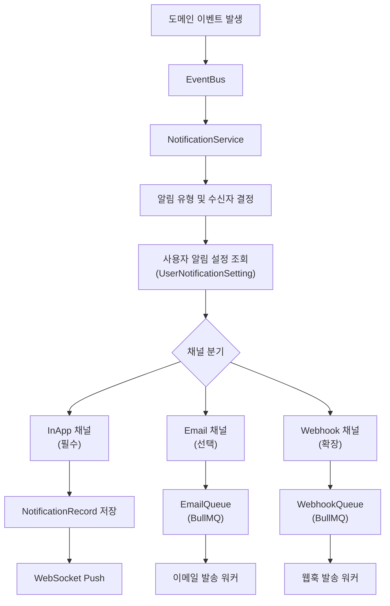
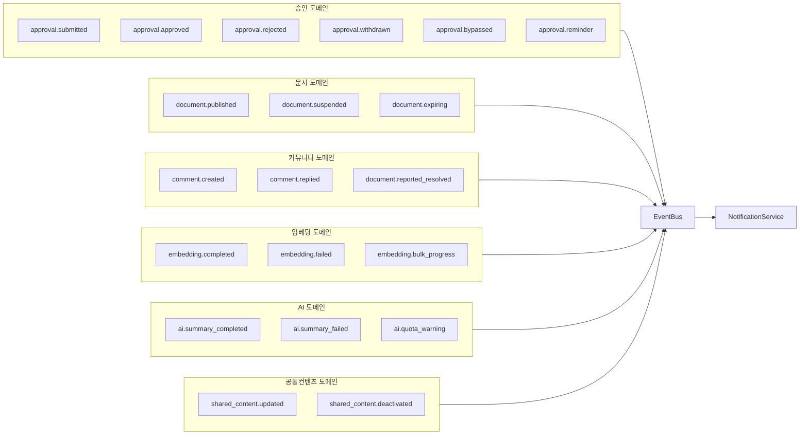
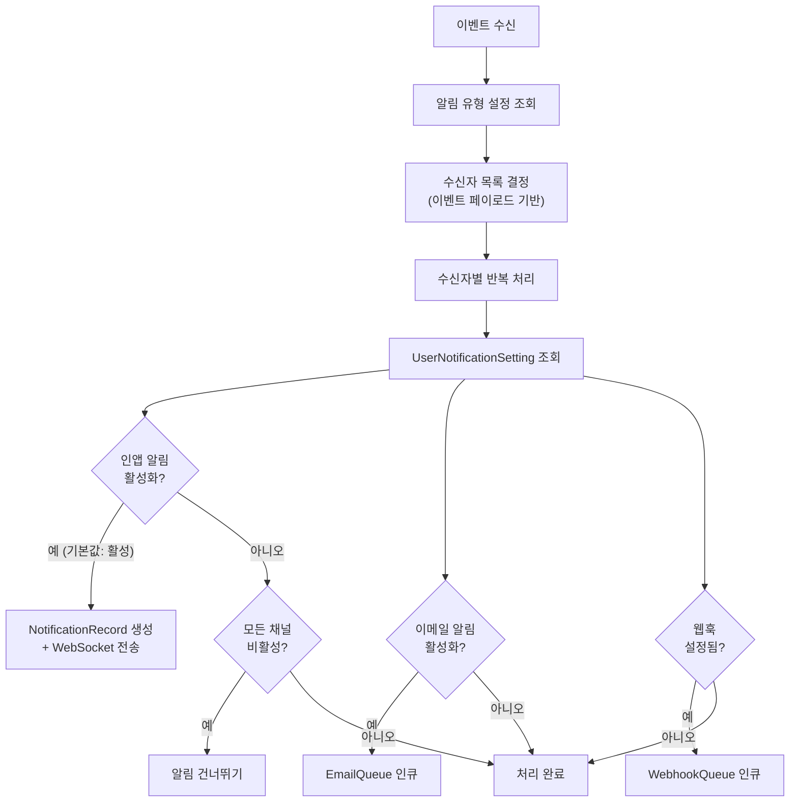
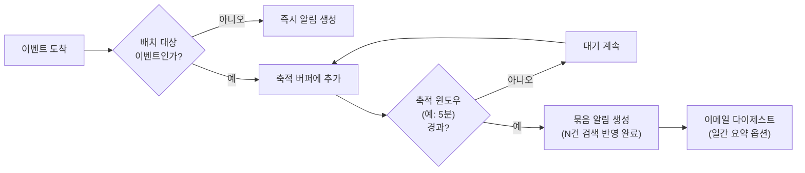
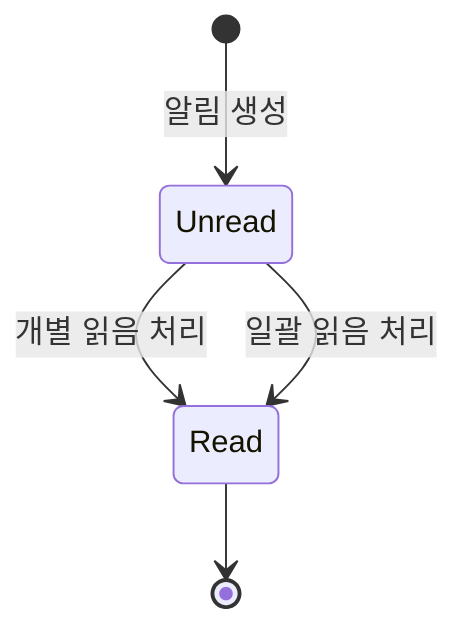

# 알림 디스패치 흐름

> **문서 상태**
> | 항목 | 값 |
> |------|-----|
> | 상태 | `draft` |
> | 검수 | `unreviewed` |
> | 작성일 | 2026-03-26 |
> | 최종 수정 | 2026-03-26 |

---

## 1. 범위

이 문서는 AICM KMS 시스템에서 **알림이 트리거되고, 채널별로 디스패치되며, 사용자 설정에 따라 필터링된 뒤 최종 전달되는 전체 파이프라인**을 정의한다.

구체적으로 다음 범위를 포함한다:

- 도메인 이벤트 발생으로부터 알림 생성까지의 흐름
- 사용자 알림 설정(UserNotificationSetting)에 의한 채널 분기 로직
- 인앱(필수), 이메일(선택), 웹훅(확장) 채널의 전달 경로
- 묶음 알림(배치) 처리 전략
- 읽음/안읽음 상태 전이

---

## 2. 기능정의서 참조

이 문서는 [FD-NTF-알림](../../features/FD-NTF-알림.md)에 정의된 **18개 알림 유형**을 기반으로 한다.

| # | 알림 유형 | 관련 도메인 |
|---|----------|------------|
| 1 | 내 문서에 댓글이 달림 | 커뮤니티 |
| 2 | 내 댓글에 대댓글이 달림 | 커뮤니티 |
| 3 | 내 문서가 신고 처리됨 | 커뮤니티 |
| 4 | 관심 게시판에 새 문서 등록 | 문서 |
| 5 | 시스템 공지사항 | 공통 |
| 6 | 새 승인 요청 도착 | 승인 |
| 7 | 승인됨 / 반려됨 | 승인 |
| 8 | N일 경과 미처리 리마인더 | 승인 |
| 9 | 철회 알림 | 승인 |
| 10 | CC 지정 / 상태 변경 | 승인 |
| 11 | 예약배포 완료 / 실패 | 승인 |
| 12 | 공통컨텐츠 수정 / 비활성 알림 | 문서 |
| 13 | 임베딩 완료 묶음 알림 | 임베딩 |
| 14 | 임베딩 실패 — 재시도 안내 | 임베딩 |
| 15 | 대량 재임베딩 현황 (관리자) | 임베딩 |
| 16 | 드래프트 장기 방치 알림 | 문서 |
| 17 | AI 요약 완료 / 실패 | AI |
| 18 | AI 쿼터 임박 / 초과 (관리자) | AI |

---

## 3. 알림 파이프라인 조감도

아래 다이어그램은 도메인 이벤트 발생부터 최종 전달까지의 엔드투엔드 파이프라인을 나타낸다.

---

## 4. 이벤트 소스별 트리거 매핑

### 4.1 매핑 테이블

| 도메인 | 이벤트 | 대응 알림 유형 (#) | 수신자 |
|--------|--------|-------------------|--------|
| **승인** | `approval.submitted` | #6 새 승인 요청 도착 | 해당 단계 승인권자 |
| | `approval.approved` | #7 승인됨 | 요청자 |
| | `approval.rejected` | #7 반려됨 | 요청자 |
| | `approval.withdrawn` | #9 철회 알림 | 해당 단계 승인권자 |
| | `approval.bypassed` | #10 CC 지정 / 상태 변경 | 참조자 |
| | `approval.reminder` | #8 미처리 리마인더 | 해당 단계 승인권자 |
| **문서** | `document.published` | #4 구독 게시판 새 문서 | 게시판 구독자 |
| | `document.suspended` | #11 회수 알림 | 문서 작성자 |
| | `document.expiring` | #16 만료 사전 알림 | 문서 작성자, 편집 권한자 |
| **커뮤니티** | `comment.created` | #1 내 문서에 댓글 | 문서 작성자 |
| | `comment.replied` | #2 내 댓글에 대댓글 | 부모 댓글 작성자 |
| | `document.reported_resolved` | #3 신고 처리됨 | 문서 작성자 |
| **임베딩** | `embedding.completed` | #13 완료 묶음 알림 | 문서 작성자 |
| | `embedding.failed` | #14 실패 안내 | 문서 작성자 |
| | `embedding.bulk_progress` | #15 대량 재임베딩 현황 | 관리자 |
| **AI** | `ai.summary_completed` | #17 요약 완료 | 요청 사용자 |
| | `ai.summary_failed` | #17 요약 실패 | 요청 사용자 |
| | `ai.quota_warning` | #18 쿼터 임박/초과 | 관리자 |
| **공통컨텐츠** | `shared_content.updated` | #12 공통컨텐츠 수정 | 참조 문서 작성자 |
| | `shared_content.deactivated` | #12 공통컨텐츠 비활성 | 참조 문서 작성자 |

### 4.2 도메인별 이벤트 흐름

---

## 5. 채널 분기 및 사용자 설정 필터링 흐름

NotificationService가 이벤트를 수신한 후, 수신자별로 알림 설정을 조회하여 채널을 분기하는 흐름이다.

**채널별 기본 동작:**

| 채널 | 기본값 | 사용자 제어 | 비고 |
|------|--------|-----------|------|
| 인앱 알림 | 활성 | 유형별 on/off | 시스템 공지는 강제 활성 |
| 이메일 | 비활성 | 유형별 on/off | 발송 빈도 제어 가능 |
| 웹훅 | 미설정 | URL 등록 시 활성 | 관리자 설정 |

---

## 6. 묶음 알림 (배치) 처리

특정 이벤트는 단시간에 대량 발생할 수 있으므로, 건별 알림 대신 묶음 알림으로 처리한다.

### 6.1 배치 대상

| 이벤트 | 묶음 기준 | 알림 메시지 예시 |
|--------|----------|-----------------|
| `embedding.completed` | 사용자 + 시간 윈도우 | "N건 검색 반영 완료" |
| `document.published` (구독) | 게시판 + 시간 윈도우 | "구독 게시판에 N건 새 문서" |
| `approval.reminder` | 승인권자 + 일 단위 | "N건 승인 대기 중 (D+N)" |

### 6.2 배치 처리 흐름

**축적 윈도우 설정:**

- 기본값: 5분
- 관리자가 시스템 설정에서 조정 가능 (최소 1분 ~ 최대 30분)
- 이메일 다이제스트: 일간 요약 옵션 (매일 오전 9시 발송)

---

## 7. 읽음/안읽음 상태 전이

인앱 알림의 읽음 상태는 다음과 같이 전이된다.

**상태 전이 조건:**

| 전이 | 트리거 | 비고 |
|------|--------|------|
| 생성 → 안읽음 | NotificationRecord 저장 시 | 기본 상태 |
| 안읽음 → 읽음 | 사용자가 알림 클릭 | 대상 페이지로 이동과 동시에 전환 |
| 안읽음 → 읽음 | "전체 읽음 처리" 버튼 | 모든 미읽은 알림 일괄 전환 |

---

## 8. 관련 문서

| 문서 | 설명 |
|------|------|
| [FD-NTF-알림](../../features/FD-NTF-알림.md) | 18개 알림 유형 및 채널 정의 |
| [UC-PER-개인영역](../../usecases/user/UC-PER-개인영역.md) (UC-PER-02) | 알림 확인 및 설정 관리 유즈케이스 |
| [비동기 이벤트 아키텍처](../../../02-architecture/04-async-event-architecture.md) | EventBus 및 비동기 처리 구조 |
| [데이터 아키텍처 -- NotificationModule](../../../03-module-design/notification/data.md) | NotificationRecord, UserNotificationSetting 엔티티 정의 |
