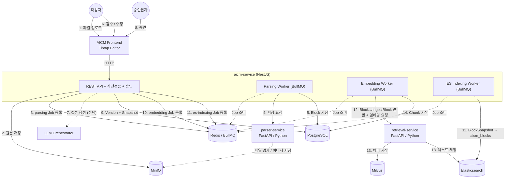
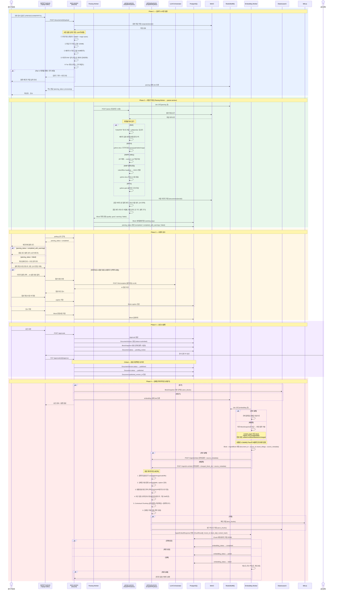

> **문서 상태**
> | 항목 | 값 |
> |------|-----|
> | 상태 | `draft` |
> | 검수 | `unreviewed` |
> | 작성일 | 2026-03-18 |
> | 최종 수정 | 2026-04-06 |

# 문서 업로드 파이프라인 다이어그램

> 외부 문서(PDF/DOCX/HWP/PPTX) 업로드부터 벡터 임베딩 저장까지의 엔드투엔드 파이프라인을 시각화한다. 각 단계의 전략·설계 근거는 [파싱 전략](./01-parsing.md), [청킹 전략](./02-chunking.md)에서 다룬다.

---

## 1. 컨테이너 다이어그램 (흐름 중심)

컨테이너 간 관계와 데이터 흐름을 번호순으로 표현한다. 실선은 동기/필수 흐름, 점선은 비동기/선택적 흐름이다. 파싱과 임베딩 모두 BullMQ 큐를 통해 비동기로 처리된다.

### 흐름 요약

| 번호 | 단계 | 컨테이너 | 설명 |
|------|------|---------|------|
| 1 | 업로드 | Frontend → aicm-service | 작성자가 PDF/DOCX/HWP/PPTX 파일 업로드 |
| 2 | 원본 저장 | aicm-service → MinIO | `originals/{docId}/`에 원본 파일 저장 |
| 3 | 파싱 Job | aicm-service → Redis | BullMQ `parsing` 큐에 비동기 Job 등록, 즉시 응답 (`parsing_status: processing`) |
| 4 | 파싱 | Parsing Worker → parser-service | 포맷별 파싱 (타임아웃 10분), Block 목록 반환 |
| 5 | Block 저장 | Parsing Worker → PostgreSQL | 파싱된 Block 목록을 RDB에 저장 (working copy), `parsing_status` 갱신 |
| 6 | 검수 | 작성자 → Frontend | Frontend가 polling으로 파싱 완료 감지 → 에디터에 블록 로드, 검수/수정 |
| 7 | 캡션 | aicm-service → LLM Orchestrator | (선택) 이미지/표에 멀티모달 sLLM 캡션 생성 |
| 8 | 승인 | 승인권자 → Frontend → aicm-service | 승인권자가 문서 승인 |
| 9 | 스냅샷 | aicm-service → PostgreSQL | DocumentVersion + BlockSnapshot 생성, 상태 전이 |
| 10 | 임베딩 Job | aicm-service → Redis | BullMQ `embedding` 큐에 비동기 Job 등록 (대용량 시 Flow parent-child 분할) |
| 11 | 인덱싱 | aicm-service → Elasticsearch | BlockSnapshot 기반 ES `aicm_blocks` 인덱싱. BullMQ `es-indexing` 큐로 비동기 처리 또는 소규모 시 동기 처리 |
| 12 | 청킹+임베딩 | Embedding Worker → retrieval-service | Block→IngestBlock 변환 후 POST /ingest/embed(최초) 또는 POST /ingest/re-embed(재발행) 호출 |
| 13 | 벡터/텍스트 저장 | retrieval-service → Milvus / ES | `kms_chunks` (벡터) + `aicm_chunks` (텍스트) 저장 |
| 14 | 메타 저장 | Embedding Worker → PostgreSQL | Chunk 메타데이터 저장, `embedding_status` 갱신 |

### 컨테이너 역할

| 컨테이너 | 기술 스택 | 파이프라인 내 역할 |
|----------|----------|-----------------|
| AICM Frontend | Vue.js + Tiptap | 파일 업로드 UI, 파싱 상태 polling, 블록 에디터(검수/수정), 품질 경고 표시 |
| aicm-service | NestJS + TypeScript | 파이프라인 오케스트레이터 — 사전 검증, BullMQ Job 등록, Block 저장, 승인, 이벤트 발행 |
| Parsing Worker | BullMQ Worker (aicm-service 내부) | 비동기 파싱 Job 소비 — parser-service 호출, Block 저장, `parsing_status` 갱신 |
| Embedding Worker | BullMQ Worker (aicm-service 내부) | 비동기 임베딩 Job 소비 — Block→IngestBlock 변환 후 retrieval-service 호출, Chunk 메타 저장, `embedding_status` 갱신 |
| parser-service | FastAPI + Python | 포맷별 파싱 (PyMuPDF, python-docx, HWPX XML, python-pptx, LibreOffice), stateless 문서→블록 변환 |
| retrieval-service | FastAPI + Python | 청킹, 임베딩(벡터 생성), 시맨틱/하이브리드 검색. 범용 모델 (source_id, block_id, source_metadata) |
| LLM Orchestrator | NestJS + TypeScript | 멀티모달 sLLM 호출 — 이미지/표 캡션 생성 (사용자 요청 시에만) |
| PostgreSQL | RDB (DB-per-tenant) | Document, Block, Chunk, DocumentVersion, BlockSnapshot |
| MinIO | S3 호환 Object Storage | `originals/` (업로드 원본), `documents/` (추출 이미지) |
| Redis | BullMQ 큐 | `embedding` (priority 기반: 신규 발행=1, 재임베딩=3), `es-indexing` (높음) |
| Elasticsearch | nori 분석기 | `aicm_blocks` (BM25 문서 검색), `aicm_chunks` (BM25 청크 검색) |
| Milvus | HNSW 벡터 인덱스 | `kms_chunks` (시맨틱 벡터 검색) |

---

## 2. 시퀀스 다이어그램

시간 순서에 따른 컨테이너 간 상호작용을 5개 Phase로 구분하여 표현한다.

### Phase별 요약

| Phase | 구간 | 핵심 컨테이너 | 동기/비동기 |
|-------|------|-------------|-----------|
| 1. 업로드 & 사전 검증 | 작성자 → Frontend → aicm-service → MinIO → BullMQ | aicm-service (규칙 기반 5단계 검증 + parsing Job 등록) | 사전 검증만 동기, 파싱 Job은 비동기 |
| 2. 파싱 | Parsing Worker → parser-service → MinIO → PostgreSQL | Parsing Worker + parser-service (포맷별 파서 + 품질 체크) | **비동기** (BullMQ `parsing` 큐) |
| 3. 검수 | Frontend (polling) → 작성자 | Frontend (Tiptap 에디터), LLM Orchestrator (캡션, 선택적) | 동기 (사용자 상호작용) |
| 4. 승인 & 발행 | 작성자 → 승인권자 → aicm-service → PostgreSQL | aicm-service (동일 트랜잭션 내 상태 전이) | 동기 |
| 5. 임베딩 파이프라인 | BullMQ → Embedding Worker → retrieval-service → Milvus/ES | Embedding Worker + retrieval-service (6단계 청킹 + 벡터 생성, 대용량 시 Flow 배치 분할) | **비동기** (BullMQ `embedding` 큐) |

### 핵심 설계 포인트

- **파싱도 비동기** — BullMQ `parsing` 큐를 통해 항상 비동기 처리. 코드 경로 단일화로 동기/비동기 분기 복잡도 제거. 소형 문서도 1~2초 내 큐 처리 완료
- **파싱 → 검수 → 발행 → 임베딩** 순서 강제 — 파싱 후 즉시 임베딩하지 않음 (데이터 품질 보장)
- **대용량 지원** — 100MB/500페이지까지 지원. 파싱 타임아웃 10분, 임베딩은 BullMQ Flow로 50블록 단위 배치 분할
- **Tier 시스템** — 사전 검증 단계에서 품질 보장 불가한 문서(Tier 3)를 조기 차단
- **AI 캡션은 사용자 요청 시에만** 생성 — 파싱 단계에서 자동 생성하지 않음 (sLLM 자원 효율)
- **재발행 시 변경 블록만** 재임베딩 — content_hash/caption 비교로 불필요한 임베딩 방지. 최초 발행은 `POST /ingest/embed`, 재발행은 `POST /ingest/re-embed`(changed_block_ids 포함)으로 엔드포인트 분기
- **삽입 → 삭제 순서** — 검색 공백 없이 청크 교체

---

## 관련 문서

| 문서 | 참조 내용 |
|------|----------|
| [파싱 전략](./01-parsing.md) | Tier 시스템, 사전 검증, 포맷별 파싱 전략, 품질 체크, 사용자 검수 |
| [청킹 전략](./02-chunking.md) | 블록 타입별 청킹, 템플릿별 분기, 토큰 분할, Contextual Chunking, 재임베딩 |
| [검색 전략](./03-search.md) | 하이브리드 검색, 권한 필터, 결과 반환 |
| [데이터 아키텍처](../../../02-architecture/data/README.md) | Block/Chunk 엔티티, ES/Milvus 스키마, 청킹 파이프라인 입출력 |
| [비동기 처리 아키텍처](../../../02-architecture/05-async-event-architecture.md) | BullMQ 큐 설계, 임베딩 파이프라인 시퀀스, 이벤트 신뢰성 티어 |
| [외부 서비스 연동](../../../02-architecture/06-external-integration.md) | parser-service·retrieval-service·LLM Orchestrator 연동 인터페이스 |
