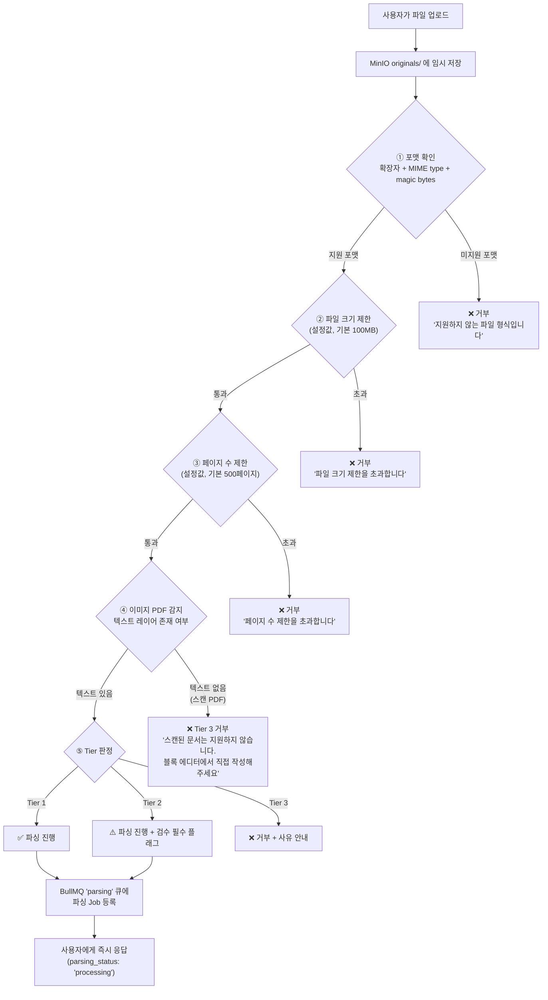
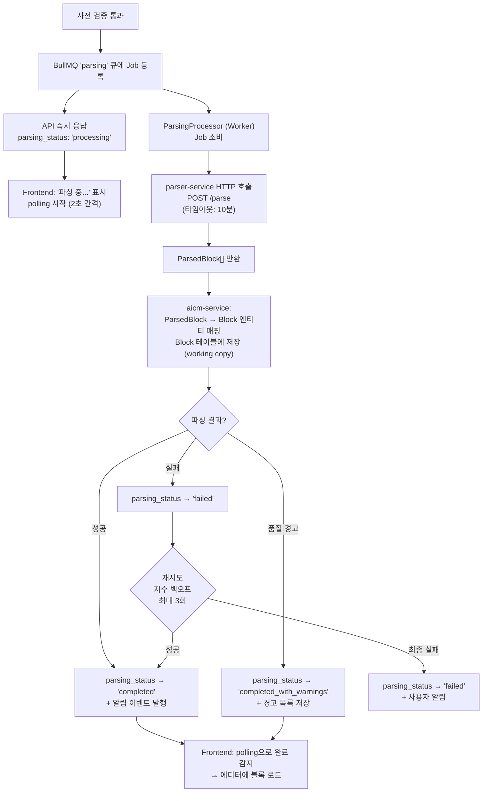
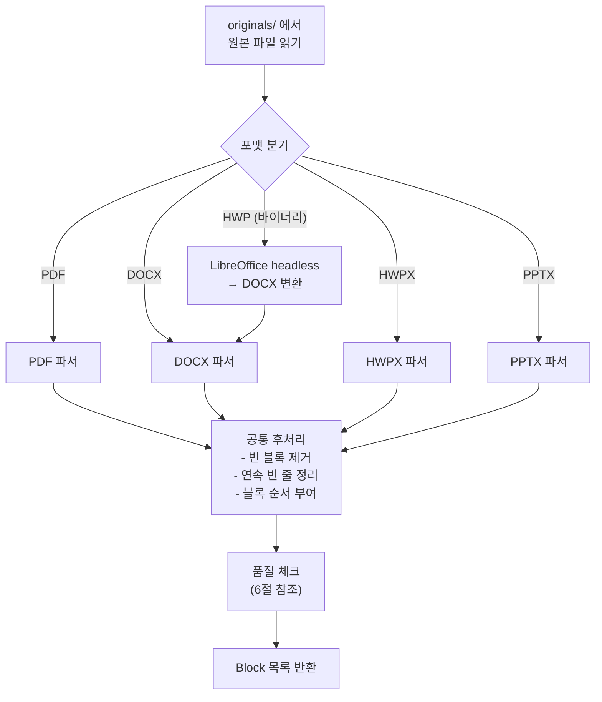
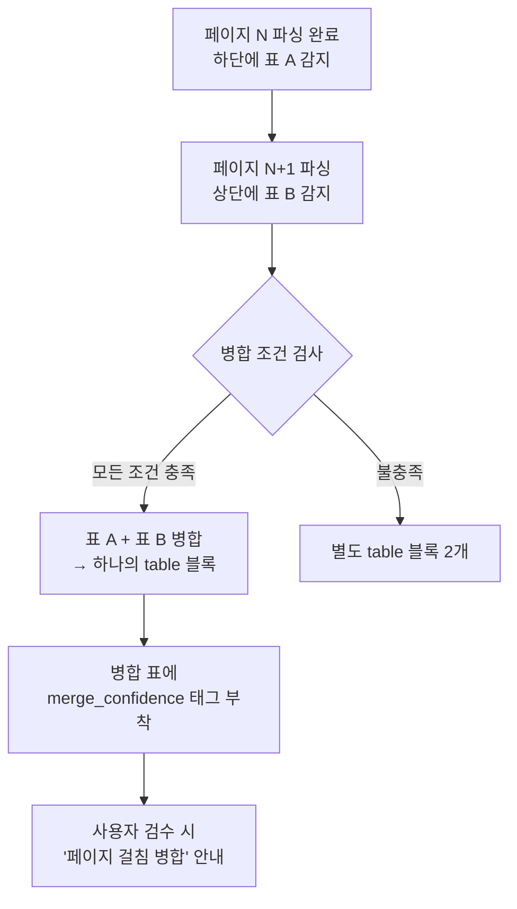
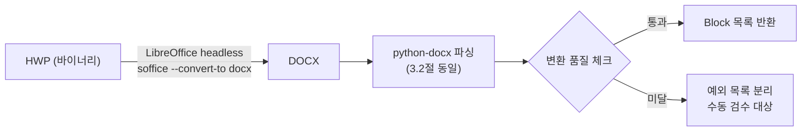
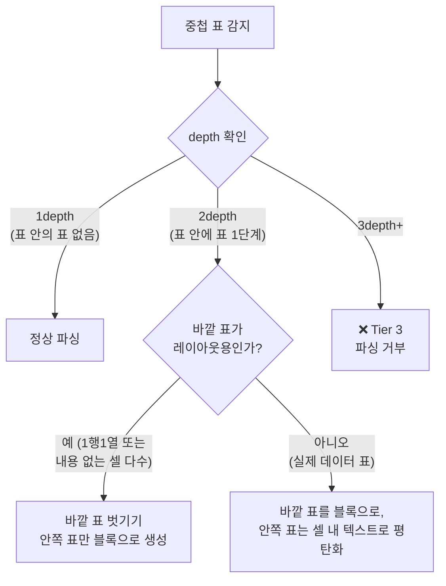
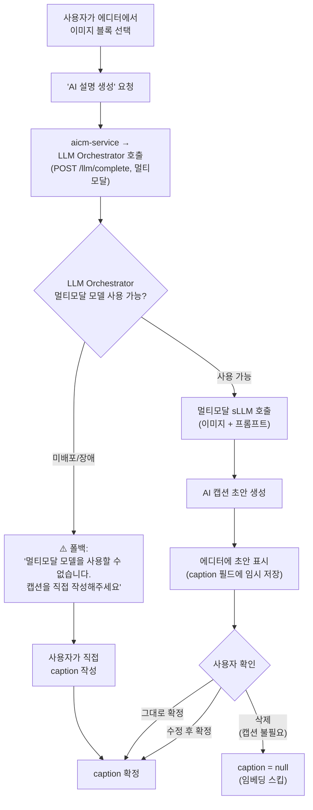
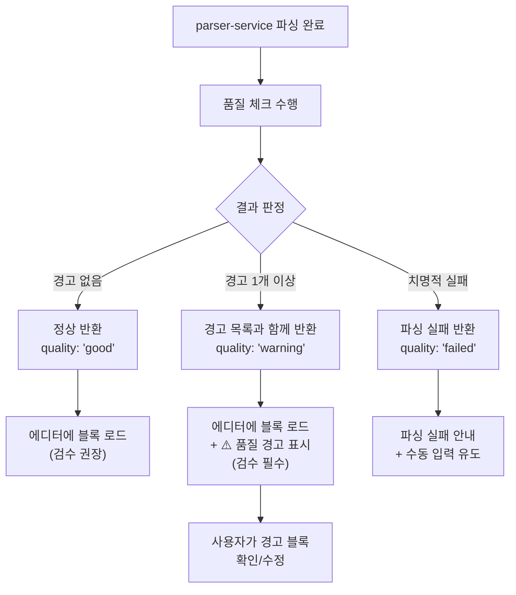
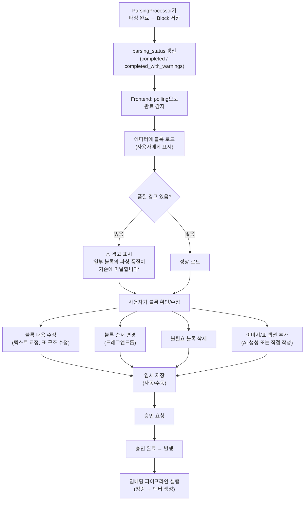
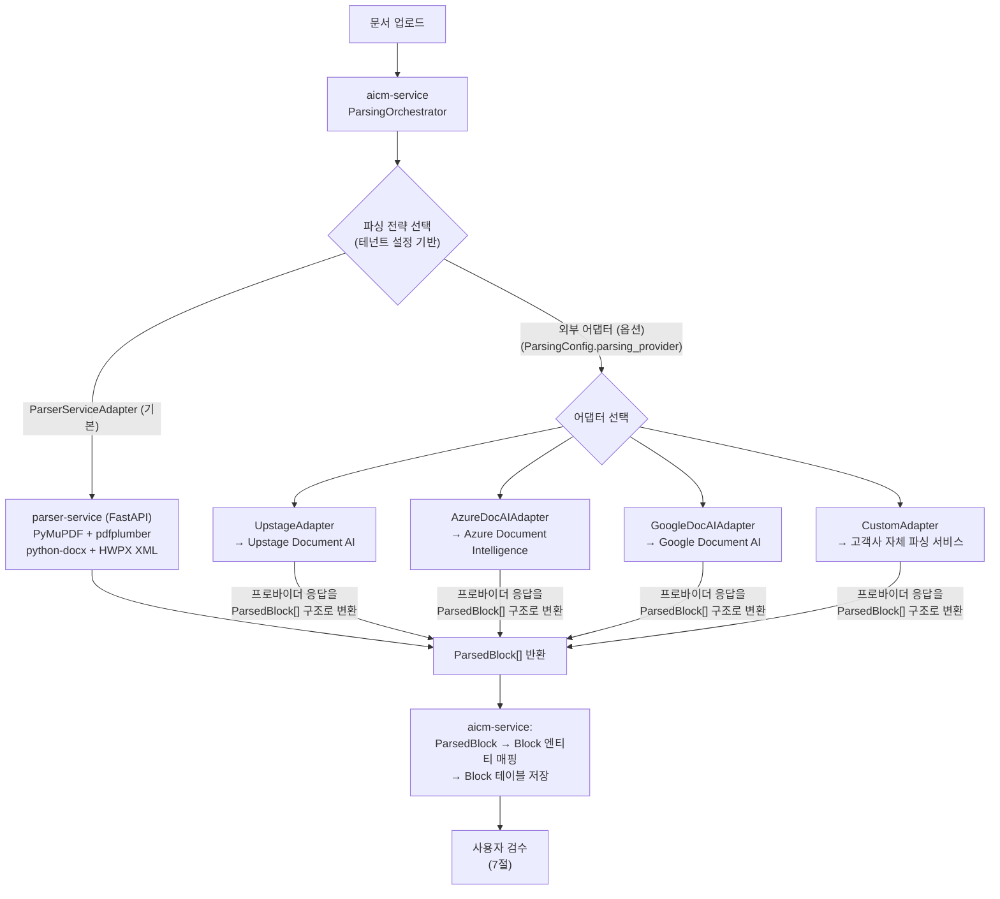

> **문서 상태**
> | 항목 | 값 |
> |------|-----|
> | 상태 | `draft` |
> | 검수 | `unreviewed` |
> | 작성일 | 2026-03-17 |
> | 최종 수정 | 2026-04-06 |

> **기능정의서 참조**: 2.3절 (블록 에디터 문서 청킹), 2.5절 (파일 업로드 문서 청킹)

# 파싱 전략

> 외부 문서(PDF/DOCX)를 Block 엔티티로 변환하는 전략. Tiptap 에디터 JSON 파싱(직접 작성)은 이 문서의 범위 밖이다.

이 문서는 parser-service가 담당하는 **외부 문서 파싱** 범위에 집중한다. parser-service는 stateless FastAPI 서비스로, 파일을 입력받아 ParsedBlock[]을 반환하며 스토리지를 소유하지 않는다. aicm-service의 **ParsingModule**은 Strategy 패턴으로 설계되어, `ParsingOrchestrator`가 parser-service(ParserServiceAdapter) 또는 외부 파싱 서비스(Azure Doc AI, Upstage 등)에 파싱을 위임한다. 파싱 결과물인 Block 엔티티의 필드 정의(content_raw, content_text, caption 등)는 [데이터 아키텍처 — RDB 엔티티](../../../02-architecture/data/aicm/rdb.md)에, parser-service/retrieval-service 연동 인터페이스는 [외부 서비스 연동 7.2절](../../../02-architecture/06-external-integration.md)에 이미 정의되어 있으므로 참조만 한다.

> **파싱의 위치 — primary path vs secondary path**: AICM의 핵심 콘텐츠 생성 경로는 **블록 에디터에서 직접 작성**하는 것이다. 외부 문서 파싱은 고객사의 **기존 문서를 이관(migration)하기 위한 보조 경로**이며, 운영 단계에서는 신규 문서가 에디터에서 생성되므로 파싱 의존도가 점차 줄어든다. 따라서 파싱의 목표는 "모든 문서를 완벽하게 자동 변환"이 아니라, **"80%를 자동으로 잡고, 나머지 20%는 사용자가 에디터에서 정리할 수 있는 환경을 제공"**하는 것이다.

---

## 1. 문서 지원 Tier 정의

[README의 Tier 시스템](./README.md)을 파일 포맷·구조별로 구체화한다.

### 1.1 포맷별 지원 등급 매트릭스

| 포맷 | 하위 유형 | Tier | 처리 방식 | 알려진 한계 |
|------|----------|------|----------|-----------|
| **PDF** | 텍스트 기반 (디지털 생성) | Tier 1 | 텍스트 레이어 직접 추출 | — |
| PDF | 텍스트+이미지 혼합 | Tier 1~2 | 텍스트 추출 + 이미지 블록 분리 | 다단 레이아웃 시 읽기 순서 보장 어려움 |
| PDF | 이미지 PDF (스캔) | Tier 3 | 업로드 거부, 블록 에디터 직접 입력 안내 | OCR 미지원 (sLLM 환경에서 정확도 불충분) |
| **DOCX** | 일반 문서 | Tier 1 | python-docx 파싱 | — |
| DOCX | 복잡 레이아웃 (텍스트 박스, 다단) | Tier 2 | python-docx + 레이아웃 요소 최선 추출 | 텍스트 박스 내용 순서 불확실 |
| **HWPX** | XML 기반 (2014+) | Tier 1 | XML 직접 파싱 | — |
| **HWP** | 바이너리 (구 형식) | Tier 2 | LibreOffice headless → DOCX 변환 → python-docx | 변환 과정에서 서식/레이아웃 손실 가능 |
| **PPTX** | 슬라이드 문서 | Tier 2 | python-pptx 파싱, 슬라이드 단위 블록 매핑 | 애니메이션/전환 정보 유실, 그룹 도형 제한적 |

### 1.2 구조별 지원 등급

| 문서 구조 | Tier | 비고 |
|----------|------|------|
| 제목/본문 구분 명확 | Tier 1 | heading 태그, 스타일 기반 자동 인식 |
| 단순 표 (병합 없음, 5열 이하) | Tier 1 | 규칙 기반 파싱 |
| 복합 표 (셀 병합, 6열 이상) | Tier 2 | 병합 정보 보존 시도, 사용자 검수 필수 |
| 중첩 표 (2depth 이내) | Tier 2 | 레이아웃용 바깥 표 벗기기 시도 |
| 중첩 표 (3depth 이상) | Tier 3 | 파싱 거부, 수동 입력 안내 |
| 다단 레이아웃 / 사이드바 | Tier 2 | 읽기 순서 보장 어려움 |
| 이미지 중심 문서 (텍스트 10% 미만) | Tier 2 | 이미지 캡션 필수, 사용자 검수 필수 |
| 스캔 이미지 / 손글씨 | Tier 3 | 미지원 |

> **왜 Tier 3를 거부하는가**: sLLM 환경에서 OCR·손글씨 인식의 정확도는 실무 기준에 미치지 못한다. 부정확한 파싱 결과가 검색/RAG 파이프라인에 유입되면 검색 품질 전체가 하락한다. 품질을 보장할 수 없는 문서는 업로드를 거부하고, 블록 에디터에서 직접 작성하도록 안내하는 것이 전체 시스템 신뢰성에 유리하다.

---

## 2. 업로드 시 사전 검증 흐름

파일이 업로드되면 parser-service에 파싱을 요청하기 **전에**, aicm-service에서 사전 검증을 수행한다. 이 단계는 순수 규칙 기반이며 LLM을 사용하지 않는다. 사전 검증을 통과한 파일은 **항상 BullMQ `parsing` 큐를 통해 비동기로 파싱**된다.



### 2.1 검증 단계 상세

| 단계 | 검증 항목 | 구현 방식 | 비고 |
|------|----------|----------|------|
| ① 포맷 확인 | 확장자 + MIME type + magic bytes 삼중 검증 | 확장자만으로 판단하지 않음 (위변조 방지) | magic bytes: PDF(`%PDF`), DOCX/PPTX(`PK`), HWP(`\xD0\xCF`) |
| ② 파일 크기 | 테넌트별 설정 가능한 상한 | SystemConfig에서 관리 | 기본값: 100MB |
| ③ 페이지 수 | PDF: 메타데이터에서 추출, DOCX/PPTX: 속성에서 추출 | 메타데이터 읽기만 수행 (전체 파싱 전) | 기본값: 500페이지 |
| ④ 이미지 PDF | 첫 N페이지에서 텍스트 추출 시도 | 추출 텍스트가 극소(임계값 미만)이면 스캔으로 판정 | 임계값: 페이지당 평균 10자 미만 |
| ⑤ Tier 판정 | 포맷 + 구조 복잡도 종합 판단 | 1.1, 1.2절 매트릭스 기반 규칙 | 구조 복잡도는 파싱 후에도 재평가 |

> **왜 제한치를 상향했는가**: 파싱을 비동기(BullMQ)로 전환하면서 HTTP 타임아웃 제약이 사라졌다. 백그라운드 Worker는 충분히 긴 타임아웃(기본 10분)으로 parser-service를 호출할 수 있으므로, 대용량 문서도 처리 가능하다. BullMQ의 동시 처리 수 설정(기본 2)으로 parser-service 부하를 제어하며, 초과 문서는 큐에서 대기한다.

> **왜 LLM 없이 규칙 기반으로 Tier를 판정하는가**: Tier 판정은 모든 업로드마다 실행되는 고빈도 작업이다. sLLM 호출은 응답 시간(수초)과 자원 소비 측면에서 부적합하다. 포맷 확인·텍스트 비율·구조 복잡도 같은 단순 지표는 규칙으로 충분히 판별할 수 있으며, 판정 결과가 불확실한 경우 Tier 2(검수 필수)로 분류하여 안전망을 확보한다.

### 2.2 비동기 파싱 파이프라인

사전 검증을 통과한 파일은 **항상** BullMQ `parsing` 큐를 통해 비동기로 파싱된다. 코드 경로를 단일화하여 동기/비동기 분기에 따른 복잡도와 테스트 부담을 제거한다.



**파싱 상태 모델 (`Document.parsing_status`):**

| 상태 | 의미 | 프론트엔드 동작 |
|------|------|-------------|
| `null` | 외부 문서 업로드 없음 (에디터 직접 작성) | — |
| `processing` | 파싱 진행 중 | '파싱 중...' 표시, polling |
| `completed` | 파싱 완료, 품질 양호 | 에디터에 블록 로드, 검수 권장 |
| `completed_with_warnings` | 파싱 완료, 품질 경고 있음 | 에디터에 블록 로드 + 경고 표시, 검수 필수 |
| `failed` | 파싱 실패 (재시도 소진) | 실패 안내 + 재업로드 또는 수동 입력 유도 |

> **왜 항상 비동기인가**: 동기/비동기 분기를 두면 ① 코드 경로가 2개로 늘어나 테스트·유지보수 부담이 증가하고, ② Block 저장 이후 로직(에디터 로드, 품질 경고, 검수 흐름)을 양쪽에 일관되게 유지해야 하는 부담이 생긴다. 항상 비동기로 통일하면 코드 경로가 1개이고, 소형 문서(10~30페이지)도 1~2초 이내에 큐 처리가 완료되어 사용자 체감 지연이 최소화된다. BullMQ Worker는 유휴 상태에서 즉시 Job을 소비하므로 큐 대기 시간은 무시할 수 있는 수준이다.

> **parser-service는 stateless 파싱 전용 서비스다**: parser-service는 파일을 입력받아 ParsedBlock[]을 반환하는 stateless 서비스이며, 스토리지를 소유하지 않는다. ParsedBlock → Block 엔티티 변환과 RDB 저장은 aicm-service가 담당한다. 비동기 전환의 핵심은 aicm-service 쪽의 호출 패턴 변경이다. parser-service는 동기 HTTP API(`POST /parse`)를 제공하며, 호출자가 API 핸들러에서 BullMQ Worker로 바뀔 뿐이다. Worker는 백그라운드에서 실행되므로 HTTP 타임아웃을 충분히 높게(기본 10분) 설정할 수 있어 대용량 문서도 처리 가능하다.
>
> **전체 흐름: aicm → parser-service → ParsedBlock[] → aicm Block 저장 → (발행 시) aicm → retrieval-service 임베딩**: 파싱 단계에서 parser-service가 반환한 ParsedBlock[]은 aicm-service에서 Block 엔티티로 변환·저장된다. 임베딩은 파싱 시점이 아닌 **발행(publish) 시점**에 별도로 retrieval-service를 통해 실행된다.
>
> **파싱 API 프로토콜**: parser-service와의 통신 프로토콜(NDJSON 스트리밍, 커서 기반 이어받기 등) 상세는 [외부 서비스 연동 §7.2](../../../02-architecture/06-external-integration.md)를 참조한다. 이 문서는 파싱 **전략**(Tier 시스템, 포맷별 전략, 품질 체크)에 집중하며, API 프로토콜은 외부 서비스 연동 문서에 위임한다.

**프론트엔드 UX:**

| 시나리오 | UX |
|---------|-----|
| 업로드 직후 | '파싱 중...' 프로그레스 표시, 문서 편집 불가 |
| 소형 문서 (1~2초 완료) | 프로그레스가 잠깐 보이고 곧 에디터 로드 — 거의 즉시 느낌 |
| 대형 문서 (수 분 소요) | 프로그레스 유지, 다른 문서 작업 가능, 완료 시 인앱 알림 |
| 브라우저 이탈 후 복귀 | 문서 목록에서 `parsing_status` 확인 → 상태별 표시 |
| 파싱 실패 | 실패 사유 안내 + 재업로드 또는 블록 에디터 직접 입력 유도 |

---

## 3. 파일 포맷별 파싱 전략

parser-service(FastAPI)가 수행하는 포맷별 파싱 로직. parser-service는 stateless이며, 파싱 결과를 ParsedBlock[] 형태로 반환한다. aicm-service가 이를 Block 엔티티로 변환·저장한다.



### 3.1 PDF 파싱

**전략: 텍스트 레이어 우선 추출**

| 단계 | 처리 | 라이브러리 |
|------|------|-----------|
| 1. 텍스트 추출 | PDF 텍스트 레이어에서 직접 추출 | PyMuPDF(fitz) |
| 2. 구조 인식 | 폰트 크기·굵기 기반 heading 추정 | 규칙 기반 (폰트 메트릭 분석) |
| 3. 표 감지 | 선(line) 기반 표 영역 감지 + 셀 추출 | pdfplumber / PyMuPDF |
| 4. 이미지 추출 | 임베디드 이미지 추출 → MinIO documents/ 저장 | PyMuPDF |
| 5. 읽기 순서 | 좌표 기반 정렬 (좌상단→우하단) | 규칙 기반 |

> **왜 OCR을 기본으로 사용하지 않는가**: 텍스트 레이어가 존재하는 PDF에 OCR을 적용하면 오히려 품질이 떨어진다 (인코딩 깨짐, 서식 유실). 텍스트 레이어 추출이 항상 우선이며, 텍스트 레이어가 없는 PDF는 사전 검증(2절)에서 Tier 3로 거부한다.

**페이지 걸침 요소 병합:**

PDF는 논리적 구조 없이 좌표 기반 렌더링 명령어의 집합이므로, pdfplumber 등의 표 감지가 **페이지 단위로 수행**된다. 테이블이 페이지 경계에 걸쳐 있으면 2개의 별도 테이블로 감지되는 문제가 발생한다. 이를 해결하기 위해 **페이지 걸침 테이블 병합 휴리스틱**을 적용한다.



| 병합 조건 | 판단 기준 | 비고 |
|----------|----------|------|
| 열 수 동일 | 표 A와 표 B의 컬럼 수가 같음 | 필수 조건 |
| 열 너비 유사 | 각 열의 너비 비율 차이가 허용 오차(10%) 이내 | 필수 조건 |
| 위치 인접 | 표 A가 페이지 하단 여백 임계값 이내, 표 B가 페이지 상단 여백 임계값 이내 | 필수 조건 |
| 헤더 부재 | 표 B의 첫 행이 헤더 패턴이 아님 (볼드/배경색 없음) | 보조 조건 — 충족 시 병합 확신도 상승 |

> **왜 규칙 기반 휴리스틱인가**: 이 판단은 열 수·너비·위치라는 숫자 비교만으로 수행 가능하므로 sLLM이 불필요하다. 다만 100% 정확하지 않으므로, 병합된 테이블에는 `merge_confidence` 태그를 부착하여 사용자 검수 시 "이 표는 페이지 걸침으로 자동 병합되었습니다"라는 안내를 표시한다. 사용자가 병합을 해제하거나 수정할 수 있다.

> **DOCX/HWPX에서는 이 문제가 발생하지 않는다**: DOCX는 `<w:tbl>`, HWPX는 `<hp:tbl>` 요소가 테이블 전체를 하나의 XML 노드로 표현한다. 화면에서 여러 페이지에 걸쳐 보이더라도 논리적 구조는 하나의 테이블이므로 파싱 시 완전한 테이블을 얻을 수 있다. 페이지 걸침 병합은 PDF에서만 필요한 전략이다.

**텍스트 문단의 페이지 걸침:**

텍스트 문단이 페이지 경계에서 잘리는 경우는 표보다 처리가 단순하다. PyMuPDF의 텍스트 추출은 페이지별로 수행되지만, 후처리 단계에서 다음 규칙으로 이어붙인다:
- 페이지 N의 마지막 텍스트가 마침표·느낌표·물음표 등 문장 종결 부호 없이 끝남 + 페이지 N+1의 첫 텍스트가 소문자/조사로 시작 → 동일 문단으로 병합
- 불확실한 경우 별도 문단으로 유지 (사용자 검수에서 수정 가능)

**한계점:**
- 다단 레이아웃(2단 이상)에서 읽기 순서가 의도와 다를 수 있음 → Tier 2 분류, 사용자 검수 필수
- 워터마크·머리글·바닥글이 본문에 혼입될 수 있음 → 반복 패턴 감지로 필터링 시도
- 수식(LaTeX)은 이미지로 추출되며 텍스트 변환 미지원
- 페이지 걸침 테이블 병합은 휴리스틱이므로 오탐/미탐 가능 → Tier 2 분류, 사용자 검수 필수

### 3.2 DOCX 파싱

**전략: python-docx를 활용한 구조적 파싱**

| 단계 | 처리 | 비고 |
|------|------|------|
| 1. 문단 추출 | paragraph 순회, 스타일(Heading 1~6, Normal 등) 인식 | 스타일 없는 문단은 폰트 크기로 heading 추정 |
| 2. 표 추출 | table 오브젝트 순회, 셀 병합 정보 보존 | 4절에서 상세 |
| 3. 이미지 추출 | inline/anchor 이미지 추출 → MinIO documents/ 저장 | 텍스트 박스 내 이미지 포함 |
| 4. 리스트 처리 | `numPr` 속성 기반 번호/글머리 목록 인식 | 중첩 리스트 depth 보존 |
| 5. 텍스트 박스 | textbox 요소 추출, 인접 문단 이후에 삽입 | 정확한 위치 보장 불가 (Tier 2 요인) |

> **왜 python-docx인가**: DOCX는 OOXML 표준 기반이므로 XML을 직접 파싱할 수도 있지만, python-docx가 paragraph·table·image 접근 API를 안정적으로 제공하며, 셀 병합 정보(`gridSpan`, `vMerge`)도 접근 가능하다. 직접 XML 파싱 대비 유지보수 부담이 낮다.

**한계점:**
- 텍스트 박스(floating) 콘텐츠의 정확한 위치 판단이 어려움
- 매크로/ActiveX 컨트롤 무시
- 그리기 개체(SmartArt, 차트)는 이미지로 추출 시도하되, 실패 시 블록에서 제외

### 3.3 HWPX 파싱 (XML 기반)

**전략: HWPX(XML) 직접 파싱**

HWPX는 2014년 이후 한글 표준 포맷으로, ZIP 안에 XML 문서 구조를 포함한다.

| 단계 | 처리 | 비고 |
|------|------|------|
| 1. ZIP 압축 해제 | `Contents/` 디렉토리 내 `section*.xml` 추출 | |
| 2. 문단 파싱 | `<hp:p>` 요소 순회, 스타일 ID로 heading 매핑 | 한글 특유의 스타일 체계(개요 1~10) 대응 |
| 3. 표 파싱 | `<hp:tbl>` 요소에서 셀 병합(`colSpan`, `rowSpan`) 추출 | 4절에서 상세 |
| 4. 이미지 파싱 | `<hp:pic>` 바이너리 데이터 추출 → MinIO 저장 | `BinData/` 디렉토리 참조 |
| 5. 각주/미주 | 본문 블록에 인라인 텍스트로 삽입 (별도 블록 아님) | |

> **왜 HWPX를 XML 직접 파싱하는가**: HWPX의 XML 스키마는 공개되어 있으며 구조가 비교적 단순하다. LibreOffice 변환을 거치면 한글 고유 서식(양식 개체, 글상자 등)이 유실되므로, 직접 파싱이 품질 면에서 우수하다. 다만 파서 유지보수 비용이 있으므로, 한글 문서 사용 비중이 높은 한국 금융권 환경에서만 이 전략이 정당화된다.

### 3.4 구 HWP 파싱 (바이너리 형식)

**전략: LibreOffice headless → DOCX 변환 후 python-docx 파싱**



| 항목 | 내용 |
|------|------|
| 변환 도구 | LibreOffice headless (Docker 컨테이너 내 `soffice`) |
| 변환 명령 | `soffice --headless --convert-to docx --outdir /tmp input.hwp` |
| 타임아웃 | 문서당 60초 (초과 시 변환 실패 처리) |
| 동시성 | LibreOffice 인스턴스 풀 관리 (기본 2개), 요청 큐잉 |

> **왜 LibreOffice 변환인가**: 구 HWP 바이너리 형식은 비공개 스펙이며, 안정적인 오픈소스 파서가 없다. LibreOffice가 HWP → DOCX 변환을 지원하므로, 변환 후 DOCX 파서를 재사용하는 것이 가장 실용적이다. 변환 품질은 완벽하지 않으므로 Tier 2로 분류하여 사용자 검수를 필수로 요구한다.

**변환 품질 미달 감지:**
- 변환 후 DOCX의 텍스트 추출률이 원본 대비 현저히 낮은 경우
- 표 구조가 깨진 경우 (셀 수 불일치)
- 품질 미달 시 예외 목록으로 분리 → 사용자에게 수동 검수 대상임을 안내

### 3.5 PPTX 파싱

**전략: python-pptx를 활용한 슬라이드 단위 파싱**

| 단계 | 처리 | 비고 |
|------|------|------|
| 1. 슬라이드 순회 | 슬라이드 순서대로 처리 | 각 슬라이드 → 1~N개 블록으로 매핑 |
| 2. 제목 추출 | 슬라이드 제목 placeholder 인식 | `text` 블록 (heading 수준) |
| 3. 본문 추출 | body placeholder 텍스트 추출 | `text` 블록 |
| 4. 표 추출 | 슬라이드 내 표 도형 파싱 | `table` 블록 |
| 5. 이미지 추출 | 슬라이드 내 이미지 도형 추출 → MinIO 저장 | `image` 블록 |
| 6. 노트 처리 | 슬라이드 노트 텍스트 추출 | 본문 블록 뒤에 부가 정보로 추가 |

> **슬라이드 ↔ 블록 매핑 방식**: PPTX는 슬라이드가 논리적 단위이므로, 슬라이드 제목을 heading 블록으로, 본문·표·이미지를 후속 블록으로 펼친다. 슬라이드 경계는 보존하지 않으며 (블록 에디터에 슬라이드 개념이 없으므로), 평탄한 블록 시퀀스로 변환한다.

**한계점:**
- 그룹 도형(SmartArt, 차트) 내부 텍스트 추출 제한적
- 애니메이션/전환 정보 완전 유실
- 슬라이드 마스터 요소(반복 로고 등)가 본문에 혼입될 수 있음 → 마스터 요소 필터링 시도

---

## 4. 표 파싱 전략

표(table)는 파싱에서 가장 난이도가 높은 요소다. 행/열 관계와 셀 병합 정보를 보존해야 하며, 중첩 표도 처리해야 한다.

### 4.1 기본 원칙

| 원칙 | 설명 |
|------|------|
| 규칙 기반 파싱 | sLLM 미사용. 포맷별 라이브러리의 표 구조 API 활용 |
| 셀 병합 보존 | rowspan/colspan 정보를 content_raw에 보존 |
| 2차 표현 생성 | content_raw(Tiptap JSON) + content_text(마크다운 또는 HTML) 동시 생성 |
| 중첩 2depth 제한 | 3depth 이상 중첩은 Tier 3 거부 |

### 4.2 셀 병합 처리

각 포맷에서 셀 병합 정보를 추출하여 Tiptap 표 구조(content_raw)로 변환한다.

| 포맷 | 병합 정보 소스 | 매핑 |
|------|--------------|------|
| DOCX | `gridSpan` (열 병합), `vMerge` (행 병합) | Tiptap `tableCell.attrs.colspan/rowspan` |
| HWPX | `<hp:tc>` 의 `colSpan`, `rowSpan` 속성 | 동일 매핑 |
| PDF | pdfplumber의 셀 좌표 기반 병합 추론 | 인접 셀 좌표가 동일하면 병합으로 판정 |
| PPTX | python-pptx의 `cell.is_merge_origin` | 동일 매핑 |

> **PDF 표의 셀 병합이 왜 어려운가**: PDF는 표의 논리적 구조(행/열/병합)를 저장하지 않는다. 선(line)과 텍스트 좌표만 존재하므로, 셀 영역을 기하학적으로 추론해야 한다. pdfplumber가 이 추론을 수행하지만, 선이 없는 표(배경색만으로 구분)나 불규칙 셀 크기에서는 정확도가 떨어진다. 이런 표가 감지되면 Tier 2로 올려 사용자 검수를 요구한다.

### 4.3 표의 content_text 생성

표 블록의 `content_text`는 키워드 검색(ES)용으로 셀 텍스트를 추출한 것이다. 시맨틱 검색은 caption을 사용하므로, content_text는 셀 데이터의 평탄화에 집중한다.

**변환 규칙:**

```
원본 표:
┌──────────┬──────┬──────┐
│ 이름     │ 부서 │ 연봉 │
├──────────┼──────┼──────┤
│ 홍길동   │ 개발 │ 5000 │
│ 김영희   │ 기획 │ 4500 │
└──────────┴──────┴──────┘

content_text (셀 텍스트 평탄화):
"이름 | 부서 | 연봉\n홍길동 | 개발 | 5000\n김영희 | 기획 | 4500"
```

- 행 구분: 줄바꿈(`\n`)
- 열 구분: 파이프(`|`)
- 병합 셀: 병합된 영역에 한 번만 텍스트 표기
- 빈 셀: 빈 문자열 유지 (구분자는 보존)

### 4.4 중첩 표 처리



**레이아웃 표 판별 규칙 (규칙 기반):**

| 조건 | 판정 |
|------|------|
| 1행 1열 표 | 레이아웃 표 → 벗기기 |
| 전체 셀 중 70% 이상이 빈 셀 | 레이아웃 표 → 벗기기 |
| 바깥 표에 헤더 행이 없고, 안쪽에만 데이터 표가 존재 | 레이아웃 표 → 벗기기 |
| 위 조건에 해당하지 않음 | 실제 데이터 표 → 안쪽 표를 텍스트로 평탄화 |

> **왜 2depth 제한인가**: 3depth 이상의 중첩 표는 실무 문서에서 극히 드물며, 파싱 복잡도가 기하급수적으로 증가한다. 셀 병합 + 중첩이 결합되면 정확한 구조 복원이 사실상 불가능하다. 2depth까지 처리하되, 그 이상은 Tier 3으로 거부하여 파싱 품질을 보장하는 것이 합리적인 트레이드오프다.

---

## 5. 이미지 처리 전략

이미지 블록은 그 자체로는 텍스트가 아니므로 임베딩할 "의미"가 존재하지 않는다. caption(텍스트 설명)을 통해 검색 가능하게 만든다. caption 생성 흐름과 Block.caption 필드 정의는 [데이터 아키텍처 — RDB 엔티티](../../../02-architecture/data/aicm/rdb.md)에 이미 정의되어 있으므로, 여기서는 **파싱 단계에서의 이미지 추출과 자동 캡션 생성 전략**에 집중한다.

### 5.1 이미지 추출 흐름

| 단계 | 처리 |
|------|------|
| 1. 이미지 감지 | 포맷별 파서에서 임베디드 이미지 식별 |
| 2. 이미지 추출 | 바이너리 데이터 추출, 포맷 판별 (JPEG/PNG/GIF/WEBP) |
| 3. MinIO 저장 | `documents/{docId}/{blockId}.{ext}` 경로로 저장 |
| 4. image 블록 생성 | content_raw에 MinIO URL 참조, caption은 null (사용자 확정 전) |

### 5.2 멀티모달 sLLM 자동 캡션 생성 흐름

파싱 완료 후, 사용자가 에디터에서 이미지 블록의 캡션 생성을 요청할 때의 흐름이다. 파싱 단계에서 자동으로 캡션을 생성하지 않는다 — 사용자 요청 시에만 실행한다.



### 5.3 sLLM 환경에서의 품질 한계

| 항목 | 상황 | 대응 |
|------|------|------|
| 캡션 정확도 | sLLM(LLaVA 등)의 이미지 이해 능력은 상용 모델 대비 제한적 | 자동 생성 결과는 초안일 뿐, **사용자 검수/수정이 필수** |
| 한국어 품질 | sLLM의 한국어 이미지 캡션 생성 품질이 영어 대비 낮을 수 있음 | 프롬프트에 한국어 출력 명시, 필요 시 영어 캡션 → 번역 2단계 |
| 도표/차트 | 복잡한 도표·차트의 데이터 정확도 낮음 | 차트 이미지는 캡션에 추세/결론만 기술하도록 프롬프트 유도 |
| 처리 시간 | sLLM 멀티모달 호출은 수초~십수초 소요 | 개별 호출은 동기, 일괄 호출은 비동기 큐로 처리 |

> **왜 파싱 시 자동 캡션을 생성하지 않는가**: ① 모든 이미지가 검색에 의미 있는 것은 아니다 (장식 이미지, 로고 등). ② sLLM 캡션 품질이 불확실한 상태에서 대량 호출은 자원 낭비다. ③ 사용자가 선택적으로 캡션을 생성하고, 확인·수정한 뒤에야 검색 파이프라인에 반영하는 것이 시스템 전체 품질에 유리하다.

### 5.4 멀티모달 미배포 시 폴백

온프레미스 환경에서 멀티모달 sLLM이 배포되지 않은 경우:

| 구분 | 처리 |
|------|------|
| 이미지 추출 | 정상 수행 (image 블록 생성, MinIO 저장) |
| AI 캡션 생성 | 사용 불가, UI에서 비활성화 |
| 캡션 작성 | 사용자가 에디터에서 직접 작성 |
| 검색 | caption이 없는 이미지 블록은 키워드·시맨틱 검색 모두에서 제외 |

---

## 6. 파싱 실패 / 품질 미달 감지

parser-service가 파싱 완료 후, 결과물의 품질을 규칙 기반으로 체크한다. LLM을 사용하지 않는다.

### 6.1 품질 체크 항목

| 체크 항목 | 기준 | 감지 방법 | 결과 |
|----------|------|----------|------|
| 텍스트 추출률 | 페이지당 평균 추출 문자 수 < 임계값 | 총 추출 문자 수 ÷ 페이지 수 | `low_text_ratio` 경고 |
| 깨진 문자 비율 | 추출 텍스트 내 비정상 문자(□, ?, 제어문자) 비율 > 5% | 정규식 기반 비정상 문자 카운트 | `broken_characters` 경고 |
| 빈 블록 비율 | 생성된 블록 중 content_text가 빈 블록 비율 > 30% | 빈 content_text 블록 카운트 | `high_empty_ratio` 경고 |
| 표 구조 깨짐 | 행별 셀 수 불일치 (병합 고려 후) | 표 파싱 후 구조 검증 | `table_structure_broken` 경고 |
| 극단적 블록 크기 | 단일 블록의 content_text > 10,000자 | 블록별 길이 체크 | `oversized_block` 경고 |
| 파싱 소요 시간 | 타임아웃 초과 | 처리 시간 측정 | `timeout` 실패 |

### 6.2 품질 미달 처리 흐름



> **"경고"는 파싱을 중단하지 않는다**: 품질이 다소 미달하더라도 파싱 결과 자체는 반환한다. 사용자가 에디터에서 직접 확인하고 수정할 기회를 제공하는 것이 완전 거부보다 낫다. 다만 경고가 있는 문서는 발행 전 검수를 강제한다.

### 6.3 예외 목록 관리

파싱에 반복적으로 실패하거나 품질 미달이 지속되는 파일 패턴을 기록한다.

| 항목 | 설명 |
|------|------|
| 기록 대상 | 파싱 실패(quality: 'failed') 또는 경고 2개 이상 |
| 기록 내용 | 파일명, 포맷, 파일 크기, 실패/경고 유형, 발생 시각 |
| 활용 | 관리자 대시보드에서 반복 패턴 파악, Tier 매트릭스 개선 근거 |

---

## 7. 사용자 검수 흐름

파싱 결과는 곧바로 검색/RAG 파이프라인에 반영되지 않는다. 반드시 사용자가 에디터에서 확인·수정한 뒤 발행 프로세스를 거쳐야 임베딩이 실행된다.



> **왜 파싱 후 즉시 임베딩하지 않는가**: ① 파싱 결과에 오류가 있을 수 있다 (깨진 텍스트, 잘못된 구조). ② 사용자가 블록을 수정·삭제·재배치할 수 있다. ③ 이미지/표 caption이 아직 없을 수 있다. 검수 전 임베딩은 부정확한 벡터를 생성하여 검색 품질을 저하시킨다. **"파싱 → 검수 → 발행 → 임베딩"** 순서가 시스템 전체의 데이터 품질을 보장한다.

### 7.1 검수 UX 가이드라인

| 항목 | 설계 |
|------|------|
| 파싱 품질 표시 | 문서 상단에 전체 품질 요약 (정상/경고/실패 블록 수) |
| 경고 블록 강조 | 경고가 있는 블록에 시각적 마커 (노란색 테두리 등) |
| 경고 유형별 안내 | 블록 옆에 구체적 안내 ("텍스트가 깨져 있을 수 있습니다" 등) |
| 원본 비교 | 원본 파일 미리보기와 파싱 결과를 나란히 비교할 수 있는 UI |
| 캡션 상태 | 이미지/표 블록에 캡션 유무 표시, AI 생성 버튼 제공 |

---

## 8. 파싱 결과 → Block 매핑

파싱된 콘텐츠가 어떤 `block_type`으로 변환되는지 정의한다. Block 엔티티의 필드 상세는 [데이터 아키텍처 — RDB 엔티티](../../../02-architecture/data/aicm/rdb.md)를 참조한다.

### 8.1 콘텐츠 유형 → block_type 매핑

| 파싱된 콘텐츠 | block_type | content_raw 형태 | content_text | caption |
|-------------|------------|-----------------|-------------|---------|
| 제목 (Heading 1~6) | `text` | `{ type: "heading", attrs: { level: N }, content: [...] }` | 제목 텍스트 | null |
| 본문 단락 | `text` | `{ type: "paragraph", content: [...] }` | 단락 텍스트 | null |
| 번호/글머리 목록 | `text` | `{ type: "bulletList"/"orderedList", content: [...] }` | 목록 텍스트 (평탄화) | null |
| 표 | `table` | `{ type: "table", content: [tableRow...] }` | 셀 텍스트 평탄화 (4.3절) | null (사용자 생성 전) |
| 이미지 | `image` | `{ type: "image", attrs: { src: "minio://..." } }` | null | null (사용자 생성 전) |
| 첨부 파일 (문서 내 삽입 파일) | `file` | `{ type: "file", attrs: { src: "minio://...", fileName: "..." } }` | null | null (항상) |

### 8.2 포맷별 특수 매핑

| 포맷 | 원본 요소 | 변환 결과 | 비고 |
|------|----------|----------|------|
| PDF | 페이지 구분 | 무시 (연속 블록으로 펼침) | 페이지 경계에서 블록을 분할하지 않음 |
| PDF | 페이지 걸침 테이블 | 병합 휴리스틱 적용 (3.1절) | 열 수/너비/위치 기반 자동 병합, 사용자 검수 안내 |
| PDF | 페이지 걸침 문단 | 문장 종결 부호/조사 기반 이어붙이기 | 불확실 시 별도 문단 유지 |
| PDF | 머리글/바닥글 | 제거 시도 | 반복 패턴 감지 후 필터링 |
| DOCX | 각주/미주 | 해당 문단의 text 블록에 인라인 삽입 | 별도 블록 아님 |
| DOCX | 텍스트 박스 | 인접 위치에 text 블록으로 삽입 | 정확한 위치 보장 불가 |
| HWPX | 글상자 | 인접 위치에 text 블록으로 삽입 | DOCX 텍스트 박스와 동일 처리 |
| PPTX | 슬라이드 제목 | heading level 2의 text 블록 | 슬라이드 구분자 역할 |
| PPTX | 슬라이드 노트 | 본문 블록 이후에 text 블록으로 추가 | 선택적 (설정으로 제어) |

### 8.3 블록 생성 규칙

| 규칙 | 설명 |
|------|------|
| 빈 블록 제거 | content_raw가 빈 텍스트만 포함하는 블록은 생성하지 않음 |
| 연속 빈 줄 정리 | 3개 이상 연속 빈 문단은 1개로 축소 |
| 블록 순서 | 문서 내 출현 순서대로 `sequence` 부여 (1부터 시작, 1씩 증가) |
| 블록 ID | parser-service가 UUID 생성, aicm-service에서 ParsedBlock.id를 Block.id로 사용 |
| content_hash | 블록 생성 시 즉시 계산 (텍스트: SHA-256(content_text), 이미지: SHA-256(src URL)) |

---

## 9. 설계 한계와 향후 전략

### 9.1 현재 설계의 알려진 한계

| 한계 | 설명 | 영향 범위 | 현재 대응 |
|------|------|----------|----------|
| 시각적 구조 의존 문서 | 선 없는 테이블, 들여쓰기 계층, 시각적 섹션 구분 등은 텍스트 추출 + 룰로 판별 어려움 | PDF (Tier 2~3) | Tier 시스템으로 기대치 관리 + 사용자 검수 |
| 페이지 경계 걸침 | PDF에서 표/문단이 페이지에 걸치면 별도 요소로 감지됨 | PDF만 해당 | 병합 휴리스틱(3.1절) + 사용자 검수 |
| 차트/도표 데이터 추출 | 차트 안의 수치·추세·비교 데이터는 이미지에서 자동 추출 불가 | 전 포맷 | caption으로 의미를 텍스트화 (사용자/sLLM) |
| sLLM 보정 한계 | 복잡한 구조 파싱을 sLLM에 위임해도 범용 sLLM의 문서 이해 품질이 전문 VLM 대비 낮음 | 온프레미스 | 규칙 기반 우선 설계로 sLLM 의존 최소화 |
| 대용량 문서 메모리 | 500페이지 문서 파싱 시 parser-service 메모리 스파이크 가능 | 전 포맷 | 파싱 라이브러리의 lazy 처리 + BullMQ 동시 처리 수(기본 2)로 부하 제어. 향후 필요 시 parser-service 내부 페이지 배치 처리 검토 |

> **이 한계들은 의도된 트레이드오프이다**: AICM은 "문서 파싱 전문 솔루션"이 아니라 **AI 기반 KMS**이다. 파싱은 파이프라인의 입구일 뿐이고, 핵심 가치는 블록 에디터 + 승인 워크플로우 + 검색/RAG + 관리 전체에 있다. 파싱 품질을 극한까지 끌어올리는 대신, **파싱 후 사용자가 에디터에서 정리할 수 있는 워크플로우**를 제공하는 것이 현 단계의 전략이다.

### 9.2 대응 전략: aicm ParsingModule Strategy 패턴

파싱 품질이 중요한 고객을 위해, aicm-service의 **ParsingModule**을 Strategy 패턴으로 설계한다. `ParsingOrchestrator`가 테넌트 설정에 따라 파싱 전략을 선택하고, 선택된 어댑터가 parser-service 또는 외부 파싱 서비스를 호출한다. LLM Orchestrator가 LLM 프로바이더를 분기하는 것과 동일한 패턴이다.



**Strategy 패턴 구조 (aicm-service ParsingModule):**

| 컴포넌트 | 역할 | 위치 |
|---------|------|------|
| `ParsingOrchestrator` | 테넌트 설정(`ParsingConfig`)에 따라 파싱 전략(Strategy)을 선택하고 실행을 조율 | aicm-service |
| `ParserServiceAdapter` (기본) | parser-service HTTP API(`POST /parse`)를 호출하는 어댑터 | aicm-service |
| `AzureDocAIAdapter` | Azure Document Intelligence API를 호출하고 응답을 ParsedBlock[]으로 변환 | aicm-service |
| `UpstageAdapter` | Upstage Document AI API를 호출하고 응답을 ParsedBlock[]으로 변환 | aicm-service |
| `CustomAdapter` | 고객사 자체 파싱 서비스를 호출하는 어댑터 | aicm-service |
| parser-service | 내장 파서 실행 (PyMuPDF, python-docx 등), **stateless** — 스토리지 미소유 | 별도 FastAPI 서비스 |

| 전략 (어댑터) | 배포 환경 | 비용 | 파싱 품질 | 차트/도표 |
|-------------|----------|------|----------|----------|
| ParserServiceAdapter (기본) | 온프레미스/SaaS | 무료 | Tier 1 양호, Tier 2 제한적 | 미지원 (caption 의존) |
| UpstageAdapter | SaaS (API) | 유료 | 전 Tier 우수 | VLM 기반 추출 가능 |
| AzureDocAIAdapter | SaaS (API) | 유료 | 전 Tier 우수 | 표/차트 구조 추출 |
| CustomAdapter | 온프레미스 | 고객 부담 | 가변 | 가변 |

> **왜 Strategy 패턴이 aicm-service에 있는가**: 파싱 전략의 선택은 테넌트 설정·문서 포맷·비즈니스 규칙에 의존하며, 이 정보는 aicm-service가 보유한다. 전략 선택 로직(ParsingOrchestrator)을 aicm-service에 두면, parser-service는 순수 파싱 실행만 담당하는 stateless 서비스로 단순하게 유지할 수 있다. 파싱 품질 요구 수준은 고객마다 다르므로, Strategy 패턴으로 이 차이를 흡수하면 AICM 자체가 파싱 전문 솔루션이 될 필요 없이 **최적의 파싱 엔진을 연결하는 허브** 역할을 한다.

> **외부 어댑터 연동 시 변환 계층**: 외부 파싱 서비스는 각자 고유한 응답 포맷을 가지므로, 어댑터별로 응답을 AICM의 ParsedBlock[] 구조로 변환하는 로직을 포함한다. 이 변환 계층은 aicm-service의 각 어댑터 내부에 위치하며, 새 파싱 서비스 추가 시 어댑터만 구현하면 된다.

### 9.3 단계별 고도화 로드맵

| 단계 | 시점 | 파싱 전략 | 차트/도표 | 비고 |
|------|------|----------|----------|------|
| 1차 | 출시 | 내장 룰 기반 + Tier 시스템 + 비동기 파싱(BullMQ) + 사용자 검수 | caption 수동 / sLLM 보조 | 현재 설계 범위. 100MB/500페이지 지원 |
| 2차 | 안정화 후 | 외부 파싱 어댑터 연동 옵션 + parser-service 내부 페이지 배치 처리 | SaaS: 고성능 VLM 연동 | Strategy 패턴 어댑터 구현, 대용량 메모리 최적화 |
| 3차 | 시장 반응 후 | 온프레미스 VLM 파서 내장 검토 | 경량 VLM 차트 추출 시도 | VLM 경량화 기술 발전에 의존 |

> **원본 업로드 가이드**: 금융권/공공기관의 기존 매뉴얼은 대부분 HWP/DOCX에서 PDF로 변환한 것이다. PDF보다 **원본(HWP/DOCX)이 존재하면 원본을 업로드하도록 가이드**하는 것도 중요한 전략이다. 원본은 XML 기반이므로 페이지 걸침·시각적 구조 문제가 발생하지 않으며, 파싱 품질이 현저히 높다.

---

## 관련 문서

| 문서 | 참조 내용 |
|------|----------|
| [데이터 아키텍처 — RDB 엔티티](../../../02-architecture/data/aicm/rdb.md) | Block 엔티티 필드 정의, content_raw/content_text/caption 규칙 |
| [데이터 아키텍처 — MinIO](../../../02-architecture/data/aicm/minio.md) | MinIO 파일 업로드 흐름 (temp → originals → documents/) |
| [데이터 아키텍처 — retrieval-service 파이프라인](../../../02-architecture/data/retriever/README.md) | 청킹 파이프라인 상세 (파싱 이후 단계) |
| [외부 서비스 연동 7.2절](../../../02-architecture/06-external-integration.md) | parser-service / retrieval-service 연동 인터페이스 |
| [비동기 처리 아키텍처](../../../02-architecture/05-async-event-architecture.md) | BullMQ 큐 설계, 파싱/임베딩 이벤트 흐름 |
| [검색/RAG 도메인 README](./README.md) | 파이프라인 조감도, Tier 시스템, 핵심 설계 전제 |
| 다음 문서: [청킹 전략](./02-chunking.md) | 파싱된 Block → Chunk 분할, 임베딩 결정 |
