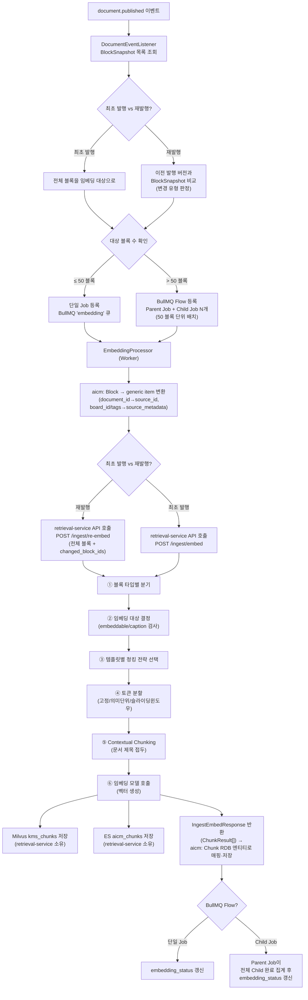
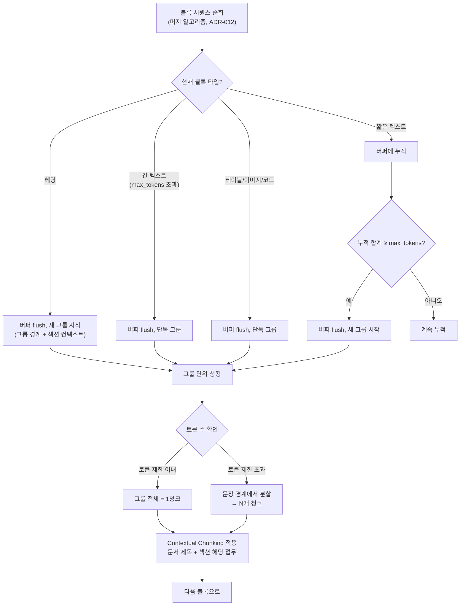
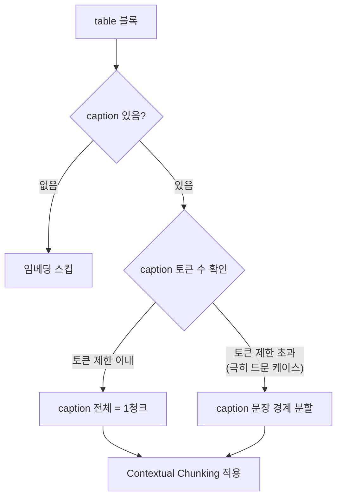
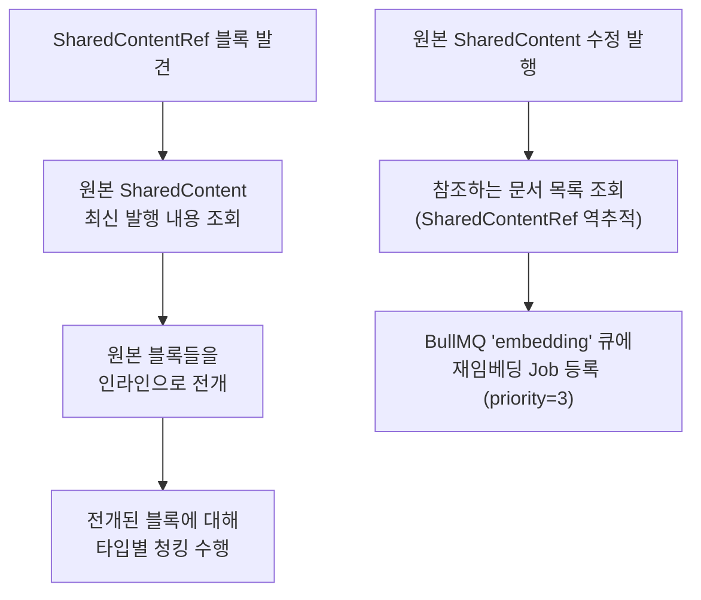
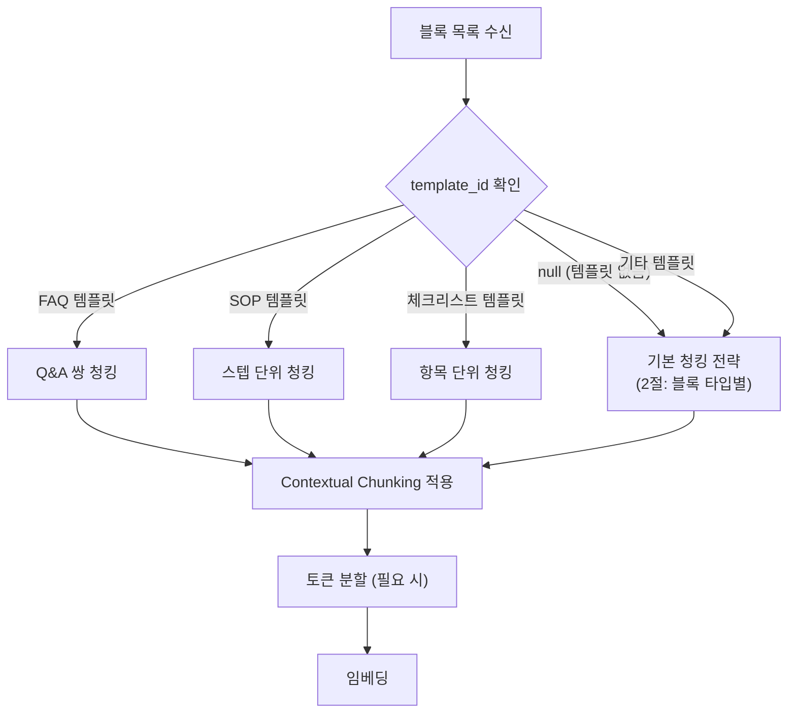
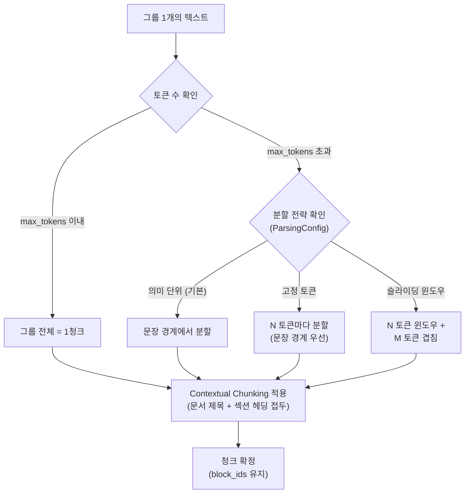
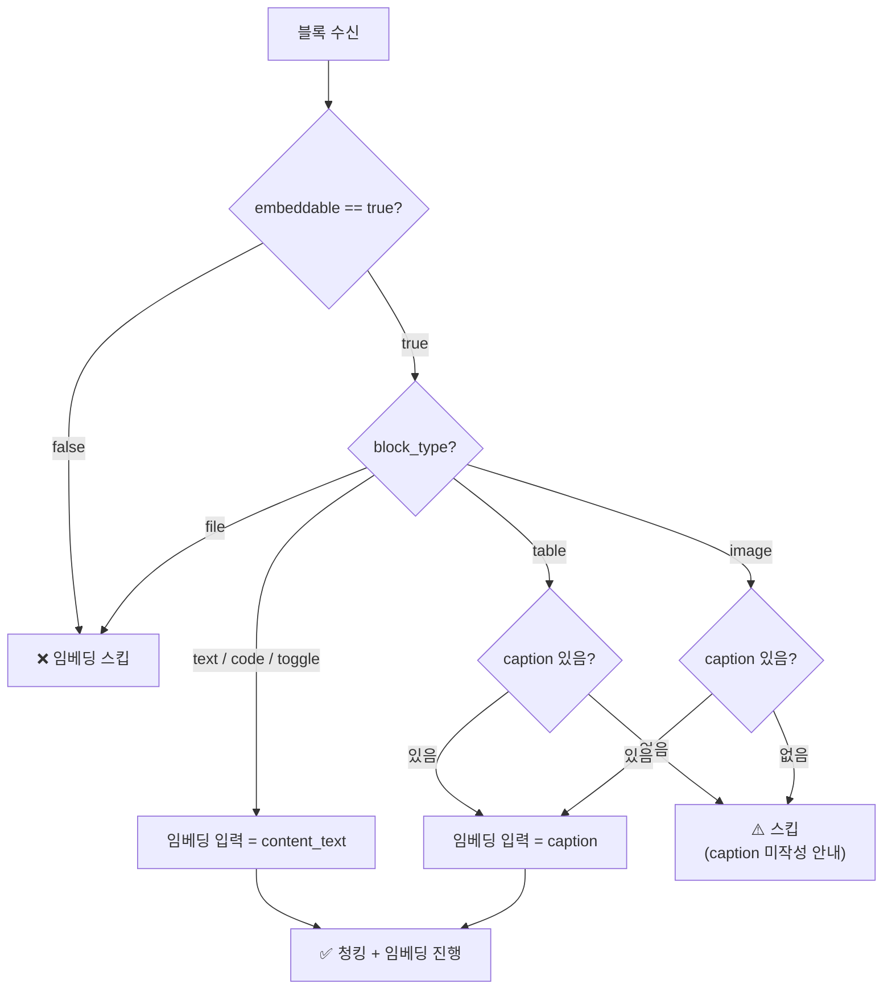
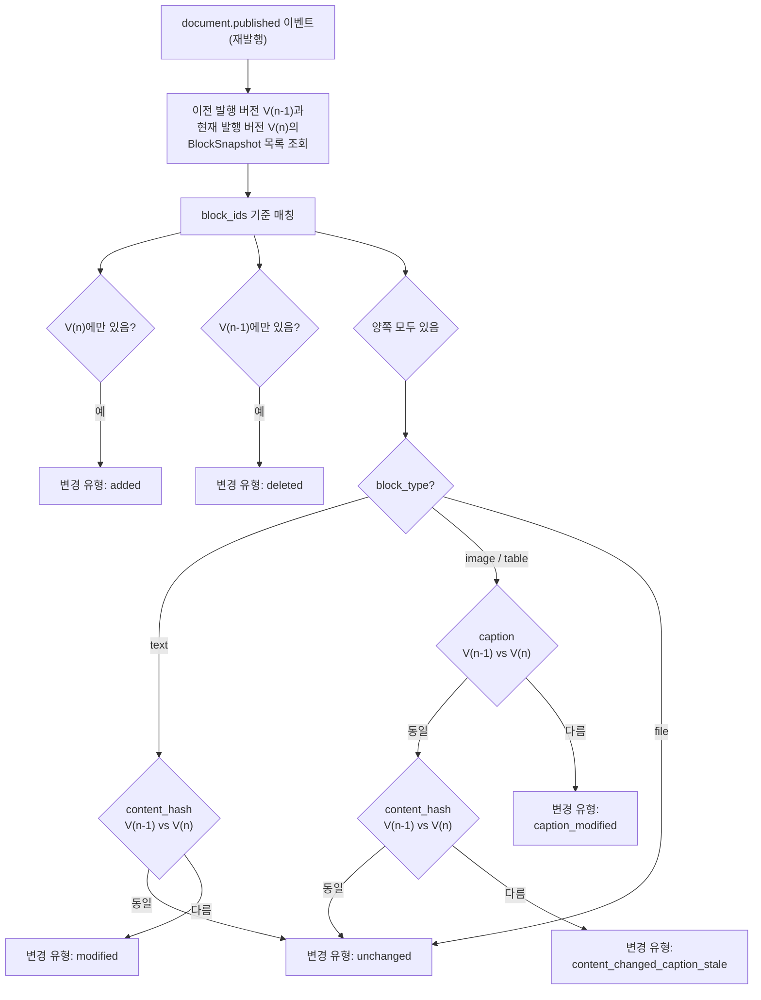
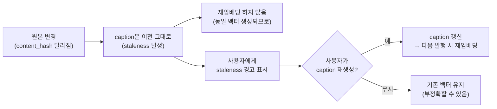
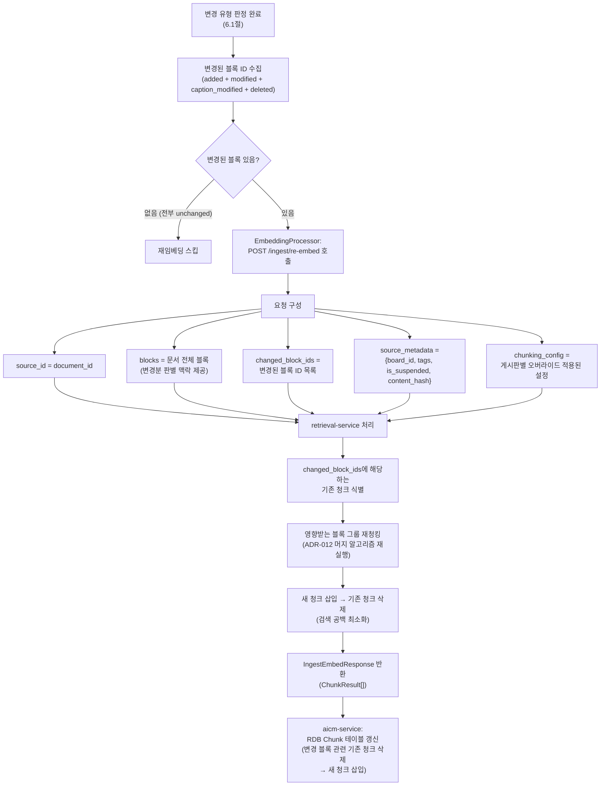

> **문서 상태**
> | 항목 | 값 |
> |------|-----|
> | 상태 | `draft` |
> | 검수 | `unreviewed` |
> | 작성일 | 2026-03-17 |
> | 최종 수정 | 2026-04-06 |

> **기능정의서 참조**: 2.3절 (블록 에디터 문서 청킹), 2.4절 (청킹 전략·메타데이터·임베딩 제어)

# 청킹 전략

> Block → Chunk 분할, 임베딩 대상 결정, 재임베딩 전략. 파싱 단계(외부 문서 → Block 변환)는 [파싱 전략](./01-parsing.md)에서 다룬다.

이 문서는 **발행된 블록을 청크로 분할하여 벡터 임베딩을 생성하기까지**의 전략에 집중한다. Block/Chunk 엔티티 필드 정의, content_hash/caption 산출 규칙은 [데이터 아키텍처 — RDB 엔티티](../../../02-architecture/data/aicm/rdb.md)에, 재임베딩 판단 SQL과 블록별 교체 전략은 [데이터 아키텍처 — retrieval-service 파이프라인](../../../02-architecture/data/retriever/README.md)에, BullMQ embedding 큐 설계는 [비동기 처리 아키텍처](../../../02-architecture/05-async-event-architecture.md)에 이미 정의되어 있으므로 참조만 한다.

---

## 1. 청킹 파이프라인 전체 흐름

발행 이벤트 발생부터 벡터 저장까지의 엔드투엔드 흐름이다.



> **왜 retrieval-service에서 청킹과 임베딩을 함께 수행하는가**: 청킹과 임베딩은 강하게 결합된 작업이다. 청크 크기가 임베딩 모델의 토큰 제한에 종속되고, Contextual Chunking(문서 제목 접두)도 임베딩 입력 조립 시점에 적용된다. 두 단계를 분리하면 중간 상태 관리와 네트워크 왕복이 추가되어 복잡도만 늘어난다. retrieval-service는 generic 모델(`source_id`=document_id, `source_metadata`=board_id/tags as JSON)로 데이터를 수신하며, aicm-service가 블록 그룹을 이 형식으로 변환하여 전달한다. 블록 그룹 역추적은 반환된 `chunk_id`로 RDB Chunk 테이블(`block_ids`)을 조회하여 수행한다. retrieval-service가 반환하는 `IngestEmbedResponse(ChunkResult[])`는 aicm-service에서 다시 Chunk RDB 엔티티로 매핑된다.

### 1.1 대용량 문서의 임베딩 Job 분할 (BullMQ Flow)

500페이지 문서는 수천 개 블록을 생성할 수 있다. 전체 블록을 단일 Job에서 처리하면 retrieval-service 호출 시간이 길어져 타임아웃 위험이 있다. BullMQ의 **Flow(parent-child job)** 패턴으로 블록을 배치 단위로 분할한다. 배치 크기는 `pm:embedding.ingest_batch_size`(기본 50)로 설정하며, SystemConfig에서 동적으로 조정 가능하다.

| 항목 | 소형 문서 (≤ `ingest_batch_size` 블록) | 대형 문서 (> `ingest_batch_size` 블록) |
|------|---------------------|---------------------|
| Job 구조 | 단일 embedding Job | Parent Job + Child Job N개 (`ingest_batch_size` 블록 단위) |
| retrieval-service 호출 | 전체 블록 1회 | 배치당 1회 (예: 200 블록, 배치 50 → 4회) |
| 실패 격리 | 전체 실패 또는 전체 성공 | 배치별 독립 재시도, 부분 성공 가능 |
| 상태 갱신 | Job 완료 시 즉시 갱신 | Parent가 전체 Child 완료 집계 후 갱신 |

> **왜 기본값 50 블록인가**: retrieval-service의 임베딩 처리 시간은 블록 수에 비례한다. 50 블록은 Contextual Chunking + 벡터 생성까지 약 1~2분 내에 완료되는 수준이며, BullMQ의 기본 타임아웃(5분) 내에 충분히 처리된다. 배치가 너무 작으면(예: 10블록) 네트워크 왕복과 Job 오버헤드가 증가하고, 너무 크면 타임아웃 위험과 메모리 부담이 커진다. 온프레미스(sLLM) 환경에서 임베딩 속도가 느린 경우 이 값을 줄여 타임아웃을 방지할 수 있고, GPU 서버가 충분한 환경에서는 늘려 Job 오버헤드를 줄일 수 있다.

> **Contextual Chunking과 배치 분할**: 문서 제목은 모든 배치에 동일하게 전달된다. 섹션 헤딩은 배치 내 블록 시퀀스에서 추적하므로, 배치 시작 시 해당 블록이 속한 섹션의 헤딩 텍스트를 메타데이터로 함께 전달한다.

---

## 2. 블록 타입별 청킹 전략

### 2.1 전략 요약

> **불변 원칙 — 저장·임베딩은 Group:Chunk = 1:N, 검색 결과 반환은 N:M**
>
> **저장·임베딩 (1:N)**: 인접 짧은 블록은 그룹으로 병합되며, 모든 Chunk는 정확히 하나의 그룹에 속한다 (`Chunk.block_ids`). 그룹은 발행 시 머지 알고리즘으로 계산되는 논리적 단위이다. 헤딩·테이블·이미지·코드 블록은 그룹 경계로 작용한다 (ADR-012 참조). 청크의 저장 텍스트(`content_text`)와 임베딩 입력 텍스트 모두 해당 그룹의 콘텐츠에서 생성된다. Contextual Chunking(문서 제목 + 섹션 헤딩 접두)은 메타데이터 접두일 뿐, 다른 그룹의 본문을 합치는 것이 아니다. 이 원칙은 재임베딩(그룹 단위 교체), 역추적(청크→그룹→블록), 히트 그룹 하이라이트의 근간이다.
>
> **검색 결과 반환 (N:M)**: 검색에서 1개 청크가 히트되면, **형제 청크**(같은 그룹의 다른 청크)와 **인접 그룹의 청크**(sequence ± N)를 함께 가져와 LLM 컨텍스트를 구성한다. 최종적으로 LLM에 전달되는 텍스트는 여러 그룹의 청크가 합쳐진 것이다. 이 단계에서는 N:M 조합이 자유롭다.

| 블록 타입 | 임베딩 입력 | Group:Chunk | 분할 기준 | 비고 |
|----------|-----------|------------|----------|------|
| `text` (본문) | content_text | 그룹 내 1:1 (기본) 또는 1:N (토큰 초과 시) | 인접 짧은 블록은 그룹으로 병합 후 토큰 제한 초과 시 분할 | Contextual Chunking으로 맥락 보충 |
| `text` (헤딩) | content_text | 그룹 경계 (단독 그룹) | 분할 불필요 (짧음) | 섹션 헤딩 텍스트가 그룹 경계이자 접두 컨텍스트로 활용됨 |
| `table` | caption | 단독 그룹, 1:1 (기본) 또는 1:N (caption 초과 시) | caption 문장 경계 분할 | caption 없으면 스킵, 그룹 경계 |
| `image` | caption | 단독 그룹, 1:1 | 분할 불필요 (캡션은 짧음) | caption 없으면 스킵, 그룹 경계 |
| `file` | — | — | — | 항상 스킵 |
| `code` | content_text | 단독 그룹, 1:1 | 분할하지 않음 (코드 분할은 의미 파괴) | 그룹 경계 |
| 토글(접기) | 내부 블록 각각 | 내부 블록별 그룹 병합 후 1:N | 내부 블록 타입별 규칙 적용 | 토글은 컨테이너, 내부 블록이 청킹 대상 |
| 공통 컨텐츠 참조 | 원본 블록의 content_text | 원본 블록 기준 그룹 병합 | 원본 블록 타입별 규칙 적용 | 원본 수정 시 재청킹 트리거 |

### 2.2 텍스트 블록 — 그룹 병합 + Contextual Chunking

인접 텍스트 블록은 **그룹으로 병합된 후 그룹 단위로 청크를 생성**한다. 헤딩 블록은 그룹 경계 역할을 하며, 긴 텍스트 블록은 단독 그룹이 된다. 짧은 블록의 임베딩 품질 문제는 그룹 병합과 Contextual Chunking(문서 제목 + 섹션 헤딩 접두)으로 보충한다.



**Contextual Chunking — 접두 컨텍스트 구성:**

모든 청크의 임베딩 입력은 해당 블록의 원본 텍스트 앞에 **메타데이터 접두**가 부여된다. 다른 블록의 본문 텍스트를 합치는 것이 아니라, 문서 제목과 섹션 헤딩이라는 메타데이터를 접두로 붙여 맥락을 보충한다.

```
임베딩 입력 = [문서 제목] [섹션 헤딩] {블록 원본 텍스트}
```

| 구성 요소 | 소스 | 설명 |
|----------|------|------|
| 문서 제목 | Document.title (발행 시점) | 모든 청크에 공통 접두 |
| 섹션 헤딩 | 해당 블록 직전의 가장 가까운 헤딩 블록 텍스트 | 섹션 맥락 |
| 블록 원본 텍스트 | 해당 블록의 content_text 또는 caption | 청크의 핵심 내용 |

> **짧은 블록도 스킵하지 않는다**: "이 문서는 절대 외부 반출해서는 안됩니다"처럼 짧지만 중요한 블록이 존재한다. 시스템이 "이 블록은 의미 없다"를 자동 판단하는 것은 불가능하므로, text 블록은 길이와 무관하게 모두 청크를 생성한다. 짧은 블록은 인접 블록과 그룹으로 병합되어 의미가 보강되며, 접두 컨텍스트가 임베딩 품질을 보충하고, 하이브리드 검색(BM25 + 벡터)이 추가 안전망 역할을 한다.

**예시:**

```
블록 시퀀스:
  [1] heading2: "계좌 개설 절차"
  [2] paragraph: "영업점을 방문하여..."
  [3] paragraph: "필요 서류는..."
  [4] heading2: "온라인 개설"
  [5] paragraph: "인터넷뱅킹에서..."

→ 그룹 병합 (ADR-012 머지 알고리즘):
  Group A (블록 [1]):     헤딩 → 단독 그룹 (그룹 경계)
  Group B (블록 [2, 3]):  인접 짧은 텍스트 → 병합 그룹
  Group C (블록 [4]):     헤딩 → 단독 그룹 (그룹 경계)
  Group D (블록 [5]):     텍스트 → 단독 그룹

→ 청크 저장 + 임베딩 (그룹 단위, Contextual Chunking 접두 적용):
  Chunk A (block_ids=[1]):   "[계좌 개설 매뉴얼] 계좌 개설 절차"
  Chunk B (block_ids=[2,3]): "[계좌 개설 매뉴얼] [계좌 개설 절차] 영업점을 방문하여... 필요 서류는..."
  Chunk C (block_ids=[4]):   "[계좌 개설 매뉴얼] 온라인 개설"
  Chunk D (block_ids=[5]):   "[계좌 개설 매뉴얼] [온라인 개설] 인터넷뱅킹에서..."
```

> **검색 결과 반환에서 N:M 조합**: 짧은 블록이 그룹으로 병합되어 히트되어도 **검색 결과 반환 단계**에서 (1) 같은 그룹의 형제 청크(1:N 분할 시 나머지 조각), (2) sequence 기준 인접 그룹의 청크를 함께 가져와 LLM 컨텍스트를 구성한다. 임베딩·저장은 그룹 단위(1:N)로 깔끔하게 유지하되, 검색 결과 조합에서 여러 그룹의 청크를 자유롭게 합치는(N:M) 구조다. 상세는 [검색 전략 7절](./03-search.md)에서 다룬다.

### 2.3 테이블 블록 — 표 전체 또는 행 그룹

표는 행/열의 관계가 의미를 구성하므로 원칙적으로 **표 전체를 1청크**로 만든다. 다만 대형 표는 토큰 제한을 초과하므로 행 그룹으로 분할한다.



> **왜 caption을 임베딩 입력으로 사용하고 content_text(셀 데이터)를 쓰지 않는가**: 표의 셀 데이터를 평탄화한 content_text("이름 | 부서 | 연봉\n홍길동 | 개발 | 5000")는 구조 정보가 유실되어 시맨틱 임베딩 입력으로 부적합하다. caption("2024년 개발팀 인력 현황 — 팀원별 이름, 부서, 연봉 정보")이 표의 의미를 자연어로 압축한 것이므로 임베딩 품질이 높다. 셀 데이터 키워드 검색은 ES `aicm_blocks`의 `group_text` 필드가 담당한다.

**대형 표 행 그룹 분할 (content_text 기준):**

표 자체(content_text)가 토큰 제한을 초과하는 경우에 한해, 행 그룹 단위로 content_text를 분할하여 별도의 키워드 검색 청크를 생성한다. 이는 caption 기반 시맨틱 청크와 별개로, ES `aicm_chunks`에 인덱싱되어 BM25 매칭에 기여한다.

| 구분 | 기준 | 목적 |
|------|------|------|
| 시맨틱 청크 | caption (표 전체 1청크) | 벡터 임베딩 → 의미 검색 |
| 키워드 청크 | content_text 행 그룹 분할 | ES BM25 → 셀 데이터 키워드 매칭 |

### 2.4 이미지 블록 — 캡션 기반

이미지 블록의 임베딩 입력은 caption이다. 멀티모달 분석 결과가 포함된 캡션 텍스트는 대부분 짧으므로 분할이 불필요하다.

| 항목 | 처리 |
|------|------|
| caption 있음 | caption = 1청크 |
| caption 없음 | 임베딩 스킵 (키워드/시맨틱 검색 모두 제외) |

> **caption이 없는 이미지 블록은 검색에서 완전히 제외된다.** 이는 의도적인 설계다. 장식 이미지, 로고 등 검색에 무의미한 이미지에 불필요한 벡터를 생성하지 않는다. caption 유무가 사용자의 의도적 선택("이 이미지는 검색에 포함할 가치가 있다")이 된다.

### 2.5 코드 블록 — 단독 청킹

코드 블록은 **그룹 경계로 작용하여 단독 그룹을 형성**하고, 1청크를 생성한다 (Group:Chunk = 1:1). 코드 자체만으로는 자연어 검색에 부적합하지만, Contextual Chunking(문서 제목 + 섹션 헤딩 접두)으로 맥락을 보충한다.

| 규칙 | 설명 |
|------|------|
| 청킹 단위 | 코드 블록 1개 = 1청크 (분할하지 않음) |
| 임베딩 입력 | `[문서 제목] [섹션 헤딩] {코드 텍스트}` |
| 맥락 보충 | 검색 히트 시 Window Context로 인접 설명 블록이 LLM에 함께 전달됨 |

> **왜 코드를 분할하지 않는가**: 코드를 임의 지점에서 분할하면 구문·의미가 모두 파괴된다. 함수 정의 중간에서 잘린 코드 조각은 검색으로 히트되어도 맥락 파악이 불가능하다.

> **왜 인접 블록과 병합하지 않는가**: 코드 블록은 ADR-012의 머지 알고리즘에서 그룹 경계로 작용하므로, 인접 텍스트 블록과 병합되지 않고 단독 그룹이 된다. 코드 앞뒤의 설명 텍스트 블록은 별도 그룹으로 청크를 가지며, 검색 결과 반환 시 Window Context(sequence ± N)로 코드 + 설명이 함께 LLM에 전달된다.

### 2.6 토글(접기) 블록 — 펼친 상태 포함

토글 블록은 접힌 상태의 제목만이 아니라 **펼친 상태의 전체 내용**을 청킹 대상으로 한다.

| 항목 | 처리 |
|------|------|
| 토글 제목 | 섹션 컨텍스트로 활용 (헤딩과 유사) |
| 토글 내부 콘텐츠 | 펼쳐서 내부 블록을 일반 블록처럼 처리 |
| 토큰 초과 | 내부 블록 경계에서 분할 |

### 2.7 공통 컨텐츠 참조 — 원본 resolve

공통 컨텐츠 참조(`SharedContentRef`) 블록은 원본(`SharedContent`)의 **최신 발행 내용을 resolve**하여 청킹한다. 참조 자체가 아니라 원본 콘텐츠가 청크에 포함된다.



> **왜 재임베딩 Job의 우선순위를 낮추는가**: 공통 컨텐츠 수정 시 참조하는 문서가 수십~수백 건일 수 있다. 신규 발행 문서의 임베딩이 지연되지 않도록, 재임베딩 Job은 동일한 `embedding` 큐에 **priority=3** (낮은 우선순위)으로 등록한다. BullMQ의 priority 기반 스케줄링에 의해 신규 발행(priority=1)이 먼저 처리되고, 재임베딩은 유휴 시에 처리된다.

---

## 3. 템플릿 기반 청킹 분기

`template_id`가 설정된 문서는 템플릿의 성격에 따라 최적화된 청킹 전략을 적용한다.



### 3.1 템플릿별 청킹 규칙

| 템플릿 유형 | Contextual Chunking 접두 전략 | 블록별 처리 | 근거 |
|-----------|---------------------------|-----------|------|
| **FAQ** | Q 블록의 텍스트를 A 블록 청크의 접두에 부여 | Q(heading/bold) 블록 → 1청크, A(paragraph) 블록 → 1청크. A 청크의 접두에 Q 텍스트 포함 | Group:Chunk = 1:N 유지. 검색 시 Window Context로 Q+A가 LLM에 함께 전달됨 |
| **SOP** | 스텝 헤딩을 하위 블록 청크의 접두에 부여 | 스텝 헤딩 블록 → 1청크, 하위 설명 블록 → 각각 1청크 (접두에 스텝 헤딩 포함) | 절차적 맥락은 접두 컨텍스트로 보존 |
| **체크리스트** | 체크리스트 제목을 항목 블록 청크의 접두에 부여 | 각 체크 항목 블록 → 1청크 (접두에 체크리스트 제목 포함) | 짧은 항목도 접두 컨텍스트로 임베딩 품질 보충 |
| **기타/미지정** | 2.2절의 섹션 헤딩 접두 | 그룹 단위 청킹 + Contextual Chunking | 범용 전략 |

> **왜 템플릿별 분기가 필요한가**: 동일한 텍스트라도 문서의 성격에 따라 Contextual Chunking의 접두 구성이 달라야 한다. FAQ에서는 답변 청크에 질문 텍스트를 접두로 부여해야 "이 질문의 답변"이라는 관계가 임베딩에 반영된다. SOP에서는 스텝 헤딩을 접두로 부여해야 "Step 3의 세부 설명"이라는 절차적 맥락이 보존된다. 모두 Group:Chunk = 1:N 원칙을 준수하면서 접두 전략만 달라지는 구조이다.

### 3.2 FAQ Q&A 쌍 감지 규칙

FAQ 템플릿에서 질문-답변 쌍을 감지하는 규칙:

| 질문 감지 기준 | 설명 |
|-------------|------|
| Heading 블록 | heading level과 무관하게 Q로 인식 |
| Bold 시작 문단 | 문단 첫 텍스트가 bold mark이면 Q로 인식 |
| `Q:` / `질문:` 접두 | 명시적 마커 |

감지된 Q 이후 다음 Q 전까지의 본문 블록이 A(답변)이 된다. Q 블록과 A 블록은 각각 독립 청크를 생성하되, A 블록의 청크에는 Contextual Chunking으로 Q 텍스트가 접두로 부여된다. 검색 시 Window Context로 Q + A가 함께 LLM에 전달된다.

---

## 4. 토큰 분할 전략 비교

청킹 시 청크 크기를 결정하는 3가지 분할 전략을 지원한다. 관리자가 테넌트 설정(`ParsingConfig`)으로 선택 가능하며, 기본값은 **의미 단위(heading)** 분할이다.

### 4.1 전략 비교

| 전략 | 분할 기준 | 장점 | 단점 | 적합한 케이스 |
|------|----------|------|------|-------------|
| **고정 토큰** | 토큰 수 N개마다 분할 | 구현 단순, 청크 크기 균일 | 의미 경계 무시 → 문장 중간 절단 가능 | 비정형 문서, 구조 없는 긴 텍스트 |
| **의미 단위 (heading)** | 그룹 단위 청킹 + 헤딩 접두 (기본값) | 그룹 경계 보존, Group:Chunk = 1:N 준수. 인접 짧은 블록 병합으로 청크 수 최적화 | 그룹 경계 판단 로직 필요 | 구조화된 문서 (매뉴얼, 가이드) |
| **슬라이딩 윈도우** | 고정 크기 + 겹침(overlap) | 경계에서 문맥 손실 최소화 | 겹침 영역만큼 스토리지·임베딩 비용 증가 | 긴 서술형 문서, 경계 민감한 문서 |

### 4.2 sLLM 환경 기본값

> **관리 위치**: 아래 청킹 파라미터는 `ParsingConfig` 엔티티에서 테넌트별로 관리한다 (`SystemConfig`가 아님). 파싱 전략(분할 방식)과 청킹 파라미터(토큰 수, 겹침)는 문서 처리 파이프라인에 속하므로 `ParsingConfig`가 담당한다.

| 파라미터 | 기본값 | 근거 |
|---------|--------|------|
| 최대 토큰 수 (max_tokens) | **256 토큰** | sLLM 임베딩 모델(bge-m3 등)의 최적 입력 범위. 512 이내가 권장되나 sLLM 환경에서는 짧은 청크가 검색 정밀도에 유리 |
| 슬라이딩 윈도우 겹침 (overlap) | **50 토큰** (약 20%) | 겹침이 너무 작으면 경계 문맥 손실, 너무 크면 중복 벡터로 스토리지 낭비 |
| 최소 청크 토큰 수 (min_tokens) | **30 토큰** | 너무 짧은 청크는 의미 정보 부족 → 검색 노이즈. 다만 짧은 블록도 중요 정보를 담을 수 있으므로 Contextual Chunking 접두 포함 시 30 토큰 미만이면 스킵 검토 (보수적 운영) |

> **왜 256 토큰이 기본인가**: sLLM 임베딩 모델은 상용 모델 대비 토큰 처리 용량이 제한적이다. 긴 입력에서 후반부 정보가 임베딩에 잘 반영되지 않는 문제(lost-in-the-middle)가 sLLM에서 더 두드러진다. 256 토큰 수준의 짧은 청크는 하나의 청크에 하나의 의미가 집중되어 검색 정밀도가 높다. SaaS 환경에서 고성능 임베딩 모델을 사용할 경우 512~1024로 상향 가능하다.

### 4.3 전략 선택 흐름



---

## 5. 임베딩 대상 결정 흐름

블록이 실제로 임베딩되려면 **블록 타입 조건**, **caption 존재 여부**, **embeddable 플래그** 세 가지를 모두 통과해야 한다.

### 5.1 embeddable 플래그

블록별로 임베딩 포함 여부를 제어한다. 사용자가 블록 메뉴에서 "임베딩 제외" 토글로 설정하며, `false`이면 청킹/임베딩 파이프라인에서 스킵된다.

| embeddable | 의미 | 예시 |
|:---:|------|------|
| `true` | **기본값** — 임베딩 포함 | 일반 콘텐츠 |
| `false` | 임베딩 제외 | 장식 이미지, 부록, 내부 메모, 검색 불필요한 참고 정보 |

### 5.2 임베딩 대상 결정 플로우



### 5.3 블록 타입별 임베딩 대상 결정 규칙 요약

| block_type | 임베딩 입력 | 필수 조건 | 조건 미충족 시 |
|------------|-----------|----------|-------------|
| `text` | content_text | embeddable=true, content_text 존재 | 스킵 |
| `table` | caption | embeddable=true, caption 존재 | 스킵 + staleness 체크 |
| `image` | caption | embeddable=true, caption 존재 | 스킵 + "캡션을 작성하면 검색에 포함됩니다" 안내 |
| `code` | content_text | embeddable=true | 스킵 |
| `file` | — | — | 항상 스킵 |

---

## 6. 재임베딩 전략

문서가 수정 후 재발행되면, 이전 발행 버전과 현재 발행 버전의 BlockSnapshot을 비교하여 **변경된 블록이 속한 그룹의 청크를 교체**한다. 블록 변경 시 해당 블록이 포함된 그룹 전체가 재청킹 대상이 되며, ADR-012 §3.4의 머지 알고리즘을 재실행하여 그룹 경계가 재계산된다.

### 6.1 변경 유형 판정 흐름



### 6.2 text vs image/table 재임베딩 판단 차이

두 계열의 재임베딩 기준이 다른 핵심 이유:

| 구분 | text 블록 | image/table 블록 |
|------|----------|----------------|
| **임베딩 입력** | content_text (원본 텍스트) | caption (텍스트 설명) |
| **재임베딩 트리거** | content_hash 변경 | caption 변경 |
| **원본 변경의 의미** | 텍스트 수정 = 임베딩 입력 변경 | 이미지 교체/표 셀 수정 ≠ 임베딩 입력(caption) 변경 |

> **핵심 논리**: text 블록은 원본(content_text) = 임베딩 입력이므로 content_hash 변경 = 재임베딩 필요. image/table 블록은 원본(이미지, 셀 데이터) ≠ 임베딩 입력(caption)이므로, 원본이 변경되어도 caption이 동일하면 동일한 벡터가 생성된다 — 재임베딩은 자원 낭비이다.

### 6.3 Caption Staleness 개념

image/table 블록에서 원본 콘텐츠가 변경되었으나 caption은 아직 갱신되지 않은 상태를 **caption staleness**라고 한다.



**Staleness 경고 시나리오:**

| 시나리오 | 예시 | 위험도 |
|---------|------|--------|
| 이미지 교체, 캡션 미갱신 | 상품 이미지가 A→B로 변경됐는데 캡션은 A 기준 설명 | 높음 — 검색 결과가 현재 콘텐츠와 불일치 |
| 표 데이터 수정, 캡션 미갱신 | 연봉 테이블 숫자가 변경됐는데 캡션("2024년 연봉 현황")은 그대로 | 중간 — 캡션이 추상적이면 여전히 유효 |
| 사소한 이미지 수정, 캡션 동일 | 이미지 해상도 변경, 테두리 추가 | 낮음 — 캡션 재생성 불필요 |

> **왜 staleness를 에러가 아닌 경고로 처리하는가**: 원본 변경이 항상 caption 무효화를 의미하지는 않는다. 표의 서식 변경, 이미지의 사소한 수정처럼 caption이 여전히 유효한 경우가 있다. 자동으로 재임베딩하면 불필요한 자원 소비가 발생하고, 사용자의 검수 기회도 박탈된다. 경고를 통해 사용자가 판단하게 하는 것이 sLLM 자원 효율과 데이터 품질 모두에 유리하다.

### 6.4 변경 유형별 처리

| 변경 유형 | 대상 | 처리 | 비고 |
|----------|------|------|------|
| `unchanged` | 전 타입 | 기존 청크 유지 | Milvus/ES/RDB 모두 변경 없음 |
| `modified` | text | 새 청크 삽입 → 기존 청크 삭제 | 삽입 후 삭제 순서로 검색 공백 방지 |
| `caption_modified` | image/table | `modified`와 동일 | caption(임베딩 입력) 변경이므로 재임베딩 필요 |
| `content_changed_caption_stale` | image/table | 재임베딩 **안 함** | staleness 경고만 반환 |
| `added` | 전 타입 | 새 청크 삽입 | 신규 블록이므로 기존 청크 없음 |
| `deleted` | 전 타입 | 기존 청크 삭제 | Milvus + ES + RDB Chunk 모두 삭제 |

> **왜 삽입 → 삭제 순서인가**: 기존 청크를 먼저 삭제하면 새 청크가 저장되기까지 일시적으로 해당 블록이 검색에서 누락된다. 새 청크를 먼저 삽입하고 기존 청크를 삭제하면 검색 공백이 발생하지 않는다. 일시적으로 신/구 두 벌이 모두 존재하지만 `chunk_id`가 다르므로 중복 히트될 수 있는 극히 짧은 시간은 허용한다.

### 6.5 재임베딩 API 호출 상세

변경 유형 판정 결과를 토대로, aicm-service의 EmbeddingProcessor가 retrieval-service에 재임베딩을 요청하는 흐름이다.



> **왜 전체 블록을 함께 전송하는가**: `changed_block_ids`만 보내면 될 것 같지만, ADR-012의 블록 그룹 청킹(M:N) 때문에 전체 블록이 필요하다. 변경된 블록 A가 미변경 블록 B, C와 같은 그룹에 속해 있을 때, 해당 그룹의 청크를 재생성하려면 B, C의 콘텐츠도 필요하다. retrieval-service는 `blocks` 전체를 맥락으로 받아 머지 알고리즘을 재실행하고, `changed_block_ids`에 해당하는 블록이 포함된 그룹의 청크만 교체한다.

---

## 7. 메타데이터 부착 규칙

각 청크에는 검색·필터링·역추적에 필요한 메타데이터를 부착한다.

### 7.1 청크 메타데이터 목록

| 메타데이터 | 소스 | 저장 위치 | 목적 |
|-----------|------|----------|------|
| `document_id` | Document.id | RDB Chunk + Milvus + ES | 문서 단위 필터, 검색 결과에서 원본 문서 역추적 |
| `block_ids` | 머지 알고리즘 산출 | RDB Chunk만 | 블록 그룹 역추적 (chunk_id → RDB 조회). Milvus/retriever ES에는 저장하지 않음 |
| `board_id` | Document → Board.id | Milvus + ES | 게시판 범위 필터 |
| `template_id` | Document.template_id | RDB Chunk | 템플릿 기반 재청킹 시 전략 선택에 사용 |
| `section_title` | 해당 블록이 속한 헤딩 텍스트 | RDB Chunk | LLM 컨텍스트 구성 시 섹션 맥락 제공 |
| `tags` | Document → DocumentTag → Tag | Milvus + ES | 태그 기반 검색 필터 |
| `chunk_index` | 블록 내 청크 순번 (0-based) | RDB Chunk | 블록 내 청크 순서 추적, 재임베딩 시 교체 대상 식별 |
| `embedded_content_hash` | 임베딩 입력 텍스트의 SHA-256 | RDB Chunk | 재임베딩 시 실제 변경 여부 최종 확인 |
| `is_suspended` | Document.is_suspended | Milvus + ES | 검색 일시 정지 필터 |

### 7.2 메타데이터 부착 설계 원칙

| 원칙 | 설명 |
|------|------|
| **검색 필터용은 Milvus/ES에 비정규화** | 검색 시 RDB JOIN을 피하기 위해 `board_id`, `tags` 등을 벡터/인덱스 저장소에 직접 저장한다 |
| **역추적용은 RDB에 보존** | `section_title`, `template_id` 등 검색 필터로 쓰이지 않지만 후처리에 필요한 정보는 RDB Chunk에만 저장한다 |
| **문서 메타 변경 시 전파** | 문서의 `tags`, `is_suspended` 변경 시 해당 문서의 모든 청크에 Milvus/ES 메타데이터 업데이트가 필요하다. 재임베딩(벡터 재생성)은 불필요 — 메타데이터만 갱신 |

> **왜 이 많은 메타데이터를 청크에 비정규화하는가**: 검색 요청 시 "이 게시판 내에서, 이 태그를 가진 문서의 청크만" 필터링해야 한다. Milvus와 ES에서 필터를 적용하려면 필터 대상 필드가 각 청크 레코드에 존재해야 한다. RDB를 JOIN하는 2단계 검색은 지연 시간이 허용 수준을 초과한다. 비정규화로 인한 갱신 비용은 문서 메타 변경이 발행 대비 저빈도라는 점에서 수용 가능하다.

---

## Contextual Chunking 접두 규칙

모든 청크는 임베딩 전 단계에서 문서 제목을 접두어로 부여받는다. 이 규칙은 블록 타입, 템플릿, 분할 전략에 무관하게 공통 적용된다.

| 레벨 | 접두 형식 | 예시 |
|------|----------|------|
| 문서 제목 | `[{document_title}]` | `[계좌 개설 매뉴얼]` |
| 섹션 제목 (선택) | `[{document_title} > {section_title}]` | `[계좌 개설 매뉴얼 > 준비 서류]` |

> **왜 Contextual Chunking이 필요한가**: 청크 텍스트 "영업점 방문 시 대기표를 발급받고..."만으로는 이것이 "계좌 개설"에 관한 것인지 "카드 발급"에 관한 것인지 임베딩 모델이 구분할 수 없다. 문서 제목을 접두하면 벡터 공간에서 주제별 클러스터링이 개선되어 검색 정확도가 향상된다. 특히 sLLM 임베딩 모델은 문맥 이해 능력이 제한적이므로 명시적 컨텍스트 제공이 더욱 중요하다.

---

## 관련 문서

| 문서 | 참조 내용 |
|------|----------|
| [데이터 아키텍처 — RDB 엔티티](../../../02-architecture/data/aicm/rdb.md) | Block/Chunk 엔티티 필드 정의, content_hash/caption 규칙 |
| [데이터 아키텍처 — retrieval-service 파이프라인](../../../02-architecture/data/retriever/README.md) | 청킹 파이프라인 입출력 흐름, 임베딩 대상 결정 규칙 표, 재임베딩 블록별 교체 전략 |
| [비동기 처리 아키텍처](../../../02-architecture/05-async-event-architecture.md) | BullMQ embedding 큐 설계 (priority 기반: 신규 발행=1, 재임베딩=3), 임베딩 파이프라인 시퀀스 다이어그램 |
| [외부 서비스 연동](../../../02-architecture/06-external-integration.md) | retrieval-service API 인터페이스 (청킹/임베딩 요청·응답, generic item 모델) |
| 이전 문서: [파싱 전략](./01-parsing.md) | 외부 문서 → Block 변환, Tier 시스템, 사용자 검수 |
| 다음 문서: [검색 전략](./03-search.md) | 문서 검색/시맨틱/하이브리드 검색, 권한 필터, 결과 반환 |
