# 검색 전략

> **문서 상태**
> | 항목 | 값 |
> |------|-----|
> | 상태 | `draft` |
> | 검수 | `unreviewed` |
> | 작성일 | 2026-03-17 |
> | 최종 수정 | 2026-04-06 |

## 기능정의서 참조

- 섹션 2.1: 전통적 검색 — 제목/본문/태그/작성자 필드별 검색, nori 형태소 분석, 필터(게시판/기간/태그/템플릿), 자동완성, fuzzy matching, 하이라이팅
- 섹션 2.2: RAG — 벡터 DB 시맨틱 검색 → top-K → LLM 컨텍스트, 하이브리드(BM25+벡터 RRF), 게시판 권한 범위 제한, 임베딩 미완료 문서 자동 제외

---

## 1. 검색 모드 개요

시스템은 3가지 검색 모드를 제공한다. 각 모드는 사용하는 저장소와 스코어링 방식이 다르다.

| 모드 | 저장소 | 스코어링 | 용도 |
|------|--------|---------|------|
| **문서 검색** | ES `aicm_blocks` | BM25 단독 | 사용자 대면 문서 목록 검색 |
| **시맨틱 검색** | retrieval-service → Milvus | 벡터 유사도 단독 | 의미 기반 검색 (RAG 전용) |
| **하이브리드 검색** | retrieval-service → ES + Milvus (RRF 내부 처리) | BM25 + 벡터 RRF 합산 | RAG 기본 모드 |

> **sLLM 환경에서 하이브리드가 기본인 이유**: 온프레미스 sLLM의 임베딩 모델은 상용 모델(OpenAI, Cohere 등) 대비 품질이 낮다. 벡터 검색 단독으로는 관련 문서를 놓칠 확률이 높으므로, BM25 키워드 매칭을 병행하여 recall을 보완한다. 하이브리드 검색은 sLLM 환경의 **기본 활성화 모드**이다.

---

## 2. 검색 모드 선택 흐름

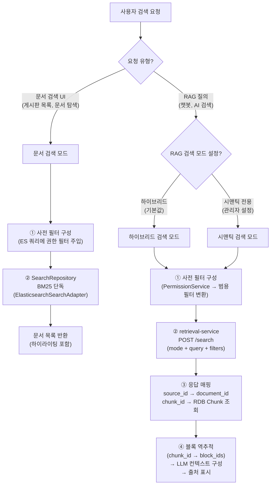

> **모드 판별과 서비스 분담.** 문서 검색 UI(게시판 목록 화면, 검색 페이지)에서 호출하면 aicm-service가 SearchRepository를 통해 `aicm_blocks` 인덱스를 쿼리하는 문서 검색 모드로 동작한다. RAG 인터페이스(챗봇, AI 검색)에서 호출하면 aicm-service가 retrieval-service에 검색을 위임하며, 검색 모드(하이브리드/시맨틱)는 `SearchConfig`에서 관리자가 설정한다. 두 모드 모두 **검색 실행 전에 권한 필터를 구성하여 사전 주입**한다. 키워드 검색은 SearchRepository를 통해 검색 엔진 쿼리에, RAG 검색은 retrieval-service의 `filters` 파라미터로 전달한다. retrieval-service는 generic 모델(source_id, chunk_id, block_ids)로 응답하므로, aicm-service가 도메인 매핑을 수행한다.

---

## 3. 문서 검색 (BM25 단독) 전략

### 3.1 검색 대상 저장소

ES `aicm_blocks` 인덱스를 단독 사용한다. 그룹 단위로 인덱싱되어 있으며, `collapse`로 문서 단위로 그루핑하여 반환한다.

> **왜 그룹 단위 인덱싱인가**: 블록 과세분화(over-fragmentation)를 방지하고 BM25 품질을 안정화하기 위해 인접 짧은 블록을 그룹으로 병합하여 인덱싱한다 (ADR-012 참조). 검색 결과는 `document_id`로 collapse하여 문서 단위로 그루핑하며, 검색 결과에서 "문서 내 어떤 그룹이 히트됐는지"를 정확히 알려줄 수 있다.

### 3.2 검색 필드와 매칭 전략

| 필드 | ES 매핑 | 역할 |
|------|---------|------|
| `group_text` | text (nori) | 텍스트/테이블 그룹의 본문 매칭 |
| `group_caption` | text (nori) | 이미지/테이블 그룹의 caption 매칭 |

`group_text`와 `group_caption`을 `multi_match`로 동시 검색한다. 테이블 그룹은 셀 데이터(`group_text`)와 표 설명(`group_caption`) 양쪽에서 히트 가능하다.

> **multi_match 전략**: 검색어 "연봉 현황"이 입력되면, 표 caption("부서별 연봉 현황표")과 표 셀 데이터("총무부 5,000만원") 양쪽에서 모두 매칭된다. 사용자 입장에서는 표의 제목이든 내용이든 찾아주면 되므로, 두 필드를 동시에 검색하는 것이 자연스럽다.

### 3.3 필터 체계

| 필터 | ES 필드 | 적용 방식 |
|------|---------|----------|
| 게시판 | `board_id` | `terms` (다중 선택 가능) |
| 태그 | `tags` | `terms` (keyword 배열) |
| 기간 | `created_at` | `range` |
| 검색 일시 정지 | `is_suspended` | `term: false` (항상 적용) |

> **태그는 필터 역할만 한다.** 태그("계좌 개설", "신규 고객")는 검색 대상(scoring)이 아니라 검색 범위를 좁히는 필터(filtering)로 동작한다. 사용자가 태그를 선택하면 해당 태그가 있는 문서만 결과에 포함된다. 태그를 BM25 점수에 반영하면 태그 이름과 검색어가 우연히 일치하는 문서가 과대 부스팅되는 부작용이 있다.

### 3.4 문서 단위 그루핑과 페이지네이션

그룹 단위 인덱싱이므로, 같은 문서의 그룹이 여러 건 히트될 수 있다. ES `collapse`로 `document_id` 기준 그루핑하고, `inner_hits`로 각 문서의 히트 그룹 목록을 함께 가져온다.

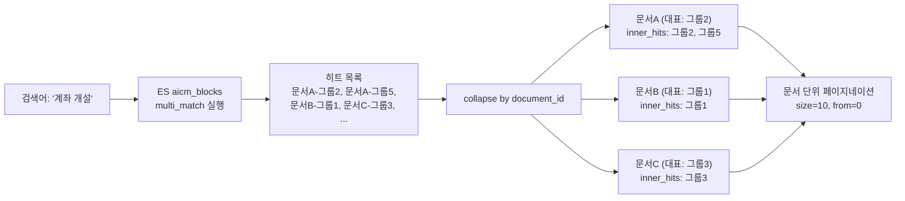

- `size`/`from`은 **문서 단위** 페이지네이션 (page 1에 문서 10개)
- 각 문서에서 **가장 스코어 높은 그룹이 대표**로 정렬
- `inner_hits`로 각 문서에서 히트된 **그룹 최대 5개** 반환 — 문서 클릭 시 해당 그룹의 블록들 하이라이트

> **스키마·매핑 상세 참조**: ES `aicm_blocks` 인덱스의 매핑 JSON과 collapse + inner_hits 쿼리 구조는 [데이터 아키텍처 — aicm ES](../../../02-architecture/data/aicm/es.md)에서 정의한다.

### 3.5 자동완성과 Fuzzy Matching

| 기능 | 구현 방식 | 비고 |
|------|----------|------|
| 자동완성 | ES `completion` suggester 또는 `prefix` 쿼리 | 검색어 타이핑 중 문서 제목 제안 |
| Fuzzy matching | `multi_match`의 `fuzziness: "AUTO"` | 오타 보정 ("계좌개설" → "계좌 개설") |
| 하이라이팅 | ES `highlight` 파라미터 | 히트 텍스트에 `<em>` 태그 삽입 |

> **자동완성 범위**: 자동완성은 문서 제목(`Document.title`) 기반으로 제안한다. 본문 자동완성은 블록 수가 많아 노이즈가 크므로 제목에 한정한다. 구현 방식은 ES `completion` suggester(별도 필드 필요)와 `prefix` 쿼리(기존 필드 활용) 중 데이터 규모와 응답 속도를 비교하여 결정한다.

---

## 4. 시맨틱 검색 전략

### 4.1 검색 대상 및 서비스 분담

aicm-service는 Milvus를 직접 쿼리하지 않고, **retrieval-service에 시맨틱 검색을 위임**한다. retrieval-service는 내부적으로 Milvus `kms_chunks` 컬렉션에서 ANN(Approximate Nearest Neighbor) 검색을 수행한다.

| 역할 | 서비스 | 동작 |
|------|--------|------|
| 권한 필터 구성 + 검색 요청 | aicm-service (`RagSearchService`) | PermissionService에서 권한 필터 조회 → 범용 필터 변환 → `POST /search` 호출 (mode=semantic, query, filters) |
| 임베딩 + 벡터 검색 | retrieval-service | 쿼리 임베딩 생성 → Milvus ANN 검색 (스칼라 필터 적용) → generic 응답 반환 |
| 결과 매핑 | aicm-service | source_id→document_id 매핑, chunk_id→RDB Chunk 조회로 블록 그룹 역추적 |

### 4.2 검색 흐름

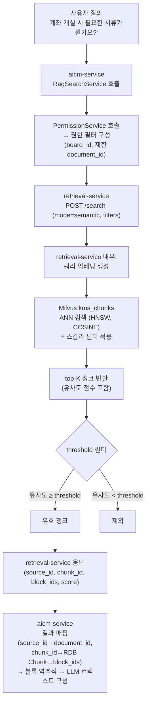

### 4.3 sLLM 임베딩 품질 한계와 대응

온프레미스 sLLM 임베딩 모델은 다음과 같은 한계가 있다.

| 한계 | 현상 | 대응 |
|------|------|------|
| 벡터 공간 분별력 부족 | 관련 문서와 무관한 문서의 유사도 차이가 작음 | threshold를 낮게 설정 (기본 0.3) |
| 도메인 용어 이해 부족 | 금융 전문 용어의 의미 표현이 부정확 | top-K를 넉넉히 확장 (기본 20) |
| 다의어 구분 부족 | "이체" → 계좌 이체 vs 부서 이체 혼동 | 하이브리드 검색 병행으로 보완 |

> **threshold와 top-K의 트레이드오프**: threshold를 높이면 정밀도(precision)가 올라가지만 recall이 떨어진다. sLLM 환경에서는 임베딩 품질이 낮아서 관련 청크도 유사도가 낮게 나올 수 있으므로, **threshold를 낮추고 top-K를 넉넉히** 잡아서 recall을 확보한 뒤, LLM이 컨텍스트에서 관련 정보를 추려내는 전략이 유효하다. 이 파라미터는 `SearchConfig`에서 관리자가 조정할 수 있다.

> **SaaS 환경에서는 다르게 동작한다**: SaaS 환경에서 고성능 임베딩 모델을 사용하면 벡터 품질이 높아지므로, threshold를 상향하고 top-K를 줄여 정밀도를 높일 수 있다. LLM Orchestrator의 프로바이더 분기로 임베딩 모델도 전환되므로, 환경에 따라 검색 파라미터를 달리 설정한다.

### 4.4 임베딩 미완료 문서 자동 제외

Milvus에는 발행(published) 후 임베딩이 완료된 청크만 존재한다. `DocumentVersion.embedding_status`가 `completed`가 아닌 문서의 청크는 Milvus에 아직 저장되지 않았으므로, 별도 필터 없이 자연스럽게 제외된다.

> **Milvus에 존재하는 것 = 임베딩 완료된 발행본**: 임베딩은 승인 완료(발행) 후에만 수행되고, 성공한 청크만 Milvus에 저장된다. 따라서 "Milvus에 있다 = 발행 + 임베딩 완료"가 항상 성립하며, 임베딩 상태를 별도로 필터할 필요가 없다.

---

## 5. 하이브리드 검색 전략

### 5.1 설계 원칙

aicm-service는 하이브리드 검색을 retrieval-service에 위임한다. retrieval-service가 내부적으로 BM25 키워드 매칭(ES `aicm_chunks`)과 벡터 시맨틱 매칭(Milvus `kms_chunks`)을 **같은 chunk_id 기준으로** 점수를 합산(RRF)하고, 통합 결과를 generic 모델로 반환한다.

> **왜 aicm_blocks가 아니라 aicm_chunks인가**: 하이브리드 검색에서 BM25 점수와 벡터 점수를 합산하려면 **동일한 단위**(chunk_id)로 매칭해야 한다. `aicm_blocks`는 블록 단위이고 Milvus는 청크 단위이므로 단위가 다르다. `aicm_chunks`는 Milvus와 같은 청크 단위로 BM25 인덱싱되어 있어 chunk_id 기준 합산이 가능하다. retrieval-service가 두 저장소를 모두 관리하므로, aicm-service는 RRF 합산 로직을 직접 구현할 필요가 없다.

### 5.2 하이브리드 검색 흐름

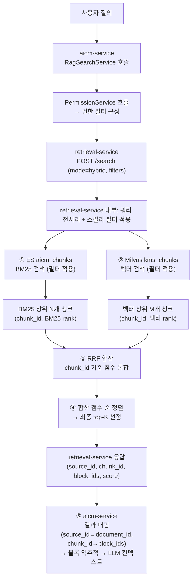

### 5.3 RRF (Reciprocal Rank Fusion)

RRF는 서로 다른 랭킹 시스템의 결과를 합산하는 메타 알고리즘이다. 점수 스케일이 달라도(BM25 점수 범위 vs 코사인 유사도 0~1) 순위만으로 통합하므로 정규화가 불필요하다.

**RRF 공식:**

$$
\text{RRF}(d) = \sum_{r \in R} \frac{1}{k + \text{rank}_r(d)}
$$

- $d$: 대상 청크
- $R$: 랭킹 시스템 집합 (BM25, 벡터)
- $k$: 상수 (기본값 60) — 순위 간 점수 차이를 완화하는 감쇠 파라미터
- $\text{rank}_r(d)$: 랭킹 시스템 $r$에서 청크 $d$의 순위 (1부터 시작)

**합산 예시:**

| chunk_id | BM25 순위 | 벡터 순위 | RRF 점수 (k=60) |
|----------|----------|----------|----------------|
| chunk_A | 1위 | 3위 | 1/(60+1) + 1/(60+3) = 0.01639 + 0.01587 = **0.03226** |
| chunk_B | 5위 | 1위 | 1/(60+5) + 1/(60+1) = 0.01538 + 0.01639 = **0.03177** |
| chunk_C | 2위 | - | 1/(60+2) + 0 = **0.01613** |
| chunk_D | - | 2위 | 0 + 1/(60+2) = **0.01613** |

> **RRF의 장점**: (1) 점수 스케일 무관 — BM25 원점수와 코사인 유사도를 정규화할 필요가 없다. (2) 단일 시스템 편향 방지 — 한쪽에서만 상위인 청크보다 양쪽에서 모두 히트된 청크가 우선된다. (3) 구현 단순 — 순위 매핑 후 합산만 하면 된다.

### 5.4 sLLM 환경에서 가중 RRF 전략

sLLM 임베딩 품질이 상용 모델 대비 낮지만, 한국어 BM25는 조사·어미 변형으로 키워드 매칭 정확도에 한계가 있다. 따라서 벡터 검색에 약간 높은 가중치를 부여하되, BM25를 recall 보완 수단으로 병행한다.

**가중 RRF 공식:**

$$
\text{RRF}_w(d) = w_{\text{bm25}} \cdot \frac{1}{k + \text{rank}_{\text{bm25}}(d)} + w_{\text{vec}} \cdot \frac{1}{k + \text{rank}_{\text{vec}}(d)}
$$

| 환경 | $w_{\text{bm25}}$ | $w_{\text{vec}}$ | 근거 |
|------|-------------------|-----------------|------|
| sLLM (기본) | **0.4** | **0.6** | 한국어 조사·어미로 BM25 정확도 제한, 시맨틱에 가중 |
| SaaS (고성능 모델) | **0.3** | **0.7** | 고품질 임베딩 → 시맨틱 비중 추가 확대 |

> **가중치는 관리자 튜닝 대상이다.** `SearchConfig`에서 BM25/벡터 가중치를 조정할 수 있다. 초기 운영 시 기본값으로 시작하고, 검색 품질 모니터링 결과를 보며 점진적으로 조정한다. 가중치 조정에 대한 상세는 [검색 튜닝 전략](./04-search-tuning.md)에서 다룬다.

### 5.5 각 시스템별 검색 개수 설정

RRF 합산 전 각 시스템에서 가져오는 후보 수를 충분히 확보해야 합산 품질이 보장된다.

| 파라미터 | 기본값 | 설명 |
|---------|--------|------|
| BM25 후보 수 (N) | 30 | retrieval-service 내부: ES `aicm_chunks`에서 가져오는 상위 청크 수 |
| 벡터 후보 수 (M) | 30 | retrieval-service 내부: Milvus `kms_chunks`에서 가져오는 상위 청크 수 |
| 1차 top-K (`SearchConfig.rag_top_k`) | 20 | RRF 합산 후 retrieval-service가 반환하는 청크 수. `PUT /config`로 push |
| LLM 전달 top-K (`BoardRagConfig.top_k`) | 3~5 | 1차 결과 중 LLM 컨텍스트에 전달할 최종 청크 수. 게시판별 설정 |

> **후보 수 > 1차 top-K인 이유**: 각 시스템에서 30개씩 가져와야 양쪽 모두에 등장하는 "교집합 청크"를 충분히 확보할 수 있다. BM25 상위 10개와 벡터 상위 10개만 가져오면 교집합이 거의 없어 RRF 합산 효과가 미미해진다. retrieval-service는 1차 top-K(기본 20)개를 반환하고, aicm-service가 게시판별 설정(`BoardRagConfig.top_k`)에 따라 LLM 컨텍스트에 전달할 최종 수를 결정한다.

---

## 6. 검색 권한 필터 전략

모든 검색 모드에서 **사전 필터링(pre-filtering)** 방식을 적용한다. 검색 쿼리 실행 전에 PermissionService에서 권한 필터를 구성하고, 이를 검색 엔진에 주입하여 접근 불가한 결과가 반환되지 않도록 한다.

> **사전 필터링 통일의 배경**: 초기 설계에서 RAG 검색은 사후 필터링을 적용했으나, top-K 결과 고갈(제한 항목이 top-K 슬롯을 차지), 게시판 단위 대량 차단 누락, 불필요한 스코어링 낭비 문제를 해소하기 위해 사전 필터링으로 전환했다. 상세 의사결정 배경은 [ADR-003](../../../adr/003-rag-search-pre-filtering.md)을 참조한다.

### 6.1 공통 권한 필터 구성

키워드 검색과 RAG 검색 모두 동일한 PermissionService 호출로 필터를 구성한다. 필터 구성 로직은 한 번만 작성하면 두 검색 모드에서 재사용된다.

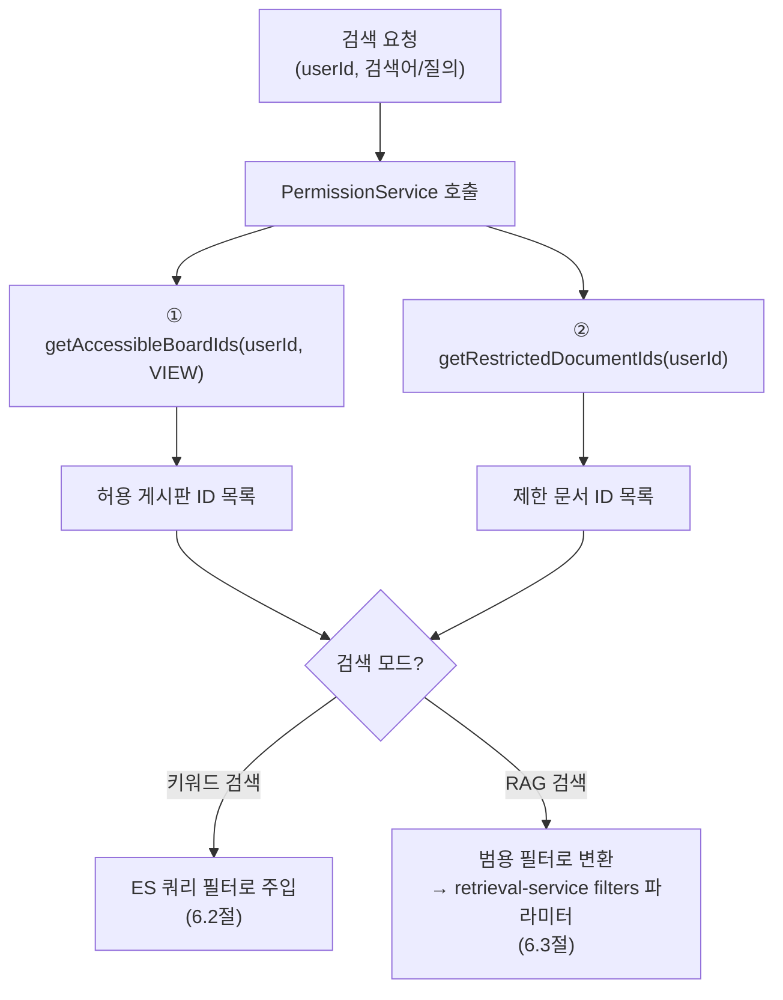

### 6.2 키워드 검색: ES 쿼리 필터 주입

문서 검색 모드에서는 검색 쿼리 **실행 전**에 권한 필터를 ES `aicm_blocks` 쿼리에 주입한다.

| 필터 유형 | ES 쿼리 적용 |
|----------|-------------|
| 게시판 허용 | `bool.filter.terms: { board_id: [...] }` |
| 문서 제한 제외 | `bool.must_not.terms: { document_id: [...] }` |
| 검색 일시 정지 | `bool.filter.term: { is_suspended: false }` |

### 6.3 RAG 검색: retrieval-service 사전 필터 전달

RAG 검색(시맨틱/하이브리드)에서는 aicm-service가 PermissionService에서 조회한 권한 정보를 **retrieval-service의 범용 필터 파라미터로 변환**하여 검색 API 호출 시 전달한다. retrieval-service는 이 필터를 Milvus 스칼라 필터와 ES bool 필터로 적용하여, 접근 불가한 청크가 검색 후보에서 원천 배제된다.

> **범용 모델 유지**: retrieval-service는 aicm의 권한 모델(BoardPermission, DocumentRestriction)을 알지 못한다. aicm-service가 도메인 필터를 retrieval-service의 범용 모델(`source_id`, `source_metadata`)로 변환하므로 서비스 간 결합도가 증가하지 않는다.

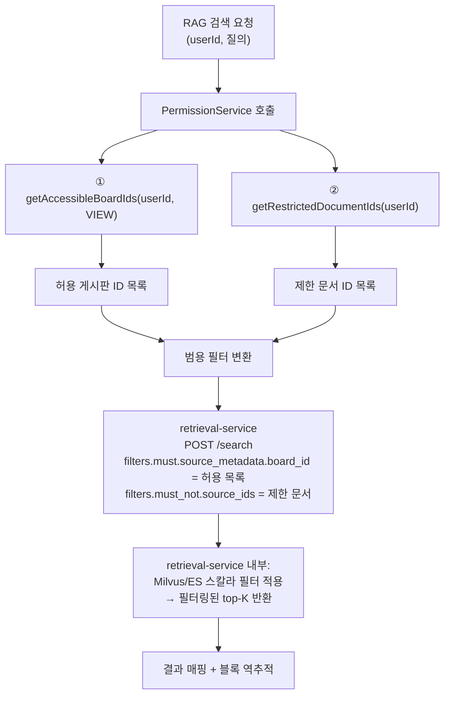

| aicm 권한 정보 | retrieval-service 필터 파라미터 | Milvus/ES 적용 |
|---|---|---|
| 접근 가능 `board_id` 목록 | `filters.must.source_metadata.board_id` | `board_id IN [...]` |
| 제한 `document_id` 목록 | `filters.must_not.source_ids` | `document_id NOT IN [...]` |

### 6.4 기본 필터 (항상 적용)

모든 검색 모드에서 아래 조건은 항상 사전 적용된다.

| 필터 | 조건 | 키워드 검색 | RAG 검색 |
|------|------|-----------|----------|
| `is_suspended` | `false` | ES 사전 필터 | retrieval-service 사전 필터 (`is_suspended` 필드 기본 필터) |
| `board_id` | 사용자 접근 가능 게시판만 | ES 사전 필터 | retrieval-service 사전 필터 (`filters.must.source_metadata.board_id`) |
| `document_id` 제한 | Restriction 대상 제외 | ES 사전 필터 (must_not) | retrieval-service 사전 필터 (`filters.must_not.source_ids`) |

> **사전 필터의 장점**: (1) top-K 결과가 항상 접근 가능한 항목으로만 구성된다 — LLM 컨텍스트 부족 문제 방지. (2) 페이지네이션이 정확하다 — 요청한 건수만큼 반환. (3) 성능 효율적 — 접근 불가한 항목을 스코어링하지 않음. 상세 의사결정 배경은 [ADR-003](../../../adr/003-rag-search-pre-filtering.md), 인증/인가 상세는 [03-auth-architecture.md 5.6절](../../../02-architecture/03-auth-architecture.md)을 참조한다.

---

## 7. 검색 결과 반환 흐름

문서 검색과 RAG 검색은 결과 반환 방식이 다르다.

### 7.1 문서 검색 결과 반환

문서 검색은 ES `aicm_blocks`의 `collapse` + `inner_hits` 결과를 그대로 활용한다.

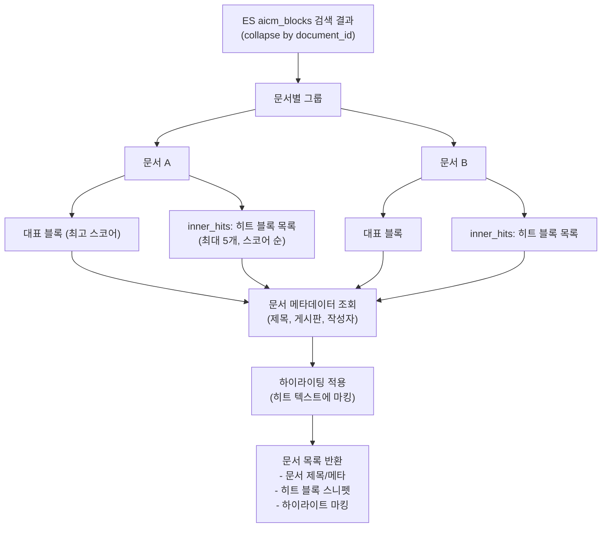

### 7.2 RAG 검색 결과 반환 (retrieval-service 응답 → 매핑 → 블록/문서 역추적)

RAG 검색(시맨틱/하이브리드)은 retrieval-service의 generic 응답에서 출발하여, aicm 도메인 모델로 매핑한 뒤 블록과 문서를 역추적한다.

#### 7.2.1 retrieval-service 응답 매핑

retrieval-service는 도메인 무관한 generic 모델로 응답한다. aicm-service의 `RagSearchService`가 이를 aicm 도메인 모델로 매핑한다.

| retrieval-service 응답 필드 | aicm 도메인 매핑 | 설명 |
|---------------------|----------------|------|
| `source_id` | `document_id` | 문서 식별자 |
| `block_ids` | RDB Chunk의 `block_ids` | 매칭된 청크를 생성한 블록 ID 목록 (M:N — ADR-012) |
| `chunk_id` | RDB Chunk의 `id` | 매칭된 청크 식별자 |
| `score` | 검색 점수 | 유사도 또는 RRF 합산 점수 (리랭킹 적용 시 리랭킹 점수) |
| `content` | 청크 텍스트 | 매칭된 청크의 원문 |
| `source_metadata` | 메타데이터 | board_id, tags 등 비정규화 정보 |

#### 7.2.2 블록/문서 역추적 흐름

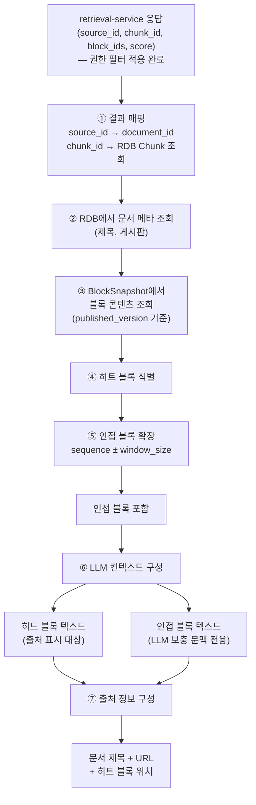

### 7.3 히트 블록 vs 인접 블록 구분

| 구분 | 정의 | 출처 표시 | 컨텍스트 스니펫 | LLM 컨텍스트 |
|------|------|:---:|:---:|:---:|
| **히트 블록** | 검색 엔진이 직접 매칭한 청크의 원본 블록 | O — 하이라이트 | O — `is_hit=true` (강조 배경) | 포함 |
| **인접 블록** | 히트 블록의 sequence ± window_size 범위 블록 | **X — 출처 아님** | O — `is_hit=false` (연한 배경) | 보충 문맥으로 포함 |

> **인접 블록은 출처가 아니라 배경 문맥이다**: 인접 블록은 검색 근거가 아니다. 사용자에게 "이 문서의 이 블록을 참고했습니다"라고 말할 때, 실제 검색에서 히트되지 않은 블록을 출처로 표시하면 신뢰도가 떨어진다. 컨텍스트 스니펫에서 인접 블록을 함께 보여주되, `is_hit` 마커와 시각적 구분으로 출처와 배경 문맥의 차이를 명확히 한다. 상세는 [7.6절](#76-컨텍스트-스니펫-전략)에서 정의한다.

### 7.4 인접 블록 확장 (Window Context)

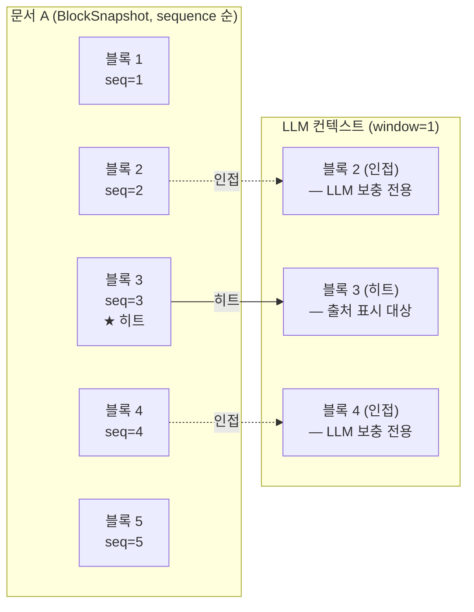

- window size는 `SearchConfig`에서 관리 (기본값: 1)

### 7.5 출처 표시 구조

```
RAG 답변:
  "계좌 개설 시 신분증과 도장을 준비하여 영업점을 방문하시면 됩니다..."

  📄 참고 문서:
  ├── 계좌 개설 매뉴얼          ← Document (클릭 시 문서 상세로 이동)
  │     → 블록 2: 준비 서류     ← 히트 블록 (문서 내 해당 블록으로 스크롤 + 하이라이트)
  │     → 블록 4: 방문 절차
  └── 신규 고객 안내서
        → 블록 1: 개요
```

> **역추적 경로와 스키마 상세**: 청크 → block_ids → BlockSnapshot → Document 역추적의 구체적 데이터 흐름과 관련 엔티티 스키마는 [데이터 아키텍처 — 전체 개요](../../../02-architecture/data/README.md)에서 정의한다.

### 7.6 컨텍스트 스니펫 전략

짧은 블록이 히트되면 블록 텍스트만으로는 맥락 파악이 어렵다. **컨텍스트 스니펫**은 히트 블록과 인접 블록을 합쳐 하나의 읽을 수 있는 단위로 API 응답에 포함하는 전략이다. 이는 특정 클라이언트 대응이 아니라 **aicm-service 검색 API 레벨의 범용 기능**이며, aicm-web, AICC 모듈(상담어드바이져, 에이전트빌더), 향후 모든 외부 클라이언트가 동일하게 활용한다.

> **의사결정 배경**: 컨텍스트 스니펫 도입의 배경과 대안 비교는 [ADR-004](../../../adr/004-context-snippet-for-search-display.md)에서 다룬다.

#### 7.6.1 스니펫 구성 규칙

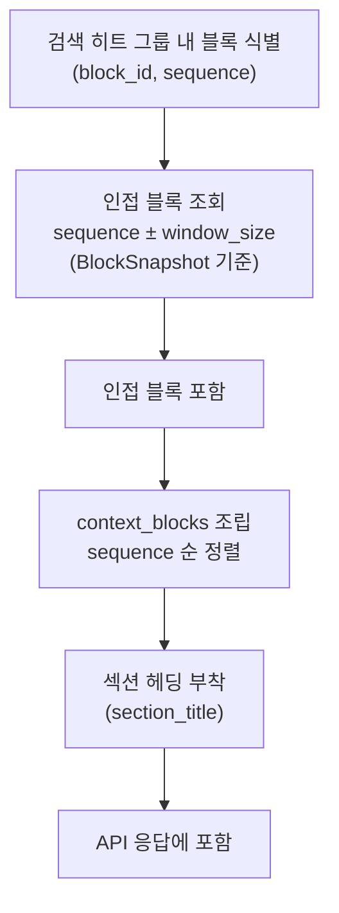

| 규칙 | 설명 |
|------|------|
| 구성 범위 | 히트 블록의 sequence ± `window_size` (기본값: 1) |
| 정렬 | `sequence` 오름차순 |
| 히트/인접 구분 | 각 블록에 `is_hit` 플래그 — `true`(히트), `false`(인접) |
| 섹션 breadcrumb | 히트 블록이 속한 섹션의 헤딩 텍스트를 `section_title`로 부착 |
| LLM 컨텍스트와의 관계 | 동일한 Window Context 확장 로직을 재사용. LLM 컨텍스트 구성과 스니펫 조립은 같은 블록 집합을 사용 |

#### 7.6.2 API 응답 구조

```typescript
interface SearchResultBlock {
  block_id: string;
  sequence: number;
  content_text: string;
  block_type: string;
  is_hit: boolean;           // true: 검색 히트, false: 인접 블록 (배경 문맥)
}

interface SearchResultItem {
  document_id: string;
  document_title: string;
  board_id: string;
  section_title?: string;    // 히트 블록이 속한 섹션 헤딩
  score: number;
  context_blocks: SearchResultBlock[];  // 히트 + 인접 블록 (sequence 순)
  document_url: string;      // 문서 상세 URL
}
```

> **하위 호환**: 기존 응답 필드(문서 메타, 히트 블록 스니펫, 하이라이트 마킹)는 유지한다. `context_blocks`는 추가 필드이므로, 기존 클라이언트는 이 필드를 무시해도 기존 동작에 영향이 없다.

#### 7.6.3 스니펫 표시 예시

```
문서: "계좌 개설 매뉴얼" (5개 블록)
  [1] heading2: "계좌 개설 절차"
  [2] paragraph: "영업점 방문 시 아래 서류가 필요합니다."
  [3] paragraph: "준비물을 지참하세요."          ← ★ 검색 히트
  [4] paragraph: "신분증, 도장, 통장 사본을 준비하세요."
  [5] paragraph: "창구에서 신청서를 작성합니다."

→ API 응답 (window_size=1):
  section_title: "계좌 개설 절차"
  context_blocks:
    { block_id=[2], seq=2, text="영업점 방문 시...",    is_hit=false }
    { block_id=[3], seq=3, text="준비물을 지참하세요.",  is_hit=true  }
    { block_id=[4], seq=4, text="신분증, 도장, 통장...", is_hit=false }

→ 클라이언트 렌더링:
  📄 계좌 개설 매뉴얼 > 계좌 개설 절차
  ┌──────────────────────────────────
  │ 영업점 방문 시 아래 서류가 필요합니다.    ← 연한 배경 (배경 문맥)
  │ **준비물을 지참하세요.**                  ← 강조 배경 (검색 근거)
  │ 신분증, 도장, 통장 사본을 준비하세요.     ← 연한 배경 (배경 문맥)
  └──────────────────────────────────
```

#### 7.6.4 활용처

| 소비자 | 활용 방식 |
|--------|----------|
| **aicm-web 문서 검색** | 검색 결과 리스트에서 스니펫으로 표시. 히트 블록 하이라이트 + 인접 블록 연한 배경 |
| **aicm-web RAG 출처** | RAG 답변의 참고 문서 펼침 시 컨텍스트 스니펫 표시 |
| **AICC 모듈 (상담어드바이져)** | 상담 화면 검색 패널에서 즉시 맥락 파악 가능한 스니펫 표시 |
| **AICC 모듈 (에이전트빌더)** | 자동 응답 시나리오에서 검색 결과의 컨텍스트 활용 |
| **향후 외부 클라이언트** | `context_blocks` 필드를 활용하여 자유롭게 UI 구성 |

---

## 8. sLLM RAG 품질 보완 전략

sLLM 환경에서 RAG 검색 품질을 확보하기 위한 다층 보완 전략을 정리한다.

### 8.1 전략 요약

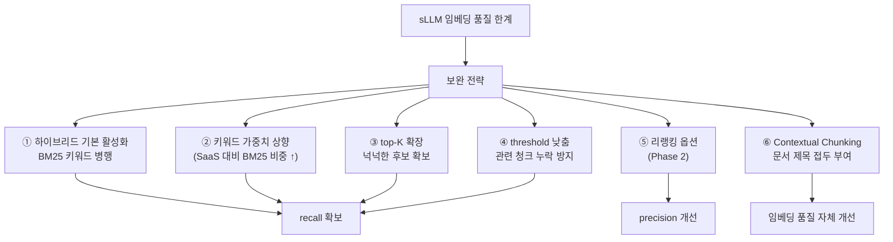

### 8.2 보완 전략 상세

| 순서 | 전략 | 효과 | 트레이드오프 |
|------|------|------|------------|
| ① | 하이브리드 검색 기본 활성화 | 벡터 검색이 놓친 키워드 일치 문서를 BM25가 보완 | 검색 레이턴시 증가 (두 시스템 병렬 쿼리) |
| ② | sLLM 환경 키워드 가중치 상향 | 신뢰도 높은 BM25 결과 우선 반영 | 시맨틱 매칭의 장점(동의어, 의미 유사) 약화 |
| ③ | top-K 확장 (기본 20) | 관련 청크가 낮은 순위에 있어도 포착 | LLM 컨텍스트 길이 증가, 처리 시간 증가 |
| ④ | threshold 하향 (기본 0.3) | 저품질 임베딩에서도 관련 청크를 놓치지 않음 | 노이즈 증가 (무관한 청크 혼입) |
| ⑤ | 리랭킹 (Phase 2) | 1차 검색 결과를 교차 인코더로 재정렬하여 precision 향상 | 추가 모델 호출 비용, 레이턴시 증가 |
| ⑥ | Contextual Chunking | 청크에 문서 제목 컨텍스트를 부여하여 임베딩 품질 향상 | 청크 토큰 증가 (미미) |

### 8.3 리랭킹 전략 (Phase 2)

1차 검색으로 넓게 확보한 후보를, 교차 인코더(Cross-Encoder) 리랭킹 모델로 재정렬하여 precision을 높인다.

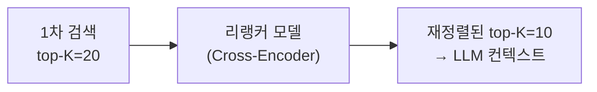

| 항목 | 설명 |
|------|------|
| 적용 시점 | 1차 검색(하이브리드 또는 시맨틱) 후 |
| 입력 | (질의, 청크 텍스트) 쌍 × top-K개 |
| 모델 | Cross-Encoder (sLLM 환경: 경량 모델, SaaS: Cohere Rerank 등) |
| 효과 | Bi-Encoder 임베딩 대비 높은 정밀도로 관련성 재평가 |
| 비용 | 청크당 모델 추론 1회 → top-K가 클수록 비용 증가 |

> **리랭킹은 Phase 2에서 도입하는 이유**: Phase 1에서는 하이브리드 검색 + 파라미터 튜닝으로 기본 품질을 확보한다. 리랭킹은 추가 모델 인프라(Cross-Encoder 서빙)가 필요하고, 레이턴시를 증가시키므로 기본 검색 파이프라인이 안정된 후에 도입한다. 검색 품질 모니터링 결과를 보고 필요성을 판단한다.

### 8.4 파라미터 기본값 정리

| 파라미터 | sLLM 기본값 | SaaS 기본값 | 관리 위치 |
|---------|-----------|-----------|----------|
| 검색 모드 (RAG) | 하이브리드 | 하이브리드 | `SearchConfig` |
| BM25 가중치 | 0.4 | 0.3 | `SearchConfig` |
| 벡터 가중치 | 0.6 | 0.7 | `SearchConfig` |
| RRF k | 60 | 60 | `SearchConfig` |
| 벡터 threshold | 0.3 | 0.5 | `SearchConfig` |
| 1차 검색 top-K | 20 | 15 | `SearchConfig` |
| 최종 LLM top-K | 3~5 | 5~10 | `BoardRagConfig` (게시판별) |
| 인접 블록 window | 1 | 1 | `SearchConfig` |
| 리랭킹 활성화 | false (Phase 2) | false (Phase 2) | `SearchConfig` |

> **파라미터 기준 문서**: 상세 튜닝 전략과 프리셋 예시는 [04-search-tuning.md](./04-search-tuning.md) §1(SearchConfig)·§4(RAG 튜닝)를 참조한다. 본 표는 요약이며, 불일치 시 search-tuning 문서가 우선한다.

---

## 관련 문서

| 문서 | 관계 |
|------|------|
| [ADR-003: RAG 사전 필터링 전환](../../../adr/003-rag-search-pre-filtering.md) | 6절 사전 필터링 통일 결정의 배경과 근거 |
| [데이터 아키텍처](../../../02-architecture/data/README.md) | ES 인덱스 매핑([aicm/es](../../../02-architecture/data/aicm/es.md), [retriever/es](../../../02-architecture/data/retriever/es.md)), Milvus 컬렉션([retriever/milvus](../../../02-architecture/data/retriever/milvus.md)), 검색 결과 반환 메커니즘(00-overview) |
| [인증/인가 아키텍처](../../../02-architecture/03-auth-architecture.md) | 검색 권한 필터(5.6절), DocumentRestriction(5.4절) |
| [비동기 처리 아키텍처](../../../02-architecture/05-async-event-architecture.md) | 임베딩 파이프라인 이벤트 흐름 |
| [검색/RAG 도메인 README](./README.md) | 파이프라인 조감도, 핵심 설계 전제, 문서 구성 |
| [청킹 전략](./02-chunking.md) | Contextual Chunking, 블록 타입별 임베딩 입력 |
| [검색 튜닝 전략](./04-search-tuning.md) | SearchConfig, 동의어/불용어/부스팅, Playground, 모니터링 |
