# 검색 튜닝 전략

> **문서 상태**
> | 항목 | 값 |
> |------|-----|
> | 상태 | `draft` |
> | 검수 | `unreviewed` |
> | 작성일 | 2026-03-17 |
> | 최종 수정 | 2026-04-06 |

> **기능정의서 참조**: 2.6.1 레거시 검색 튜닝, 2.6.2 RAG 검색 튜닝, 2.6.3 검색 Playground, 2.6.4 검색 품질 모니터링

---

## 1. 개요

이 문서는 검색 파이프라인의 **파라미터를 어떻게 조정하고, 왜 그렇게 하는가**를 다룬다. [검색 전략](./03-search.md)이 "검색이 어떤 흐름으로 동작하는가"를 기술한다면, 이 문서는 "그 흐름의 다이얼을 누가, 어떤 기준으로 돌리는가"에 집중한다.

**관리자**는 시스템 전체의 검색 품질을 책임지고, **사용자**는 개인 검색 경험을 미세 조정한다. 두 레이어를 분리함으로써 관리자 설정이 전역 베이스라인이 되고, 사용자 설정은 그 위에 오버레이된다.

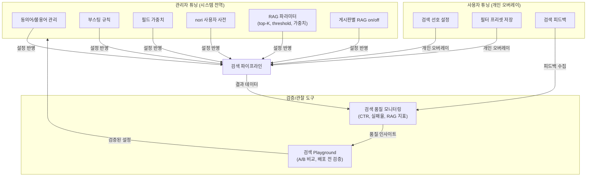

---

## 2. 검색 설정 엔티티 상세

[데이터 아키텍처 — RDB 엔티티](../../../02-architecture/data/aicm/rdb.md)에서 `SearchConfig → Synonym / StopWord / BoostRule / BoardRagConfig`, `ParsingConfig → BoardParsingOverride / TemplateChunkingRule` 관계만 정의하고 필드 정의를 이 문서로 위임하였다. 아래에서 상세 정의한다.

### 2.1 ERD

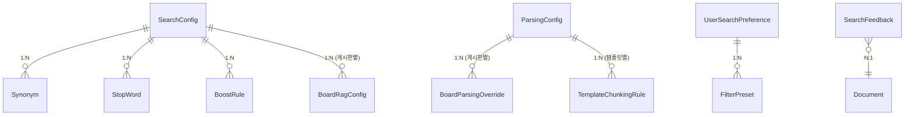

### 2.2 SearchConfig (검색 설정 — 테넌트당 1건)

기존 KeywordSearchConfig, FieldWeight, RagSearchConfig 3개 엔티티를 단일 테이블로 통합하였다. 컬럼 프리픽스(`kw_` = 키워드 검색, `rag_` = RAG 검색)로 관심사를 구분한다. — [ADR-009](../../../adr/009-search-config-singleton-merge.md) 참조

| 필드 | 타입 | 설명 |
|------|------|------|
| id | UUID (PK) | |
| kw_nori_user_dict | TEXT[] | nori 사용자 사전 단어 목록. ES `user_dictionary_rules`에 동기화 |
| kw_title_weight | DECIMAL(3,1) | 제목 필드 가중치 (기본 3.0) |
| kw_body_weight | DECIMAL(3,1) | 본문(block_text) 필드 가중치 (기본 1.0) |
| kw_caption_weight | DECIMAL(3,1) | 캡션(block_caption) 필드 가중치 (기본 1.5) |
| rag_default_search_mode | ENUM | `keyword`, `semantic`, `hybrid` — 시스템 기본 검색 모드 |
| rag_hybrid_bm25_weight | DECIMAL(3,2) | 하이브리드 검색 시 BM25 가중치 (기본 0.4) |
| rag_hybrid_vector_weight | DECIMAL(3,2) | 하이브리드 검색 시 벡터 가중치 (기본 0.6) |
| rag_rrf_k | INT | RRF 상수 k (기본 60) |
| rag_rerank_enabled | BOOLEAN | 리랭킹 활성화 여부 (기본 false) |
| rag_rerank_model | VARCHAR (nullable) | 리랭킹 모델 식별자 (LLM Orchestrator 프로바이더 키) |
| rag_rerank_top_n | INT (nullable) | 리랭킹 후 반환할 상위 결과 수 |
| rag_top_k | INT | RAG 검색 시 retrieval-service에 요청하는 1차 검색 상위 K개 (기본 20) |
| rag_window_context_size | INT | 인접 블록 확장 윈도우 크기 (기본 1) |
| rag_similarity_threshold | DECIMAL(3,2) | 시맨틱 유사도 임계값 (기본 0.3) |
| created_at | TIMESTAMP | |
| updated_at | TIMESTAMP | |

> **키워드 검색(`kw_*`) 설정**: ES/nori 관련 설정과 필드 가중치를 관리한다. ES 직접 적용.
> **RAG 검색(`rag_*`) 설정**: 하이브리드 가중치, top-K, threshold, 리랭킹 등을 관리한다. retrieval-service에 `PUT /config`로 push 동기화.
> **파싱/청킹 설정**: 파싱/청킹 파라미터는 별도 ParsingConfig(§2.12)로 분리되어 있다.

### 2.3 Synonym (동의어)

| 필드 | 타입 | 설명 |
|------|------|------|
| id | UUID (PK) | |
| search_config_id | UUID (FK) | |
| term | VARCHAR | 원어 (예: "계좌개설") |
| synonyms | TEXT[] | 동의어 목록 (예: `["통장개설", "어카운트개설"]`) |
| is_bidirectional | BOOLEAN | 양방향 동의어 여부 (기본 true) |
| is_active | BOOLEAN | 활성화 상태 |
| created_at | TIMESTAMP | |
| updated_at | TIMESTAMP | |

> **양방향 vs 단방향**: 대부분의 동의어는 양방향("계좌개설" ↔ "통장개설")이지만, 약어 확장("KB" → "국민은행")은 단방향이 자연스럽다. `is_bidirectional` 플래그로 두 케이스를 하나의 테이블에서 관리한다.

### 2.4 StopWord (불용어)

| 필드 | 타입 | 설명 |
|------|------|------|
| id | UUID (PK) | |
| search_config_id | UUID (FK) | |
| word | VARCHAR (UNIQUE per config) | 불용어 단어 |
| is_active | BOOLEAN | 활성화 상태 |
| created_at | TIMESTAMP | |

> **불용어 전략**: nori 분석기의 기본 불용어에 더해, 도메인 특화 불용어(금융 서류에서 반복되는 "관련", "해당", "기타" 등)를 관리한다. 불용어 추가는 즉시 적용이 아닌 **검색 설정 배포 흐름**을 거친다 — Playground에서 검증 후 적용.

### 2.5 BoostRule (부스팅 규칙)

| 필드 | 타입 | 설명 |
|------|------|------|
| id | UUID (PK) | |
| search_config_id | UUID (FK) | |
| target_type | ENUM | `board`, `tag`, `document` — 부스팅 대상 유형 |
| target_id | UUID | 대상 엔티티 ID (board_id, tag_id, document_id) |
| boost_factor | DECIMAL(4,2) | 부스팅 배수 (1.0 = 기본, 2.0 = 2배, 0.5 = 감쇠) |
| priority | INT | 규칙 적용 우선순위 (낮을수록 먼저 적용) |
| is_active | BOOLEAN | 활성화 상태 |
| start_at | TIMESTAMP (nullable) | 시한부 부스팅 시작 (nullable = 상시) |
| end_at | TIMESTAMP (nullable) | 시한부 부스팅 종료 |
| created_at | TIMESTAMP | |
| updated_at | TIMESTAMP | |

> **부스팅 규칙 중첩**: 하나의 문서에 게시판 부스팅(board)과 태그 부스팅(tag)이 동시에 적용될 수 있다. 이 경우 **priority 순서대로 곱셈 합성**한다 — `board boost(1.5) × tag boost(1.2) = 1.8`. 과도한 부스팅 방지를 위해 합성 결과의 **상한은 5.0**으로 클램핑한다.

### 2.6 필드 가중치 (SearchConfig의 kw_*_weight 컬럼)

> FieldWeight 엔티티는 SearchConfig에 `kw_title_weight`, `kw_body_weight`, `kw_caption_weight` 컬럼으로 흡수되었다. — [ADR-009](../../../adr/009-search-config-singleton-merge.md) 참조

| SearchConfig 컬럼 | 기본값 | 설명 |
|------|------|------|
| kw_title_weight | 3.0 | 제목 필드 가중치 |
| kw_body_weight | 1.0 | 본문(block_text) 필드 가중치 |
| kw_caption_weight | 1.5 | 캡션(block_caption) 필드 가중치 |

> **필드 가중치가 적용되는 곳**: ES `multi_match` 쿼리의 `fields` 파라미터에 `["title^3.0", "block_text^1.0", "block_caption^1.5"]` 형태로 반영된다. 제목에 높은 가중치를 두는 이유는, 사용자가 "계좌 개설"을 검색할 때 본문에서 한 번 언급된 문서보다 제목이 "계좌 개설 매뉴얼"인 문서가 의도에 더 부합하기 때문이다.

### 2.7 SearchConfig — retrieval-service 설정 동기화

> SearchConfig의 RAG 파라미터(`rag_*` 컬럼)는 §2.2 필드 테이블에 정의되어 있다. 이 절은 retrieval-service와의 동기화 메커니즘을 설명한다.

SearchConfig의 `rag_*` 설정은 retrieval-service에 동기화되어야 한다. aicm-service가 설정 변경 시 retrieval-service에 push한다.


| 동기화 항목 | SearchConfig 컬럼 | retrieval-service 설정 매핑 |
|-----------|----------------------|---------------------|
| 하이브리드 BM25 가중치 | `rag_hybrid_bm25_weight` | `hybrid_weight_bm25` |
| 하이브리드 벡터 가중치 | `rag_hybrid_vector_weight` | `hybrid_weight_vector` |
| RRF k 상수 | `rag_rrf_k` | `rrf_k` |
| 리랭킹 활성화 | `rag_rerank_enabled` | `reranking_enabled` |
| RAG top-K | `rag_top_k` | `top_k` |
| 인접 블록 윈도우 | `rag_window_context_size` | `window_context_size` |
| 기본 검색 모드 | `rag_default_search_mode` | `default_search_mode` |
| 유사도 임계값 | `rag_similarity_threshold` | `similarity_threshold` |
| 리랭킹 모델 | `rag_rerank_model` | `reranking_model` |
| 리랭킹 반환 수 | `rag_rerank_top_n` | `reranking_top_n` |

> **retrieval-service는 설정을 내부 캐싱한다.** retrieval-service는 테넌트당 1인스턴스로 배포되므로 별도의 테넌트 식별자 없이 설정을 관리한다. 설정 변경 시 aicm-service가 `PUT /config`로 push하면, retrieval-service는 캐시를 갱신한다. retrieval-service가 재시작되면 aicm-service에 설정을 재요청하거나 기본값으로 동작한다.

### 2.8 BoardRagConfig (게시판별 RAG 설정)

| 필드 | 타입 | 설명 |
|------|------|------|
| id | UUID (PK) | |
| search_config_id | UUID (FK) | SearchConfig 참조 |
| board_id | UUID (FK, UNIQUE) | 게시판별 1건 |
| rag_enabled | BOOLEAN | 해당 게시판에서 RAG 활성화 여부 |
| top_k | INT | LLM에 전달할 최종 청크 수 (기본 5). SearchConfig.rag_top_k(검색 후보 수)와 구분 |
| similarity_threshold | DECIMAL(3,2) | 유사도 임계값 (기본 0.3) |
| context_window_blocks | INT | 인접 블록 컨텍스트 윈도우 크기 (기본 1) |
| updated_at | TIMESTAMP | |

> **게시판별 RAG 분리 이유**: 게시판 성격에 따라 RAG 필요 여부가 다르다. FAQ 게시판은 RAG로 정확한 답변 청크를 반환해야 하지만, 공지사항 게시판은 키워드 검색이면 충분하다. 게시판 단위로 RAG on/off와 파라미터를 분리하면 불필요한 LLM 호출을 제거하고 sLLM 환경에서 제한된 연산 자원을 효율적으로 배분할 수 있다.

### 2.9 UserSearchPreference (사용자 검색 선호)

| 필드 | 타입 | 설명 |
|------|------|------|
| id | UUID (PK) | |
| user_id | UUID (UNIQUE) | 사용자별 1건 |
| preferred_search_mode | ENUM (nullable) | `keyword`, `semantic`, `hybrid` — null이면 시스템 기본값 사용 |
| default_board_filter | UUID[] (nullable) | 기본 게시판 필터 목록 |
| results_per_page | INT | 한 페이지 결과 수 (기본 10, 최대 50) |
| highlight_enabled | BOOLEAN | 검색 결과 하이라이트 표시 (기본 true) |
| updated_at | TIMESTAMP | |

### 2.10 FilterPreset (필터 프리셋)

| 필드 | 타입 | 설명 |
|------|------|------|
| id | UUID (PK) | |
| user_search_preference_id | UUID (FK) | |
| name | VARCHAR | 프리셋 이름 (예: "내 팀 문서만") |
| board_ids | UUID[] (nullable) | 게시판 필터 |
| tag_ids | UUID[] (nullable) | 태그 필터 |
| date_range_days | INT (nullable) | 최근 N일 이내 필터 (null이면 전체 기간) |
| search_mode | ENUM (nullable) | 프리셋 전용 검색 모드 오버라이드 |
| created_at | TIMESTAMP | |

> **필터 프리셋의 목적**: 반복적인 검색 시나리오("내 팀 게시판에서 최근 30일 FAQ만")를 한 번의 클릭으로 적용할 수 있게 한다. 관리자 설정과 달리 사용자 데이터이므로 검색 품질에 영향을 주지 않고, 순수하게 편의 기능이다.

### 2.11 SearchFeedback (검색 피드백)

| 필드 | 타입 | 설명 |
|------|------|------|
| id | UUID (PK) | |
| user_id | UUID | 피드백 제공 사용자 |
| query | VARCHAR | 원본 검색 쿼리 |
| document_id | UUID (FK) | 피드백 대상 문서 |
| chunk_id | UUID (nullable) | 피드백 대상 청크 (RAG 검색 시) |
| feedback_type | ENUM | `relevant`, `irrelevant` |
| search_mode | ENUM | 당시 검색 모드 |
| result_position | INT | 검색 결과에서의 순위 |
| created_at | TIMESTAMP | |

### 2.12 ParsingConfig (파싱/청킹 설정 — 테넌트당 1건)

| 필드 | 타입 | 설명 |
|------|------|------|
| id | UUID (PK) | |
| default_chunking_strategy | ENUM | `semantic` (기본), `fixed_token`, `sliding_window` — 기본 청킹 전략 |
| max_tokens | INT | 청크 최대 토큰 수 (기본 256). sLLM 환경 기준 |
| overlap_tokens | INT (nullable) | 슬라이딩 윈도우 오버랩 토큰 수 (기본 50) |
| min_tokens | INT (nullable) | 최소 청크 토큰 수 (기본 30). 미만 시 스킵 검토 |
| contextual_prefix | BOOLEAN | Contextual Chunking 활성화 여부 (기본 true) |
| created_at | TIMESTAMP | |
| updated_at | TIMESTAMP | |

> **요청 시 동봉 패턴**: aicm-service가 `POST /ingest/embed` 또는 `POST /ingest/re-embed` 요청 시 해당 문서에 적용할 청킹 설정을 `chunking_config` 파라미터(ChunkingConfig 인터페이스)로 동봉한다. 게시판별 오버라이드(BoardParsingOverride)가 적용된 최종 설정값이 전달된다. retrieval-service는 파싱 설정을 캐싱하지 않으며, 매 요청에 동봉된 설정을 사용한다.

### 2.13 BoardParsingOverride (게시판별 파싱 오버라이드)

| 필드 | 타입 | 설명 |
|------|------|------|
| id | UUID (PK) | |
| parsing_config_id | UUID (FK) | |
| board_id | UUID (FK, UNIQUE) | 게시판별 1건 |
| chunking_strategy | ENUM (nullable) | 게시판별 청킹 전략 오버라이드 |
| max_tokens | INT (nullable) | 게시판별 청크 최대 토큰 수 오버라이드 |
| overlap_tokens | INT (nullable) | 게시판별 오버랩 토큰 수 오버라이드 |
| updated_at | TIMESTAMP | |

### 2.14 TemplateChunkingRule (템플릿별 청킹 규칙)

| 필드 | 타입 | 설명 |
|------|------|------|
| id | UUID (PK) | |
| parsing_config_id | UUID (FK) | |
| template_id | UUID (FK, UNIQUE) | 템플릿별 1건 |
| chunking_strategy | ENUM | 해당 템플릿에 적용할 청킹 전략 |
| contextual_prefix_strategy | VARCHAR | 접두 전략 (`faq_qa_pair`, `sop_step`, `checklist_item`, `default_heading`) |
| updated_at | TIMESTAMP | |

### 2.15 DB 인덱스

| 테이블 | 인덱스 | 컬럼 | 조건 |
|--------|--------|------|------|
| Synonym | `idx_synonym_config_active` | `(search_config_id, is_active)` | |
| Synonym | `idx_synonym_term` | `(search_config_id, term)` | `is_active = true` |
| StopWord | `idx_stopword_config_active` | `(search_config_id, is_active)` | |
| BoostRule | `idx_boost_active_type` | `(search_config_id, target_type, is_active)` | |
| BoostRule | `idx_boost_schedule` | `(start_at, end_at)` | `is_active = true` |
| BoardRagConfig | `idx_board_rag_config_board` | `(board_id)` | UNIQUE |
| BoardRagConfig | `idx_board_rag_config_parent` | `(search_config_id)` | |
| BoardParsingOverride | `idx_board_parsing_override_board` | `(board_id)` | UNIQUE |
| BoardParsingOverride | `idx_board_parsing_override_parent` | `(parsing_config_id)` | |
| TemplateChunkingRule | `idx_template_chunking_rule_template` | `(template_id)` | UNIQUE |
| TemplateChunkingRule | `idx_template_chunking_rule_parent` | `(parsing_config_id)` | |
| FilterPreset | `idx_preset_user` | `(user_search_preference_id)` | |
| SearchFeedback | `idx_feedback_query_date` | `(query, created_at DESC)` | |
| SearchFeedback | `idx_feedback_document` | `(document_id, feedback_type)` | |

---

## 3. 문서 검색(레거시) 튜닝 전략

### 3.1 동의어 관리

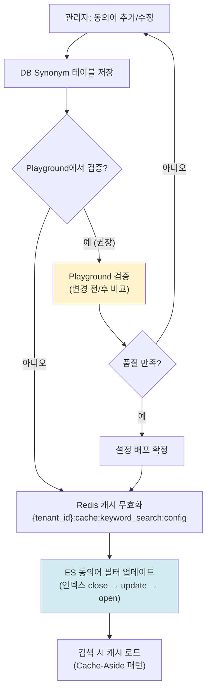

> **ES 동의어 반영의 트레이드오프**: ES의 동의어 필터는 인덱스 settings에 정의되므로, 변경 시 `close → update settings → open` 과정이 필요하다. 이 과정에서 해당 인덱스의 검색이 수 초간 불가능해진다. 따라서 (1) 동의어 변경은 즉시 반영이 아닌 **배치 배포** 방식을 채택하고, (2) Playground에서 충분히 검증한 후 적용하며, (3) 서비스 영향을 최소화하기 위해 **비동기 작업(BullMQ)**으로 비업무 시간에 배포하는 것을 권장한다.

**동의어 적용 경로:**

| 적용 위치 | 동작 | 비고 |
|-----------|------|------|
| ES `synonym` filter (인덱스 타임) | 인덱싱 시 동의어 확장 → BM25에 반영 | 인덱스 재구성 필요 |
| ES `search_analyzer` (쿼리 타임) | 검색 쿼리에 동의어 확장 | 인덱스 재구성 불필요 |
| 애플리케이션 레이어 (쿼리 확장) | 검색 전 쿼리를 동의어로 확장하여 다중 쿼리 | 가장 유연하지만 성능 비용 |

> **쿼리 타임 동의어를 기본으로 선택한 이유**: 인덱스 타임 동의어는 동의어 변경 시 전체 재인덱싱이 필요하다. 쿼리 타임 동의어는 `search_analyzer`만 업데이트하면 되므로 운영 부담이 작다. 정밀도는 인덱스 타임이 약간 높지만, 운영 편의성 대비 무시 가능한 차이이다.

### 3.2 불용어 관리

불용어는 nori 분석기의 `stop` 토큰 필터에 추가되어 인덱싱과 쿼리 양쪽에서 해당 단어를 제거한다.

| 단계 | 내용 |
|------|------|
| 기본 불용어 | nori 기본 불용어 세트 (조사, 어미 등) |
| 도메인 불용어 | 관리자가 추가한 도메인 특화 불용어 (StopWord 테이블) |
| 적용 | nori_analyzer의 `stop` 필터에 커스텀 목록 추가 |

> **불용어 추가 시 주의**: 불용어는 검색 결과에서 해당 단어를 완전히 무시하게 만든다. "기타"를 불용어로 추가하면 "기타 대출"에서 "기타"가 사라져 "대출" 단독 검색이 된다. 따라서 Playground에서 영향 범위를 반드시 확인해야 한다.

### 3.3 부스팅 규칙

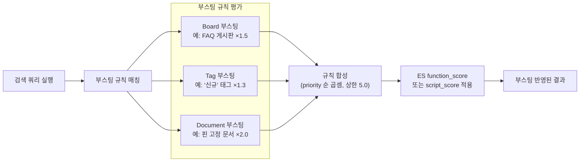

**부스팅 적용 메커니즘:**

| 단계 | 설명 |
|------|------|
| 1. 규칙 로드 | Redis 캐시에서 활성 BoostRule 목록 로드 |
| 2. 시간 필터 | `start_at`/`end_at` 범위 내 규칙만 적용 |
| 3. 매칭 | 검색 결과의 board_id, tag, document_id와 규칙 대조 |
| 4. 합성 | priority 순 곱셈 합성 (상한 5.0) |
| 5. 적용 | ES `function_score` 쿼리로 BM25 스코어에 곱셈 |

> **시한부 부스팅의 용도**: 이벤트 기간 중 관련 문서를 일시적으로 상위에 노출하거나, 신규 발행 문서를 일정 기간 부스팅하여 노출을 확보하는 데 사용한다. `start_at`/`end_at`이 null이면 상시 적용이다.

### 3.4 필드 가중치

| 필드 | 기본 가중치 | 근거 |
|------|-----------|------|
| title (문서 제목) | 3.0 | 제목 일치는 가장 강한 관련성 신호 |
| block_text (본문) | 1.0 | 기준선 |
| block_caption (캡션) | 1.5 | 이미지/표의 캡션은 해당 콘텐츠의 핵심 요약이므로 본문보다 약간 높게 |

ES `multi_match` 쿼리에 가중치가 반영되는 형태:

```json
{
  "multi_match": {
    "query": "계좌 개설",
    "fields": ["title^3.0", "block_text^1.0", "block_caption^1.5"],
    "type": "best_fields"
  }
}
```

> **가중치 튜닝은 Playground에서**: 필드 가중치 변경은 검색 품질에 직접적 영향을 미친다. 반드시 Playground A/B 비교를 통해 같은 쿼리 세트에 대한 결과 변화를 확인한 후 적용한다.

### 3.5 nori 사용자 사전

nori 형태소 분석기의 `user_dictionary_rules`에 도메인 용어를 추가하여 올바른 토큰화를 보장한다.

| 사례 | 기본 nori 결과 | 사용자 사전 적용 후 |
|------|--------------|-----------------|
| "비대면계좌개설" | "비대면" + "계좌" + "개설" 또는 미분리 | "비대면" + "계좌개설" (복합명사 등록) |
| "KB스타뱅킹" | "KB" + "스타" + "뱅킹" | "KB스타뱅킹" (고유명사 등록) |
| "ISA" | "ISA" (미분리) | "ISA" (약어 등록, 동의어 확장과 연계) |

**사용자 사전 배포 흐름:**

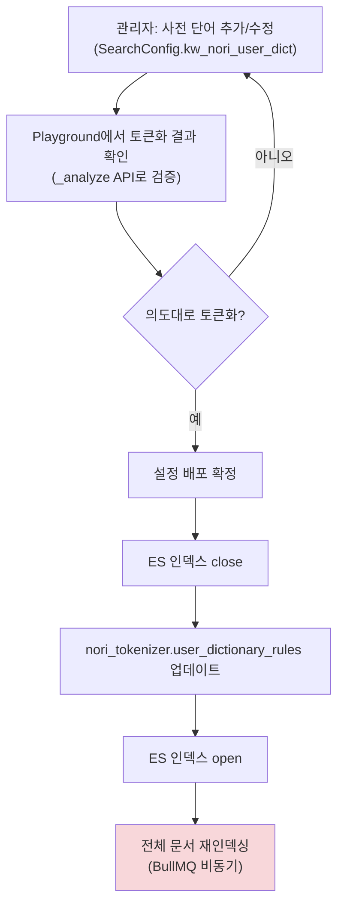

> **재인덱싱이 필요한 이유**: nori 사용자 사전은 인덱스 타임에 적용되므로, 기존에 인덱싱된 문서에는 새 사전이 반영되지 않는다. 사전 변경 후에는 전체 문서에 대한 재인덱싱이 필수이다. 이 비용이 크기 때문에, 사전 변경은 빈번하지 않아야 하며, 변경 시 Playground에서 충분히 검증한 후 비업무 시간에 일괄 배포한다.

---

## 4. RAG 검색 튜닝 전략

### 4.1 sLLM 환경 기본 프리셋

> **top_k 두 단계 구조**: 시스템에는 두 수준의 top_k가 존재한다. `SearchConfig.rag_top_k`(기본 20)는 retrieval-service에서 가져오는 **1차 검색 후보 수**이고, `BoardRagConfig.top_k`는 그 중 LLM 컨텍스트에 전달할 **최종 청크 수**이다. 아래 표의 `top_k`는 후자(최종 청크 수)를 가리킨다.

| 파라미터 | sLLM 프리셋 (기본) | 고성능 모델 프리셋 | 근거 |
|---------|-----------------|----------------|------|
| top_k | 3 | 5~10 | sLLM은 컨텍스트 윈도우가 작으므로 청크 수를 제한 |
| similarity_threshold | 0.3 | 0.5 | sLLM 임베딩 품질이 낮아 관련 청크도 유사도가 낮게 측정되므로 임계값을 낮춰 recall 확보 |
| max_tokens (ParsingConfig) | 256 | 512 | sLLM 임베딩 모델(bge-m3 등)의 최적 입력 범위 기준 |
| overlap_tokens (ParsingConfig) | 50 | 64 | 경계 문맥 손실과 중복 벡터 비용의 균형 |
| hybrid_bm25_weight | 0.4 | 0.3 | sLLM에서는 키워드 매칭의 정밀도를 약간 높여 보완 |
| hybrid_vector_weight | 0.6 | 0.7 | 고성능 모델은 시맨틱 이해가 우수하므로 벡터 비중 증가 |
| rerank_enabled | false | true | sLLM 환경에서는 리랭킹 모델 호출이 추가 지연을 유발 |
| context_window_blocks | 1 | 2 | 인접 블록 확장을 제한하여 컨텍스트 절약 |

> **sLLM 프리셋을 기본값으로 선택한 이유**: 온프레미스 sLLM이 기본 시나리오이므로, 처음 설치 시 아무 설정 없이도 합리적인 품질이 나와야 한다. 고성능 모델을 사용하는 SaaS 환경에서는 관리자가 프리셋을 전환하거나 개별 파라미터를 조정한다. "보수적 기본 → 필요 시 확장" 방향이 "공격적 기본 → 문제 시 축소"보다 안전하다.

### 4.2 핵심 RAG 파라미터 튜닝 가이드

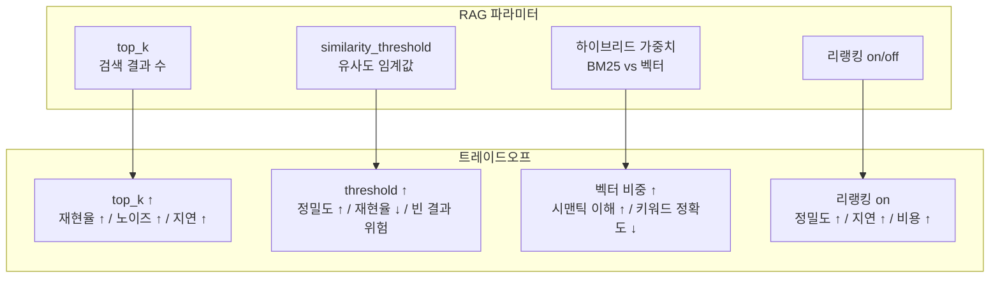

**top_k 결정 기준 (BoardRagConfig — LLM 전달 청크 수):**

| 상황 | 권장 top_k | 이유 |
|------|-----------|------|
| sLLM + 짧은 답변 (FAQ) | 3 | 컨텍스트 절약, 핵심 청크만 |
| sLLM + 종합 답변 (매뉴얼) | 5 | 여러 섹션 참조 필요 |
| 고성능 모델 + 종합 답변 | 7~10 | 넓은 컨텍스트 활용 가능 |

**similarity_threshold 결정 기준:**

| 상황 | 권장 threshold | 이유 |
|------|--------------|------|
| 정확한 답변 필수 (금융 규정 등) | 0.80 | 관련 없는 청크 혼입 방지 |
| 일반 지식 검색 | 0.70 | 균형 잡힌 기본값 |
| 탐색적 검색 (넓은 범위) | 0.60 | 재현율 우선 |

> **sLLM 환경 주의**: 위 기준은 고성능 임베딩 모델 기준이다. sLLM 임베딩은 벡터 공간 분별력이 낮아 관련 청크도 유사도가 낮게 측정되므로, 위 값을 그대로 적용하면 결과가 거의 반환되지 않는다. sLLM 환경의 시스템 기본값은 0.3이며, 위 표는 관리자가 고성능 모델 전환 시 참고하는 용도이다.

### 4.3 리랭킹 전략


| 항목 | 설명 |
|------|------|
| 입력 | 1차 검색 결과의 상위 `top_k × 2`개 청크 |
| 모델 | Cross-Encoder 리랭킹 모델 (LLM Orchestrator 경유) |
| 출력 | 재정렬 후 `rerank_top_n`개 반환 |
| 지연 | 청크 수에 비례하여 50~300ms 추가 |

> **sLLM 환경에서 리랭킹 기본 off인 이유**: Cross-Encoder 리랭킹은 각 (쿼리, 청크) 쌍을 개별 추론하므로 지연이 청크 수에 선형 비례한다. sLLM 환경에서는 추론 속도가 느려 사용자 체감 지연이 커진다. 대신 하이브리드 검색의 RRF 합산이 리랭킹 없이도 합리적인 정렬을 제공하므로, 리랭킹은 고성능 모델 환경에서만 기본 활성화한다.

### 4.4 게시판별 RAG on/off

```mermaid
flowchart TD
    Q["검색 쿼리 수신"] --> CHECK{"대상 게시판의<br/>BoardRagConfig.rag_enabled?"}
    CHECK -->|"true"| RAG["RAG 검색 파이프라인<br/>(하이브리드 + LLM)"]
    CHECK -->|"false"| LEGACY["문서 검색 파이프라인<br/>(BM25 단독)"]
    CHECK -->|"미설정<br/>(BoardRagConfig 없음)"| DEFAULT{"SearchConfig<br/>.rag_default_search_mode?"}
    DEFAULT -->|"hybrid/semantic"| RAG
    DEFAULT -->|"keyword"| LEGACY
```

| 게시판 유형 예시 | RAG 권장 | 이유 |
|---------------|---------|------|
| FAQ / 규정 게시판 | ON | 정확한 답변 청크가 필요 |
| 공지사항 | OFF | 키워드 검색으로 충분, LLM 호출 불필요 |
| 업무 매뉴얼 | ON | 절차/방법 질의에 RAG 답변이 유용 |
| 자유 게시판 | OFF | 비정형 콘텐츠, RAG 품질 낮음 |

---

## 5. 검색 Playground 설계

### 5.1 전체 흐름

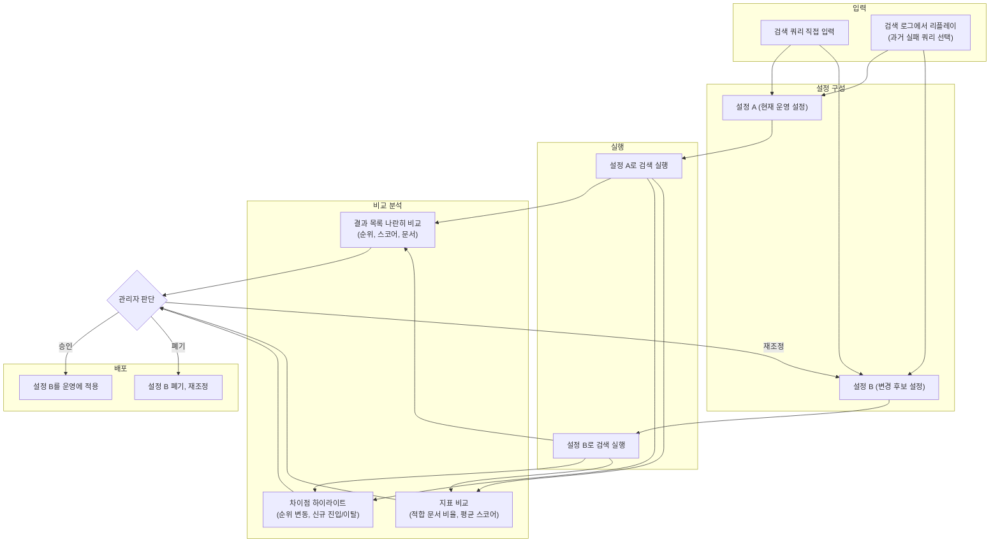

### 5.2 A/B 비교 설정 범위

| 비교 가능 항목 | 설정 A (기준) | 설정 B (변경안) |
|-------------|-------------|--------------|
| 동의어 세트 | 현재 운영 동의어 | 동의어 추가/삭제 후보 |
| 불용어 세트 | 현재 운영 불용어 | 불용어 변경 후보 |
| 필드 가중치 | 현재 가중치 | 조정된 가중치 |
| 부스팅 규칙 | 현재 규칙 | 변경 규칙 |
| RAG top_k / threshold | 현재 파라미터 | 조정 파라미터 |
| 하이브리드 가중치 | 현재 비율 | 조정 비율 |
| 리랭킹 on/off | 현재 상태 | 토글 |

> **Playground는 실운영 데이터로 실행한다**: 문서 검색(키워드)은 aicm-service가 ES `aicm_blocks`에 직접 쿼리한다. 시맨틱/하이브리드 검색은 retrieval-service API(`POST /search`)를 호출하여 실운영 Milvus/ES 인덱스에 대해 실행한다. 별도의 테스트 인덱스를 만들면 동기화 비용이 크고, 실운영과의 결과 차이가 생긴다. Playground 실행은 검색 설정만 임시로 오버라이드하여 실행하며, 실제 설정에는 영향을 주지 않는다.

### 5.3 검색 로그 리플레이


> **리플레이의 핵심 가치**: 검색 품질 개선의 가장 직접적인 방법은 "실패한 검색을 성공시키는 것"이다. 검색 로그에서 CTR 0%인 쿼리, 사용자가 "비관련"으로 피드백한 쿼리를 추출하여, 설정 변경이 이 쿼리들의 결과를 실제로 개선하는지 검증한다. 이 방식은 추상적인 지표보다 구체적인 개선 근거를 제공한다.

### 5.4 배포 전 검증 체크리스트

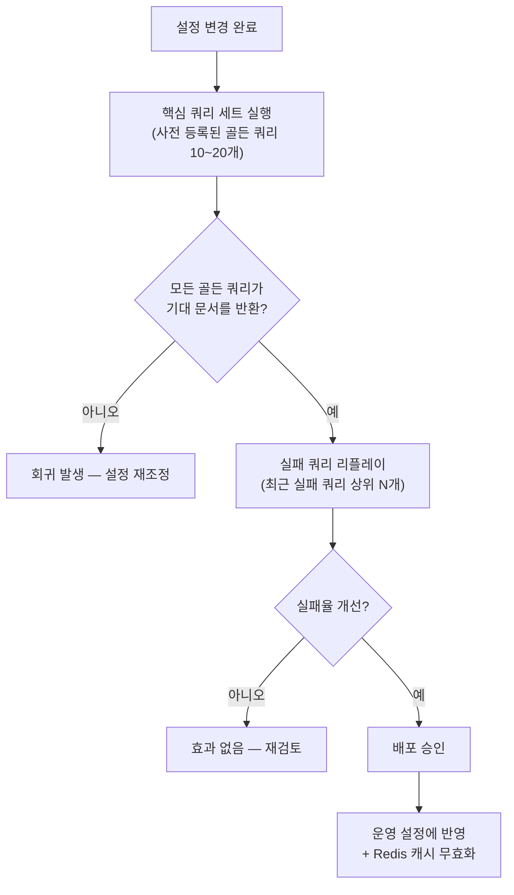

**골든 쿼리(Golden Query)**: 관리자가 사전 등록하는 검증용 쿼리-기대결과 쌍. 설정 변경 시 회귀(regression)를 감지하는 안전장치 역할.

| 골든 쿼리 예시 | 기대 결과 (document_id) | 용도 |
|-------------|----------------------|------|
| "계좌 개설 절차" | doc-001, doc-015 | 핵심 업무 문서 검색 보장 |
| "비밀번호 변경 방법" | doc-042 | FAQ 정확도 보장 |
| "대출 금리 비교" | doc-078, doc-079, doc-080 | 다중 결과 검증 |

---

## 6. 검색 품질 모니터링

### 6.1 핵심 지표 매트릭스

| 카테고리 | 지표 | 산출 방법 | 알림 조건 | 의미 |
|---------|------|---------|---------|------|
| **검색 기본** | CTR (Click-Through Rate) | 클릭 있는 검색 / 전체 검색 | < 30% (7일 이동평균) | 검색 결과의 전반적 유용성 |
| | 검색 실패율 (Zero-Result Rate) | 결과 0건 검색 / 전체 검색 | > 15% (일간) | 동의어/사전 부족 신호 |
| | 평균 결과 순위 (MRR) | 첫 클릭 문서의 역순위 평균 | < 0.3 (7일 이동평균) | 관련 문서가 상위에 나오는지 |
| **RAG 품질** | 평균 참조 청크 수 | RAG 응답에 사용된 청크 수 평균 | < 1.5 (일간) | 컨텍스트 부족 신호 |
| | 평균 유사도 스코어 | 검색된 청크의 평균 유사도 | < 0.65 (일간) | 임베딩 품질 또는 threshold 문제 |
| | 피드백 비율 | (관련 피드백) / (관련 + 비관련) | < 70% (7일 이동평균) | 사용자 체감 RAG 품질 |
| | RAG 폴백률 | RAG 결과 없어 키워드 검색으로 폴백한 비율 | > 20% (일간) | RAG 파라미터 또는 데이터 커버리지 문제 |
| **임베딩** | 임베딩 대기 큐 깊이 | BullMQ embedding 큐 대기 작업 수 | > 1000 | 임베딩 파이프라인 병목 |
| | 평균 임베딩 처리 시간 | 청크 1건 임베딩 소요 시간 | > 5s | 모델 서버 성능 저하 |
| | 임베딩 실패율 | 실패 작업 / 전체 작업 | > 5% (일간) | 모델 서버 오류 |
| | 스테일 청크 비율 | content_hash 변경 후 미재임베딩 청크 비율 | > 10% | 재임베딩 파이프라인 지연 |

### 6.2 모니터링 데이터 수집

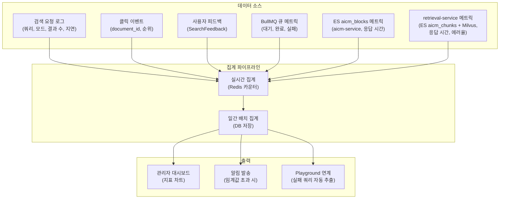

> **실시간 vs 배치 집계 분리**: CTR, 검색 실패율 등은 Redis 카운터로 실시간 근사치를 제공하고, 정밀한 지표는 일간 배치로 DB에 집계한다. 실시간 근사치는 대시보드의 즉각적 피드백용이고, 배치 집계는 트렌드 분석과 알림 판단의 근거가 된다.

### 6.3 검색 실패 키워드 분석

| 분석 항목 | 설명 | 활용 |
|---------|------|------|
| 빈출 실패 쿼리 TOP 20 | 결과 0건이 가장 많은 쿼리 | 동의어/사전 추가 후보 |
| 실패 패턴 군집 | 유사한 실패 쿼리 그룹핑 | 누락 콘텐츠 영역 식별 |
| 클릭 없는 상위 쿼리 TOP 20 | 결과는 있으나 클릭 0인 쿼리 | 부스팅/필드 가중치 조정 후보 |

---

## 7. 사용자 튜닝

### 7.1 개인 검색 선호 설정

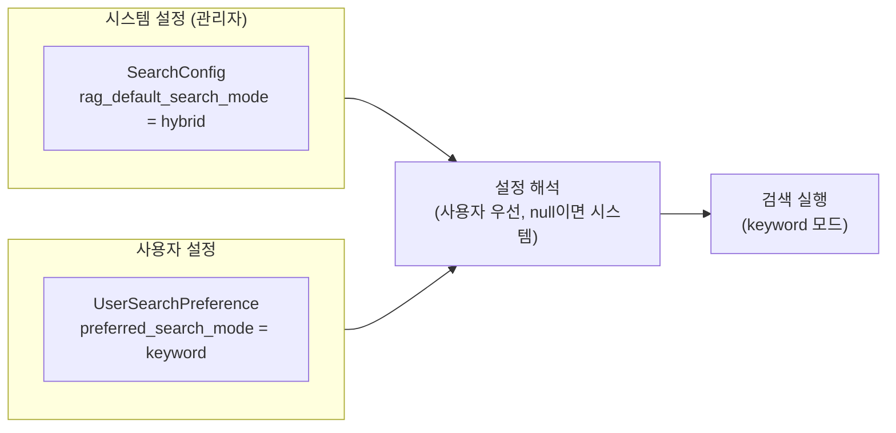

**설정 우선순위:**

| 우선순위 | 소스 | 예시 |
|---------|------|------|
| 1 (최우선) | 검색 요청 파라미터 | URL 쿼리 파라미터로 모드 지정 |
| 2 | 필터 프리셋 (선택 시) | 프리셋에 지정된 검색 모드 |
| 3 | 사용자 선호 | UserSearchPreference |
| 4 (기본) | 시스템 설정 | SearchConfig.rag_default_search_mode |

> **사용자 설정이 시스템 설정을 "오버라이드"하지 "덮어쓰기"하지 않는다**: 사용자가 `preferred_search_mode = null`로 설정하면 시스템 기본값을 따른다. 관리자가 시스템 기본 모드를 변경하면, 명시적으로 설정하지 않은 모든 사용자에게 자동 반영된다. 관리자는 전역 베이스라인을, 사용자는 개인 예외를 관리하는 구조이다.

### 7.2 필터 프리셋 저장

| 기능 | 설명 |
|------|------|
| 프리셋 생성 | 현재 검색 필터 조합을 이름 부여하여 저장 |
| 프리셋 적용 | 저장된 프리셋을 한 클릭으로 적용 |
| 프리셋 수정/삭제 | 기존 프리셋 관리 |
| 최대 개수 | 사용자당 20개 (과도한 프리셋 방지) |

### 7.3 검색 피드백

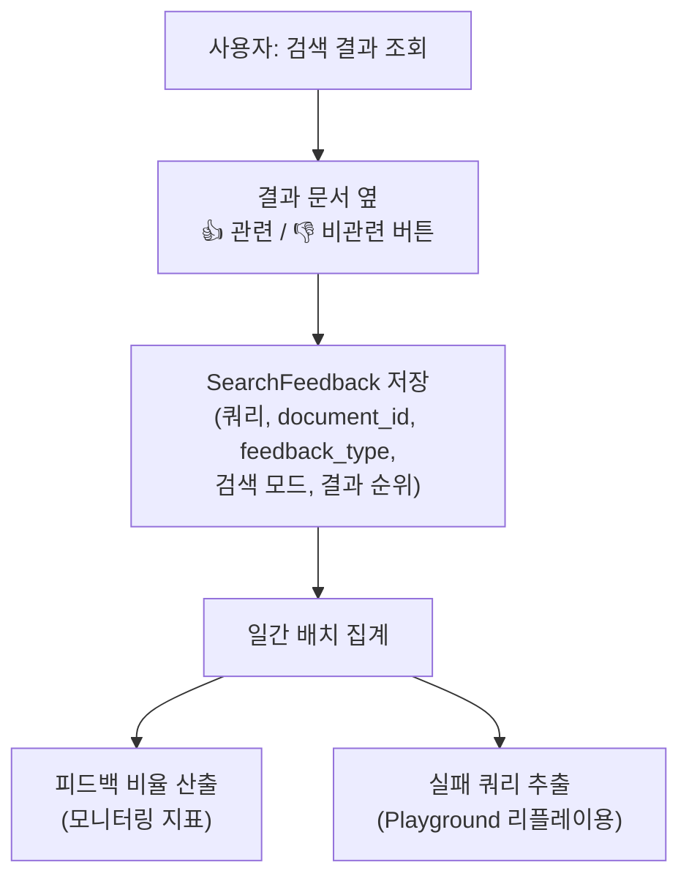

> **피드백이 직접 검색 결과에 영향을 주지 않는 이유**: 피드백을 실시간으로 검색 스코어에 반영하면 소수 사용자의 주관적 판단이 전체 검색 품질을 훼손할 수 있다. 피드백은 모니터링 지표로 집계되어 관리자의 튜닝 판단 근거로 사용되며, 검색 스코어에 직접 개입하지 않는다. 향후 피드백 데이터가 충분히 축적되면 ML 기반 재학습 파이프라인 도입을 검토할 수 있다.

---

## 8. 설정 반영 캐시 전략

검색 설정은 매 검색 요청마다 DB를 조회하지 않고 Redis 캐시를 사용한다.

| 항목 | Redis 키 패턴 | TTL | 무효화 시점 |
|------|-------------|-----|-----------|
| 키워드 검색 설정 | `{tenant_id}:cache:keyword_search:config` | 30m | 설정 변경 확정 시 즉시 무효화 |
| RAG 검색 설정 | `{tenant_id}:cache:rag_search:config` | 30m | 설정 변경 확정 시 즉시 무효화 |
| 동의어 목록 | `{tenant_id}:cache:search:synonyms` | 30m | 동의어 변경 배포 시 |
| 불용어 목록 | `{tenant_id}:cache:search:stopwords` | 30m | 불용어 변경 배포 시 |
| 부스팅 규칙 | `{tenant_id}:cache:search:boost` | 10m | 규칙 변경 시 (시한부 규칙은 짧은 TTL) |
| 게시판별 RAG 설정 | `{tenant_id}:cache:rag_search:board:{board_id}` | 30m | RAG 설정 변경 시 |
| 파싱 설정 | — (캐시 없음) | — | 요청 시 `chunking_config` 파라미터로 동봉 |

> **부스팅 규칙 TTL이 짧은 이유**: 시한부 부스팅의 시작/종료가 분 단위로 정확할 필요는 없지만, 30분 TTL이면 종료 시간 이후에도 최대 30분간 부스팅이 유지될 수 있다. 10분 TTL로 지연을 허용 범위 내로 유지한다.

---

## 관련 문서

| 문서 | 관계 |
|------|------|
| [검색/RAG 도메인 README](./README.md) | 이 문서의 상위 문서, 파이프라인 조감도 |
| [검색 전략](./03-search.md) | 검색 파이프라인 동작 흐름 — 이 문서의 튜닝 대상 |
| [청킹 전략](./02-chunking.md) | 청킹 파라미터(chunk_max_tokens, overlap)의 원래 정의 |
| [파싱 전략](./01-parsing.md) | 문서 품질 Tier — 튜닝 효과의 상한을 결정하는 입력 품질 |
| [데이터 아키텍처 — RDB 엔티티](../../../02-architecture/data/aicm/rdb.md) | SearchConfig / ParsingConfig ERD 원본 (관계만 정의, 필드는 이 문서) |
| [데이터 아키텍처 — Redis](../../../02-architecture/data/aicm/redis.md) | Redis 캐시 키 패턴 (검색 설정 캐시) |
| [데이터 아키텍처 — aicm ES](../../../02-architecture/data/aicm/es.md) | ES nori 분석기 설정, 인덱스 매핑 |
| [비동기 처리 아키텍처](../../../02-architecture/05-async-event-architecture.md) | BullMQ 임베딩 큐, 검색 설정 배포 이벤트 |
| [외부 서비스 연동](../../../02-architecture/06-external-integration.md) | LLM Orchestrator 리랭킹 모델 연동 |
