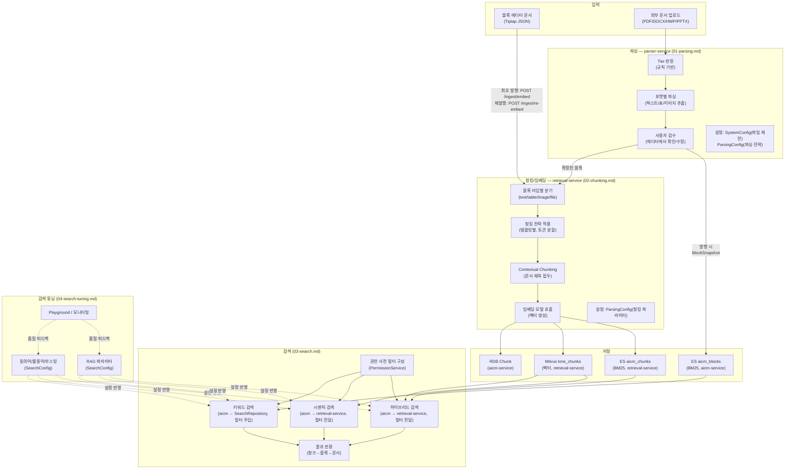

# 검색/RAG 파이프라인 흐름

> **문서 상태**
> | 항목 | 값 |
> |------|-----|
> | 상태 | `draft` |
> | 검수 | `unreviewed` |
> | 작성일 | 2026-03-17 |
> | 최종 수정 | 2026-04-06 |

## 범위

문서 파싱부터 검색 결과 반환까지, 검색/RAG 파이프라인의 전체 전략을 다룬다. 엔티티 정의·스키마·메커니즘은 [데이터 아키텍처](../../../02-architecture/data/README.md)에서 정의하며, 이 문서군은 **"왜 이렇게 하는가"와 "어떤 흐름으로 동작하는가"**에 집중한다.

## 핵심 설계 전제

아래 3가지 전제가 모든 하위 문서의 설계 판단에 일관되게 관통한다.

### 1. sLLM 환경 전제

- 온프레미스에서 성능 제한적인 sLLM(vLLM 등) 사용이 기본 시나리오
- LLM 호출은 비용(시간/자원)이 크므로, **규칙 기반 처리를 우선**하고 LLM은 규칙으로 해결 불가한 영역에만 보조적으로 사용
- SaaS 환경에서는 고성능 모델 사용 가능하므로, LLM Orchestrator의 프로바이더 분기로 품질 차이를 흡수

### 2. 문서 품질 기준선 (Tier 시스템)

모든 외부 문서를 무조건 지원하는 것이 아니라, **지원 등급을 나누어 기대치를 관리**한다.

| Tier | 수준 | 대상 예시 | 처리 |
|------|------|----------|------|
| Tier 1 | 완전 지원 | 구조화된 PDF, DOCX, HWPX — 제목/본문 구분 명확, 단순 표 | 자동 파싱, 사용자 검수 권장 |
| Tier 2 | 부분 지원 | 복잡한 레이아웃(다단, 사이드바), 대형 표, 이미지 중심 문서 | 자동 파싱 + **사용자 검수 필수**, 경고 표시 |
| Tier 3 | 미지원 | 스캔 이미지 PDF, 손글씨, 극복잡 중첩 레이아웃 | 업로드 거부 또는 블록 에디터 직접 입력 안내 |

### 3. 사용자 검수 필수 원칙

- AI 자동 생성 결과(파싱, 캡션, 표 설명 등)는 항상 **"생성 → 사용자 확인/수정 → 확정"** 흐름을 따른다
- 자동 결과를 곧바로 임베딩/검색에 반영하지 않는다 — 반드시 사용자 확정 후 승인 → 발행 → 임베딩 순서

### 4. 파이프라인 제외 대상

- **community 타입 게시판**(`board_type = community`)의 글은 청킹/임베딩 파이프라인 대상에서 **제외**된다. RAG 검색에 반영되지 않으며, ES `aicm_blocks` 인덱싱만 수행하여 키워드 검색은 지원한다. — [FD-COM](../../features/FD-COM-커뮤니티.md) §1, [01-single-approval S5](../approval-permission/01-single-approval.md) 참조

---

## 파이프라인 조감도

## 문서 구성

| 순서 | 문서 | 범위 | 기능정의서 참조 |
|------|------|------|---------------|
| 0 | [파이프라인 다이어그램](./00-pipeline-diagrams.md) | 업로드→임베딩 엔드투엔드 흐름 시각화 (컨테이너 다이어그램, 시퀀스 다이어그램) | — |
| 1 | [파싱 전략](./01-parsing.md) | 외부 문서 파싱, Tier 판정, 포맷별 전략, 사용자 검수 | [FD-SCH](../../features/FD-SCH-검색.md) §2.3, §2.5 |
| 2 | [청킹 전략](./02-chunking.md) | Block→Chunk 분할, 템플릿별 청킹, 임베딩 결정, 재임베딩 | [FD-SCH](../../features/FD-SCH-검색.md) §2.3, §2.4 / [FD-EMB](../../features/FD-EMB-임베딩파이프라인.md) |
| 3 | [검색 전략](./03-search.md) | 문서검색/시맨틱/하이브리드 검색, 권한, 결과 반환 | [FD-SCH](../../features/FD-SCH-검색.md) §2.1, §2.2 |
| 4 | [검색 튜닝 전략](./04-search-tuning.md) | 튜닝 엔티티, Playground, 모니터링 | [FD-SCH](../../features/FD-SCH-검색.md) §2.6 |

### 관련 유즈케이스

| 유즈케이스 | 흐름도 관련 범위 |
|-----------|----------------|
| [UC-SCH-01 키워드 검색](../../usecases/user/UC-SCH-검색.md) | 03-search: 문서 검색 모드 |
| [UC-SCH-02 AI 답변 검색](../../usecases/user/UC-SCH-검색.md) | 03-search: 시맨틱/하이브리드 검색 |
| [UC-SCH-03 검색 필터 저장](../../usecases/user/UC-SCH-검색.md) | 04-search-tuning: 사용자 선호 |
| [UC-ADM-07 검색 설정 관리](../../usecases/admin/UC-ADM-검색파이프라인.md) | 04-search-tuning: SearchConfig |
| [UC-ADM-09 임베딩 모니터링](../../usecases/admin/UC-ADM-검색파이프라인.md) | 02-chunking: 임베딩 파이프라인 |

읽는 순서: 전체 흐름 파악을 위해 0(다이어그램)을 먼저 본 뒤, 파이프라인 순서대로 1→2→3→4를 권장한다. 검색 튜닝(4)은 검색(3)의 파라미터를 조정하는 위치이므로, 검색 전략을 먼저 이해한 후 읽는다.

> **파이프라인 설정 엔티티 참조**: 파이프라인 단계별 설정은 아래 엔티티가 관리한다.
> - `SystemConfig` — 파일 크기·페이지 수 제한 등 시스템 수준 제약 (01-parsing)
> - `ParsingConfig` — 파싱 전략(프로바이더 선택), 청킹 파라미터(max_tokens, overlap, 분할 전략) (01-parsing, 02-chunking)
> - `SearchConfig` — 필드 가중치(kw_*_weight 컬럼), nori 분석기, 동의어/불용어, 부스팅, 하이브리드 가중치, top-K, threshold, 검색 모드, 리랭킹 (03-search, 04-search-tuning)
> - `BoardRagConfig` — 게시판별 RAG 설정 오버라이드 (04-search-tuning)

---

## 관련 시스템 레벨 문서

| 문서 | 이 도메인과의 관계 |
|------|------------------|
| [데이터 아키텍처](../../../02-architecture/data/README.md) | Block/Chunk/ES/Milvus 엔티티·스키마 정의, 청킹 파이프라인 개요, 검색 결과 반환 메커니즘 |
| [비동기 처리 아키텍처](../../../02-architecture/05-async-event-architecture.md) | BullMQ 큐 설계, 임베딩 파이프라인 이벤트 흐름 |
| [외부 서비스 연동](../../../02-architecture/06-external-integration.md) | parser-service·retrieval-service·LLM Orchestrator 연동 인터페이스 |
| [인증/인가 아키텍처](../../../02-architecture/03-auth-architecture.md) | 검색 권한 필터 (DocumentRestriction) |

---

## 기존 문서와의 경계 원칙

| 시스템 레벨 문서 | 이미 다루는 것 | 이 도메인 문서에서 하지 않는 것 |
|---|---|---|
| `02-architecture/data/` 폴더 | 엔티티 필드, DDL, ES 매핑 JSON, Milvus HNSW 설정, 재임베딩 판단 SQL | 스키마·매핑 재기술, SQL 재기술 |
| `05-async-event-architecture.md` | BullMQ 큐 목록, 이벤트 시퀀스 다이어그램 | 큐 설계 재기술 |
| `06-external-integration.md` | parser-service·retrieval-service 요청/응답 인터페이스 | 연동 API 구조 재기술 |

이 도메인 문서는 위 문서들이 **"무엇이 있는지"**를 정의한 것에 대해, **"어떤 전략으로, 왜 이렇게 하는지"**를 sLLM/온프레미스 제약 맥락에서 기술한다.
