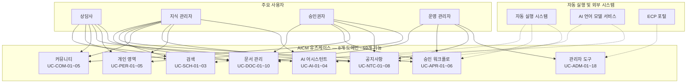

# AICM (KMS) 유즈케이스 문서

## 문서 정보

| 항목 | 내용 |
|------|------|
| 제품명 | AICM (AI Content Management — 지식 관리 시스템) |
| 문서 버전 | 1.1 |
| 작성일 | 2026-03-27 |

---

## 1. 시스템 개요

AICM은 컨택센터 상담사와 지식 관리자를 위한 AI 기반 지식 관리 시스템이다. 문서 작성·승인·검색·AI 요약 등을 통해 정확하고 일관된 고객 응대를 지원한다.

---

## 2. 사용자 역할 정의

> 이 시스템을 사용하는 사람들은 역할에 따라 접근할 수 있는 기능이 다릅니다. 아래는 각 역할이 어떤 일을 하는지 설명합니다.

### 2.1 주요 사용자 역할

| 역할 | 설명 |
|------|------|
| **상담사** | 지식 문서를 검색하고 열람하여 고객 응대에 활용하는 실무자입니다. 편집이 허용된 게시판에서는 직접 문서를 작성할 수도 있습니다. |
| **지식 관리자** | 문서를 작성·편집·관리하고, 작성한 문서의 승인 요청을 수행하는 콘텐츠 담당자입니다. 게시판별로 편집 권한을 갖고 있습니다. |
| **승인권자** | 문서의 승인 또는 반려를 처리하는 검토자입니다. 게시판별로 승인 권한을 갖고 있으며, 팀장이나 QA 담당자 등이 이 역할을 맡습니다. |
| **운영 담당(페르소나)** | 업무상 관리 화면을 주로 쓰는 사용자군을 가리키는 서술용 표현이다. **실제 인가는 `AdminPermission` 보유 여부**로만 판단하며, 외부 계정 등급(`system`/`admin`/`normal`)과 대응하지 않는다([FD-ACL](../features/FD-ACL-권한체계.md) §2). |
| **인프라 담당(페르소나)** | 배포·서버 등 인프라는 AICM 앱 RBAC 바깥(환경변수·운영 조직)에서 다룬다. |

### 2.2 보조 역할 (시스템이 자동으로 수행하는 것들)

| 역할 | 설명 |
|------|------|
| **자동 실행 시스템** | 예약 배포, AI 검색용 데이터 변환 처리, 문서 유효기간 만료 확인, 통계 집계 갱신 등 사람의 개입 없이 자동으로 실행되는 작업들을 담당합니다. |
| **AI 언어 모델 서비스** | AI 요약, 글쓰기 개선, AI가 문서를 참고하여 답변을 생성하는 기능 등 AI 관련 처리를 담당하는 외부 서비스입니다. |
| **ECP 포털** | 클라우드 환경에서 사용자 인증(로그인)과 조직 정보를 제공하는 외부 시스템입니다. |

---

## 3. 유즈케이스 개요 다이어그램

---

## 4. 유즈케이스 매트릭스

> 아래 표는 각 기능(유즈케이스)별로 어떤 역할의 사용자가 참여하는지를 나타냅니다.
> - ● = 주로 사용하는 역할
> - △ = 편집 권한이 있는 게시판에 한해 참여 가능

| ID | 유즈케이스명 | 상담사 | 지식관리자 | 승인권자 | 운영관리자 | 관련 FD | 상세 문서 |
|----|-------------|:------:|:--------:|:-------:|:--------:|----------|----------|
| UC-DOC-01 | 문서 작성 | △ | ● | | | FD-DOC | [문서 관리](user/UC-DOC-문서관리.md) |
| UC-DOC-02 | 문서 열람 | ● | ● | ● | ● | FD-DOC | [문서 관리](user/UC-DOC-문서관리.md) |
| UC-DOC-03 | 문서 수정 | △ | ● | | | FD-DOC | [문서 관리](user/UC-DOC-문서관리.md) |
| UC-DOC-04 | 문서 삭제 | | ● | | ● | FD-DOC | [문서 관리](user/UC-DOC-문서관리.md) |
| UC-DOC-05 | 임시 저장 문서 관리 | △ | ● | | | FD-DOC | [문서 관리](user/UC-DOC-문서관리.md) |
| UC-DOC-06 | 문서 버전 비교 | | ● | ● | ● | FD-DOC, FD-APR | [문서 관리](user/UC-DOC-문서관리.md) |
| UC-DOC-07 | 문서 주소 / 특정 위치 링크 복사 | ● | ● | ● | | FD-DOC | [문서 관리](user/UC-DOC-문서관리.md) |
| UC-DOC-08 | 문서 내보내기 | ● | ● | | | FD-EXP | [문서 관리](user/UC-DOC-문서관리.md) |
| UC-DOC-09 | 긴급 회수 (즉시 비공개 전환) | | ● | ● | ● | FD-DOC | [문서 관리](user/UC-DOC-문서관리.md) |
| UC-DOC-10 | 문서 유효기간 만료 처리 | | | | | FD-DOC | [문서 관리](user/UC-DOC-문서관리.md) |
| UC-APR-01 | 승인 요청 | | ● | | | FD-APR | [승인 워크플로](user/UC-APR-승인워크플로.md) |
| UC-APR-02 | 승인/반려 처리 | | | ● | ● | FD-APR | [승인 워크플로](user/UC-APR-승인워크플로.md) |
| UC-APR-03 | 승인 요청 철회 | | ● | | | FD-APR | [승인 워크플로](user/UC-APR-승인워크플로.md) |
| UC-APR-04 | 긴급 발행 (승인 없이 바로 게시) | | | | ● | FD-APR | [승인 워크플로](user/UC-APR-승인워크플로.md) |
| UC-APR-05 | 예약 배포 설정 | | | ● | ● | FD-APR | [승인 워크플로](user/UC-APR-승인워크플로.md) |
| UC-APR-06 | 승인 위임 | | | ● | ● | FD-APR | [승인 워크플로](user/UC-APR-승인워크플로.md) |
| UC-SCH-01 | 키워드 검색 | ● | ● | ● | | FD-SCH | [검색](user/UC-SCH-검색.md) |
| UC-SCH-02 | AI 답변 검색 | ● | ● | ● | | FD-SCH | [검색](user/UC-SCH-검색.md) |
| UC-SCH-03 | 검색 필터 저장/관리 | ● | ● | | | FD-SCH | [검색](user/UC-SCH-검색.md) |
| UC-NTC-01 | 공지사항 열람 | ● | ● | ● | ● | FD-NTC | [공지사항](user/UC-NTC-공지사항.md) |
| UC-NTC-02 | 공지사항 작성 | | ● | | ● | FD-NTC | [공지사항](user/UC-NTC-공지사항.md) |
| UC-NTC-03 | 공지사항 수정/삭제 | | ● | | ● | FD-NTC | [공지사항](user/UC-NTC-공지사항.md) |
| UC-NTC-04 | 문서 상단 고정 | | | ● | ● | FD-NTC | [공지사항](user/UC-NTC-공지사항.md) |
| UC-NTC-05 | 읽음 확인 | ● | ● | ● | ● | FD-NTC | [공지사항](user/UC-NTC-공지사항.md) |
| UC-NTC-06 | 공지 읽음 현황 조회 | | | | ● | FD-NTC | [공지사항](user/UC-NTC-공지사항.md) |
| UC-NTC-07 | 크로스보드 공지 배너 열람 | ● | ● | ● | ● | FD-NTC | [공지사항](user/UC-NTC-공지사항.md) |
| UC-NTC-08 | 크로스보드 공지 배너 설정 | | ● | | ● | FD-NTC | [공지사항](user/UC-NTC-공지사항.md) |
| UC-COM-01 | 댓글 작성/대댓글 | ● | ● | ● | | FD-COM | [커뮤니티](user/UC-COM-커뮤니티.md) |
| UC-COM-02 | 문서 좋아요 | ● | ● | ● | | FD-COM | [커뮤니티](user/UC-COM-커뮤니티.md) |
| UC-COM-03 | 문서 신고 | ● | ● | | | FD-COM | [커뮤니티](user/UC-COM-커뮤니티.md) |
| UC-COM-04 | 북마크 관리 | ● | ● | ● | | FD-COM | [커뮤니티](user/UC-COM-커뮤니티.md) |
| UC-COM-05 | 자유게시판 글 작성 | ● | ● | ● | | FD-COM | [커뮤니티](user/UC-COM-커뮤니티.md) |
| UC-PER-01 | 마이페이지 조회 | ● | ● | ● | | FD-COM | [개인 영역](user/UC-PER-개인영역.md) |
| UC-PER-02 | 알림 확인/설정 | ● | ● | ● | ● | FD-NTF | [개인 영역](user/UC-PER-개인영역.md) |
| UC-PER-03 | 게시판 구독 | ● | ● | ● | | FD-AGG | [개인 영역](user/UC-PER-개인영역.md) |
| UC-PER-04 | AI 설정 확인 | ● | ● | | | FD-AI | [개인 영역](user/UC-PER-개인영역.md) |
| UC-PER-05 | 홈 대시보드 조회 | ● | ● | ● | | FD-AGG | [개인 영역](user/UC-PER-개인영역.md) |
| UC-AI-01 | AI 문서 요약 | ● | ● | | | FD-AI | [AI 어시스턴트](user/UC-AI-AI어시스턴트.md) |
| UC-AI-02 | AI 글쓰기 개선 | △ | ● | | | FD-AI | [AI 어시스턴트](user/UC-AI-AI어시스턴트.md) |
| UC-AI-03 | AI 설정 관리 (관리자) | | | | ● | FD-AI | [AI 어시스턴트](user/UC-AI-AI어시스턴트.md) |
| UC-AI-04 | AI 태그 추천 | △ | ● | | | FD-AI | [AI 어시스턴트](user/UC-AI-AI어시스턴트.md) |
| UC-ADM-01 | 게시판 구조 관리 | | | | ● | FD-DOC | [콘텐츠 인프라](admin/UC-ADM-콘텐츠인프라.md) |
| UC-ADM-02 | 문서 양식 관리 | | | | ● | FD-DOC | [콘텐츠 인프라](admin/UC-ADM-콘텐츠인프라.md) |
| UC-ADM-03 | 승인 정책 관리 | | | | ● | FD-APR | [승인 정책](admin/UC-ADM-승인정책.md) |
| UC-ADM-04 | 공통 컨텐츠 관리 | | | | ● | FD-DOC | [콘텐츠 인프라](admin/UC-ADM-콘텐츠인프라.md) |
| UC-ADM-05 | 태그 관리 | | | | ● | FD-DOC | [콘텐츠 인프라](admin/UC-ADM-콘텐츠인프라.md) |
| UC-ADM-06 | 그룹 관리 | | | | ● | FD-ACL | [조직/접근](admin/UC-ADM-조직접근.md) |
| UC-ADM-07 | 검색 설정 관리 | | | | ● | FD-SCH | [검색/파이프라인](admin/UC-ADM-검색파이프라인.md) |
| UC-ADM-08 | 감사 로그 조회/내보내기 | | | | ● | FD-AUD | [시스템 운영](admin/UC-ADM-시스템운영.md) |
| UC-ADM-09 | AI 검색 데이터 변환 현황 모니터링 | | | | ● | FD-EMB | [검색/파이프라인](admin/UC-ADM-검색파이프라인.md) |
| UC-ADM-10 | AI 설정 관리 | | | | ● | FD-AI | [검색/파이프라인](admin/UC-ADM-검색파이프라인.md) |
| UC-ADM-11 | 통계 대시보드 조회 | | | | ● | FD-AGG | [시스템 운영](admin/UC-ADM-시스템운영.md) |
| UC-ADM-12 | 신고 처리 | | | | ● | FD-COM | [시스템 운영](admin/UC-ADM-시스템운영.md) |
| UC-ADM-13 | 문서/블록 접근 제한 설정 | | ● | ● | ● | FD-ACL | [시스템 운영](admin/UC-ADM-시스템운영.md) |
| UC-ADM-14 | 역할/권한 관리 | | | | ● | FD-ACL | [조직/접근](admin/UC-ADM-조직접근.md) |
| UC-ADM-15 | 시스템 운영 설정 관리 | | | | ● | FD-SYS | [시스템 운영](admin/UC-ADM-시스템운영.md) |
| UC-ADM-16 | 권한 출처 조회 | | | | ● | FD-ACL | [조직/접근](admin/UC-ADM-조직접근.md) |
| UC-ADM-17 | 위젯 카탈로그 관리 | | | | ● | FD-AGG | [시스템 운영](admin/UC-ADM-시스템운영.md) |
| UC-ADM-18 | 시스템 모니터링 | | | | ● | FD-MON | [시스템 모니터링](admin/UC-ADM-시스템모니터링.md) |

> **관련 FD 컬럼 안내**: FD 코드만 표기하여 파일 경로·섹션 번호 변경에 영향받지 않도록 했다. UC ↔ FD 간 상세 매핑은 [기능정의서 인덱스](../features/README.md)의 교차 참조 테이블을 참조한다.

---

## 5. 도메인별 유즈케이스 요약

### 5.1 문서 관리 (UC-DOC)

> 문서의 전체 생명주기 — 작성부터 열람, 수정, 삭제, 내보내기, 긴급 회수까지를 다룬다.

| UC ID | 유즈케이스명 | 요약 |
|-------|------------|------|
| UC-DOC-01 | 문서 작성 | 지식 관리자가 블록 편집기로 새 문서를 작성하고 양식·태그를 지정한다 |
| UC-DOC-02 | 문서 열람 | 게시된 문서를 검색/링크를 통해 열람하고, 공통 컨텐츠·AI 요약 등 부가 정보를 확인한다 |
| UC-DOC-03 | 문서 수정 | 게시된 문서의 새 버전을 생성하여 수정하고, 변경분만 AI 검색에 재반영한다 |
| UC-DOC-04 | 문서 삭제 | 문서를 삭제 표시(소프트 삭제)하여 검색에서 제외하고, 필요 시 복구한다 |
| UC-DOC-05 | 임시 저장 문서 관리 | 작성 중인 임시 저장 문서 목록을 조회하고, 이어 작성하거나 삭제한다 |
| UC-DOC-06 | 문서 버전 비교 | 두 버전을 나란히 비교하여 블록 단위 추가/삭제/수정 차이를 시각적으로 확인한다 |
| UC-DOC-07 | 문서 주소 / 링크 복사 | 문서 또는 특정 블록의 웹 주소를 클립보드에 복사하여 공유한다 |
| UC-DOC-08 | 문서 내보내기 | 게시된 문서를 PDF, Word, HTML, Markdown 형식으로 변환하여 다운로드한다 |
| UC-DOC-09 | 긴급 회수 | 오류·규정 위반 문서를 즉시 비공개 처리하여 검색에서 숨긴다 |
| UC-DOC-10 | 문서 유효기간 만료 처리 | 만료일이 지난 문서를 자동으로 일시 중단하고, 담당자에게 갱신/삭제를 안내한다 |

> 상세: [UC-DOC-문서관리.md](user/UC-DOC-문서관리.md)

### 5.2 승인 워크플로 (UC-APR)

> 문서가 게시되기 전에 거치는 승인 절차 — 요청, 검토, 철회, 긴급 발행, 예약 배포를 포함한다.

| UC ID | 유즈케이스명 | 요약 |
|-------|------------|------|
| UC-APR-01 | 승인 요청 | 지식 관리자가 작성 완료된 문서의 승인을 요청하고 참조자를 지정한다 |
| UC-APR-02 | 승인/반려 처리 | 승인권자가 변경사항을 검토한 뒤 승인(→ 게시) 또는 반려(→ 작성 중 복귀)한다 |
| UC-APR-03 | 승인 요청 철회 | 작성자가 진행 중인 승인 요청을 취소하고 문서를 다시 수정한다 |
| UC-APR-04 | 긴급 발행 | 운영 관리자가 승인 절차를 건너뛰고 문서를 즉시 게시한다 (사유 필수) |
| UC-APR-05 | 예약 배포 설정 | 승인 완료 시 게시 시점을 예약하여 지정 날짜에 자동 게시한다 |
| UC-APR-06 | 승인 위임 | 승인자가 부재 시 다른 사용자에게 승인 권한을 고정 기간 위임한다 |

> 상세: [UC-APR-승인워크플로.md](user/UC-APR-승인워크플로.md)

### 5.3 검색 (UC-SCH)

> 키워드 기반 전통 검색과 AI가 답변을 생성하는 RAG 검색, 그리고 검색 필터 관리를 다룬다.

| UC ID | 유즈케이스명 | 요약 |
|-------|------------|------|
| UC-SCH-01 | 키워드 검색 | 키워드로 문서를 검색하고, 자동완성·오타 교정·필터로 결과를 좁힌다 |
| UC-SCH-02 | AI 답변 검색 | 자연어 질문에 대해 AI가 관련 문서를 참고하여 출처와 함께 답변을 생성한다 |
| UC-SCH-03 | 검색 필터 저장/관리 | 자주 사용하는 검색 조건 조합을 저장하고 재사용한다 |

> 상세: [UC-SCH-검색.md](user/UC-SCH-검색.md)

### 5.4 커뮤니티 (UC-COM)

> 문서에 대한 사용자 간 소통 — 댓글, 좋아요, 신고, 북마크, 자유게시판 글 작성을 포함한다.

| UC ID | 유즈케이스명 | 요약 |
|-------|------------|------|
| UC-COM-01 | 댓글 작성 / 대댓글 | 게시된 문서에 댓글이나 답글을 작성하고, 작성자에게 알림을 발송한다 |
| UC-COM-02 | 문서 좋아요 | 문서에 좋아요를 누르거나 취소하여 인기 순위에 반영한다 |
| UC-COM-03 | 문서 신고 | 부적절한 문서나 댓글을 사유와 함께 신고한다 |
| UC-COM-04 | 북마크 관리 | 문서를 개인 북마크 폴더에 저장하고 관리한다 |
| UC-COM-05 | 자유게시판 글 작성 | 승인 없이 자유게시판에 글을 올려 팁 공유·질문 등을 한다 |

> 상세: [UC-COM-커뮤니티.md](user/UC-COM-커뮤니티.md)

### 5.5 개인 영역 (UC-PER)

> 사용자 개인의 활동 현황, 알림, 구독, AI 설정, 홈 대시보드를 관리한다.

| UC ID | 유즈케이스명 | 요약 |
|-------|------------|------|
| UC-PER-01 | 마이페이지 조회 | 내 임시 저장, 작성 문서, 승인 대기, 북마크, 좋아요, 열람 이력 등을 한눈에 확인한다 |
| UC-PER-02 | 알림 확인/설정 | 댓글·승인·배포·만료 등 알림을 확인하고, 유형별 수신 여부를 설정한다 |
| UC-PER-03 | 게시판 구독 | 관심 게시판을 구독하여 새 문서 게시 시 알림을 받는다 |
| UC-PER-04 | AI 설정 확인 | 현재 적용 중인 AI 설정을 확인하고, 개인 선호를 조정한다 |
| UC-PER-05 | 홈 대시보드 조회 | 로그인 후 홈 화면에서 임시 저장·승인 대기·인기 문서·구독 새 글 등을 확인한다 |

> 상세: [UC-PER-개인영역.md](user/UC-PER-개인영역.md)

### 5.6 AI 어시스턴트 (UC-AI)

> AI를 활용한 문서 요약, 글쓰기 개선, 태그 추천, AI 설정 관리 기능을 다룬다.

| UC ID | 유즈케이스명 | 요약 |
|-------|------------|------|
| UC-AI-01 | AI 문서 요약 | 게시된 문서를 한줄/핵심 포인트/섹션별 등 방식으로 AI가 요약한다 |
| UC-AI-02 | AI 글쓰기 개선 | 편집 중인 블록을 AI가 문장 다듬기·톤 변경·간결화·상세화·번역 등으로 개선한다 |
| UC-AI-03 | AI 설정 관리 | 운영 관리자가 AI 기능별 지시문(프롬프트)을 편집하고 테스트한다 |
| UC-AI-04 | AI 태그 추천 | 문서 편집 중 AI가 기존 태그 풀에서 적합한 태그를 추천하고, 사용자가 선택하여 부착한다 |

> 상세: [UC-AI-AI어시스턴트.md](user/UC-AI-AI어시스턴트.md)

### 5.7 공지사항 (UC-NTC)

> 조직 전체에 전달해야 하는 중요 정보의 게시·배포·읽음 확인 — 공지 작성, 열람, 상단 고정, 읽음 확인 추적을 포함한다.

| UC ID | 유즈케이스명 | 요약 |
|-------|------------|------|
| UC-NTC-01 | 공지사항 열람 | 공지사항 게시판에서 공지를 조회하고, 팝업·알림을 통해 중요 공지를 확인한다 |
| UC-NTC-02 | 공지사항 작성 | 공지 전용 게시판에 블록 편집기로 공지를 작성하고, 읽음 확인·팝업·알림 옵션을 설정한다 |
| UC-NTC-03 | 공지사항 수정/삭제 | 게시된 공지를 수정하거나 삭제하고, 읽음 확인 현황을 재설정할 수 있다 |
| UC-NTC-04 | 문서 상단 고정 | 중요 문서를 게시판 목록 최상단에 고정하여 눈에 잘 띄게 배치한다 |
| UC-NTC-05 | 읽음 확인 | 필수 확인 공지에 대해 "확인" 버튼을 클릭하여 인지 사실을 기록한다 |
| UC-NTC-06 | 공지 읽음 현황 조회 | 관리자가 읽음 확인 현황(확인/미확인 인원)을 조회하고 리마인더를 발송한다 |
| UC-NTC-07 | 크로스보드 공지 배너 열람 | 공지사항 게시판 외 일반 게시판 상단에 배너로 표시된 크로스보드 공지를 확인한다 |
| UC-NTC-08 | 크로스보드 공지 배너 설정 | 공지 작성/수정 시 다른 게시판에 배너로 표시할 대상 게시판과 표시 조건을 설정한다 |

> 상세: [UC-NTC-공지사항.md](user/UC-NTC-공지사항.md)

### 5.8 관리자 (UC-ADM)

> 시스템 전반의 관리 기능 — 콘텐츠 인프라, 조직/접근, 워크플로, 검색 파이프라인, 시스템 운영을 포함한다.

#### A. 콘텐츠 인프라

| UC ID | 유즈케이스명 | 요약 |
|-------|------------|------|
| UC-ADM-01 | 게시판 구조 관리 | 게시판을 트리 구조로 생성·수정·이동하고, 유형·승인 정책·역할별 접근 권한을 설정한다 |
| UC-ADM-02 | 문서 양식 관리 | 문서 작성 시 기본 틀이 되는 양식을 블록 편집기로 만들고 분류·비활성 처리한다 |
| UC-ADM-04 | 공통 컨텐츠 관리 | 여러 문서에서 공유하는 공통 컨텐츠를 생성·수정하고, 참조 문서에 자동 반영한다 |
| UC-ADM-05 | 태그 관리 | 전체 태그를 조회하고, 중복 태그 병합·미사용 태그 정리·이름 변경을 수행한다 |

#### B. 조직 / 접근

| UC ID | 유즈케이스명 | 요약 |
|-------|------------|------|
| UC-ADM-06 | 그룹 관리 | 사용자 그룹을 계층 구조로 만들고, 멤버를 관리하고, 역할을 부여한다 |
| UC-ADM-14 | 역할/권한 관리 | 역할을 생성하여 게시판 권한과 관리자 권한을 구성하고, 그룹이나 개인에게 부여한다 |
| UC-ADM-16 | 권한 출처 조회 | 특정 사용자의 최종 권한이 어떤 경로(그룹/개인)에서 왔는지 역추적한다 |

#### C. 승인 정책

| UC ID | 유즈케이스명 | 요약 |
|-------|------------|------|
| UC-ADM-03 | 승인 정책 관리 | 다단계 승인 규칙(방식, 승인자 지정, 정족수 등)을 만들고 게시판에 연결한다 |

#### D. 검색 / AI 파이프라인

| UC ID | 유즈케이스명 | 요약 |
|-------|------------|------|
| UC-ADM-07 | 검색 설정 관리 | 동의어 사전, 제외어, 가중치, AI 답변 검색 파라미터 등 검색 동작을 조정한다 |
| UC-ADM-09 | AI 검색 데이터 변환 모니터링 | 문서의 AI 검색용 임베딩 변환 대기열 상태와 성능 지표를 모니터링한다 |
| UC-ADM-10 | AI 설정 관리 | AI 기능별 지시문을 편집·테스트하고, 사용 통계를 조회한다 |

#### E. 시스템 운영

| UC ID | 유즈케이스명 | 요약 |
|-------|------------|------|
| UC-ADM-08 | 감사 로그 조회/내보내기 | 누가·언제·무엇을 했는지 감사 로그를 검색·필터링하고 CSV/JSON으로 내보낸다 |
| UC-ADM-11 | 통계 대시보드 조회 | 문서 현황, 인기/트렌딩 문서, 검색 트렌드, 게시판별 통계 등 집계 데이터를 확인한다 |
| UC-ADM-12 | 신고 처리 | 접수된 신고를 검토하고, 삭제·기각·경고 등 조치를 수행한다 |
| UC-ADM-13 | 문서/블록 접근 제한 설정 | 특정 문서나 블록을 지정된 사용자/그룹만 열람할 수 있도록 화이트리스트를 설정한다 |
| UC-ADM-15 | 시스템 운영 설정 관리 | 파일 업로드 제한, 알림 기준, 인기 스코어 가중치, 감사 로그 보관 기간 등 운영 파라미터를 조정한다 |
| UC-ADM-17 | 위젯 카탈로그 관리 | 홈 대시보드 위젯 종류, 활성/비활성, 노출 대상 역할, 기본 정렬을 관리한다 |

> 상세: [관리자 유즈케이스](admin/README.md) — [콘텐츠 인프라](admin/UC-ADM-콘텐츠인프라.md) · [조직/접근](admin/UC-ADM-조직접근.md) · [승인 정책](admin/UC-ADM-승인정책.md) · [검색/파이프라인](admin/UC-ADM-검색파이프라인.md) · [시스템 운영](admin/UC-ADM-시스템운영.md)

---

## 6. 도메인별 상세 문서

| 도메인 | 파일 | 기능 수 | 범위 |
|--------|------|:-----:|------|
| 문서 관리 | [UC-DOC-문서관리.md](user/UC-DOC-문서관리.md) | 10 | 문서 작성·열람·수정·삭제, 임시 저장, 버전 비교, 링크 복사, 내보내기, 긴급 회수, 유효기간 만료 처리 |
| 승인 워크플로 | [UC-APR-승인워크플로.md](user/UC-APR-승인워크플로.md) | 6 | 승인 요청/처리/철회, 긴급 발행, 예약 배포, 승인 위임 |
| 검색 | [UC-SCH-검색.md](user/UC-SCH-검색.md) | 3 | 키워드 검색, AI 답변 검색, 검색 필터 저장 |
| 커뮤니티 | [UC-COM-커뮤니티.md](user/UC-COM-커뮤니티.md) | 5 | 댓글, 좋아요, 신고, 북마크, 자유게시판 |
| 개인 영역 | [UC-PER-개인영역.md](user/UC-PER-개인영역.md) | 5 | 마이페이지, 알림, 구독, AI 설정 확인, 홈 대시보드 |
| AI 어시스턴트 | [UC-AI-AI어시스턴트.md](user/UC-AI-AI어시스턴트.md) | 4 | AI 요약, AI 글쓰기 개선, AI 설정 관리, AI 태그 추천 |
| 공지사항 | [UC-NTC-공지사항.md](user/UC-NTC-공지사항.md) | 8 | 공지 열람·작성·수정/삭제, 상단 고정, 읽음 확인, 읽음 현황 조회, 크로스보드 배너 열람·설정 |
| 관리자 — 콘텐츠 인프라 | [UC-ADM-콘텐츠인프라.md](admin/UC-ADM-콘텐츠인프라.md) | 4 | 게시판 구조, 문서 양식, 공통 컨텐츠, 태그 관리 |
| 관리자 — 조직/접근 | [UC-ADM-조직접근.md](admin/UC-ADM-조직접근.md) | 3 | 그룹 관리, 역할/권한 관리, 권한 출처 조회 |
| 관리자 — 승인 정책 | [UC-ADM-승인정책.md](admin/UC-ADM-승인정책.md) | 1 | 승인 정책 관리 |
| 관리자 — 검색/파이프라인 | [UC-ADM-검색파이프라인.md](admin/UC-ADM-검색파이프라인.md) | 3 | 검색 설정, 임베딩 모니터링, AI 프롬프트 관리 |
| 관리자 — 시스템 운영 | [UC-ADM-시스템운영.md](admin/UC-ADM-시스템운영.md) | 6 | 감사 로그, 통계, 신고, 접근 제한, 시스템 설정, 위젯 카탈로그 |
| 관리자 — 시스템 모니터링 | [UC-ADM-시스템모니터링.md](admin/UC-ADM-시스템모니터링.md) | 1 | 서비스 헬스, 큐 모니터링, 스토리지, 동시접속, AI 서비스 상태 |

---

## 7. 비기능 요구사항 관련 참고

> 아래는 기능 외적으로 시스템이 갖춰야 할 품질 요건과 관련된 유즈케이스를 정리한 것입니다.

| 영역 | 관련 유즈케이스 | 설명 |
|------|---------------|------|
| **보안/규정 준수** | UC-ADM-08 (감사 로그), UC-APR-02 (승인), UC-ADM-13 (접근 제한), UC-NTC-05 (읽음 확인), UC-NTC-06 (읽음 현황 조회) | 금융권 필수 요건으로, 누가 언제 무엇을 했는지 기록하는 변경 불가능한 감사 로그를 포함합니다. 규정 변경 공지에 대한 읽음 확인 증빙(확인 시각, 확인자)을 관리하여 감사 대응을 지원합니다. |
| **다중 조직 지원** | 전체 | 클라우드 환경 배포 시 조직(회사)별로 데이터를 완전히 분리하고, ECP 포털과 연동합니다. |
| **자체 설치 대응** | UC-ADM-06 (그룹 관리), UC-ADM-14 (역할/권한 관리), UC-AI (AI 기능) | 인터넷이 차단된 환경에서도 자체 AI 모델을 사용할 수 있으며, 사용자 정보 제공 방식을 유연하게 변경할 수 있습니다. |
| **성능** | UC-SCH-01/02 (검색), UC-DOC-02 (열람) | 문서를 단계적으로 불러오고, 통계를 미리 계산해두고, 자주 조회되는 데이터를 임시 저장하여 빠른 응답을 보장합니다. |
| **AI 투명성** | UC-AI-02 (글쓰기 개선), UC-APR-02 (승인) | 승인 워크플로의 버전 비교(diff)로 AI 포함 모든 변경 내용을 확인하고, AI 사용 이력과 품질을 추적·기록합니다. AI 수정 추적(별도 ai_touched 표시)은 미지원 — 버전 diff로 대체 (FD-AI BR-AI-008). |
