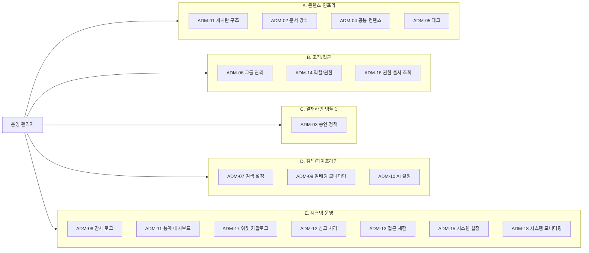

# 관리자 유즈케이스

## 개요 다이어그램

### 관리 권한 — 유즈케이스 매핑

> 아래 표는 관리자 권한별로 사용할 수 있는 유즈케이스를 정리한 것입니다. 위험도가 높은 권한은 최소 인원에게만 부여해야 합니다.

| 관리 권한 | 관련 유즈케이스 | 위험도 |
|---------|-----------|--------|
| 역할/권한 관리 | ADM-14, ADM-16 | 매우 높음 |
| 게시판 관리 | ADM-01, ADM-12, ADM-13 | 높음 |
| 그룹 관리 | ADM-06, ADM-16 | 높음 |
| 승인 정책 관리 | ADM-03 | 높음 |
| 긴급 발행 | [UC-APR-04](../user/UC-APR-승인워크플로.md#uc-apr-04-긴급-발행-승인-없이-바로-게시) | 높음 |
| 문서 양식 관리 | ADM-02 | 중간 |
| 태그 관리 | ADM-05 | 중간 |
| 공통 컨텐츠 관리 | ADM-04 | 중간 |
| 검색 설정 관리 | ADM-07 | 중간 |
| AI 검색 데이터 변환 모니터링 | ADM-09 | 중간 |
| AI 설정 관리 | ADM-10 | 중간 |
| 위젯 카탈로그 관리 | ADM-17 | 중간 |
| 시스템 운영 설정 | ADM-15 | 매우 높음 |
| 시스템 모니터링 | ADM-18 | 중간 |
| 감사 로그 조회 | ADM-08 | 낮음 |
| 통계 조회 | ADM-11 | 낮음 |

---

## 도메인별 상세 문서

| 도메인 | 파일 | 기능 수 | 범위 |
|--------|------|:-----:|------|
| A. 콘텐츠 인프라 | [UC-ADM-콘텐츠인프라.md](UC-ADM-콘텐츠인프라.md) | 4 | 게시판 구조, 문서 양식, 공통 컨텐츠, 태그 관리 |
| B. 조직/접근 | [UC-ADM-조직접근.md](UC-ADM-조직접근.md) | 3 | 그룹 관리, 역할/권한 관리, 권한 출처 조회 |
| C. 승인 정책 | [UC-ADM-승인정책.md](UC-ADM-승인정책.md) | 1 | 승인 정책 관리 |
| D. 검색/파이프라인 | [UC-ADM-검색파이프라인.md](UC-ADM-검색파이프라인.md) | 3 | 검색 설정, 임베딩 모니터링, AI 프롬프트 관리 |
| E. 시스템 운영 | [UC-ADM-시스템운영.md](UC-ADM-시스템운영.md) | 6 | 감사 로그, 통계, 신고 처리, 접근 제한, 시스템 설정, 위젯 카탈로그 |
| F. 시스템 모니터링 | [UC-ADM-시스템모니터링.md](UC-ADM-시스템모니터링.md) | 1 | 시스템 상태 모니터링, 알림, 운영 도구 |
