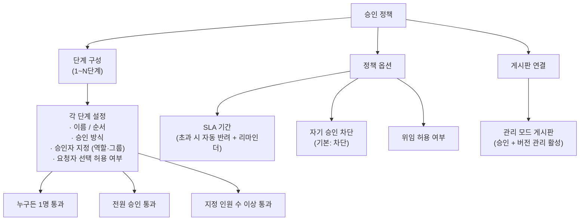

# 관리자 유즈케이스 — 승인 정책

> 문서가 게시되기 전에 거쳐야 하는 승인 절차의 규칙을 정의하고 관리한다.

## 비즈니스 목표

- **내부 통제 강화**: 문서가 무검증 상태로 게시되는 것을 방지하여 콘텐츠 품질과 정확성을 보장한다.
- **컴플라이언스 충족**: 금융권 등 규제 산업에서 요구하는 문서 승인 절차와 감사 추적 이력을 체계적으로 운영한다 — 승인 정책 자체의 변경 이력도 감사 대상이다.
- **운영 유연성 확보**: 조직 구조와 업무 성격에 따라 다양한 승인 조합(단일 승인, 다단계, 지정 인원 수 이상 등)을 운영자가 직접 구성할 수 있도록 한다.

---

## 개요 다이어그램

> 아래 다이어그램은 승인 정책의 구성 요소와 정책이 게시판에 적용되는 구조를 보여줍니다.

---

## UC-ADM-03: 승인 정책 관리

**사용자**: 운영 관리자 (승인 정책 관리 권한 필요)

> **승인 정책이란?** 문서가 게시되기 전에 거쳐야 하는 검토 단계를 정의한 규칙입니다. 예를 들어 "1단계: 팀장 승인 → 2단계: QA 검수"처럼 여러 단계를 설정할 수 있습니다. 각 단계마다 승인 방식(누구든 1명, 전원, 지정 인원 수 이상)을 정하고, 승인 기한(SLA)과 위임 허용 여부 같은 운영 옵션도 함께 설정합니다.

**사전 조건**:
- 사용자가 운영 관리자이며 승인 정책 관리 권한을 보유하고 있어야 한다.
- 승인 기능이 시스템에서 활성화되어 있어야 한다.

### 기본 흐름 A: 정책 생성

1. 관리자가 승인 정책 관리 화면에 접근한다.
2. "새 정책 만들기"를 선택한다.
3. 정책 이름과 설명을 입력한다.
4. 승인 단계를 구성한다:
   - 각 단계별로 이름과 순서를 지정한다.
   - **승인 방식**을 선택한다:
     - "누구든 한 명만 승인하면 통과" (예: 팀장 3명 중 1명만 승인하면 다음 단계로)
     - "전원이 승인해야 통과" (예: 팀장과 QA 담당자 모두 승인해야 통과)
     - "지정 인원 수 이상 승인하면 통과" (예: 5명 중 3명 이상 승인하면 통과)
   - 시스템이 선택한 승인 방식에 따른 **반려 판정 규칙**을 함께 안내한다:
     - "누구든 1명 통과" → 전원이 반려해야 최종 반려
     - "전원 승인 통과" → 1명이라도 반려하면 즉시 반려
     - "지정 인원 수 이상 통과" → 남은 인원을 합산해도 지정 인원 수에 미달하면 즉시 반려
   - **승인자 지정 방식**: 역할 기준 또는 그룹 기준으로 지정한다.
   - **요청자가 승인자를 직접 선택할 수 있는지** 여부를 설정한다.
5. 정책 옵션을 설정한다:
   - **SLA 기간**: 승인 요청 후 처리 기한을 설정한다 (예: 3일). 기한 초과 시 자동 반려되며, 기한 만료 전(예: 1일 전) 승인권자에게 리마인더 알림이 발송된다. SLA를 설정하지 않으면 기한 없이 승인 대기가 유지된다.
   - **자기 승인 차단**: 문서 작성자 본인이 승인자 목록에 포함되어 있어도 해당 건에서 자동으로 제외할지 여부를 설정한다 (기본값: 차단).
   - **위임 허용 여부**: 이 정책에서 승인자가 자신의 승인 권한을 다른 사람에게 고정 기간 동안 위임할 수 있는지 설정한다. 위임이 허용된 정책에서만 승인자가 위임을 설정할 수 있다.
6. 시스템이 정책 설정을 검증한다 (최소 1단계 이상, 각 단계에 승인자 지정 필수 등).
7. 관리자가 정책을 저장한다.

### 기본 흐름 B: 정책 목록 및 상세 조회

1. 관리자가 승인 정책 관리 화면에 접근한다.
2. 시스템이 정책 목록을 표시한다 — 정책 이름, 상태(활성/비활성), 단계 수, 연결된 게시판 수를 포함한다.
3. 관리자가 특정 정책을 선택하면 상세 화면이 표시된다 — 단계 구성, 각 단계의 승인 방식과 반려 판정 규칙, SLA 설정, 자기 승인 차단 여부, 위임 허용 여부, 연결된 게시판 목록을 확인할 수 있다.

### 기본 흐름 C: 정책 수정

1. 관리자가 정책 상세 화면에서 "수정"을 선택한다.
2. 시스템이 이 정책에 연결된 게시판 수와 영향 범위를 보여준다 ("이 정책이 연결된 게시판 N개에 영향이 있습니다").
3. 관리자가 단계 추가/제거/순서 변경, 승인 방식 변경, SLA 변경, 옵션 변경 등을 수행한다.
4. 시스템이 수정된 설정을 검증한다.
5. 관리자가 저장하면 정책이 갱신된다.
6. 이미 진행 중인 승인 건에는 영향이 없다 — 진행 중인 건은 승인 요청 시점의 정책 규칙(스냅샷)으로 처리된다.

### 기본 흐름 D: 정책 비활성화

1. 관리자가 정책 상세 화면에서 "비활성화"를 선택한다.
2. 시스템이 비활성화 시 영향을 표시한다 — 연결된 게시판이 있으면 해당 게시판에서 다른 정책으로 변경이 필요하다는 안내를 보여준다.
3. 관리자가 확인하면 정책이 비활성 상태로 전환된다.
4. 비활성 정책은 새로 게시판에 연결할 수 없다. 이미 연결된 게시판에서는 다른 정책으로 변경하도록 안내한다.

### 기본 흐름 E: 게시판 연결 및 해제

1. 관리자가 정책 상세 화면에서 "게시판 연결" 또는 게시판 관리 화면([UC-ADM-01](UC-ADM-콘텐츠인프라.md#uc-adm-01-게시판-구조-관리))에서 승인 정책을 선택한다.
2. **연결 시**: 활성 상태인 정책만 선택할 수 있다. 게시판에 정책을 연결하면 해당 게시판이 관리 모드(승인 + 버전 관리 활성)로 전환된다.
3. **해제 시**: 관리자가 게시판에서 정책 연결을 해제한다. 이미 진행 중인 승인 건은 요청 시점의 정책 규칙으로 처리가 완료된다. 정책 해제 후 새 문서는 승인 없이 바로 게시된다.

### 대안 흐름

- **정책 복제**: 기존 정책을 복사하여 새 정책을 만든 뒤 단계와 옵션을 조정할 수 있다. 복제된 정책은 "원본 정책명 (사본)" 형태로 이름이 지정되며, 관리자가 이름과 설정을 변경한 후 저장한다. 계절별 정책 교체나 부서별 변형 정책을 만들 때 활용한다.
- **정책 템플릿 라이브러리**: 시스템이 업종·상황별 사전 정의 정책 템플릿을 제공한다. 관리자가 템플릿을 선택하면 해당 템플릿의 단계 구성, 승인 방식, SLA, 옵션이 미리 채워진 상태로 정책 생성 화면이 열린다. 관리자가 조직에 맞게 조정한 후 저장한다. 제공되는 템플릿 예시:
  - **표준 승인**: 1단계 팀장 승인 (누구든 1명), SLA 3일 — 일반 문서에 적합
  - **규제 문서 승인**: 2단계 팀장 + QA 전원 승인, SLA 5일, 자기 승인 차단 필수 — 금융규제·컴플라이언스 문서에 적합
  - **긴급 승인**: 1단계 누구든 1명 승인, SLA 4시간 — 긴급 공지·장애 대응 문서에 적합
  - **다부서 합의**: 2단계 각 부서 대표 지정 인원 수 이상 승인 — 부서 간 협업 문서에 적합
  - 관리자가 자주 사용하는 정책을 직접 템플릿으로 등록할 수도 있다. 등록 시 템플릿 이름, 설명, 적합한 상황을 함께 기입한다.
- **영향도 미리보기**: 정책을 수정하거나 비활성화하기 전에 "이 정책이 연결된 게시판 N개, 현재 진행 중인 승인 요청 M건"을 확인하여 변경 영향 범위를 파악할 수 있다.
- **정책 시뮬레이션**: 정책 생성 또는 수정 후 실제 적용 전에, 가상의 승인 요청으로 전체 동작을 미리 확인할 수 있다.
  1. 관리자가 "시뮬레이션 실행"을 선택하고, 가상의 문서 작성자와 게시판을 지정한다.
  2. 시스템이 정책의 각 단계를 순서대로 재현한다 — 단계별로 승인 요청이 누구에게 전달되는지, SLA 기한은 언제인지, 자기 승인 차단이 적용되는 승인자가 있는지를 보여준다.
  3. 시뮬레이션 결과로 다음 정보가 제공된다:
     - 단계별 승인자 목록과 예상 전달 순서
     - 각 단계의 예상 처리 경로(정상 승인 / 반려 / SLA 초과 시)
     - 자기 승인 차단으로 제외되는 승인자 안내
     - 위임이 설정된 승인자의 위임 대상 표시
     - 모든 단계 통과 시 예상 총 소요 기간(SLA 합산)
  4. 관리자가 시뮬레이션 결과를 확인하고, 정책을 조정하거나 그대로 저장한다.
  5. 시뮬레이션 결과를 저장하여 정책 변경 근거 자료로 보관할 수 있다. 금융권 컴플라이언스 심사 등에서 정책 적용 전 검증 증빙으로 활용한다.
- **승인자 비활성화/퇴직 시 대응**: 정책에 지정된 승인자(역할 또는 그룹 소속)가 비활성화되거나 퇴직 처리되면, 시스템이 해당 정책의 관련 단계에 경고를 표시한다. 해당 단계의 유효 승인자가 0명이 되면 새 승인 요청을 생성할 수 없으며, 관리자가 대체 승인자를 지정해야 한다. 이미 진행 중인 건에서 해당 승인자에게 할당된 승인은 같은 단계의 다른 유효 승인자에게 재배정된다.
- **비활성 정책 재활성화**: 비활성 상태의 정책을 다시 활성화할 수 있다. 시스템이 모든 단계의 승인자 유효성을 재검증하고, 문제가 있으면(삭제된 역할, 빈 그룹 등) 수정 후 활성화하도록 안내한다. 재활성화 이력은 감사 로그에 기록된다.
- **게시판 정책 전환**: 이미 승인 정책이 연결된 게시판에 다른 정책을 연결하면, 기존 정책은 자동 해제된다. 진행 중인 승인 건은 기존 정책 규칙으로 완료되고, 이후 새 요청부터 새 정책이 적용된다.
- **부서별 차등 정책 구성**: 같은 성격의 게시판이라도 부서별로 다른 승인 정책을 연결할 수 있다. 예: 인사팀 게시판은 2단계 전원 승인, 마케팅팀 게시판은 1단계 승인으로 운영한다.
- **계절/시기별 정책 변경**: 특정 시기(연말 결산 간소화, 규제 변경 대응, 신규 서비스 출시 등)에 맞춰 정책을 간소화하거나 강화할 수 있다. 관리자가 기존 정책을 복제한 후 단계를 조정하고, 해당 게시판에 변경된 정책을 연결한다. 시기가 지나면 원래 정책으로 복원한다.
- **컴플라이언스 필수 단계 지정**: 금융권 규제 등으로 인해 특정 승인 단계를 "필수"로 지정할 수 있다. 필수 단계는 정책 수정 시 삭제하거나 건너뛸 수 없으며, 변경 시 관리자에게 별도 확인("이 단계는 컴플라이언스 필수 단계입니다. 변경하시겠습니까?")을 요구한다.
- **정책 효과 분석 대시보드**: 관리자가 정책 상세 화면에서 운영 효과를 종합적으로 분석할 수 있다.
  - **기본 지표**: 최근 기간별(일별/주별/월별) 승인 요청 수, 평균 처리 시간, 반려율, SLA 초과율, 철회율
  - **단계별 분석**: 각 단계의 평균 체류 시간, 대기 건수, 승인자별 처리 건수와 평균 응답 시간
  - **기간 비교**: 두 기간(예: 이번 달 vs 지난 달, 정책 변경 전 vs 후)의 지표를 나란히 비교하여 정책 변경의 효과를 검증한다
  - **승인자 부하 분포**: 특정 승인자에게 요청이 편중되는지, 승인자 간 처리량 불균형이 있는지 확인한다
  - 분석 결과를 보고서로 내보내어 정책 개선 근거 자료나 경영진 보고에 활용할 수 있다
- **승인 병목 자동 감지 및 조정 제안**: 시스템이 정책 운영 데이터를 자동 분석하여 병목을 감지하고 개선안을 제안한다.
  - 특정 단계의 평균 처리 시간이 설정된 기준(예: SLA의 70%)을 초과하면, 해당 단계를 "병목 의심"으로 표시하고 관리자에게 알림을 보낸다
  - 시스템이 병목 원인을 분석하여 다음과 같은 조정안을 제시한다:
    - "이 단계의 승인자 N명 중 실제 활동 승인자가 M명뿐입니다 → 승인자 추가를 검토하세요"
    - "이 단계의 SLA 대비 평균 처리 시간이 90%에 달합니다 → SLA 연장 또는 리마인더 시점 조정을 검토하세요"
    - "이 단계의 반려율이 N%로 높습니다 → 사전 검토 단계 추가 또는 작성 가이드 강화를 검토하세요"
  - 관리자가 제안을 검토하여 정책 수정 여부를 결정한다. 제안을 채택하면 해당 정책 수정 화면으로 바로 이동할 수 있다
- **승인 시스템 장애 시 긴급 발행 모드 일괄 전환**: 승인 처리 시스템에 장애가 발생하여 정상적인 승인 진행이 불가능한 경우, 관리자가 특정 게시판 또는 전체 게시판에 대해 "긴급 발행 모드"를 일괄 활성화할 수 있다. 긴급 발행 모드에서는 문서가 승인 절차 없이 바로 게시되며, 장애 복구 후 관리자가 긴급 발행 모드를 해제하면 정상 승인 절차가 재개된다. 긴급 발행 모드 중 게시된 문서 목록은 별도로 관리되어 사후 승인 검토에 활용한다.
- **대결(비상 승인) 패턴**: 지정된 승인자가 장기 부재(출장, 휴가 등) 상태이고 위임도 설정되지 않은 경우, 관리자가 해당 승인 건에 대해 "대결 처리"를 실행할 수 있다. 대결 시에는 원래 승인자의 상위 직급자 또는 관리자가 대신 승인하며, 대결 사유와 대결 승인자가 감사 로그에 기록된다. 이미 진행 중인 건에 한해 적용되며, 정책 자체를 변경하지 않는다.
- **정책 변경 이력 상세 조회**: 관리자가 정책의 전체 변경 이력을 시간순으로 조회할 수 있다. 각 변경마다 변경자, 변경 시각, 변경 전후 설정(단계 구성, 승인 방식, SLA, 옵션)의 차이를 나란히 비교하여 표시한다. 두 버전을 선택하여 차이점만 추출할 수도 있다. 외부 감사 시 정책 변경 근거를 증빙하는 데 활용한다.
- **정책 긴급 롤백**: 정책 변경 후 승인 프로세스에 문제가 발생한 경우, 관리자가 정책 변경 이력에서 원하는 버전을 선택하여 즉시 롤백할 수 있다.
  1. 관리자가 정책 변경 이력에서 복원할 시점을 선택한다.
  2. 시스템이 현재 버전과 복원 대상 버전의 차이를 비교하여 표시한다.
  3. 변경된 정책으로 새로 접수된 승인 요청이 있으면 해당 건수를 안내하고, 관리자가 처리 방식(기존 규칙 유지 또는 롤백된 규칙 적용)을 선택한다.
  4. 관리자가 확인하면 즉시 롤백이 적용된다. 롤백 사유를 필수로 입력한다.
  5. 롤백 이력이 감사 로그에 기록되며, 롤백 전 정책도 변경 이력에 보존된다.
- **정기 정책 효과성 검토**: 시스템이 설정된 주기(예: 분기 1회)마다 각 정책의 운영 효과를 요약한 보고서를 자동 생성한다. 보고서에는 다음이 포함된다:
  - 정책별 평균 승인 소요 시간, SLA 준수율, 반려율, 승인자 부하 분포
  - 직전 주기 대비 지표 변동 추이 (개선/악화 표시)
  - 병목이 감지된 정책과 해당 단계의 상세 분석
  - 미사용 정책(연결된 게시판 없음 또는 장기간 승인 요청 없음) 목록
  - 시스템이 개선이 필요하다고 판단한 정책과 권장 조치를 관리자에게 제안한다. 관리자가 보고서를 검토하여 정책 개선 계획을 수립한다
- **승인 현황 종합 대시보드**: 관리자가 전체 승인 정책의 운영 현황을 한눈에 파악할 수 있는 종합 대시보드를 제공한다. 현재 승인 대기 건수, 정책별 SLA 초과 건수, 최근 병목 알림 현황, 긴급 발행 건수 등을 시각화하여 표시한다. 대시보드에서 특정 정책을 선택하면 해당 정책의 효과 분석 화면으로 바로 이동할 수 있다
- **조직 개편 시 정책 일괄 재배치**: 조직 개편으로 부서 구조가 변경될 때, 영향받는 게시판의 승인 정책을 일괄 조회하고 새 조직 구조에 맞는 정책으로 한 번에 교체할 수 있다. 교체 전 영향도(게시판 수, 진행 중인 승인 건수)를 미리 확인한다.

### 예외 흐름

- **연결된 게시판이 있는 정책 삭제 시도**: 시스템이 삭제를 차단하고, 연결된 게시판 목록을 보여주며 "먼저 게시판에서 정책 연결을 해제해야 합니다"라고 안내한다. 관리자가 게시판 연결을 모두 해제한 후에만 삭제가 가능하다.
- **정책 수정 중 다른 관리자와 충돌**: 두 관리자가 동일한 정책을 동시에 수정하는 경우, 먼저 저장한 쪽의 변경이 반영되고 나중에 저장하려는 쪽에는 "다른 관리자가 이미 수정했습니다. 최신 내용을 확인해 주세요"라는 안내가 표시된다.
- **SLA 자동 반려 시 시스템 장애**: 기한 초과로 자동 반려를 실행해야 하는데 시스템 장애가 발생하면, 장애 복구 후 미처리 건을 일괄 처리하고 관리자에게 알림을 발송한다.
- **역할/그룹 삭제로 정책 무효화**: 정책에서 참조하는 역할이나 그룹이 삭제되면, 해당 정책에 경고 표시가 나타나고 게시판에 새로 연결할 수 없다. 관리자가 해당 단계의 승인자를 재지정해야 정상 사용이 가능하다.
- **정족수 설정 오류**: "지정 인원 수 이상 승인" 방식에서 정족수를 해당 단계의 승인자 수보다 크게 설정하려고 하면, 시스템이 "승인자 N명 중 M명 이상은 충족할 수 없습니다"라고 안내하고 저장을 차단한다. 승인자 수가 이후에 줄어들어(퇴직, 그룹 변경 등) 정족수를 충족할 수 없게 된 경우에도, 시스템이 해당 정책에 경고를 표시하고 관리자에게 알림을 발송한다.
- **정책 변경 시 진행 중인 승인 건 존재**: 정책 수정 시 해당 정책으로 진행 중인 승인 건이 있으면, 시스템이 "현재 진행 중인 승인 요청 N건이 있습니다"라고 안내한다. 수정을 저장하면 진행 중인 건은 요청 시점의 정책 규칙으로 완료되고, 이후 새 요청부터 변경된 규칙이 적용된다.
- **게시판-정책 해제 시 진행 중 요청 존재**: 게시판에서 정책을 해제할 때 진행 중인 승인 요청이 있으면, 시스템이 "진행 중인 승인 요청 N건이 있습니다"라고 안내하며 처리 방법을 선택하도록 한다 — (1) 진행 중인 건은 기존 정책 규칙으로 완료 처리, 또는 (2) 모든 진행 중인 건을 작성자에게 반려 처리.
- **다단계 승인(3단계 이상) 복잡도 경고**: 3단계 이상의 승인 정책을 구성하면, 시스템이 "단계가 많을수록 승인 처리 시간이 길어질 수 있습니다. 계속하시겠습니까?"라고 안내하고, 관리자가 확인 후 진행한다.
- **게시판 이동 시 정책 유지**: 게시판이 다른 상위 게시판으로 이동될 때, 기존 연결된 승인 정책은 그대로 유지된다. 이동 후 정책이 부적합하면 관리자가 수동으로 정책을 변경해야 하며, 시스템은 이동 시 현재 연결된 정책 정보를 안내한다.
- **승인 시스템 전체 장애 시 대체 운영**: 승인 처리 큐나 알림 시스템에 전면 장애가 발생하면, 시스템이 관리자에게 장애를 알리고 "승인 일시 중단 중"임을 대시보드에 표시한다. 관리자는 긴급 발행 모드 일괄 전환(위 대안 흐름)을 통해 업무 연속성을 확보하거나, 장애 복구를 기다린다. 장애 복구 후 미처리 승인 건이 자동으로 재처리되며, 관리자에게 복구 완료 알림과 미처리 건수가 안내된다.
- **정기 점검 시 승인 SLA 일시 정지**: 시스템 정기 점검(유지보수 모드)이 활성화된 기간 동안, 승인 SLA 타이머가 자동으로 일시 정지되어 점검 시간이 SLA에 산입되지 않는다. 점검이 종료되면 SLA 타이머가 자동으로 재개된다.

**사후 조건**:
- 감사 로그에 정책 변경(생성/수정/비활성화/삭제/재활성화) 기록이 남는다 — 누가, 언제, 어떤 항목을 변경했는지 상세 이력을 포함한다.
- 정책을 수정해도 이미 진행 중인 승인 건에는 영향이 없다 — 진행 중인 건은 승인 요청 시점의 정책 규칙 사본으로 처리된다.
- 정책의 SLA가 설정된 경우, 승인 요청 시 기한과 리마인더 알림이 자동으로 적용된다.
- 정책이 게시판에 연결되면, 해당 게시판의 새 문서부터 승인 절차가 적용된다.
- 정책 비활성화 시, 연결된 게시판 관리자에게 대체 정책 연결이 필요하다는 알림이 발송된다.
- 정책 사용 통계(승인 요청 수, 처리 시간, 반려율, SLA 준수율 등)가 누적되어 효과 분석 대시보드에서 운영 분석에 활용할 수 있다.
- 병목이 감지된 단계에 대한 알림이 관리자에게 발송되며, 조정 제안 내용이 함께 제공된다.
- 정책 변경 이력(변경 전후 설정 차이 포함)이 보존되어 외부 감사 대응에 활용할 수 있다.
- 긴급 발행 모드 활성화/해제 이력이 감사 로그에 기록된다. 긴급 발행 모드 중 게시된 문서 목록이 별도로 관리되어 사후 감사에 활용할 수 있다.
- 대결 처리 시, 대결 사유·대결 승인자·원래 승인자가 감사 로그에 기록된다.
- 정기 정책 효과성 보고서가 설정된 주기에 따라 관리자에게 발송된다.
- 정기 점검(유지보수 모드) 종료 시, SLA 타이머 일시 정지 기간이 감사 로그에 기록된다.

**제약 사항**:
- 다단계 승인(2단계 이상)은 시스템 설정에 따라 제공되지 않을 수 있다.
- "지정 인원 수 이상 승인하면 통과" 방식은 다단계 승인이 지원되는 환경에서만 사용 가능하다.
- 게시판에 연결된 정책은 삭제할 수 없다. 먼저 게시판에서 정책 연결을 해제해야 한다.
- 단계 없는(0단계) 정책은 생성할 수 없다 — 최소 1단계 이상 구성해야 한다.
- 관리자 대리 승인은 모든 정책에서 허용된다 ([FD-APR](../../features/FD-APR-승인워크플로.md) 관리자 대리 승인 규칙 참조). 고보안 게시판에서의 대리 승인 차단은 향후 단계에서 검토한다.
- 반려된 문서의 재요청은 항상 1단계부터 다시 진행한다 — 이 규칙은 시스템 고정이며 정책별로 변경할 수 없다.
- 하나의 게시판에는 하나의 승인 정책만 연결할 수 있다 — 동일 게시판에 복수 정책을 중복 적용할 수 없다.

---

## 관련 유즈케이스

| 유즈케이스 | 연관 | 설명 |
|-----------|------|------|
| [UC-APR-01: 승인 요청](../user/UC-APR-승인워크플로.md#uc-apr-01-승인-요청) | 정책 적용 | 승인 요청 시 이 정책의 단계·방식·SLA·옵션이 적용된다 |
| [UC-APR-02: 승인/반려 처리](../user/UC-APR-승인워크플로.md#uc-apr-02-승인반려-처리) | 반려 규칙 | 정책의 승인 방식에 따라 반려 판정 규칙이 달라진다 |
| [UC-APR-03: 승인 요청 철회](../user/UC-APR-승인워크플로.md#uc-apr-03-승인-요청-철회) | SLA 연동 | 철회 시 SLA 타이머가 해제된다 |
| [UC-APR-04: 긴급 발행](../user/UC-APR-승인워크플로.md#uc-apr-04-긴급-발행-승인-없이-바로-게시) | 정책 우회 | 긴급 발행은 정책의 승인 절차를 건너뛴다 |
| [UC-APR-05: 예약 배포](../user/UC-APR-승인워크플로.md#uc-apr-05-예약-배포-설정) | 정책 연동 | 예약 배포는 마지막 단계 승인 완료 후 설정된다 |
| [UC-ADM-01: 게시판 구조 관리](UC-ADM-콘텐츠인프라.md#uc-adm-01-게시판-구조-관리) | 게시판 연결 | 게시판에 승인 정책을 연결하여 관리 모드를 활성화한다 |

## 관련 기능정의서

| 기능정의서 | 참조 섹션 |
|-----------|-----------|
| [FD-APR-승인워크플로](../../features/FD-APR-승인워크플로.md) | §2 승인 정책 엔진, §4 다단계 승인 흐름, §6.1 관리자 오버라이드, §8.1 위임 |

## 관련 프로세스 흐름도

| 흐름도 | 관련 시나리오 |
|--------|-------------|
| [승인 워크플로 흐름도](../../flows/approval-permission/) | 정책이 적용되는 승인 시나리오별 상세 흐름 |
| [문서 생명주기 흐름도](../../flows/document-lifecycle/) | 승인 결과에 따른 문서 상태 전이 |
