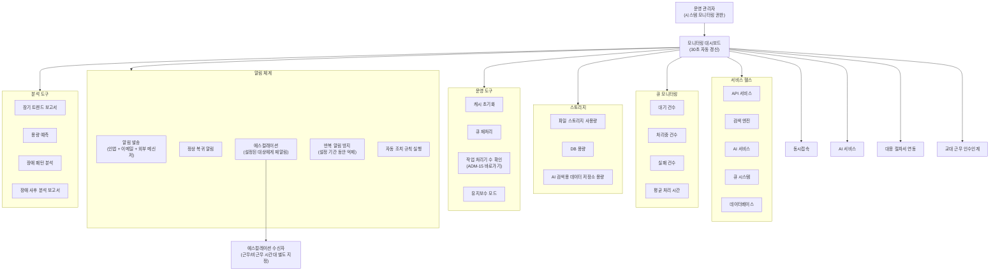

# 관리자 유즈케이스 — 시스템 모니터링

> 시스템 상태를 실시간으로 파악하여 장애를 선제적으로 감지하고, 운영자가 즉각 대응할 수 있도록 하는 모니터링 기능을 다룬다.

**비즈니스 목표**:
- **서비스 가용성 확보**: 애플리케이션 구성 요소의 가동 상태와 성능 지표를 상시 모니터링하여, 서비스 중단 시간을 최소화하고 가용률 목표를 달성한다.
- **장애 선제 대응**: 임계치 기반 알림과 에스컬레이션 체계를 통해 장애 인지 시간(MTTD)을 단축하고, 운영자가 서비스 영향이 확대되기 전에 대응할 수 있도록 한다.
- **운영 비용 절감**: AI 서비스 비용 추이, 스토리지 사용량, 큐 적체 현황을 시각화하여 자원 낭비를 조기에 감지하고 적정 운영 수준을 유지한다.
- **운영 효율화**: 장애 이력 패턴 분석, 용량 예측, 정기 보고서를 통해 선제적 운영 계획을 수립할 수 있도록 한다.

**이 문서의 범위**: 운영 관리자가 애플리케이션 레벨의 서비스 상태와 성능 지표를 조회·감시·조치하는 기능을 다룬다. 인프라 레벨 모니터링(서버 CPU, 메모리, 디스크 등)은 외부 인프라 모니터링 도구가 담당하며 이 유즈케이스에 포함되지 않는다.

---

## 개요 다이어그램

---

## UC-ADM-18: 시스템 모니터링

**사용자**: 운영 관리자 (시스템 모니터링 권한 필요)

> **시스템 모니터링이란?** 서비스를 구성하는 각 요소(API, 검색 엔진, AI 서비스, 큐, 데이터베이스 등)의 가동 상태와 성능 지표를 실시간에 가까운 주기로 수집·표시하여, 운영자가 이상 징후를 조기에 파악하고 선제적으로 대응할 수 있게 하는 기능입니다.

**사전 조건**:
- 사용자가 운영 관리자이며 시스템 모니터링 권한을 보유하고 있어야 한다.
- 시스템 모니터링 권한은 대시보드 조회와 수동 조치 실행을 모두 포함한다. 수동 조치 실행은 감사 로그에 기록된다.
- 모니터링 대상 서비스가 1개 이상 등록되어 있어야 한다.

**기본 흐름**:
1. 관리자가 시스템 모니터링 대시보드에 접근한다.
2. 시스템이 다음 영역의 실시간 상태를 표시한다:

| 영역 | 표시 지표 | 단위/기준 예시 |
|------|----------|---------------|
| **서비스 헬스** | 각 서비스(API, 검색 엔진, AI 서비스, 큐 시스템, DB)의 가동 상태, 응답 시간, 에러율 | 응답 시간: ms, 에러율: % |
| **큐 모니터링** | 큐별 대기/처리중/실패 건수, 평균 처리 시간 | 건수: 건, 처리 시간: 초 |
| **스토리지** | 파일 스토리지 사용량, DB 용량, AI 검색용 데이터 저장소 용량 | 사용량: GB, 사용률: % |
| **동시접속** | 현재 동시접속자 수, 피크 시간대 추이 | 접속자 수: 명 |
| **AI 서비스** | AI 응답 시간, 토큰 사용량, 일별 비용 추이 | 응답 시간: ms, 비용: 원/달러 |

3. 각 지표는 정상/경고/위험 상태를 색상으로 구분하여 표시한다. 기준 임계치는 시스템 기본값이 제공되며, 관리자가 조정할 수 있다 (대안 흐름 4a 참조).
4. 관리자가 관심 영역을 선택하여 상세 지표를 확인한다.
5. 지표가 설정된 임계치를 초과하면, 시스템이 관리자에게 알림을 발송한다.
   - **알림 채널**: 인앱 알림 + 이메일 + 외부 메신저 연동(슬랙, Teams 등)
   - 알림 채널은 지표별로 설정할 수 있다 (※ FD-NTF에 모니터링 알림 유형 등록 필요)
6. 임계치를 초과했던 지표가 정상 범위로 복귀하면, 시스템이 "정상 복귀" 알림을 발송한다.

**대안 흐름**:

*— 대시보드 운영 (1~3단계) —*

- **1a. 수동 조치**: 관리자가 모니터링 대시보드에서 다음과 같은 운영 도구를 실행할 수 있다:
  - 캐시 초기화
  - 큐 재처리 (실패 건 재시도)
  - 작업 처리기 수 현재 값 확인 및 시스템 운영 설정(ADM-15) 바로가기 — 작업 처리기 수 변경은 ADM-15에서 수행한다
  1. 관리자가 수동 조치를 선택하고 실행을 확인한다 (확인 대화 상자 필수).
  2. 시스템이 조치를 실행하고 실행 결과(성공/실패/에러 메시지)를 표시한다.
  3. 시스템이 조치 실행 전후의 관련 지표 변화를 비교하여 표시한다.
- **1b. 이력 조회**: 관리자가 지표별 시계열 데이터를 기간을 선택하여 확인한다. 최대 조회 가능 기간은 시스템 설정에 따른다 (기본 90일). 조회 기간에 따라 데이터 해상도가 자동 조정된다 (7일 이내: 분 단위, 7~30일: 시간 단위, 30일 초과: 일 단위). 대량 데이터 조회가 필요한 경우 표 형식 파일로 내보내기를 사용한다.
- **1c. 유지보수 모드 진입/해제 전체 절차**: 정기 점검이나 배포 작업 시, 관리자가 유지보수 모드를 활성화하여 알림 발송을 일시 중지하고 사용자에게 점검을 안내한다.
  1. **진입 준비**: 관리자가 유지보수 모드를 선택하고, 예정 시작 시각, 예정 종료 시각, 점검 사유를 입력한다.
  2. **사전 안내**: 시스템이 유지보수 시작 N분 전(설정 가능)부터 사용자에게 사전 안내를 표시한다 ("N시부터 N시까지 시스템 점검이 예정되어 있습니다").
  3. **진입**: 예정 시각이 되면(또는 관리자가 수동 진입하면) 시스템이 유지보수 모드를 활성화한다. 대시보드에 "유지보수 중" 표시가 나타나고, 사용자 화면에 점검 안내가 표시된다.
  4. **점검 중 모니터링**: 유지보수 기간 동안 임계치 초과가 발생해도 알림을 발송하지 않으며, 해당 이벤트는 "유지보수 중 발생"으로 별도 기록한다. 모니터링 데이터 수집은 계속된다.
  5. **해제**: 예정 종료 시각이 되면 시스템이 자동 해제하거나, 관리자가 예정 시각 전에 수동 해제할 수 있다.
  6. **사후 요약**: 해제 시 시스템이 유지보수 기간 중 누적된 이상 징후를 요약 알림으로 발송한다. 사용자에게 "점검이 완료되었습니다" 안내가 표시된다.
  7. **연동 기능 일시 정지 관리**: 유지보수 모드 중 승인 SLA 타이머가 자동 일시 정지되며, AI 검색 데이터 변환 작업 등록도 일시 중지된다. 해제 시 모두 자동 재개된다.
- **1d. 교대 근무 인수인계**: 24시간 운영 환경에서 교대 근무 시, 관리자가 현재 모니터링 현황을 인수인계한다.
  1. 퇴근하는 관리자가 인수인계 메모를 작성한다 (현재 주의 지표, 진행 중인 조치, 미해결 알림 등).
  2. 시스템이 최근 근무 시간 동안 발생한 알림·조치·미확인 이벤트를 자동 요약하여 인수인계 메모에 첨부한다.
  3. 인계받는 관리자가 인수인계 메모를 확인하고 인수 확인을 처리한다.
  4. 인수인계 기록은 이력으로 보관된다.
- **2a. 대시보드 레이아웃 저장 및 역할별 뷰**: 관리자가 관심 지표의 배치·크기·표시 항목을 조정하여 개인별 레이아웃으로 저장한다. 저장 전 대시보드를 벗어나면 변경 사항이 유실될 수 있으므로, 시스템이 "저장하지 않은 변경이 있습니다" 확인을 표시한다.
- **2b. 대시보드 공유 및 역할별 프리셋**: 관리자가 구성한 대시보드 레이아웃을 다른 관리자에게 공유할 수 있다.
  - 개인 레이아웃을 "팀 공유 레이아웃"으로 게시하면, 다른 관리자가 해당 레이아웃을 가져와 자신의 화면에 적용할 수 있다.
  - 역할별(예: 검색 담당 관리자, 보안 담당 관리자, 전체 운영 관리자) 기본 대시보드 프리셋을 등록할 수 있다. 신규 관리자가 처음 접근하면 해당 역할의 프리셋이 기본 레이아웃으로 적용된다.
  - 공유 레이아웃에 포함된 지표 중 접근 권한이 없는 항목은 "권한 없음"으로 표시되어, 역할별 정보 접근 범위가 자연스럽게 제어된다.
  - 관리자가 레이아웃 프리셋을 수정하면 해당 프리셋을 사용 중인 관리자에게 "기본 레이아웃이 업데이트되었습니다" 알림이 발송된다.

*— 상세 분석/설정 (4단계) —*

- **4a. 임계치 설정**: 관리자가 각 지표의 알림 임계치를 직접 설정한다. 시스템은 최초 가동 시 각 지표에 대해 기본 임계치를 제공한다. 관리자가 지표별로 경고/위험 두 단계의 임계치를 각각 설정할 수 있다. 임계치는 시스템 운영 설정(ADM-15)과 연계하여 관리된다 (※ FD-SYS에 모니터링 설정 카테고리 등록 필요).
- **4b. 에스컬레이션**: 알림 발송 후 설정된 시간 이내에 조치가 이루어지지 않으면, 시스템이 에스컬레이션 대상에게 재알림을 발송한다.
- **4b-1. 에스컬레이션 대상 설정**: 관리자가 에스컬레이션 대상(특정 사용자 또는 사용자 그룹)을 직접 지정한다. 지표 영역별로 서로 다른 에스컬레이션 대상을 설정할 수 있다.
- **4c. 장애 등급별 대응 절차서(런북) 연동**: 장애 유형과 등급별로 미리 작성된 대응 절차서를 연결하여, 알림 발생 시 해당 절차서로 바로 이동할 수 있다.
  1. 관리자가 지표 영역별, 장애 등급별(경고/위험/긴급)로 대응 절차서 링크를 등록한다. 등급이 높을수록 긴급 연락 체계와 에스컬레이션 절차가 포함된 절차서를 연결한다.
  2. 알림이 발생하면, 시스템이 장애 등급을 자동 판정하고 해당 등급의 대응 절차서 링크를 알림 메시지에 포함한다.
  3. 관리자가 알림 상세 화면에서 대응 절차서를 바로 열어 절차에 따라 조치한다.
  4. 대응 절차서에 체크리스트가 포함된 경우, 관리자가 각 단계를 체크하며 진행할 수 있고, 체크 이력이 장애 이력에 함께 기록된다.
  5. 절차서 미등록 상태에서 알림이 발생하면, 시스템이 "대응 절차서가 등록되지 않았습니다" 경고를 함께 표시하여 절차서 등록을 유도한다.
- **4d. 장기 트렌드 분석 기반 용량 계획**: 관리자가 스토리지·동시접속·AI 사용량 등 용량 관련 지표의 장기 추세를 분석하고, 선제적 용량 계획을 수립한다.
  1. 관리자가 용량 계획 화면에 접근한다.
  2. 시스템이 다음 지표의 장기 추세(30일/90일/180일)를 시각화하여 표시한다:
     - 파일 스토리지 사용량 증가 추세와 예상 소진 시점
     - DB 용량 증가 추세와 예상 소진 시점
     - AI 검색용 데이터 저장소 용량 추이
     - 동시접속자 수 추이와 피크 시간대 변화
     - AI 서비스 비용 증가 추세와 예상 월간 비용
  3. 시스템이 각 지표의 예상 소진 시점 또는 예산 초과 시점을 자동 산출한다.
  4. 예상 소진 시점이 설정된 기간(기본 30일) 이내이면, 시스템이 관리자에게 사전 알림을 발송한다.
  5. 관리자가 용량 계획 보고서(현재 사용량, 증가 추세, 예상 소진 시점, 권장 조치)를 생성하여 시스템 관리자에게 증설 요청 근거로 전달할 수 있다.
- **4e. 장애 패턴 분석**: 관리자가 과거 장애 이력을 조회하여 반복되는 패턴(특정 시간대, 특정 서비스, 특정 요일 등)을 분석한다.
  1. 관리자가 장애 패턴 분석 화면에 접근하고 분석 기간을 선택한다.
  2. 시스템이 장애 발생 빈도, 시간대별 분포, 서비스별 분포, 평균 복구 시간 등을 시각화하여 표시한다.
  3. 반복 패턴이 감지되면(예: 매주 월요일 오전에 검색 응답 시간 급등) 시스템이 해당 패턴을 강조 표시하고, 예방 조치(사전 캐시 워밍, 자원 확보 등)를 제안한다.

*— 알림/대응 (5~6단계) —*

- **5a. 반복 알림 방지**: 동일 지표가 임계치를 반복 초과하는 경우, 반복 알림 방지 기간(관리자 설정, 기본 5분) 동안 반복 알림을 억제한다. 해당 기간 동안 추가 발생한 건은 "N건 추가 발생" 요약 알림으로 묶어 발송한다.
- **5b. 복수 서비스 동시 장애**: 여러 서비스에서 동시에 장애가 발생하면, 시스템이 알림을 심각도 순으로 정렬하여 발송한다.
  1. 시스템이 동시 장애를 감지하면 "복수 서비스 장애 발생" 종합 알림을 먼저 발송한다.
  2. 종합 알림에 장애 서비스 목록과 각 서비스의 심각도(위험/경고)를 포함한다.
  3. 개별 서비스별 상세 알림은 심각도 높은 순서대로 발송한다.
- **5c. 과다 알림 대응**: 임계치 오설정 등으로 단시간에 과도한 알림이 발생하면, 시스템이 자동으로 알림 빈도를 제한하고 관리자에게 임계치 재검토를 권장한다.
  1. 설정된 시간(기본 10분) 내에 동일 지표에서 알림이 기준 횟수(기본 10건)를 초과하면, 시스템이 해당 지표의 알림을 일시 억제한다.
  2. 시스템이 "임계치 재검토 필요" 안내 알림을 발송하고, 해당 지표의 최근 추이 데이터를 함께 제공한다.
  3. 관리자가 임계치를 조정하면 알림 억제가 자동 해제된다.
- **5d. 자동 조치 규칙**: 관리자가 특정 임계치 초과 시 자동으로 실행할 조치를 사전 설정한다.
  1. 관리자가 지표별 자동 조치 규칙을 등록한다 (예: "큐 실패 건수 100건 초과 시 → 자동 큐 재처리").
  2. 임계치를 초과하면 시스템이 등록된 자동 조치를 실행하고, 실행 결과를 관리자에게 알림으로 통보한다.
  3. 자동 조치가 실패하면 시스템이 즉시 관리자에게 알림을 발송하여 수동 대응을 유도한다.
  4. 자동 조치 실행 이력은 감사 로그에 "자동 실행"으로 구분하여 기록된다.
- **5e. 야간/주말 에스컬레이션 경로**: 근무 시간 외(야간, 주말, 공휴일)에는 별도로 지정된 에스컬레이션 경로를 따른다.
  1. 관리자가 근무 시간대와 비근무 시간대의 에스컬레이션 대상을 각각 설정한다.
  2. 비근무 시간에 장애가 발생하면, 시스템이 비근무 시간대 에스컬레이션 경로에 따라 알림을 발송한다.
  3. 비근무 시간대 에스컬레이션 대상이 미설정 상태이면, 시스템이 근무 시간대 대상에게 알림을 발송하고 "비근무 시간대 에스컬레이션 경로 미설정" 경고를 함께 표시한다.

*— 사후 분석 (6단계 이후) —*

- **6a. 장애 사후 분석(포스트모템) 보고서**: 장애가 복구된 후, 관리자가 구조화된 사후 분석 보고서를 작성한다.
  1. 관리자가 특정 장애 이력을 선택하여 사후 분석 보고서 작성을 시작한다.
  2. 시스템이 해당 장애의 타임라인(감지 시각, 알림 시각, 조치 시각, 복구 시각), 영향 범위(영향받은 서비스, 영향받은 사용자 수 추정치), 수행된 조치 이력을 자동으로 채워 넣는다.
  3. 관리자가 다음 항목을 기입한다:
     - **장애 요약**: 장애 현상과 영향 범위를 1~2문장으로 요약
     - **근본 원인**: 장애를 발생시킨 근본적인 원인
     - **대응 과정 평가**: 장애 감지부터 복구까지의 대응 과정에서 잘된 점과 개선할 점
     - **재발 방지 대책**: 동일 장애 재발을 막기 위한 구체적 조치 계획
     - **후속 조치 항목**: 추가로 수행해야 할 작업 목록과 담당자, 기한
  4. 시스템이 장애 감지 소요 시간(MTTD)과 복구 소요 시간(MTTR)을 자동 산출하여 보고서에 포함한다.
  5. 작성된 보고서를 관련자(상위 관리자, 해당 서비스 담당자)에게 공유하고, 장애 이력에 연결하여 보관한다.
  6. 후속 조치 항목의 이행 여부를 추적한다 — 기한이 도래하면 담당자에게 리마인더가 발송되며, 미이행 항목은 관리자에게 알림이 간다.
- **6b. 장기 트렌드 보고서**: 관리자가 주간/월간 단위의 운영 보고서를 생성하거나, 자동 생성 스케줄을 설정한다.
  1. 관리자가 보고서 기간(주간/월간)과 포함할 지표를 선택한다.
  2. 시스템이 해당 기간의 서비스 가용률, 장애 횟수, 평균 복구 시간(MTTR), 용량 추이, AI 서비스 비용, 동시접속 피크 등을 자동 집계한다.
  3. 직전 기간 대비 변동 추이(개선/악화)를 시각화하여 표시한다.
  4. 관리자가 보고서를 확인하고 표 형식 파일 또는 문서 형식으로 내보낸다.
  5. 자동 생성 스케줄을 설정하면, 시스템이 설정된 주기마다 보고서를 자동 생성하여 지정 수신자에게 전달한다. 경영진 보고나 SLA 준수 증빙에 활용한다.

*— 운영 대비 (정기/비상) —*

- **6c. 정기 점검 사용자 안내 연동**: 유지보수 모드 활성화 시, 관리자가 사용자에게 표시할 점검 안내 메시지("N시부터 N시까지 시스템 점검이 진행됩니다")를 설정할 수 있다. 안내 메시지는 로그인 화면, 대시보드 상단, 진행 중인 작업 화면에 표시된다. 점검 종료 시 안내가 자동 해제되고 "점검 완료" 알림이 발송된다.
- **6d. 비상 연락 체계 관리**: 관리자가 장애 등급별(경고/위험/긴급) 비상 연락 체계를 문서화하고 시스템에 등록한다. 비상 연락처(이름, 연락처, 담당 영역, 근무/비근무 시간대)를 관리하며, 장애 알림 발생 시 해당 등급의 연락 체계가 알림 메시지에 함께 제공된다. 비상 연락 체계는 정기적으로(예: 분기 1회) 관리자에게 검토·갱신 알림을 보내 최신 상태를 유지한다.
- **6e. 장애 시 사용자 안내 자동 발송**: 서비스 헬스가 "위험" 상태에 진입하면, 관리자가 사전에 등록한 장애 유형별 사용자 안내 메시지를 자동 또는 수동으로 발송할 수 있다. 예: 검색 장애 발생 시 "현재 검색 기능에 일시적 장애가 있습니다. 게시판 탐색을 이용해 주세요"라는 안내가 사용자에게 표시된다.
- **6f. 대규모 동시접속 긴급 대응**: 동시접속자 수가 설정된 임계치를 초과하면, 시스템이 관리자에게 알림을 보내고 현재 접속자 추이와 예상 피크를 표시한다. 관리자가 필요 시 일부 비필수 기능(통계 집계, AI 답변 생성 등)을 일시적으로 제한하여 핵심 기능(문서 조회, 검색)의 응답 성능을 보호할 수 있다.

**사후 조건**:
- 수동 조치(캐시 초기화, 큐 재처리 등) 실행 시 감사 로그에 기록된다 (실행자, 조치 유형, 실행 시각, 결과).
- 자동 조치 실행 시에도 감사 로그에 "자동 실행"으로 구분하여 기록된다.
- 임계치 설정 변경 시 감사 로그에 기록된다.
- 에스컬레이션 대상 설정 변경 시 감사 로그에 기록된다.
- 장애 발생·복구 기록이 장애 이력에 저장된다 (장애 시작 시각, 복구 시각, 영향 서비스, 수행 조치).
- 장애 감지 소요 시간(MTTD)과 평균 복구 시간(MTTR) 지표가 자동 갱신된다.
- 알림 발송 이력이 보관되며, 보관 기간은 시스템 설정에 따른다 (기본 1년).
- 인수인계 기록과 사후 분석 보고서가 이력으로 보관된다.
- 비상 연락 체계 등록/변경 시 감사 로그에 기록된다. 정기 검토·갱신 알림 발송 이력도 보관된다.
- 유지보수 모드 시 사용자 안내 메시지 설정/해제 이력이 감사 로그에 기록된다. 유지보수 기간 중 SLA 일시 정지·재개 이력도 함께 기록된다.
- 대시보드 레이아웃 공유/프리셋 변경 시 감사 로그에 기록된다.
- 포스트모템 보고서의 후속 조치 항목 이행 여부가 추적되며, 미이행 항목에 대한 리마인더 발송 이력이 보관된다.
- 장기 트렌드 보고서 자동 생성 시 생성 이력과 수신자가 감사 로그에 기록된다.
- 용량 계획 보고서 생성/내보내기 이력이 감사 로그에 기록된다.
- 장애 시 사용자 안내 자동 발송 이력이 보관되며, 안내 내용과 발송 범위가 함께 기록된다.
- 비필수 기능 일시 제한 설정/해제 시 감사 로그에 기록된다.

**제약 사항**:
- 모니터링 데이터는 실시간에 가까우나 수집 주기(기본 30초)에 따른 지연이 존재한다. 수집 주기는 시스템 설정에서 조정할 수 있다.
- 대시보드는 수집 주기와 동일한 간격(기본 30초)으로 자동 갱신된다. 관리자가 수동으로 즉시 새로고침할 수도 있다.
- 시계열 데이터 보관 기간은 시스템 설정에 따라 결정된다 (기본 90일).
- 인프라 레벨 모니터링(서버 CPU, 메모리, 디스크 등)은 외부 인프라 모니터링 도구가 담당하며, 이 유즈케이스의 범위에 포함되지 않는다. 이 유즈케이스는 애플리케이션 레벨의 서비스 상태와 성능 지표를 다룬다.
- 큐 모니터링 대상은 AI 검색 데이터 변환 큐를 포함한 시스템 전체 큐(승인 처리, 알림 발송 등)를 다룬다.
- 모니터링 알림은 시스템 운영상 필수이므로, 개인 알림 설정(유형별 켜기/끄기)과 무관하게 항상 발송된다.
- 자동 조치 규칙은 관리자가 명시적으로 등록한 조치만 실행되며, 시스템이 임의로 조치를 수행하지 않는다.
- 유지보수 모드 중에도 모니터링 데이터 수집은 계속되며, 알림 발송만 일시 중지된다.

**예외 흐름**:
- **모니터링 서비스 장애**: 모니터링 데이터를 수집하는 서비스 자체에 장애가 발생하면, "모니터링 데이터를 가져올 수 없습니다" 안내와 함께 마지막으로 데이터를 수집한 시점을 표시한다.
- **일부 서비스 수집 불가**: 특정 서비스(예: AI 서비스)에서만 데이터를 수집할 수 없는 경우, 해당 영역을 "데이터 수집 불가" 상태로 표시하고 나머지 영역은 정상 표시한다. 관리자에게 알림을 발송한다.
- **외부 서비스 연결 불가**: AI 서비스 등 외부 서비스에 연결할 수 없는 경우, 해당 서비스의 상태를 "연결 불가"로 표시하고 관리자에게 알림을 발송한다.
- **수동 조치 실패**: 캐시 초기화, 큐 재처리 등 수동 조치가 실패하면, 실패 사유를 관리자에게 표시하고 감사 로그에 실패 이력을 기록한다. 관리자는 재시도하거나 에스컬레이션할 수 있다.
- **대시보드 데이터 지연**: 수집 주기를 초과하여 데이터가 갱신되지 않으면, 대시보드에 "데이터 갱신 지연" 경고를 표시하고 마지막 수집 시점을 함께 보여준다.
- **알림 채널 장애**: 이메일 서버 또는 외부 메신저 연동에 장애가 발생하여 알림을 발송할 수 없는 경우, 시스템이 인앱 알림으로 대체 발송하고 "알림 채널 장애" 경고를 대시보드에 표시한다. 장애가 복구되면 미발송 알림을 재발송한다.
- **에스컬레이션 대상자 부재**: 에스컬레이션 대상자가 지정되지 않았거나, 지정된 대상자의 계정이 비활성 상태인 경우, 시스템이 모니터링 권한을 가진 모든 관리자에게 알림을 발송하고, 대시보드에 "에스컬레이션 대상 미설정" 경고를 표시한다.
- **자동 조치 실패 후 수동 전환**: 자동 조치 규칙에 의해 실행된 조치가 실패하면, 시스템이 즉시 관리자에게 "자동 조치 실패 — 수동 대응 필요" 알림을 발송한다. 알림에 실패 사유와 해당 대응 절차서 링크를 포함한다.
- **관리자 동시 조치 충돌**: 두 명 이상의 관리자가 동일한 수동 조치(예: 같은 큐 재처리)를 동시에 실행하려 하면, 먼저 실행한 관리자의 조치만 수행하고 나머지 관리자에게 "다른 관리자가 이미 해당 조치를 실행 중입니다" 안내를 표시한다.

---

## 관련 문서

| 문서 | 참조 내용 |
|------|----------|
| [FD-SYS](../../features/FD-SYS-시스템설정.md) | 시스템 운영 파라미터 — 모니터링 관련 설정 항목 (※ 모니터링 설정 카테고리 등록 필요: 수집 주기, 시계열 보관 기간, 임계치 기본값, 반복 알림 방지 기간, 유지보수 모드, 자동 조치 규칙, 에스컬레이션 시간대, 용량 예측 사전 알림 기간 등) |
| [FD-MON](../../features/FD-MON-시스템모니터링.md) | 시스템 모니터링 기능정의서 — 모니터링 대상 영역, 임계치, 알림·에스컬레이션·자동 조치 규칙, 용량 계획, 장애 사후 분석 상세 |
| [FD-AUD](../../features/FD-AUD-감사로그.md) | 수동 조치, 자동 조치, 설정 변경 감사 로그 |
| [FD-NTF](../../features/FD-NTF-알림.md) | 알림 발송 (인앱 + 이메일 + 외부 메신저 연동) — (※ 모니터링 알림 유형 등록 필요: 임계치 초과, 서비스 장애, 정상 복귀, 에스컬레이션, 알림 채널 장애, 자동 조치 결과, 용량 예측 사전 알림, 유지보수 모드 시작/종료, 과다 알림 경고) |
| [UC-ADM-시스템운영](UC-ADM-시스템운영.md) | ADM-15 시스템 운영 설정 — 임계치 설정·작업 처리기 수 변경 연계 |
