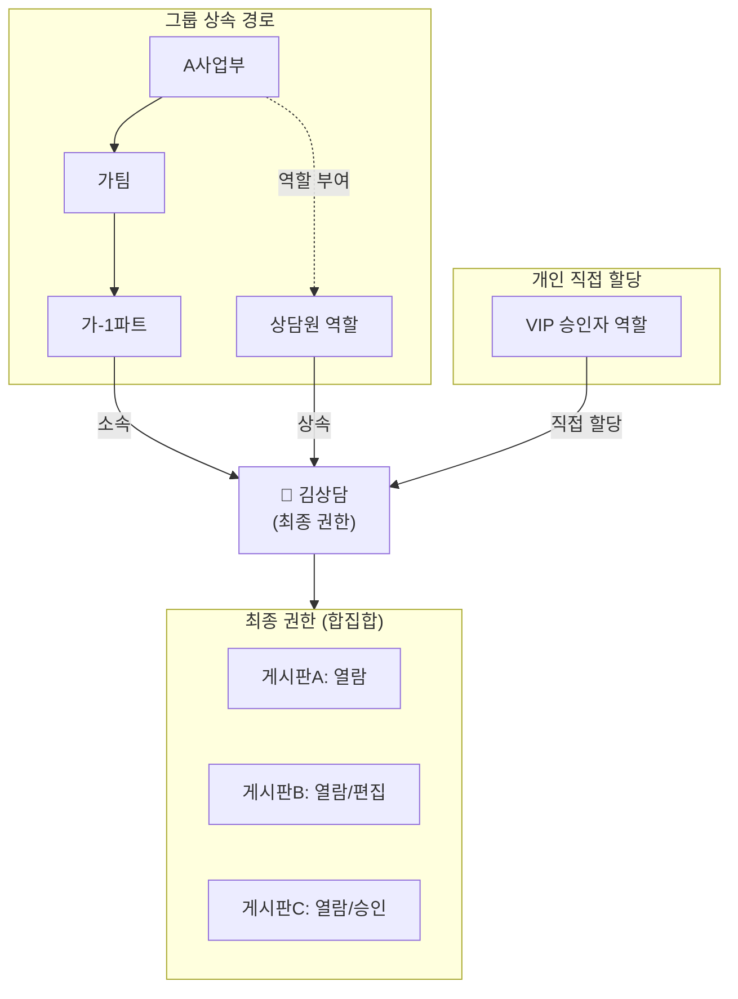

# 관리자 유즈케이스 — 조직/접근

> 사용자 그룹, 역할/권한 체계, 권한 출처 추적 등 조직 구조와 접근 제어를 다룬다.

**비즈니스 목표**: 금융권 컨택센터의 정보 차단벽 구축과 개인정보보호법(§29 접근통제) 요건을 충족하면서, 대규모 조직의 권한 관리를 효율화한다. 그룹/역할 기반 권한 체계로 권한 부여·변경에 소요되는 관리 공수를 줄이고, 권한 출처 추적 기능으로 관리자 문의 건수와 감사 대응 시간을 단축한다.

---

## UC-ADM-06: 그룹 관리

**사용자**: 운영 관리자 (그룹 관리 권한 필요)

> **그룹이란?** 동일한 역할을 공유하는 사용자들의 묶음입니다. 예: "CS팀", "기술지원팀", "프로젝트 TF". 그룹에 역할을 부여하면 소속 멤버 전원에게 해당 역할의 권한이 적용됩니다. 그룹은 계층 구조(부모-자식)를 가질 수 있으며, 상위 그룹에 역할을 부여하면 하위 그룹 소속 멤버에게 자동 상속됩니다. 예를 들어 "A사업부 > 가팀 > 가-1파트"처럼 조직도를 반영할 수도 있고, "프로젝트 TF"처럼 독립적으로 생성할 수도 있습니다.

**사전 조건**:
- 사용자가 운영 관리자이며 그룹 관리 권한을 보유하고 있어야 한다.

**기본 흐름**:
1. 관리자가 그룹 관리 화면에 접근한다.
2. 새 그룹을 만든다 — 이름과 설명을 입력하고, 필요한 경우 상위 그룹을 지정하여 계층 구조로 배치한다.
   - 상위 그룹을 지정하지 않으면 최상위 그룹이 된다.
   - 예: "A사업부 > 가팀 > 가-1파트"처럼 여러 단계로 구성할 수 있다.
3. 그룹에 구성원을 추가하거나 제거한다. 사용자는 여러 그룹에 동시에 소속될 수 있다.
4. 그룹에 역할을 부여한다 — 해당 역할에 설정된 권한(게시판 열람/편집/승인 + 관리 기능 접근)이 그룹 구성원 전체에 적용된다.
   - 예: "CS팀" 그룹에 "상담원" 역할을 부여하면 CS팀 소속 전원에게 상담원 권한이 적용된다.
5. 그룹의 현재 멤버 수와 부여된 역할 목록을 확인할 수 있다.
6. 저장 시 시스템이 변경 내용의 버전을 기록한다. 다른 관리자가 동시에 같은 그룹을 수정한 경우 충돌이 감지되면 "다른 관리자가 이미 변경했습니다. 최신 상태를 확인한 뒤 다시 시도하세요"라는 안내가 표시된다.

**대안 흐름**:
- **조직도 연동**: 외부 인사 시스템과 연동된 경우, 조직 구조(부서/팀/파트)가 계층 그룹으로 자동 반영된다. 관리자는 연동된 그룹에 역할만 부여하면 된다. 연동 그룹의 멤버는 직접 편집할 수 없다.
- **그룹 이동**: 기존 그룹을 다른 상위 그룹 아래로 이동시킬 수 있다. 이동 시 하위 그룹과 멤버는 함께 이동되며, 그룹에 직접 부여된 역할은 유지된다. 단, 이동 후 새 상위 그룹의 역할이 추가 상속되므로 영향도 미리보기가 함께 표시된다.
- **그룹 삭제**: 하위 그룹이 없는 그룹만 삭제할 수 있다. 삭제 전 시스템이 "이 그룹에 N명의 멤버가 소속되어 있습니다. 삭제 시 이 그룹을 통해 부여된 권한이 즉시 해제됩니다"라는 안내를 표시한다. 관리자가 확인하면 삭제가 진행되고, 소속 멤버의 해당 그룹 기반 권한이 즉시 재계산된다. 다른 그룹이나 개인으로 부여받은 권한에는 영향 없다.
- **그룹 비활성화**: 더 이상 사용하지 않는 그룹은 비활성 처리한다 — 구성원의 해당 그룹을 통한 권한이 해제되지만, 그룹 구조와 이력은 보존된다. 비활성 그룹은 그룹 목록에서 별도 구분되어 표시된다.
- **일괄 멤버 변경**: 여러 사용자를 한 번에 그룹에 추가하거나 제거할 수 있다. 대상 사용자 목록을 직접 선택하거나 파일(CSV 등)로 업로드하여 지정한다.
- **대량 사용자 그룹 이동**: 한 그룹의 전체 또는 일부 멤버를 다른 그룹으로 일괄 이동할 수 있다. 이동 전 "원래 그룹의 역할 권한이 해제되고 새 그룹의 역할 권한이 적용됩니다"라는 영향도 안내가 표시된다.
- **영향도 미리보기**: 그룹에 역할을 부여하거나 해제하기 전에 "이 변경으로 N명(하위 그룹 포함)의 권한이 변경됩니다"라는 안내를 확인할 수 있다. 영향받는 사용자 목록과 변경 전후 권한 차이를 미리 확인할 수 있다.
- **최근 변경 되돌리기**: 그룹의 역할 부여·해제 또는 멤버 변경 직후, 관리자가 "되돌리기"를 선택하면 직전 변경을 취소할 수 있다. 감사 로그에 원래 변경과 되돌리기가 모두 기록된다.
- **조직 개편 시 대규모 권한 재배치 시뮬레이션 및 실행**: 조직 개편으로 여러 그룹의 구조가 한꺼번에 변경될 때, 시뮬레이션을 통해 영향을 사전 검증한 후 단계적으로 실행한다.
  1. 관리자가 변경 계획(그룹 이동·병합·분리·역할 재배치)을 일괄 등록한다.
  2. 시스템이 "적용 시뮬레이션"을 실행하여, 변경 후 각 사용자의 권한이 어떻게 달라지는지 미리 보여준다 — 권한이 추가되는 사용자, 권한이 축소되는 사용자, 접근 불가가 되는 게시판을 목록으로 제공한다.
  3. 관리자가 시뮬레이션 결과를 검토하고, 의도하지 않은 권한 변동이 있으면 계획을 수정한다.
  4. 확인 후 관리자가 실행하면, 부서(그룹) 단위로 순차 적용하거나 한 번에 적용할 수 있다. 순차 적용 시 각 단계 완료 후 중간 결과를 확인하고 계속 여부를 결정한다.
  5. 권한 재계산은 모든 변경이 완료된 후 한 번만 수행된다. 실행 완료 후 변경 결과 보고서(영향받은 사용자 수, 그룹별 변경 요약)가 자동 생성된다.
- **신규 입사자 온보딩**: 신규 입사자를 해당 부서 그룹에 추가하면, 해당 그룹과 상위 그룹에 부여된 역할의 권한이 자동으로 적용된다. 관리자는 필요 시 개인별 추가 역할을 바로 부여할 수 있다.
- **퇴사자 권한 즉시 회수**: 퇴사자를 모든 소속 그룹에서 일괄 제거하면, 해당 사용자의 그룹 기반 권한이 즉시 해제된다. 개인에게 직접 부여된 역할도 함께 회수할지 선택할 수 있다. 처리 완료 후 "해당 사용자의 모든 권한이 회수되었습니다"라는 확인 안내가 표시된다.
- **외부 협력사 임시 접근**: 외부 협력사 인원용 임시 그룹을 생성하고 유효 기간을 설정할 수 있다. 유효 기간이 만료되면 시스템이 해당 그룹을 자동으로 비활성 처리하고, 관리자에게 만료 알림을 보낸다.
- **정기 그룹/멤버 현황 감사**: 시스템이 설정된 주기(예: 분기 1회)마다 "빈 그룹(멤버 0명)", "N개월 이상 변경 이력 없는 그룹", "임시 그룹 중 유효 기간 만료 임박(N일 이내)" 등을 관리자에게 보고한다. 관리자가 보고를 검토하여 불필요한 그룹을 정리하거나 갱신한다.
- **인수인계용 조직 권한 현황 내보내기**: 관리자 교체 시, 전체 그룹 구조(계층, 멤버 수, 부여된 역할)를 하나의 보고서로 내보낼 수 있다. 인수인계 자료로 활용하거나, 조직 개편 전후 비교 자료로 사용한다.
- **대규모 조직 권한 재계산 모니터링**: 수천 명 규모의 조직에서 대규모 그룹 변경(조직 개편, 일괄 멤버 이동 등) 시, 권한 재계산 진행 상태를 실시간으로 모니터링할 수 있다. 예상 완료 시간이 표시되며, 재계산이 지연되면 관리자에게 알림이 발송된다.

**예외 흐름**:
- **조직도 연동 실패**: 외부 인사 시스템 연동 중 통신 오류가 발생하면 시스템이 "조직도 동기화에 실패했습니다. 기존 그룹 구조가 유지됩니다"라는 안내를 표시한다. 부분 실패(일부 부서만 동기화된 경우)에는 성공 건수와 실패 건수를 함께 표시하고, 실패 항목을 관리자가 확인할 수 있도록 목록을 제공한다.
- **조직도 동기화 시 구조 불일치**: 외부 인사 시스템의 조직 구조가 기존 그룹 구조와 충돌하면(예: 부서명 변경, 부서 통합·분리), 시스템이 변경 대상 목록을 관리자에게 제시하고 확인을 요청한다. 관리자가 건별로 적용 여부를 결정하고, 미적용 건은 수동 처리 대상으로 별도 관리된다.
- **그룹 이동 시 순환 참조**: 그룹을 자기 하위 그룹 아래로 이동하려 하면 시스템이 "순환 참조가 발생합니다. 이 그룹은 해당 위치로 이동할 수 없습니다"라는 오류를 표시하고 이동을 차단한다.
- **그룹 계층 깊이 초과 경고**: 그룹 생성 또는 이동 시 계층 깊이가 설정된 상한(기본 10단계)을 초과하면 시스템이 "계층 깊이가 N단계를 초과합니다. 권한 재계산 지연이 발생할 수 있습니다"라는 경고를 표시한다. 관리자가 확인하면 진행할 수 있다.
- **마지막 역할 관리 권한 그룹 보호**: `manage_roles` 등 정책으로 정의된 보호 권한을 유효 역할 합산으로 보유한 사용자가 이 그룹 멤버만으로 유지되는 경우, 그 권한을 제거하거나 마지막 보유 멤버를 빼내려 하면 BR-ACL-032에 따라 변경을 차단한다.
- **동시 수정 충돌**: 두 관리자가 동시에 같은 그룹을 수정하여 저장하면, 나중에 저장하는 관리자에게 충돌 안내가 표시된다. 관리자는 최신 상태를 다시 불러온 뒤 변경 사항을 재적용할 수 있다.
- **대규모 변경 처리 지연**: 조직 개편이나 대량 멤버 이동 등으로 변경 규모가 클 때 처리 시간이 길어지면, 시스템이 백그라운드 처리로 전환하고 "조직 변경이 처리 중입니다. 완료 시 알림을 보내드립니다"라는 안내를 표시한다. 처리 완료 후 관리자에게 결과 알림(성공/부분 실패)을 발송한다.
- **그룹 삭제 시 하위 그룹 존재**: 하위 그룹이 있는 그룹을 삭제하려 하면 시스템이 "하위 그룹 N개가 존재합니다. 하위 그룹을 먼저 이동하거나 삭제한 뒤 다시 시도하세요"라는 안내를 표시하고 삭제를 차단한다.

**사후 조건**:
- 그룹 구성원 또는 역할 변경 시 해당 멤버의 최종 권한이 재계산된다. 영향 범위가 소규모(시스템 설정으로 정한 기준 이하)이면 저장 응답 전 즉시 완료되고, 초과하면 즉시 응답 후 백그라운드에서 수초 내 재계산이 완료된다. 백그라운드 처리 시 해당 사용자에게 "권한 변경이 적용 중입니다" 상태가 표시된다.
- 영향받는 사용자에게 "소속 그룹 또는 권한이 변경되었습니다"라는 알림이 발송된다.
- 감사 로그에 그룹 변경(생성/수정/삭제/비활성/멤버 추가·제거/역할 부여·해제) 기록이 남으며, 변경 전후 상태가 함께 기록된다.

**제약 사항**:
- 그룹 계층은 기본 10단계까지 구성 가능하며, 초과 시 경고가 표시된다. 깊은 계층에서는 권한 재계산이 백그라운드로 전환될 가능성이 높다.
- 상위 그룹에 부여된 역할은 하위 그룹 소속 멤버에게 자동 상속된다 (합산만 적용되며, 하위에서 상위 역할을 차단하는 것은 불가).
- 하위 그룹이 존재하는 그룹은 삭제할 수 없다. 하위 그룹을 먼저 정리해야 한다.

### 배포 환경별 차이

| 환경 | 사용자 정보 | 그룹 관리 |
|------|-------------|-----------|
| 클라우드(인터넷 환경) | 외부 포털에서 사용자 정보를 가져옴 | AICM에서 직접 관리 |
| 자체 설치(사내 설치 환경) | AICM에서 직접 관리 | AICM에서 직접 관리 |

**관련 FD 섹션**: FD-ACL §3.2 Group, §3.3 권한 부여 경로, §3.4 유효 역할과 합집합 모델

---

## UC-ADM-14: 역할/권한 관리

**사용자**: 운영 관리자 (역할/권한 관리 권한 필요)

> **역할(Role)이란?** AICM의 유일한 권한 단위입니다. 역할에 게시판 권한(열람/편집/승인)과 `AdminPermission`(관리 API 키)을 부여하고, 이 역할을 그룹이나 개인에게 할당하여 권한을 제어합니다. **인가는 키 보유 여부만 따르며**, 외부 포털의 "관리자/일반" 라벨이나 Role 이름(프리셋 여부)과 묶지 않는다([FD-ACL](../../features/FD-ACL-권한체계.md) §2).

**사전 조건**:
- 사용자가 운영 관리자이며 역할/권한 관리 권한을 보유하고 있어야 한다.

### 기본 흐름

#### 14-1. 역할 관리

1. 관리자가 역할 관리 화면에 접근한다.
2. 새 역할을 만든다 — 이름과 설명을 입력한다.
3. 역할에 권한을 구성한다:
   - **게시판 권한**: 게시판별로 열람 / 편집 / 승인 중 부여할 기능을 선택한다.
   - **관리자 권한(`AdminPermission`)**: 필요에 따라 게시판 관리, 태그 관리, 검색 설정 관리 등 관리 API 접근 키를 부여한다. 해당 키가 유효 역할에 매핑된 사용자·그룹에 적용된다.
4. 저장하면 해당 역할을 그룹(ADM-06)이나 개인(14-2)에게 부여할 수 있다.
5. 저장 시 시스템이 변경 내용의 버전을 기록한다. 다른 관리자가 동시에 같은 역할을 수정한 경우 충돌이 감지되면 "다른 관리자가 이미 변경했습니다. 최신 상태를 확인한 뒤 다시 시도하세요"라는 안내가 표시된다.

#### 14-2. 개인에게 직접 역할 부여

1. 관리자가 특정 사용자의 상세 화면에 접근한다.
2. 해당 사용자에게 역할을 직접 부여하거나 해제한다.
3. 그룹 소속과 관계없이 개인에게만 적용되는 권한을 설정할 수 있다.
   - 예: "이 사람만 예외적으로 VIP 게시판 승인 권한이 필요해" → 해당 권한을 가진 역할을 개인에게만 할당

### 권한이 결정되는 방식

사용자의 최종 권한은 다음을 모두 **합산(합집합)**하여 결정된다:
- 개인에게 직접 부여된 역할
- 소속 그룹에 부여된 역할
- 소속 그룹의 상위 그룹에 부여된 역할

> **예시**: 김상담이 "가-1파트"에 소속되어 있고, 상위 그룹인 "A사업부"에 "상담원" 역할이 부여되어 있으면 → 김상담에게 "상담원" 권한이 자동 적용(상위 그룹 상속). 여기에 김상담 개인에게 "VIP 승인자" 역할을 추가하면 → "상담원" + "VIP 승인자" 권한을 모두 갖게 됨.

**대안 흐름**:
- **역할 복제**: 기존 역할을 복사하여 새 역할을 만든 뒤, 권한을 조정하여 저장할 수 있다.
- **역할 비교**: 두 역할을 선택하여 게시판 권한과 관리자 권한의 차이를 나란히 비교할 수 있다. 조직 개편이나 역할 통합 시 어떤 권한이 중복되고 어떤 권한이 빠지는지 확인하는 데 유용하다.
- **영향도 미리보기**: 역할의 권한을 변경하기 전에 "이 역할이 부여된 그룹 N개, 개인 M명에게 영향이 있습니다"라는 안내를 확인할 수 있다. 영향받는 사용자 목록과 변경 전후 권한 차이를 미리 확인할 수 있다.
- **역할 일괄 부여/회수**: 여러 사용자나 그룹에 동일한 역할을 한 번에 부여하거나 회수할 수 있다. 대상 목록과 영향도를 미리 확인한 뒤 일괄 적용한다.
- **역할 비활성화**: 사용하지 않는 역할은 비활성 처리한다 — 신규 부여 목록에서 제외되고, 기존에 부여된 사용자/그룹에서 권한이 해제된다. 비활성 역할은 역할 목록에서 별도 구분되어 표시되며, 필요 시 다시 활성화할 수 있다.
- **권한 변경 이력 조회**: 특정 역할의 권한 변경 이력(누가, 언제, 무엇을 변경했는지)을 시간순으로 조회할 수 있다. 각 변경마다 변경 전후 권한 구성의 차이를 확인할 수 있다.
- **최근 변경 되돌리기**: 역할의 권한 변경이나 부여·해제 직후, 관리자가 "되돌리기"를 선택하면 직전 변경을 취소할 수 있다. 감사 로그에 원래 변경과 되돌리기가 모두 기록된다.
- **신규 서비스 오픈 역할 세팅**: 새 서비스를 오픈할 때, 관리자가 서비스에 필요한 역할 세트(예: 열람자, 편집자, 승인자, 관리자)를 한 번에 생성하고, 각 역할에 필요한 게시판 권한을 일괄 구성할 수 있다. 기존 서비스의 역할 구성을 템플릿으로 복제하여 조정하는 방식을 지원한다.
- **정기 역할 사용 현황 검토**: 시스템이 설정된 주기(예: 분기 1회)마다 "어떤 그룹·개인에게도 부여되지 않은 역할", "N개월간 권한이 한 번도 행사되지 않은 역할", "부여 대상이 급감한 역할" 등을 관리자에게 보고한다. 관리자가 보고를 검토하여 불필요한 역할을 비활성화하거나 통합한다.
- **역할 긴급 잠금**: 보안 사고 발생 시, 관리자가 특정 역할을 "긴급 잠금" 처리하여 해당 역할을 통한 모든 권한을 즉시 정지할 수 있다. 잠금 사유를 필수로 입력하며, 잠금된 역할을 보유한 사용자에게 "일시적으로 권한이 제한됩니다"라는 알림이 발송된다. 잠금 해제는 관리자가 수동으로 수행한다.
- **비상 시 전체 접근 차단 및 복원**: 심각한 보안 사고(정보 유출 의심, 외부 침입 감지 등)가 발생한 경우, 관리자가 시스템 전체 또는 특정 게시판 범위에 대해 "비상 접근 차단"을 즉시 실행할 수 있다.
  1. 관리자가 "비상 접근 차단"을 선택하고, 차단 범위(전체 시스템 / 특정 게시판 / 특정 그룹)와 차단 사유를 입력한다.
  2. 시스템이 차단 범위 내 모든 사용자의 접근을 즉시 차단한다. 현재 열려 있는 세션도 강제 종료된다.
  3. 차단된 사용자에게 "보안 조치로 인해 접근이 일시 제한됩니다. 관리자에게 문의하세요"라는 안내가 표시된다.
  4. `manage_roles` 등 비상 시에도 접근해야 하는 권한을 보유한 사용자는 차단 범위에서 예외로 둘 수 있다(정책 정의).
  5. 보안 점검이 완료되면 관리자가 "접근 복원"을 실행하여 차단을 해제한다. 복원 시 복원 범위와 사유를 입력한다.
  6. 차단·복원 이력(시각, 범위, 사유, 실행자)이 감사 로그에 상세히 기록되어 사후 감사에 활용된다.

**예외 흐름**:
- **마지막 `manage_roles` 보유자 해제 차단**: BR-ACL-032 — 마지막 보유자가 스스로 권한을 빼거나, 그룹에서 제거되어 보호 규칙을 위반하려 하면 오류를 표시하고 변경을 차단한다.
- **역할에 포함된 게시판이 삭제된 경우**: 역할에 설정된 게시판 권한 중 해당 게시판이 삭제되었으면, 역할 관리 화면에서 해당 게시판이 "삭제됨"으로 표시된다. 관리자가 역할을 저장할 때 삭제된 게시판 권한은 자동으로 정리된다.
- **역할 삭제 시 부여 현황 존재**: 역할을 삭제하려 할 때 해당 역할이 부여된 그룹이나 개인이 있으면, 시스템이 "이 역할이 N개 그룹, M명의 개인에게 부여되어 있어 삭제할 수 없습니다"라는 안내와 함께 해당 그룹·사용자 목록을 제공한다. 먼저 부여를 해제해야 삭제할 수 있다.
- **중복 권한 안내**: 역할에 게시판 권한을 추가할 때, 해당 역할이 부여된 사용자가 다른 경로(다른 그룹 또는 개인 할당)를 통해 이미 동일한 권한을 보유하고 있으면, 시스템이 "N명의 사용자가 이미 다른 경로를 통해 이 권한을 보유하고 있습니다"라는 참고 안내를 표시한다.
- **선택적 UI 경고**: 운영 정책상 특정 `AdminPermission`을 특정 사용자 유형에만 주고 싶다면 UI에서 경고를 띄울 수 있으나, **인가 거부 사유로 삼지 않는다**(BR-ACL-031).
- **동시 수정 충돌**: 두 관리자가 동시에 같은 역할을 수정하여 저장하면, 나중에 저장하는 관리자에게 충돌 안내가 표시된다. 관리자는 최신 상태를 다시 불러온 뒤 변경 사항을 재적용할 수 있다.

**사후 조건**:
- 역할 변경(생성/수정/비활성/삭제) 시 감사 로그에 변경 전후 상태와 함께 기록된다.
- 역할 부여/해제 시 감사 로그에 대상(그룹 또는 개인)과 함께 기록된다.
- 역할의 게시판 권한이 변경되면 해당 역할을 보유한 모든 사용자의 최종 권한이 재계산된다. 영향 범위가 소규모(시스템 설정으로 정한 기준 이하)이면 저장 응답 전 즉시 완료되고, 초과하면 즉시 응답 후 백그라운드에서 수초 내 재계산이 완료된다. 백그라운드 처리 시 해당 사용자에게 "권한 변경이 적용 중입니다" 상태가 표시된다.
- 권한이 변경된 사용자에게 "부여된 역할 또는 권한이 변경되었습니다"라는 알림이 발송된다.

**제약 사항**:
- **기본 역할 보호**: 시스템이 기본 제공하는 역할(예: "일반 사용자", "관리자")은 삭제하거나 핵심 권한을 변경할 수 없다.
- **역할 삭제 시**: 해당 역할이 부여된 그룹이나 개인이 있으면 삭제할 수 없다. 먼저 부여를 해제해야 한다.
- **합집합 모델의 제약**: 특정 사용자만 접근을 차단하는 것이 불가능하다. 역할에 권한이 있으면 개인에게서 뺄 수 없으므로, 해당 사용자를 그룹에서 제외하거나 역할을 회수하는 것으로 대응한다.
- **마지막 역할 관리 권한 보호(BR-ACL-032)**: `manage_roles` 보유자가 최소 1명은 유지되도록 한다. 자세한 키 집합은 [FD-ACL](../../features/FD-ACL-권한체계.md) §6.

**관련 FD 섹션**: FD-ACL §3.1 Role(시스템 프리셋 Role 포함), §3.3 권한 부여 경로, §3.4 유효 역할과 합집합 모델, §4 BoardPermission, §6 AdminPermission

---

## UC-ADM-16: 권한 출처 조회

**사용자**: 운영 관리자 (역할/권한 관리 또는 그룹 관리 권한 필요)

> **권한 출처 조회란?** "이 사용자가 왜 이 게시판에 접근할 수 있는지"를 추적하는 기능입니다. 특정 사용자의 최종 권한이 어떤 경로(그룹 상속 또는 개인 할당)에서 왔는지 시각적으로 확인할 수 있습니다.

**사전 조건**:
- 사용자가 운영 관리자이며 역할/권한 관리 또는 그룹 관리 권한을 보유하고 있어야 한다.

**기본 흐름**:
1. 관리자가 특정 사용자를 선택하여 권한 출처 조회 화면에 접근한다.
2. 시스템이 해당 사용자의 **최종 권한**을 산출한다:
   - 개인에게 직접 부여된 역할
   - 소속 그룹을 통해 상속받은 역할
   - 소속 그룹의 상위 그룹을 통해 상속받은 역할
3. 각 역할의 권한 출처가 표시된다:
   - "**그룹 상속**: CS팀 → 상담원 역할 → 게시판A(열람), 게시판B(열람/편집)"
   - "**상위 그룹 상속**: A사업부 → 가팀 → 가-1파트 → 상담원 역할 → 게시판A(열람)"
   - "**개인 할당**: VIP 승인자 역할 → 게시판C(열람/승인)"
4. 게시판별로 해당 사용자의 최종 권한(합집합)을 한눈에 확인할 수 있다.
5. 동일한 권한이 여러 경로를 통해 부여된 경우, 모든 경로가 함께 표시되어 어느 경로를 정리해도 권한이 유지되는지 판단할 수 있다.

#### 권한 출처 다이어그램 예시 — 김상담의 권한 구성

> 김상담은 "가-1파트" 소속이며, 상위 그룹인 "A사업부"에 부여된 "상담원" 역할이 자동 상속됩니다. 여기에 개인에게 직접 할당된 "VIP 승인자" 역할이 합산되어 세 게시판의 권한을 모두 갖게 됩니다.

**대안 흐름**:
- **게시판 기준 역조회**: 특정 게시판을 선택하여 "이 게시판에 접근 가능한 사용자 목록"과 각 사용자의 권한 수준(열람/편집/승인)·출처를 확인할 수 있다.
- **복합 경로 상세 표시**: 동일한 게시판 권한이 여러 경로(예: 개인 할당 + 그룹 상속)를 통해 중복 부여된 경우, 각 경로를 개별적으로 표시하고 "이 경로를 제거해도 다른 경로를 통해 권한이 유지됩니다"라는 안내를 함께 제공한다. 관리자가 불필요한 중복 경로를 정리할 때 참고할 수 있다.
- **권한 변경 시뮬레이션**: "이 그룹에서 이 역할을 제거하면 어떤 사용자의 권한이 변경되는지" 미리 확인할 수 있다. 시뮬레이션 결과로 영향받는 사용자 목록과 변경 전후 권한 차이가 표시된다.
- **부서 전체 권한 현황 조회**: 특정 그룹(부서)을 선택하면 해당 그룹과 하위 그룹 전체 멤버의 권한 현황을 요약하여 표시한다. 부서별 권한 분포를 파악하고, 동일 부서 내 비정상적으로 다른 권한을 가진 사용자를 식별할 수 있다.
- **권한 변경 전후 비교**: 특정 시점(날짜)을 지정하여 해당 사용자의 권한이 어떻게 변경되었는지 이전과 현재를 나란히 비교할 수 있다. 감사 대응이나 이슈 추적에 활용한다.
- **권한 감사 보고서 생성**: 특정 사용자, 그룹, 또는 게시판 단위로 권한 현황을 보고서 형식으로 내보낼 수 있다(PDF, CSV). 정기 감사 대응이나 규정 준수 확인에 활용한다.
- **비정상 권한 감지 및 과잉 권한 경고**: 시스템이 다음과 같은 비정상·과잉 패턴을 자동 감지하여 관리자에게 알린다:
  - 퇴사·휴직 상태인데 활성 권한이 남아 있는 경우
  - 장기간(설정 가능) 한 번도 사용하지 않은 권한이 있는 경우 — "미사용 권한"으로 표시하고 회수 검토를 권장한다
  - 소속 그룹이 없는데 개인 할당 권한만 존재하는 경우
  - 동일 부서의 다른 구성원 대비 비정상적으로 많은 권한을 보유한 사용자(과잉 권한) — 부서 평균 대비 권한 수가 설정된 배수를 초과하면 경고
  - 직급·역할 대비 부적절한 수준의 권한(예: 일반 상담원에게 관리자급 권한이 부여된 경우)
  - 감지된 항목은 "권한 이상 현황" 목록에 표시되며, 관리자가 건별로 검토하여 유지/회수/조정 조치를 결정한다
- **규제 감사 대응 권한 보고서 자동 생성**: 외부 감사(예: 금융감독원 정기 검사) 대응 시, 관리자가 감사 기간·대상 범위(특정 부서, 특정 게시판)를 지정하면 해당 범위의 권한 현황(사용자별 권한 목록, 권한 부여 경로, 변경 이력)을 하나의 보고서로 자동 생성한다. 민감 정보 마스킹 옵션을 제공하며, 보고서 생성 이력이 감사 로그에 기록된다.
- **"사용자 X가 접근 가능한 모든 문서" 조회**: 외부 감사 또는 내부 점검 시, 관리자가 특정 사용자를 지정하면 해당 사용자가 현재 접근 가능한 모든 게시판과 문서 목록을 생성한다.
  - 게시판별로 열람/편집/승인 권한 수준과 해당 게시판의 문서 수가 표시된다.
  - 접근 제한 문서 중 허용 목록에 포함된 문서도 함께 표시된다.
  - 각 접근 권한의 부여 경로(그룹 상속 / 개인 할당)가 함께 표시되어 권한 추적이 가능하다.
  - 결과를 보고서로 내보내어 감사 증빙에 활용할 수 있다. 보고서 생성 이력이 감사 로그에 기록된다.
- **정기 권한 감사 스케줄**: 관리자가 권한 감사 주기(예: 월 1회, 분기 1회)를 설정하면, 시스템이 해당 시점에 종합적인 권한 감사를 자동 실행한다.
  - 비정상 권한 감지(퇴사자 잔존 권한, 미사용 권한, 과잉 권한)를 자동 실행한다.
  - 직전 감사 이후 발생한 권한 변경 요약(신규 부여, 회수, 역할 변경 건수)을 집계한다.
  - 전체 사용자의 권한 분포 통계(역할별 인원 수, 게시판별 접근 가능 인원)를 산출한다.
  - 이상 항목이 포함된 감사 보고서를 자동 생성하여 관리자에게 전달한다. 관리자가 보고서를 검토하고 조치 결과를 기록하면, 다음 감사 시 이전 조치 이행 여부도 함께 확인된다.
- **대규모 조직 권한 현황 요약**: 수천 명 규모의 조직에서, 부서(그룹)별 권한 분포를 한눈에 파악할 수 있는 요약 대시보드를 제공한다. "게시판별 접근 가능 인원 분포", "역할별 부여 인원 수", "최근 N일간 권한 변경 추이" 등을 시각화하여 운영 의사결정에 활용한다.

**예외 흐름**:
- **대규모 그룹 계층에서 권한 계산 지연**: 그룹 계층이 깊거나 소속 그룹이 많아 권한 출처 계산에 시간이 걸리면, 시스템이 "권한 정보를 불러오는 중입니다..."라는 로딩 상태를 표시한다. 일정 시간 내 응답이 완료되지 않으면 "계산 중입니다. 잠시 후 다시 확인하세요"라는 안내를 표시한다.
- **사용자가 비활성 그룹에 소속된 경우**: 비활성 처리된 그룹을 통한 역할은 출처 목록에서 "(비활성)" 표시와 함께 별도 구분되어 표시된다. 해당 역할은 최종 권한 합산에 포함되지 않는다.
- **비활성 사용자 계정 조회**: 퇴사·휴직 등으로 비활성 처리된 사용자의 권한 출처를 조회하면, 시스템이 "비활성 계정입니다. 현재 모든 권한이 정지된 상태입니다"라는 안내와 함께 마지막 활성 시점의 권한 출처를 참고용으로 표시한다.
- **게시판 역조회 시 대량 결과**: 특정 게시판에 접근 가능한 사용자가 매우 많으면(설정된 기준 초과), 시스템이 결과를 그룹별로 요약하여 표시하고 전체 목록은 내보내기로 확인할 수 있도록 안내한다.

**사후 조건**:
- 관리자의 권한 출처 조회 행위가 감사 로그에 기록된다 (조회 대상 사용자, 조회 시각).
- 비정상 권한 감지가 실행된 경우, 감지 결과가 감사 로그에 기록되고 관리자에게 알림이 발송된다.
- 정기 권한 감사 보고서 생성 시, 보고서 내용과 생성 이력이 감사 로그에 기록된다.
- 비상 접근 차단/복원 실행 시, 차단 범위·사유·실행자·시각이 감사 로그에 기록되며 별도 "비상 조치 이력"으로 관리된다.
- "사용자 X가 접근 가능한 모든 문서" 조회 결과 생성 이력이 감사 로그에 기록된다.

**제약 사항**:
- 조회 전용이므로 이 화면에서 직접 권한을 변경할 수 없다. 변경이 필요하면 ADM-06(그룹 관리) 또는 ADM-14(역할/권한 관리)로 이동해야 한다.

**관련 FD 섹션**: FD-ACL §3.4 유효 역할과 합집합 모델, §4 BoardPermission, §6 AdminPermission
