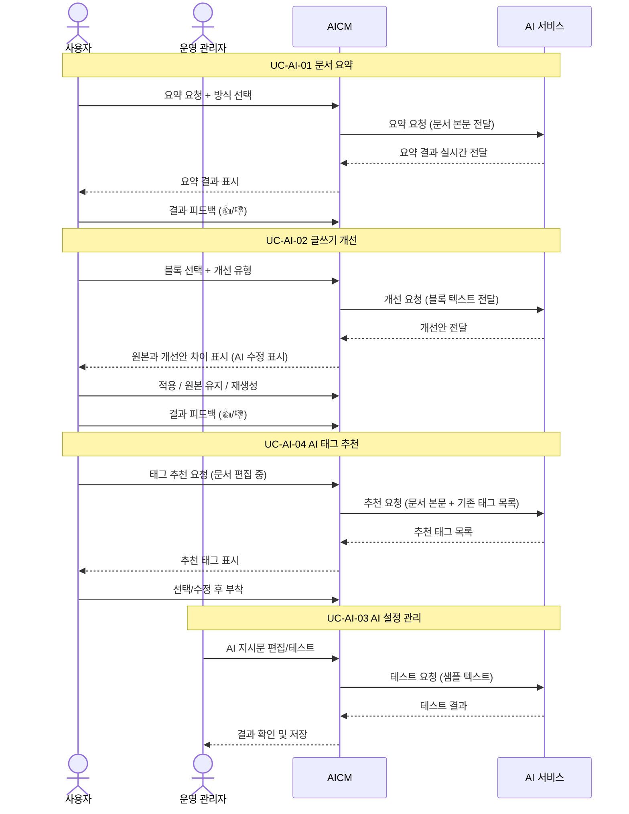
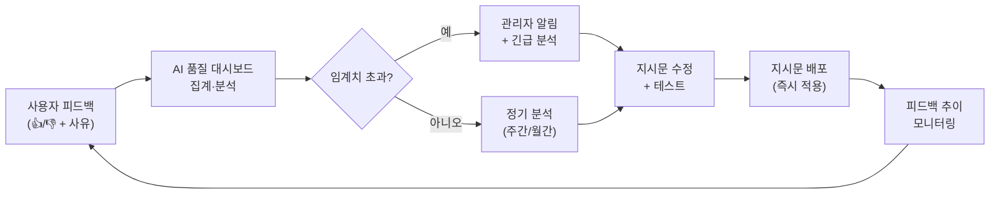

# AI 어시스턴트 유즈케이스

## 비즈니스 목표

AI 어시스턴트는 다음 비즈니스 목표를 달성하기 위해 도입된다:

- **문서 파악 시간 단축**: 상담사가 긴 운영 문서를 빠르게 파악할 수 있도록 AI 요약을 제공하여, 고객 응대 준비 시간을 줄인다.
- **문서 품질 편차 감소**: AI 글쓰기 개선으로 작성자별 문체·품질 차이를 줄여, 일관된 품질의 지식 문서를 유지한다.
- **태그 품질 유지**: AI 태그 추천으로 기존 태그 재사용을 유도하여, 중복·유사 태그 생성을 억제하고 검색 정확도를 높인다.
- **AI 운영 통제**: 관리자가 AI 기능별 지시문을 직접 편집·테스트할 수 있어, 금융 규정에 맞는 AI 응답 품질을 유지한다.
- **AI 투명성 보장**: AI가 수정·생성한 부분을 명확히 표시하고, 수정 전후 원본을 보관하여 감사 추적과 품질 관리를 가능하게 한다.

---

## 개요 다이어그램

---

## UC-AI-01: AI 문서 요약

> 관련 기능정의서: [FD-AI](../../features/FD-AI-AI어시스턴트.md) §1

**사용자**: 상담사, 지식 관리자

**사전 조건**:
- 사용자가 시스템에 로그인되어 있어야 한다.
- 문서가 "게시됨" 상태여야 한다.
- 해당 문서에 대한 열람 권한이 있어야 한다.
- 조직 설정에서 AI 요약 기능이 활성화되어 있어야 한다.

**기본 흐름 (직접 요약 요청)**:
1. 사용자가 문서 열람 페이지에서 "AI 요약" 버튼을 클릭한다.
2. 시스템이 요약 방식 선택 목록을 표시한다:
   - **한줄 요약**: 문서 내용을 한 문장으로 요약
   - **핵심 포인트**: 중요한 내용을 목록으로 정리
   - **섹션별 요약**: 각 섹션(구역)을 나누어 요약
   - **맞춤 요약**: 사용자가 원하는 방식을 직접 입력하여 요약 요청
3. 사용자가 요약 방식을 선택한다.
4. 시스템이 AI 서비스에 요약을 요청한다.
5. 시스템이 AI 응답을 실시간으로 화면에 표시한다 (글자가 순차적으로 나타남).
6. 요약이 완료되면 시스템이 AI 응답의 신뢰도를 함께 표시한다:
   - **높음** (초록색 표시): AI가 문서 원문에 충실하게 요약한 경우 — "이 요약은 원문 기반으로 생성되었습니다"
   - **중간** (주황색 표시): 일부 내용이 추론으로 보충된 경우 — "일부 내용은 AI가 보충했을 수 있습니다. 원문을 함께 확인해 주세요"
   - **낮음** (붉은색 표시): 문서 분량이 짧거나 내용이 모호하여 정확도가 떨어질 수 있는 경우 — "요약 정확도가 낮을 수 있습니다. 반드시 원문을 확인해 주세요"
   신뢰도 기준은 관리자가 AI 설정(UC-AI-03)에서 조정할 수 있다.
7. 사용자가 결과에 대해 👍(도움됨) 또는 👎(도움 안 됨)으로 피드백을 제공한다.
8. 시스템이 AI 사용 이력(요약 유형, 문서 ID, 신뢰도, 피드백 결과)을 기록한다.

**대안 흐름**:
- **1a. AI 기능이 비활성화된 경우**: 조직 설정에서 AI 요약 기능이 꺼져 있으면 "AI 요약" 버튼이 표시되지 않는다.
- **4a. AI 서비스 응답 지연**: 요약 생성이 설정된 시간 이상 걸리면 "요약을 생성하고 있습니다. 잠시만 기다려 주세요" 안내와 함께 진행 표시가 나타난다. 사용자는 대기 중 취소할 수 있다.
- **4b. AI 서비스 장애**: AI 서비스에 연결할 수 없는 경우 "현재 AI 요약을 생성할 수 없습니다. 잠시 후 다시 시도해 주세요" 안내가 표시되고, 사용자는 문서 본문을 직접 열람하여 업무를 계속할 수 있다.
- **4c. AI 사용 한도 초과**: 조직의 AI 사용 한도에 도달한 경우 "AI 사용 한도에 도달했습니다. 관리자에게 문의하세요" 안내가 표시된다.
- **4d. 문서가 너무 긴 경우**: 문서 분량이 AI 처리 한도를 초과하면 "문서가 너무 길어 전체 요약이 어렵습니다. 섹션별 요약을 이용해 주세요" 안내가 표시된다.
- **5a. 요약 결과가 원본과 의미가 다른 경우 (사실 오류)**: 요약 결과 아래에 "AI가 생성한 요약은 원본과 다를 수 있습니다. 중요한 내용은 원문을 확인해 주세요" 안내가 항상 표시된다. 사용자가 👎 피드백 시 "사실과 다름"을 사유로 선택할 수 있으며, 해당 피드백은 관리자의 AI 품질 모니터링에 반영된다.
- **5b. 민감 정보가 포함된 문서 (AI 사용 정책 적용)**: 문서에 개인정보 등 민감 정보가 포함된 경우, 시스템이 요약 결과에서 민감 정보를 마스킹 처리하고 "일부 민감 정보는 요약에서 제외되었습니다" 안내를 표시한다. 관리자가 설정한 AI 사용 정책에 따라 민감 문서의 AI 처리가 다음과 같이 제한된다:
  - **AI 처리 제한 등급 1 (경고)**: 민감 정보 포함 가능성을 안내하되 AI 요약을 허용한다. 결과에서 민감 정보가 마스킹 처리된다.
  - **AI 처리 제한 등급 2 (제한)**: 외부 AI 서비스로 문서 내용을 전송하지 않고, 자체 AI 모델이 설정되어 있으면 자체 모델로만 처리한다. 자체 모델이 없으면 "이 문서는 보안 정책상 AI 요약을 사용할 수 없습니다" 안내가 표시된다.
  - **AI 처리 제한 등급 3 (금지)**: 해당 게시판 또는 접근 제한이 설정된 문서에 대해 AI 기능이 완전히 비활성화된다.
  AI 사용 정책(등급 기준, 적용 대상 게시판/문서 유형)은 관리자가 AI 설정(UC-AI-03)에서 관리한다.
- **5c. 자체 설치(오프라인) 환경에서의 AI 기능 대체**: 외부 AI 서비스에 접근할 수 없는 자체 설치 환경에서는 다음과 같이 대체 운영한다:
  - **자체 AI 모델이 설정된 경우**: 자체 모델을 사용하여 요약을 생성한다. 외부 AI와 품질 차이가 있을 수 있으므로 "자체 AI 모델 기반 요약" 표시가 함께 나타난다. 관리자가 자체 모델에 맞게 지시문을 별도 관리한다 (UC-AI-03).
  - **자체 AI 모델이 없는 경우**: AI 요약 버튼 대신 "AI 요약을 사용할 수 없는 환경입니다" 안내가 표시된다. 대체 기능으로 문서의 목차 자동 생성과 본문 첫 N문장 미리보기가 제공되어, AI 없이도 문서 파악이 가능하도록 지원한다.
  - **자체 모델 장애 시**: 자체 AI 모델이 응답하지 않으면 AI 기능이 자동으로 비활성화되고, 관리자에게 알림이 발송된다. 키워드 검색(UC-SCH-01)과 문서 본문 직접 열람으로 업무를 이어갈 수 있다.

**현업 활용 시나리오 — 상담사 통화 중 요약 활용**:
1. 상담사가 고객과 전화 통화 중 관련 문서를 검색한다.
2. 검색 결과 목록에서 문서 미리보기 카드에 자동 생성된 한줄 요약이 표시된다.
3. 상담사가 요약을 보고 적절한 문서인지 빠르게 판단한다.
4. 문서를 열람한 뒤, "핵심 포인트" 요약을 요청하여 통화 중 고객에게 안내할 핵심 내용을 빠르게 파악한다.
5. 통화 종료 후, 요약 품질에 대해 피드백을 제공한다.

**현업 활용 시나리오 — 교대 근무 시 AI 요약 활용**:
1. 야간 교대 상담사가 출근하여 전날 게시된 신규 문서를 빠르게 파악해야 한다.
2. 홈 대시보드(UC-PER-05)에서 구독 게시판의 새 문서 목록을 확인한다.
3. 각 문서의 자동 생성된 한줄 요약을 검색 결과 카드에서 확인하여, 교대 시간 내에 핵심 변경 사항을 파악한다.
4. 상세 확인이 필요한 문서만 열어서 "핵심 포인트" 요약을 요청하여 업무에 반영한다.

**현업 활용 시나리오 — 컴플라이언스 검토 시 AI 요약 활용**:
1. 컴플라이언스 담당자가 대량의 규제 관련 문서를 검토해야 한다.
2. 각 문서에 "섹션별 요약"을 요청하여 문서 전체 구조를 빠르게 파악한다.
3. 요약 결과에서 규제 관련 핵심 조항을 식별하고, 해당 섹션으로 바로 이동하여 상세 검토한다.
4. 검토 완료 후 승인 또는 반려를 처리한다 (UC-APR-02).

**현업 활용 시나리오 — 신규 입사자 AI 요약 활용**:
1. 신규 입사자가 방대한 업무 매뉴얼을 처음 접한다.
2. "핵심 포인트" 요약으로 각 문서의 핵심 내용을 빠르게 파악한다.
3. 이해가 부족한 부분은 "맞춤 요약"으로 "이 문서를 신규 입사자 관점에서 설명해줘"와 같이 요청한다.
4. 요약 결과를 북마크(UC-COM-04)와 함께 저장하여 학습 자료로 재활용한다.

**자동 요약 흐름 (시스템이 자동 처리)**:
1. 문서가 "게시됨" 상태로 전환되면, 시스템이 문서의 검색 반영 작업이 완료된 후 자동 요약 생성 작업을 시작한다.
2. 시스템이 AI 서비스에 한줄 요약을 요청한다.
3. 생성된 요약은 문서 부가 정보로 저장되어 검색 결과 미리보기 카드에 활용된다.
4. 요약 생성에 실패하더라도 문서 게시 자체는 영향을 받지 않으며, 미리보기 카드에는 본문 첫 부분이 표시된다.
5. 문서가 수정되어 새 버전이 게시되면, 기존 자동 요약은 무효화되고 새 요약이 자동으로 생성된다.

**사후 조건**:
- 자동 요약은 문서 부가 정보로 저장되어, 검색 결과 미리보기 등에서 재활용된다.
- 수동 요약은 DB에 저장되어 동일 문서 버전 + 동일 요약 방식 조합이면 저장된 결과를 즉시 반환한다. "재요약" 버튼을 클릭하면 AI를 다시 호출하여 기존 요약을 최신 결과로 갱신한다 (FD-AI 결정사항 M3 — BR-AI-004, BR-AI-005 참조).
- 사용자의 피드백(👍/👎 + 사유)이 AI 사용 이력에 기록된다.
- AI 사용 이력(요청 시각, 요약 유형, 문서 ID, 소요 시간, 피드백)이 감사 추적 로그에 남는다.
- AI 품질 지표(요약 성공률, 평균 응답 시간, 긍정 피드백 비율)가 갱신된다.

---

## UC-AI-02: AI 글쓰기 개선

> 관련 기능정의서: [FD-AI](../../features/FD-AI-AI어시스턴트.md) §2

**사용자**: 지식 관리자, 편집 권한이 있는 게시판의 상담사(△)

> 편집 권한이 없는 상담사는 AI 글쓰기 개선을 사용할 수 없으며, AI 요약(UC-AI-01)만 이용 가능하다.

**사전 조건**:
- 사용자가 블록 편집기에서 문서를 편집 중이어야 한다.
- 사용자에게 해당 게시판의 편집 권한이 있어야 한다.
- 조직 설정에서 AI 글쓰기 개선 기능이 활성화되어 있어야 한다.

**기본 흐름**:
1. 사용자가 블록을 선택한 뒤 다음 중 하나의 방법으로 AI 글쓰기 개선을 시작한다:
   - 편집 도구 모음의 AI 버튼(✨) 클릭
   - 마우스 오른쪽 클릭 메뉴에서 "AI로 개선" 선택
   - `/ai` 명령어 입력
2. 시스템이 개선 유형 목록을 표시한다:
   - **문장 다듬기**: 문법, 어색한 표현 교정
   - **톤 변경**: 말투 변경 (예: 격식체 → 친근한 체)
   - **간결하게**: 불필요한 내용을 줄여 핵심만 남기기
   - **상세하게**: 부족한 설명을 보충하여 더 자세하게
   - **번역**: 다른 언어로 번역
   - **자유 지시**: 사용자가 직접 원하는 방식을 입력
3. 사용자가 개선 유형을 선택한다.
4. 시스템이 AI 서비스에 개선을 요청한다.
5. 시스템이 **원본과 개선안의 차이**를 편집 화면에서 비교하여 표시한다. 추가된 부분, 삭제된 부분, 수정된 부분이 시각적으로 구분된다. 개선안의 신뢰도가 함께 표시된다:
   - **높음** (초록색): 문법 교정, 단순 표현 다듬기 등 원래 의미를 변경하지 않는 수정
   - **중간** (주황색): 문장 구조 변경, 내용 보충 등 의미에 영향을 줄 수 있는 수정 — "수정된 내용이 원래 의미와 일치하는지 확인해 주세요"
   - **낮음** (붉은색): 대폭 재작성, 번역 등 원본과 상당히 다른 결과 — "원본과 상당히 다릅니다. 반드시 내용을 검토해 주세요"
6. 사용자가 다음 중 하나를 선택한다:
   - **"적용"**: 개선안으로 교체
   - **"원본 유지"**: 변경을 취소하고 원래 내용으로 복원
   - **"재생성"**: AI에게 다른 결과를 다시 요청 (4번으로 돌아감)
7. 적용한 경우, 시스템이 원본 내용을 수정 이력으로 보관한다.
8. 사용자가 개선 결과에 대해 👍(도움됨) 또는 👎(도움 안 됨)으로 피드백을 제공한다.
9. 시스템이 AI 사용 이력(개선 유형, 블록 ID, 피드백 결과, AI 수정 전후 내용)을 기록한다.

**대안 흐름**:
- **1a. AI 기능이 비활성화된 경우**: 조직 설정에서 AI 글쓰기 개선 기능이 꺼져 있으면 AI 버튼(✨)이 표시되지 않는다.
- **4a. AI 서비스 응답 지연**: 개선안 생성이 설정된 시간 이상 걸리면 "개선안을 생성하고 있습니다" 안내와 함께 진행 표시가 나타난다. 사용자는 대기 중 취소하고 편집을 계속할 수 있다.
- **4b. AI 서비스 장애**: AI 서비스에 연결할 수 없는 경우 "AI 글쓰기 개선을 사용할 수 없습니다. 잠시 후 다시 시도해 주세요" 안내가 표시되고, 사용자는 수동으로 편집을 계속할 수 있다.
- **4c. AI 사용 한도 초과**: 조직의 AI 사용 한도에 도달한 경우 "AI 사용 한도에 도달했습니다. 관리자에게 문의하세요" 안내가 표시된다.
- **4d. 선택한 블록의 분량 초과**: 선택한 블록의 분량이 AI 처리 한도를 초과하면 "선택한 내용이 너무 깁니다. 범위를 줄여서 다시 시도해 주세요" 안내가 표시된다.
- **5a. 다중 블록 일괄 개선**: 여러 블록을 선택한 경우, 시스템이 선택된 블록을 순서대로 일괄 개선한다. 각 블록마다 원본과 개선안의 차이가 표시되며, 블록별로 적용 여부를 개별 선택하거나 전체 일괄 적용할 수 있다.
- **5b. 전체 문서 개선**: "전체 문서 다듬기"를 선택하면 화면 옆에 비교 패널이 나타나고, 섹션(구역)별로 하나씩 처리하며 각 섹션마다 적용 여부를 선택한다.
- **5c. AI 개선 결과의 품질 저하**: AI 개선 결과가 원본의 의미를 변질시킨 경우, 사용자가 "원본 유지"를 선택하고 👎 피드백 시 "원래 의미가 달라짐"을 사유로 선택할 수 있다. 해당 피드백은 관리자의 AI 품질 모니터링에 반영된다.
- **5d. 민감 정보가 포함된 블록**: 개인정보 등 민감 정보가 포함된 블록에 대해 AI 개선을 요청하면, 시스템이 "민감 정보가 포함되어 있을 수 있습니다. AI 개선 결과에서 민감 정보가 노출되지 않았는지 반드시 확인해 주세요" 안내를 표시한다.
- **6a. 원본 복원 (적용 후 되돌리기)**: 개선안을 적용한 후에도 키보드 단축키(Ctrl+Z)로 원본을 즉시 되돌릴 수 있다. 편집기를 닫기 전까지 복원이 가능하다.
- **6b. 재생성 반복 시 품질 경고**: 같은 블록에 대해 재생성을 설정된 횟수 이상 반복하면 "여러 차례 재생성하면 결과 품질이 저하될 수 있습니다. 자유 지시를 사용하여 구체적으로 요청해 보세요" 안내가 표시된다.
- **6c. 동시 편집 중 AI 적용**: 다른 사용자가 같은 문서를 편집 중인 상태에서 AI 개선을 적용하면, 시스템이 충돌을 감지하여 "다른 사용자가 동일 블록을 수정했습니다. 최신 내용을 확인한 뒤 다시 시도해 주세요" 안내가 표시된다.
- **6d. 자체 설치(오프라인) 환경**: 자체 AI 모델을 사용하는 환경에서는 일부 개선 유형(번역 등)이 지원되지 않을 수 있으며, 지원되지 않는 유형은 선택 목록에서 비활성화 표시된다.

**현업 활용 시나리오 — 승인 검토 시 변경 사항 확인**:
1. 지식 관리자가 문서 작성 중 AI 글쓰기 개선을 여러 블록에 적용한다.
2. 지식 관리자가 승인 요청(UC-APR-01)을 제출한다.
3. 승인권자가 문서 검토 시 버전 diff(UC-DOC-06)를 통해 변경된 블록을 확인한다.
4. 승인권자가 변경 전/후 내용을 비교하여 원래 의미가 보존되었는지 확인한다.
5. 확인 결과에 따라 승인 또는 반려한다.
> AI 수정에 대한 별도 표시는 지원하지 않으며, 버전 diff로 변경 사항을 확인한다 (FD-AI 결정사항 M2).

**현업 활용 시나리오 — 팀 협업 문서 품질 개선 사이클**:
1. 지식 관리자 A가 문서 초안을 작성하고, AI 글쓰기 개선으로 문장을 다듬는다.
2. 승인 요청(UC-APR-01) 시 승인권자 B가 버전 diff를 통해 변경된 블록을 집중 검토한다.
3. B가 일부 변경 내용이 원래 의미를 변질시킨다고 판단하면, 댓글(UC-COM-01)로 수정 요청을 남기고 반려한다.
4. A가 반려 사유를 확인하고, 해당 블록을 원본으로 복원하거나 수동으로 재수정한 뒤 다시 승인을 요청한다.
5. 이 과정에서 버전 이력(UC-DOC-06)으로 변경 사항을 추적할 수 있다.

**현업 활용 시나리오 — 위임/대결 시 대리 작성자의 AI 활용**:
1. 문서 담당자가 부재 중 긴급 수정이 필요한 경우, 대리 작성자가 문서를 수정한다 (UC-DOC-03).
2. 대리 작성자가 원본 문체와 일관성을 유지하기 위해 AI 글쓰기 개선("문장 다듬기", "톤 변경")을 활용한다.
3. 승인권자가 버전 diff를 통해 대리 수정 부분을 확인할 수 있다.

**사후 조건**:
- 적용된 개선 내용은 편집기의 자동 저장에 의해 서버에 반영된다.
- > **AI 수정 추적 미지원**: AI가 수정한 블록에 대한 별도 추적(`ai_touched` 플래그, "AI 수정" 표시 등)은 지원하지 않는다. 승인 워크플로의 버전 diff로 변경 사항을 확인하며, 이것으로 충분하다 (FD-AI 결정사항 M2 — BR-AI-008 참조).
- 사용자의 피드백(👍/👎 + 사유)이 AI 사용 이력에 기록된다.
- AI 사용 이력(요청 시각, 개선 유형, 블록 ID, 소요 시간, 적용 여부, 신뢰도, 피드백)이 감사 추적 로그에 남는다.
- AI 품질 지표(개선 적용률, 원본 유지율, 재생성 비율, 긍정 피드백 비율)가 갱신된다.

---

## UC-AI-03: AI 설정 관리

> 관련 기능정의서: [FD-AI](../../features/FD-AI-AI어시스턴트.md) §3
> 상세 흐름: [UC-ADM-10 AI 설정 관리](../admin/UC-ADM-검색파이프라인.md)

**사용자**: 운영 관리자

**사전 조건**:
- 사용자가 운영 관리자 권한으로 로그인되어 있어야 한다.
- 관리자 설정 화면에 접근할 수 있어야 한다.

**기본 흐름**:
1. 운영 관리자가 관리자 설정 화면에서 "AI 설정 관리" 메뉴를 선택한다.
2. 시스템이 AI 기능별 설정 항목 목록을 표시한다 (요약, 글쓰기 개선, AI 답변 검색, 태그 추천 등).
3. 운영 관리자가 특정 AI 기능의 설정 항목을 선택한다.
4. 시스템이 해당 기능의 현재 지시문과 설정 상태를 표시한다.
5. 운영 관리자가 지시문을 편집한다.
6. 운영 관리자가 "테스트" 버튼을 클릭하고 샘플 텍스트를 입력한다.
7. 시스템이 수정된 지시문으로 AI 서비스에 테스트를 요청하고, 결과를 표시한다.
8. 운영 관리자가 결과를 확인하고 "저장" 버튼을 클릭한다.
9. 시스템이 변경된 지시문을 저장하고, 변경 이력을 기록한다.
10. 저장된 지시문은 해당 AI 기능 호출 시 즉시 적용된다.

> 지시문 편집, 테스트, 이전 버전 복원, 권한 범위 등의 상세 흐름은 **UC-ADM-10(AI 설정 관리)**에서 다룬다.

**대안 흐름**:
- **6a. 테스트 결과가 기대와 다른 경우**: 운영 관리자가 테스트 결과가 불만족스러우면 지시문을 재수정하고 다시 테스트한다 (5~7번 반복).
- **6b. AI 서비스 장애로 테스트 불가**: AI 서비스에 연결할 수 없으면 "현재 AI 서비스에 연결할 수 없어 테스트가 불가합니다" 안내가 표시된다. 운영 관리자는 지시문을 임시 저장하고 나중에 테스트할 수 있다.
- **8a. 지시문 변경이 진행 중인 AI 작업에 미치는 영향**: 지시문을 저장하는 시점에 다른 사용자가 해당 AI 기능을 사용 중인 경우, 현재 진행 중인 요청은 기존 지시문으로 완료되고 이후 새 요청부터 변경된 지시문이 적용된다.
- **8b. 지시문 변경 후 이전 결과와의 일관성**: 지시문 변경 시 시스템이 "지시문을 변경하면 이후 AI 결과가 달라질 수 있습니다. 변경하시겠습니까?" 확인 안내를 표시한다. 운영 관리자가 확인하면 변경이 적용된다.
- **9a. 이전 지시문으로 복원**: 운영 관리자가 변경 이력에서 이전 버전을 선택하여 되돌릴 수 있다 (상세: UC-ADM-10).
- **10a. AI 기능 단계적 비활성화/활성화**: 운영 관리자가 AI 기능을 개별적으로 비활성화/활성화할 수 있어, 장애 시 문제가 되는 기능만 선택적으로 끄고 나머지 기능은 정상 유지할 수 있다.
  - **기능별 개별 제어**: AI 요약, AI 글쓰기 개선, AI 태그 추천, AI 답변 검색을 각각 독립적으로 활성화/비활성화한다. 예: AI 글쓰기 개선에만 장애가 발생하면 해당 기능만 비활성화하고, AI 요약과 AI 답변 검색은 정상 제공한다.
  - **기능 비활성화 시 사용자 안내**: 비활성화된 기능의 버튼은 숨김 처리되고, 해당 기능을 사용하려는 사용자에게 "AI OO 기능이 일시적으로 중단되었습니다. 다른 AI 기능은 정상 이용 가능합니다" 안내가 표시된다.
  - **자동 비활성화 정책**: 특정 AI 기능의 오류율이 관리자가 설정한 임계치(예: 30% 이상)를 초과하면, 시스템이 해당 기능을 자동으로 비활성화하고 관리자에게 알림을 발송한다. 관리자가 원인을 확인하고 수동으로 재활성화한다.
  - **재활성화 시 테스트**: 비활성화된 기능을 재활성화하기 전에, 관리자가 샘플 텍스트로 테스트하여 정상 동작을 확인할 수 있다.
- **10b. AI 사용 정책 관리**: 운영 관리자가 AI 사용 정책을 게시판별·문서 유형별로 설정할 수 있다:
  - **민감 문서 AI 처리 제한**: 개인정보, 금융 정보 등 민감 정보가 포함된 게시판(또는 접근 제한이 설정된 문서)에 대해 AI 처리 제한 등급(경고/제한/금지)을 설정한다 (UC-AI-01 대안 흐름 5b 참조).
  - **AI 사용 가능 기능 제한**: 게시판별로 사용 가능한 AI 기능을 제한할 수 있다. 예: 규정 문서 게시판에서는 AI 글쓰기 개선을 비활성화하여 원문 변경을 방지한다.
  - **AI 결과 필수 검토**: 특정 게시판에서 AI 수정이 적용된 문서는 승인 시 "AI 수정 블록 검토 필수" 표시가 추가되어, 승인권자가 AI 수정 부분을 반드시 확인하도록 한다.
- **10c. 자체 설치(오프라인) 환경에서 AI 모델 설정**: 자체 설치 환경에서는 자체 AI 모델을 지정하고, 모델별 지시문을 별도로 관리할 수 있다. 외부 AI 서비스와 자체 모델의 기능 지원 범위가 다를 수 있으며, 지원되지 않는 기능은 설정 화면에서 비활성 표시된다.

**현업 활용 시나리오 — AI 품질 피드백 사이클 (사용자 피드백 → 관리자 분석 → 지시문 조정 → 품질 개선)**:

AI 품질을 지속적으로 개선하는 피드백 사이클은 다음과 같이 동작한다:

1. **피드백 수집**: 사용자가 AI 결과에 대해 👍/👎 피드백을 제공하면, 피드백 사유(사실과 다름, 원래 의미가 달라짐, 불필요한 변경 등)가 함께 기록된다.
2. **자동 분석**: AI 품질 대시보드에서 기능별·기간별·사유별 피드백 추이가 자동으로 집계된다. 부정 피드백 비율이 설정된 임계치(예: 긍정 비율 60% 미만)를 초과하면 관리자에게 "AI 품질 저하 감지" 알림이 발송된다.
3. **원인 진단**: 운영 관리자가 부정 피드백이 많은 항목의 원본 텍스트와 AI 결과를 비교하여 품질 저하 원인을 진단한다. 시스템이 부정 피드백을 받은 사례를 "품질 개선 대상" 목록으로 자동 추출하여 관리자의 분석을 지원한다.
4. **지시문 조정**: 운영 관리자가 해당 기능의 지시문을 수정한다 (예: 정확성 강조 문구 추가, 용어 사용 규칙 보완). 기존 부정 피드백을 받은 원본 텍스트로 수정된 지시문을 테스트하여 개선 여부를 확인한다.
5. **배포 및 모니터링**: 테스트가 만족스러우면 지시문을 저장하여 즉시 적용하고, 이후 1~2주간 피드백 추이를 집중 모니터링한다. 지시문 변경 전후의 피드백 비교 보고서가 자동 생성된다.
6. **정기 점검**: 월별/분기별 AI 품질 보고서를 생성하여, AI 모델 교체·지시문 개선·기능 정책 변경 등 중장기 개선 방향을 수립한다.

**사후 조건**:
- 변경된 지시문이 저장되고, 해당 AI 기능의 다음 호출부터 즉시 적용된다.
- 지시문 변경 이력(변경 시각, 변경자, 변경 전후 내용)이 감사 추적 로그에 기록된다.
- AI 설정 변경 알림이 관련 관리자에게 발송된다.

---

## UC-AI-04: AI 태그 추천

> 관련 기능정의서: [FD-AI](../../features/FD-AI-AI어시스턴트.md) §6

**사용자**: 지식 관리자 (또는 편집 권한이 있는 상담사)

**사전 조건**:
- 사용자가 블록 편집기에서 문서를 편집 중이어야 한다.
- 문서 본문에 태그를 추출할 수 있을 만큼의 내용이 작성되어 있어야 한다.
- 조직 설정에서 AI 태그 추천 기능이 활성화되어 있어야 한다.

**기본 흐름**:
1. 사용자가 태그 입력 영역에서 "AI 태그 추천" 버튼을 클릭한다.
2. 시스템이 문서 본문과 제목을 AI 서비스에 전달하고, **기존 태그 풀에서** 문서에 적합한 태그 후보를 요청한다.
3. AI가 기존 태그 중 문서 내용과 관련성이 높은 태그를 최대 5개 추천한다.
4. 시스템이 추천된 태그를 태그 입력 영역 위에 칩(chip) 형태로 표시한다. 각 태그 옆에 "추가" 버튼이 있다.
5. 사용자가 원하는 태그를 선택하여 문서에 부착하거나, 추천을 무시하고 직접 입력한다.
6. 시스템이 AI 사용 이력(추천 태그 목록, 사용자 선택 결과)을 기록한다.

**대안 흐름**:
- **1a. AI 기능이 비활성화된 경우**: 조직 설정에서 AI 태그 추천 기능이 꺼져 있으면 "AI 태그 추천" 버튼이 표시되지 않는다.
- **2a. AI 서비스 장애**: AI 서비스에 연결할 수 없는 경우 "AI 태그 추천을 사용할 수 없습니다. 직접 태그를 입력해 주세요" 안내가 표시된다.
- **2b. AI 사용 한도 초과**: 조직의 AI 사용 한도에 도달한 경우 "AI 사용 한도에 도달했습니다. 관리자에게 문의하세요" 안내가 표시된다.
- **2c. 본문이 너무 짧은 경우**: 문서 내용이 부족하면 "본문을 좀 더 작성한 후 다시 시도해 주세요" 안내가 표시된다.
- **2d. 문서 분량이 AI 처리 한도 초과**: 문서 분량이 AI 처리 한도를 초과하면 문서 앞부분과 제목을 우선 분석하여 태그를 추천한다.
- **3a. 기존 태그에 적합한 것이 없는 경우**: AI가 기존 태그 중 충분한 매칭이 없으면, 새 태그 후보를 별도 영역("새 태그 제안")에 표시한다. 사용자가 선택하면 새 태그가 생성되어 부착된다.
- **3b. 추천 결과가 부적절한 경우**: 추천된 태그가 문서 내용과 맞지 않으면, 사용자가 "추천 무시"를 선택하고 직접 태그를 입력한다. 시스템은 부적절한 추천 이력을 AI 품질 모니터링에 반영한다.
- **3c. 동일 태그 반복 추천**: 이전에 해당 문서에서 이미 거부한 태그가 다시 추천된 경우, 시스템이 해당 태그를 추천 목록 하단에 "이전에 제외됨" 표시와 함께 낮은 우선순위로 표시한다.
- **4a. 이미 부착된 태그 제외**: 문서에 이미 부착된 태그는 추천 목록에서 자동으로 제외된다.
- **4b. 민감 정보 기반 태그 제한**: 문서에 민감 정보가 포함된 경우, 민감 정보를 직접 드러내는 태그(예: 특정 고객명, 계좌 정보 관련)는 추천에서 제외된다.
- **5a. 자체 설치(오프라인) 환경**: 자체 AI 모델을 사용하는 환경에서는 태그 추천 품질이 다를 수 있으며, 추천 결과에 "자체 AI 모델 기반 추천" 표시가 함께 나타난다.

**사후 조건**:
- 사용자가 선택한 태그가 문서에 부착된다.
- 태그 부착 결과는 편집기의 자동 저장에 의해 서버에 반영된다.
- AI 사용 이력(추천 태그, 선택된 태그, 무시된 태그)이 감사 추적 로그에 기록된다.
- AI 태그 추천 품질 지표(추천 수용률, 무시율)가 갱신된다.

---

## 운영 시나리오

> 아래 시나리오는 UC-AI-01~04 전체에 걸치는 관리자 운영 상황을 다룬다.

### OPS-AI-01: AI 서비스 장애 시 단계적 대응

**사용자**: 운영 관리자

**장애 유형별 대응 전략**:

| 장애 유형 | 영향 범위 | 대응 조치 |
|----------|----------|----------|
| 특정 기능만 장애 (예: 요약만 오류) | 해당 기능 사용 불가 | 해당 기능만 비활성화, 나머지 정상 유지 |
| AI 서비스 응답 지연 | 모든 AI 기능 느려짐 | AI 사용량 제한 강화, 비핵심 기능(전체 문서 개선 등) 우선순위 낮춤 |
| AI 서비스 완전 장애 | 모든 AI 기능 사용 불가 | 전체 AI 기능 비활성화, 대체 기능 안내 |

**완전 장애 시 상세 조치 흐름**:
1. 시스템이 AI 서비스의 장애를 감지하고, 운영 관리자에게 알림을 발송한다.
2. 운영 관리자가 관리자 설정 화면에서 AI 서비스 상태와 장애 유형(특정 기능/전체)을 확인한다.
3. 운영 관리자가 장애 범위에 따라 **단계적 비활성화**를 수행한다 — 장애가 발생한 기능만 선택적으로 비활성화하고, 정상 동작하는 기능은 유지한다.
4. 비활성화된 기능의 버튼은 숨김 처리되고, 사용자에게 "AI OO 기능이 일시적으로 중단되었습니다" 배너를 표시한다. 전체 장애 시에는 "AI 기능이 일시적으로 중단되었습니다. 키워드 검색과 문서 본문 직접 열람으로 업무를 이어가실 수 있습니다" 안내가 표시된다.
5. AI 서비스가 복구되면 운영 관리자가 기능별로 테스트를 수행한 후 순차적으로 재활성화한다.
6. 시스템이 장애 기간 동안 실패한 자동 작업(자동 요약 등)을 일괄 재처리한다.
7. 장애 대응 이력(장애 유형, 비활성화된 기능, 비활성화 기간, 복구 시각)이 감사 로그에 기록된다.

### OPS-AI-02: AI 품질 모니터링 및 지시문 긴급 변경

**사용자**: 운영 관리자

1. 운영 관리자가 AI 품질 대시보드에서 부정 피드백 비율, 사실 오류 신고 건수 등을 확인한다.
2. 특정 AI 기능의 품질 지표가 설정된 임계치를 초과하면, 시스템이 운영 관리자에게 알림을 발송한다.
3. 운영 관리자가 해당 기능의 지시문을 긴급 수정하고 테스트한다.
4. 테스트 결과가 만족스러우면 저장하여 즉시 적용한다.
5. 필요 시 해당 기능을 임시 비활성화하여 추가 피해를 방지한다.

### OPS-AI-03: AI 사용량 급증 시 큐잉/제한 관리

**사용자**: 운영 관리자

1. AI 사용량이 급증하여 응답 시간이 느려지면, 시스템이 운영 관리자에게 알림을 발송한다.
2. 운영 관리자가 AI 사용량 현황 대시보드에서 기능별·시간대별 사용량을 확인한다.
3. 운영 관리자가 AI 사용 한도를 조정하거나, 특정 기능(예: 전체 문서 개선)의 우선순위를 낮추어 핵심 기능(예: 요약, AI 답변 검색)의 응답 시간을 확보한다.
4. 시스템이 한도를 초과한 요청은 대기열에 넣고, 사용자에게 예상 대기 시간을 안내한다.

### OPS-AI-04: AI 모델 교체 시 테스트 → 적용 절차

**사용자**: 운영 관리자, 시스템 관리자

1. 시스템 관리자가 새 AI 모델을 테스트 환경에 설정한다.
2. 운영 관리자가 각 AI 기능(요약, 글쓰기 개선, 태그 추천, AI 답변 검색)별로 기존 지시문을 사용하여 새 모델의 결과를 테스트한다.
3. 운영 관리자가 기존 모델과 새 모델의 결과를 비교하여 품질 차이를 평가한다.
4. 필요 시 새 모델에 맞게 지시문을 조정하고 재테스트한다.
5. 테스트 결과가 만족스러우면, 시스템 관리자가 운영 환경에 새 모델을 적용한다.
6. 운영 관리자가 적용 후 일정 기간 동안 품질 지표를 집중 모니터링한다.
7. 품질 문제가 발견되면 즉시 이전 모델로 되돌린다.

---

## 현업 업무 흐름

> 아래는 AI 어시스턴트 기능이 실제 업무 현장에서 활용되는 대표적인 패턴을 정리한 것이다. 각 시나리오는 위의 UC를 조합하여 구현된다.

### 금융권 문서 작성 시 AI 활용 패턴

금융권에서 고객 응대 문서의 정확성과 일관성이 중요한 환경에서 AI를 활용하는 패턴:

1. 지식 관리자가 상품 안내 문서를 작성할 때, AI 글쓰기 개선(UC-AI-02)으로 금융 전문 용어의 일관된 사용과 문체 통일을 지원받는다.
2. AI 태그 추천(UC-AI-04)으로 기존 태그 체계에 맞는 태그를 부착하여 검색 정확도를 높인다.
3. 승인 검토 시 승인권자가 버전 diff를 통해 변경된 블록을 확인하여, 원래 의미가 보존되었는지 검증한다.
4. 게시 후 자동 생성된 한줄 요약이 검색 결과 카드에 표시되어 상담사의 문서 파악 시간을 단축한다.
5. 규제 변경 시 컴플라이언스 담당자가 AI 요약(UC-AI-01)으로 대량의 관련 문서를 빠르게 검토한다.

> **핵심 가치**: AI가 문서 품질의 편차를 줄이고, 버전 diff와 AI 사용 이력을 통해 감사 추적이 가능하다.

### 교대 근무 환경에서의 AI 활용

24/7 교대 근무 환경에서 AI 기능이 업무 효율을 높이는 패턴:

1. 야간 교대 상담사가 출근 후 신규 게시 문서의 자동 요약을 확인하여 변경 사항을 빠르게 파악한다.
2. 야간 시간대에 고객 문의가 적을 때, AI 답변 검색(UC-SCH-02)을 활용하여 자주 묻는 질문에 대한 답변을 사전에 준비한다.
3. 야간에 AI 서비스 장애가 발생하면, 시스템이 당직 관리자에게 알림을 발송하고 AI 기능을 자동 비활성화한다 (OPS-AI-01).
4. 교대 시 인수인계 문서에 "AI 서비스 상태: 정상/장애" 정보를 포함하여 다음 교대조에 전달한다.

### 신규 입사자 AI 활용 온보딩

1. 신규 입사자가 AI 설정 화면(UC-PER-04)에서 개인 선호를 설정한다 — 요약 방식, 응답 스타일 등.
2. 방대한 업무 매뉴얼을 AI 요약(UC-AI-01)으로 빠르게 파악하고, 이해가 부족한 부분은 AI 답변 검색(UC-SCH-02)으로 질문한다.
3. 문서 작성 시 AI 글쓰기 개선(UC-AI-02)을 활용하여 조직의 문체와 용어 규범에 맞게 문서를 작성한다.
4. AI 태그 추천(UC-AI-04)을 활용하여 기존 태그 체계를 학습하면서 적절한 태그를 부착한다.
5. 관리자가 신규 입사자용 AI 활용 가이드 문서를 별도 제공하여 AI 기능의 효과적인 활용법을 안내한다.

### 규제 대응 — AI 감사 추적 시나리오

금융 감독 기관의 감사에 대비하여 AI 활용 이력을 추적하는 시나리오:

1. 컴플라이언스 담당자가 감사 대상 기간·문서를 지정하여 AI 활용 이력을 조회한다.
2. 특정 문서에 대한 AI 요약 요청 이력, AI 글쓰기 개선 적용 이력, AI 태그 추천 수용 이력이 시간순으로 제공된다.
3. AI 글쓰기 개선 적용 여부는 AI 사용 이력(요청 시각, 개선 유형, 블록 ID, 적용 여부)으로 추적되며, 실제 변경 내용은 버전 diff(UC-DOC-06)를 통해 확인한다. AI 수정에 대한 별도 블록 표시(`ai_touched` 등)는 지원하지 않는다 (FD-AI 결정사항 M2).
4. AI 답변 검색 이력에서 특정 문서가 AI 답변의 출처로 사용된 횟수와 사용자 피드백을 확인한다.
5. AI 사용 정책 위반 이력(민감 문서에 대한 AI 처리 시도 등)을 별도로 추출할 수 있다.
6. 조회 결과를 CSV/PDF로 내보내기하여 감사 증빙 자료로 활용한다.

> **핵심 요구**: AI 사용 이력(요청 시각, 기능 유형, 적용 여부, 피드백)이 감사 추적 로그에 기록되며, 실제 변경 내용은 문서의 버전 이력(UC-DOC-06)을 통해 추적한다. AI 수정에 대한 별도 블록 표시는 지원하지 않으며, 버전 diff로 변경 사항을 확인한다 (FD-AI 결정사항 M2).

### 잘못된 AI 답변 긴급 대응 프로세스

AI가 생성한 답변에 심각한 오류가 포함된 것이 발견된 경우:

1. 상담사가 AI 답변에 "싫어요" + "사실과 다름" 피드백을 제출한다 (UC-SCH-02).
2. 해당 피드백이 설정된 임계치(심각도 기준)를 충족하면 운영 관리자에게 긴급 알림이 발송된다.
3. 운영 관리자가 AI 답변의 출처 문서를 확인한다:
   - **출처 문서의 내용이 잘못된 경우**: 해당 문서를 긴급 회수(UC-DOC-09)하고 수정한다.
   - **AI의 해석이 잘못된 경우**: AI 지시문을 수정(UC-AI-03)하여 유사 오류를 방지한다.
4. 필요 시 해당 AI 기능을 임시 비활성화하여 추가 피해를 방지한다.
5. 해당 문서를 참조한 상담사에게 정정 안내를 발송하고, 고객 재안내 여부를 확인한다.

---

## 확장 운영 시나리오

> 아래는 OPS-AI-01~04에 추가하여, AI 기능 운영에 필요한 세부 시나리오를 정리한 것이다.

### OPS-AI-05: AI 운영 핵심 KPI 및 임계치

운영 관리자가 관리자 대시보드에서 모니터링하는 AI 관련 핵심 지표:

| KPI | 설명 | 임계치 예시 |
|-----|------|------------|
| AI 요약 성공률 | 요약 요청 중 정상 완료된 비율 | 95% 미만 시 경고 |
| AI 글쓰기 개선 적용률 | 개선안 제시 후 사용자가 "적용"을 선택한 비율 | — |
| AI 태그 추천 수용률 | 추천된 태그 중 사용자가 선택한 비율 | — |
| AI 답변 긍정 피드백 비율 | AI 답변에 대한 좋아요 비율 | 60% 미만 시 품질 점검 |
| AI 응답 시간 (p95) | AI 서비스 응답 95번째 백분위 시간 | 요약: 10초, 개선: 8초 초과 시 경고 |
| AI 서비스 가용률 | AI 서비스의 정상 동작 비율 | 99% 미만 시 경고 |
| 일일 AI 사용량 | 기능별 일일 요청 수 | 조직 한도 80% 도달 시 경고 |
| AI 사용 한도 잔여율 | 조직 AI 사용 한도 대비 잔여 비율 | 10% 미만 시 경고 |
| 사실 오류 신고 건수 | AI 답변의 "사실과 다름" 피드백 건수 | 일일 5건 초과 시 긴급 점검 |
| 자동 요약 실패율 | 자동 요약 생성 실패 비율 | 10% 초과 시 경고 |
| AI 사용 이력 기록율 | AI 요청에 대한 사용 이력 기록 비율 | 100% 미만 시 즉시 점검 |
| 낮은 신뢰도 응답 비율 | AI 응답 중 신뢰도 "낮음" 비율 | 20% 초과 시 지시문 점검 |
| AI 사용 정책 위반 건수 | 민감 문서에 대한 AI 처리 제한 위반 시도 건수 | 일일 3건 초과 시 검토 |
| 피드백 사이클 개선 효과 | 지시문 변경 전후 긍정 피드백 비율 변화 | — |

임계치를 초과하면 운영 관리자에게 설정된 채널(이메일, 메신저 등)로 알림이 발송된다.

### OPS-AI-06: AI 긴급 조치 도구

운영 관리자가 AI 관련 장애·긴급 상황에서 사용할 수 있는 관리 도구:

| 도구 | 설명 | 사용 시나리오 |
|------|------|-------------|
| AI 기능별 활성화/비활성화 | 특정 AI 기능만 선택적으로 비활성화 | 특정 기능 장애 시 나머지 기능 유지 |
| AI 지시문 긴급 롤백 | 지시문을 이전 버전으로 즉시 되돌림 | 지시문 변경 후 품질 저하 시 |
| AI 캐시 초기화 | AI 응답 캐시를 초기화 | 캐시된 오래된 AI 응답 제거 |
| 자동 요약 일괄 재처리 | 실패한 자동 요약을 일괄 재생성 | AI 서비스 장애 복구 후 |
| AI 사용 한도 긴급 조정 | 조직 AI 사용 한도를 임시 증가/감소 | 사용량 급증 또는 비용 통제 |
| AI 답변 출처 매핑 재검증 | AI 답변과 출처 문서 간 매핑 정합성 검증 | 출처 문서 대량 변경/삭제 후 |
| AI 품질 피드백 리포트 | 기간별 피드백 분석 보고서 생성 | 정기 품질 점검, 모델 교체 평가 |
| AI 사용 정책 일괄 변경 | 게시판별 AI 사용 정책을 일괄 변경 | 규제 변경 시 민감 문서 AI 제한 강화 |
| AI 사용 이력 일괄 조회 | 특정 기간·문서의 AI 사용 이력 일괄 추출 | 감사 대비 증빙 자료 준비 |

### OPS-AI-07: AI 장애 에스컬레이션 흐름

1. **자동 감지**: 시스템이 AI 서비스 응답시간 증가·오류율 급증·가용률 저하를 감지한다.
2. **1차 알림**: 운영 관리자에게 장애 알림이 발송된다 (발생 시각, 영향 기능, 영향 사용자 수).
3. **1차 조치**: 운영 관리자가 해당 AI 기능을 임시 비활성화하고, 사용자에게 "AI 기능이 일시 중단되었습니다" 배너를 표시한다.
4. **2차 에스컬레이션**: 설정된 시간(예: 15분) 내 해소되지 않으면 시스템 관리자에게 알림이 발송된다.
5. **3차 에스컬레이션**: 설정된 시간(예: 30분) 내 해소되지 않으면 경영진과 AI 서비스 제공사에 동시 보고한다.
6. 장애 복구 후:
   - 운영 관리자가 테스트를 수행하여 정상 동작을 확인한다.
   - AI 기능을 재활성화한다.
   - 장애 기간 중 실패한 자동 작업(자동 요약 등)을 일괄 재처리한다.
7. 장애 해소 후 관리자가 장애 보고서를 작성하여 재발 방지 대책을 수립한다.

### OPS-AI-08: 유지보수 모드 — 정기 점검 시 AI 기능 제한

1. 점검 시작 전, 운영 관리자가 AI 기능 점검 일정을 사전 공지한다.
2. 점검 중 AI 기능이 비활성화된다:
   - AI 요약, AI 글쓰기 개선, AI 태그 추천 버튼이 숨겨진다.
   - AI 답변 검색이 비활성화되고, 키워드 검색으로 자동 전환을 안내한다.
   - 자동 요약 생성 대기열이 일시 중지된다.
3. 사용자에게 "AI 기능이 시스템 점검으로 일시 중단되었습니다" 배너가 표시된다.
4. 점검 완료 후:
   - AI 기능이 재활성화된다.
   - 중지되었던 자동 요약 대기열이 순차 처리된다.
   - 점검 기간 중 게시된 문서의 자동 요약이 생성된다.

### OPS-AI-09: AI 데이터 정합성 검증

1. 운영 관리자가 관리 화면에서 "AI 정합성 검증" 기능을 실행한다.
2. 시스템이 다음 항목을 자동 검증한다:
   - 게시 문서와 자동 요약 생성 상태의 일치 여부 (자동 요약 미생성 문서 감지).
   - AI 답변 출처 매핑과 실제 문서 상태의 일치 여부 (삭제·회수된 출처 문서 감지).
   - AI 사용 이력과 감사 추적 로그의 일치 여부.
   - AI 지시문 버전과 실제 적용 중인 지시문의 일치 여부.
3. 불일치가 발견되면 관리자에게 보고하고, 자동 수정 또는 수동 조치 대상 목록을 제공한다.
4. 검증 이력이 감사 로그에 기록된다.

### OPS-AI-10: 관리자 조치 이력 관리

운영 관리자가 수행한 모든 AI 관련 조치(기능 활성화/비활성화, 지시문 변경, 모델 교체, 한도 조정, 캐시 초기화 등)는 감사 로그에 자동 기록된다:

- **기록 항목**: 조치 유형, 조치자, 대상 AI 기능, 조치 시각, 조치 사유, 조치 결과, 영향 범위.
- **조회**: 운영 관리자가 관리자 대시보드에서 기간·조치 유형·AI 기능별로 이력을 필터링하여 조회할 수 있다.
- **내보내기**: 조치 이력을 CSV/PDF로 내보내기하여 감사 증빙이나 사후 분석에 활용한다.
- **보관 기간**: AI 관련 조치 이력은 관리자가 설정한 기간(최소 5년 — 금융권 규제 요건) 동안 보관된다.

---

## 관련 문서

| 문서 | 관련 UC |
|------|---------|
| [AI 어시스턴트 기능정의서](../../features/FD-AI-AI어시스턴트.md) | UC-AI-01(§1) · UC-AI-02(§2) · UC-AI-03(§3) · UC-AI-04(§6) |
| [AI 어시스턴트 파이프라인 흐름도](../../flows/ai-assistant/) | UC-AI-01~04 전체 AI 기능 파이프라인 |
| [UC-ADM-10 AI 설정 관리](../admin/UC-ADM-검색파이프라인.md) | UC-AI-03 — 지시문 관리 상세 흐름 |
