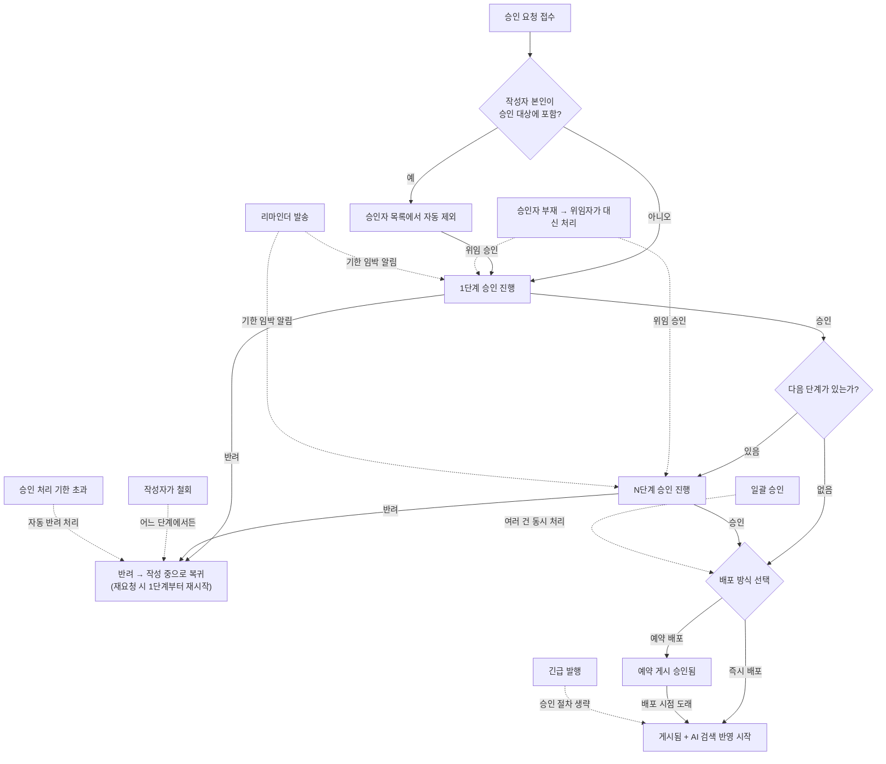

# 승인 워크플로 유즈케이스

> **비즈니스 목표**: 금융권 KMS에서 게시되는 지식 문서의 정확성과 규정 준수를 보장하기 위해, 다단계 승인 절차를 통한 품질 통제와 변경 이력 추적을 제공한다. 이를 통해 내부통제 기준(직무 분리, 승인 이력 보존)을 충족하고, 고객 대응에 사용되는 지식의 신뢰성을 확보한다.

## 개요 다이어그램

> 아래 다이어그램은 문서가 승인 요청부터 최종 게시까지 거치는 과정을 보여줍니다.

---

## UC-APR-01: 승인 요청

**사용자**: 지식 관리자, 편집 권한이 있는 상담사

→ FD-APR 참조

**사전 조건**:
- 문서가 "작성 중" 상태여야 한다.
- 해당 게시판에 승인 정책이 연결되어 있어야 한다.
- 문서의 제목과 본문 등 필수 항목이 모두 입력되어 있어야 한다.

**기본 흐름**:
1. 사용자가 편집기에서 "승인 요청" 버튼을 클릭한다.
2. 시스템이 승인 정책의 1단계 정보를 보여준다.
3. 시스템이 승인자 목록에서 요청자 본인을 자동으로 제외한다 — 요청자 본인이 유일한 승인 대상인 경우 "승인 가능한 승인자가 없습니다" 안내를 표시하고, 승인 요청을 진행할 수 없다.
4. 만약 정책 설정에서 "요청자가 승인자를 직접 선택할 수 있음"으로 되어 있다면, 사용자가 승인 권한을 가진 사람들 중에서 특정 승인자를 선택할 수 있다.
5. 사용자가 참조자(내용을 함께 확인할 사람)를 0~여러 명 추가할 수 있다 (선택 사항). 참조자는 코멘트를 작성할 수 있으나 승인이나 반려 권한은 없다. 참조자가 작성한 코멘트는 승인권자에게 함께 표시된다.
6. 사용자가 요청 사유나 변경 내용 요약 등 코멘트를 입력하고 제출한다.
7. 시스템이 제출 시점의 문서 내용과 첨부파일을 별도 버전으로 자동 보관한다 (나중에 비교 용도로 사용).
8. 문서 상태가 "작성 중" → "검토 대기 중"으로 전환된다.
9. 1단계 승인권자에게 승인 요청 알림이 발송된다. 해당 단계에 위임 설정이 되어 있는 승인자가 있으면, 위임받은 사람에게도 알림이 발송된다.
10. 참조자에게도 알림이 발송된다.

**대안 흐름**:

- **승인이 필요 없는 게시판**: 승인 정책이 연결되지 않은 게시판이나 자유게시판이면, "작성 중" → "게시됨"으로 바로 전환된다.

- **1a. 필수 항목 누락**: 제목이나 본문 등 필수 입력 항목이 비어 있으면 시스템이 "필수 항목을 모두 입력해 주세요" 안내를 표시하고, 미입력 항목을 강조한다. 사용자가 보완한 뒤 다시 요청할 수 있다.

- **1b. 동일 문서에 이미 진행 중인 승인 건이 있는 경우**: 시스템이 "이미 승인 요청 중인 문서입니다" 안내를 표시한다. 기존 승인 건을 철회(UC-APR-03)한 후 다시 요청해야 한다.

- **3a. 승인자 전원이 부재 또는 비활성 상태**: 요청자 본인을 제외한 후 해당 단계의 승인 가능자가 모두 비활성 상태이면, "현재 승인 가능한 승인자가 없습니다. 관리자에게 문의하세요" 안내를 표시한다. 시스템이 운영 관리자에게 "승인자 부재" 알림을 발송한다.

- **6a. 네트워크 장애로 승인 요청 전송 실패**: 제출 시 네트워크 오류가 발생하면 "요청을 처리할 수 없습니다. 네트워크 연결을 확인하세요" 안내를 표시하고, 사용자가 재시도할 수 있다. 입력한 코멘트와 참조자 정보는 유지된다.

- **7a. 첨부파일 용량 제한 초과**: 문서에 포함된 첨부파일이 시스템에서 설정한 용량 한도를 초과하면, "첨부파일 크기가 제한을 초과합니다" 안내를 표시하고 승인 요청을 진행할 수 없다. 사용자가 첨부파일을 정리한 뒤 다시 요청해야 한다.

- **8a. 승인 요청 접수 직후 게시판 승인 정책이 변경된 경우**: 이미 접수된 승인 요청은 요청 시점의 정책을 기준으로 끝까지 진행된다. 변경된 정책은 이후 새로 접수되는 승인 건부터 적용된다.

**사후 조건**:
- 문서가 "검토 대기 중" 상태가 된다.
- 문서 수정이 잠긴다 (수정이 필요하면 승인 요청을 철회한 후 재편집해야 한다).
- 검색 및 AI 답변 검색에는 아직 반영되지 않는다.
- 감사 로그에 승인 요청 기록이 남는다 (요청자, 문서명, 요청 시점, 적용된 승인 정책, 코멘트 요약).
- 승인 통계에 반영된다 (요청 건수, 승인 소요 시간 추적 시작).
- 작성자의 마이페이지 "내 승인 요청" 목록에 추가된다.

---

## UC-APR-02: 승인/반려 처리

**사용자**: 승인권자 (또는 위임받은 사용자)

→ FD-APR 참조

**사전 조건**:
- 승인 요청이 도착한 문서가 존재한다.
- 사용자가 해당 게시판에 승인 권한을 가지고 있으며, 현재 단계의 승인자로 지정되어 있다 (또는 해당 승인자로부터 위임을 받은 상태이다).

**기본 흐름 (승인하는 경우)**:
1. 승인권자가 승인 대기 목록이나 알림을 통해 문서 검토 화면에 들어간다.
2. 시스템이 문서 본문과 이전 버전과의 변경사항 비교 화면을 제공한다. 참조자가 작성한 코멘트가 있으면 함께 표시된다.
   > AI 수정 추적은 별도 지원하지 않으며, 버전 diff로 변경 사항을 확인한다 (FD-AI 결정사항 M2 — BR-AI-008 참조).
3. 승인권자가 내용을 검토하고 코멘트를 작성한 뒤 "승인"을 클릭한다.
4. **다음 단계가 있는 경우**: 현재 단계를 승인 처리하고 다음 단계 승인권자에게 알림을 발송한다. 요청자에게는 "N단계 승인 완료" 알림이 전달된다.
5. **마지막 단계인 경우**: 문서가 "게시됨"으로 전환되고, 정식 버전이 생성되며, AI가 이 문서를 검색에 활용할 수 있도록 변환하는 작업이 시작된다.

**대안 흐름 (반려하는 경우)**:
1. 승인권자가 반려 사유를 작성하고 "반려"를 클릭한다.
2. 시스템이 승인 건 전체를 반려 처리한다 — 승인 방식에 따라 반려 판정 규칙이 달라진다:
   - **"누구든 한 명만 승인하면 통과" 방식**: 전원이 반려해야 최종 반려
   - **"전원 승인해야 통과" 방식**: 1명이라도 반려하면 즉시 최종 반려
   - **"N명 이상 승인하면 통과" 방식**: 정해진 인원이 충족되지 않으면 즉시 최종 반려
3. 문서 상태가 "작성 중"으로 복귀한다. 반려 후 재요청 시에는 항상 1단계부터 다시 시작한다 (감사 추적의 명확성을 위해 부분 재개는 지원하지 않는다).
4. 작성자에게 반려 사유와 함께 알림이 발송된다.

**대안 흐름 (관리자가 대리 승인하는 경우)**:
- 운영 관리자가 해당 게시판의 권한을 보유한 경우, 원래 지정된 승인자가 아니더라도 모든 단계에서 승인이 가능하다 — 이 경우 감사 로그(시스템에 자동으로 남는 변경 이력 기록)에 대리 승인 기록이 남는다.

**대안 흐름 (위임받은 사용자가 처리하는 경우)**:
- 원래 승인자가 위임을 설정한 경우(UC-APR-06 참조), 위임받은 사용자가 해당 단계의 승인 또는 반려를 처리할 수 있다 — 감사 로그에 "OO(위임자)이 OO(원래 승인자) 대신 처리함" 기록이 남는다.

**대안 흐름 (동시 처리 충돌)**:
- **같은 단계를 두 승인권자가 동시에 처리하는 경우**: 먼저 처리한 쪽의 결과가 반영되고, 나중에 처리한 쪽에는 "이미 처리된 건입니다" 안내가 표시된다. 정확한 처리 결과를 시스템이 보장한다.

**대안 흐름 (예약 배포를 선택하는 경우)**:
- 승인 시 "예약 배포"를 선택하면 → 배포할 날짜와 시간을 지정 → 문서가 "예약 게시 승인됨" 상태로 전환 → 지정한 시점에 자동으로 "게시됨"으로 전환되고 AI 검색 데이터 변환이 실행된다.

**대안 흐름 (승인 처리 기한(SLA) 초과 시 자동 반려)**:
- 승인 정책에 SLA(`sla_hours`)가 설정된 경우, 승인 처리 기한 초과 시 자동 반려를 실행한다:
  1. **자동 반려 (SLA + 유예 기간 경과)**: 승인 요청 시점 기준으로 `sla_hours`가 경과한 뒤, 추가 유예 기간(기본 24시간) 내에도 처리되지 않으면 시스템이 해당 승인 건을 자동 반려 처리한다.
  2. 작성자에게 "승인 기한 초과로 자동 반려되었습니다" 알림이 발송된다. 해당 단계 승인권자에게도 "미처리로 자동 반려됨" 알림이 발송된다.
  3. 작성자는 문서를 확인한 뒤 재요청할 수 있다 (1단계부터 재시작).
  - 시스템 점검(유지보수 모드) 기간 동안 SLA 타이머가 일시 정지된다 — 점검 시간이 SLA에 산입되지 않는다.
  - 자동 반려 이력이 감사 로그에 기록된다.
  > **단계별 리마인더(50%/75%) 및 상위 에스컬레이션은 Phase 2 예정** (FD-APR §12 참조). Phase 1에서는 SLA 타임아웃 기반 자동 반려까지만 지원한다.

**대안 흐름 (승인자 탈퇴/비활성화)**:
- 진행 중인 승인 건에서 지정된 승인자가 퇴사하거나 계정이 비활성화된 경우:
  - 해당 단계에 다른 승인 가능자가 남아 있으면 나머지 승인자로 계속 진행한다.
  - 승인 가능자가 아무도 없으면 관리자에게 "승인 가능한 승인자가 없습니다" 알림이 발송되고, 관리자가 대리 승인으로 처리한다.

**대안 흐름 (복수 승인자 의견 충돌 시 해결)**:
- 같은 단계에 복수 승인자가 배정되어 있고 의견이 나뉘는 경우(일부 승인, 일부 반려), 승인 방식에 따라 다음과 같이 해결된다:
  - **"전원 승인해야 통과" 방식**: 1명이라도 반려하면 즉시 최종 반려된다. 승인한 승인자에게 "다른 승인자의 반려로 해당 건이 최종 반려되었습니다" 알림이 발송된다.
  - **"N명 이상 승인하면 통과" 방식**: 승인과 반려를 모두 집계하여, 승인이 N명에 도달하면 통과하고 반려가 (전체 - N + 1)명에 도달하면 최종 반려된다. 판정이 확정되지 않은 동안에는 미처리 승인자에게 "현재 승인 N건, 반려 M건 — 처리를 기다리고 있습니다" 현황이 표시된다.
  - **"누구든 한 명만 승인하면 통과" 방식**: 1명이 승인하면 즉시 통과된다. 반려만 하면 전원 반려 시 최종 반려된다.
- 의견이 갈린 경우 모든 승인자의 코멘트(승인 사유, 반려 사유)가 문서의 승인 이력에 기록되어, 작성자와 관리자가 각 승인자의 의견을 확인할 수 있다.
- 관리자가 승인 이력에서 의견 충돌 건을 별도로 추출하여, 승인 정책 개선에 활용할 수 있다.

**대안 흐름 (승인 완료 후 배포 전 최종 확인)**:
- 마지막 단계 승인이 완료된 후, 게시판 정책에 "배포 전 최종 확인"이 설정되어 있는 경우:
  1. 문서가 바로 "게시됨"으로 전환되지 않고, "승인 완료 — 배포 확인 대기" 상태가 된다.
  2. 작성자에게 "승인이 완료되었습니다. 최종 내용을 확인하고 '배포 확인'을 클릭하세요" 알림이 발송된다.
  3. 작성자가 최종 게시 내용(본문, 첨부파일, 태그, 유효기간 등)을 확인하고 "배포 확인" 버튼을 클릭한다.
  4. 시스템이 문서를 "게시됨"으로 전환하고 검색에 반영한다.
  5. 작성자가 확인 과정에서 오류를 발견하면, "배포 취소" 버튼을 클릭하여 문서를 "작성 중"으로 되돌리고 수정 후 재승인할 수 있다.
  6. 배포 확인 기한(관리자 설정, 예: 48시간)이 지나도 확인하지 않으면, 관리자에게 "배포 확인 미처리" 알림이 발송된다.
- 이 단계는 게시판별로 활성화/비활성화할 수 있으며, 비활성화된 게시판은 승인 완료 즉시 배포된다.

**대안 흐름 (일괄 승인)**:
- 승인권자가 승인 대기 목록에서 여러 건의 문서를 선택하고 "일괄 승인"을 실행할 수 있다.
  1. 승인권자가 승인 대기 목록에서 승인할 문서를 복수 선택한다.
  2. 공통 코멘트를 입력하거나 코멘트 없이 "일괄 승인"을 클릭한다.
  3. 시스템이 선택된 문서를 순차적으로 승인 처리한다.
  4. 처리 결과를 요약하여 보여준다 — 성공 건수, 실패 건수(이미 철회된 건 등), 다음 단계로 넘어간 건수.
  5. 각 문서의 작성자에게 개별적으로 승인 알림이 발송된다.
- 일괄 반려도 동일한 방식으로 수행할 수 있다 (반려 사유는 공통으로 입력하거나 건별로 다르게 입력 가능).

**대안 흐름 (승인 촉구 리마인더)**:
- 작성자가 승인 대기 중인 문서에 대해 승인권자에게 리마인더를 수동으로 발송할 수 있다.
  1. 작성자가 승인 대기 중인 문서에서 "승인 촉구" 버튼을 클릭한다.
  2. 시스템이 해당 단계 승인권자(위임자 포함)에게 "작성자가 승인 검토를 요청했습니다" 알림을 발송한다.
  3. 리마인더 발송 이력이 기록되며, 같은 단계에서 리마인더를 다시 보내려면 관리자가 설정한 최소 간격(예: 1일)이 지나야 한다.
- 시스템이 승인 처리 기한의 일정 비율(예: 50%, 75%)이 경과하면 자동으로 리마인더 알림을 발송한다.

**대안 흐름 (승인 진행 중 해당 문서가 긴급 회수된 경우)**:
- 운영 관리자가 승인 대기 중인 문서에 대해 긴급 회수(UC-DOC-09)를 실행하면:
  1. 진행 중인 승인 건이 자동으로 취소된다.
  2. 승인권자에게 "해당 문서가 긴급 회수되어 승인 요청이 취소되었습니다" 알림이 발송된다.
  3. 작성자에게도 "긴급 회수로 인해 승인 요청이 취소되었습니다" 알림이 발송된다.
  4. 감사 로그에 "긴급 회수에 의한 승인 취소" 기록이 남는다.

**대안 흐름 (다단계 승인에서 중간 단계 승인자 전원이 비활성화된 경우)**:
- 다단계 승인 진행 중 특정 단계의 승인 가능자가 전원 퇴사하거나 비활성화되어 해당 단계를 진행할 수 없는 경우:
  1. 시스템이 "N단계 승인을 처리할 수 있는 사용자가 없습니다" 알림을 운영 관리자에게 발송한다.
  2. 운영 관리자가 해당 단계에 새 승인자를 배정하거나, 대리 승인으로 해당 단계를 처리한다.
  3. 승인 처리 기한은 관리자가 조치를 완료할 때까지 일시 정지되며, 자동 반려가 발동되지 않는다.

**사후 조건 (승인이 완료된 경우)**:
- 문서가 "게시됨" 상태가 된다.
- 키워드 검색에 즉시 반영된다.
- AI가 이 문서를 검색에 활용할 수 있도록 변환하는 작업이 시작된다 (변환이 완료되면 AI 답변 검색에도 반영된다).
- AI 자동 요약 생성 작업이 시작된다.
- 이전에 게시된 버전이 있으면 "보관됨" 상태로 전환된다.
- 감사 로그에 승인/반려 처리 기록이 남는다 (처리자, 처리 유형, 코멘트, 위임 여부, 대리 승인 여부).
- 승인 소요 시간 통계에 반영된다 (요청 시점 ~ 최종 승인 완료까지).
- 해당 게시판 구독자에게 "새 문서가 게시되었습니다" 알림이 발송된다.

**사후 조건 (반려된 경우)**:
- 문서가 "작성 중" 상태로 복귀하고, 작성자가 문서를 수정할 수 있다.
- 감사 로그에 반려 기록이 남는다 (반려자, 반려 사유, 반려 시점).
- 승인 통계에 반려 건수가 반영된다.
- 작성자에게 반려 알림이 발송된다.

---

## UC-APR-03: 승인 요청 철회

**사용자**: 지식 관리자, 편집 권한이 있는 상담사

→ FD-APR 참조

**사전 조건**:
- 사용자가 작성한 문서의 승인 요청이 진행 중이어야 한다 ("검토 대기 중" 상태).
- 아직 최종 승인 또는 최종 반려가 완료되지 않은 상태여야 한다.

**기본 흐름**:
1. 사용자가 승인 대기 중인 문서에서 "철회" 버튼을 클릭한다.
2. 시스템이 확인 대화상자를 표시한다.
3. 사용자가 확인하면 승인 건이 철회 상태로 전환되고, 문서가 "작성 중"으로 복귀한다.
4. 승인권자에게 "작성자가 승인 요청을 철회했습니다" 알림이 발송된다.
5. 참조자에게도 철회 알림이 발송된다.

**대안 흐름**:

- **3a. 이미 일부 단계가 승인 완료된 상태에서 철회**: 다단계 승인 중 일부 단계가 이미 승인된 상태에서도 작성자가 철회할 수 있다. 이 경우 이미 완료된 단계의 승인 기록은 이력으로 보관되며, 재요청 시에는 1단계부터 다시 시작한다.

- **3b. 철회 요청과 승인 처리가 동시에 발생**: 작성자가 철회를 시도하는 시점에 승인권자가 마지막 단계 승인을 처리한 경우, 먼저 완료된 쪽의 결과가 반영된다. 승인이 먼저 완료되었으면 "이미 승인이 완료되어 철회할 수 없습니다" 안내가 표시된다.

- **3c. 네트워크 장애로 철회 요청 실패**: 철회 요청 전송 중 네트워크 오류가 발생하면 "요청을 처리할 수 없습니다. 네트워크 연결을 확인하세요" 안내를 표시하고, 사용자가 재시도할 수 있다.

- **3d. 긴급 발행 건의 철회 시도**: 긴급 발행(UC-APR-04)으로 이미 게시된 문서는 철회 대상이 아니다. "이미 게시된 문서입니다. 회수가 필요하면 긴급 회수 기능을 사용하세요" 안내가 표시된다.

- **3e. 예약 배포 승인 건의 철회**: "예약 게시 승인됨" 상태의 문서는 작성자가 직접 철회할 수 없다. 승인권자나 관리자가 예약 취소(UC-APR-05 참조)를 수행해야 하며, 그 후 작성자가 문서를 수정하고 재요청할 수 있다.

- **3f. 반복 철회/재요청 이력 관리**: 동일 문서에 대해 여러 차례 승인 요청과 철회가 반복되면, 시스템이 각 요청과 철회의 이력을 모두 보관한다. 관리자는 해당 문서의 승인 이력에서 요청/철회/반려 횟수를 확인할 수 있다.

**사후 조건**:
- 문서가 "작성 중" 상태로 복귀하고, 작성자가 문서를 수정할 수 있다.
- 철회 이력이 승인 기록에 남는다.
- 감사 로그에 철회 기록이 남는다 (철회자, 철회 시점, 철회 시 진행 단계).
- 해당 문서가 승인권자의 승인 대기 목록에서 제거된다.
- 작성자는 문서를 수정한 뒤 새로운 승인 요청을 다시 할 수 있다 (재요청 시 1단계부터 시작한다).
- 승인 통계에 철회 건수가 반영된다.

---

## UC-APR-04: 긴급 발행 (승인 없이 바로 게시)

**사용자**: 운영 관리자 (긴급 발행 권한 필요)

→ FD-APR 참조

**사전 조건**:
- 장애 공지, 긴급 상품 변경 등 승인 절차를 기다릴 수 없는 긴급 상황이어야 한다.
- 사용자에게 해당 게시판의 긴급 발행 권한이 부여되어 있어야 한다.

**기본 흐름**:
1. 권한자가 승인 대기 중인 문서 또는 새 문서에서 "긴급 발행"을 실행한다.
2. 시스템이 긴급 발행 사유 입력을 요구한다 (최소 10글자 이상).
3. 사유를 입력하고 확인하면, 승인 절차를 건너뛰고 즉시 "게시됨"으로 전환된다.
4. AI가 이 문서를 검색에 활용할 수 있도록 변환하는 작업이 시작된다.
5. 모든 관리자에게 "OO 문서가 승인 절차 없이 긴급 발행되었습니다" 알림이 발송된다.

**대안 흐름 (사후 검토)**:
- 긴급 발행된 문서는 관리자가 설정한 기한(N일) 이내에 사후 승인을 완료해야 한다.
  1. 시스템이 긴급 발행 직후 해당 게시판의 승인권자에게 "긴급 발행 문서에 대한 사후 검토가 필요합니다" 알림을 발송한다.
  2. 승인권자가 문서를 검토하고 사후 승인 또는 반려를 처리한다.
  3. **사후 승인 완료**: 감사 로그에 "사후 승인 완료" 기록이 남고, 문서가 정상 게시 상태를 유지한다.
  4. **사후 반려**: 문서가 "일시 중단됨" 상태로 전환되고, 작성자에게 반려 사유와 함께 알림이 발송된다. 작성자는 문서를 수정한 뒤 정상 승인 절차(UC-APR-01)를 통해 재게시해야 한다.
  5. 사후 검토 기한 내에 승인이 완료되지 않으면, 시스템이 관리자에게 "긴급 발행 문서 사후 검토 미완료" 알림을 발송한다. 이후에도 미처리 시 상위 관리자에게 단계별 알림이 발송된다.

**대안 흐름 (권한 없는 사용자의 긴급 발행 시도)**:
- 긴급 발행 권한이 없는 사용자가 긴급 발행을 시도하면 "긴급 발행 권한이 없습니다. 운영 관리자에게 요청하세요" 안내가 표시된다.

**대안 흐름 (승인 대기 중인 문서의 긴급 발행)**:
- 이미 정상 승인 절차가 진행 중인 문서에 대해 긴급 발행을 실행하면:
  1. 진행 중인 승인 건이 자동으로 취소된다.
  2. 관련 승인권자에게 "해당 문서가 긴급 발행 처리되어 승인 요청이 취소되었습니다" 알림이 발송된다.
  3. 감사 로그에 "기존 승인 건 취소 → 긴급 발행" 기록이 남는다.

**대안 흐름 (이미 게시된 문서의 긴급 발행)**:
- 이미 게시 중인 문서를 긴급 발행 대상으로 선택하면, "이미 게시된 문서입니다. 문서를 수정하려면 새 버전을 생성하세요" 안내가 표시된다.

**대안 흐름 (네트워크 장애)**:
- 긴급 발행 요청 전송 중 네트워크 오류가 발생하면 "요청을 처리할 수 없습니다. 네트워크 연결을 확인하세요" 안내를 표시한다. 긴급 상황이므로, 네트워크 복구 후 즉시 재시도할 수 있도록 입력한 사유가 유지된다.

**대안 흐름 (동시에 여러 문서를 긴급 발행)**:
- 동일 시간대에 여러 문서를 순차적으로 긴급 발행할 수 있다. 각 문서마다 개별 사유를 입력해야 하며, 감사 로그에 각 건이 별도로 기록된다.

**사후 조건**:
- 문서가 즉시 "게시됨" 상태가 된다.
- 감사 로그(시스템에 자동으로 남는 변경 이력 기록)에 "승인 우회 긴급 발행" 기록이 남는다.
- 승인 기록에 긴급 발행 여부와 사유가 기록된다.
- 사후 검토 기한(관리자 설정)이 시작된다 — 기한 내 사후 승인이 완료되지 않으면 관리자에게 미완료 알림이 발송된다.
- 관리자 대시보드의 "긴급 발행 현황" 항목에 반영된다.
- 해당 게시판 구독자에게 게시 알림이 발송된다.
- 승인 통계에 긴급 발행 건수가 별도 집계된다.

---

## UC-APR-05: 예약 배포 설정

**사용자**: 승인권자 (마지막 단계 승인 시), 운영 관리자 (대리 승인 시)

→ FD-APR 참조

**사전 조건**:
- 문서의 마지막 단계 승인을 처리하는 시점이어야 한다.
- 예약 시점은 현재 시각 이후여야 한다.

**기본 흐름**:
1. 승인권자가 승인 시 "예약 배포"를 선택한다.
2. 배포할 날짜와 시간을 지정한다.
3. 문서가 "예약 게시 승인됨" 상태로 전환된다 — 이 상태에서는 검색이나 AI 답변 검색에 아직 반영되지 않는다.
4. 화면에 "승인됨 · YYYY-MM-DD HH:mm 배포 예정"이라고 표시된다.
5. 예약된 시점이 되면 시스템이 자동으로 "게시됨"으로 전환하고 AI 검색 데이터 변환을 실행한다.
6. 배포가 완료되면 작성자에게 알림이 발송된다.

**대안 흐름**:

- **예약 취소**: 승인권자나 관리자가 예약을 취소하면 문서가 "작성 중"으로 복귀하고, 작성자에게 알림이 발송된다.

- **예약 시간 변경**: 배포 시간을 변경하면 시스템이 새로운 시간으로 예약을 다시 설정한다. 변경 이력이 감사 로그에 남는다.

- **자동 배포 실패 시**: 시스템 장애 등으로 배포에 실패하면 최대 3회까지 자동 재시도하고, 최종 실패 시 관리자에게 알림이 발송된다.

- **2a. 과거 시점으로 예약 시도**: 현재 시각보다 이전 시점을 지정하면 "예약 시간은 현재 시각 이후여야 합니다" 안내를 표시하고, 사용자가 시간을 다시 선택하도록 한다.

- **5a. 예약 시점에 시스템 점검이 진행 중인 경우**: 예약된 배포 시점에 시스템 점검이 진행 중이면, 시스템이 점검 완료 직후 자동으로 배포를 실행한다. 관리자에게 "시스템 점검으로 인해 OO 문서의 예약 배포가 지연되었습니다" 알림이 발송된다.

- **예약 대기 중 문서가 긴급 회수된 경우**: 관리자가 예약 대기 중인 문서를 긴급 회수(UC-DOC-09)하면, 예약이 자동 취소되고 문서가 "긴급 회수됨" 상태로 전환된다. 승인권자와 작성자에게 "긴급 회수로 인해 예약 배포가 취소되었습니다" 알림이 발송된다.

- **동일 시간대 대량 예약 배포**: 같은 시간에 다수의 문서가 예약 배포되어 있으면 시스템이 순차적으로 처리한다. 처리 지연이 발생할 수 있으며, 각 문서의 배포 완료 시 개별적으로 알림이 발송된다.

**사후 조건**:
- 문서가 "예약 게시 승인됨" 상태로 전환된다.
- 예약 배포 대기 목록에 추가된다.
- 감사 로그에 예약 배포 설정 기록이 남는다 (설정자, 예약 시점, 대상 문서).
- 예약 시점에 자동 실행 시스템이 배포를 수행한다.
- 배포 완료 시: 문서가 "게시됨" 상태가 되고, 검색에 반영되며, 작성자와 구독자에게 알림이 발송된다.
- 승인 통계에 예약 배포 건수가 반영된다.

---

## UC-APR-06: 승인 위임

**사용자**: 승인권자

→ FD-APR 참조

**사전 조건**:
- 사용자가 하나 이상의 게시판에서 승인 권한을 가지고 있어야 한다.

**기본 흐름**:
1. 승인권자가 "승인 위임 설정" 화면에 진입한다.
2. 위임할 게시판을 선택한다 — 승인 권한을 가진 게시판 목록이 표시되고, 그 중에서 위임할 게시판을 하나 이상 선택할 수 있다 (예: "상품 게시판만 위임하고 규정 게시판은 직접 처리").
3. 위임 대상자를 선택한다 — 선택한 게시판에 승인 권한을 가진 사용자 중에서 선택할 수 있다.
4. 위임 기간(시작일 ~ 종료일)을 지정한다.
5. 위임 사유(예: 휴가, 출장)를 입력하고 확인한다.
6. 시스템이 위임 설정을 등록하고, 위임 대상자에게 "OO님이 승인 권한을 위임했습니다 (게시판: OO, OO / 기간: YYYY-MM-DD ~ YYYY-MM-DD)" 알림을 발송한다.
7. 위임 기간 동안 선택한 게시판에서 해당 승인권자에게 도착하는 승인 요청 알림이 위임 대상자에게도 함께 발송된다.
8. 위임 기간이 만료되면 시스템이 자동으로 위임을 해제하고, 원래 승인권자에게 "위임이 해제되었습니다" 알림을 발송한다.

**대안 흐름**:

- **위임 조기 해제**: 승인권자가 위임 기간 만료 전에 직접 위임을 해제할 수 있다. 위임 대상자에게 해제 알림이 발송된다.

- **위임 대상자도 부재인 경우**: 위임 대상자가 승인을 처리하지 못하면 기존 승인 처리 기한 정책이 그대로 적용된다 (기한 초과 시 자동 반려).

- **4a. 위임 기간이 겹치는 복수 위임 설정**: 같은 게시판에 대해 이미 유효한 위임이 있는데 다른 사람에게 중복 위임을 시도하면, "해당 게시판은 이미 OO님에게 위임 중입니다 (기간: YYYY-MM-DD ~ YYYY-MM-DD)" 안내를 표시한다. 기존 위임을 해제한 후 새로운 위임을 설정하거나, 기존 위임 종료일 이후로 시작일을 지정해야 한다.

- **위임 대상자가 퇴사/비활성화된 경우**: 위임 기간 중 위임 대상자가 퇴사하거나 비활성화되면:
  1. 시스템이 해당 위임을 자동으로 해제한다.
  2. 원래 승인권자에게 "위임 대상자(OO)의 계정이 비활성화되어 위임이 해제되었습니다" 알림을 발송한다.
  3. 원래 승인권자가 직접 승인을 처리하거나 새로운 위임을 설정해야 한다.

- **6a. 위임 설정 시 이미 대기 중인 승인 건이 있는 경우**: 위임을 설정하면, 해당 게시판에서 이미 대기 중인 승인 건에도 위임이 즉시 적용된다. 위임 대상자에게 기존 대기 건의 알림이 발송된다.

- **같은 게시판에 복수 승인자가 동시에 위임을 설정한 경우**: 각 승인자의 위임은 독립적으로 관리된다. 예를 들어, A승인자가 C에게, B승인자가 D에게 위임하면, C는 A의 승인 건만, D는 B의 승인 건만 처리할 수 있다.

- **대결(자동 위임) 설정과의 관계**: 관리자가 시스템 전체에 대결(자동 위임) 정책을 설정한 경우, 수동 위임 설정이 우선한다. 수동 위임이 없는 기간에만 대결 정책이 적용된다. (대결 기능은 Phase 2에서 지원 예정)

**제약 사항**:
- 위임받은 사용자는 해당 위임 건을 다시 다른 사용자에게 재위임할 수 없다 — 내부통제 체인의 복잡화와 감사 추적 난이도 증가를 방지하기 위함이다. 재위임을 시도하면 "위임받은 권한은 재위임할 수 없습니다" 안내가 표시된다.

**사후 조건**:
- 위임 이력이 감사 로그에 기록된다 (위임자, 위임 대상자, 위임 게시판, 기간, 사유).
- 위임 기간 중 위임 대상자가 처리한 승인 건은 감사 로그에 "위임 승인"으로 구분된다.
- 관리자 대시보드의 "위임 현황" 항목에 반영된다.
- 위임 기간 시작/종료 시 자동 알림이 예약된다.
- 위임 통계에 반영된다 (위임 건수, 위임 기간 내 처리 건수).

---

## 현업 업무 흐름 참고

> 아래는 실제 업무 환경에서 자주 발생하는 승인 관련 시나리오를 정리한 것이다. 각 시나리오는 위의 UC를 조합하여 구현된다.

### 금융권 다단계 승인 패턴

금융권에서는 문서의 중요도에 따라 여러 단계의 승인을 거치는 것이 일반적이다. 예를 들어:
- **일반 상품 안내 문서**: 팀장 1단계 승인 → 게시
- **규정/약관 관련 문서**: 팀장 승인 → QA 담당자 검수 → 컴플라이언스 담당자 최종 승인 → 게시
- **긴급 장애 공지**: 긴급 발행(UC-APR-04) → 사후 검토

이러한 다단계 패턴은 게시판별 승인 정책(UC-ADM-03)에서 설정하며, 승인 요청(UC-APR-01) 시 해당 정책에 따라 자동으로 단계가 구성된다.

### 승인 촉구(리마인더) 시나리오

긴급한 문서일수록 빠른 승인이 필요하다. 리마인더는 두 가지 방식으로 동작한다:
1. **수동 리마인더**: 작성자가 승인 대기 중인 문서에서 직접 "승인 촉구" 버튼을 눌러 승인권자에게 알림을 보낸다 (UC-APR-02 참조).
2. **자동 리마인더**: 승인 처리 기한의 일정 비율이 경과하면 시스템이 자동으로 승인권자에게 리마인더를 발송한다 (관리자가 비율과 발송 횟수를 설정).

### 대량 승인(일괄 승인) 시나리오

분기별 약관 개정 등으로 다수의 문서가 동시에 승인 요청되는 경우:
1. 승인권자가 승인 대기 목록에서 조건 필터(게시판, 요청일 범위 등)로 대상을 추린다.
2. 대상 문서를 전체 선택하거나 개별 선택한 뒤 "일괄 승인"을 실행한다 (UC-APR-02 참조).
3. 공통 코멘트를 입력하거나 건별 코멘트를 작성할 수 있다.
4. 처리 결과를 요약 화면으로 확인한다.

### 승인 이력 기반 처리 기한 추적

관리자는 승인 통계 대시보드에서 다음 지표를 확인할 수 있다:
- **평균 승인 소요 시간**: 요청부터 최종 승인까지의 평균 시간 (게시판별, 승인 단계별)
- **승인 처리 기한 준수율**: 기한 내 처리된 건의 비율
- **반려율**: 전체 승인 요청 대비 반려 비율 (게시판별, 기간별)
- **긴급 발행 비율**: 전체 게시 건 대비 긴급 발행 비율
- **승인 큐 현황**: 현재 대기 중인 건수와 평균 대기 시간

이 지표들은 승인 절차의 병목을 파악하고 정책을 개선하는 데 활용된다.

### 승인 이력 기반 병목 감지 시나리오

승인 절차에서 반복적으로 지연이 발생하는 구간을 식별하고 해소하는 패턴:

1. 운영 관리자가 승인 통계 대시보드에서 "단계별 평균 소요 시간" 차트를 확인한다.
2. 특정 단계(예: 컴플라이언스 검토 3단계)의 평균 소요 시간이 다른 단계에 비해 현저히 높으면, 해당 단계의 승인자별 처리 시간을 상세 분석한다.
3. 병목 원인을 진단한다:
   - **특정 승인자 지연**: 해당 승인자의 대기 건수가 과다한지 확인하고, 위임 설정을 권고하거나 승인자를 추가 배정한다.
   - **특정 게시판 집중**: 특정 게시판에 승인 요청이 집중되는 경우, 승인 정책(승인자 수, SLA)을 조정한다.
   - **특정 시간대 적체**: 업무 시간 외(야간, 주말) 요청이 쌓이는 경우, 교대 근무 승인자 배정이나 SLA 기산 시간대를 조정한다.
   - **반복 반려 후 재요청**: 동일 문서가 반려→재요청을 반복하는 경우, 작성 가이드 보강이나 사전 검토 절차 추가를 검토한다.
4. 관리자가 개선 조치를 수행하고, 조치 전후의 지표 변화를 추적한다.
5. 월별/분기별 병목 분석 보고서를 생성하여, 승인 정책 개선에 반영한다.

### 부재 시 대결(자동 위임) 처리

> 대결 기능은 Phase 2에서 지원 예정이며, Phase 1에서는 수동 위임(UC-APR-06)으로 대응한다.

Phase 2 계획:
- 관리자가 "부재 시 자동 위임" 정책을 시스템 전체 또는 게시판별로 설정한다.
- 승인자가 일정 기간(관리자 설정) 동안 미접속 시, 시스템이 조직 구조에 따라 자동으로 상위 또는 동급 승인자에게 승인 건을 이관한다.
- 수동 위임이 설정되어 있으면 수동 위임이 우선 적용된다.

### 교대 근무 환경에서의 승인 처리

컨택센터 등 24/7 교대 근무 환경에서 승인 업무가 지연되지 않도록 하는 패턴:

1. 주간 승인권자가 퇴근 전 야간 당직 승인권자에게 위임을 설정한다 (UC-APR-06).
2. 야간 시간대에 들어오는 승인 요청은 당직 승인권자에게 알림이 발송된다.
3. 야간 시간대의 긴급 건(장애 공지 등)은 긴급 발행(UC-APR-04)으로 즉시 처리하고, 일반 건은 다음 주간 승인권자에게 인계한다.
4. 교대 시 미처리 승인 건 현황이 인수인계 사항으로 공유된다.

> 알림 수신 시간대 설정(UC-PER-02)을 활용하여, 비근무 시간대의 불필요한 알림을 차단한다.

### 신규 입사자/부서 이동자의 승인 권한 온보딩

1. 운영 관리자가 신규 승인권자에게 게시판별 승인 권한을 부여한다.
2. 시스템이 "승인 권한이 부여되었습니다 — 해당 게시판: OO, OO" 알림과 함께 승인 절차 안내 링크를 발송한다.
3. 기존 승인권자가 퇴사/이동하는 경우, 운영 관리자가 해당 사용자의 진행 중 승인 건을 새 승인권자에게 일괄 이관하거나 대리 승인으로 처리한다.
4. 위임 설정이 있었던 경우 기존 위임을 자동 해제하고, 새 승인권자에게 위임 설정 필요 여부를 안내한다.

### 규제 대응 — 승인 이력 감사 시나리오

금융 감독 기관 감사 대비를 위한 승인 이력 추적:

1. 컴플라이언스 담당자가 감사 대상 기간·게시판·문서를 지정하여 승인 이력을 일괄 조회한다.
2. 각 문서의 승인 요청→단계별 승인/반려→최종 결과까지의 전체 이력이 시간순으로 제공된다.
3. 위임 승인·대리 승인·긴급 발행 건은 별도 표시되어 감사 시 식별이 용이하다.
4. 조회 결과를 CSV/PDF로 내보내기하여 감사 증빙 자료로 제출한다.
5. 긴급 발행 건의 사후 검토 완료 여부를 확인하여, 미완료 건이 없는지 검증한다.

### 잘못된 정보 긴급 회수와 승인 연계

게시 문서에 잘못된 정보가 포함된 것이 발견된 경우:

1. 승인권자 또는 운영 관리자가 해당 문서를 긴급 회수한다 (UC-DOC-09).
2. 진행 중인 승인 건이 있으면 자동으로 취소된다.
3. 지식 관리자가 문서를 수정한 뒤 재승인을 요청한다 (UC-APR-01).
4. 긴급 수정 건임을 표시하여 승인권자가 우선 검토할 수 있도록 한다.
5. 재승인 완료 후 수정된 문서가 게시되고, 해당 문서를 참조한 상담사에게 "정정된 문서가 게시되었습니다" 알림이 발송된다.

---

## 운영 시나리오

> 아래는 운영 중 발생할 수 있는 긴급 상황에서 관리자가 취할 수 있는 조치를 정리한 것이다.

### 승인 큐 적체 시 관리자 긴급 조치

승인 대기 건이 비정상적으로 누적되어 업무에 지장이 생기는 경우:
1. 운영 관리자가 관리자 대시보드에서 승인 큐 적체 현황을 확인한다.
2. 적체 원인을 파악한다 — 특정 승인자 장기 부재, 대량 문서 동시 요청 등.
3. 원인에 따라 다음 조치를 수행한다:
   - **특정 승인자 부재**: 해당 건을 대리 승인으로 일괄 처리(UC-APR-02)하거나, 위임 설정을 안내한다.
   - **대량 요청**: 승인 처리 기한을 임시로 연장하거나, 승인권자에게 일괄 승인(UC-APR-02)을 안내한다.
   - **불필요한 요청**: 작성자에게 철회를 안내하거나, 관리자가 일괄 반려를 수행한다.
4. 조치 이력이 감사 로그에 기록된다.

### 승인 정책 변경 시 진행 중인 요청 처리 방식

관리자가 게시판의 승인 정책을 변경할 때:
- **이미 진행 중인 승인 요청**: 요청 시점의 기존 정책을 기준으로 끝까지 진행된다. 새 정책은 이후 접수되는 건부터 적용된다.
- **승인 단계 수가 줄어든 경우**: 기존 진행 건에서 이미 해당 단계 이상을 통과했다면 기존 정책대로 완료된다.
- **승인 정책이 삭제된 경우**: 진행 중인 건은 기존 정책으로 완료되며, 삭제된 정책은 새 요청에만 적용되지 않는다.
- 관리자가 정책 변경 시, 시스템이 "현재 진행 중인 승인 요청 N건이 있습니다. 이 요청들은 기존 정책으로 처리됩니다" 안내를 표시한다.

### 승인 시스템 장애 시 수동 승인 절차

승인 시스템에 장애가 발생하여 정상적인 승인 처리가 불가능한 경우:
1. 시스템 관리자가 장애를 감지하고 관련자에게 장애 알림을 발송한다.
2. 긴급한 문서는 운영 관리자가 긴급 발행(UC-APR-04)으로 처리한다.
3. 장애 복구 후, 시스템이 장애 기간 중 누락된 알림을 일괄 발송한다.
4. 장애 기간 동안의 승인 처리 기한은 장애 시간만큼 자동 연장된다.
5. 관리자가 장애 기간 중의 긴급 발행 건에 대해 사후 검토를 진행한다.
6. 장애 대응 이력이 감사 로그에 기록된다.

### 승인 관리 핵심 KPI 및 임계치

운영 관리자가 관리자 대시보드에서 모니터링하는 승인 관련 핵심 지표:

| KPI | 설명 | 임계치 예시 |
|-----|------|------------|
| 평균 승인 소요 시간 | 요청~최종 승인까지 평균 시간 (게시판별, 단계별) | 24시간 초과 시 경고 |
| 승인 처리 기한 준수율 | 기한 내 처리된 건의 비율 | 90% 미만 시 경고 |
| 반려율 | 전체 승인 요청 대비 반려 비율 | 30% 초과 시 검토 |
| 긴급 발행 비율 | 전체 게시 건 대비 긴급 발행 비율 | 10% 초과 시 검토 |
| 승인 큐 대기 건수 | 현재 대기 중인 승인 건수 | 50건 초과 시 경고 |
| 평균 대기 시간 | 승인 대기 중인 건의 평균 체류 시간 | 48시간 초과 시 경고 |
| 사후 검토 미완료 건수 | 긴급 발행 후 사후 검토 미완료 건 | 1건 이상 시 알림 |
| 위임 활용률 | 부재 시 위임 설정 비율 | — |
| 자동 반려 건수 | 기한 초과로 자동 반려된 건수 | 5건 초과 시 검토 |

임계치를 초과하면 운영 관리자에게 설정된 채널(이메일, 메신저 등)로 알림이 발송된다.

### 승인 시스템 긴급 조치 도구

운영 관리자가 승인 관련 장애·긴급 상황에서 사용할 수 있는 관리 도구:

| 도구 | 설명 | 사용 시나리오 |
|------|------|-------------|
| 승인 큐 캐시 초기화 | 승인 대기 목록 캐시를 초기화하여 정상 상태로 복원 | 승인 목록 표시 오류 시 |
| 알림 큐 재처리 | 미발송된 승인 알림을 일괄 재발송 | 알림 서비스 장애 복구 후 |
| 승인 상태 강제 변경 | 특정 승인 건의 상태를 수동으로 변경 | 시스템 오류로 상태가 꼬인 경우 |
| 승인 처리 기한 일시 정지 | 장애 기간 동안 자동 반려를 중지 | 시스템 장애로 정상 처리 불가 시 |
| 승인 건 일괄 이관 | 특정 승인자의 대기 건을 다른 승인자에게 이관 | 승인자 긴급 부재/퇴사 시 |
| 승인 이력 정합성 검증 | 승인 기록과 문서 상태 간 정합성 자동 검증 | 장애 복구 후 데이터 검증 |

### 승인 장애 에스컬레이션 흐름

1. **자동 감지**: 시스템이 승인 처리 오류율·응답시간 이상을 감지한다.
2. **1차 알림**: 운영 관리자에게 장애 알림이 발송된다 (발생 시각, 영향 범위, 대기 건수).
3. **1차 조치**: 운영 관리자가 긴급 조치 도구를 활용하여 대응한다.
4. **2차 에스컬레이션**: 설정된 시간(예: 15분) 내 해소되지 않으면 시스템 관리자에게 알림이 발송된다.
5. **3차 에스컬레이션**: 설정된 시간(예: 30분) 내 해소되지 않으면 경영진에게 보고한다.
6. 장애 해소 후 관리자가 장애 보고서를 작성한다.

### 유지보수 모드 — 정기 점검 시 승인 기능 제한

1. 점검 시작 전, 시스템이 승인 처리 기한 카운터를 일시 정지한다 — 점검 기간이 기한에 포함되지 않는다.
2. 점검 중 승인 요청·승인·반려·철회 기능이 비활성화된다.
3. 사용자에게 "시스템 점검 중입니다. 승인 기능은 점검 완료 후 이용 가능합니다" 배너가 표시된다.
4. 긴급 건은 관리자가 점검 완료 후 긴급 발행(UC-APR-04)으로 처리한다.
5. 점검 완료 후 승인 처리 기한 카운터가 재개되고, 점검 기간만큼 기한이 자동 연장된다.

### 장애 복구 후 승인 데이터 정합성 검증

1. 운영 관리자가 관리 화면에서 "승인 정합성 검증" 기능을 실행한다.
2. 시스템이 다음 항목을 자동 검증한다:
   - 승인 완료 건의 문서 상태가 "게시됨"과 일치하는지.
   - 반려 건의 문서 상태가 "작성 중"과 일치하는지.
   - 진행 중인 승인 건의 현재 단계와 알림 발송 상태가 정상인지.
   - 위임 설정과 실제 알림 수신자가 일치하는지.
3. 불일치가 발견되면 관리자에게 보고하고, 수동 조치 대상 목록을 제공한다.
4. 검증 이력이 감사 로그에 기록된다.

### 관리자 조치 이력 관리

운영 관리자가 수행한 모든 승인 관련 조치(대리 승인, 긴급 발행, 승인 건 이관, 상태 강제 변경, 기한 조정 등)는 감사 로그에 자동 기록된다:

- **기록 항목**: 조치 유형, 조치자, 대상 승인 건/문서, 조치 시각, 조치 사유, 조치 결과.
- **조회**: 운영 관리자가 관리자 대시보드에서 기간·조치 유형·조치자별로 이력을 필터링하여 조회할 수 있다.
- **내보내기**: 조치 이력을 CSV/PDF로 내보내기하여 감사 증빙이나 사후 분석에 활용한다.
- **보관 기간**: 승인 관련 조치 이력은 관리자가 설정한 기간(최소 5년 — 금융권 규제 요건) 동안 보관된다.

---

## 예외 흐름

> 아래는 UC-APR-01~06 전체에 공통으로 적용되는 예외 상황과 그 처리 방식이다.

| 예외 상황 | 해당 UC | 처리 방식 |
|-----------|---------|-----------|
| 동시 처리 충돌 — 같은 단계를 두 승인권자가 동시에 처리 | UC-APR-02 | 먼저 처리한 쪽의 결과가 반영, 나중 쪽에는 "이미 처리된 건입니다" 안내 |
| 승인자 전원 부재 — 해당 단계에 승인 가능한 사용자가 아무도 없음 | UC-APR-02 | 관리자에게 알림 발송, 관리자가 대리 승인으로 처리 |
| 네트워크 장애 — 승인/반려 요청 전송 실패 | UC-APR-01~02 | "요청을 처리할 수 없습니다. 네트워크 연결을 확인하세요" 안내 표시, 재시도 가능 |
| 승인 중 문서 잠금 해제 시도 — 승인 대기 상태에서 문서 편집 시도 | UC-APR-01 | "승인 대기 중인 문서입니다. 수정하려면 승인 요청을 철회하세요" 안내 표시 |
| 예약 배포 자동 실행 실패 | UC-APR-05 | 최대 3회 자동 재시도, 최종 실패 시 관리자 알림 |
| 위임 기간 중 원래 승인자가 직접 처리 | UC-APR-06 | 원래 승인자도 위임 기간 중 직접 처리 가능 (위임은 권한 이전이 아닌 권한 공유) |
| 다단계 승인에서 중간 단계 승인자 전원 삭제/비활성화 | UC-APR-02 | 관리자에게 알림 발송, 관리자가 새 승인자 배정 또는 대리 승인 처리, 승인 처리 기한 일시 정지 |
| 승인 요청 후 게시판 승인 정책이 변경된 경우 | UC-APR-01~02 | 이미 접수된 요청은 요청 시점의 정책으로 진행, 새 정책은 이후 접수 건부터 적용 |
| 위임 기간이 겹치는 복수 위임 설정 | UC-APR-06 | 같은 게시판에 중복 위임 불가, 기존 위임 해제 후 재설정 또는 기존 종료일 이후로 시작일 지정 |
| 긴급 발행 후 사후 검토 기한 초과 | UC-APR-04 | 관리자에게 미완료 알림 발송, 이후 단계별 상위 알림 발송 |
| 예약 배포 시점에 시스템 점검 중 | UC-APR-05 | 점검 완료 직후 자동 배포 실행, 관리자에게 지연 알림 |
| 일괄 승인 처리 중 일부 건 실패 | UC-APR-02 | 성공/실패 건을 분리하여 결과 요약 표시, 실패 건은 개별 재처리 가능 |
| 철회와 승인이 동시에 발생 | UC-APR-03 | 먼저 완료된 쪽의 결과가 반영, 이미 승인되었으면 철회 불가 안내 |
| 위임 대상자가 위임 기간 중 퇴사/비활성화 | UC-APR-06 | 위임 자동 해제, 원래 승인권자에게 알림 발송 |

---

## 관련 문서 참조

| 문서 | 경로 | 관련 내용 |
|------|------|-----------|
| 문서 관리 유즈케이스 | [UC-DOC-문서관리](UC-DOC-문서관리.md) | 문서 상태 전이 다이어그램, UC-DOC-01(문서 작성 후 승인 요청), UC-DOC-03(수정 후 재승인) |
| 승인 모듈 설계 | `docs/03-module-design/approval/` | 승인 모듈 상세 설계 (API, 규칙, 이벤트) |

---

## 관련 기능정의서

| UC | 관련 FD | 비고 |
|----|---------|------|
| UC-APR-01 | FD-APR | 승인 요청, 승인 정책 연결 |
| UC-APR-02 | FD-APR | 승인/반려 처리, 승인 방식별 판정 규칙 |
| UC-APR-03 | FD-APR | 승인 요청 철회 |
| UC-APR-04 | FD-APR | 긴급 발행, 사후 검토 |
| UC-APR-05 | FD-APR | 예약 배포 설정 |
| UC-APR-06 | FD-APR | 승인 위임, 게시판별 위임, 재위임 금지 |

---

## 관련 프로세스 흐름도

| 흐름도 | 관련 UC |
|--------|---------|
| [승인 워크플로 흐름도](../../flows/approval-permission/) | UC-APR-01~06 전체 시나리오별 상세 흐름 |
| [문서 생명주기 흐름도](../../flows/document-lifecycle/) | 승인 결과에 따른 문서 상태 전이 |
