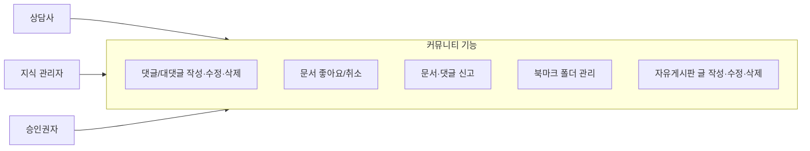
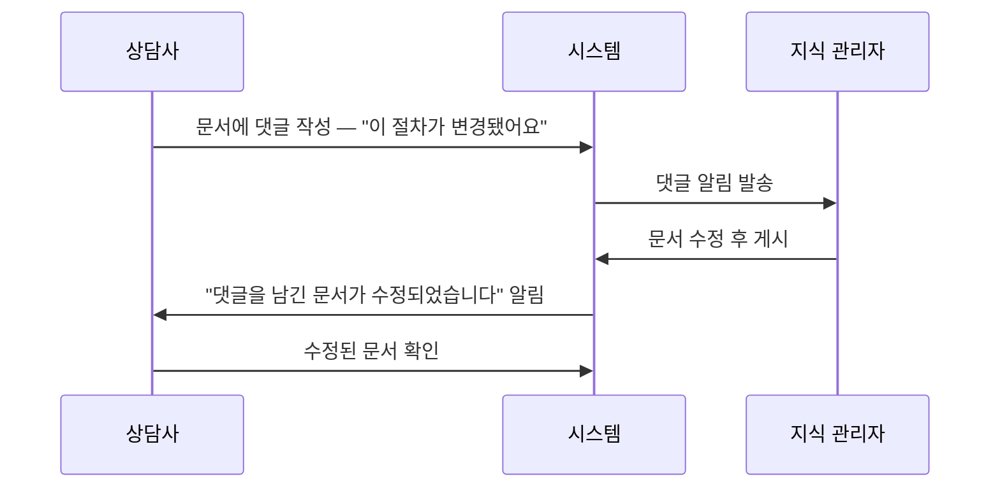
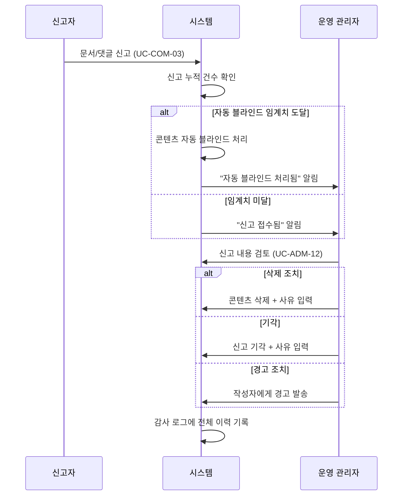

# 커뮤니티 유즈케이스

## 비즈니스 목표

커뮤니티 기능은 KMS 사용자 참여도와 채택률을 높이는 핵심 레버다.

- **댓글**: 현업 피드백을 통한 지식 문서 품질 개선 순환 — 상담사가 "이 절차가 변경됐어요"라고 댓글을 남기면 지식 관리자가 문서를 즉시 보완할 수 있다
- **좋아요**: 콘텐츠 큐레이션 — 좋아요 수가 인기 순위에 반영되어 양질의 문서가 자연스럽게 상위에 노출된다
- **신고**: 부적절한 콘텐츠의 신속한 감지 및 품질 관리
- **북마크**: 개인화된 빠른 접근 — 업무 맥락별로 문서를 분류하여 반복 탐색 시간을 줄인다
- **자유게시판**: 비공식 지식 공유와 커뮤니티 형성을 통한 KMS 진입 장벽 낮추기

> **성과 측정**: 커뮤니티 기능의 효과는 통계 대시보드(UC-ADM-11)에서 추적한다 — 댓글 참여율(문서 대비 댓글 비율), 좋아요 활용률, 북마크 활용률, 신고 처리 소요시간 등을 정량 지표로 모니터링하여 개선 방향을 도출한다.

> **관련 기능정의서**: [FD-COM-커뮤니티](../../features/FD-COM-커뮤니티.md)

---

## 개요 다이어그램

---

## UC-COM-01: 댓글 작성 / 대댓글

> **상세 규칙**: [FD-COM](../../features/FD-COM-커뮤니티.md) §2

**사용자**: 상담사, 지식 관리자, 승인권자

**사전 조건**:
- 사용자가 로그인되어 있어야 한다.
- 대상 문서가 "게시됨" 상태여야 한다.
- 해당 게시판에 열람 권한을 가지고 있어야 한다.

**기본 흐름**:
1. 사용자가 문서 상세 페이지 하단의 댓글 영역으로 이동한다.
2. 댓글 입력란에 내용을 작성하고 "등록" 버튼을 클릭한다.
3. 시스템이 댓글을 저장하고 댓글 목록에 즉시 표시한다.
4. 문서 작성자에게 "내 문서에 댓글이 달렸습니다" 알림이 발송된다.

**대안 흐름**:
- **2a. 대댓글 작성**: 기존 댓글의 "답글" 버튼을 클릭하여 답글을 작성한다. 답글은 1단계 깊이만 허용되며, 답글에 대한 "답글"을 클릭해도 원 댓글의 답글로 등록된다. 원 댓글 작성자에게 "내 댓글에 답글이 달렸습니다" 알림이 발송된다.
- **2b. 빈 댓글 방지**: 내용 없이 등록을 시도하면 "댓글 내용을 입력해 주세요" 안내가 표시된다.
- **2c. 댓글 길이 초과**: 시스템 설정에 따른 최대 글자 수를 초과하면 "댓글은 최대 N자까지 입력할 수 있습니다" 안내가 표시된다.
- **2d. 댓글 중복 등록 방지**: 시스템은 "등록" 버튼 클릭 후 응답을 받기 전까지 추가 클릭을 무시하여 동일 댓글이 중복 저장되는 것을 방지한다.
- **2e. 댓글 스팸/도배 방지**: 짧은 시간 내에 동일 사용자가 연속으로 댓글을 등록하면 시스템이 "잠시 후 다시 시도해 주세요" 안내를 표시하고 등록을 제한한다. 제한 간격은 시스템 운영 설정(UC-ADM-15)에서 관리한다.
- **2f. 민감정보 포함 감지**: 시스템이 댓글 내용에서 전화번호, 계좌번호, 주민등록번호 등 민감정보 패턴을 감지하면 "민감한 개인정보가 포함되어 있을 수 있습니다. 확인 후 등록해 주세요" 경고를 표시한다. 사용자가 확인 후 등록할 수 있지만, 감사 로그에 민감정보 포함 경고 이력이 기록된다.
- **2g. 부적절 콘텐츠 사전 감지 및 차단**: 시스템이 댓글 등록 시 내용을 자동으로 분석하여 부적절한 표현(욕설, 비방, 차별적 표현 등)을 사전에 감지한다. 감지 수준에 따라 다음과 같이 처리한다:
  - **경고 수준**: "부적절한 표현이 포함되어 있을 수 있습니다. 확인 후 등록해 주세요" 안내를 표시하고, 사용자가 확인 후 등록할 수 있다. 감사 로그에 경고 이력이 기록된다.
  - **차단 수준**: "등록이 제한된 표현이 포함되어 있습니다. 내용을 수정해 주세요" 안내를 표시하고 등록이 차단된다.
  - 감지 기준(금칙어 목록, 패턴)은 운영 관리자가 시스템 운영 설정(UC-ADM-15)에서 관리한다. 감지 정확도를 높이기 위해 관리자가 오탐(정상인데 차단된 것) 사례를 확인하고 기준을 조정할 수 있다.
- **3a-0. 댓글 해결 표시**: 문서 작성자(지식 관리자)가 댓글에서 지적된 사항을 문서에 반영한 후, 해당 댓글에 "해결됨" 표시를 할 수 있다. 해결된 댓글은 시각적으로 구분(흐린 글씨, 줄긋기 등)되어 표시되며, 댓글 작성자에게 "댓글이 해결 처리되었습니다" 알림이 발송된다. 댓글 작성자가 해결 처리에 동의하지 않으면 "재개" 버튼을 클릭하여 미해결 상태로 되돌리고 추가 의견을 남길 수 있다. 문서 상세 페이지에서 "미해결 댓글만 보기" 필터를 사용하여, 아직 반영되지 않은 피드백을 빠르게 파악할 수 있다.
- **3a. 댓글 수정**: 댓글 작성자가 자신의 댓글에서 "수정"을 클릭하면 편집 모드로 전환된다. 수정 완료 후 저장하면 "(수정됨)" 표시가 붙는다.
- **3a-1. 댓글 수정 시간 제한**: 시스템 설정에 따른 수정 허용 시간(예: 등록 후 24시간)이 지나면 수정 버튼이 비활성화되고 "수정 가능 시간이 지났습니다" 안내가 표시된다. 수정이 필요한 경우 삭제 후 재작성하거나 운영 관리자에게 요청해야 한다.
- **3b. 댓글 삭제 — 본인**: 댓글 작성자가 자신의 댓글에서 "삭제"를 클릭하면 확인 대화상자 후 삭제된다. 대댓글이 있는 댓글은 내용이 "삭제된 댓글입니다"로 대체된다.
- **3c. 댓글 삭제 — 운영 관리자**: 운영 관리자는 신고 처리(UC-ADM-12) 또는 관리자 대시보드를 통해 타인의 댓글을 직접 삭제할 수 있다. 문서 작성자(지식 관리자)는 자기 문서의 부적절한 댓글을 직접 삭제할 수 없으며, 신고(UC-COM-03)를 통해 요청해야 한다.
- **4a. 자유게시판 댓글 정책**: 자유게시판(커뮤니티 유형)의 댓글은 공식 게시판과 동일한 정책을 따르되, 관리자가 자유게시판별로 댓글 허용 여부를 개별 설정할 수 있다. 댓글이 비활성화된 게시판에서는 댓글 영역이 표시되지 않는다.

**예외 흐름**:
- **3-E1. 댓글 작성 중 문서 삭제**: 댓글 작성 중에 해당 문서가 삭제 또는 비공개 처리된 경우, 등록 시점에 "해당 문서가 더 이상 존재하지 않습니다" 안내가 표시되고 댓글은 저장되지 않는다.
- **3-E2. 대상 문서 비공개 전환**: 문서가 긴급 회수(UC-DOC-09) 등으로 비공개 처리되면, 해당 문서의 기존 댓글은 문서와 함께 비공개 상태가 되어 열람할 수 없다. 문서가 다시 게시되면 댓글도 함께 복원된다.
- **3-E3. 삭제된 문서의 기존 댓글 처리**: 문서가 삭제 처리되면 해당 문서의 모든 댓글은 일반 사용자에게 노출되지 않는다. 관리자가 문서를 복구하면 댓글도 함께 복원된다. 문서가 영구 삭제되면 관련 댓글도 함께 영구 삭제된다.
- **3-E4. 서버 오류**: 댓글 등록/수정/삭제 요청이 서버 오류로 실패한 경우, "일시적인 오류가 발생했습니다. 잠시 후 다시 시도해 주세요" 안내가 표시되고 작성 중인 내용은 유지된다.

**사후 조건**:
- 댓글이 저장되고 문서의 댓글 수 집계에 반영된다.
- 감사 로그에 댓글 작성/수정/삭제 기록이 남는다.
- 문서 작성자가 댓글 알림을 확인하고 문서를 수정하면, 해당 문서에 댓글을 남긴 사용자들에게 "댓글을 남긴 문서가 수정되었습니다" 알림이 발송된다(알림 설정에 따라).
- 퇴사한 사용자의 댓글은 작성자명이 "(알 수 없는 사용자)"로 익명화되어 표시되며, 댓글 내용은 보존된다. 수정/삭제는 운영 관리자만 가능하다. 퇴사자가 남긴 댓글 중 업무적으로 유용한 내용은 다른 담당자가 문서 본문에 반영한 뒤 댓글을 "해결됨"으로 처리하여 지식을 보존한다.

---

## UC-COM-02: 문서 좋아요

> **상세 규칙**: [FD-COM](../../features/FD-COM-커뮤니티.md) §3 | **인기 순위 산출**: [FD-AGG](../../features/FD-AGG-집계피드.md) §1

**사용자**: 상담사, 지식 관리자, 승인권자

**사전 조건**:
- 사용자가 로그인되어 있어야 한다.
- 대상 문서가 "게시됨" 상태여야 한다.
- 해당 게시판에 열람 권한을 가지고 있어야 한다.

**기본 흐름**:
1. 사용자가 문서 상세 페이지에서 좋아요 버튼을 클릭한다.
2. 시스템이 좋아요를 등록하고 버튼이 "좋아요 취소" 상태로 변경된다.
3. 문서의 좋아요 수가 1 증가하여 표시된다.
4. ~~문서 작성자에게 "내 문서에 좋아요가 눌렸습니다" 알림이 발송된다(알림 설정에 따라).~~
   > **v1 미지원**: 좋아요 알림은 v1에서 지원하지 않는다 (FD-NTF 결정사항 M4, FD-COM 결정사항 참조). 업무 직결 알림이 우선이며, 알림 피로도 감소를 위해 후속 버전에서 검토 예정.

**대안 흐름**:
- **1a. 좋아요 취소**: 이미 좋아요를 누른 상태에서 다시 클릭하면 좋아요가 취소되고 버튼이 원래 상태로 돌아간다. 좋아요 수가 1 감소한다.
- **1b. 중복 요청 무시**: 사용자가 좋아요 버튼을 빠르게 연속 클릭하더라도 시스템은 첫 번째 요청만 처리하고 이후 요청은 무시하여 좋아요 수가 비정상적으로 변동되는 것을 방지한다.
- **1c. 검색 결과/목록에서 좋아요**: 사용자는 문서 상세 페이지뿐 아니라 검색 결과 목록이나 게시판 목록에서도 좋아요 버튼을 클릭할 수 있다. 동작은 동일하다.
- **1d. 본인 문서 좋아요**: 문서 작성자가 자신의 문서에 좋아요를 누를 수 있다. 단, 인기 순위 산정 시 자기 좋아요의 가중치 반영 여부는 시스템 운영 설정(UC-ADM-15)에서 관리한다.
- **3a. 좋아요 수 비공개 설정**: 관리자가 시스템 운영 설정(UC-ADM-15)에서 좋아요 수 노출을 비활성화한 경우, 좋아요 버튼은 제공되지만 좋아요 수는 표시되지 않는다. 좋아요 기록은 내부적으로 집계에 반영된다.

**예외 흐름**:
- **2-E1. 대상 문서 비공개 전환**: 문서가 긴급 회수(UC-DOC-09) 등으로 비공개 처리되면, 해당 문서의 좋아요 집계는 인기 순위 산정에서 제외된다. 좋아요 기록 자체는 보존되며, 문서가 다시 게시되면 집계에 복원된다.
- **2-E2. 삭제된 문서의 좋아요 처리**: 문서가 삭제 처리되면 좋아요 기록은 보존되지만 인기 순위에서 제외된다. 마이페이지 "좋아요한 문서" 목록에서 해당 문서는 "삭제된 문서"로 표시된다. 관리자가 문서를 복구하면 좋아요 집계도 복원된다.
- **2-E3. 서버 오류**: 좋아요 등록/취소 요청이 서버 오류로 실패한 경우, 버튼 상태를 이전으로 되돌리고 "일시적인 오류가 발생했습니다" 안내가 표시된다.

**사후 조건**:
- 좋아요 수가 집계에 반영되어 인기 문서 순위 산정에 활용된다 (FD-AGG 참조).
- 좋아요한 문서가 마이페이지의 "좋아요한 문서" 목록에 표시된다.
- ~~문서 작성자에게 좋아요 알림이 발송된다(알림 설정에 따라).~~ → v1 미지원 (FD-NTF 결정사항 M4 참조)
- 감사 로그에 좋아요 등록/취소 기록이 남는다.
- 퇴사한 사용자의 좋아요 기록은 집계에 유지된다. 인기 순위의 정확성을 위해 좋아요 수가 감소하지 않으며, 퇴사자의 마이페이지 데이터만 정리된다.

---

## UC-COM-03: 문서 신고

> **상세 규칙**: [FD-COM](../../features/FD-COM-커뮤니티.md) §4 | **신고 처리**: UC-ADM-12

**사용자**: 상담사, 지식 관리자 (승인권자는 직접 반려/조치 권한이 있어 신고 대상에서 제외)

**사전 조건**:
- 사용자가 로그인되어 있어야 한다.
- 대상 문서 또는 댓글이 "게시됨" 상태여야 한다.
- 해당 게시판에 열람 권한을 가지고 있어야 한다.

**기본 흐름**:
1. 사용자가 부적절한 문서 또는 댓글의 "신고" 버튼을 클릭한다.
2. 시스템이 신고 사유 선택 화면을 표시한다 — 스팸, 부적절한 내용, 저작권 침해, 개인정보 노출, 기타(직접 입력).
3. 사용자가 사유를 선택하고(필요시 상세 설명을 입력하고) "신고" 버튼을 클릭한다.
4. 시스템이 "신고가 접수되었습니다" 안내를 표시하고, 신고가 관리자 대시보드에 접수된다.
5. 운영 관리자에게 새 신고 접수 알림이 발송된다.

**대안 흐름**:
- **3a. 중복 신고 방지**: 같은 사용자가 같은 대상에 대해 이미 신고한 경우 "이미 신고한 항목입니다" 안내가 표시된다.
- **3b. 기타 사유 입력**: "기타"를 선택한 경우 구체적인 사유를 직접 입력해야 신고를 제출할 수 있다. 사유 미입력 시 "신고 사유를 입력해 주세요" 안내가 표시된다.
- **3c. 악의적 신고 남용 방지**: 일정 기간 내에 과도한 신고를 반복하는 사용자에 대해 시스템이 신고 기능을 일시 제한하고 "신고 기능이 일시적으로 제한되었습니다. 관리자에게 문의하세요" 안내를 표시한다. 남용 기준(기간당 최대 신고 건수)은 시스템 운영 설정(UC-ADM-15)에서 관리한다.
- **4a. 자동 블라인드 처리**: 같은 문서 또는 댓글에 대한 신고가 관리자가 설정한 건수(임계치) 이상 누적되면 시스템이 자동으로 해당 콘텐츠를 블라인드(비공개) 처리하고 관리자에게 "자동 블라인드 처리됨" 알림을 발송한다. 임계치는 시스템 운영 설정(UC-ADM-15)에서 관리한다.
- **1a. 댓글 신고 상세**: 댓글 신고 시에도 문서 신고와 동일한 사유 선택 화면이 표시된다. 댓글 신고가 자동 블라인드 임계치에 도달하면 해당 댓글만 블라인드 처리되고, 원본 문서에는 영향을 주지 않는다.
- **5a. 신고 처리 전체 흐름 참고**: 신고 접수 → 관리자 검토(UC-ADM-12) → 관리자가 삭제/기각/경고 중 조치를 선택 → 조치 완료. 기각된 신고가 반복되면 악의적 신고로 판단하여 신고자에 대해 제한 조치를 취할 수 있다.

**예외 흐름**:
- **4-E1. 신고 대상 이미 삭제**: 신고 버튼 클릭 후 사유 선택 중에 해당 문서 또는 댓글이 삭제된 경우, 제출 시점에 "해당 항목이 이미 삭제되었습니다" 안내가 표시되고 신고는 접수되지 않는다.
- **4-E2. 서버 오류**: 신고 제출 요청이 서버 오류로 실패한 경우, "일시적인 오류가 발생했습니다. 잠시 후 다시 시도해 주세요" 안내가 표시되고 작성 중인 사유는 유지된다.

**사후 조건**:
- 신고가 관리자 대시보드(UC-ADM-12)에 접수되고, 운영 관리자에게 알림이 발송된다.
- 자동 블라인드 임계치에 도달한 콘텐츠는 관리자가 최종 검토하기 전까지 비공개 상태를 유지한다.
- 관리자가 조치를 완료하면 감사 로그에 신고 접수·검토·조치 전체 이력이 기록된다.
- 신고 처리 결과는 신고자에게 별도로 통보되지 않는다 (익명성 보호). 다만, 시스템 운영 설정(UC-ADM-15)에서 결과 통보를 활성화할 수 있다.

---

## UC-COM-04: 북마크 관리

> **상세 규칙**: [FD-COM](../../features/FD-COM-커뮤니티.md) §5

**사용자**: 상담사, 지식 관리자, 승인권자

**사전 조건**:
- 사용자가 로그인되어 있어야 한다.
- 북마크할 문서가 "게시됨" 상태여야 한다.
- 해당 게시판에 열람 권한을 가지고 있어야 한다.

**기본 흐름**:
1. 사용자가 문서 상세 페이지에서 북마크 아이콘을 클릭한다.
2. 시스템이 저장할 폴더를 선택하는 목록을 표시한다.
3. 사용자가 폴더를 선택하면 해당 문서가 선택한 폴더에 저장된다. 폴더를 선택하지 않으면 "미분류" 폴더에 자동 저장된다.
4. "북마크에 저장되었습니다" 안내가 표시된다.

**대안 흐름**:
- **1a. 북마크 해제**: 이미 북마크된 문서에서 북마크 아이콘을 다시 클릭하면 북마크가 해제된다.
- **1b. 북마크 한도 초과**: 시스템 설정에 따른 최대 북마크 수를 초과하면 "북마크는 최대 N개까지 저장할 수 있습니다. 기존 북마크를 정리한 후 다시 시도해 주세요" 안내가 표시되고 북마크는 저장되지 않는다. 최대 수는 시스템 운영 설정(UC-ADM-15)에서 관리한다.
- **1c. 중복 요청 무시**: 사용자가 북마크 아이콘을 빠르게 연속 클릭하더라도 시스템은 첫 번째 요청만 처리하고 이후 요청은 무시하여 북마크가 비정상적으로 추가/해제되는 것을 방지한다.
- **2a. 폴더 생성/편집**: 마이페이지 > 북마크 관리에서 새 폴더를 만들고, 이름을 수정하고, 순서를 드래그 앤 드롭으로 변경할 수 있다. "미분류" 기본 폴더는 삭제할 수 없다. 시스템 설정에 따른 최대 폴더 수를 초과하면 "폴더는 최대 N개까지 만들 수 있습니다" 안내가 표시된다.
- **2b. 폴더 삭제**: 폴더를 삭제하면 확인 대화상자가 표시되고, 해당 폴더에 속한 북마크는 "미분류" 폴더로 자동 이동된다.
- **2c. 폴더 간 북마크 이동**: 마이페이지 > 북마크 관리에서 북마크를 선택하여 다른 폴더로 이동할 수 있다. 여러 북마크를 선택하여 일괄 이동할 수도 있다.
- **2d. 폴더 간 북마크 복제**: 하나의 북마크를 여러 폴더에 동시에 저장할 수 있다. 복제된 북마크는 각 폴더에서 독립적으로 관리된다 — 한 폴더에서 해당 북마크를 삭제해도 다른 폴더의 북마크에는 영향이 없다.
- **4a. 문서 상태 변화 추적**: 북마크한 문서가 업데이트(새 버전 게시)되면 "업데이트됨" 배지가 나타난다. 삭제된 문서는 "삭제된 문서"로 표시된다. 접근 권한이 없어진 문서는 "접근 불가"로 표시된다.
- **4a-1. 북마크한 문서의 비공개 전환**: 문서가 긴급 회수(UC-DOC-09) 등으로 비공개 처리되면, 북마크 목록에서 해당 문서가 "비공개 문서"로 표시되고 클릭해도 열람할 수 없다. 문서가 다시 게시되면 정상적으로 열람할 수 있으며 "업데이트됨" 배지가 표시된다.
- **1d. 북마크 내 검색**: 검색 시 "내 북마크에서만 검색" 필터 옵션을 적용하여 북마크한 문서 범위 내에서만 결과를 조회할 수 있다.
- **1e. 북마크 일괄 정리**: 마이페이지 > 북마크 관리에서 여러 북마크를 선택하여 일괄 삭제하거나 다른 폴더로 이동할 수 있다. "삭제된 문서" 또는 "접근 불가" 상태의 북마크만 선택하는 필터도 제공된다.
- **1f. 북마크 폴더가 지원되지 않는 환경**: 시스템 설정에 따라 폴더 기능 없이 단순 북마크 목록으로만 제공될 수 있다. 이 경우 폴더 선택 단계 없이 바로 북마크에 추가된다.

**예외 흐름**:
- **3-E1. 북마크 시점에 문서 삭제/비공개 전환**: 북마크 아이콘 클릭 시점에 해당 문서가 삭제 또는 비공개 처리된 경우, "해당 문서가 더 이상 존재하지 않습니다" 안내가 표시되고 북마크는 저장되지 않는다.
- **3-E2. 권한 변경 중 접근**: 북마크 저장 시점에 사용자의 게시판 열람 권한이 해제된 경우, "해당 문서에 대한 접근 권한이 없습니다" 안내가 표시되고 북마크는 저장되지 않는다.
- **3-E3. 서버 오류**: 북마크 추가/해제/폴더 조작 요청이 서버 오류로 실패한 경우, "일시적인 오류가 발생했습니다. 잠시 후 다시 시도해 주세요" 안내가 표시되고 이전 상태를 유지한다.

**사후 조건**:
- 북마크한 문서가 마이페이지의 북마크 목록에 표시된다.
- 북마크 활용 통계가 통계 대시보드(UC-ADM-11)에 반영된다.
- 감사 로그에 북마크 추가/해제/폴더 생성·삭제 기록이 남는다.
- 퇴사한 사용자의 북마크 데이터는 계정 정리 시 함께 삭제된다(개인 데이터이므로 보존하지 않는다).

---

## UC-COM-05: 자유게시판 글 작성

> **상세 규칙**: [FD-COM](../../features/FD-COM-커뮤니티.md) §1

**사용자**: 상담사, 지식 관리자, 승인권자

**사전 조건**:
- 해당 게시판이 자유게시판(커뮤니티) 유형이어야 한다.
- 사용자가 해당 게시판에 편집 권한을 가지고 있어야 한다.

> **자유게시판이란?** 지식 문서와 달리, 기본적으로 승인 절차 없이 자유롭게 글을 올릴 수 있는 게시판입니다. 팁 공유, 질문, 공지 등 가벼운 소통에 사용됩니다.

**기본 흐름**:
1. 사용자가 자유게시판에서 "글 작성"을 클릭한다.
2. 블록 편집기에서 글을 작성한다 — 지식 문서와 동일한 편집기를 사용하지만, 문서 양식 선택은 제공되지 않는다.
3. 제목과 태그를 입력한다.
4. 작성 완료 후 "등록"을 클릭하면 승인 없이 즉시 "게시됨" 상태로 전환된다.
5. 게시판 구독자에게 새 글 알림이 발송된다.

**대안 흐름**:
- **4a. 승인 정책이 연결된 경우**: 관리자가 해당 자유게시판에 승인 정책을 연결한 경우, "등록" 클릭 시 승인 절차를 거쳐 게시된다. 이 경우 지식 문서와 동일한 승인 흐름을 따른다.
- **4b. 글 수정 — 본인**: 작성자 본인이 자신의 게시글에서 "수정"을 클릭하면 편집 모드로 전환된다. 수정 완료 후 "저장"을 클릭하면 즉시 반영된다. 승인 정책이 연결된 게시판이라면 수정 시에도 승인 절차를 거친다.
- **4c. 글 삭제 — 본인**: 작성자 본인이 자신의 게시글에서 "삭제"를 클릭하면 확인 대화상자 후 삭제 처리된다. 해당 글에 달린 댓글도 함께 비공개 처리된다.
- **4d. 글 삭제 — 운영 관리자 강제 삭제**: 운영 관리자는 신고 처리(UC-ADM-12) 경로 또는 관리자 대시보드에서 부적절한 자유게시판 글을 직접 삭제할 수 있다. 삭제 시 사유를 입력해야 하며, 삭제 사유는 감사 로그에 기록된다. 글 작성자에게 "운영 정책에 따라 게시글이 삭제되었습니다" 알림이 발송된다.
- **2a. 임시 저장**: 작성 중인 글을 "임시 저장"하여 나중에 이어서 작성할 수 있다. 임시 저장된 글은 마이페이지의 임시 저장 목록에 표시된다.
- **2b. 글 길이 초과**: 시스템 운영 설정(UC-ADM-15)에서 관리하는 최대 글자 수를 초과하면 "내용이 너무 깁니다" 안내가 표시되고 등록할 수 없다.
- **4e. AI 답변 검색 미포함**: 자유게시판 글은 AI가 답변을 생성할 때 참고하지 않는다. 단, 키워드 검색에는 포함된다.
- **4f. 자유게시판이 지원되지 않는 환경**: 시스템 설정에 따라 자유게시판 유형이 제공되지 않을 수 있다.
- **5a. 공지 글 고정**: 운영 관리자가 특정 자유게시판 글을 "공지"로 지정하면 해당 게시판 상단에 고정 표시된다. 공지 글 수는 시스템 운영 설정(UC-ADM-15)에서 관리하는 최대 수 이내로 제한된다.

**예외 흐름**:
- **4-E1. 등록 시점에 게시판 비활성화**: "등록" 클릭 시점에 해당 자유게시판이 관리자에 의해 비활성화되었거나 삭제된 경우, "해당 게시판이 현재 이용 불가 상태입니다" 안내가 표시되고 글은 저장되지 않는다. 작성 중인 내용은 유지되어 다른 게시판에 등록할 수 있다.
- **4-E2. 권한 변경 중 접근**: 글 작성 또는 수정 중에 사용자의 게시판 편집 권한이 해제된 경우, 저장 시점에 "해당 게시판에 대한 편집 권한이 없습니다" 안내가 표시되고 글은 저장되지 않는다.
- **4-E3. 서버 오류**: 글 등록/수정/삭제 요청이 서버 오류로 실패한 경우, "일시적인 오류가 발생했습니다. 잠시 후 다시 시도해 주세요" 안내가 표시되고 작성 중인 내용은 유지된다.

**사후 조건**:
- 글이 "게시됨" 상태로 즉시 게시된다 (승인 정책이 없는 경우).
- 키워드 검색에는 포함되지만, AI 답변 검색에는 포함되지 않는다.
- 게시판 구독자에게 새 글 알림이 발송된다.
- 감사 로그에 글 작성/수정/삭제 기록이 남는다.
- 퇴사한 사용자의 자유게시판 글은 작성자명이 "(알 수 없는 사용자)"로 표시되며, 글 내용은 보존된다. 운영 관리자가 필요시 삭제 또는 보관 조치할 수 있다.

---

## 현업 업무 흐름

> 커뮤니티 기능이 실제 업무에서 활용되는 대표적인 패턴을 정리한다.

### 댓글을 통한 문서 품질 개선 사이클

1. 상담사가 고객 응대 중 문서 내용의 오류나 변경사항을 발견하고 댓글을 남긴다 (UC-COM-01). 예: "3번 항목의 수수료율이 변경되었습니다 — 현재 1.2%가 아니라 1.5%입니다."
2. 지식 관리자가 댓글 알림(UC-PER-02)을 확인하고 문서를 수정한다 (UC-DOC-03).
3. 지식 관리자가 댓글의 지적 사항을 문서에 반영한 후, 해당 댓글에 "해결됨" 표시를 한다. "해결됨" 처리 시 수정된 문서의 해당 부분 링크를 함께 남길 수 있다.
4. 수정된 문서가 승인을 거쳐 게시되면, 해당 문서에 댓글을 남긴 사용자들에게 "댓글을 남긴 문서가 수정되었습니다" 알림이 발송된다.
5. 댓글 작성자가 수정 내용을 확인한다. 추가 의견이 있으면 댓글을 "재개"하거나 새 댓글을 남긴다.
6. 모든 미해결 댓글이 처리되면, 문서의 댓글 영역에 "모든 피드백이 반영되었습니다" 상태가 표시된다.

> 이 댓글 → 수정 → 해결 순환 과정을 통해 현업 지식이 문서에 빠르게 반영되어 KMS 신뢰도가 향상된다. 미해결 댓글이 일정 기간(관리자 설정, 예: 7일) 이상 방치되면 문서 담당자에게 "미해결 피드백이 있습니다" 리마인더가 발송된다.

### 신고 → 관리자 검토 → 조치 완료 흐름

1. 사용자가 부적절한 콘텐츠를 신고한다 (UC-COM-03).
2. 신고 누적 건수가 임계치에 도달하면 시스템이 자동으로 블라인드 처리한다.
3. 운영 관리자가 관리자 대시보드(UC-ADM-12)에서 신고 내역을 검토한다.
4. 관리자가 삭제, 기각, 경고 중 적절한 조치를 수행한다.
5. 반복적으로 기각된 신고가 많은 사용자는 악의적 신고로 판단하여 신고 기능이 제한된다.

### 부서 간 문서 공유 시 커뮤니티 활용 패턴

1. 부서 A의 지식 관리자가 문서를 작성하여 전사 게시판에 게시한다 (UC-DOC-01).
2. 부서 B의 상담사가 해당 문서를 열람하고 자신의 업무 맥락에서 궁금한 점을 댓글로 질문한다 (UC-COM-01).
3. 부서 A의 지식 관리자가 답글로 설명을 보충하거나, 필요시 문서 본문을 수정하여 모든 부서에 적용되도록 한다.
4. 부서 B의 상담사가 유용한 문서를 업무별 북마크 폴더에 저장하여 빠르게 접근한다 (UC-COM-04).
5. 자주 좋아요를 받는 문서는 인기 순위에 반영되어 다른 부서 사용자에게도 자연스럽게 노출된다 (UC-COM-02).

### 교대 근무 인수인계 시 커뮤니티 활용

교대 근무 환경에서 커뮤니티 기능을 인수인계에 활용하는 패턴:

1. 퇴근하는 상담사가 교대 시 전달할 사항(긴급 이슈, 고객 특이사항 등)을 자유게시판(인수인계 전용)에 글로 작성한다 (UC-COM-05).
2. 다음 교대조 상담사가 해당 글에 댓글(UC-COM-01)로 확인 완료를 표시하거나 추가 질문을 남긴다.
3. 인수인계 게시판 구독(UC-PER-03)을 통해 새 인수인계 글이 등록되면 즉시 알림을 받는다.
4. 야간 시간대에는 알림 수신 시간대 설정(UC-PER-02)을 활용하여 비근무 시간의 불필요한 알림을 차단한다.

### 신규 입사자 커뮤니티 온보딩

1. 신규 입사자가 업무 중 궁금한 사항을 자유게시판 질문 코너에 글로 작성한다 (UC-COM-05).
2. 기존 직원들이 댓글(UC-COM-01)로 답변하고, 관련 문서 링크를 함께 제공한다.
3. 유용한 답변이 달린 글에 좋아요(UC-COM-02)가 누적되면 인기 순위에 반영되어 다른 신규 입사자도 쉽게 찾을 수 있다.
4. 관리자가 자주 묻는 질문(FAQ) 글을 공지로 고정하여 신규 입사자 가이드로 활용한다.

### 규제 대응 — 댓글/신고 이력 감사 시나리오

금융 감독 기관 감사 대비를 위한 커뮤니티 활동 이력 추적:

1. 컴플라이언스 담당자가 감사 대상 기간·문서·사용자를 지정하여 댓글·신고 이력을 일괄 조회한다.
2. 특정 문서에 달린 댓글의 작성·수정·삭제 이력이 시간순으로 제공된다.
3. 민감정보 포함 경고가 발생한 댓글 이력을 별도로 추출할 수 있다.
4. 신고 접수·검토·조치 전체 이력을 조회하여 적절한 대응이 이루어졌는지 확인한다.
5. 조회 결과를 CSV/PDF로 내보내기하여 감사 증빙 자료로 활용한다.

### 고객 통화 중 댓글을 활용한 실시간 피드백

1. 상담사가 고객 통화 중 문서 내용의 오류나 변경사항을 발견한다.
2. 통화 중에는 간략한 댓글("이 절차가 변경됨, 확인 필요")을 남기고 (UC-COM-01), 통화 종료 후 상세 내용을 추가한다.
3. 지식 관리자가 댓글 알림을 확인하고 문서를 수정한다 (UC-DOC-03).
4. 긴급한 오류인 경우 댓글과 함께 문서 신고(UC-COM-03)를 통해 관리자에게 즉시 보고한다.

---

## 운영 시나리오

> 관리자가 커뮤니티 기능 운영 중 겪을 수 있는 상황과 대응 방안을 정리한다.

### 대량 스팸 댓글 일괄 처리

**상황**: 특정 사용자 또는 자동화된 계정에서 대량의 스팸 댓글이 등록된 경우.

**대응 흐름**:
1. 시스템의 스팸/도배 방지 기능(UC-COM-01 대안 흐름 2e)이 일부를 사전 차단한다.
2. 신고 누적으로 자동 블라인드 처리된 댓글을 관리자 대시보드(UC-ADM-12)에서 확인한다.
3. 운영 관리자가 해당 사용자의 전체 댓글을 관리자 대시보드에서 일괄 조회한다.
4. 스팸으로 확인된 댓글을 일괄 선택하여 삭제 처리한다.
5. 필요시 해당 사용자의 댓글 작성 권한을 일시 제한한다.
6. 감사 로그에 일괄 삭제 이력과 사유가 기록된다.

### 퇴사자 콘텐츠 익명화/보존 정책

**상황**: 사용자가 퇴사하여 계정이 비활성화된 경우, 해당 사용자의 커뮤니티 활동 데이터 처리가 필요하다. 개인정보 보호와 업무 지식 보존 사이의 균형을 맞추어야 한다.

**처리 정책**:

| 항목 | 처리 방식 | 사유 |
|------|----------|------|
| 댓글/대댓글 | 내용 보존, 작성자명 "(알 수 없는 사용자)"로 익명화 | 댓글에 포함된 업무 지식은 다른 사용자에게 유용할 수 있음 |
| 좋아요 | 집계 유지 (좋아요 수 감소 없음) | 인기 순위의 정확성 보존 |
| 북마크 | 계정 정리 시 함께 삭제 | 개인 데이터로 보존 가치 없음 |
| 자유게시판 글 | 내용 보존, 작성자명 "(알 수 없는 사용자)"로 익명화 | 공유된 팁/질의 등은 다른 사용자에게 유용할 수 있음 |
| 신고 이력 | 보존 (감사 목적) | 규제 대응 및 감사 추적 요건 |

**퇴사자 콘텐츠 처리 절차**:
1. 사용자의 계정이 비활성화되면, 시스템이 해당 사용자의 전체 커뮤니티 콘텐츠 목록(댓글 N건, 자유게시판 글 M건, 미해결 댓글 K건)을 운영 관리자에게 보고한다.
2. 운영 관리자가 퇴사자의 콘텐츠를 검토하여, 민감 정보(개인 연락처, 내부 전용 정보 등)가 포함된 댓글은 내용을 수정하거나 삭제한다.
3. 미해결 댓글이 있는 경우, 해당 문서 담당자에게 "퇴사자 OO님이 남긴 미해결 댓글이 있습니다. 내용을 확인해 주세요" 알림이 발송된다. 문서 담당자가 댓글 내용을 본문에 반영한 뒤 "해결됨"으로 처리한다.
4. 퇴사자가 담당하던 자유게시판 공지 글은 운영 관리자가 다른 담당자에게 이관하거나 공지 해제한다.
5. 익명화 처리 및 콘텐츠 정리 이력이 감사 로그에 기록된다.

> 운영 관리자는 퇴사자의 콘텐츠를 개별적으로 검토하여 부적절한 내용을 삭제하거나, 유용한 내용을 다른 담당자에게 이관할 수 있다. 대량 퇴사(조직 개편 등) 시에는 관리자 대시보드에서 해당 사용자들의 콘텐츠를 일괄 조회하여 효율적으로 처리한다.

### 커뮤니티 서비스 장애 시 관리자 조치

**상황**: 댓글·좋아요·북마크·신고 등 커뮤니티 기능에 장애가 발생한 경우.

**관리자 조치 흐름**:
1. 시스템이 커뮤니티 서비스 오류율 급증을 감지하고, 운영 관리자에게 알림을 발송한다.
2. 운영 관리자가 관리자 대시보드에서 장애 상세(발생 시각, 영향 범위, 영향받는 기능)를 확인한다.
3. 운영 관리자가 긴급 조치를 수행한다:
   - **댓글 캐시 초기화**: 댓글 목록 표시 오류 시 캐시를 초기화한다.
   - **좋아요 집계 재계산**: 좋아요 수 불일치 시 집계를 재계산한다.
   - **알림 큐 재처리**: 미발송된 댓글·신고 알림을 일괄 재발송한다.
   - **신고 큐 재처리**: 미처리된 자동 블라인드 판정을 재실행한다.
4. 커뮤니티 기능 장애가 문서 열람·검색에는 영향을 주지 않도록 독립적으로 운영된다.
5. 장애 대응 이력이 감사 로그에 기록된다.

### 커뮤니티 활성화 지표 및 핵심 KPI

운영 관리자가 커뮤니티 기능의 효과를 측정하고 활성화 수준을 파악하기 위해 모니터링하는 지표:

**활성화 지표** (통계 대시보드 UC-ADM-11에서 조회):

| 지표 | 설명 | 활용 방법 |
|------|------|----------|
| 게시판별 댓글 참여율 | 게시판별 게시 문서 대비 댓글이 달린 문서 비율 | 참여율이 낮은 게시판에 댓글 유도 캠페인 시행 |
| 댓글 해결율 | 전체 댓글 중 "해결됨"으로 처리된 댓글 비율 | 피드백이 실제 문서에 반영되는지 추적 |
| 활발한 기여자 순위 | 댓글·좋아요·신고 등 활동량 상위 사용자 목록 | 커뮤니티 선도 사용자(챔피언) 식별 및 인센티브 부여 |
| 부서별 참여 현황 | 부서별 댓글·좋아요·북마크 활동량 | 부서 간 참여 격차를 파악하여 활성화 전략 수립 |
| 댓글→문서 수정 전환율 | 댓글로 지적된 후 실제 문서 수정으로 이어진 비율 | 댓글 기반 지식 개선 효과 측정 |
| 신규 사용자 참여까지 소요 시간 | 계정 생성 후 첫 댓글/좋아요까지 걸린 평균 시간 | 온보딩 효과 측정 |

**운영 KPI 및 임계치**:

| KPI | 설명 | 임계치 예시 |
|-----|------|------------|
| 댓글 참여율 | 게시 문서 대비 댓글이 달린 문서 비율 | — |
| 좋아요 활용률 | 전체 사용자 대비 좋아요 기능 사용 비율 | — |
| 북마크 활용률 | 전체 사용자 대비 북마크 기능 사용 비율 | — |
| 신고 접수 건수 | 일일/주간 신고 접수 건수 | 일일 20건 초과 시 검토 |
| 신고 처리 평균 소요 시간 | 신고 접수~관리자 조치까지 평균 시간 | 24시간 초과 시 경고 |
| 자동 블라인드 발동 건수 | 자동 블라인드 처리된 건수 | 일일 5건 초과 시 경고 |
| 스팸/도배 차단 건수 | 스팸 방지 기능으로 차단된 건수 | 일일 50건 초과 시 검토 |
| 민감정보 경고 발생 건수 | 민감정보 포함 감지 경고 건수 | 일일 10건 초과 시 검토 |
| 부적절 콘텐츠 사전 차단 건수 | 자동 감지로 사전 차단된 콘텐츠 건수 | 일일 30건 초과 시 기준 점검 |
| 미해결 댓글 평균 체류 시간 | 댓글 등록~해결 처리까지 평균 소요 시간 | 7일 초과 시 담당자에게 리마인더 |

임계치를 초과하면 운영 관리자에게 설정된 채널(이메일, 메신저 등)로 알림이 발송된다.

### 커뮤니티 장애 에스컬레이션 흐름

1. **자동 감지**: 시스템이 댓글·좋아요·신고 처리 오류율 급증을 감지한다.
2. **1차 알림**: 운영 관리자에게 장애 알림이 발송된다.
3. **1차 조치**: 운영 관리자가 캐시 초기화, 큐 재처리 등 긴급 조치를 수행한다.
4. **2차 에스컬레이션**: 설정된 시간(예: 15분) 내 해소되지 않으면 시스템 관리자에게 알림이 발송된다.
5. **3차 에스컬레이션**: 설정된 시간(예: 30분) 내 해소되지 않으면 경영진에게 보고한다.
6. 장애 해소 후 관리자가 장애 보고서를 작성한다.

### 유지보수 모드 — 정기 점검 시 커뮤니티 기능 제한

1. 점검 중 댓글 작성·수정·삭제, 좋아요, 북마크, 신고 기능이 비활성화된다.
2. 기존 댓글·좋아요·북마크는 읽기 전용으로 조회 가능하다.
3. 사용자에게 "시스템 점검 중입니다. 커뮤니티 기능은 점검 완료 후 이용 가능합니다" 안내가 표시된다.
4. 점검 완료 후 기능이 정상 복귀하고, 점검 기간 중 발생한 알림이 순차 발송된다.

### 장애 복구 후 커뮤니티 데이터 정합성 검증

1. 운영 관리자가 "커뮤니티 정합성 검증" 기능을 실행한다.
2. 시스템이 다음 항목을 자동 검증한다:
   - 댓글 수 집계와 실제 댓글 수의 일치 여부.
   - 좋아요 수 집계와 실제 좋아요 수의 일치 여부.
   - 블라인드 처리된 콘텐츠의 실제 노출 상태 일치 여부.
   - 삭제된 문서의 관련 댓글·좋아요 처리 상태.
3. 불일치가 발견되면 관리자에게 보고하고, 재계산 대상 목록을 제공한다.
4. 검증 이력이 감사 로그에 기록된다.

### 관리자 조치 이력 관리

운영 관리자가 수행한 모든 커뮤니티 관련 조치(댓글 삭제, 블라인드 처리/해제, 신고 처리, 사용자 기능 제한 등)는 감사 로그에 자동 기록된다:

- **기록 항목**: 조치 유형, 조치자, 대상 콘텐츠/사용자, 조치 시각, 조치 사유, 조치 결과.
- **조회**: 운영 관리자가 관리자 대시보드에서 기간·조치 유형·조치자별로 이력을 필터링하여 조회할 수 있다.
- **내보내기**: 조치 이력을 CSV/PDF로 내보내기하여 감사 증빙이나 사후 분석에 활용한다.
- **보관 기간**: 커뮤니티 관련 조치 이력은 관리자가 설정한 기간(최소 5년 — 금융권 규제 요건) 동안 보관된다.
