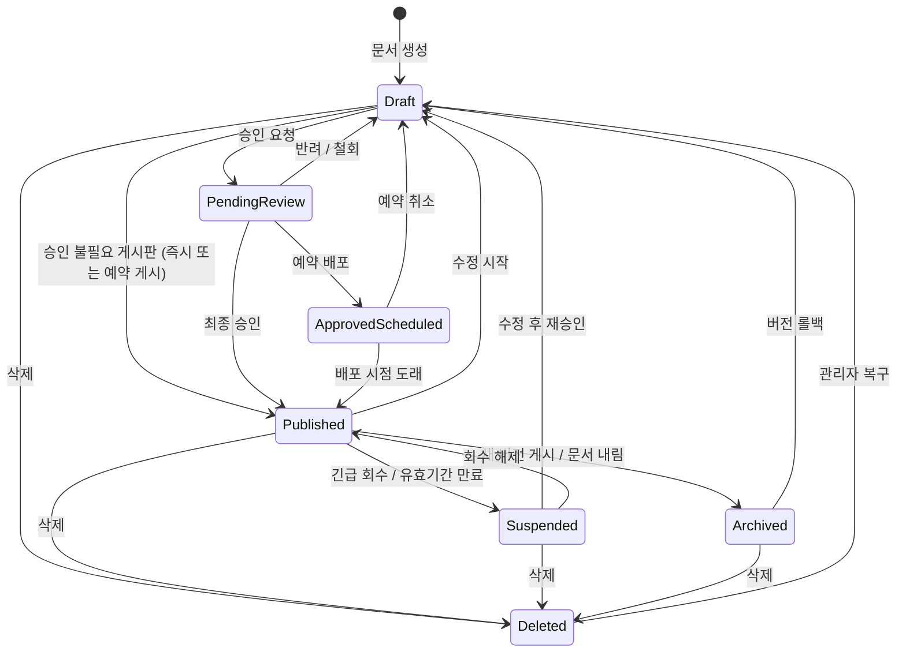

# 문서 관리 유즈케이스

> **비즈니스 목표**: 문서의 전체 생명주기(작성→승인→게시→수정→회수→만료→삭제)를 체계적으로 관리하여, 상담사에게 항상 정확하고 최신의 지식을 제공한다. 정기적인 문서 갱신·만료 관리와 승인 기반 품질 검증을 통해 정보의 정확성을 보장한다.

## 개요 다이어그램

> 아래 다이어그램은 문서가 거칠 수 있는 모든 상태 변화를 보여줍니다.

> **상태 용어 설명**:
> - **Draft (작성 중)**: 아직 작성하거나 수정하고 있는 상태. 다른 사람에게 보이지 않음
> - **PendingReview (검토 대기 중)**: 승인 요청을 해서 승인권자의 검토를 기다리는 상태
> - **Published (게시됨)**: 승인이 완료되어 모든 사용자가 열람 가능하고, 검색에도 반영된 상태
> - **ApprovedScheduled (예약 게시 승인됨)**: 승인은 완료되었지만, 지정된 날짜까지 게시를 미루고 있는 상태
> - **Suspended (일시 중단됨)**: 긴급 회수되거나 유효기간이 만료되어 검색에서 제외된 상태
> - **Archived (보관됨)**: 새 버전이 게시되어 이전 버전으로 보관된 상태, 또는 관리자가 게시된 문서를 내린 상태. 검색에서 제외됨
> - **Deleted (삭제됨)**: 삭제 표시가 된 상태. 관리자가 복구할 수 있으며, 관리자가 설정한 보존 기간 동안 보관됨

---

## UC-DOC-01: 문서 작성

**사용자**: 지식 관리자 (또는 편집 권한이 있는 상담사)

→ FD-DOC §1, §2, §3, §4, §5, §8 참조

**사전 조건**:
- 사용자가 로그인되어 있어야 한다.
- 해당 게시판에 편집 권한을 가지고 있어야 한다.

> **블록 편집기란?** 노션(Notion)과 유사한 방식의 문서 편집 도구입니다. 문서 본문이 제목, 텍스트, 이미지, 표 등의 "블록"으로 구성되며, 각 블록을 자유롭게 추가·삭제·이동할 수 있습니다. 전통적인 워드프로세서와 달리, 블록 단위로 콘텐츠를 관리하므로 블록별 변경 추적, AI 검색 반영, 특정 위치 링크 공유 등이 가능합니다.

**기본 흐름**:
1. 사용자가 게시판을 선택하고 "새 문서 작성"을 클릭한다.
2. 시스템이 해당 게시판에서 사용 가능한 문서 양식 목록을 보여준다.
3. 사용자가 문서 양식을 선택하거나, 양식 없이 빈 문서로 시작한다.
4. 시스템이 블록 편집기를 열고, 양식을 선택한 경우 미리 채워진 기본 내용이 자동으로 표시된다.
5. 사용자가 블록 편집기에서 본문을 작성한다 — 텍스트, 제목, 목록, 이미지, 표, 코드, 강조 박스, 파일 첨부 등 다양한 블록을 추가하고 편집할 수 있다.
6. 사용자가 `/` 명령으로 블록 유형을 선택하거나, 서식을 변경하거나, AI 글쓰기 개선(UC-AI-02)을 호출할 수 있다.
7. 시스템이 5~10초 간격으로 변경된 내용만 서버에 자동 저장하고, 편집기 상단에 "저장됨" 표시를 보여준다.
8. 사용자가 제목과 태그(최대 N개 — 고객사 환경에 따라 관리자가 설정, 입력 중 자동완성 지원)를 입력한다.
9. 사용자가 "승인 요청"(UC-APR-01)을 하거나, 임시 저장 상태로 남겨둔다.

**대안 흐름**:
- **1a. 기존 문서 복제하여 작성**: 사용자가 기존 게시 문서의 상세 페이지에서 "이 문서를 복제하여 새 문서 작성" 버튼을 클릭한다. 시스템이 원본 문서의 본문·태그·유효기간 설정을 복사하여 새 "작성 중" 문서를 생성한다. 사용자가 복제된 내용을 수정하고 필요에 따라 게시판을 변경할 수 있다. 첨부파일과 이미지는 별도 사본으로 복제된다.
- **3a. 기본 양식 자동 적용**: 게시판에 기본 양식이 설정되어 있으면 자동으로 해당 양식이 선택되어 기본 내용이 채워진다. 사용자가 원하면 양식을 해제하고 빈 문서로 전환할 수 있다.
- **5a. 공통 컨텐츠 삽입**: 사용자가 `/공통` 명령으로 공통 컨텐츠를 검색하여 삽입한다. 공통 컨텐츠는 편집 화면에서 시각적으로 구분되어 표시된다.
- **5b. 이미지 업로드**: 사용자가 이미지를 끌어다 놓거나(드래그 앤 드롭) 붙여넣기(Ctrl+V)로 삽입할 수 있다. 시스템이 자동으로 저장하고 미리보기 이미지를 생성한다.
- **5c. 편집 잠금**: 다른 사용자가 같은 문서를 이미 편집하고 있으면, "OO님이 편집 중입니다"라는 안내가 표시되고 편집이 차단된다. 잠금은 관리자가 설정한 시간(예: 30분)이 지나면 자동으로 해제된다. 편집 중인 사용자의 브라우저가 닫히거나 네트워크가 끊기면, 시스템이 일정 간격의 연결 확인 실패를 감지하여 잠금을 자동 해제한다. 운영 관리자는 잠금 관리 화면에서 특정 문서의 잠금을 강제 해제할 수 있다.
- **5d. 공통 컨텐츠 비활성 알림**: 삽입된 공통 컨텐츠의 원본이 비활성(더 이상 사용하지 않음) 처리된 경우, 편집 화면에서 해당 블록에 "이 공통 컨텐츠는 더 이상 유효하지 않습니다" 경고가 표시되고, 대체 컨텐츠가 지정되어 있으면 전환을 안내한다.
- **5e. 대용량 문서 경고**: 사용자가 추가한 블록 수가 관리자가 설정한 상한(예: 300개)에 근접하면, 편집기 상단에 "블록 수가 많아 저장 및 검색 반영에 시간이 걸릴 수 있습니다" 안내가 표시된다. 상한을 초과하면 추가 블록 삽입이 제한되고, 문서를 분리하도록 안내한다.
- **7a. 자동 저장 실패**: 네트워크 끊김 등으로 자동 저장에 실패하면 편집기 상단에 "저장 실패 — 네트워크 연결을 확인하세요" 경고가 표시된다. 연결이 복구되면 자동으로 재시도한다.
- **8a. AI 태그 추천**: 사용자가 태그 입력 영역에서 "AI 태그 추천"을 클릭하면, AI가 본문을 분석하여 기존 태그 중 적합한 태그를 추천한다. 사용자는 추천된 태그를 선택하거나 무시하고 직접 입력할 수 있다 (UC-AI-04 참조).
- **8b. 유효기간 설정**: 사용자가 문서의 유효기간(만료 날짜)을 설정할 수 있다. 설정하지 않으면 기한 없이 유효하다. 유효기간이 설정된 문서는 만료일이 지나면 자동으로 검색에서 제외된다 (UC-DOC-10 참조).
- **9a. 교대 근무 시 인수인계 문서 작성**: 야간/주간 교대 시 인수인계가 필요한 경우, 사용자가 인수인계 전용 양식(게시판별로 관리자가 설정)을 선택하여 교대 사항을 기록한다. 시스템이 교대 시간대에 맞춰 다음 근무자에게 "인수인계 문서가 등록되었습니다" 알림을 발송한다. 인수인계 문서는 승인 불필요 게시판에 등록하여 즉시 게시되도록 구성할 수 있다.
- **1c. 신규 입사자/부서 이동 시 첫 문서 작성**: 신규 입사자 또는 부서 이동자가 처음 문서를 작성하는 경우, 시스템이 해당 게시판의 작성 가이드(관리자가 설정한 안내 문서 링크)를 편집기 상단에 표시한다. 가이드에는 문서 양식 선택, 태그 규칙, 승인 절차 안내가 포함된다. 사용자가 가이드를 확인한 후 닫으면 이후 동일 게시판에서는 가이드가 재표시되지 않는다.

**예외 흐름**:
- **E1. 네트워크 장애**: 편집 중 네트워크가 끊기면 편집기 상단에 "오프라인 상태" 경고가 표시되고, 로컬에 변경 내용이 임시 보관된다. 연결 복구 시 자동으로 서버에 동기화를 시도한다.
- **E2. 서버 오류**: 저장 요청에 대해 서버가 오류를 반환하면 "저장에 실패했습니다. 잠시 후 다시 시도합니다" 메시지가 표시되고, 시스템이 자동 재시도한다.
- **E3. 권한 변경 중 접근**: 편집 도중 관리자가 해당 게시판의 편집 권한을 해제하면, 다음 자동 저장 시점에 "편집 권한이 없습니다" 안내가 표시되고, 작성 중이던 내용은 임시 저장된 상태로 보존된다.
- **E4. 세션 만료**: 편집 중 로그인 세션이 만료되면 "세션이 만료되었습니다. 다시 로그인해 주세요" 안내가 표시된다. 작성 중이던 내용은 로컬에 임시 보관되며, 재로그인 후 자동으로 편집 화면으로 복귀하여 이어서 작성할 수 있다.
- **E5. 파일 용량 초과**: 이미지나 첨부파일 업로드 시 관리자가 설정한 단일 파일 용량 제한을 초과하면 "파일 크기가 제한(예: 50MB)을 초과합니다" 안내가 표시되고 업로드가 차단된다.
- **E6. 스토리지 용량 부족**: 시스템 전체 스토리지 사용량이 임계치에 도달한 경우, 이미지·첨부파일 업로드 시 "저장 공간이 부족합니다. 관리자에게 문의하세요" 안내가 표시된다. 텍스트 블록 편집은 가능하지만 파일 업로드는 제한된다.
- **E7. 브라우저 비정상 종료**: 편집 중 브라우저가 비정상 종료(크래시, 강제 종료 등)되더라도, 마지막 자동 저장 시점까지의 내용은 서버에 보존된다. 사용자가 다시 해당 문서를 열면 "마지막 자동 저장 시점(HH:MM)의 내용이 복원되었습니다" 안내가 표시되고 이어서 편집할 수 있다.

**사후 조건**:
- 문서가 "작성 중" 상태로 저장된다.
- 검색 및 AI 답변 검색에는 반영되지 않는다.
- 감사 로그에 문서 생성 기록(작성자, 게시판, 시각)이 남는다.
- 문서 작성 통계(게시판별 작성 건수)가 갱신된다.

---

## UC-DOC-02: 문서 열람

**사용자**: 상담사, 지식 관리자, 승인권자, 운영 관리자

→ FD-DOC §5, §6 참조

**사전 조건**:
- 문서가 "게시됨" 상태여야 한다.
- 사용자가 해당 게시판에 `BoardPermission(VIEW)` 등 열람에 필요한 권한이 있거나, [FD-ACL](../../features/FD-ACL-권한체계.md)의 메타정보 바이패스(유효 역할에 `AdminPermission` 등)에 해당해야 한다.

**기본 흐름**:
1. 사용자가 검색 결과, 게시판 목록, 홈 피드, 알림 링크, 공유된 주소 등을 통해 문서에 접근한다.
2. 시스템이 문서 상세 페이지를 화면에 표시한다.
3. 공통 컨텐츠를 참조하는 부분은 항상 최신 내용으로 표시된다.
4. 시스템이 AI 검색 반영 상태를 알려주는 표시를 보여준다 — "검색 반영 완료" / "검색 반영 중" / "검색 반영 실패".
5. 사용자가 댓글, 좋아요, 북마크, 주소 복사, 내보내기 등 부가 기능을 이용할 수 있다.

**대안 흐름**:
- **1a. 특정 위치 바로 이동**: 문서 주소에 특정 블록 위치가 포함된 경우(예: 공유받은 링크), 해당 위치로 자동으로 스크롤되고 강조 효과가 적용된다.
- **1b. 접근 권한 없음**: 사용자에게 열람 권한이 없으면 "접근 권한이 없습니다" 안내가 표시된다. 접근 제한 문서의 경우 열람 권한 요청 링크가 함께 안내된다 (UC-ADM-13 참조).
- **1c. 로그인하지 않은 경우**: 로그인 페이지로 이동한 후, 로그인 완료 시 원래 보려던 문서로 자동 복귀한다.
- **1d. 삭제/보관된 문서**: "이 문서는 삭제되었습니다" 또는 "보관되었습니다" 안내가 표시된다. 보관된 문서의 경우 최신 게시 버전으로 이동하는 링크가 함께 제공된다.
- **2a. 접근 제한 문서**: 접근이 제한된 문서는 허용 목록에 포함된 사용자나 그룹만 열람할 수 있다 (UC-ADM-13 참조).
- **2b. 숨김 블록**: 비공개로 설정된 블록은 일반 사용자에게 보이지 않는다 (관리자나 작성자에게만 표시).
- **2c. AI 요약 표시**: AI가 자동 생성한 요약이 있으면 문서 상단에 접을 수 있는 요약 카드가 표시된다.
- **3a. 공통 컨텐츠 원본 비활성/삭제**: 문서에 삽입된 공통 컨텐츠의 원본이 비활성 처리되었으면, 해당 위치에 "이 내용은 더 이상 유효하지 않습니다" 안내가 표시된다. 대체 컨텐츠가 지정되어 있으면 대체 내용이 표시된다. 원본이 삭제되어 참조가 깨진 경우, 빈 자리에 "원본 컨텐츠가 삭제되었습니다" 안내 메시지가 표시되고, 문서 담당자에게 알림이 발송된다.
- **5a. 문서별 변경 이력 조회**: 사용자가 문서 상세 페이지에서 "이 문서의 변경 이력" 버튼을 클릭하면, 해당 문서에 대한 모든 활동 이력(작성, 수정, 승인, 회수, 복구 등)이 시간순으로 표시된다. 이를 통해 특정 문서의 경위를 빠르게 파악할 수 있다 (UC-ADM-08 참조).
- **5b. 인쇄**: 사용자가 브라우저 인쇄 기능을 사용하면, 시스템이 인쇄에 최적화된 화면을 제공하고 관리자가 설정한 워터마크(사용자명, 인쇄 일시 등)가 자동으로 포함된다. 인쇄 이력이 감사 로그에 기록된다.
- **2d. 상담사 통화 중 빠른 열람**: 상담사가 고객과 통화 중 문서를 열람하는 경우 빠른 응답이 중요하다. 시스템이 문서 본문의 핵심 내용(AI 요약, 목차)을 우선 표시하고 나머지 블록은 순차적으로 로딩한다. 문서 상단에 "핵심 내용 바로가기" 버튼이 제공되어, 목차 클릭만으로 원하는 섹션에 즉시 이동할 수 있다. 통화 중 열람 이력은 별도 태그("통화 중 참조")로 감사 로그에 기록된다.
- **5c. 감사 대비 문서 이력 일괄 조회**: 컴플라이언스 담당자 또는 운영 관리자가 감사 대비를 위해 특정 문서의 전체 활동 이력(작성, 수정, 승인, 회수, 복구, 열람, 인쇄, 내보내기 등)을 기간·행위자·행위 유형별로 필터링하여 일괄 조회할 수 있다. 조회 결과를 CSV/PDF로 내보내기하여 감사 증빙 자료로 활용한다. 감사 이력 조회 자체도 감사 로그에 기록된다 (UC-ADM-08 참조).

**예외 흐름**:
- **E1. 네트워크 장애**: 문서 로딩 중 네트워크가 끊기면 "문서를 불러올 수 없습니다. 네트워크 연결을 확인하세요" 안내가 표시된다.
- **E2. 서버 오류**: 문서 조회 요청에 서버가 오류를 반환하면 "일시적인 오류가 발생했습니다. 잠시 후 다시 시도해 주세요" 안내가 표시된다.
- **E3. 동시성 이슈**: 열람 중에 문서가 긴급 회수되면, 다음 페이지 이동 또는 새로고침 시 "이 문서는 일시 중단되었습니다" 안내가 표시된다.
- **E4. 세션 만료**: 문서 열람 중 세션이 만료되면, 재로그인 후 해당 문서로 자동 복귀한다.
- **E5. 대용량 문서 로딩 지연**: 블록 수가 매우 많은 문서는 화면에 단계적으로 표시된다. 로딩 중에는 진행 표시가 나타나고, 사용자는 이미 로딩된 부분을 먼저 확인할 수 있다.

**사후 조건**:
- 조회수가 1 증가한다.
- 열람 이력이 기록된다 (사용자별 최근 열람 문서, 열람 시각).
- 인기 문서 통계에 반영된다.

---

## UC-DOC-03: 문서 수정

**사용자**: 지식 관리자 (또는 편집 권한이 있는 상담사)

→ FD-DOC §1, §1.1, §1.2, §1.3 참조

**사전 조건**:
- 해당 게시판에 편집 권한을 가지고 있어야 한다.
- 문서가 다른 사용자에 의해 편집 중이 아니어야 한다 (편집 잠금 — UC-DOC-01 대안 흐름 참조).

**기본 흐름**:
1. 사용자가 "게시됨" 상태의 문서에서 "수정" 버튼을 클릭한다.
2. 시스템이 현재 게시된 문서는 그대로 유지한 채, 새로운 "작성 중" 버전을 만든다 — 기존 게시 문서는 검색이나 AI 답변 검색에서 계속 제공된다.
3. 사용자가 블록 편집기에서 내용을 수정한다.
4. 시스템이 자동 저장을 수행한다.
5. 수정 완료 후 사용자가 "승인 요청"(UC-APR-01)을 수행한다.

**대안 흐름**:
- **5a. 승인이 필요 없는 게시판**: 해당 게시판이 "수정 시 승인 불필요"로 설정되어 있으면, 승인 없이 즉시 "게시됨"으로 전환된다. 이전 버전은 "보관됨" 상태로 전환된다.
- **1a. 긴급 회수된 문서 수정**: 일시 중단된 문서를 수정하는 경우, 수정 완료 후 재승인되면 변경된 부분만 자동 감지하여 해당 부분만 검색 데이터로 재변환된다.
- **3a. 유효기간 변경**: 수정 시 문서의 유효기간(만료 날짜)을 변경하거나 새로 설정할 수 있다. 이미 만료된 문서의 유효기간을 미래 날짜로 변경하면 재승인 후 검색에 다시 반영된다.
- **3b. 담당자 변경**: 수정 시 문서의 담당자를 다른 사용자로 변경할 수 있다. 담당자 변경은 감사 로그에 기록된다.
- **4a. 버전 보관 정책**: 모든 보관 버전은 영구 보관되며 자동으로 정리되지 않는다 (FD-DOC BR-DOC-009 참조). 금융권 감사 요건에 따라 버전 이력이 완전하게 유지된다.
- **5b. 팀 협업 수정 패턴**: 작성자 A가 문서를 수정하여 승인을 요청한다. 승인권자 B가 검토 중 수정이 필요한 부분을 댓글(UC-COM-01)로 남기고 반려한다. 작성자 A가 반려 사유와 댓글을 확인하고 문서를 재수정한 뒤 다시 승인을 요청한다. 이 과정에서 각 반려·재요청 이력이 모두 버전으로 관리된다.
- **1b. 문서 인계 (담당자 변경 시)**: 기존 담당자가 부서 이동·퇴사 등으로 인계가 필요한 경우, 운영 관리자 또는 기존 담당자가 문서의 담당자를 변경한다. 새 담당자에게 "문서 'OO'의 담당이 인계되었습니다" 알림이 발송된다. 인계 시 해당 문서의 상태에 따라 다음과 같이 처리된다:
  - **"작성 중" 버전이 있는 경우**: 수정 중이던 임시 저장 내용이 새 담당자에게 그대로 이관되어, 새 담당자의 임시 저장 문서 목록(UC-DOC-05)에 표시되고 이어서 편집할 수 있다.
  - **"검토 대기 중" 상태인 경우**: 진행 중인 승인 요청은 유지되되, 작성자 정보가 새 담당자로 변경된다. 승인권자에게 "문서 담당자가 OO에서 △△으로 변경되었습니다" 안내가 표시되고, 반려 시 새 담당자에게 알림이 발송된다.
  - **"게시됨" 상태인 경우**: 새 담당자가 이후 해당 문서의 유효기간 갱신, 수정, 삭제 등 관리 책임을 인계받는다.
  복수 문서를 인계하는 경우, 운영 관리자가 기존 담당자의 전체 문서를 조회하여 일괄 인계하거나 건별로 선택하여 인계할 수 있다. 인계 이력(인계자, 인수자, 대상 문서 목록, 인계 사유)이 감사 로그에 기록된다.
- **5c. 위임/대결 시 대리 수정**: 문서 담당자가 부재(휴가, 출장 등) 중 긴급 수정이 필요한 경우, 담당자와 같은 게시판 편집 권한을 가진 다른 사용자가 대리로 수정할 수 있다. 대리 수정자는 수정 사유에 "대리 수정 — 원 담당자: OO, 사유: △△"를 기입한다. 감사 로그에 대리 수정 기록이 남고, 원래 담당자에게 "부재 중 문서 'OO'이(가) 대리 수정되었습니다" 알림이 발송된다.
- **5d. 컴플라이언스 검토 후 수정**: 컴플라이언스 담당자(승인권자)가 규제 변경에 따라 기존 게시 문서의 수정을 요청하는 경우, 승인 검토 화면에서 "수정 요청" 코멘트를 작성하고 반려한다. 반려 사유에 규제 근거(법령명, 조항 등)를 명시하면 작성자가 수정 시 참고할 수 있다. 컴플라이언스 관련 반려 건은 감사 로그에 별도 유형("규제 대응 수정")으로 기록된다.
- **3c. 동시 편집 감지 시 충돌 해결**: 편집 잠금이 예기치 않게 해제되거나(잠금 시간 만료, 네트워크 끊김 등) 두 사용자가 동일 문서를 수정하게 된 경우, 나중에 저장을 시도하는 사용자에게 "다른 사용자가 이 문서를 수정했습니다" 안내와 함께 다음 해결 옵션이 제공된다:
  - **내 내용으로 덮어쓰기**: 상대방의 변경을 무시하고 내 수정 내용으로 저장한다.
  - **상대방 내용 유지**: 내 변경을 취소하고 상대방이 저장한 최신 내용을 수용한다.
  - **사본으로 저장**: 내 수정 내용을 별도의 새 "작성 중" 문서로 저장하여, 이후 두 버전의 내용을 수동으로 대조·통합할 수 있도록 한다.
  시스템이 양쪽 변경 내용의 차이를 나란히 비교하여 표시하고, 사용자가 해결 방식을 선택한다. 어떤 방식을 선택하든 충돌 해결 이력(충돌 발생 시각, 관련 사용자, 선택한 방식)이 감사 로그에 기록된다.

**예외 흐름**:
- **E1. 편집 잠금 충돌**: 다른 사용자가 이미 수정 중이면 "OO님이 편집 중입니다" 안내가 표시되고 편집이 차단된다. 잠금 해제 절차는 UC-DOC-01 대안 흐름(편집 잠금)을 따른다.
- **E2. 네트워크 장애**: 수정 중 네트워크가 끊기면 로컬에 변경 내용이 임시 보관되고, 연결 복구 시 자동 동기화를 시도한다.
- **E3. 권한 변경 중 접근**: 수정 도중 편집 권한이 해제되면, 다음 자동 저장 시점에 "편집 권한이 없습니다" 안내가 표시되고, 수정 중이던 내용은 "작성 중" 상태로 보존된다.
- **E4. 세션 만료**: 수정 중 세션이 만료되면 재로그인 후 편집 화면으로 복귀하여 이어서 수정할 수 있다. 마지막 자동 저장 시점까지의 내용은 보존된다.
- **E5. 브라우저 비정상 종료**: 수정 중 브라우저가 비정상 종료되더라도 마지막 자동 저장 시점까지의 내용이 서버에 보존된다. 재접속 시 "작성 중" 버전에서 이어서 편집할 수 있다.
- **E6. 검색 데이터 재변환 실패**: 승인 후 변경분의 검색 데이터 변환이 실패하면, 문서는 정상적으로 게시되지만 "검색 반영 실패" 상태 표시가 나타난다. 시스템이 자동으로 재시도하며, 반복 실패 시 운영 관리자에게 알림이 발송된다. 운영 관리자는 관리 화면에서 해당 문서의 검색 데이터 변환을 수동으로 다시 시작할 수 있다 (UC-ADM-09 참조).
- **E7. 파일 용량 초과**: 수정 중 이미지·첨부파일 추가 시 용량 제한을 초과하면 업로드가 차단되고 안내가 표시된다 (UC-DOC-01 예외 흐름 E5와 동일).

**사후 조건**:
- 새 버전이 승인되면 이전 게시 버전은 "보관됨"으로 전환되고, 새 버전이 "게시됨" 상태가 된다.
- 변경된 부분만 자동 감지하여 해당 부분만 검색 데이터로 재변환된다 (전체를 다시 변환하지 않는다).
- 감사 로그에 수정 기록(수정자, 변경 사유, 시각)이 남는다.
- 해당 문서를 북마크한 사용자에게 "문서가 갱신되었습니다" 알림이 발송된다 (알림 설정에 따라).
- 문서 수정 통계(게시판별 수정 건수)가 갱신된다.

> **검색 데이터 재변환이란?** 문서가 게시되거나 수정되면, 시스템이 문서 내용을 AI가 이해할 수 있는 형태로 가공하여 검색에 반영합니다. 수정 시에는 변경된 블록만 골라서 다시 가공하므로, 전체 문서를 처음부터 처리하는 것보다 빠릅니다.

---

## UC-DOC-04: 문서 삭제

**사용자**: 지식 관리자, 운영 관리자

→ FD-DOC §1, §9 참조

**사전 조건**:
- 사용자가 문서 작성자이거나, 삭제에 필요한 `BoardPermission`·`AdminPermission` 규칙([FD-ACL](../../features/FD-ACL-권한체계.md))을 충족해야 한다.
- 법정 보존기간이 설정된 문서는 보존기간이 경과한 후에만 삭제 가능하다.

**기본 흐름**:
1. 사용자가 문서의 "삭제" 버튼을 클릭한다.
2. 시스템이 삭제 확인 대화상자를 표시한다.
3. 사용자가 확인하면, 시스템이 문서를 "삭제됨" 상태로 표시한다. 완전히 데이터를 지우는 것이 아니라 삭제 표시를 하는 것이므로 관리자가 복구할 수 있다.
4. 시스템이 문서를 검색 및 AI 답변 검색에서 제외한다.

**대안 흐름**:
- **2a. 삭제 시 승인 필요**: 해당 게시판이 "삭제 시 승인 필요"로 설정되어 있으면, 삭제할 때에도 승인 절차를 거쳐야 한다.
- **4a. 관리자 복구**: 운영 관리자가 삭제된 문서 목록에서 문서를 선택하여 복구할 수 있다. 복구된 문서는 "작성 중" 상태로 돌아가며, 검색에 다시 반영하려면 재승인이 필요하다. 복구 내역은 감사 로그에 기록된다.
- **3a. 보존 기간 정책**: 삭제된 문서는 관리자가 설정한 보존 기간(금융권 최소 5년 — UC-ADM-15 참조) 동안 보관된다. 보존 기간이 경과하더라도 실제 데이터 삭제(영구 삭제)는 수행되지 않으며, 삭제 표시 상태가 유지된다. 운영 관리자만 삭제된 문서를 복구할 수 있다.
- **1a. 법정 보존기간 차단**: 법정 보존기간이 설정된 문서에 대해 삭제를 시도하면, "법정 보존기간 내 문서는 삭제할 수 없습니다. 만료일: YYYY-MM-DD" 안내가 표시되고 삭제가 차단된다.
- **4b. 삭제된 문서를 참조하는 다른 문서 처리**: 삭제된 문서를 링크로 참조하고 있는 다른 문서에서는, 해당 링크 위치에 "참조된 문서가 삭제되었습니다" 안내가 표시된다. 시스템이 참조 문서의 담당자에게 "참조 문서 'OO'이(가) 삭제되어 링크가 깨졌습니다" 알림을 발송한다.
- **1b. 관리자 대리 삭제**: 운영 관리자가 다른 사용자가 작성한 문서를 직접 삭제할 수 있다. 이 경우 삭제 사유 입력이 필수이며, 원래 작성자에게 "관리자에 의해 문서 'OO'이(가) 삭제되었습니다 — 사유: ..." 알림이 발송된다.

**예외 흐름**:
- **E1. 네트워크 장애**: 삭제 요청 중 네트워크가 끊기면 "삭제 요청에 실패했습니다. 네트워크 연결을 확인하세요" 안내가 표시된다.
- **E2. 서버 오류**: 삭제 처리 중 서버 오류가 발생하면 "삭제 처리에 실패했습니다. 잠시 후 다시 시도해 주세요" 안내가 표시되고, 문서 상태는 변경되지 않는다.
- **E3. 동시성 충돌**: 다른 사용자가 해당 문서를 편집 중인 상태에서 삭제를 시도하면 "다른 사용자가 편집 중인 문서는 삭제할 수 없습니다" 안내가 표시된다.
- **E4. 복구 시 첨부파일 유실**: 관리자가 삭제된 문서를 복구할 때, 첨부파일이나 이미지가 스토리지에서 이미 정리되어 복원할 수 없는 경우, "일부 첨부파일이 복원되지 않았습니다" 경고와 함께 복원 불가 파일 목록이 표시된다. 문서 본문은 정상 복구된다.
- **E5. 승인 대기 중 삭제 시도**: 문서가 "검토 대기 중" 상태에서 삭제를 시도하면, "승인 요청 중인 문서는 삭제할 수 없습니다. 먼저 승인 요청을 철회해 주세요" 안내가 표시된다.

**사후 조건**:
- 문서가 "삭제됨"으로 표시되어 검색에서 제외된다.
- 검색 데이터에서 해당 문서가 즉시 제외 처리된다.
- 감사 로그에 삭제 기록(삭제자, 사유, 시각)이 남는다.
- 문서 작성자에게 삭제 알림이 발송된다 (관리자가 삭제한 경우).
- 해당 문서를 북마크한 사용자에게 "북마크한 문서가 삭제되었습니다" 알림이 발송된다.
- 문서 통계(게시판별 문서 수)가 갱신된다.

---

## UC-DOC-05: 임시 저장 문서 관리

**사용자**: 지식 관리자 (또는 편집 권한이 있는 상담사)

→ FD-DOC §3 참조

> **임시 저장 문서란?** 아직 작성을 완료하지 않아 "작성 중" 상태로 남겨둔 문서입니다. 다른 사람에게는 보이지 않으며, 나중에 이어서 작성하거나 삭제할 수 있습니다.

**사전 조건**:
- 사용자가 로그인되어 있어야 한다.

**기본 흐름**:
1. 사용자가 마이페이지에서 "내 임시 저장 문서" 목록을 조회한다.
2. 시스템이 목록을 표시한다 — 제목, 대상 게시판, 마지막 수정 시간이 포함된다.
3. 사용자가 임시 저장 문서를 선택하여 편집을 계속하거나, 불필요한 문서를 삭제한다.

**대안 흐름**:
- **1a. 정렬·필터·검색**: 임시 저장 문서가 많은 경우, 사용자가 게시판별 필터, 최근 수정일 정렬, 제목 검색으로 원하는 문서를 빠르게 찾을 수 있다.
- **3a. 장기 방치 알림**: 관리자가 설정한 기간(예: 30일) 이상 방치된 임시 저장 문서가 있으면 작성자에게 알림이 발송된다.
- **3b. 관리자 방치 문서 정리**: 운영 관리자가 관리 화면에서 전체 사용자의 방치 임시 저장 문서 현황을 조회할 수 있다. 관리자가 설정한 기간(예: 90일) 이상 방치된 문서를 선택하여 일괄 삭제하거나, 해당 작성자에게 정리 요청 알림을 발송할 수 있다. 관리자가 타인의 문서를 삭제하는 경우 사유 입력이 필수이며, 감사 로그에 기록된다.
- **3c. 편집 재개**: 사용자가 임시 저장 문서를 선택하면, 마지막 수정 시점의 편집 화면이 그대로 복원되어 이어서 작성할 수 있다.
- **3d. 게시판 변경**: 사용자가 임시 저장 문서의 대상 게시판을 변경할 수 있다. 변경 시 새 게시판의 양식·승인 정책이 적용된다는 안내가 표시된다.
- **3e. 문서 인계**: 담당자 변경(부서 이동·퇴사 등) 시 운영 관리자가 특정 사용자의 임시 저장 문서를 다른 사용자에게 일괄 이관할 수 있다. 이관받은 사용자에게 "문서 N건이 인계되었습니다" 알림이 발송된다.

**예외 흐름**:
- **E1. 네트워크 장애**: 목록 조회 중 네트워크가 끊기면 "목록을 불러올 수 없습니다" 안내가 표시된다.
- **E2. 서버 오류**: 임시 저장 문서 삭제 요청 시 서버 오류가 발생하면 "삭제에 실패했습니다. 잠시 후 다시 시도해 주세요" 안내가 표시된다.
- **E3. 세션 만료**: 목록 조회 중 세션이 만료되면, 재로그인 후 임시 저장 문서 목록으로 복귀한다.
- **E4. 게시판 삭제/비활성**: 임시 저장 문서가 속한 게시판이 삭제되거나 비활성화된 경우, 해당 문서 옆에 "대상 게시판이 비활성화되었습니다" 경고가 표시된다. 사용자가 해당 문서를 열면 게시판 변경을 먼저 안내한다.

**사후 조건**:
- 임시 저장 문서는 자동으로 삭제되지 않는다 — 삭제는 작성자 또는 관리자가 직접 해야 한다.
- 임시 저장 문서 삭제 시 감사 로그에 기록이 남는다.

---

## UC-DOC-06: 문서 버전 관리

**사용자**: 승인권자, 지식 관리자, 운영 관리자

→ FD-DOC §1.1 참조

**사전 조건**:
- 비교할 수 있는 버전이 2개 이상 있어야 한다.

> **버전 비교란?** 문서의 이전 내용과 현재 내용을 나란히 놓고 어떤 부분이 추가·삭제·수정되었는지 시각적으로 확인하는 기능입니다. 주로 승인권자가 "어떤 부분이 바뀌었는지" 검토할 때 사용합니다.

**기본 흐름**:
1. 사용자가 문서 상세 페이지에서 "버전 이력" 버튼을 클릭한다.
2. 시스템이 해당 문서의 모든 버전 목록을 표시한다 — 버전 번호, 작성자, 승인일, 상태(게시됨/보관됨/반려됨)가 포함된다.
3. 사용자가 두 버전을 선택하고 "변경사항 비교" 버튼을 클릭한다.
4. 시스템이 블록(문서의 각 구성 요소) 단위로 차이점을 계산한다 — 블록별로 추가/삭제/수정이 감지되고, 블록 내부 텍스트는 단어나 문장 단위로 세밀하게 강조 표시된다.
5. 사용자가 "좌우 나란히 비교" 또는 "한 화면에서 차이점 보기" 모드를 전환하여 확인할 수 있다.
6. 화면 상단에 변경 통계("블록 N개 추가, M개 삭제, K개 수정")가 표시된다.
7. "다음 변경" / "이전 변경" 버튼으로 변경된 블록 사이를 빠르게 이동할 수 있다.
8. 변경된 블록은 블록 단위로 추가/삭제/수정이 표시된다.
   > AI 수정에 대한 별도 표시는 지원하지 않는다 — 버전 diff로 변경 사항을 확인한다 (FD-AI 결정사항 M2).

**대안 흐름**:
- **3a. 승인 검토 시 비교**: 승인권자가 승인 검토 화면에서 "변경사항 비교" 버튼을 클릭하면, 직전 게시 버전과 현재 제출 버전 간의 차이점이 자동으로 표시된다.
- **2a. 버전 롤백**: 사용자가 버전 이력 목록에서 이전 버전을 선택하고 "이 버전으로 롤백" 버튼을 클릭한다. 시스템이 확인 대화상자("선택한 버전의 내용으로 새 작성 중 버전이 생성됩니다. 계속하시겠습니까?")를 표시한다. 사용자가 확인하면, 시스템이 해당 버전의 내용(본문, 첨부파일, 이미지 포함)을 복원하여 새로운 "작성 중" 버전을 생성한다. 롤백된 내용을 게시하려면 다시 승인 요청(UC-APR-01)을 해야 한다.
- **4a. 대용량 문서 비교 안내**: 블록 수가 매우 많은(수백 개 이상) 문서의 버전 비교 시, "문서가 커서 비교에 시간이 걸릴 수 있습니다" 안내가 표시되고 진행 상태가 나타난다. 비교가 완료되면 결과가 표시된다.
- **2b. 버전 영구 보관 안내**: 모든 보관 버전은 영구 보관되므로(FD-DOC BR-DOC-009 참조), 이전 버전의 본문·첨부파일을 포함한 전체 내용을 조회하고 비교·롤백할 수 있다.
- **2c. 버전 이력 내보내기**: 사용자가 "버전 이력 내보내기" 버튼을 클릭하면, 전체 버전 이력(버전 번호, 작성자, 변경 일시, 승인자, 변경 요약)을 파일로 다운로드할 수 있다.

**예외 흐름**:
- **E1. 네트워크 장애**: 버전 이력 조회 중 네트워크가 끊기면 "버전 정보를 불러올 수 없습니다" 안내가 표시된다.
- **E2. 서버 오류**: 버전 비교 데이터 로딩 중 오류가 발생하면 "비교 데이터를 불러오는 데 실패했습니다" 안내가 표시된다.
- **E3. 롤백 중 편집 잠금**: 롤백 시도 시 다른 사용자가 해당 문서를 편집 중이면 "다른 사용자가 편집 중이므로 롤백할 수 없습니다" 안내가 표시된다.
- **E4. 세션 만료**: 버전 비교 중 세션이 만료되면, 재로그인 후 버전 이력 화면으로 복귀한다.
- **E5. 롤백 대상 버전의 첨부파일 유실**: 롤백하려는 버전의 첨부파일이 스토리지에서 이미 정리된 경우, "일부 첨부파일은 복원되지 않습니다" 경고가 표시되고 사용자가 확인 후 진행할 수 있다.

**사후 조건**:
- 버전 비교: 감사 로그에 버전 비교 조회 기록이 남는다 (조회자, 비교 대상 버전).
- 버전 롤백: 선택한 버전의 내용으로 새로운 "작성 중" 버전이 생성된다. 기존 버전 이력은 그대로 유지된다. 감사 로그에 롤백 기록이 남는다.

---

## UC-DOC-07: 문서 주소 / 특정 위치 링크 복사

**사용자**: 상담사, 지식 관리자, 승인권자

→ FD-DOC §6 참조

**사전 조건**:
- 문서가 "게시됨" 상태여야 한다.

**기본 흐름**:
1. 사용자가 문서 상세 페이지에서 "주소 복사" 버튼을 클릭한다.
2. 시스템이 문서의 웹 주소를 클립보드에 복사한다.
3. "링크가 복사되었습니다" 안내 알림이 표시된다.

**대안 흐름**:
- **1a. 특정 블록 링크 복사**: 특정 블록에 마우스를 올리면 나타나는 링크 아이콘을 클릭하면, 해당 블록 위치로 바로 이동하는 주소가 복사된다.
- **1b. 섹션 링크 복사**: 제목 블록에 마우스를 올리면 나타나는 링크 아이콘을 클릭하면, 해당 섹션으로 바로 이동하는 주소가 복사된다.
- **3a. 링크 공유 시 권한 안내**: 복사된 링크를 공유받은 사용자가 해당 게시판의 열람 권한이 없으면, "접근 권한이 없습니다" 안내가 표시된다 (UC-DOC-02 대안 흐름 참조).
- **3b. 삭제/비공개 문서 링크 접근**: 복사된 링크의 대상 문서가 이후 삭제되거나 비공개 처리된 경우, 링크를 통해 접근하면 "이 문서는 삭제되었습니다" 또는 "일시 중단되었습니다" 안내가 표시된다.

**예외 흐름**:
- **E1. 클립보드 접근 차단**: 브라우저 보안 정책으로 클립보드 접근이 차단된 경우, "주소를 직접 복사해 주세요"라는 안내와 함께 주소가 선택된 상태로 표시된다.
- **E2. 네트워크 장애**: 링크 생성에 필요한 서버 요청이 실패하면 "링크를 생성할 수 없습니다" 안내가 표시된다.

**사후 조건**:
- 링크 복사 이력이 기록된다 (사용 빈도 통계용).

---

## UC-DOC-08: 문서 내보내기

**사용자**: 상담사, 지식 관리자

→ FD-EXP-내보내기.md 참조

**사전 조건**:
- 문서가 "게시됨" 상태여야 한다.
- 해당 게시판에서 내보내기가 허용되어 있어야 한다.
- 사용자가 열람 권한을 가지고 있어야 한다.

**기본 흐름**:
1. 사용자가 문서 상세 페이지에서 "내보내기" 버튼을 클릭한다.
2. 시스템이 파일 형식(PDF, Word 문서, HTML 웹페이지, Markdown 텍스트)과 옵션(머리말/꼬리말, 워터마크 등)을 선택하도록 안내한다.
3. 사용자가 형식과 옵션을 선택하고 확인한다.
4. 시스템이 공통 컨텐츠를 참조하는 부분을 최신 내용으로 채우고, 비공개 블록을 제외한 뒤 선택한 형식으로 변환한다. 본문에 삽입된 이미지는 파일에 포함되며, 파일 첨부 블록의 첨부파일은 별도 다운로드 링크로 제공된다.
5. 파일 다운로드가 시작된다.

**대안 흐름**:
- **4a. 변환 실패**: 대용량 문서 등으로 파일 변환에 실패하면 "파일 변환에 실패했습니다. 잠시 후 다시 시도해 주세요" 안내가 표시된다.
- **1a. 내보내기 비허용 게시판**: 해당 게시판에서 내보내기가 허용되지 않은 경우 "이 게시판의 문서는 내보내기가 제한되어 있습니다" 안내가 표시된다.
- **4b. 내보내기 중 문서 수정**: 사용자가 내보내기를 요청한 시점의 문서 내용을 기준으로 변환이 수행된다. 변환 중에 다른 사용자가 해당 문서를 수정하거나 공통 컨텐츠가 갱신되더라도, 요청 시점의 내용이 반영된다.
- **4c. 인쇄**: 사용자가 브라우저 인쇄 기능을 사용하면, 시스템이 인쇄에 최적화된 화면을 제공한다. 관리자가 설정한 워터마크(사용자명, 인쇄 일시)가 자동으로 포함되며, 인쇄 이력이 감사 로그에 기록된다.
- **4d. 접근 제한 블록 제외**: 문서 내에 접근 제한이 설정된 블록이 있고 사용자에게 해당 블록의 열람 권한이 없는 경우, 내보내기 파일에서 해당 블록이 "접근 제한된 내용" 안내로 대체된다.

**예외 흐름**:
- **E1. 네트워크 장애**: 파일 다운로드 중 네트워크가 끊기면 다운로드가 실패하고, 사용자가 다시 시도할 수 있다.
- **E2. 서버 오류**: 파일 변환 중 서버 오류가 발생하면 "내보내기에 실패했습니다. 잠시 후 다시 시도해 주세요" 안내가 표시된다.
- **E3. 세션 만료**: 대용량 문서의 변환이 오래 걸려 세션이 만료되더라도, 변환이 완료되면 "내보내기 파일이 준비되었습니다" 알림을 통해 재로그인 후 다운로드할 수 있다.
- **E4. 대용량 문서 변환 지연**: 블록 수가 매우 많은 문서의 내보내기 시, "변환에 시간이 걸립니다. 완료되면 알림으로 안내드리겠습니다" 안내가 표시되고 백그라운드에서 처리된다.

**사후 조건**:
- 감사 로그에 내보내기 기록이 남는다 (누가, 어떤 문서를, 어떤 형식으로 내보냈는지).
- 내보내기 통계(형식별·게시판별 내보내기 건수)가 갱신된다.

---

## UC-DOC-09: 긴급 회수 (즉시 비공개 전환)

**사용자**: 운영 관리자, 지식 관리자 (편집 권한 보유), 승인권자 (해당 문서의 승인 이력이 있는 경우)

→ FD-DOC §1 참조

**사전 조건**:
- 문서가 "게시됨" 상태여야 한다.
- 내용 오류, 규정 위반 등 긴급히 검색에서 제외해야 하는 상황이어야 한다.

> **긴급 회수란?** 이미 게시된 문서를 즉시 검색 결과에서 숨기는 기능입니다. 문서 자체를 삭제하는 것이 아니라, 일시적으로 비공개 처리하는 것입니다.

**기본 흐름**:
1. 사용자가 문서 상세 페이지에서 "긴급 회수" 버튼을 클릭한다.
2. 시스템이 회수 사유 입력을 요구한다.
3. 사용자가 사유를 입력하고 확인하면 문서가 "일시 중단됨" 상태로 전환된다.
4. 시스템이 문서를 키워드 검색과 AI 답변 검색 결과에서 즉시 숨긴다 — 검색 데이터 자체를 삭제하는 것이 아니라, 검색 시 해당 문서를 제외하도록 처리한다.
5. 문서 상세 페이지에 "회수됨" 상태 표시가 나타난다.

**대안 흐름**:
- **5a. 회수 해제**: 내용 변경 없이 회수를 해제하면, 문서가 즉시 검색에 다시 나타난다.
- **5b. 수정 후 재승인**: 회수된 문서를 수정하면 새 "작성 중" 버전이 만들어지고, 재승인 시 변경된 부분만 자동 감지하여 해당 부분만 검색 데이터로 재변환된다 (UC-DOC-03 참조).
- **1a. 조건 기반 일괄 회수**: 운영 관리자가 관리 화면에서 특정 조건(태그, 게시판, 기간, 작성자 등)으로 문서를 검색한 뒤, 선택한 문서들을 한 번에 긴급 회수할 수 있다. 일괄 회수 시 공통 사유 입력이 필수이며, 각 문서의 담당자에게 개별 알림이 발송된다. 일괄 회수 결과(성공 N건, 실패 M건)가 표시된다.
- **3a. 대결(부재 시 대리) 회수**: 긴급 회수 권한을 가진 사용자가 부재 중이고 승인 위임(UC-APR-06)이 설정되어 있는 경우, 위임받은 사용자가 긴급 회수를 대리 수행할 수 있다. 감사 로그에 "대리 회수 — 원래 권한자: OO, 대리자: △△" 형태로 기록된다.
- **5c. 회수 후 긴급 수정 흐름**: 규정 변경 등으로 즉시 수정이 필요한 경우, 회수와 동시에 "바로 수정" 버튼이 제공된다. 사용자가 클릭하면 즉시 편집 화면으로 이동하여 수정을 시작할 수 있다.
- **5d. 회수 후 고객 안내 프로세스**: 고객 응대에 사용 중이던 문서가 긴급 회수된 경우, 시스템이 해당 문서를 최근 열람한 상담사 목록을 추출하여 "문서 'OO'이(가) 긴급 회수되었습니다. 이 문서를 기반으로 안내한 고객이 있다면, 정정된 내용으로 재안내해 주세요" 알림을 발송한다. 운영 관리자가 회수 사유에 고객 안내 지침(정정 문구, 대체 문서 링크 등)을 포함하면, 알림에 지침이 함께 전달된다. 상담사가 재안내를 완료하면 알림에서 "처리 완료"를 클릭하여 처리 현황을 갱신한다. 운영 관리자는 재안내 처리 현황(완료/미완료)을 관리 화면에서 추적할 수 있다.
- **3b. 교대 근무 시간대의 긴급 회수**: 야간 등 관리자 부재 시간대에 긴급 회수가 필요한 경우, 교대 근무 중인 당직 관리자(또는 위임받은 승인권자)가 긴급 회수를 수행한다. 시스템이 당직 시간표(관리자가 설정)에 따라 현재 당직자에게 긴급 회수 요청 알림을 우선 발송한다. 당직자가 설정된 시간 내에 응답하지 않으면, 자동으로 상위 관리자에게 에스컬레이션 알림이 발송된다.

**예외 흐름**:
- **E1. 네트워크 장애**: 회수 요청 중 네트워크가 끊기면 "회수 요청에 실패했습니다" 안내가 표시되고, 문서 상태는 변경되지 않는다.
- **E2. 서버 오류**: 회수 처리 중 서버 오류가 발생하면 "회수 처리에 실패했습니다. 잠시 후 다시 시도해 주세요" 안내가 표시된다.
- **E3. 동시성 충돌**: 다른 사용자가 동시에 같은 문서를 회수하려 하면, 먼저 처리된 요청만 반영되고 나머지는 "이미 회수된 문서입니다" 안내가 표시된다.
- **E4. 유효기간 만료와 동시 발생**: 유효기간 만료 배치 처리(UC-DOC-10)와 긴급 회수가 같은 문서에 거의 동시에 발생하면, 긴급 회수가 우선 처리된다. 문서의 중단 사유는 "긴급 회수"로 기록되며, 유효기간 만료에 의한 중단은 별도 처리하지 않는다. 이후 회수 해제 시 유효기간 상태도 함께 확인하여, 이미 만료된 경우 유효기간 갱신이 필요하다는 안내를 표시한다.
- **E5. 편집 중 문서 회수**: 다른 사용자가 해당 문서를 편집 중인 상태에서 긴급 회수가 수행되면, 편집 중인 사용자에게 "이 문서가 긴급 회수되었습니다" 안내가 표시된다. 편집 중이던 내용은 "작성 중" 상태로 보존되며, 회수 해제 또는 재승인 후 이어서 작업할 수 있다.

**사후 조건**:
- 문서가 "일시 중단됨" 상태로 검색에서 제외된다.
- 감사 로그에 긴급 회수 기록(회수자, 사유, 대리 여부, 시각)이 남는다.
- 운영 관리자에게 회수 알림이 발송된다.
- 문서 담당자에게 "문서 'OO'이(가) 긴급 회수되었습니다 — 사유: ..." 알림이 발송된다.
- 해당 문서를 구독 중인 게시판의 구독자에게 알림이 발송된다 (알림 설정에 따라).

---

## UC-DOC-10: 문서 유효기간 만료 처리

**사용자**: 자동 실행 시스템, 문서 작성자 및 게시판 편집 권한자

→ FD-DOC §1.3 참조

**사전 조건**:
- 문서에 유효기간(만료 날짜)이 설정되어 있어야 한다.
- 만료일이 되었어야 한다.

> **유효기간이란?** 문서의 내용이 유효한 기한을 미리 설정해두는 것입니다. 예를 들어 "2026년 상반기 프로모션 안내"라는 문서에 유효기간을 2026-06-30으로 설정해두면, 해당 날짜가 지나면 자동으로 검색에서 제외됩니다.

**기본 흐름**:
1. 자동 실행 시스템이 유효기간이 만료된 문서를 검출한다.
2. 시스템이 해당 문서를 "일시 중단됨" 상태로 전환하여 검색과 AI 답변 검색에서 제외한다.
3. 시스템이 문서 작성자와 해당 게시판의 편집 권한자에게 "문서 'OO'의 유효기간이 만료되었습니다" 알림을 발송한다.
4. 편집 권한자가 문서를 확인하여 갱신(수정 후 재승인) 또는 삭제를 결정한다.

**대안 흐름**:
- **1a. 사전 알림**: 만료 N일 전(관리자가 설정한 일수)에 문서 작성자 및 게시판 편집 권한자에게 미리 알림이 발송된다. 이를 통해 만료 전에 문서를 갱신하거나 유효기간을 연장할 수 있다.
- **1b. 유효기간 미설정**: 유효기간이 설정되지 않은 문서는 기한 없이 유효하며, 만료 처리 대상에서 제외된다.
- **4a. 유효기간 연장**: 편집 권한자가 만료된 문서의 유효기간을 미래 날짜로 변경하고 재승인하면, 문서가 다시 "게시됨" 상태로 전환되어 검색에 반영된다.
- **4b. 만료 문서 일괄 조회**: 편집 권한자가 마이페이지 또는 게시판 관리 화면에서 "만료 예정/만료된 문서" 목록을 필터링하여 일괄 확인할 수 있다.
- **4c. 만료 문서 갱신 → 재승인 → 재게시 전체 사이클**: 유효기간이 만료된 문서를 다시 게시하려면 다음 절차를 따른다:
  1. 편집 권한자가 만료된 문서("일시 중단됨" 상태)를 열고 "수정" 버튼을 클릭하여 새 "작성 중" 버전을 만든다 (UC-DOC-03).
  2. 내용을 최신 정보로 갱신하고, 유효기간을 새로운 미래 날짜로 설정한다.
  3. 갱신 완료 후 승인 요청(UC-APR-01)을 수행한다. 승인 요청 시 "만료 문서 갱신"임이 표시되어 승인권자가 변경 사유를 빠르게 파악할 수 있다.
  4. 승인권자가 갱신된 내용과 새 유효기간을 확인하고 승인 또는 반려를 처리한다. 버전 비교(UC-DOC-06)를 통해 어떤 부분이 갱신되었는지 확인할 수 있다.
  5. 승인이 완료되면 문서가 "게시됨" 상태로 전환되고, 검색과 AI 답변 검색에 다시 반영된다.
  6. 이전 만료 상태("일시 중단됨")의 문서는 "보관됨"으로 전환되어 버전 이력으로 관리된다.
  7. 해당 문서를 북마크한 사용자와 구독자에게 "만료되었던 문서 'OO'이(가) 갱신되어 다시 게시되었습니다" 알림이 발송된다.
  8. 감사 로그에 만료 갱신 전체 이력(만료일, 갱신자, 갱신 내용 요약, 재승인일, 새 유효기간)이 기록된다.

**예외 흐름**:
- **E1. 배치 처리 실패**: 만료 처리 배치 작업이 실패하면, 시스템이 자동으로 재시도하고 운영 관리자에게 알림이 발송된다.
- **E2. 알림 발송 실패**: 만료 알림 발송에 실패하면, 시스템이 재시도하고 실패 기록이 남는다. 문서 상태 전환은 알림 발송 성공 여부와 무관하게 수행된다.
- **E3. 이미 긴급 회수된 문서**: 유효기간이 만료된 문서가 이미 "일시 중단됨"(긴급 회수) 상태인 경우, 상태 전환을 건너뛰고 만료 기록만 감사 로그에 남긴다. 별도의 만료 알림은 발송하지 않는다 (이미 회수 상태이므로).
- **E4. 만료 처리 중 동시 수정 시도**: 유효기간 만료 배치가 처리되는 시점에 편집 권한자가 해당 문서를 수정 중이면, 편집 중인 "작성 중" 버전은 영향을 받지 않고 유지된다. 기존 "게시됨" 버전만 "일시 중단됨"으로 전환되며, 편집자에게 "이 문서의 게시 버전이 유효기간 만료로 중단되었습니다" 안내가 표시된다.
- **E5. 만료 문서를 참조하는 다른 문서**: 만료 처리된 문서를 링크로 참조하는 다른 게시 문서에서는, 해당 링크에 "참조된 문서가 만료되었습니다" 안내가 표시된다. 참조 문서의 담당자에게 알림이 발송된다.

**사후 조건**:
- 만료된 문서가 "일시 중단됨" 상태로 검색에서 제외된다.
- 감사 로그에 유효기간 만료 기록(문서 ID, 만료일, 처리 시각)이 남는다.
- 문서 작성자와 게시판 편집 권한자에게 만료 알림이 발송된다.
- 만료 문서 통계(게시판별 만료 문서 수)가 갱신된다.
- 만료된 문서를 참조하는 다른 문서의 담당자에게 참조 깨짐 알림이 발송된다.

---

## 현업 업무 흐름

> 아래는 문서 관리 기능이 실제 업무 현장에서 활용되는 대표적인 패턴을 정리한 것이다. 각 시나리오는 위의 UC를 조합하여 구현된다.

### 금융권 다단계 결재 기반 문서 작성 사이클

금융권에서는 고객 응대 문서의 정확성이 곧 규제 준수와 직결된다. 일반적인 문서 작성 사이클:

1. 지식 관리자가 문서를 작성한다 (UC-DOC-01).
2. 팀장(1단계 승인권자)이 내용을 검토한다 (UC-APR-02).
3. 검토 중 수정이 필요한 부분을 댓글(UC-COM-01)로 남기고 반려한다.
4. 작성자가 반려 사유와 댓글을 확인하고 문서를 재수정한다 (UC-DOC-03).
5. 재승인 요청 후 팀장이 승인하면, QA 담당자(2단계)가 검수한다.
6. QA 승인 후 컴플라이언스 담당자(3단계)가 규제 적합성을 최종 확인한다.
7. 최종 승인 완료 시 문서가 게시되어 상담사에게 제공된다.

> 이 과정에서 버전 비교(UC-DOC-06)를 통해 각 단계에서 어떤 부분이 변경되었는지 추적할 수 있다.

### 위임/대결 시 문서 업무 처리

담당자 부재 시 문서 업무가 지연되지 않도록 다음과 같이 처리한다:

- **수동 위임**: 담당자가 부재 전 승인 위임(UC-APR-06)을 설정하여, 위임받은 사용자가 승인 업무를 대리 처리한다.
- **대리 수정**: 긴급 수정이 필요한 문서의 담당자가 부재일 때, 같은 게시판 편집 권한을 가진 다른 사용자가 대리로 수정한다 (UC-DOC-03 대안 흐름 참조). 감사 로그에 대리 수정 기록이 남는다.
- **문서 인계**: 장기 부재·퇴사 시 운영 관리자가 문서 담당자를 일괄 변경한다 (UC-DOC-03 대안 흐름 참조).
- **대결(Phase 2)**: 시스템이 조직 구조에 따라 자동으로 상위 또는 동급 사용자에게 업무를 이관하는 대결 기능은 Phase 2에서 지원 예정이다.

### 교대 근무(24/7 컨택센터) 인수인계

컨택센터의 교대 근무 환경에서 문서 관리 기능이 인수인계를 지원하는 패턴:

1. 퇴근하는 상담사/관리자가 교대 사항(이슈, 변경된 문서, 주의사항)을 인수인계 문서로 작성한다 (UC-DOC-01).
2. 인수인계 전용 게시판은 승인 불필요로 설정하여 즉시 게시한다.
3. 시스템이 다음 교대조 근무자에게 "인수인계 문서가 등록되었습니다" 알림을 발송한다 (UC-PER-02).
4. 출근한 상담사가 홈 대시보드(UC-PER-05)에서 인수인계 문서를 확인하고 업무를 시작한다.
5. 야간 시간대에는 이메일/브라우저 알림이 근무 시간대에만 발송되도록 설정한다 (UC-PER-02 알림 수신 시간대 설정).

### 고객 통화 중 문서 활용

상담사가 고객과 통화하면서 문서를 활용하는 시나리오:

1. 고객 질문을 받으면, 상담사가 검색(UC-SCH-01)으로 관련 문서를 찾는다.
2. 문서를 열람(UC-DOC-02)할 때 핵심 내용이 우선 표시되어 빠르게 파악한다.
3. 통화 중 반복적으로 참조하는 문서를 북마크(UC-COM-04)에 저장하여 재접근 시간을 단축한다.
4. 문서 내용을 "답변 복사" 기능으로 클립보드에 복사하여 상담 기록에 활용한다.
5. 통화 종료 후, 문서 내용이 변경되었거나 부정확한 경우 댓글(UC-COM-01)로 피드백을 남긴다.

> **핵심 요구**: 문서 열람 화면의 초기 로딩은 2초 이내를 목표로 하며, 목차·AI 요약이 우선 표시되어 통화 중 빠른 정보 파악을 지원한다.

### 신규 입사자/부서 이동 시 온보딩

1. 신규 입사자 또는 부서 이동자가 처음 시스템에 접근하면, 홈 대시보드(UC-PER-05)에 온보딩 가이드 위젯이 표시된다.
2. 가이드에서 안내하는 필수 열람 문서(부서별 규정, 상품 안내 등)를 순서대로 열람한다 (UC-DOC-02).
3. 편집 권한이 있는 게시판에서 첫 문서를 작성할 때, 작성 가이드가 편집기 상단에 표시된다 (UC-DOC-01).
4. 운영 관리자가 신규 입사자에게 필요한 게시판 접근 권한을 일괄 설정하고, 필수 문서 목록을 알림으로 안내한다.

### 규제 대응 — 감사 대비 시나리오

금융 감독 기관의 감사에 대비하여 문서 이력을 추적하는 시나리오:

1. 컴플라이언스 담당자가 감사 대상 기간·문서 유형을 지정하여 활동 이력을 일괄 조회한다 (UC-DOC-02 대안 흐름 참조).
2. 각 문서의 생성→수정→승인→게시→회수 전체 이력이 시간순으로 제공된다.
3. 버전 비교(UC-DOC-06)를 통해 특정 시점에 어떤 내용이 변경되었는지 확인한다.
4. 조회 결과를 CSV/PDF로 내보내기하여 감사 증빙 자료로 제출한다.
5. 법정 보존기간이 설정된 문서(UC-DOC-04 대안 흐름 참조)는 보존기간 동안 삭제가 차단되어 규제 요건을 충족한다.

### 잘못된 정보 문서의 긴급 회수 후 고객 안내

1. 상담사 또는 지식 관리자가 게시 문서의 정보 오류를 발견한다.
2. 승인권자 또는 운영 관리자가 즉시 긴급 회수(UC-DOC-09)를 수행한다.
3. 시스템이 해당 문서를 검색에서 제외하고, 최근 열람 상담사에게 "문서 'OO'이(가) 긴급 회수되었습니다" 알림과 함께 고객 안내 지침을 발송한다.
4. 해당 문서를 기반으로 고객에게 안내한 상담사가 정정 안내를 수행하고 "처리 완료"를 보고한다.
5. 관리자가 회수된 문서를 수정하여 재승인 후 게시하고, 정정 처리 현황을 모니터링한다.
6. 감사 로그에 회수 사유, 정정 안내 현황, 재게시까지의 전체 이력이 기록된다.

---

## 운영 시나리오

> 아래는 문서 관리 기능 운영 중 발생할 수 있는 장애·긴급 상황에서 관리자가 취할 수 있는 조치를 정리한 것이다.

### OPS-DOC-01: 문서 저장/편집 시스템 장애 시 관리자 조치

**상황**: 문서 자동 저장 또는 편집 기능에 장애가 발생하여 사용자가 문서를 작성·수정할 수 없는 경우.

**관리자 조치 흐름**:
1. 시스템이 저장 실패율 급증을 감지하고, 운영 관리자에게 "문서 저장 서비스 장애" 알림을 발송한다.
2. 운영 관리자가 관리자 대시보드에서 장애 상세(발생 시각, 영향 범위, 오류 유형)를 확인한다.
3. 운영 관리자가 긴급 조치를 수행한다:
   - **캐시 초기화**: 편집 세션 캐시를 초기화하여 잘못된 상태를 정리한다.
   - **편집 잠금 일괄 해제**: 장애로 인해 잠금이 해제되지 않은 문서의 편집 잠금을 일괄 해제한다.
   - **큐 재처리**: 자동 저장 대기열에 쌓인 미처리 저장 요청을 일괄 재처리한다.
4. 사용자에게 "문서 저장 기능이 일시적으로 불안정합니다. 작성 중인 내용은 로컬에 보관됩니다" 배너를 표시한다.
5. 장애 복구 후, 시스템이 로컬에 보관된 미저장 내용과 서버 데이터의 정합성을 자동 검증한다.
6. 장애 대응 이력이 감사 로그에 기록된다.

### OPS-DOC-02: 검색 반영 파이프라인 장애 시 관리자 조치

**상황**: 문서가 게시되었지만, 검색 데이터 변환(임베딩 파이프라인)에 장애가 발생하여 검색에 반영되지 않는 경우.

**관리자 조치 흐름**:
1. 시스템이 검색 반영 실패율 급증을 감지하고, 운영 관리자에게 알림을 발송한다.
2. 운영 관리자가 관리 화면에서 "검색 반영 실패" 상태의 문서 목록을 조회한다.
3. 운영 관리자가 긴급 조치를 수행한다:
   - **개별 문서 수동 재변환**: 특정 문서의 검색 데이터 변환을 수동으로 다시 시작한다 (UC-ADM-09 참조).
   - **일괄 재변환**: 실패한 문서를 선택하여 일괄 재변환을 실행한다.
   - **큐 재처리**: 검색 반영 대기열을 초기화하고 재처리한다.
4. 게시된 문서는 키워드 검색에는 즉시 반영되므로, AI 답변 검색에만 영향이 있다는 점을 사용자에게 안내한다.
5. 장애 복구 후, 시스템이 실패한 전체 문서의 검색 반영을 순차 재처리한다.

### OPS-DOC-03: 문서 관리 핵심 KPI 및 임계치

운영 관리자가 관리자 대시보드에서 모니터링하는 문서 관리 핵심 지표:

| KPI | 설명 | 임계치 예시 |
|-----|------|------------|
| 문서 게시 건수 | 일일/주간/월간 게시된 문서 수 | — |
| 검색 반영 성공률 | 게시된 문서 중 검색에 정상 반영된 비율 | 95% 미만 시 경고 |
| 검색 반영 평균 소요 시간 | 게시~검색 반영 완료까지 평균 시간 | 30분 초과 시 경고 |
| 만료 예정 문서 수 | 향후 N일 이내 유효기간 만료 예정 문서 | — |
| 장기 방치 임시 저장 문서 수 | 30일 이상 미편집 임시 저장 문서 | 100건 초과 시 알림 |
| 자동 저장 실패율 | 자동 저장 요청 중 실패 비율 | 1% 초과 시 경고 |
| 편집 잠금 장기 유지 건수 | 설정 시간 이상 잠금이 해제되지 않은 건 | 10건 초과 시 알림 |
| 긴급 회수 건수 | 일일 긴급 회수 건수 | 5건 초과 시 검토 |
| 문서 복구 요청 건수 | 삭제된 문서의 복구 요청 건수 | — |

임계치를 초과하면 운영 관리자에게 설정된 채널(이메일, 메신저 등)로 알림이 발송된다.

### OPS-DOC-04: 장애 에스컬레이션 흐름

문서 관리 기능에 장애가 발생했을 때의 에스컬레이션 흐름:

1. **자동 감지**: 시스템이 오류율·응답시간 등 지표 이상을 감지한다.
2. **1차 알림**: 운영 관리자에게 장애 알림이 발송된다 (발생 시각, 영향 범위, 심각도).
3. **1차 조치**: 운영 관리자가 긴급 조치(캐시 초기화, 큐 재처리, 잠금 해제 등)를 수행한다.
4. **조치 결과 확인**: 설정된 시간(예: 15분) 내에 장애가 해소되지 않으면 2차 에스컬레이션이 발동한다.
5. **2차 에스컬레이션**: 시스템 관리자에게 알림이 발송되고, 인프라 수준의 점검이 시작된다.
6. **3차 에스컬레이션**: 설정된 시간(예: 30분) 내에 해소되지 않으면 경영진에게 보고한다.
7. 장애 해소 후, 관리자가 장애 보고서를 작성하여 재발 방지 대책을 수립한다.

### OPS-DOC-05: 유지보수 모드 — 정기 점검 시 문서 기능 제한

**상황**: 시스템 정기 점검(패치, DB 마이그레이션 등) 시 문서 관리 기능을 일시 제한하는 절차.

1. 운영 관리자가 점검 일정을 사전 공지한다 — 전체 사용자에게 "YYYY-MM-DD HH:mm ~ HH:mm 시스템 점검 예정" 배너를 표시한다.
2. 점검 시작 시 시스템이 유지보수 모드로 전환된다:
   - 문서 열람은 캐시 기반으로 제한적 제공 (최근 열람 문서만 가능).
   - 문서 작성·수정·삭제·승인 기능이 비활성화된다.
   - 검색은 기존 인덱스 기반으로 제한적 제공된다.
3. 사용자에게 "시스템 점검 중입니다. 문서 열람만 제한적으로 가능합니다" 배너가 표시된다.
4. 점검 완료 후 시스템이 정상 모드로 복귀하고, 사용자에게 복귀 알림이 표시된다.
5. 점검 기간 중 시도된 작업은 "점검 중에는 사용할 수 없는 기능입니다" 안내로 차단되며, 작성 중이던 내용은 로컬에 보관된다.

### OPS-DOC-06: 장애 복구 후 데이터 정합성 검증

**상황**: 장애 복구 후 문서 데이터와 검색 인덱스 간 정합성을 검증하는 절차.

1. 운영 관리자가 관리 화면에서 "정합성 검증" 기능을 실행한다.
2. 시스템이 다음 항목을 자동 검증한다:
   - 게시 문서와 검색 인덱스의 일치 여부 (누락·불일치 문서 감지).
   - 문서 상태와 실제 검색 노출 상태의 일치 여부 (회수된 문서가 검색에 노출되지 않는지 등).
   - 편집 잠금 상태의 정상 여부 (비정상 잠금 잔존 여부).
   - 자동 저장 미반영 데이터 유무.
3. 검증 결과가 보고서 형태로 제공된다 — 정상 건수, 불일치 건수, 조치 필요 건수.
4. 불일치가 발견되면 운영 관리자가 일괄 수정(인덱스 재구축, 잠금 해제 등)을 수행한다.
5. 검증 이력과 조치 내역이 감사 로그에 기록된다.

### OPS-DOC-07: 관리자 조치 이력 관리

운영 관리자가 수행한 모든 조치(편집 잠금 강제 해제, 문서 복구, 대리 삭제, 검색 데이터 재변환, 캐시 초기화 등)는 감사 로그에 자동 기록된다:

- **기록 항목**: 조치 유형, 조치자, 대상 문서/게시판, 조치 시각, 조치 사유, 조치 결과.
- **조회**: 운영 관리자가 관리자 대시보드에서 기간·조치 유형·조치자별로 이력을 필터링하여 조회할 수 있다.
- **내보내기**: 조치 이력을 CSV/PDF로 내보내기하여 감사 증빙이나 사후 분석에 활용한다.
- **보관 기간**: 관리자 조치 이력은 관리자가 설정한 기간(최소 5년 — 금융권 규제 요건) 동안 보관된다.

---

## 관련 기능정의서

| UC | 관련 FD | 주요 참조 섹션 |
|----|---------|--------------|
| UC-DOC-01 | FD-DOC | §1, §2, §3, §4, §5, §8 |
| UC-DOC-02 | FD-DOC | §5, §6 |
| UC-DOC-03 | FD-DOC | §1, §1.1, §1.2, §1.3 |
| UC-DOC-04 | FD-DOC | §1, §9 |
| UC-DOC-05 | FD-DOC | §3 |
| UC-DOC-06 | FD-DOC | §1.1 |
| UC-DOC-07 | FD-DOC | §6 |
| UC-DOC-08 | FD-EXP | 내보내기 전체 |
| UC-DOC-09 | FD-DOC | §1 |
| UC-DOC-10 | FD-DOC | §1.3 |

## 관련 프로세스 흐름도

| 흐름도 | 관련 UC |
|--------|---------|
| [문서 생명주기 흐름도](../../flows/document-lifecycle/) | 전체 상태 전이, 버전 관리, 유효기간, 긴급 회수, 삭제 연쇄 |
| [승인 워크플로 흐름도](../../flows/approval-permission/) | UC-DOC-01(승인 요청), UC-DOC-03(수정 후 재승인) |
| [검색/RAG 파이프라인 흐름도](../../flows/search-rag/) | UC-DOC-03(변경분 검색 데이터 재변환), UC-DOC-04(삭제 시 검색 데이터 정리) |
