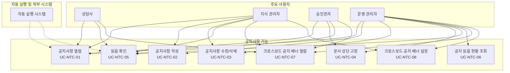
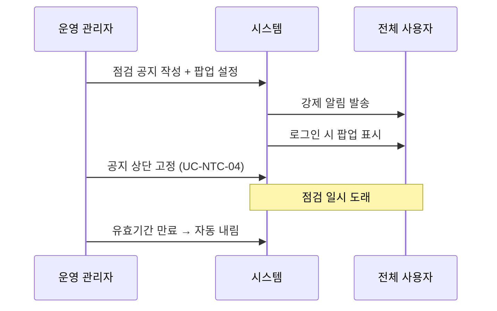

# 공지사항 유즈케이스

> **비즈니스 목표**: 조직 전체에 전달해야 하는 중요 정보(정책 변경, 시스템 안내, 교육 공지 등)를 체계적으로 게시·배포하고, 대상 사용자의 열람 여부를 추적하여 정보 전달의 완결성을 보장한다. 금융권 컴플라이언스 요건에 따라 규정 변경 공지의 읽음 확인 증빙을 관리하고, 긴급 공지의 즉시 도달을 지원한다.

> **관련 기능정의서**: [FD-NTC-공지사항](../../features/FD-NTC-공지사항.md)

---

## 개요 다이어그램

> 아래 다이어그램은 공지사항 기능의 주요 흐름과 액터 관계를 보여줍니다.

---

## UC-NTC-01: 공지사항 열람

**사용자**: 상담사, 지식 관리자, 승인권자, 운영 관리자

→ [FD-NTC](../../features/FD-NTC-공지사항.md) §1 공지사항 게시판, §4 읽음 확인

**사전 조건**:
- 사용자가 로그인되어 있어야 한다.
- 공지사항 게시판에 게시된 공지가 하나 이상 있어야 한다.

> **공지사항 게시판이란?** 조직 전체 또는 특정 대상에게 중요 정보를 전달하기 위한 전용 게시판입니다. 일반 지식 문서 게시판과 달리, 열람 권한이 전체 사용자에게 기본 부여되며, 읽음 확인·팝업 표시·상단 고정 등 공지 전용 기능을 제공합니다. 공지사항 게시판도 일반 게시판처럼 트리 구조로 구성할 수 있어, "시스템 공지", "정책/규정 변경", "교육 안내" 등으로 분류할 수 있습니다.

**기본 흐름**:
1. 사용자가 공지사항 게시판 목록에 접근한다 — 좌측 메뉴, 홈 대시보드 위젯, 알림 링크 등을 통해 접근할 수 있다.
2. 시스템이 공지사항 목록을 표시한다 — 상단 고정된 공지가 먼저 표시되고, 나머지는 최신순으로 정렬된다.
3. 각 공지에는 제목, 작성자, 게시일, 읽음 확인 필수 여부가 표시된다.
4. 사용자가 공지를 선택하면 상세 내용이 표시된다.
5. 시스템이 해당 사용자의 열람 기록을 저장한다.

**대안 흐름**:
- **1a. 로그인 시 팝업 공지 표시**: 관리자가 팝업으로 설정한 공지가 있으면, 사용자가 로그인 직후 팝업 창으로 공지 내용이 표시된다. 팝업 표시 빈도는 공지별로 설정되어 있다 — "1회만 표시", "매 로그인 시 표시", "매일 1회 표시" 등이 가능하다. 사용자가 팝업에서 "확인" 또는 "다시 보지 않기"를 선택할 수 있다. "다시 보지 않기"를 선택한 공지는 해당 사용자에게 더 이상 팝업으로 표시되지 않는다. 팝업이 여러 건인 경우 순차적으로 표시되며, 사용자가 하나씩 확인한다. *(팝업 표시 상태 추적 방식은 FD-NTC OPEN-NTC-02에서 검토 중이다.)*
- **1b. 홈 대시보드에서 공지 확인**: 홈 대시보드(UC-PER-05)의 "최신 공지" 위젯에서 최근 공지 목록을 확인하고, 클릭하면 공지 상세 페이지로 이동한다. 홈 대시보드에는 크로스보드 공지 배너를 별도로 표시하지 않으며, 기존 '최신 공지' 위젯으로 공지를 안내한다.
- **1c. 알림을 통한 접근**: 새 공지 등록 시 발송된 알림(이메일, 브라우저 알림 등)을 통해 공지 상세 페이지로 직접 이동한다.
- **1d. 다른 게시판의 배너를 통한 접근**: 사용자가 지식 문서 게시판, 커뮤니티 게시판 등에서 상단에 표시된 크로스보드 공지 배너를 클릭하면, 해당 공지 상세 페이지로 이동한다. 이후 흐름은 기본 흐름 4~5단계와 동일하다. 크로스보드 공지 배너의 표시 조건 및 동작은 UC-NTC-07을 참조한다.
- **2a. 하위 게시판 구분 표시**: 공지사항 게시판이 트리 구조로 구성된 경우(예: 시스템 공지, 정책 변경, 교육 안내), 하위 게시판별로 필터링하여 조회할 수 있다. 전체 공지를 통합 목록으로 볼 수도 있다.
- **2b. 읽지 않은 공지 강조 표시**: 아직 열람하지 않은 공지에는 "읽지 않음" 표시(예: 볼드체, 뱃지)가 적용되어 한눈에 구분된다.
- **2c. 유효기간 만료 공지**: 유효기간이 설정된 공지가 만료되면 목록에서 제외된다. 사용자가 만료된 공지의 링크를 통해 접근하면 "이 공지는 유효기간이 만료되었습니다" 안내가 표시된다.
- **4a. 공지 상세에서 첨부파일 다운로드**: 공지에 첨부파일이 있으면 상세 페이지에서 직접 다운로드할 수 있다.
- **4b. 읽음 확인 필수 공지**: 읽음 확인이 필수로 설정된 공지의 경우, 상세 페이지 하단에 "확인" 버튼이 표시된다. 확인 절차는 UC-NTC-05를 참조한다.
- **4c. 검색을 통한 공지 조회**: 키워드 검색(UC-SCH-01)에서 공지사항도 검색 결과에 포함된다. 관리자가 공지사항 게시판에 AI 답변 검색 포함을 설정한 경우, AI 답변 검색(UC-SCH-02)에서도 참조된다.
- **5a. 교대 근무 시 미확인 공지 일괄 확인**: 교대 근무 후 출근한 상담사가 부재 기간 동안 게시된 공지를 한눈에 파악할 수 있도록, 시스템이 "미확인 공지 N건"을 상단에 요약하여 표시한다. 사용자가 "미확인 공지 모아보기"를 클릭하면 부재 기간 중 게시된 공지만 필터링하여 시간순으로 표시된다.

**예외 흐름**:
- **E1. 네트워크 장애**: 공지 목록 또는 상세 로딩 중 네트워크가 끊기면 "공지를 불러올 수 없습니다. 네트워크 연결을 확인하세요" 안내가 표시된다.
- **E2. 서버 오류**: 공지 조회 요청에 서버가 오류를 반환하면 "일시적인 오류가 발생했습니다. 잠시 후 다시 시도해 주세요" 안내가 표시된다.
- **E3. 세션 만료**: 공지 열람 중 세션이 만료되면, 재로그인 후 해당 공지 상세 페이지로 자동 복귀한다.
- **E4. 팝업 공지 표시 중 오류**: 로그인 시 팝업 공지 로딩에 실패하면 팝업을 건너뛰고 홈 화면으로 이동한다. 이후 홈 대시보드의 "최신 공지" 위젯에서 확인할 수 있다.
- **E5. 공지 열람 도중 긴급 회수**: 열람 중인 공지가 긴급 회수(UC-DOC-09)되면, 다음 페이지 이동 또는 새로고침 시 "이 공지는 일시 중단되었습니다" 안내가 표시된다.

**사후 조건**:
- 사용자의 열람 기록이 저장된다 (열람 시각, 사용자 정보).
- 감사 로그에 공지 열람 기록이 남는다.
- 열람 통계(공지별 열람 수, 열람율)가 갱신된다.
- 읽음 확인 필수 공지의 경우, 열람만으로는 확인 처리되지 않는다 — "확인" 버튼 클릭이 별도로 필요하다 (UC-NTC-05).

---

## UC-NTC-02: 공지사항 작성

**사용자**: 운영 관리자, 지식 관리자 (해당 공지사항 게시판에 편집 권한이 있는 경우)

→ [FD-NTC](../../features/FD-NTC-공지사항.md) §2 공지사항 작성/수정/삭제, §5 공지 알림

**사전 조건**:
- 사용자가 로그인되어 있어야 한다.
- 해당 공지사항 게시판에 편집 권한을 가지고 있어야 한다.

**기본 흐름**:
1. 사용자가 공지사항 게시판을 선택하고 "새 공지 작성"을 클릭한다.
2. 시스템이 블록 편집기를 연다 — 기존 문서 작성과 동일한 편집기를 사용한다 (UC-DOC-01 참조).
3. 사용자가 제목을 입력하고, 블록 편집기에서 공지 본문을 작성한다.
4. 사용자가 공지 옵션을 설정한다:
   - **읽음 확인 필수 여부**: "읽음 확인 필수"를 켜면, 대상 사용자가 반드시 "확인" 버튼을 클릭해야 한다.
   - **팝업 공지 여부**: "팝업 표시"를 켜면, 대상 사용자의 로그인 시 팝업으로 표시된다.
   - **팝업 표시 빈도**: 1회만, 매 로그인 시, 매일 1회 중 선택한다.
   - **유효기간**: 한시적 공지인 경우 만료 날짜를 설정한다.
   - **알림 대상**: 전체 사용자 또는 특정 역할/그룹을 선택한다.
   - **배너 표시**: "다른 게시판에 배너로 표시"를 켜면, 지정한 대상 게시판의 상단에 해당 공지가 배너로 노출된다. 배너 대상 게시판 선택 및 표시 대상 설정은 UC-NTC-08을 참조한다.
5. 사용자가 태그를 입력한다.
6. 사용자가 "게시"를 클릭하면, 공지사항 게시판의 승인 설정에 따라 처리된다 — 승인이 필요 없으면 즉시 "게시됨" 상태가 되고, 승인이 필요하면 승인 요청(UC-APR-01) 흐름을 따른다.
7. 게시 완료 시, 시스템이 설정된 알림 대상에게 "새 공지가 등록되었습니다 — '(공지 제목)'" 알림을 강제 발송한다.

**대안 흐름**:
- **2a. 문서 양식 활용**: 공지사항 게시판에 문서 양식이 설정되어 있으면, 양식을 선택하여 미리 채워진 구조로 시작할 수 있다. 예: "정책 변경 공지 양식", "시스템 점검 안내 양식" 등.
- **3a. 기존 공지 복제하여 작성**: 반복적인 공지(월례 보고, 정기 점검 안내 등)의 경우, 이전 공지를 복제하여 변경된 부분만 수정할 수 있다 (UC-DOC-01 대안 흐름 1a와 동일).
- **4a. 읽음 확인 대상 범위 지정**: 읽음 확인 필수를 설정할 때, 확인 대상을 "전체 사용자", "특정 역할", "특정 그룹"으로 세분화할 수 있다. 예: "상담사 전원 필수 확인" 또는 "지식 관리자만 필수 확인".
- **4b. 예약 게시**: 특정 날짜/시간에 자동 게시되도록 예약할 수 있다. 예: "2026-04-07 09:00에 게시" 설정 시, 해당 시점에 자동으로 게시되고 알림이 발송된다. 승인 없는 공지 게시판에서는 `Document.scheduled_publish_at`을 사용한다 ([FD-DOC](../../features/FD-DOC-문서관리.md) §1 참조). 승인이 필요한 게시판에서는 승인 완료 후 예약 배포가 설정된다 ([FD-APR](../../features/FD-APR-승인워크플로.md) §11.3 참조).
- **4c. 읽음 확인 기한 설정**: 읽음 확인 필수 공지에 확인 기한을 설정할 수 있다 — "게시 후 N일 이내 확인". 기한 내 미확인자에게 자동 리마인더 알림이 발송된다 (UC-NTC-05 참조).
- **6a. 승인 후 게시**: 해당 공지사항 게시판에 승인 정책이 연결되어 있으면, "게시" 클릭 시 승인 요청(UC-APR-01) 흐름을 따른다. 승인 완료 후 자동으로 게시되고 알림이 발송된다.
- **6b. 임시 저장**: 작성 중인 공지를 임시 저장하여 나중에 이어서 작성할 수 있다 (UC-DOC-05 참조).
- **7a. 알림 채널 선택**: 공지의 중요도에 따라 알림 채널을 추가 선택할 수 있다 — 시스템 내 알림만, 이메일 포함, 긴급 알림(팝업 + 이메일) 등. 알림 채널은 관리자가 공지사항 게시판 설정에서 허용한 범위 내에서 선택 가능하다.
- **3b. 정책 변경 공지 작성**: 규정/정책이 변경된 경우, 사용자가 공지 본문에 변경 전/후 내용을 비교 형태로 작성하고, 읽음 확인 필수 + 팝업 표시를 함께 설정한다. 규정 근거(법령명, 조항, 시행일)를 명시하면 컴플라이언스 감사 시 증빙으로 활용할 수 있다.
- **4d. AI 답변 검색 포함 설정**: 관리자가 해당 공지사항 게시판에 AI 답변 검색 포함을 허용한 경우, 작성자가 공지별로 "AI 답변 검색에 포함" 여부를 선택할 수 있다. 정책 공지처럼 장기 참조가 필요한 경우 포함하고, 일시적 안내(점검 일정 등)는 제외한다.

**예외 흐름**:
- **E1. 네트워크 장애**: 작성 중 네트워크가 끊기면 편집기 상단에 "오프라인 상태" 경고가 표시되고, 로컬에 변경 내용이 임시 보관된다. 연결 복구 시 자동으로 서버에 동기화를 시도한다.
- **E2. 서버 오류**: 게시 요청에 서버가 오류를 반환하면 "게시에 실패했습니다. 잠시 후 다시 시도해 주세요" 안내가 표시되고, 작성 내용은 임시 저장 상태로 보존된다.
- **E3. 권한 변경 중 접근**: 작성 도중 관리자가 해당 게시판의 편집 권한을 해제하면, 다음 자동 저장 시점에 "편집 권한이 없습니다" 안내가 표시되고, 작성 중이던 내용은 임시 저장된 상태로 보존된다.
- **E4. 세션 만료**: 작성 중 로그인 세션이 만료되면 "세션이 만료되었습니다. 다시 로그인해 주세요" 안내가 표시된다. 작성 중이던 내용은 로컬에 임시 보관되며, 재로그인 후 자동으로 편집 화면으로 복귀하여 이어서 작성할 수 있다.
- **E5. 알림 발송 실패**: 게시는 완료되었으나 일부 대상에게 알림 발송이 실패한 경우, 시스템이 자동으로 재시도한다. 반복 실패 시 운영 관리자에게 "공지 알림 발송 실패 — 미발송 대상 N명" 알림이 발송된다. 공지 게시 자체는 알림 발송 성공 여부와 무관하게 완료된다.
- **E6. 파일 용량 초과**: 첨부파일 업로드 시 관리자가 설정한 단일 파일 용량 제한을 초과하면 "파일 크기가 제한을 초과합니다" 안내가 표시되고 업로드가 차단된다.

**사후 조건**:
- 공지가 "게시됨" 상태로 공지사항 게시판에 표시된다.
- 설정된 알림 대상에게 강제 알림이 발송된다 (구독 여부와 무관).
- 팝업 공지로 설정된 경우, 대상 사용자의 다음 로그인 시 팝업이 표시된다.
- 키워드 검색에 공지 내용이 반영된다.
- 감사 로그에 공지 작성 기록(작성자, 게시판, 공지 옵션, 알림 대상, 시각)이 남는다.
- 공지 통계(게시판별 공지 건수)가 갱신된다.

---

## UC-NTC-03: 공지사항 수정/삭제

**사용자**: 운영 관리자, 지식 관리자 (해당 공지 작성자이자 편집 권한 보유자)

→ [FD-NTC](../../features/FD-NTC-공지사항.md) §2.3 수정 규칙, §2.4 삭제 규칙

**사전 조건**:
- 수정: 해당 공지사항 게시판에 편집 권한을 가지고 있어야 한다.
- 삭제: 공지 작성자이거나, 해당 작업에 필요한 `BoardPermission`/`AdminPermission`을 보유해야 한다([FD-ACL](../../features/FD-ACL-권한체계.md)).

### 수정

**기본 흐름**:
1. 사용자가 게시된 공지의 상세 페이지에서 "수정" 버튼을 클릭한다.
2. 시스템이 현재 게시된 공지는 그대로 유지한 채, 새로운 "작성 중" 버전을 만든다 — 기존 공지는 수정 완료 전까지 그대로 노출된다 (UC-DOC-03과 동일).
3. 사용자가 블록 편집기에서 내용을 수정한다.
4. 사용자가 공지 옵션(읽음 확인, 팝업, 유효기간 등)을 변경할 수 있다.
5. 수정 완료 후 게시판의 승인 설정에 따라 즉시 게시 또는 승인 요청(UC-APR-01) 흐름을 따른다.

**대안 흐름**:
- **3a. 읽음 확인 재설정**: 수정 내용이 중대한 경우(예: 정책 변경 사항 정정), 읽음 확인 현황을 초기화하여 모든 대상 사용자가 다시 확인하도록 설정할 수 있다. 초기화 시 "이 공지의 읽음 확인이 재설정됩니다. 대상 사용자가 다시 확인해야 합니다. 계속하시겠습니까?" 확인 대화상자가 표시된다.
- **3b. 수정 알림 발송**: 수정된 공지가 게시되면, 기존 알림 대상에게 "공지 '(제목)'이(가) 수정되었습니다" 알림이 발송된다. 작성자가 수정 시 "수정 알림 발송 안 함"을 선택할 수 있다 (경미한 오탈자 수정 등).
- **4a. 편집 잠금**: 다른 사용자가 같은 공지를 이미 수정하고 있으면, "OO님이 수정 중입니다" 안내가 표시되고 수정이 차단된다 (UC-DOC-01 대안 흐름 5c와 동일).
- **4b. 배너 대상 게시판 수정**: 이미 배너로 노출 중인 공지의 배너 대상 게시판을 변경할 수 있다 — 게시판을 추가하거나 제거하면 즉시 반영된다. 배너를 해제(OFF)하면 모든 게시판에서 배너가 즉시 제거된다 (UC-NTC-08 참조).
- **5a. 정책 변경 공지 정정 시나리오**: 컴플라이언스 담당자가 이미 게시된 정책 변경 공지에 오류를 발견한 경우, 긴급 수정 후 읽음 확인을 재설정하고 "정정 공지" 표시를 붙여 재게시한다. 감사 로그에 "정정 사유"가 기록되고, 정정 전/후 내용이 버전 이력으로 관리된다.

### 삭제

**기본 흐름**:
1. 사용자가 공지의 상세 페이지에서 "삭제" 버튼을 클릭한다.
2. 시스템이 삭제 확인 대화상자를 표시한다.
3. 사용자가 확인하면, 시스템이 공지를 "삭제됨" 상태로 표시한다 — 완전히 지우는 것이 아니라 삭제 표시를 하는 것이므로 관리자가 복구할 수 있다 (UC-DOC-04와 동일).
4. 시스템이 공지를 검색 결과에서 제외한다.
5. 배너로 설정된 공지인 경우, 모든 대상 게시판의 배너 영역에서 즉시 제거된다.

**대안 흐름**:
- **1a. 읽음 확인 진행 중 삭제 시도**: 읽음 확인이 진행 중인 공지를 삭제하려 하면, "읽음 확인이 진행 중인 공지입니다. 삭제 후에도 읽음 확인 현황은 감사 목적으로 보존되지만, 사용자에게 더 이상 표시되지 않습니다. 계속하시겠습니까?" 경고가 표시된다.
- **3a. 관리자 복구**: 운영 관리자가 삭제된 공지를 복구할 수 있다. 복구된 공지는 "작성 중" 상태로 돌아가며, 재게시가 필요하다. 읽음 확인 현황은 삭제 전 데이터로 복원된다.

**예외 흐름**:
- **E1. 네트워크 장애**: 수정/삭제 요청 중 네트워크가 끊기면 요청 실패 안내가 표시되고, 원래 상태가 유지된다.
- **E2. 서버 오류**: 서버 오류 발생 시 "처리에 실패했습니다. 잠시 후 다시 시도해 주세요" 안내가 표시된다.
- **E3. 동시성 충돌**: 수정 중 다른 사용자가 같은 공지를 수정하려 하면 편집 잠금으로 차단된다. 삭제 시 다른 사용자가 편집 중이면 "다른 사용자가 수정 중인 공지는 삭제할 수 없습니다" 안내가 표시된다.
- **E4. 승인 대기 중 삭제 시도**: 공지가 승인 대기 중인 상태에서 삭제를 시도하면, "승인 요청 중인 공지는 삭제할 수 없습니다. 먼저 승인 요청을 철회해 주세요" 안내가 표시된다.

**사후 조건**:
- 수정: 새 버전이 게시되면 이전 버전은 "보관됨"으로 전환된다. 변경 이력이 버전으로 관리된다. 감사 로그에 수정 기록(수정자, 변경 사유, 시각)이 남는다.
- 삭제: 공지가 "삭제됨"으로 표시되어 검색에서 제외된다. 감사 로그에 삭제 기록(삭제자, 사유, 시각)이 남는다. 읽음 확인 현황 데이터는 감사 목적으로 보존된다.

---

## UC-NTC-04: 문서 상단 고정

**사용자**: 운영 관리자, 승인권자 (해당 게시판의 승인 권한 보유자)

→ [FD-NTC](../../features/FD-NTC-공지사항.md) §3 문서 상단 고정 (Pin)

> **상단 고정이란?** 특정 문서를 게시판 목록의 최상단에 항상 표시하는 기능입니다. 중요 공지나 필독 문서를 눈에 잘 띄게 배치하여, 사용자가 놓치지 않도록 합니다. 공지사항 게시판뿐 아니라 일반 게시판에서도 사용할 수 있습니다.
>
> **상단 고정과 배너의 차이**: 상단 고정(pin)은 해당 게시판 내 문서 목록의 최상단에 배치하는 기능이고, 크로스보드 공지 배너(UC-NTC-07)는 다른 게시판의 상단에 별도 배너 영역으로 표시하는 기능입니다. 두 기능은 독립적으로 동작하므로, 같은 공지에 상단 고정과 배너를 동시에 설정할 수 있습니다.

**사전 조건**:
- 사용자가 해당 게시판의 승인 권한(`APPROVE` 등)을 보유하거나, 고정에 필요한 `manage_boards` 등 [FD-ACL](../../features/FD-ACL-권한체계.md) 규칙을 충족해야 한다.
- 고정 대상 문서가 "게시됨" 상태여야 한다.

**기본 흐름**:
1. 사용자가 게시판 목록 또는 문서 상세 페이지에서 "상단 고정" 버튼을 클릭한다.
2. 시스템이 해당 문서를 게시판 목록 최상단에 "고정됨" 표시와 함께 배치한다.
3. "공지가 상단에 고정되었습니다" 안내가 표시된다.

**대안 흐름**:
- **1a. 고정 해제**: 이미 고정된 문서에서 "고정 해제" 버튼을 클릭하면 고정이 해제되고, 문서가 일반 정렬 순서에 따라 배치된다.
- **1b. 고정 수 상한 초과**: 게시판당 고정할 수 있는 최대 문서 수(관리자 설정)를 초과하면 "이 게시판의 고정 문서 수가 상한(N건)에 도달했습니다. 기존 고정 문서를 해제한 후 다시 시도해 주세요" 안내가 표시된다.
- **2a. 고정 문서 순서 변경** *(OPEN-NTC-01 — 구현 방식 미확정)*: 여러 문서가 고정된 경우, 운영 관리자가 고정 문서 간의 표시 순서를 변경할 수 있다. 가장 중요한 공지를 최상단에 배치한다. 1차 릴리스에서는 고정 시각 역순(`pinned_at DESC`, 최근 고정이 위)으로 정렬된다. 2차 릴리스에서 `pin_order` 필드를 추가하여 관리자가 고정 문서 간 표시 순서를 직접 제어할 수 있도록 한다.
- **2b. 고정 기간 설정**: 사용자가 고정 시 만료 날짜를 설정할 수 있다. 설정된 날짜가 지나면 자동으로 고정이 해제된다. 설정하지 않으면 수동으로 해제할 때까지 유지된다.
- **1c. 일반 게시판에서 문서 고정**: 공지사항 게시판뿐 아니라 일반 지식 문서 게시판에서도 상단 고정을 사용할 수 있다. 권한 조건은 동일하다.

**예외 흐름**:
- **E1. 네트워크 장애**: 고정/해제 요청 중 네트워크가 끊기면 "요청에 실패했습니다. 네트워크 연결을 확인하세요" 안내가 표시된다.
- **E2. 서버 오류**: 고정/해제 처리 중 서버 오류가 발생하면 "처리에 실패했습니다. 잠시 후 다시 시도해 주세요" 안내가 표시된다.
- **E3. 고정 대상 문서 비공개 전환**: 고정된 문서가 긴급 회수(UC-DOC-09) 등으로 비공개 처리되면, 고정 상태가 자동으로 해제되고 목록에서 제외된다. 문서가 다시 게시되더라도 고정은 자동 복원되지 않으며, 필요 시 다시 고정해야 한다.
- **E4. 고정 대상 문서 삭제**: 고정된 문서가 삭제되면 고정 상태가 자동으로 해제된다.
- **E5. 권한 변경 중 고정 시도**: 고정 버튼 클릭 시점에 사용자의 승인 권한이 해제된 경우, "해당 게시판에 대한 권한이 없습니다" 안내가 표시된다.

**사후 조건**:
- 고정된 문서가 해당 게시판 목록 최상단에 "고정됨" 표시와 함께 표시된다.
- 감사 로그에 고정/해제 기록(수행자, 대상 문서, 게시판, 시각)이 남는다.

---

## UC-NTC-05: 읽음 확인

**사용자**: 상담사, 지식 관리자, 승인권자, 운영 관리자

→ [FD-NTC](../../features/FD-NTC-공지사항.md) §4 읽음 확인

> **읽음 확인이란?** 중요 공지(정책 변경, 규정 안내 등)를 사용자가 실제로 확인했음을 시스템에 기록하는 기능입니다. 금융권에서는 규정 변경 사항을 직원이 인지했다는 증빙이 필요하며, 읽음 확인을 통해 이를 체계적으로 관리합니다.

**사전 조건**:
- 사용자가 로그인되어 있어야 한다.
- 대상 공지가 "읽음 확인 필수"로 설정되어 있어야 한다.
- 사용자가 읽음 확인 대상에 포함되어 있어야 한다.

**기본 흐름**:
1. 사용자가 읽음 확인 필수 공지의 상세 페이지에 접근한다.
2. 시스템이 공지 본문 하단에 "확인" 버튼을 표시한다 — 버튼 위에 "이 공지를 확인하셨으면 아래 '확인' 버튼을 클릭해 주세요" 안내가 표시된다.
3. 사용자가 공지 내용을 읽은 후 "확인" 버튼을 클릭한다.
4. 시스템이 확인 시각과 사용자 정보를 기록하고, "확인 완료" 상태로 변경한다.
5. 버튼이 "확인 완료 (YYYY-MM-DD HH:MM)"로 변경되어 이미 확인했음을 표시한다.

**대안 흐름**:
- **1a. 미확인 공지 알림**: 읽음 확인 필수 공지가 등록되면, 대상 사용자에게 "읽음 확인이 필요한 공지가 있습니다 — '(공지 제목)'" 알림이 발송된다.
- **1b. 리마인더 알림**: 확인 기한이 설정된 공지에서 기한이 다가오면(예: 기한 3일 전, 1일 전), 미확인 사용자에게 자동 리마인더 알림이 발송된다 — "공지 '(제목)'의 확인 기한이 N일 남았습니다."
- **1c. 기한 초과 리마인더**: 확인 기한이 지난 후에도 미확인 상태인 사용자에게 "공지 '(제목)'의 확인 기한이 지났습니다. 즉시 확인해 주세요" 알림이 발송된다. 기한 초과 알림은 관리자가 설정한 간격(예: 매일 1회)으로 반복 발송된다.
- **2a. 확인 전 전체 읽기 유도**: 관리자 설정에 따라, 사용자가 공지 본문을 끝까지 스크롤해야 "확인" 버튼이 활성화되도록 구성할 수 있다. 본문을 끝까지 읽지 않으면 버튼이 비활성 상태로 표시되고 "공지 내용을 끝까지 확인한 후 버튼을 클릭해 주세요" 안내가 표시된다.
- **3a. 이미 확인한 공지 재접근**: 이미 확인을 완료한 공지에 다시 접근하면 "확인 완료" 상태가 유지되고, 다시 확인 버튼이 표시되지 않는다.
- **4a. 팝업 공지에서 읽음 확인**: 팝업 공지에 읽음 확인이 연결된 경우, 팝업 창 하단에 "확인" 버튼이 함께 표시된다. 사용자가 팝업에서 "확인"을 클릭하면 읽음 확인까지 한 번에 처리된다. "나중에 확인"을 선택하면 팝업만 닫히고 읽음 확인은 처리되지 않는다.
- **1d. 교대 근무 시 미확인 공지 우선 표시**: 교대 근무 후 출근한 사용자가 로그인하면, 홈 화면에 "미확인 필수 공지 N건"이 우선 표시되어 빠르게 확인할 수 있도록 안내한다.
- **3b. 부서 이동/역할 변경 시 확인 대상 자동 갱신**: 사용자가 부서 이동 또는 역할 변경 시, 새 역할에 해당하는 읽음 확인 필수 공지가 있으면 확인 대상에 자동으로 추가되어 알림이 발송된다.

**예외 흐름**:
- **E1. 네트워크 장애**: 확인 버튼 클릭 후 네트워크가 끊기면 "확인 요청에 실패했습니다. 네트워크 연결을 확인하세요" 안내가 표시된다. 연결 복구 후 다시 시도할 수 있다.
- **E2. 서버 오류**: 확인 처리 중 서버 오류가 발생하면 "처리에 실패했습니다. 잠시 후 다시 시도해 주세요" 안내가 표시되고, 확인 상태는 변경되지 않는다.
- **E3. 세션 만료**: 확인 버튼 클릭 시 세션이 만료된 경우, 재로그인 후 해당 공지 상세 페이지로 복귀하여 다시 확인할 수 있다.
- **E4. 공지 삭제/회수 중 확인 시도**: 확인 버튼 클릭 시점에 해당 공지가 삭제되거나 긴급 회수된 경우, "해당 공지가 더 이상 유효하지 않습니다" 안내가 표시된다.
- **E5. 중복 확인 요청 무시**: 사용자가 "확인" 버튼을 빠르게 연속 클릭하더라도 시스템은 첫 번째 요청만 처리한다.

**사후 조건**:
- 읽음 확인 기록이 저장된다 (사용자, 확인 시각).
- 감사 로그에 읽음 확인 기록이 남는다 — 금융권 감사 시 "직원이 해당 규정 변경 사항을 언제 인지했는지" 증빙으로 활용된다.
- 해당 공지의 읽음 현황 통계(확인 인원 / 전체 대상 인원)가 갱신된다.
- 기한이 설정된 경우, 미확인 사용자에 대한 리마인더 알림 대상 목록에서 해당 사용자가 제외된다.

---

## UC-NTC-06: 공지 읽음 현황 조회

**사용자**: 운영 관리자

→ [FD-NTC](../../features/FD-NTC-공지사항.md) §4.4 읽음 현황 조회/내보내기

**사전 조건**:
- 사용자가 읽음 현황 조회에 필요한 `manage_boards` 또는 해당 게시판 `APPROVE` 등 [FD-ACL](../../features/FD-ACL-권한체계.md) 요건을 충족해야 한다.
- 조회 대상 공지에 "읽음 확인 필수"가 설정되어 있어야 한다.

**기본 흐름**:
1. 운영 관리자가 공지 상세 페이지 또는 관리 화면에서 "읽음 현황" 버튼을 클릭한다.
2. 시스템이 해당 공지의 읽음 확인 현황을 표시한다:
   - 전체 대상 인원 수
   - 확인 완료 인원 수 및 비율
   - 미확인 인원 수 및 비율
   - 확인율 추이 그래프 (일별)
3. 관리자가 "확인 완료" 또는 "미확인" 탭을 선택하여 사용자 목록을 조회한다.
4. 각 사용자의 이름, 소속 부서/그룹, 역할, 확인 시각(확인한 경우)이 표시된다.

**대안 흐름**:
- **3a. 미확인자에게 리마인더 발송**: 관리자가 미확인 사용자를 선택하여 "리마인더 발송" 버튼을 클릭하면, 선택한 사용자에게 "공지 '(제목)'의 확인이 아직 완료되지 않았습니다" 알림이 발송된다. 전체 미확인자에게 일괄 발송할 수도 있다.
- **3b. 부서/그룹별 확인 현황**: 관리자가 부서별 또는 그룹별로 확인 현황을 필터링하여 조회할 수 있다 — 예: "영업부 상담사 20명 중 15명 확인 (75%)".
- **3c. 기간별 현황 추이**: 관리자가 일별·주별 확인율 추이를 그래프로 확인하여, 리마인더 발송 시점의 효과를 파악할 수 있다.
- **4a. 현황 내보내기**: 관리자가 읽음 확인 현황을 CSV 또는 PDF로 내보내기할 수 있다. 내보내기 파일에는 공지 제목, 게시일, 확인 기한, 대상 사용자 목록, 확인 여부, 확인 시각이 포함된다. 금융권 감사 증빙 자료로 활용할 수 있다.
- **4b. 복수 공지 읽음 현황 비교**: 관리자가 여러 공지의 읽음 현황을 비교 조회할 수 있다 — 예: "이번 달 정책 변경 공지 3건의 확인율 비교". 확인율이 낮은 공지를 식별하여 추가 조치를 취할 수 있다.
- **1a. 관리 화면 일괄 조회**: 관리 화면에서 읽음 확인 필수 공지 목록을 확인율 기준으로 정렬하여, 확인율이 낮은 공지를 한눈에 파악할 수 있다.
- **3d. 확인 기한 초과 현황**: 확인 기한이 설정된 공지에서 기한이 지난 경우, "기한 초과 미확인자" 목록이 별도로 표시되어 즉각적인 조치가 가능하다.

**예외 흐름**:
- **E1. 네트워크 장애**: 현황 조회 중 네트워크가 끊기면 "현황을 불러올 수 없습니다" 안내가 표시된다.
- **E2. 서버 오류**: 현황 데이터 로딩 중 오류가 발생하면 "데이터를 불러오는 데 실패했습니다" 안내가 표시된다.
- **E3. 리마인더 발송 실패**: 리마인더 알림 발송에 실패한 경우, "일부 사용자에게 리마인더를 보내지 못했습니다" 안내와 함께 실패 대상 목록이 표시된다. 관리자가 재발송할 수 있다.
- **E4. 대상 사용자 퇴사/비활성**: 읽음 확인 대상이었던 사용자가 퇴사(계정 비활성)된 경우, 현황에서 "(퇴사)" 표시와 함께 미확인 상태로 표시된다. 해당 사용자는 확인율 산정 시 분모에서 제외할 수 있는 옵션이 제공된다.

**사후 조건**:
- 현황 조회 기록이 감사 로그에 남는다.
- 리마인더를 발송한 경우, 발송 기록(대상자, 발송 시각)이 감사 로그에 기록된다.
- 내보내기를 수행한 경우, 내보내기 기록이 감사 로그에 남는다.

---

## UC-NTC-07: 크로스보드 공지 배너 열람

**사용자**: 상담사, 지식 관리자, 승인권자, 운영 관리자

→ [FD-NTC](../../features/FD-NTC-공지사항.md) §2.5 크로스보드 배너 규칙, §1.3 board_config 배너 수신 설정

> **크로스보드 공지 배너란?** 공지사항 게시판이 아닌 다른 게시판(지식 문서, 커뮤니티, 커스텀 게시판)의 상단에 별도 배너 영역으로 표시되는 공지입니다. 사용자가 어떤 게시판에서 작업하든 중요 공지를 놓치지 않도록 안내하며, 기존 문서 목록과 분리된 독립적인 영역에 표시됩니다.

**사전 조건**:
- 사용자가 로그인되어 있어야 한다.
- 크로스보드 배너로 설정된 활성 공지(게시됨 상태 + 배너 설정 켜짐)가 하나 이상 있어야 한다.
- 해당 게시판에서 크로스보드 공지 배너 표시가 허용되어 있어야 한다 (관리자가 게시판별로 배너 수신을 설정한다 — UC-ADM-01 참조).

**기본 흐름**:
1. 사용자가 공지사항 게시판이 아닌 일반 게시판(지식 문서, 커뮤니티, 커스텀 게시판)에 접근한다.
2. 시스템이 해당 게시판의 상단에 배너 영역을 표시한다 — 현재 활성화된 크로스보드 공지 중, 이 게시판이 배너 대상에 포함되고 사용자가 표시 대상에 해당하는 공지가 표시된다.
3. 각 배너에는 공지 제목, 게시일, 읽음 확인 필수 여부가 간략하게 표시된다.
4. 사용자가 배너를 클릭하면 해당 공지의 상세 페이지로 이동한다.
5. 시스템이 해당 사용자의 열람 기록을 저장한다 — 배너를 통한 접근도 직접 접근과 동일하게 처리된다.

**대안 흐름**:
- **2a. 배너 여러 건 표시**: 배너 대상 공지가 여러 건이면, 관리자가 설정한 최대 표시 건수까지 표시되고, 초과분은 "N건 더보기" 링크로 안내된다. 더보기를 클릭하면 공지사항 게시판 목록으로 이동한다.
- **2b. 배너 표시 대상 판단**: 배너의 표시 대상은 공지의 알림 대상 설정(전체 사용자 / 특정 역할 / 특정 그룹)과 동일한 기준으로 판단된다. 해당 게시판의 열람 권한이 있더라도 공지의 알림 대상에 포함되지 않으면 배너가 표시되지 않는다. 배너 표시 대상은 공지의 알림 대상 설정(전체 사용자 / 특정 역할 / 특정 그룹)과 통합되어 동일한 기준으로 판단된다.
- **3a. 읽음 확인 필수 공지 배너**: 읽음 확인이 필수인 공지가 배너로 표시될 때, 배너에 "확인 필요" 표시가 함께 나타난다. 사용자가 배너를 클릭하여 공지 상세 페이지로 이동한 후 확인 절차를 수행한다 (UC-NTC-05 참조). 배너 영역에서 인라인 확인은 지원하지 않는다 — 사용자가 배너를 클릭하여 공지 상세 페이지로 이동한 후 확인 절차를 수행한다 (UC-NTC-05 참조).
- **4a. 배너 닫기**: 사용자가 배너의 "닫기" 버튼을 클릭하면 해당 공지 배너가 화면에서 숨겨진다. 닫은 배너는 배너 영역의 "숨긴 공지 N건" 링크를 통해 다시 확인할 수 있다. 닫기 상태는 클라이언트 로컬스토리지에 저장되어 동일 브라우저에서 유지된다. 공지가 수정 재게시되면 닫기 상태가 초기화되어 배너가 다시 표시된다. 디바이스 간 동기화는 되지 않으므로, 다른 PC에서는 배너가 다시 표시될 수 있다.
- **4b. 배너에서 공지 상세 이동 후 흐름**: 배너 클릭으로 공지 상세 페이지에 진입한 이후의 흐름은 UC-NTC-01 기본 흐름 4~5단계와 동일하다 — 첨부파일 다운로드, 읽음 확인 등 모든 기능을 동일하게 사용할 수 있다.
- **2c. 모바일/좁은 화면에서 배너 축소**: 모바일 환경이나 화면 너비가 좁은 경우, 배너가 축소 형태(제목만 표시)로 나타나며, 탭하면 전체 내용이 펼쳐진다.

**예외 흐름**:
- **E1. 배너 로딩 실패**: 배너 데이터 로딩 중 오류가 발생하면, 배너 영역만 빈 상태로 처리된다 — 게시판의 문서 목록 표시에는 영향을 주지 않는다.
- **E2. 공지 삭제/회수 후 배너 접근**: 사용자가 배너를 클릭하는 시점에 해당 공지가 삭제되거나 긴급 회수된 경우, "해당 공지가 더 이상 유효하지 않습니다" 안내가 표시되고 배너가 자동으로 제거된다.
- **E3. 세션 만료**: 배너 클릭 시 세션이 만료된 경우, 재로그인 후 해당 공지 상세 페이지로 자동 복귀한다.

**사후 조건**:
- 배너를 통한 공지 접근도 직접 접근과 동일하게 열람 기록이 저장된다 (열람 시각, 사용자 정보, 접근 경로).
- 감사 로그에 공지 열람 기록이 남는다 — 배너 경유 여부가 접근 경로로 구분된다.
- 열람 통계(공지별 열람 수, 열람율)가 갱신된다.

---

## UC-NTC-08: 크로스보드 공지 배너 설정 (작성자)

**사용자**: 운영 관리자, 지식 관리자 (해당 공지사항 게시판에 편집 권한이 있는 경우)

→ [FD-NTC](../../features/FD-NTC-공지사항.md) §2.2 공지 옵션 (배너 필드), §2.5 크로스보드 배너 규칙

**사전 조건**:
- 사용자가 공지사항 작성/수정 화면에 있어야 한다 (UC-NTC-02 또는 UC-NTC-03).
- 해당 공지사항 게시판에 편집 권한을 가지고 있어야 한다.

**기본 흐름**:
1. 사용자가 공지 작성 또는 수정 화면의 공지 옵션 영역에서 "다른 게시판에 배너로 표시" 옵션을 켠다.
2. 시스템이 배너 대상 게시판 선택 화면을 표시한다.
3. 사용자가 배너 대상을 선택한다:
   - **모든 게시판에 표시**: 배너 수신이 허용된 모든 게시판에 배너가 표시된다.
   - **특정 게시판만 선택**: 게시판 트리 구조에서 원하는 게시판을 체크하여 선택한다.
4. 배너 표시 대상(배너를 볼 수 있는 사용자)은 공지의 알림 대상 설정과 동일하게 적용된다 — 알림 대상을 "전체 사용자"로 설정하면 배너도 전체 사용자에게 표시되고, "특정 역할/그룹"으로 설정하면 해당 대상에게만 배너가 표시된다. *(배너 표시 대상을 알림 대상과 별도로 설정할 수 있는지는 FD-NTC OPEN-NTC-07에서 검토 중이다.)*
5. 사용자가 공지를 게시하면, 대상 게시판의 배너 영역에 해당 공지가 즉시 표시된다.

**대안 흐름**:
- **1a. 팝업과 배너 동시 설정**: 팝업 표시와 배너 표시를 동시에 설정할 수 있다 — 팝업은 로그인 시 1회(또는 설정된 빈도에 따라) 표시되고, 배너는 대상 게시판에 접근할 때마다 상단에 표시된다. 두 기능은 독립적으로 동작한다.
- **1b. 상단 고정과 배너 동시 설정**: 공지사항 게시판 내 상단 고정(UC-NTC-04)과 다른 게시판에 배너 표시를 동시에 설정할 수 있다 — 상단 고정은 공지사항 게시판 내에서, 배너는 다른 게시판에서 각각 독립적으로 동작한다.
- **3a. 배너 수신이 비허용된 게시판 안내**: 관리자가 배너 수신을 OFF로 설정한 게시판은 선택 화면에서 비활성(회색) 상태로 표시되고, "이 게시판은 배너 표시가 허용되지 않습니다"라는 안내가 나타난다.
- **5a. 배너 해제**: 작성자 또는 관리자가 공지 수정 화면에서 "다른 게시판에 배너로 표시" 옵션을 끄면, 모든 대상 게시판에서 배너가 즉시 제거된다.
- **5b. 배너 대상 게시판 변경**: 이미 배너로 노출 중인 공지의 배너 대상 게시판을 변경할 수 있다 — 게시판을 추가하거나 제거하면 즉시 반영된다.

**예외 흐름**:
- **E1. 네트워크 장애**: 배너 설정 저장 중 네트워크가 끊기면 "배너 설정을 저장하지 못했습니다. 다시 시도해 주세요" 안내가 표시된다. 공지 본문 등 다른 옵션은 별도로 임시 저장된다.
- **E2. 서버 오류**: 배너 설정 처리 중 서버 오류가 발생하면 "처리에 실패했습니다. 잠시 후 다시 시도해 주세요" 안내가 표시된다.
- **E3. 대상 게시판 삭제**: 배너 대상으로 선택한 게시판이 삭제된 경우, 해당 게시판은 배너 대상에서 자동으로 제외된다. 나머지 게시판에는 영향이 없다.

**사후 조건**:
- 게시 완료 시, 대상 게시판의 배너 영역에 공지가 즉시 표시된다.
- 감사 로그에 배너 설정 기록(설정자, 대상 게시판, 배너 대상 유형, 시각)이 남는다.
- 배너 설정이 변경되면(추가/해제/대상 변경) 감사 로그에 변경 기록이 남는다.

---

## 현업 업무 흐름

> 아래는 공지사항 기능이 실제 업무 현장에서 활용되는 대표적인 패턴을 정리한 것이다. 각 시나리오는 위의 UC를 조합하여 구현된다.

### 정책/규정 변경 공지 전체 사이클

금융권에서 규정이 변경되면 해당 사항을 모든 관련 직원이 인지했음을 증빙해야 한다. 공지사항 기능을 활용한 전체 흐름:

1. 컴플라이언스 담당자가 규정 변경 사항을 정리하여 공지를 작성한다 (UC-NTC-02). 변경 전/후 비교 내용과 규제 근거(법령명, 조항, 시행일)를 포함한다.
2. "읽음 확인 필수 + 팝업 표시"를 설정하고, 확인 기한을 시행일 전일로 지정한다.
3. 알림 대상을 "전체 상담사 + 지식 관리자"로 설정하여 게시한다.
4. 시스템이 대상 사용자에게 강제 알림을 발송하고, 다음 로그인 시 팝업으로 표시한다.
5. 사용자들이 공지를 확인하고 "확인" 버튼을 클릭한다 (UC-NTC-05).
6. 운영 관리자가 주기적으로 읽음 현황을 조회하여 (UC-NTC-06), 확인율이 낮은 부서에 리마인더를 발송한다.
7. 확인 기한 전일에 미확인자에게 자동 리마인더가 발송된다.
8. 시행일 시점에 전체 확인 현황을 CSV로 내보내기하여 감사 증빙으로 보관한다.

> 이 전체 이력(공지 작성, 알림 발송, 개별 확인 시각, 리마인더 발송, 현황 내보내기)이 감사 로그에 기록되어, 향후 규제 감사 시 "해당 규정 변경 사항을 직원에게 통보하고 인지를 확인한 증거"로 활용된다.

### 시스템 정기 점검 공지

1. 운영 관리자가 점검 안내 공지를 작성한다 (UC-NTC-02). "시스템 점검 안내 양식"을 활용하여 점검 일시, 영향 범위, 대체 절차를 기재한다.
2. 팝업 표시를 "매일 1회"로 설정하여, 점검일까지 매일 로그인 시 안내한다.
3. 유효기간을 점검 완료 예정일로 설정한다.
4. 공지를 상단 고정(UC-NTC-04)하여 게시판 목록에서 눈에 띄게 배치한다.
5. 점검 완료 후 유효기간 만료로 자동 내려가거나, 관리자가 수동으로 고정을 해제한다.

### 교대 근무 환경에서의 공지 확인

컨택센터의 교대 근무 환경에서 공지를 빠짐없이 전달하는 패턴:

1. 주간 근무 중에 정책 변경 공지가 게시된다 (UC-NTC-02).
2. 주간 근무자들은 즉시 알림을 받고 확인한다 (UC-NTC-05).
3. 야간 교대조가 출근하여 로그인하면, 팝업 공지와 함께 "미확인 필수 공지 1건" 안내가 표시된다 (UC-NTC-01).
4. 야간 근무자가 공지를 확인하고 "확인" 버튼을 클릭한다.
5. 운영 관리자가 다음 날 아침 읽음 현황을 조회하여 (UC-NTC-06), 주간·야간 교대조 모두 확인했는지 점검한다.
6. 미확인자가 있으면 리마인더를 발송하고, 해당 교대조 관리자에게 별도 안내한다.

### 긴급 공지 — 장애/보안 사고 안내

시스템 장애나 보안 사고 발생 시 즉각적인 공지 전달:

1. 운영 관리자가 긴급 공지를 작성한다 — 승인 절차 없이 즉시 게시되도록 공지사항 게시판의 승인이 꺼져 있다.
2. 팝업 표시를 "매 로그인 시"로 설정하고, 알림 대상을 "전체 사용자"로 지정한다.
3. 게시 즉시 시스템이 모든 사용자에게 강제 알림을 발송한다.
4. 현재 로그인 중인 사용자에게는 브라우저 알림이 즉시 표시된다.
5. 공지를 상단 고정(UC-NTC-04)하여 최상단에 배치한다.
6. 상황이 해소되면, 운영 관리자가 공지를 수정하여 "해소됨" 상태를 업데이트하고, 팝업 설정을 해제한다 (UC-NTC-03).

### 신규 입사자 대상 필수 안내 공지

1. 운영 관리자가 신규 입사자 대상 필수 안내 공지를 상시 게시하고 상단 고정한다 — 사내 규정, 시스템 이용 안내, 보안 교육 안내 등.
2. 읽음 확인 필수로 설정하고, 확인 대상을 "전체 사용자"로 지정한다.
3. 신규 입사자가 계정을 생성하면 자동으로 확인 대상에 포함되어 알림을 받는다 (UC-NTC-05 대안 흐름 3b).
4. 입사자가 공지를 확인하고 "확인" 버튼을 클릭한다.
5. 인사 담당자 또는 운영 관리자가 읽음 현황을 조회하여 (UC-NTC-06) 신규 입사자의 필수 공지 확인 여부를 점검한다.

### 전사 긴급 공지 배너

시스템 장애나 긴급 상황 발생 시, 모든 사용자가 어떤 게시판에서 작업하든 즉시 인지할 수 있도록 배너를 활용하는 패턴:

1. 시스템 장애가 감지되어, 운영 관리자가 긴급 공지를 작성한다 (UC-NTC-02). 장애 상황, 영향 범위, 대체 절차를 기재한다.
2. "모든 게시판에 배너로 표시"를 설정하고 (UC-NTC-08), 알림 대상을 "전체 사용자"로 지정한다.
3. 팝업 표시를 함께 설정하여, 로그인 시에도 즉시 안내되도록 한다.
4. 게시 즉시, 전 사용자가 어떤 게시판에서 작업하든 상단 배너로 장애 상황을 확인할 수 있다 (UC-NTC-07).
5. 상황이 해소되면, 운영 관리자가 공지를 수정하여 "해소됨" 내용을 업데이트하고, 배너를 해제한다 (UC-NTC-03).

### 부서별 정책 변경 공지 배너

특정 업무 영역에만 관련된 정책 변경을 해당 게시판 사용자에게 집중 안내하는 패턴:

1. 컴플라이언스 담당자가 정책 변경 공지를 작성한다 (UC-NTC-02). 변경 전/후 비교 내용과 규제 근거를 포함한다.
2. 배너 대상을 "특정 게시판만 선택"으로 설정하고, 해당 정책과 관련된 게시판만 지정한다 (UC-NTC-08).
3. 읽음 확인 필수를 설정하고, 알림 대상을 관련 역할/그룹으로 지정한다.
4. 게시 후, 해당 게시판을 사용하는 상담사에게만 배너가 표시되어 정책 변경을 안내한다 (UC-NTC-07).
5. 상담사가 배너를 클릭하여 공지 상세 페이지에서 내용을 확인하고, 읽음 확인 버튼을 클릭한다 (UC-NTC-05).
6. 운영 관리자가 읽음 현황을 조회하여 부서별 확인율을 점검한다 (UC-NTC-06).

### 교육 안내 공지 배너

필수 교육 안내를 배너와 읽음 확인을 결합하여 대상 사용자의 인지를 확보하는 패턴:

1. 교육 담당자가 필수 교육 안내 공지를 작성한다 (UC-NTC-02). 교육 일정, 대상자, 참여 방법을 기재한다.
2. 배너 표시를 설정하고, 대상 게시판을 교육 대상자가 주로 사용하는 게시판으로 지정한다 (UC-NTC-08).
3. 읽음 확인 필수를 설정하고, 확인 기한을 교육 시작 전일로 지정한다.
4. 게시 후, 대상 사용자가 주 업무 게시판에 접근하면 상단 배너로 교육 안내를 확인한다 (UC-NTC-07).
5. 배너를 클릭하여 공지 상세로 이동한 후, 읽음 확인 버튼을 클릭한다 (UC-NTC-05).
6. 확인 기한이 다가오면 미확인자에게 자동 리마인더가 발송된다.
7. 교육 담당자가 읽음 현황을 조회하여 (UC-NTC-06), 확인율이 낮은 부서에 추가 안내한다.

---

## 운영 시나리오

> 아래는 공지사항 기능 운영 중 발생할 수 있는 장애·긴급 상황에서 관리자가 취할 수 있는 조치를 정리한 것이다.

### OPS-NTC-01: 공지 알림 대량 발송 실패 시 관리자 조치

**상황**: 전체 사용자 대상 공지가 게시되었으나, 알림 발송 시스템에 장애가 발생하여 상당수 사용자에게 알림이 전달되지 않은 경우.

**관리자 조치 흐름**:
1. 시스템이 알림 발송 실패율 급증을 감지하고, 운영 관리자에게 "공지 알림 발송 장애 — 미발송 대상 N명" 알림을 발송한다.
2. 운영 관리자가 관리 화면에서 미발송 대상 목록과 실패 원인을 확인한다.
3. 운영 관리자가 긴급 조치를 수행한다:
   - **알림 큐 재처리**: 미발송 알림을 일괄 재발송한다.
   - **대체 채널 활용**: 이메일 알림이 실패한 경우, 브라우저 알림이나 시스템 내 알림으로 대체 발송한다.
4. 공지 자체는 게시판에 정상적으로 게시되어 있으므로, 사용자가 직접 접근하여 열람할 수 있다.
5. 장애 복구 후, 관리자가 미발송 대상에게 리마인더를 수동 발송한다 (UC-NTC-06).
6. 장애 대응 이력이 감사 로그에 기록된다.

### OPS-NTC-02: 읽음 확인 데이터 정합성 검증

**상황**: 시스템 장애 복구 후, 읽음 확인 데이터의 정합성을 검증하는 절차.

**관리자 조치 흐름**:
1. 운영 관리자가 관리 화면에서 "읽음 확인 정합성 검증" 기능을 실행한다.
2. 시스템이 다음 항목을 자동 검증한다:
   - 확인 기록과 공지 대상 목록의 일치 여부 (대상이 아닌 사용자의 확인 기록, 또는 대상인데 기록이 누락된 경우).
   - 확인 시각의 논리적 타당성 (공지 게시 전에 확인된 기록이 없는지).
   - 리마인더 발송 대상과 미확인자 목록의 일치 여부.
3. 검증 결과가 보고서 형태로 제공된다.
4. 불일치가 발견되면 운영 관리자가 수동으로 확인 기록을 정정하거나, 해당 사용자에게 재확인을 요청한다.
5. 검증 이력이 감사 로그에 기록된다.

### OPS-NTC-03: 공지사항 핵심 KPI 및 임계치

운영 관리자가 관리자 대시보드에서 모니터링하는 공지사항 핵심 지표:

| KPI | 설명 | 임계치 예시 |
|-----|------|------------|
| 공지 게시 건수 | 일일/주간/월간 게시된 공지 수 | — |
| 읽음 확인 완료율 | 확인 필수 공지의 대상 대비 확인 완료 비율 | 기한 도래 시 90% 미만이면 경고 |
| 읽음 확인 평균 소요 시간 | 공지 게시~확인 완료까지 평균 시간 | 72시간 초과 시 검토 |
| 기한 초과 미확인자 수 | 확인 기한이 지난 미확인자 수 | 1명 이상이면 즉시 알림 |
| 알림 발송 성공률 | 공지 알림 발송 대상 중 성공 비율 | 95% 미만 시 경고 |
| 팝업 공지 확인율 | 팝업으로 표시된 공지의 사용자 확인 비율 | — |
| 고정 문서 수 | 게시판별 현재 고정된 문서 수 | 상한 근접 시 안내 |

임계치를 초과하면 운영 관리자에게 설정된 채널(이메일, 메신저 등)로 알림이 발송된다.

### OPS-NTC-04: 장애 에스컬레이션 흐름

공지사항 기능에 장애가 발생했을 때의 에스컬레이션 흐름:

1. **자동 감지**: 시스템이 공지 서비스 오류율·알림 발송 실패율 등 지표 이상을 감지한다.
2. **1차 알림**: 운영 관리자에게 장애 알림이 발송된다.
3. **1차 조치**: 운영 관리자가 긴급 조치(알림 큐 재처리, 캐시 초기화 등)를 수행한다.
4. **조치 결과 확인**: 설정된 시간(예: 15분) 내에 장애가 해소되지 않으면 2차 에스컬레이션이 발동한다.
5. **2차 에스컬레이션**: 시스템 관리자에게 알림이 발송되고, 인프라 수준의 점검이 시작된다.
6. **3차 에스컬레이션**: 설정된 시간(예: 30분) 내에 해소되지 않으면 경영진에게 보고한다.
7. 장애 해소 후, 관리자가 장애 보고서를 작성하여 재발 방지 대책을 수립한다.

### OPS-NTC-05: 관리자 조치 이력 관리

운영 관리자가 수행한 모든 공지사항 관련 조치(공지 게시/수정/삭제, 상단 고정/해제, 읽음 확인 현황 조회/내보내기, 리마인더 발송 등)는 감사 로그에 자동 기록된다:

- **기록 항목**: 조치 유형, 조치자, 대상 공지/사용자, 조치 시각, 조치 사유, 조치 결과.
- **조회**: 운영 관리자가 관리자 대시보드에서 기간·조치 유형·조치자별로 이력을 필터링하여 조회할 수 있다.
- **내보내기**: 조치 이력을 CSV/PDF로 내보내기하여 감사 증빙이나 사후 분석에 활용한다.
- **보관 기간**: 공지 관련 조치 이력은 관리자가 설정한 기간(최소 5년 — 금융권 규제 요건) 동안 보관된다.

---

## 관련 기능정의서

| UC | 관련 FD | 주요 섹션 |
|----|---------|----------|
| UC-NTC-01 | [FD-NTC](../../features/FD-NTC-공지사항.md) | §1 공지사항 게시판, §4 읽음 확인 |
| UC-NTC-02 | [FD-NTC](../../features/FD-NTC-공지사항.md) | §2 공지사항 작성/수정/삭제, §5 공지 알림 |
| UC-NTC-03 | [FD-NTC](../../features/FD-NTC-공지사항.md) | §2.3 수정 규칙, §2.4 삭제 규칙 |
| UC-NTC-04 | [FD-NTC](../../features/FD-NTC-공지사항.md) | §3 문서 상단 고정 (Pin) |
| UC-NTC-05 | [FD-NTC](../../features/FD-NTC-공지사항.md) | §4 읽음 확인 |
| UC-NTC-06 | [FD-NTC](../../features/FD-NTC-공지사항.md) | §4.4 읽음 현황 조회/내보내기 |
| UC-NTC-07 | [FD-NTC](../../features/FD-NTC-공지사항.md) | §2.5 크로스보드 배너 규칙, §1.3 board_config 배너 수신 설정 |
| UC-NTC-08 | [FD-NTC](../../features/FD-NTC-공지사항.md) | §2.2 공지 옵션 (배너 필드), §2.5 크로스보드 배너 규칙 |

## 연관 유즈케이스

| 참조 UC | 연관 사유 |
|---------|----------|
| UC-DOC-01 (문서 작성) | 공지사항도 동일한 블록 편집기 사용 — 편집기 관련 상세 흐름은 UC-DOC-01 참조 |
| UC-DOC-03 (문서 수정) | 공지 수정 시 버전 관리 흐름 참조 |
| UC-DOC-04 (문서 삭제) | 공지 삭제 시 삭제 처리 흐름 참조 |
| UC-DOC-09 (긴급 회수) | 공지 긴급 회수 시 동일 흐름 적용 |
| UC-APR-01 (승인 요청) | 승인 정책이 설정된 공지 게시판에서 승인 흐름 참조 |
| UC-PER-02 (알림 확인/설정) | 공지 알림 수신 관련 |
| UC-PER-05 (홈 대시보드) | 홈 화면 공지 위젯 |
| UC-SCH-01 (키워드 검색) | 공지 내용 검색 |
| UC-ADM-01 (게시판 구조 관리) | 공지사항 게시판 생성/설정 |
