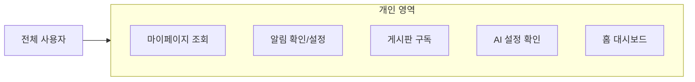

# 개인 영역 유즈케이스

## 비즈니스 목표

| 목표 | 기여하는 UC | 핵심 KPI |
|------|-----------|----------|
| 상담 응대 시간 단축 | UC-PER-01, UC-PER-05 | 문서 재접근 시간, 대시보드→문서 도달 클릭 수 |
| 지식 활용률 향상 | UC-PER-03, UC-PER-05 | 구독률, 홈 위젯 클릭률, 열람 이력 재방문율 |
| 업무 누락 방지 | UC-PER-02 | 알림 확인율, 미처리 승인 건 평균 체류 시간 |
| AI 개인화 만족도 | UC-PER-04 | 개인 설정 활용률, AI 기능 재사용율 |

---

## 개요 다이어그램

> **운영 관리자 참여 범위**: UC-PER-02(알림)만 사용 가능. 마이페이지·구독·대시보드는 UC-ADM-11(통계 대시보드)로 대체하여 의도적으로 제외하였다.

---

## UC-PER-01: 마이페이지 조회

**사용자**: 상담사, 지식 관리자, 승인권자

**사전 조건**:
- 사용자가 로그인되어 있어야 한다.

**기본 흐름**:
1. 사용자가 마이페이지에 접근한다.
2. 시스템이 다음 영역으로 구성된 마이페이지를 표시한다:
   - **내 임시 저장 문서**: 아직 작성 중인 문서 목록 (제목, 대상 게시판, 마지막 수정 시간)
   - **내가 작성한 문서**: 상태별(작성 중, 검토 대기, 게시됨 등)로 필터링 가능한 문서 목록
   - **승인 대기 중인 내 문서**: 내가 승인 요청한 문서 중 아직 처리되지 않은 목록 (현재 진행 단계, 승인권자 정보 포함)
   - **북마크 폴더 및 문서**: 내가 저장해둔 문서 모음 (UC-COM-04)
   - **좋아요한 문서**: 내가 좋아요를 누른 문서 목록 (UC-COM-02)
   - **최근 열람 이력**: 최근에 읽은 문서 기록 (시간순 정렬, 기본 50건 표시)
   - **내 댓글 목록**: 내가 작성한 댓글 모음 (원본 문서 링크 포함, UC-COM-01)
3. 각 영역은 기본 표시 건수(10~20건)로 로드되며, 스크롤 또는 "더보기"를 통해 추가 항목을 불러온다.
4. 사용자가 각 영역의 항목을 클릭하면 해당 문서나 설정 페이지로 이동한다.

**대안 흐름**:
- **2a. 영역별 더보기**: 각 영역에 항목이 많으면 "더보기" 링크를 통해 전체 목록 페이지로 이동한다. 전체 목록 페이지에서는 페이지별 이동 또는 스크롤로 추가 항목을 불러와 탐색한다.
- **2b. 빈 영역 안내**: 해당 영역에 항목이 없으면 역할에 맞는 안내 문구와 바로가기가 표시된다. 예: 상담사에게는 "아직 열람한 문서가 없습니다 — 검색으로 시작하기", 지식 관리자에게는 "아직 작성한 문서가 없습니다 — 새 문서 작성하기".
- **4a. 개인 설정 진입**: 마이페이지에서 검색 기본값, 알림 설정, 프로필 정보 등 개인 설정 화면으로 이동할 수 있다.

**예외 흐름**:
- **2c. 삭제된 문서 참조**: 북마크·좋아요·열람 이력에 포함된 문서가 삭제된 경우, 해당 항목에 "삭제된 문서"로 표시하고 클릭 시 "이 문서는 삭제되었습니다" 안내를 보여준다. 깨진 링크로 노출하지 않는다.
- **2d. 비공개 처리된 문서 참조**: 북마크·좋아요·열람 이력에 포함된 문서가 비공개(긴급 회수 등)로 전환된 경우, "비공개 처리됨"으로 표시하고 클릭 시 "이 문서는 비공개 처리되었습니다" 안내를 보여준다.
- **3a. 대용량 데이터 로드 지연**: 열람 이력이나 북마크가 수천 건 이상인 경우, 각 영역은 최근 항목만 우선 로드하고 나머지는 스크롤 시 추가 로드한다. 로드 중에는 로딩 표시를 보여준다.
- **2e. 일부 영역 데이터 로딩 실패**: 특정 영역(예: 북마크, 승인 대기 등)의 데이터를 불러오는 데 실패한 경우, 해당 영역에 "데이터를 불러올 수 없습니다. 새로고침하거나 잠시 후 다시 시도해주세요" 안내를 표시한다. 나머지 영역은 정상적으로 표시된다 — 한 영역의 장애가 전체 마이페이지를 차단하지 않는다.
- **2f. 권한 변경으로 항목 비노출**: 사용자의 게시판 권한이 변경되어 이전에 접근 가능했던 문서가 더 이상 보이지 않는 경우, 해당 영역에서 접근 불가 항목은 자동으로 숨김 처리된다. 숨겨진 항목이 있을 때 "일부 항목은 접근 권한 변경으로 표시되지 않습니다" 안내를 해당 영역 하단에 표시하여, 사용자가 혼란 없이 상황을 파악할 수 있도록 한다.

**역할별 차이**:
- **상담사**: 대부분의 게시판에서 편집 권한이 없으므로 "내가 작성한 문서", "임시 저장 문서" 영역이 축소 표시된다. 대신 "최근 열람 이력"과 "북마크" 영역이 상단에 배치되어 고객 통화 중 빠른 문서 재접근을 지원한다. "내 댓글 목록"에서 미해결 댓글이 있는 문서를 빠르게 확인할 수 있다.
- **지식 관리자**: "내가 작성한 문서"와 "승인 대기 중인 내 문서" 영역이 상단에 배치되어 관리 작업 중심으로 구성된다. "내 문서의 미해결 댓글" 영역이 추가로 표시되어, 상담사들이 남긴 피드백을 빠르게 확인하고 문서에 반영할 수 있다.
- **승인권자**: "승인 대기 중인 내 문서" 영역에 자신이 요청한 건과 별도로, **자신이 처리해야 할 승인 건** 요약이 강조 표시된다. 승인 건에는 긴급도 표시(SLA 임박 건은 붉은색 강조)가 포함되어 우선 처리할 건을 빠르게 식별할 수 있다.

**사후 조건**:
- 마이페이지 접근 자체로는 데이터가 변경되지 않는다 (조회 전용).
- 개별 항목 클릭으로 문서 페이지에 이동하면 해당 문서의 열람 이력이 갱신된다.

**관련 문서**: FD-COM (북마크·좋아요), FD-AGG (집계·피드) | UC-COM-01 (댓글), UC-COM-02 (좋아요), UC-COM-04 (북마크), UC-DOC-05 (임시 저장)

---

## UC-PER-02: 알림 확인/설정

**사용자**: 전체 사용자 (운영 관리자 포함)

**사전 조건**:
- 사용자가 로그인되어 있어야 한다.

**기본 흐름**:
1. 사용자가 화면 상단의 알림 아이콘을 클릭하여 알림 패널을 연다.
2. 시스템이 최근 알림 목록을 우선순위별로 구분하여 표시한다:
   - **긴급** (붉은색 아이콘): 긴급 회수 알림, SLA 초과 승인 건, 시스템 장애 공지, 보안 관련 알림 등 즉시 확인이 필요한 알림
   - **일반** (파란색 아이콘): 승인 요청/결과, 댓글 알림, 문서 수정 알림 등 업무 처리가 필요한 알림
   - **정보** (회색 아이콘): 구독 게시판 새 문서, 좋아요 알림, AI 요약 완료 등 참고용 알림
   읽지 않은 알림은 시각적으로 구분(굵은 글씨, 배경색 등)되며, 긴급 알림은 항상 목록 최상단에 고정 표시된다.
3. 사용자가 알림을 클릭하면 해당 알림의 대상(문서, 승인 건, 설정 페이지 등)으로 바로 이동한다.
4. 이동과 동시에 해당 알림이 "읽음" 상태로 전환된다.

**대안 흐름**:
- **2a. 전체 읽음 처리**: 사용자가 "전체 읽음 처리" 버튼을 클릭하면 모든 미읽은 알림이 읽음으로 전환된다.
- **2b. 알림 유형별 설정 변경**: 마이페이지 > 알림 설정에서 유형별·채널별로 알림 수신 여부를 설정할 수 있다. 인앱 알림은 항상 수신되며, 이메일·Web Push·웹훅은 유형별로 켜기/끄기가 가능하다.
- **2c. 알림이 없는 경우**: "새로운 알림이 없습니다" 안내가 표시된다.
- **3a. 알림 대상이 삭제된 경우**: 알림이 참조하는 문서나 승인 건이 삭제된 경우, 알림 클릭 시 "이 문서는 삭제되었습니다" 또는 "비공개 처리됨" 안내를 보여주고, 알림 목록에서 해당 알림에 상태를 표시한다.
- **2d. 알림 폭주 시 자동 묶음 처리**: 짧은 시간(예: 10분 이내)에 동일 유형 알림이 다수 발생하면(예: 구독 게시판에 문서 10건 동시 게시), 시스템이 "○○ 게시판에 새 문서 10건이 게시되었습니다" 형태로 알림을 하나로 묶어 표시한다. 묶음 알림을 클릭하면 해당 게시판의 최신 문서 목록으로 이동한다.
- **2e. 알림 수신 시간대 설정 (근무 시간 기반 알림 정책)**: 교대 근무 등 정해진 시간에만 업무를 수행하는 사용자를 위해, 마이페이지 > 알림 설정에서 이메일·Web Push·웹훅의 수신 시간대를 지정할 수 있다.
  - **근무 시간대 설정**: 사용자가 자신의 근무 시간대(예: 09:00~18:00, 22:00~06:00)를 지정한다. 설정된 시간 외에는 이메일·Web Push·웹훅 알림을 발송하지 않고, 인앱 알림만 누적한다.
  - **긴급 알림 예외**: 긴급 우선순위 알림(긴급 회수, 시스템 장애 등)은 근무 시간대 설정과 관계없이 항상 이메일·Web Push로 발송된다. 관리자가 긴급 알림 예외 유형을 설정할 수 있다.
  - **야간 무음 모드**: 야간 시간대(관리자 설정, 예: 23:00~07:00)에는 Web Push 알림 소리가 자동으로 무음 처리된다. 긴급 알림만 소리와 함께 표시된다.
  - **근무 시작 시 요약**: 근무 시작 시간에 맞춰 "비근무 시간 중 N건의 알림이 도착했습니다" 요약 알림이 한 건으로 발송된다. 요약 알림에서 긴급 건은 별도 강조되어 우선 확인할 수 있다.
  - **관리자 일괄 설정**: 운영 관리자가 교대 근무 조별로 알림 수신 시간대를 일괄 설정할 수 있어, 개별 사용자가 일일이 설정하지 않아도 된다.
- **2f. 장기 부재 시 알림 일시 중지**: 사용자가 휴가·출장 등 장기 부재 시 마이페이지 > 알림 설정에서 "알림 일시 중지"를 활성화할 수 있다. 중지 기간 동안 이메일·Web Push·웹훅 알림 발송이 보류되고, 인앱 알림은 계속 누적된다. 부재 종료 후 일시 중지를 해제하면, 중지 기간 중 누적된 알림을 "부재 중 알림" 묶음으로 확인할 수 있다.

**알림 채널** (4채널 — FD-NTF §1.2):
- **인앱 알림**: 화면 상단 알림 패널에 표시된다. 항상 활성화되어 있으며 사용자가 끌 수 없다.
- **이메일 알림**: 사용자의 등록 이메일로 알림 내용이 발송된다. 유형별로 수신 여부를 설정할 수 있다.
- **Web Push (브라우저 푸시 알림)**: 브라우저를 통해 화면을 보고 있지 않을 때도 알림을 받을 수 있다. 유형별로 수신 여부를 설정할 수 있다.
- **웹훅 (외부 메신저 연동)**: Slack, Teams 등 외부 메신저로 알림을 전달할 수 있다. 유형별로 수신 여부를 설정할 수 있다.

**알림 보관 정책**:
- 인앱 알림은 90일 보관 후 자동 삭제된다.
- 이메일·Web Push·웹훅 알림은 발송 후 별도 보관하지 않는다 (발송 기록은 시스템 내부 기록으로만 관리).

**알림 종류**:
- **댓글 관련**: 내 문서에 댓글이 달렸을 때, 내 댓글에 답글이 달렸을 때 (UC-COM-01)
- **승인 관련**: 승인 요청 도착, 승인/반려 결과, 미처리 건 리마인더, 승인 요청 철회 알림 (UC-APR-01~03)
- **참조 관련**: 승인 요청에 참조자로 포함되었을 때의 알림 (UC-APR-01)
- **배포 관련**: 예약 배포 완료 또는 실패 (UC-APR-05)
- **공통 컨텐츠 관련**: 내 문서가 참조하는 공통 컨텐츠(여러 문서에서 공유하는 안내문구, 약관 등)가 수정되거나 사용 중단되었을 때 (UC-ADM-04)
- **AI 검색 반영 관련**: 문서의 AI 검색용 데이터 변환(문서 내용을 AI가 검색할 수 있는 형태로 바꾸는 작업) 완료(여러 건 묶음 알림) 또는 변환 실패
- **임시 저장 관련**: 오래 방치된 임시 저장 문서가 있을 때 (UC-DOC-05)
- **AI 요약 관련**: AI 자동 요약 생성 완료 또는 실패 (UC-AI-01)
- **유효기간 관련**: 내가 작성했거나 편집 권한이 있는 게시판의 문서 유효기간이 만료(또는 만료 임박)되었을 때 (UC-DOC-10) — FD-NTF §1.1 #19에 등록됨
- **구독 관련**: 내가 구독 중인 게시판에 새 문서가 게시되었을 때 (UC-PER-03)

**예외 흐름**:
- **1a. 알림 서비스 장애**: 알림 서비스에 일시적 장애가 발생한 경우, 알림 패널에 "알림을 불러올 수 없습니다. 잠시 후 다시 시도해주세요" 안내가 표시된다. 장애 복구 후 미발송 알림이 순차 발송된다.
- **2g. 대용량 알림 누적**: 알림이 수백 건 이상 쌓인 경우, 최근 알림부터 우선 표시하고 스크롤 시 과거 알림을 추가 로드한다.
- **2h. 동시 도착과 전체 읽음 처리**: 사용자가 "전체 읽음 처리"를 클릭한 시점 이후 도착한 알림은 미읽음 상태로 유지된다.
- **2i. 관리자에 의한 알림 설정 강제 변경**: 운영 관리자가 특정 알림 유형(예: 보안 공지, 긴급 시스템 알림)을 전체 사용자에 대해 강제 활성화하거나 수신 채널을 변경한 경우, 사용자의 개인 알림 설정보다 관리자 설정이 우선 적용된다. 해당 알림 유형의 설정 항목 옆에 "관리자에 의해 설정됨" 표시가 나타나며, 사용자가 직접 변경할 수 없다. 사용자에게 "관리자가 알림 설정을 변경했습니다" 안내 알림이 발송된다.

**사후 조건**:
- 클릭한 알림의 읽음 상태가 갱신된다.
- 알림 설정을 변경한 경우, 변경 내용이 즉시 적용되어 이후 발생하는 알림부터 새 설정이 반영된다.
- 알림 일시 중지를 설정한 경우, 중지 시작 시점부터 이메일·Web Push·웹훅 알림 발송이 보류된다.

**관련 문서**: FD-NTF (알림) | UC-COM-01 (댓글), UC-APR-01~03 (승인), UC-APR-05 (예약 배포), UC-ADM-04 (공통 컨텐츠), UC-DOC-05 (임시 저장), UC-DOC-10 (유효기간), UC-AI-01 (AI 요약), UC-PER-03 (구독)

---

## UC-PER-03: 게시판 구독

**사용자**: 상담사, 지식 관리자, 승인권자

**사전 조건**:
- 사용자가 로그인되어 있어야 한다.
- 해당 게시판에 열람 권한을 가지고 있어야 한다.

**기본 흐름**:
1. 사용자가 게시판 페이지에서 "구독" 버튼을 클릭한다.
2. 시스템이 해당 게시판을 사용자의 구독 목록에 추가한다.
3. "구독 중" 상태로 버튼이 변경되고, "구독이 설정되었습니다" 안내가 표시된다.
4. 이후 해당 게시판에 새 문서가 게시되면 사용자에게 알림이 발송된다 (UC-PER-02).

**대안 흐름**:
- **3a. 구독 해제**: 이미 구독 중인 게시판에서 "구독 해제" 버튼을 클릭하면 구독이 취소되고, 해당 게시판의 새 문서 알림이 더 이상 발송되지 않는다.
- **3b. 마이페이지에서 구독 관리**: 마이페이지 > 구독 관리에서 현재 구독 중인 게시판 목록을 확인하고, 일괄 해제하거나 개별 해제할 수 있다.
- **1a. 구독 게시판의 권한이 해제된 경우**: 게시판 열람 권한이 사라지면 구독은 유지되지만 알림이 발송되지 않는다. 마이페이지 구독 관리에서 "접근 불가" 상태로 표시되며, 사용자가 해당 게시판을 더 이상 열람할 수 없음을 안내한다.
- **2a. 구독 상한 초과**: 사용자가 구독할 수 있는 게시판 수에 상한이 설정되어 있는 경우(관리자 설정), 상한에 도달하면 "구독 가능한 게시판 수를 초과했습니다. 기존 구독을 정리한 후 다시 시도해주세요" 안내가 표시된다.
- **3c. 구독 알림 빈도 설정**: 마이페이지 > 구독 관리에서 게시판별로 알림 빈도를 설정할 수 있다 — "즉시 알림"(새 문서가 게시될 때마다) 또는 "일간 요약"(하루에 한 번 새 문서 목록을 묶어서 알림)을 선택한다.

**예외 흐름**:
- **2b. 구독 게시판 삭제**: 구독 중인 게시판이 삭제된 경우, 구독 목록에서 "삭제된 게시판"으로 표시되며 자동으로 구독이 해제된다. 사용자에게 "구독 중이던 ○○ 게시판이 삭제되어 구독이 해제되었습니다" 알림이 발송된다.
- **2c. 구독 게시판 비활성화**: 운영 관리자가 게시판을 비활성화한 경우, 해당 게시판의 구독은 유지되지만 알림 발송이 중단된다. 마이페이지 구독 관리에서 "비활성화됨" 상태로 표시되며, "이 게시판은 현재 비활성화 상태입니다" 안내가 나타난다. 게시판이 다시 활성화되면 알림이 자동으로 재개된다.
- **2d. 구독 정리 알림**: 접근 불가 또는 비활성화된 게시판 구독이 일정 기간(예: 30일) 이상 지속되면, 시스템이 "정리가 필요한 구독이 있습니다" 알림을 발송하여 사용자가 불필요한 구독을 해제하도록 안내한다.

**사후 조건**:
- 구독/해제 상태가 사용자 개인 설정에 저장된다.
- 구독 중인 게시판에 새 문서가 게시되면, 설정된 알림 빈도에 따라 알림이 발송된다.
- 구독 해제 시 해당 게시판의 새 문서 알림이 즉시 중단된다.

**관련 문서**: FD-AGG (집계·구독) | UC-PER-02 (알림), UC-ADM-01 (게시판 구조)

---

## UC-PER-04: AI 설정 확인

**사용자**: 상담사, 지식 관리자

**사전 조건**:
- 사용자가 로그인되어 있어야 한다.
- AI 기능(요약, 글쓰기 개선 등)이 시스템에서 활성화되어 있어야 한다.

**기본 흐름**:
1. 사용자가 마이페이지 또는 AI 어시스턴트 설정 화면에 접근한다.
2. 시스템이 현재 적용 중인 AI 설정 정보를 표시한다:
   - **시스템 기본 설정**: 전체 시스템에 적용되는 AI 지시문 (조회 전용)
   - **조직 전용 설정**: 우리 조직(회사)에만 적용되는 추가 지시문 (조회 전용)
   - **내 개인 설정**: 본인이 설정한 개인 AI 선호 (편집 가능)
3. 시스템이 각 설정 계층 옆에 현재 적용 우선순위를 안내한다 — 개인 설정이 조직 전용 설정보다 우선하고, 조직 전용 설정이 시스템 기본 설정보다 우선한다. 충돌이 있는 항목은 어느 계층의 설정이 최종 적용되는지 표시된다.
4. 사용자가 개인 설정을 수정하고 저장한다 — 예: "항상 불릿 포인트로 요약해줘", "번역 시 원문도 병기해줘" 등.

**설정 적용 우선순위**:
- 시스템 기본 < 조직 전용 < 개인 설정 (개인이 최우선)
- 충돌 시 개인 설정이 시스템/조직 설정보다 우선 적용된다.
- 예: 시스템에서 "한국어로만 응답"이 설정되어 있더라도, 개인 설정에서 "영어로 응답"을 지정하면 개인 설정이 적용된다.

**대안 흐름**:
- **2a. AI 기능이 비활성화된 경우**: "현재 AI 기능이 제공되지 않는 환경입니다" 안내가 표시된다.
- **4a. 개인 설정 초기화**: 사용자가 개인 설정을 기본값으로 되돌릴 수 있다. 초기화하면 조직 전용 설정 또는 시스템 기본 설정이 그대로 적용된다.
- **3a. 관리자에 의한 설정 강제 변경**: 운영 관리자가 조직 전용 설정이나 시스템 기본 설정을 변경한 경우, 해당 변경이 즉시 모든 사용자에게 반영된다. 개인 설정과 충돌하는 항목이 있으면 설정 화면에서 "관리자 설정이 변경되었습니다. 개인 설정을 검토해주세요" 안내가 표시된다. 관리자가 특정 설정 항목을 잠금 처리(개인 변경 불가)한 경우, 해당 항목 옆에 "조직 정책에 의해 고정됨" 표시가 나타나며 사용자가 수정할 수 없다.
- **4b. 설정 변경 전 미리보기**: 개인 설정을 수정한 후 저장 전에, 변경된 설정이 적용된 AI 결과를 샘플 문서로 미리 확인할 수 있다. 미리보기 결과가 만족스러우면 저장하고, 아니면 추가 조정한다.

**예외 흐름**:
- **2b. AI 서비스 연결 장애**: AI 서비스와 통신이 불가한 경우, 설정 화면은 표시되지만 "AI 서비스에 연결할 수 없어 설정 미리보기를 사용할 수 없습니다" 안내가 표시된다. 설정 저장은 가능하며, 서비스 복구 후 적용된다.
- **4c. 설정 저장 실패**: 네트워크 오류 등으로 설정 저장이 실패한 경우, "설정을 저장할 수 없습니다. 변경 내용이 유지되었으니 다시 시도해주세요" 안내가 표시된다. 사용자가 입력한 내용은 화면에 그대로 유지되어 재입력 없이 다시 저장을 시도할 수 있다.
- **4d. AI 설정 적용 후 오류 발생**: 저장된 개인 설정이 AI 기능 호출 시 오류를 일으키는 경우(예: 상충되는 지시문 조합), 시스템이 해당 설정을 무시하고 조직 전용 또는 시스템 기본 설정으로 대체 적용한다. 사용자에게 "개인 AI 설정 적용 중 문제가 발생하여 기본 설정으로 처리되었습니다. 설정을 확인해주세요" 알림을 발송하고, 설정 화면에서 문제 항목을 안내한다.

**사후 조건**:
- 변경된 개인 설정이 저장되어 이후 AI 기능 호출 시 적용된다.
- 설정 변경 이력이 기록되어, 사용자가 이전 설정으로 돌아갈 수 있다.
- 관리자에 의해 잠금된 설정 항목은 개인 설정으로 변경할 수 없다.

**제약 사항**:
- 시스템 기본 설정과 조직 전용 설정의 변경은 운영 관리자만 가능하다 (UC-ADM-10 참조).
- 일반 사용자는 현재 적용 중인 설정을 확인하고, 개인 선호만 조정할 수 있다.

**관련 문서**: FD-AI (AI 어시스턴트) | UC-ADM-10 (AI 설정 관리), UC-AI-01 (AI 요약), UC-AI-02 (AI 글쓰기 개선)

---

## UC-PER-05: 홈 대시보드 조회

**사용자**: 상담사, 지식 관리자, 승인권자

**사전 조건**:
- 사용자가 로그인되어 있어야 한다.

**기본 흐름**:
1. 사용자가 로그인 후 홈 화면에 접근한다.
2. 시스템이 다음과 같은 정보 카드(위젯)를 표시한다:
   - **내 임시 저장 현황**: 작성 중인 문서가 몇 건인지 (UC-DOC-05)
   - **승인 대기 문서**: 내가 처리해야 하거나 내가 요청한 승인 대기 문서가 몇 건인지 (UC-APR-01~02)
   - **최근 열람 문서**: 최근에 읽은 문서 목록 (최대 5~10건)
   - **인기 문서 Top 5**: 전체에서 가장 많이 읽힌 문서 상위 5개
   - **트렌딩 문서**: 최근 7일(관리자 설정 가능) 동안 조회 수가 평소 대비 급격히 늘어난 문서
   - **구독 게시판 새 문서**: 내가 구독 중인 게시판에 최근 등록된 문서 목록 (UC-PER-03)
3. 각 카드의 항목을 클릭하면 해당 문서나 목록 페이지로 이동한다.

**대안 흐름**:
- **2a. 카드 배치 변경**: 사용자가 정보 카드의 배치를 끌어서 놓기 방식으로 변경하고, 각 카드의 표시 여부를 켜기/끄기 할 수 있다. 변경한 설정은 개인 설정에 저장된다.
- **2b. 승인권자 전용 카드**: 승인 권한이 있는 사용자에게는 "내가 처리할 승인 건" 카드가 추가로 표시된다.
- **2c. 데이터 없는 카드**: 해당 카드에 표시할 데이터가 없으면 "아직 항목이 없습니다" 안내와 함께 관련 기능으로의 바로가기가 표시된다.
- **2d. 관리자 비활성화 카드**: 관리자가 위젯 목록 관리(UC-ADM-17)에서 비활성화한 카드는 사용자의 기존 개인 설정에 포함되어 있어도 홈 화면에서 자동으로 숨김 처리된다.
- **1a. 업무 시작 시 핵심 정보 확인**: 사용자가 하루 업무를 시작할 때, 대시보드에서 승인 대기 건수와 미확인 알림 건수를 먼저 확인한 뒤, 중요 항목을 클릭하여 해당 업무로 바로 진입할 수 있다. 승인 대기 카드에는 긴급 건이 상단에 표시되어 우선 처리를 유도한다.
- **2e. 위젯 데이터 갱신 시점 안내**: 각 위젯에 마지막 데이터 갱신 시각이 표시된다. 사용자가 수동 새로고침 버튼을 클릭하면 최신 데이터를 다시 불러온다.

**예외 흐름**:
- **2f. 개별 위젯 데이터 로드 실패**: 특정 위젯의 데이터를 불러올 수 없는 경우(예: 집계 서비스 장애), 해당 카드에 "데이터를 불러올 수 없습니다" 안내와 "다시 시도" 버튼이 표시된다. 나머지 위젯은 정상 표시된다 — 한 위젯의 장애가 전체 대시보드를 차단하지 않는다.
- **2g. 삭제된 문서 표시**: 위젯에 표시된 문서가 삭제 또는 비공개 전환된 경우, "삭제된 문서" 또는 "비공개 처리됨"으로 상태가 표시된다.
- **1b. 전체 대시보드 로드 실패**: 네트워크 장애 등으로 대시보드 전체를 불러올 수 없는 경우, "홈 화면을 불러올 수 없습니다. 네트워크 연결을 확인하고 다시 시도해주세요" 안내와 새로고침 버튼이 표시된다.

**역할별 대시보드 구성**:
- **상담사**: 고객 응대에 최적화된 구성으로, "최근 열람 문서"와 "인기 문서"가 기본 상단에 배치된다. "내 임시 저장 현황"은 하단 배치(편집 권한이 있는 게시판이 적으므로). 통화 중 빠른 접근을 위해 "최근 열람 문서" 카드에는 문서 미리보기(한줄 요약)가 함께 표시되고, "자주 찾는 문서"(최근 2주간 3회 이상 열람한 문서) 카드가 기본 제공된다.
- **지식 관리자**: 문서 관리 중심으로, "내 임시 저장 현황"과 "승인 대기 문서"가 기본 상단에 배치된다. 추가로 "내 문서의 미해결 댓글" 카드가 제공되어, 상담사 피드백을 빠르게 확인하고 문서 품질을 개선할 수 있다. "만료 예정 문서" 카드를 통해 유효기간이 임박한 문서를 사전에 갱신할 수 있다.
- **승인권자**: 승인 업무 중심으로, "내가 처리할 승인 건"이 최상단에 배치된다. SLA 임박 건은 붉은색으로 강조되고, 처리 기한순으로 정렬되어 우선 처리해야 할 건을 즉시 파악할 수 있다. "승인 대기 문서"에는 내가 요청한 건의 현재 진행 상태도 함께 표시되어 한 화면에서 요청·처리 현황을 모두 파악할 수 있다.

**사후 조건**:
- 대시보드 조회 자체로는 데이터가 변경되지 않는다 (조회 전용).
- 카드 배치를 변경한 경우, 변경된 배치가 개인 설정에 저장되어 다음 접속 시에도 유지된다.

**제약 사항**:
- 사용자는 자신의 위젯 배치/표시(on/off)만 변경할 수 있다.
- 어떤 종류의 위젯이 제공되는지는 관리자의 위젯 목록 관리 설정을 따른다 (UC-ADM-17 참조).

**관련 문서**: FD-AGG (집계·피드·트렌딩) | UC-DOC-05 (임시 저장), UC-APR-01~02 (승인), UC-PER-03 (구독), UC-ADM-17 (위젯 카탈로그)

---

## 대표 업무 시나리오

> 개인 영역 기능들이 실제 업무에서 어떻게 연결되어 사용되는지를 보여주는 대표 시나리오.

### 시나리오 1: 상담사의 일과 시작

1. 상담사가 출근 후 홈 대시보드(UC-PER-05)에 접근한다.
2. "승인 대기 문서" 카드에서 어제 요청한 문서의 승인 상태를 확인한다.
3. 알림 아이콘(UC-PER-02)을 클릭하여 밤사이 도착한 알림(구독 게시판 새 문서, 댓글 답글 등)을 확인한다.
4. 구독 게시판 새 문서 알림을 클릭하여 업무에 필요한 최신 문서를 열람한다.
5. 홈 대시보드의 "인기 문서"에서 최근 동료들이 많이 참고하는 문서를 확인하고 업무에 활용한다.

### 시나리오 2: 교대 근무 상담사의 알림 관리

1. 야간 교대 근무 상담사가 마이페이지 > 알림 설정(UC-PER-02)에서 알림 수신 시간대를 "22:00~06:00"으로 설정한다.
2. 근무 시간 외에는 이메일·Web Push·웹훅 알림이 발송되지 않고, 인앱 알림만 누적된다.
3. 근무 시작 시 알림 패널을 열어 누적된 알림을 한꺼번에 확인하고 업무를 시작한다.

### 시나리오 3: 장기 부재 후 복귀

1. 휴가를 떠나기 전 사용자가 마이페이지 > 알림 설정(UC-PER-02)에서 "알림 일시 중지"를 설정한다.
2. 휴가 기간 동안 이메일·Web Push·웹훅 알림이 발송되지 않아 불필요한 알림을 받지 않는다.
3. 복귀 후 알림 일시 중지를 해제하고, "부재 중 알림" 묶음에서 중요 알림을 우선 확인한다.
4. 마이페이지(UC-PER-01)에서 밀린 승인 대기 건, 미읽은 댓글, 구독 게시판 새 문서 등을 종합적으로 확인한다.

### 시나리오 4: 관리자의 알림 정책 일괄 변경

1. 운영 관리자가 보안 공지 관련 알림을 전체 사용자에 대해 이메일 수신 강제 활성화한다.
2. 기존에 보안 공지 이메일 알림을 끄고 있던 사용자에게도 해당 알림이 이메일로 발송된다.
3. 사용자의 알림 설정 화면(UC-PER-02)에서 해당 항목에 "관리자에 의해 설정됨" 표시가 나타나 변경 사유를 파악할 수 있다.

### 시나리오 5: 대시보드 위젯 부분 장애

1. 집계 서비스에 일시적 장애가 발생하여 "인기 문서 Top 5"와 "트렌딩 문서" 위젯의 데이터를 불러올 수 없다.
2. 해당 위젯에 "데이터를 불러올 수 없습니다" 안내와 "다시 시도" 버튼이 표시된다.
3. 나머지 위젯("내 임시 저장 현황", "승인 대기 문서", "최근 열람 문서", "구독 게시판 새 문서")은 정상적으로 표시되어 업무에 지장을 최소화한다.
4. 장애가 복구되면 사용자가 "다시 시도" 버튼을 클릭하거나 페이지를 새로고침하여 데이터를 확인한다.

### 시나리오 6: 신규 입사자 개인영역 온보딩

1. 신규 입사자가 처음 로그인하면 홈 대시보드(UC-PER-05)에 온보딩 가이드 위젯이 표시된다.
2. 가이드에서 필수 열람 문서 목록, 주요 게시판 구독 안내, 알림 설정 안내가 순서대로 제공된다.
3. 신규 입사자가 업무 관련 게시판을 구독(UC-PER-03)하여 새 문서 알림을 받도록 설정한다.
4. 마이페이지(UC-PER-01)에서 "내 북마크"에 필수 참고 문서를 폴더별로 정리한다.
5. AI 설정(UC-PER-04)에서 개인 선호(요약 방식, 응답 언어 등)를 설정한다.
6. 온보딩 완료 후 가이드 위젯이 자동으로 숨겨지고, 정상 대시보드가 표시된다.

### 시나리오 7: 위임/대결 시 개인영역 활용

1. 승인권자가 휴가를 앞두고 마이페이지(UC-PER-01)에서 "승인 대기 중인 내 문서"를 확인한다.
2. 미처리 승인 건이 있으면 직접 처리하거나, 승인 위임(UC-APR-06)을 설정한다.
3. 알림 설정(UC-PER-02)에서 "알림 일시 중지"를 활성화하여 부재 기간 중 불필요한 알림을 차단한다.
4. 복귀 후 "부재 중 알림" 묶음에서 위임자가 처리한 건과 미처리 건을 한눈에 확인한다.

### 시나리오 8: 규제 대응 — 개인 활동 이력 감사

1. 컴플라이언스 담당자가 특정 사용자의 시스템 활동 이력을 조회해야 하는 경우 (내부 감사, 규제 감사 등).
2. 운영 관리자가 관리자 대시보드에서 해당 사용자의 활동 이력(열람, 검색, 댓글, 승인 처리, 알림 확인 등)을 기간별로 조회한다.
3. 특정 문서에 대한 열람·수정·승인 참여 이력을 추적한다.
4. 조회 결과를 CSV/PDF로 내보내기하여 감사 증빙 자료로 활용한다.
5. 개인 활동 이력 조회 자체도 감사 로그에 기록된다.

### 시나리오 9: 고객 통화 중 홈 대시보드 활용

1. 상담사가 고객 통화 중 빠르게 관련 문서에 접근해야 한다.
2. 홈 대시보드(UC-PER-05)의 "최근 열람 문서" 카드에서 직전에 참조한 문서를 바로 재접근한다.
3. "인기 문서 Top 5" 카드에서 동료들이 자주 참조하는 문서를 확인한다.
4. 대시보드에서 문서를 클릭하면 즉시 문서 상세 페이지로 이동하여 고객에게 안내한다.

---

## 현업 업무 흐름 보충

> 위 시나리오에 추가하여, 개인영역 기능이 현업 업무 환경에서 활용되는 주요 패턴을 정리한다.

### 교대 근무 인수인계 체계

교대 근무 환경에서 개인영역 기능이 인수인계를 지원하는 상세 패턴:

1. **퇴근 전 정리**: 퇴근하는 상담사가 마이페이지(UC-PER-01)에서 미완료 작업(임시 저장 문서, 승인 대기 건)을 확인하고 인수인계 문서에 포함시킨다.
2. **알림 시간대 설정**: 야간 교대 상담사가 알림 수신 시간대를 "22:00~06:00"으로 설정하여 근무 시간에만 알림을 받는다 (UC-PER-02).
3. **인수인계 구독**: 인수인계 전용 게시판을 "즉시 알림"으로 구독하여 교대 시 즉시 확인한다 (UC-PER-03).
4. **대시보드 맞춤**: 교대 근무자가 홈 대시보드(UC-PER-05)에 "구독 게시판 새 문서" 카드를 상단에 배치하여 교대 사항을 먼저 확인한다.

### 금융권 컴플라이언스 담당자의 개인영역 활용

1. 컴플라이언스 담당자가 규제 관련 게시판을 모두 구독(UC-PER-03)하여 규정 변경 문서가 게시될 때 즉시 알림을 받는다.
2. 마이페이지(UC-PER-01)에서 "승인 대기 중인 내 문서"를 확인하여 규제 관련 승인 건을 우선 처리한다.
3. 북마크(UC-COM-04)에 규제 근거 문서를 "규제/컴플라이언스" 폴더로 분류하여 감사 시 빠르게 참조한다.

---

## 운영 시나리오

> 아래는 개인영역 기능 운영 중 발생할 수 있는 장애·긴급 상황에서 관리자가 취할 수 있는 조치를 정리한 것이다.

### OPS-PER-01: 알림 서비스 장애 시 관리자 조치

**상황**: 알림 서비스에 장애가 발생하여 인앱·이메일·Web Push·웹훅 알림이 발송되지 않는 경우.

**관리자 조치 흐름**:
1. 시스템이 알림 발송 실패율 급증을 감지하고, 운영 관리자에게 (대체 채널로) 장애 알림을 발송한다.
2. 운영 관리자가 관리자 대시보드에서 알림 서비스 상태를 확인한다.
3. 운영 관리자가 긴급 조치를 수행한다:
   - **알림 큐 재처리**: 미발송된 알림을 일괄 재발송한다.
   - **알림 캐시 초기화**: 알림 패널 표시 오류 시 캐시를 초기화한다.
   - **알림 채널별 상태 확인**: 인앱/이메일/Web Push/웹훅 각 채널의 개별 상태를 진단한다.
4. 장애 복구 후, 장애 기간 중 미발송된 알림을 순차 발송하되, 너무 오래된 알림(예: 24시간 이상)은 묶음 알림으로 요약 발송한다.
5. 장애 대응 이력이 감사 로그에 기록된다.

### OPS-PER-02: 개인영역 핵심 KPI 및 임계치

| KPI | 설명 | 임계치 예시 |
|-----|------|------------|
| 알림 발송 성공률 | 전체 알림 중 정상 발송된 비율 | 99% 미만 시 경고 |
| 알림 확인율 | 발송된 알림 중 사용자가 확인(읽음)한 비율 | — |
| 미확인 알림 평균 건수 | 사용자당 미읽은 알림 평균 수 | 100건 초과 시 묶음 처리 검토 |
| 대시보드 로드 시간 (p95) | 홈 대시보드 로딩 95번째 백분위 시간 | 3초 초과 시 경고 |
| 마이페이지 로드 시간 (p95) | 마이페이지 로딩 95번째 백분위 시간 | 3초 초과 시 경고 |
| 구독 활용률 | 전체 사용자 대비 1개 이상 게시판 구독 비율 | — |
| 알림 일시 중지 활용률 | 부재 시 알림 일시 중지 설정 비율 | — |

임계치를 초과하면 운영 관리자에게 설정된 채널로 알림이 발송된다.

### OPS-PER-03: 개인영역 긴급 조치 도구

| 도구 | 설명 | 사용 시나리오 |
|------|------|-------------|
| 알림 큐 재처리 | 미발송 알림을 일괄 재발송 | 알림 서비스 장애 복구 후 |
| 알림 캐시 초기화 | 알림 패널 캐시를 초기화 | 알림 표시 오류 시 |
| 대시보드 캐시 초기화 | 홈 대시보드 위젯 데이터 캐시를 초기화 | 위젯 데이터 불일치 시 |
| 사용자 알림 설정 초기화 | 특정 사용자의 알림 설정을 기본값으로 복원 | 설정 오류로 알림 수신 불가 시 |
| 위젯 데이터 강제 갱신 | 특정 위젯의 데이터를 강제로 최신화 | 집계 서비스 연동 오류 시 |
| 구독 정보 정합성 검증 | 구독 게시판의 존재/활성 상태와 구독 정보 일치 여부 검증 | 게시판 삭제/비활성화 후 |

### OPS-PER-04: 장애 에스컬레이션 흐름

1. **자동 감지**: 시스템이 알림 발송 실패율·대시보드 응답시간 이상을 감지한다.
2. **1차 알림**: 운영 관리자에게 장애 알림이 발송된다.
3. **1차 조치**: 운영 관리자가 캐시 초기화, 큐 재처리 등 긴급 조치를 수행한다.
4. **2차 에스컬레이션**: 설정된 시간(예: 15분) 내 해소되지 않으면 시스템 관리자에게 알림이 발송된다.
5. **3차 에스컬레이션**: 설정된 시간(예: 30분) 내 해소되지 않으면 경영진에게 보고한다.
6. 장애 해소 후 관리자가 장애 보고서를 작성한다.

### OPS-PER-05: 유지보수 모드 — 정기 점검 시 개인영역 기능 제한

1. 점검 중 알림 발송이 보류되고, 마이페이지·대시보드는 캐시 기반으로 읽기 전용 제공된다.
2. 개인 설정 변경(알림 설정, AI 설정, 위젯 배치 등)이 비활성화된다.
3. 사용자에게 "시스템 점검 중입니다. 일부 기능이 제한됩니다" 배너가 표시된다.
4. 점검 완료 후 보류된 알림이 순차 발송되고, 설정 변경 기능이 복원된다.

### OPS-PER-06: 장애 복구 후 데이터 정합성 검증

1. 운영 관리자가 "개인영역 정합성 검증" 기능을 실행한다.
2. 시스템이 다음 항목을 자동 검증한다:
   - 알림 발송 기록과 실제 알림 도달 상태의 일치 여부.
   - 구독 중인 게시판의 존재/활성 상태와 구독 정보의 일치 여부.
   - 대시보드 위젯 데이터와 원본 데이터(승인 대기 건수, 임시 저장 수 등)의 일치 여부.
   - 알림 일시 중지 설정의 정상 동작 여부.
3. 불일치가 발견되면 관리자에게 보고하고, 자동 수정 또는 수동 조치 대상 목록을 제공한다.
4. 검증 이력이 감사 로그에 기록된다.

### OPS-PER-07: 관리자 조치 이력 관리

운영 관리자가 수행한 모든 개인영역 관련 조치(알림 강제 발송, 설정 초기화, 캐시 초기화 등)는 감사 로그에 자동 기록된다:

- **기록 항목**: 조치 유형, 조치자, 대상 사용자/기능, 조치 시각, 조치 사유, 조치 결과.
- **조회**: 운영 관리자가 관리자 대시보드에서 기간·조치 유형별로 이력을 필터링하여 조회할 수 있다.
- **내보내기**: 조치 이력을 CSV/PDF로 내보내기하여 감사 증빙이나 사후 분석에 활용한다.
- **보관 기간**: 개인영역 관련 조치 이력은 관리자가 설정한 기간(최소 5년) 동안 보관된다.
